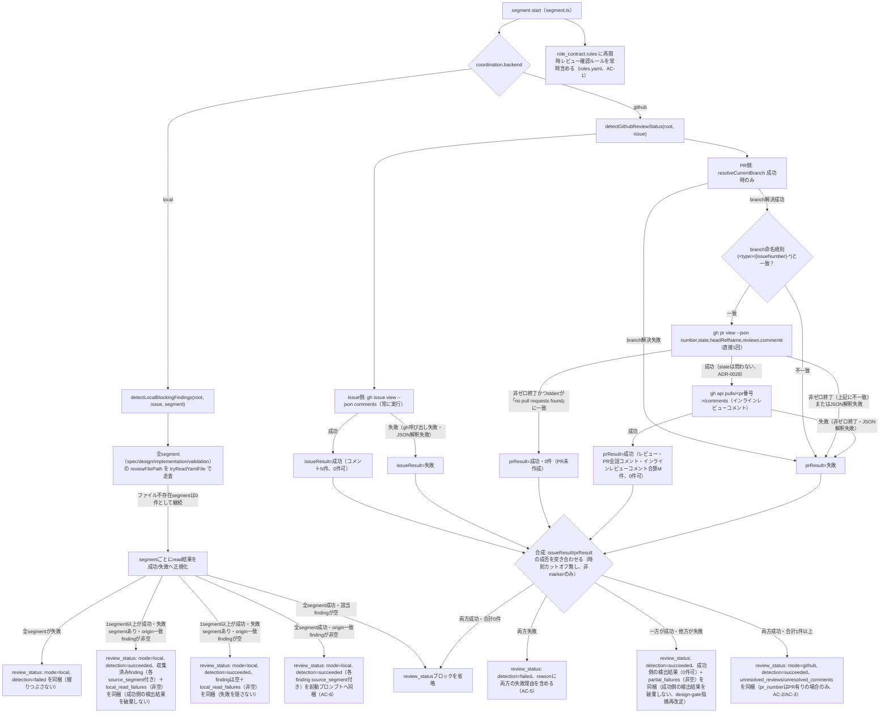

# DESIGN: bugfix: resumeしたsegment workerがPR/Issueのレビューフィードバックを一切参照せず静的completion checklistだけで完了と自己判定する

- Issue: `ISSUE-446`
- 対応する SPEC: `SPEC.md`

## 要件 → 設計要素の対応表

| 要件 / AC-ID | 対応する設計要素 | 備考 |
|---|---|---|
| AC-1（全セグメント作業ワーカー（spec_worker/design_worker/implementation_worker/validation_worker）のrole_contractに再開時レビュー確認ルールが常に含まれる。SPEC.md AC-1が対象を明示的にこの4ワーカーへ限定しており、`adr_finalization_worker`等の他roleは対象外） | `.agent-skill-chain/config/roles.yaml` の `role_contracts.{spec_worker,design_worker,implementation_worker,validation_worker}.rules` への静的行追加 | backend・検出成否に関わらず常に含まれる最小対応（SPEC要件1）。既存の `loadRoles`／`toYamlString` 経路をそのまま通るため新規コードは不要。 |
| AC-2（GitHubモード：未対応レビューの検出・同梱） | `src/lib/review-status.ts`（新規）`detectGithubReviewStatus()` の `unresolved_reviews` | `gh pr view <pr> --json ...,reviews`（reviewer毎の最新1件のみを返す`latestReviews`は用いない。全レビュー提出履歴を返す`reviews`を用いる）を用いる。reviewerごとに`state`が`APPROVED`または`CHANGES_REQUESTED`である提出のみを対象に時系列で最新の1件を求め（`COMMENTED`提出はこの時系列比較から除外し、無視する）、その最新提出が`CHANGES_REQUESTED`であるreviewerのみを「未対応」とみなす（下記「未対応の判定基準」参照、ADR-0027、implementation-gate blocking finding `LATEST-REVIEWS-MASKS-CHANGES-REQUESTED`是正）。未対応と確定したreviewerについては、その`CHANGES_REQUESTED`提出より後に提出された最新の`COMMENTED`本文があれば`latest_comment_body`（任意項目）として同一エントリへ追加する（下記「未対応の判定基準」参照、ADR-0028、design-gate finding `LATEST_COMMENTED_REVIEW_BODY_DROPPED_FOR_UNRESOLVED_REVIEWER`是正）。`gh pr view`が成功した場合、PRの`state`（OPEN/CLOSED/MERGED）に関わらずレビューを処理する（下記「検出失敗（GitHubモード）」参照、ADR-0028、design-gate finding `CLOSED_PR_FEEDBACK_SILENTLY_DISCARDED`是正）。 |
| AC-3（対象Issue/PRの未対応コメントの検出） | 同モジュール `detectGithubReviewStatus()` の `unresolved_comments` | PR会話コメント（`gh pr view --json comments`）、Issueコメント（`gh issue view --json comments`）、PRのインラインレビューコメント（差分行に紐づくreview thread comment、`gh api repos/{owner}/{repo}/pulls/<pr番号>/comments`、REST API）の3種を対象にし、定型marker始まりでないものはすべて「未対応」とみなす（時刻カットオフは行わない。下記「未対応の判定基準」参照、ADR-0026・ADR-0027）。Issueコメントの取得はPRの存在・解決に依存しない独立した経路とする（Issueは常にPRより先に存在するため。下記「Issue側／PR側の分離」参照）。インラインレビューコメントの取得はPR解決成功時のみ実行する（下記「未対応の判定基準」参照、ADR-0027、implementation-gate blocking finding `REVIEW-THREAD-COMMENTS-NOT-FETCHED`是正）。 |
| AC-4（誤検出しない） | 同モジュールの判定ロジック自体（`state !== 'CHANGES_REQUESTED'` を除外・`<!-- agent-skill-chain:`定型marker始まりのコメントを除外）が、`unresolved_reviews`/`unresolved_comments`/`unresolved_blocking_findings`が全て0件かつ`partial_failures`/`local_read_failures`も存在しない場合に限り返り値そのものを`undefined`にする。`src/commands/segment.ts`はこの返り値が`undefined`か否かのみでブロックを省略するかを決め、`partial_failures`等の内容自体は判定しない（下記「合成規則」「責務集中の確認」参照） | 「対応が必要な既存レビューが存在する」という虚偽の通知を作らないためには、該当が無い場合にセクション自体を出力しないのが最も確実（`buildIssueBlock` が採る既存パターンと同じ方針）。marker除外の根拠は「未対応の判定基準」節参照。時刻カットオフを廃止したため「過去に存在したコメントを繰り返し示さない」ことは要求しない（AC-4は「コメントが実際に存在しない場合の誤検出禁止」のみを要求、ADR-0026）。`partial_failures`/`local_read_failures`が非空の場合は`unresolved_*`が0件であってもセクションを省略しない（下記「AC-4との関係」参照、design-gate指摘是正）。 |
| AC-5（検出失敗時の安全側継続） | 同モジュールが `gh` 呼び出し失敗・JSON解釈失敗を、他方の経路が成功していれば `{ detection: 'succeeded', ..., partial_failures: [...] }` の一部として、両方失敗していれば `{ detection: 'failed', reason }` として明示的に返す。ローカルモードも対称に、1segmentでも読み込みに成功していれば `{ detection: 'succeeded', ..., local_read_failures: [...] }`、全segment読み込み失敗時のみ `{ detection: 'failed', reason }` を返す。`segment start`（`src/commands/segment.ts`）は例外を投げずこの値をそのままプロンプトへ含め、AC-1の静的ルール追加（roles.yaml）とは独立に動作を継続する | 「握りつぶし」には2種類ある——(1) 検出失敗を「未検出（＝レビュー無し）」として扱うこと、(2) 一方（または一部）の経路が失敗した際に、既に他の経路で検出済みのフィードバックまで一緒に破棄すること。本設計はいずれも行わない（下記「Issue側／PR側の分離」「ローカルモードのgate report読み込み失敗」の合成規則参照、design-gate指摘・ADR-0026再改定）。加えて、branchが対象Issueに紐づくものであることの検証（下記「検出失敗（GitHubモード）」参照）も同じ安全側原則の適用範囲であり、対象Issueと無関係なbranchへの誤解決を「PR未作成」に偽装しない（design-gate指摘、2026-08-05再改定）。AC-4の「誤検出しない」とは競合しない（失敗は「無い」ではなく「わからない」として区別する）。 |
| AC-6（ローカルモード：gate-report上の未解決blocking findingの検出・同梱） | 同モジュール `detectLocalBlockingFindings()` | `spec`/`design`/`implementation`/`validation` 全segmentのgate report（`reviews/<segment>.yaml`、`src/lib/local-state.ts` の `reviewFilePath()`）を走査し、`gate.blockers` のうち `origin` が起動対象segment（差し戻し先）に対応する値（`spec`→`specification`、他は同名）と一致する `blocking` findingを収集する。AGENTS.mdが定めるorigin基準の差し戻し（他segment起因のblocking findingを差し戻し先が読む）を機械的に成立させるため、同名gate reportのみの走査では不十分（ADR-0026）。収集した各findingには由来segment名を`source_segment`として付加する（下記「ローカルモードのgate report走査」参照、design-gate指摘`LOCAL_FINDING_PROVENANCE_LOST`是正）。 |
| AC-7（実地再現シナリオでの言及付き完了判定） | 上記AC-2/AC-3/AC-5の実装が土台となる。設計要素自体は追加しない（実装・独立検証セグメントでworker-launch.shの実起動を通じて確認するhybrid検証） | SPEC「検証方法見込み: hybrid」のとおり、本ACは自動テストだけでなく実際のworker起動ログの確認を要する。DESIGN/PLANでは対応する自動化可能な設計要素（AC-2/3/5）を確実に満たすことが前提条件になる。`worker-launch.sh` はadapter（`.agent-skill-chain/adapters/{claude,codex,human}.sh`）の `launch_worker()` を呼び出し、`launch_worker()` は起動対象workerへ渡すprompt本文を得るために `_asc_cli segment start <issue_id> <segment>` を呼ぶ（`claude.sh` の `launch_worker()` で確認済み。既存・変更なし）。したがってresumeされたworkerへの`review_status`同梱は、通常の`segment start`呼び出し経路と完全に同一であり、resume専用の別経路は存在しない（design-gate指摘、2026-08-05）。 |

## 責務・境界

### コンポーネント構成

- `roles.yaml`（`.agent-skill-chain/config/roles.yaml`）: 4ワーカー共通の静的ルール文字列を保持するだけの宣言的データ。ロジックを持たない（AC-1）。
- `review-status.ts`（`src/lib/review-status.ts`、新規）: Coordination Backend（GitHub API／ローカルgate-report）から「未解決のレビューフィードバック」を検出し、プロンプトへ埋め込み可能な構造化データへ変換する責務のみを持つ。GitHub呼び出し（`gh`）・ローカルYAML読み込みの2つの入力源を抽象化し、`segment.ts` へは判定済みの結果だけを返す。コメント時刻カットオフを廃止した（ADR-0026）ため、`git` 呼び出し（commit時刻取得）は本モジュールの入力源から完全に除外する——`since` に相当する値は判定にも出力にも用いない。
- `segment.ts`（`src/commands/segment.ts`）: 既存の `buildIssueBlock`（ローカルモードのtitle/request同梱）と同列に、`review-status.ts` の結果をYAML整形して起動プロンプトへ連結するだけのオーケストレーション責務。判定ロジック自体は持ち込まない。
- `gh-open-pr.ts`（`src/lib/gh-open-pr.ts`、既存・変更なし）: release bump（Issue #196）・root-cleanup run（Issue #208）が使う既存関数 `findOpenPrByHead()` は変更しない。`review-status.ts` はこの関数を経由しない——`findOpenPrByHead()` は「PR未作成」と「`gh pr view`呼び出し自体の失敗」を区別しない`undefined`を返す既存契約であり、本モジュールはこの2ケースを区別する必要があるため（下記「未対応の判定基準」参照、design-gate指摘・ADR-0026再改定）。PR解決は `review-status.ts` 内で `gh pr view <branch> --json number,state,headRefName,reviews,comments` を直接1回呼び、終了コード・stderr・JSONを自前で解釈する（`latestReviews`ではなく`reviews`を使う理由は下記「未対応の判定基準」参照、2026-08-05再改定、ADR-0027）。この呼び出しが成功すればPRのstateを問わず続けて`gh api repos/{owner}/{repo}/pulls/<pr番号>/comments`（REST API）でインラインレビューコメントを取得する（同節参照、2026-08-05再改定、ADR-0028）。
- `worktree.ts`（`src/lib/worktree.ts`、既存・変更なし）: 現在の作業ブランチ名解決に既存の `resolveCurrentBranch()` をそのまま再利用する。
- `local-state.ts`（`src/lib/local-state.ts`、既存・変更なし）: ローカルモードのgate-reportパス解決に既存の `reviewFilePath()` をそのまま再利用する。

責務集中の確認（反証観点）: GitHub API呼び出し・ローカルYAML読み込み・「未対応」の判定基準（CHANGES_REQUESTED判定／定型marker除外／origin一致フィルタ）はすべて `review-status.ts` 1箇所に閉じ込め、`segment.ts` は「結果を埋め込むかどうか（空なら省略）」というプレゼンテーション層の判断だけを行う。判定基準を変更する際に `segment.ts` を触る必要が無いようにする。

### 未対応の判定基準（設計判断）

SPEC.mdは「未対応のレビュー・コメント」の検出を要求するが、GitHubのコメントAPI自体には「対応済み/未対応」を表すフラグが無いため、機械的に判定可能な基準を本設計で確定する。本節の基準はADR-0025→ADR-0026→ADR-0027→ADR-0028の置き換えを反映した最新版であり、ADR-0025が採用していた「対象ブランチの最新commit時刻より後」というコメント時刻カットオフは廃止済み（理由は下記参照）、ADR-0026が採用していたレビュー判定基準（`latestReviews`の`state === 'CHANGES_REQUESTED'`）はADR-0027でさらに置き換え、ADR-0027が採用していたPRの`state`による「PR未作成」同一視はADR-0028で撤廃した（理由は次項以降）。

- **レビュー（AC-2、2026-08-05再改定、implementation-gate blocking finding `LATEST-REVIEWS-MASKS-CHANGES-REQUESTED`是正、ADR-0027）**: ADR-0026時点の基準（`gh pr view --json latestReviews`のうち`state === 'CHANGES_REQUESTED'`のものを未対応とみなす）には実在する欠陥があった。`latestReviews`はreviewer毎に「直近の提出」1件だけを返すため、reviewer-aが`CHANGES_REQUESTED`を提出した後、同じreviewer-aが（`APPROVED`ではなく）`COMMENTED`を追加提出すると、GitHub上はそのreviewerの変更要求が解除されていないにもかかわらず、`latestReviews`ではそのreviewerの状態が`COMMENTED`として観測され、`unresolved_reviews`から消える（未対応レビューの見失い、本Issueが解消対象とする失敗モードそのもの）。
  - **検討した代替案とその却下理由**: `gh pr view --json reviewDecision`（GitHub自身が計算する権威ある`APPROVED`/`CHANGES_REQUESTED`/`REVIEW_REQUIRED`フィールド）を判定基準に採用する案を検討したが、本リポジトリ自身のPR #447に対する実機確認（`gh pr view 447 --json reviewDecision`）で空文字列が返ることを確認した。原因は本リポジトリの`main`ブランチに「レビュー必須」のbranch protectionが設定されていないこと（`gh api repos/.../branches/main/protection`が404 `Branch not protected`を返す）で、GitHubは必須レビュー設定が無いリポジトリでは`reviewDecision`を計算しない。`reviewDecision`を判定基準に採用すると、consumer projectを含め「レビュー必須のbranch protectionを設定していないリポジトリ」全てで`unresolved_reviews`が常に空になり、本Issueが解消対象とする失敗モードより深刻な退行（未対応レビューの完全な握りつぶし）を静かに再導入する。したがって`reviewDecision`は採用しない。
  - **採用する基準**: `gh pr view <pr> --json ...,reviews`（`latestReviews`ではなく全レビュー提出履歴を返す`reviews`。`gh` CLI実測で`author`/`state`/`body`/`submittedAt`等を含むことを確認済み）を取得する。reviewerごとに、`state`が`APPROVED`または`CHANGES_REQUESTED`である提出のみを対象に`submittedAt`昇順で最新の1件を求める（`COMMENTED`提出はこの比較対象から除外し無視する——GitHub上、`COMMENTED`の追加提出は同一reviewerの`CHANGES_REQUESTED`を解除しないため、時系列比較の対象に含めると誤って解除されたと判定してしまう）。この最新提出が`CHANGES_REQUESTED`であるreviewerのみを「未対応」とみなし、そのreviewerの当該レビュー本文を`unresolved_reviews`へ含める。この基準はGitHub自身の`gh` CLIやbranch protection設定に依存せず、レビュー提出履歴のみから自己完結して計算できる。
  - **既知の限界**: reviewerが自身の`CHANGES_REQUESTED`提出をGitHub UI上で「dismiss（却下）」した場合、`reviews`配列上はそのレビューの`state`が引き続き`CHANGES_REQUESTED`のまま残る（GitHub REST/GraphQL APIはdismiss操作を別イベントとして扱い、本設計が参照する`gh pr view --json reviews`の`state`フィールド単体では区別できない）。この場合、本設計は当該レビューをdismiss後も「未対応」として再掲し続ける（過検出）。これはコメント側の時刻カットオフ廃止と同種のトレードオフ（見せすぎる方が安全側、AGENTS.md I8）であり、AC-4が要求する「レビュー・コメントが実際に存在しない場合の誤検出禁止」には抵触しない（dismissされたレビュー自体は実在するため）。
  - **未対応reviewerの補足コメント本文（新設、2026-08-05再改定、design-gate finding `LATEST_COMMENTED_REVIEW_BODY_DROPPED_FOR_UNRESOLVED_REVIEWER`是正、ADR-0028）**: 上記の時系列比較で`COMMENTED`提出を除外する設計自体は変更しない（除外しない場合、`COMMENTED`が`CHANGES_REQUESTED`を解除したと誤判定してしまうため。ADR-0027 Context節参照）。しかし、既に「未対応」と確定したreviewerが、その`CHANGES_REQUESTED`提出より後に`COMMENTED`（是正案への追加指摘等）を提出していた場合、当該本文は`unresolved_reviews`のどこにも現れず失われていた。reviewerごとに、未対応と確定した後（`CHANGES_REQUESTED`提出の`submittedAt`より新しい）の`COMMENTED`提出のうち最新の1件があれば、その本文を同一エントリの`latest_comment_body`（任意項目）として追加する。この追加は「誰が未対応か」の判定結果を一切変えない——`COMMENTED`のみを提出した（または`CHANGES_REQUESTED`後に`APPROVED`を提出した）reviewerを新たに未対応にすることはない。
- **コメント（AC-3）**: 単純コメント（Issue/PRいずれも）には状態フラグが無く、時刻カットオフ（「対象ブランチの最新commit時刻より後」）を採用すると、「レビュアがコメント投稿→workerが未対応のまま無関係な別のcommitを実行→再開時にはそのコメントがcutoff以前となり消える」という取りこぼしが発生する（ADR-0025のConsequences節が既知の限界として明示し、implementation-gateが実際に検出。ADR-0026参照）。これは本Issueが解消対象とする「commit済みであることのみを根拠に完了と判定する」失敗モードを検出機構自身が再導入するため、時刻カットオフ自体を廃止する。定型marker（下記）で始まらないコメントは、作成時刻に関わらず常に「未対応」とみなす。コメント判定はcommit時刻を一切参照しないため、`git`呼び出し（`git log -1`等）は本モジュールに一切登場しない（依存関係節参照、design-gate指摘、2026-08-05）。コメントのスレッド解決状態（resolved/unresolved、GraphQL専用）までは扱わない——下記「対象外」のとおり、機械的に判定可能な最小基準に留める。レビューの`state === 'COMMENTED'`（Comment種別で提出されたレビュー本文）の検出も同様に対象外とする（SPEC.md AC-2のGiven節が`CHANGES_REQUESTED`状態のみを対象と定めるため。下記「対象外」参照）。
- **インラインレビューコメント（review thread comment）の取得（AC-3、2026-08-05再改定、implementation-gate blocking finding `REVIEW-THREAD-COMMENTS-NOT-FETCHED`是正、ADR-0027）**: `gh pr view --json comments`が返すのはPRのissueレベル会話コメントのみで、差分行に紐づくインラインレビューコメント（review thread comment）は含まれない。レビュアが差分行へインラインコメントで修正依頼を残し、レビュー本文を空のまま`COMMENTED`/`CHANGES_REQUESTED`で提出した場合、この指摘はissueレベルコメント・レビュー本文のいずれからも取得できず、本Issueが解消対象とする「未対応のレビューフィードバックの見落とし」がそのまま再現する。SPEC.md「スコープ外」節が対象外とするのは「コメントのスレッド解決状態（resolved/unresolved、GraphQL専用）」の判定のみであり、インラインコメント自体の存在・内容の検出は対象外に含まれないため、本設計はこれを検出対象に含める（design-gate指摘を受けた確定）。PR解決（branch解決成功・対象Issue紐づけ検証・`gh pr view`成功）ができた場合に限り、`gh api repos/{owner}/{repo}/pulls/<pr番号>/comments`（REST API、既存の`paged()`パターン——`src/commands/bootstrap.ts`の`pagedCheckRuns()`等と同様に`per_page=100&page=N`を`length < 100`になるまで反復——と同一の呼び出し形）を追加で1回以上呼び、返る各要素の`body`/`user.login`/`created_at`/`html_url`を、PR会話コメントと同じ「定型marker除外・時刻カットオフ無し」基準で`unresolved_comments`（`source: 'review_thread_comment'`）へ統合する。このAPI呼び出しが失敗した場合（非ゼロ終了・JSON解釈失敗）は、PR側検出全体を失敗として扱う（下記「検出失敗（GitHubモード）」の合成規則にそのまま合流させ、新しい失敗カテゴリは追加しない）。
- **Issue側／PR側の分離（AC-3関連の設計判断）**: GitHubモードではIssueは常にPRより先に存在する（`SPEC.md`作成→spec segment初回起動の時点でIssueは既に存在するが、Draft PRはspec workerがcheckpointをpushした後にしか作られない）。従来案のように「`resolveCurrentBranch`→`findOpenPrByHead`でPRが見つからなければIssueコメント取得も含め`review_status`全体を省略する」設計では、Draft PR作成前に進行役がIssueへ投稿した修正依頼コメントが一切検出できず、本Issueが解消対象とする失敗モードが残る（design-gate指摘、2026-08-05）。これを避けるため、`detectGithubReviewStatus()` は次の2経路を独立に実行し、結果を合成する。
  1. **Issue側（常に実行）**: `gh issue view <issueNumber> --json comments` を呼び、対象Issueのコメントを取得する。branch解決・PR解決の成否に関わらず必ず実行する。
  2. **PR側（branch解決に依存）**: `resolveCurrentBranch()` が成功した場合のみ、まず下記「branchが対象Issueに紐づくものであることの検証」を行い、一致する場合に限り `gh pr view <branch> --json number,state,headRefName,reviews,comments`（`latestReviews`ではなく`reviews`、2026-08-05再改定、ADR-0027）を直接1回呼び、レビュー・PR会話コメントを取得する。`findOpenPrByHead()`（`src/lib/gh-open-pr.ts`）は経由しない——同関数は「PR未作成」と「`gh pr view`呼び出し自体の失敗」を区別しない`undefined`を返す既存契約であり、本経路ではこの2ケースを区別する必要があるため（下記「検出失敗（GitHubモード）」参照、design-gate指摘・ADR-0026再改定）。上記が成功した場合（PRのstateは問わない、2026-08-05再改定、ADR-0028）、続けて`gh api repos/{owner}/{repo}/pulls/<pr番号>/comments`（REST API）を呼びインラインレビューコメントを取得する（上記「インラインレビューコメント（review thread comment）の取得」参照）。
  - **合成規則（部分障害時も検出済み情報を保持する、design-gate指摘・2026-08-05再改定）**: Issue側・PR側それぞれの結果を「成功（0件以上のデータを実際に取得できた。PR側の『PR未作成』も非失敗の成功として扱う）」「失敗（`gh`非ゼロ終了・JSON解釈失敗・branch解決失敗）」のいずれかに正規化したうえで合成する。
    - **両方成功**: Issue側コメント・PR側コメント・PR側レビューを合成する。合計が0件なら`undefined`（AC-4、セクション省略）、1件以上なら`mode: 'github', detection: 'succeeded'`（`partial_failures`は省略、またはキー自体を持たない）を返す。
    - **一方が成功・他方が失敗（新設、直前の設計では両方の検出結果を握りつぶし`detection: 'failed'`のみを返していたが、これは成功側で実際に検出済みの未対応フィードバックまで破棄してしまい、本Issueが解消対象とする失敗モードを合成ロジック自身が再導入していた——design-gate blocking finding `PARTIAL_FAILURE_DISCARDS_DETECTED_FEEDBACK`／`PARTIAL_SUCCESS_DISCARDED_ON_ONE_SIDE_FAILURE`）**: `mode: 'github', detection: 'succeeded'` とし、成功した側で実際に検出した`unresolved_reviews`/`unresolved_comments`（0件でもよい）をそのまま含めたうえで、`partial_failures: [{ side: 'issue' | 'pr', reason }]`（非空、1要素）を付加する。失敗自体を隠さない（AC-5）ことと、成功側の検出結果を破棄しない（AC-2/AC-3）ことを両立する。この場合、`unresolved_reviews`/`unresolved_comments`が両方とも0件であっても、`partial_failures`が非空である限りセクションを省略しない（下記「AC-4との関係」参照）。
    - **両方失敗**: `mode: 'github', detection: 'failed'`、`reason`にIssue側・PR側両方の失敗理由を含める（例: `"issue側: <理由>; pr側: <理由>"`）。実際に取得できたデータが無いため`unresolved_*`フィールド自体を持たない。
    - PRが未作成（成功側の一種）の場合、出力の `pr_number` フィールドは省略する（`pr_number?: number`）。
  - **AC-4との関係**: AC-4（誤検出しない）が要求するのは「レビュー・コメントが実際に0件のときにセクションを出力しない」ことであり、`partial_failures`は「未対応レビュー・コメントの検出結果」ではなく「検出処理自体の失敗有無」を伝えるための別フィールドである。したがって`partial_failures`が非空の場合にセクションを出力してもAC-4には抵触しない（AC-5が要求する「失敗を『無い』で偽装しない」を優先する）。
- **検出失敗（GitHubモード、AC-5関連の設計判断）**: 「Issue側／PR側の分離」で述べた2経路それぞれの失敗の扱いを次のとおり確定する。失敗と判定された経路は、上記合成規則により、他方が成功していれば`partial_failures`として、両方失敗していれば`detection: 'failed'`の`reason`として反映される。
  - **branch解決失敗**（`resolveCurrentBranch()` が空文字列・undefined相当を返す。detached HEAD、または対象worktreeがIssueに紐づくbranchへcheckoutされていない異常状態を含む）: 「PR未作成」とは区別し、PR側を明示的な失敗（理由: 「現在のブランチ名を解決できません」）として扱う。branch解決失敗を「PR未作成」と同一視すると、実際にはPR側に検出すべきレビュー・コメントが存在するかもしれない状態を「無し」として握りつぶすことになり、AC-5に反するため区別する。
  - **branchが対象Issueに紐づくものであることの検証**（新設、2026-08-05再改定、design-gate blocking finding `PR_RESOLUTION_NOT_BOUND_TO_TARGET_ISSUE`是正）: `resolveCurrentBranch()` が非空のbranch名を返しても、そのbranchが対象Issue（`detectGithubReviewStatus(root, issueNumber)` の `issueNumber` 引数）に紐づくとは限らない——進行役の`cd`誤り等により、対象Issueとは異なるbranch（`main`、他Issueの`feature/441-...`等）へcheckoutされたworktreeで`segment start`が実行される可能性があり、AGENTS.md I4（1 Issue = 1 ブランチ = 1 worktree = 1 PR）の前提が崩れた状態を検出する機構が無かった（design-gate指摘）。`gh pr view <branch>` 呼び出しより前に、branch名がAGENTS.mdのブランチ命名規則（`<type>/<issue-id>-<slug>`）に照らして対象issueNumberと一致するか（正規表現 `^[^/]+/${issueNumber}-` に一致するか）を検証する。一致しない場合は「PR未作成」とは扱わず、branch解決失敗と同じ明示的な失敗（理由: 「現在のブランチ(<branch>)は対象ISSUE-<issueNumber>のブランチ命名規則(<type>/<issueNumber>-<slug>)と一致しません」）として扱う。この検証を`gh pr view`呼び出しより前に行うのは、(1)無関係なIssueのPRのレビュー・コメントを誤って取得しない（反例1: 誤検出、AGENTS.md I4前提崩れの伝播防止）ことと、(2)不一致branchで`gh pr view`が`no pull requests found`（例: `main`ブランチ）で失敗した場合に、対象Issueの実際のPRに存在するかもしれない未対応フィードバックを「PR未作成」として握りつぶさない（反例2: 握りつぶし）ことの両方を、追加のAPI呼び出し無しで一度に防げるためである。
  - **`gh pr view <branch>` が非ゼロ終了、またはJSON解釈に失敗する場合**（branch解決は成功、2026-08-05再改定、design-gate blocking finding `PR_RESOLUTION_FAILURE_SILENTLY_TREATED_AS_NO_PR`）: 「一律成功・0件」とは扱わない。終了コードが非ゼロで、かつstderrが`gh` CLIの固定文言`no pull requests found`に一致する場合のみ「PR未作成」（PR側は非失敗・成功・0件）として扱う。それ以外の非ゼロ終了（認証切れ・ネットワーク障害・レートリミット等、stderrが当該文言と不一致）、およびJSON解釈失敗は、branch解決失敗と同様にPR側を明示的な失敗として扱う。直前の設計は`findOpenPrByHead()`の`undefined`（「PR未作成」と「`gh pr view`呼び出し失敗」を区別しない既存契約）を一律「PR未作成」として扱っており、branch解決失敗について直前に確定した「区別できない失敗を『無し』と同一視しない」という原則（AC-5）と矛盾していた。`gh-open-pr.ts`の`findOpenPrByHead()`・その既存呼び出し元（release bump・root-cleanup run）には一切手を加えない——本経路はこの関数を経由せず独自に`gh pr view`を呼ぶため、既存呼び出し元への影響は無い。stderrの固定文言一致に依存する点は、`gh` CLIの将来のバージョンアップで文言が変わった場合に「PR未作成」の判定が「失敗」側へ倒れる可能性を残すが、これは安全側（AC-5が優先する「わからないものは隠さない」）であり、逆方向の誤判定より許容できる。
  - **PRのstateによる分岐を行わない（2026-08-05再改定、design-gate blocking finding `CLOSED_PR_FEEDBACK_SILENTLY_DISCARDED`是正、ADR-0028）**: `gh pr view <branch>`が成功した場合、取得した`reviews`・`comments`はPRの`state`（`OPEN`/`CLOSED`/`MERGED`のいずれか）に関わらずそのまま処理する。直前の設計は`state`が`OPEN`でない場合（closed/merged）を「PR未作成」と同一視し、既に取得済みのレビュー・コメントを破棄して0件・非失敗として扱っていたが、これは本節が確立した「区別できない/取得できないものを『無し』と同一視しない」という原則（AC-5）と非対称であり、本Issueが解消対象とする「未対応のレビューフィードバックを見失う」失敗モードをclosed/mergedなPRの経路で再現していた（design-gate指摘）。反例: PRが誤ってcloseされた、またはマージ後に同一branchで追加是正のためsegmentがresumeされた場合、当該PRに実在する`CHANGES_REQUESTED`レビュー・未対応コメントが一切提示されない。stateを判定から排除したことで、「PR未作成（PR側0件・非失敗）」として扱うのは`gh pr view`が`no pull requests found`で失敗した場合のみに一本化される。インラインレビューコメントの取得（下記「インラインレビューコメント（review thread comment）の取得」参照）も同様にstateを問わず、PR側検出（branch解決・対象Issue紐づけ検証・`gh pr view`成功）ができた場合に実行する。
  - **Issue側の`gh issue view`呼び出し失敗・JSON解釈失敗**: 明示的に失敗として扱う。Issueは`resolveCurrentBranch`やPR解決の成否と無関係に常に存在するため（AGENTS.md I1）、「Issue未作成」に相当する黙認経路は存在しない。PR側が成功していれば、その検出結果は上記合成規則により保持される。
- **定型marker除外（AC-4関連の設計判断）**: 時刻カットオフを廃止したため、workerやgate-review自体がIssue/PRへ投稿する定型コメント（完了報告・review evidence等）を除外する仕組みが唯一の誤検出防止手段になる。`detectGithubReviewStatus()` は、コメント本文が既知の定型marker（`<!-- agent-skill-chain:` で始まる行）で始まる場合、そのコメントを「未対応」の判定対象から除外する。当該prefixの実在は実装コードで確認済みである（`src/lib/review-evidence.ts` がexportする `REVIEW_EVIDENCE_MARKER` の値は `<!-- agent-skill-chain:gate-review-evidence -->`、`src/commands/report.ts` 内定数 `MARKER` の値は `<!-- agent-skill-chain:worker-report -->`。design-gate指摘、2026-08-05）。実装セグメントでは、この2箇所が独立にprefixをハードコードしている重複を避けるため、`review-status.ts` の定型marker判定は `REVIEW_EVIDENCE_MARKER` 等の既存exportを再利用するか、共有定数へ切り出すことを推奨する（PLAN.md変更単位#3参照）。
  - **不変条件（新設、2026-08-05再改定、design-gate finding `MARKER_POSITION_INVARIANT_UNSTATED`是正）**: 時刻カットオフ廃止（ADR-0026）によりmarker除外が唯一の誤検出防止手段であるため、「投稿される定型コメント本文は、見出し・前置き文を前置せず、必ず先頭行が当該markerで始まる」ことを本設計が要求する不変条件として明記する。この不変条件が成立しない投稿経路が1つでもあれば、当該定型コメントが毎回のresumeで「未対応」として再検出され続け、AC-4（誤検出しない）が破れる。当該不変条件の実装側での担保（marker投稿箇所を`REVIEW_EVIDENCE_MARKER`等の共有exportへ一本化し、本文冒頭以外へmarkerを配置する経路を作らないこと）は実装セグメントの責務とし、実際にmarkerが本文先頭に置かれることの確認は独立検証セグメントで行う（PLAN.md参照）。**投稿者（author）による除外は採用しない**——本リポジトリ実測（Issue #441/#445コメント履歴）のとおり、worker報告・gate-review-evidence・進行役による純粋な人間向け修正依頼コメントは全て同一のGitHub actor（`gh` credentialの実行主体）から投稿されており、author単位で除外すると本Issueが解消対象とする「進行役の修正依頼コメントそのもの」まで誤って除外してしまう（design-gate指摘、2026-08-05）。定型marker（機械可読な構造化データの先頭に付与される既存prefix）の有無だけが、自動化由来コメントと人間向け自由文コメントを区別できる唯一の機械的信号である。
- **時刻カットオフ廃止のトレードオフ**: 既に別の手段で実質的に対応済みの過去コメントも、そのPRが存在する限り毎回のresumeで再掲され続ける（過検出）。内容がそのままプロンプトに含まれるため、worker・進行役が既知の対応済みコメントと判断して読み飛ばせることを前提とする。AC-4は「コメントが実際に存在しない場合の誤検出禁止」のみを要求し、「過去に存在したコメントを繰り返し示さない」ことまでは要求しないため、AC-4とは競合しない（ADR-0026）。
- **ローカルモードのgate report走査（AC-6関連の設計判断）**: 起動対象segmentと同名のgate reportのみを読む基準（ADR-0025）では、AGENTS.mdが定めるorigin基準の差し戻し（例: implementationゲートが`origin: specification`のblocking findingを検出し、進行役がspecセグメントへ差し戻すケース）で、差し戻し先のワーカーが他segmentのgate reportに記録されたblocking findingを一切参照できない欠落があった（implementation-gate指摘、2026-08-05）。`detectLocalBlockingFindings()` は `spec`/`design`/`implementation`/`validation` 全segmentのgate reportを走査し、`origin` が起動対象segmentに対応する値（`spec`→`specification`、他は同名）と一致する `blocking` findingのみを収集する（ADR-0026）。収集した各findingオブジェクトには、由来したgate reportのsegment名を`source_segment`（`spec|design|implementation|validation`のいずれか）として付加する。単一の`gate`フィールド（起動対象segment）だけでは、走査対象を広げた全findingがあたかも同一gate report由来であるかのように誤読され、差し戻し先workerが是正後にどのgateの再実行を進行役へ依頼すべきか判断できなくなるため区別する（AGENTS.md I1 追跡可能性、design-gate指摘`LOCAL_FINDING_PROVENANCE_LOST`是正）。
- **ローカルモードのcross-segment走査のトレードオフ**: 差し戻し先workerが是正し design-gate を再通過しても、由来元のgate report（例: `reviews/implementation.yaml`）は当該workerの権限外であり、由来元のゲートが再実行され当該ファイルが更新されるまで同じblocking findingが残存し続ける。したがって是正後も、由来ゲートが再実行されるまでの間は次回resumeで同じfindingが`source_segment`付きのまま繰り返し検出される（過検出）。これはコメント側の「時刻カットオフ廃止のトレードオフ」（下記参照）と同様の性質（見せすぎる方が安全側）であり、AC-6が要求する「未解決のblocking findingを検出・同梱すること」とは競合しない（AGENTS.md I8 安全側ラチェット）。
- **ローカルモードのgate report読み込み失敗（AC-5関連の設計判断、2026-08-05再改定、design-gate blocking finding `LOCAL_MODE_PARTIAL_FAILURE_DISCARDS_DETECTED_FINDINGS`）**: `detectLocalBlockingFindings()` は各segmentのgate reportを `src/lib/yaml-io.ts` の `tryReadYamlFile()`（既存・変更なし）で読む。`tryReadYamlFile()` は「ファイルが存在しない」場合に例外を投げず `undefined` を返し、「ファイルは存在するがYAMLとして解釈できない（壊れたYAML）」場合は内部の `parse()` が投げる例外をそのまま呼び出し元へ伝播させる（`src/lib/yaml-io.ts` 実装済みの既存挙動）。本設計はこの2ケースを次のとおり区別したうえで、GitHub側の「Issue側／PR側の分離」合成規則と対称な部分障害合成を行う。以下で収集される各finding（`unresolved_blocking_findings`の要素）には、上記「ローカルモードのgate report走査」で確定したとおり`source_segment`を含める。
  - ファイル不存在（`tryReadYamlFile()` が `undefined` を返す）: 当該segmentにgate report自体がまだ無いだけであり、正常系として「そのsegmentからのblocking findingは0件」を意味する。失敗として扱わない（ほとんどのIssueでは4segment中1〜2個のgate reportしか存在しない）。
  - YAML解釈失敗（`tryReadYamlFile()` が例外を投げる）: `detectLocalBlockingFindings()` はsegment単位で `try/catch` し、例外を握りつぶさず失敗理由として記録するが、他segmentの走査は継続する（1segmentの失敗で走査全体を打ち切らない）。
  - **合成規則**: `spec`/`design`/`implementation`/`validation`の4segmentのうち、読み込みに成功した（ファイル不存在による0件を含む）segmentから収集した`origin`一致のblocking findingは、他segmentの読み込みが失敗していても保持する。
    - **全segmentが失敗**: `{ mode: 'local', detection: 'failed', reason }`（各segmentの失敗理由を含む）を返す。GitHubモードの「両方失敗」と対称。ADR-0025時点では「blocker無し」と区別せず`undefined`を返す設計だったが、AGENTS.md I8（安全側ラチェット）に照らし是正する（ADR-0026）。
    - **1segment以上が成功**: 収集済みのblocking findingが1件以上なら `{ mode: 'local', detection: 'succeeded', gate: segment, unresolved_blocking_findings: [...] }`、0件なら`undefined`（AC-4、セクション省略。ただし読み込み失敗が無い場合に限る）を返す。1segmentでも読み込みが失敗していれば、findingが0件であっても`undefined`にはせず、`{ mode: 'local', detection: 'succeeded', gate: segment, unresolved_blocking_findings: [...]（0件可）, local_read_failures: [{ segment, reason }] }`（`local_read_failures`は非空）を返す——読み込み失敗を「blocker無し」に偽装しない（AC-5）ことと、成功したsegmentの検出結果を破棄しない（AC-6）ことを両立する。GitHub側の`partial_failures`と対称なフィールドだが、ローカルモードは4segment分の失敗が同時に起こり得るため`local_read_failures`は配列（0〜4要素）とする。
- **埋め込むコメント本文のシリアライズ安全性（AC-2/AC-3関連の設計判断、design-gate指摘・2026-08-05）**: 時刻カットオフ廃止により、非markerコメント本文は毎回無加工でrole_contractプロンプトへ埋め込まれる。コメント本文は第三者（レビュアー・進行役）が自由に書ける文字列であり、`rules:` や `---` 等のYAML構造を模した内容、または複数行文字列を含み得る。`formatReviewStatusBlock(data)` は文字列連結ではなく、既存の `src/lib/yaml-io.ts` がexportする `toYamlString()`（`segment.ts` の `issueBlock` 構築・`lease.ts` 等で既に使われているYAMLシリアライザ、依存関係節参照）へ構造化データ（コメント本文を含む）をそのまま渡し、その戻り値をインデントして連結する。手書きの文字列補間・エスケープ処理を独自実装しない。これにより、コメント本文の内容によって生成されるrole_contractプロンプトのYAML構造（`rules:`セクション等のキー捏造・`---`によるドキュメント境界破壊）が破壊されることを防ぐ。ただし、正しくエスケープされた文字列としてプロンプトへ入った第三者の自由文が、worker（LLM）によって指示として意味的に誤読されるリスクはYAMLシリアライズでは防げない残存リスクである。この残存リスクに対しては、埋め込み先を`review_status:`という`rules:`とは独立したトップレベルキー配下に限定し（`rules:`セクション自体には第三者コメントを一切混在させない）、role_contract内の既存の構造的区別（`rules`配下のみがworkerの遵守すべき指示であり、`review_status`配下はCoordination Backendから転記された参考情報である）に委ねる。この区別を超えた意味論的な誤読対策（明示的な引用枠付け等）の追加設計は対象外とする（下記「対象外」参照）。
- **GitHubモードとローカルモードの非対称性（既知の範囲限定、design-gate指摘・2026-08-05）**: AC-6（gate-report上のblocking findingの検出・同梱）はSPEC.md本文のとおりローカルモード限定であり、GitHubモードでゲートのblocking findingそのもの（Check Run・gate-review-evidenceコメントの構造化内容）をworker起動プロンプトへ機械的に伝える経路は本設計のスコープに含まない。GitHubモードでは、進行役がgate-reviewの指摘内容を人間向け自由文コメントとしてIssue/PRへ投稿した場合に限り、そのコメント本文が「未対応の判定基準」節の合成規則を通じて検出・同梱される（AC-2/AC-3の対象は「未対応レビュー・コメント」であり「gate reportのblocking finding」ではない）。この非対称性はSPEC.mdのスコープ限定に起因する既知の設計上の境界であり、本Issueの欠陥ではない。

### 依存関係

```text
.agent-skill-chain/config/roles.yaml（role_contracts.rules、静的データ）
                                                          ↘
src/commands/segment.ts（start）
  ├─ backend === 'local' → src/lib/review-status.ts: detectLocalBlockingFindings()
  │                          → src/lib/local-state.ts: reviewFilePath()
  │                          → src/lib/yaml-io.ts: tryReadYamlFile()
  └─ backend === 'github' → src/lib/review-status.ts: detectGithubReviewStatus()
                              ├─ Issue側（常に実行） → src/lib/exec.ts: gh()（`issue view --json comments`）
                              └─ PR側（branch解決成功時のみ）
                                  → src/lib/worktree.ts: resolveCurrentBranch()
                                  → src/lib/exec.ts: gh()（`pr view --json number,state,headRefName,reviews,comments`、直接1回、2026-08-05再改定、ADR-0027）
                                  → src/lib/exec.ts: gh()（`api repos/{owner}/{repo}/pulls/<pr番号>/comments`、`gh pr view`成功時（state不問）、2026-08-05再改定、ADR-0028）
```

PR側は`src/lib/gh-open-pr.ts`の`findOpenPrByHead()`を経由しない（「PR未作成」と「呼び出し失敗」を区別する必要があるため。上記「未対応の判定基準」参照）。`gh-open-pr.ts`自体・その既存呼び出し元（release bump・root-cleanup run）への依存は本設計に含まれない。

`git`呼び出し（commit時刻取得）は依存に含まれない（コメント時刻カットオフ廃止、ADR-0026）。呼び出し元（`worker-launch.sh` → 各adapter `launch_worker()` → `_asc_cli segment start`）の起動経路は上記「要件 → 設計要素の対応表」AC-7行参照。

### 図示要否の判断

- 判断: `要`
- 根拠: 依存関係が3つ以上ある（`review-status.ts` は `local-state.ts`／`yaml-io.ts`／`worktree.ts`／`exec.ts` の4モジュールに依存する）ため、下記に依存関係・分岐フローを図示する。



## 関連ADR

```yaml
related_adrs: []
```

本Issue専用のADRとして、`docs/adr/ADR-0025-worker-resume-review-feedback-detection.md`（初版、レビュー基準・時刻カットオフ・同名gate report限定の各判定基準を確定、design-gate承認済みで一度 `accepted` になったのち `superseded` へ遷移）、それをsupersedeする `docs/adr/ADR-0026-worker-resume-review-feedback-detection-cross-commit-and-cross-segment.md`（コメント時刻カットオフの廃止とローカルモード全segment走査への変更を確定、`accepted` になったのち `superseded` へ遷移）、さらにそれをsupersedeする `docs/adr/ADR-0027-worker-resume-review-feedback-detection-full-review-history-and-inline-comments.md`（レビュー判定基準を`latestReviews`ベースから全レビュー履歴ベースへ変更し、インラインレビューコメント（review thread comment）の取得を追加、`accepted` になったのち `superseded` へ遷移）、さらにそれをsupersedeする `docs/adr/ADR-0028-worker-resume-review-feedback-detection-pr-state-and-comment-supplement.md`（`status: proposed`、PRのstateによる「PR未作成」同一視を撤廃し、未対応reviewerの最新`COMMENTED`本文を補足同梱する変更を確定）の4件を作成した。ADR本文の不変原則（accepted後は書き換え不可）により、判定基準の変更はADR-0027の本文修正ではなく新ADR（ADR-0028）の作成で反映する。既存の他Issueの `accepted` ADRで本設計が直接 `adopts` するものは無いため、`related_adrs` は空にする（本文中の自然文言及のみ行う）。

## 対象外

SPEC.md「スコープ外」節（由来・根拠として参照。成果物の意味を委譲するものではなく、以下は本設計自身の判断として確定する）を踏まえ、本設計が対象としない範囲を確定する。

- **PRレビュー本文・コメント本文の要約・翻訳・NLP処理**: コメントのスレッド解決状態（resolved/unresolved、GraphQL専用）を含め、内容の意味解釈は行わない。機械的に判定可能な最小基準（`reviews`のstate抽出・時系列フィルタ・定型marker除外・origin一致）に留める（上記「未対応の判定基準」節参照）。インラインレビューコメント（review thread comment）自体の存在・内容の検出は対象に含めるが（上記「インラインレビューコメント（review thread comment）の取得」参照）、そのスレッドが解決済み（resolved）かどうかの判定は本節の対象外（GraphQL専用フィールドであり、REST APIの`pulls/<pr番号>/comments`では取得できない）に含まれたままとする。
- **レビューの`state === 'COMMENTED'`（Comment種別で提出されたレビュー本文）の検出**: SPEC.md AC-2のGiven節が明示的に`CHANGES_REQUESTED`状態のレビューのみを対象と定めるため、`COMMENTED`状態のレビュー本文検出は対象外とする（`COMMENTED`提出は「未対応の判定基準」節のとおりreviewer毎の時系列比較対象からも除外する）。当該内容が単純コメントとして併記されていれば「単純コメント（AC-3）」側の判定基準でカバーされる。
- **プロンプト肥大化対策（件数上限・本文トリミング）**: `reviews`／`comments`／インラインレビューコメントの件数が多い場合のトークン量・長大化のトリミング戦略の確定は対象外とする。設計時点では件数上限・本文トリミングを導入せず、全件をそのまま埋め込む。肥大化が実運用で問題になった場合は別Issueで対処する。
- **`buildIssueBlock`（ローカルモードのtitle/request同梱、Issue #183 AC-5）の変更**: 本設計は`review_status`ブロックを追加するのみで、既存の`buildIssueBlock`のロジック・出力には一切変更を加えない。
- **`gh-open-pr.ts`の`findOpenPrByHead()`・その既存呼び出し元（release bump・root-cleanup run）の変更**: 本設計はこの関数を経由せず独自に`gh pr view`を呼ぶため、既存の呼び出し元・シグネチャへの変更は行わない（上記「未対応の判定基準」節参照）。
- **`.agent-skill-chain/adapters/{codex,human}.sh`の`launch_worker()`実機検証**: AC-7の実地再現確認は`claude.sh`経由でのみ実機確認する。AGENTS.mdが定める「adapterはベンダー中立のrole contractを実行系へ変換する」契約（`.agent-skill-chain/config/roles.yaml`正本）に基づき、`codex.sh`/`human.sh`も同様に`_asc_cli segment start`を経由すると前提するが、本設計はこの前提の実機検証までは行わない。
- **コメント本文のプロンプト注入への意味論的対策**: `toYamlString()`によるYAML構造破壊防止を超えて、埋め込まれた第三者コメント本文がworker（LLM）に指示として意味的に誤読されることへの追加的な防御（明示的な引用枠付け等）の設計は対象外とする（上記「埋め込むコメント本文のシリアライズ安全性」参照）。
- **`_asc_cli`起動時の作業ディレクトリ（cwd）が対象worktreeであることの保証（design-gate finding `PR_SIDE_MAY_ALWAYS_FAIL_IF_CWD_IS_PROTECTED_BASE`、2026-08-05）**: `resolveCurrentBranch()` は呼び出し時点の作業ディレクトリのbranchを見るため、`.agent-skill-chain/scripts/worker-launch.sh`・`.agent-skill-chain/adapters/claude.sh`の`launch_worker()`が対象Issueのworktree以外（例: protected baseの`main`）で起動された場合、branch命名規則の不一致によりPR側検出が常に失敗する。これらのスクリプトを直接確認したところ、`REPO_ROOT`は呼び出し時のcwdではなく`BASH_SOURCE`（スクリプト自身の配置パス）から解決される既存実装であり、cwdがどこであっても`REPO_ROOT`自体は変わらない。したがって本懸念が現実になるのは、対象worktree配下ではなくmainの絶対パスで`worker-launch.sh`を呼び出した場合に限られ、これは本Issueの検出ロジック（`review-status.ts`）の欠陥ではなく、起動経路（`REPO_ROOT`解決）側の既知の別欠陥に起因する。当該欠陥自体の修正は本Issueのスコープに含めず、別途追跡する。
- **`.agent-skill-chain/ci/verify-doc-length.sh`のIssue成果物への適用可否**: `src/commands/verify.ts`の`docLength()`実装を確認した結果、行数上限（100行）の対象は`.agent-skill-chain/templates/{issue,adr}/*.md`のテンプレート本体のみであり、Issueごとに複製・記入済みの成果物（本`DESIGN.md`を含む）・ADR個別ファイルは対象に含まれない。本設計・関連ADRの行数は当該CI検査の対象外である。

## 障害・ロールバック考慮

- 想定される失敗モード:
  - (a) GitHubモードで対象branchにOPENなPRがまだ無い（例: spec segmentの初回起動時、Draft PR作成前）: `gh pr view <branch>` は非ゼロ終了しstderrが`no pull requests found`に一致するため、PR側（レビュー・PRコメント）は0件（非失敗）として扱うのみで、Issue側コメントの検出は独立して継続する（上記「Issue側／PR側の分離」）。エラーにはせず、Issue側・PR側とも該当が0件なら `review_status` ブロックを省略するだけで従来どおり `segment start` は成功する。この文言に一致しない非ゼロ終了は「検出失敗（GitHubモード）」節のとおり明示的な失敗として扱う（2026-08-05再改定）。
  - (b) `gh` コマンド自体が失敗する（未認証・ネットワーク障害・レートリミット等）: Issue側・PR側の両方で発生した場合は `detection: 'failed'` として明示し、理由文字列（stderr先頭200文字程度、両側の理由を含む）をプロンプトへ渡す。一方のみで発生した場合は、他方で実際に検出済みの`unresolved_reviews`/`unresolved_comments`（0件でもよい）を`detection: 'succeeded'`として保持したまま、`partial_failures`に失敗した側の理由文字列を含める——一方の一時的な障害を理由に、他方で既に検出できていたフィードバックまで消してはならない（AC-2/AC-3/AC-5、「Issue側／PR側の分離」合成規則参照）。いずれの場合も「レビュー無し」と偽装しない（AC-5）。`segment start` 自体は失敗させない——検出失敗を理由にworker起動全体をブロックすると、GitHub API障害時に全セグメントが進行不能になり、AC-5が要求する「検出失敗時も最小対応が機能し続ける」に反するため。
  - (c) `gh` の出力がJSONとして解釈できない（将来の `gh` CLI仕様変更等）: try/catchで捕捉し(b)と同じ `detection: 'failed'` 経路に合流させる。
  - (d) ローカルモードで `reviews/<segment>.yaml` が存在するが壊れたYAML（手動編集・中断書き込み等）: `tryReadYamlFile` はファイル不存在時のみ例外を投げず `undefined` を返し、壊れたYAMLの場合は内部の`parse()`例外をそのまま伝播させる。`detectLocalBlockingFindings` 内でsegment単位にtry/catchし、`segment start` 自体はクラッシュさせない。他segmentが読み込みに成功していれば、その`origin`一致findingは破棄せず保持したまま `local_read_failures` に失敗segment・理由を付加する（2026-08-05再改定、GitHubモードの`partial_failures`と対称）。`spec`/`design`/`implementation`/`validation`全segmentの読み込みがすべて失敗した場合のみ `{ mode: 'local', detection: 'failed', reason }` を返す（ADR-0026。AGENTS.md I8 安全側ラチェット＝既定は安全側だが、機能停止そのものは安全側ではないため「握りつぶし」自体は解消する）。ファイル不存在（segmentのgate reportがまだ無い）は失敗ではなく「0件」として扱う（上記「ローカルモードのgate report読み込み失敗」参照）。
  - (e) `reviews`／`comments`／インラインレビューコメントの件数が多く、プロンプトが際限なく肥大化する: 上記「対象外」のとおり、件数上限・本文トリミング戦略の確定は対象外とする。設計時点では件数上限・本文トリミングを導入せず、全件をそのまま埋め込む。肥大化が実運用で問題になった場合は別Issueで対処する。
  - (f) worker自身・gate-review自身がIssue/PRへ投稿した定型コメント（完了報告・review evidence等）が、次回resume時に「未対応の既存コメント」として誤って再検出される: 「未対応の判定基準」節の定型marker除外（`<!-- agent-skill-chain:` 始まりの本文を除外）により対処済み。author単位の除外は、進行役の正当な修正依頼コメントも同一actorから投稿されるため採用しない。
  - (g) GitHubモードで現在のブランチが解決できない（`resolveCurrentBranch` が空・detached HEAD等）: 「PR無し」とは区別し、PR側を明示的な失敗として扱う（上記「検出失敗（GitHubモード）」参照）。Issue側コメントの検出はこの失敗と独立に継続し、Issue側が成功していれば上記合成規則によりその検出結果は保持される（`partial_failures`にPR側の失敗理由が付加される）。
  - (h) `segment start` が対象Issueとは異なるbranch（他Issueのbranchや`main`）へcheckoutされたworktreeで実行される（例: 進行役の`cd`誤り）: 上記「branchが対象Issueに紐づくものであることの検証」により、branch名が対象issueNumberの命名規則と不一致であればPR側を明示的な失敗として扱う（2026-08-05再改定、design-gate blocking finding `PR_RESOLUTION_NOT_BOUND_TO_TARGET_ISSUE`是正）。Issue側コメントの検出は`issueNumber`パラメータのみに基づくため、この異常状態と無関係に対象Issueのコメントを正しく検出し続け、上記合成規則によりIssue側の検出結果は保持される。
  - (i) `gh pr view`は成功したが、続く`gh api pulls/<pr番号>/comments`（インラインレビューコメント取得）が非ゼロ終了またはJSON解釈失敗する（2026-08-05再改定、ADR-0027）: 新しい失敗カテゴリを追加せず、PR側検出全体を失敗として扱う（(b)と同じ合成規則へ合流させる）。レビュー・PR会話コメントは取得できていても、インラインレビューコメント取得の失敗だけを個別に握りつぶす（＝レビュー・PR会話コメントのみ`succeeded`として返す）設計は採らない——1回の`gh pr view`呼び出しで完結していた従来のPR側検出に対し、取得元が2箇所（`gh pr view`・`gh api pulls/comments`）に増えたことで生じる新しい部分失敗の組み合わせを増やさず、PR側全体を単一の成功/失敗単位として扱う既存の設計をそのまま維持するため。
  - (j) reviewerが自身の`CHANGES_REQUESTED`提出をGitHub UI上でdismiss（却下）する（2026-08-05再改定、ADR-0027）: 上記「未対応の判定基準」節の「既知の限界」のとおり、`reviews`配列の`state`のみでは区別できず、dismiss後も「未対応」として再掲され続ける（過検出、AGENTS.md I8）。AC-4（誤検出しない）が要求するのは「レビューが実際に存在しない場合の誤検出禁止」であり、dismissされたレビュー自体は実在するため抵触しない。
  - (k) 対象PRがclosed/mergedの状態で`segment start`が呼ばれる（2026-08-05再改定、design-gate blocking finding `CLOSED_PR_FEEDBACK_SILENTLY_DISCARDED`是正、ADR-0028）: 上記「PRのstateによる分岐を行わない」のとおり、`gh pr view`が成功した時点で取得済みのレビュー・PR会話コメント・インラインレビューコメントは、PRのstateに関わらずそのまま処理する。closed/mergedであることを理由に「PR未作成」へ読み替えて破棄することはない。
  - (l) reviewerが`CHANGES_REQUESTED`提出後、同reviewerが追加で`COMMENTED`提出のみを行う（2026-08-05再改定、design-gate finding `LATEST_COMMENTED_REVIEW_BODY_DROPPED_FOR_UNRESOLVED_REVIEWER`是正、ADR-0028）: 上記「未対応reviewerの補足コメント本文」のとおり、当該reviewerは引き続き未対応と判定され、`CHANGES_REQUESTED`提出より後の最新`COMMENTED`本文があれば`latest_comment_body`として同一エントリへ追加される。「未対応」の判定基準自体は変更しない。
- ロールバック手順: 本変更は既存の `role_contract` 出力へ新しいセクション（`review_status:`）を追加するだけで、既存フィールド（`role:`／`issue:`／`rules:` 等）の意味・順序は変更しない。問題が発覚した場合は `roles.yaml` の追加ルール行と `segment.ts` の `review_status` 組み込み呼び出しを削除するだけで従来動作に戻せる（新規ファイル `review-status.ts` は未参照になるだけで副作用を残さない）。
- 影響を受ける既存機能: `buildIssueBlock`（ローカルモードのtitle/request同梱、Issue #183 AC-5）は上記「対象外」のとおり変更しない。`worktree.ts`／`local-state.ts`／`yaml-io.ts` の既存関数はシグネチャ変更を伴わない再利用のみで、既存呼び出し元への影響は無い。`gh-open-pr.ts`の`findOpenPrByHead()`は本設計から一切参照されず（上記「未対応の判定基準」参照）、既存呼び出し元（release bump・root-cleanup run等）はそのまま変更されない。
