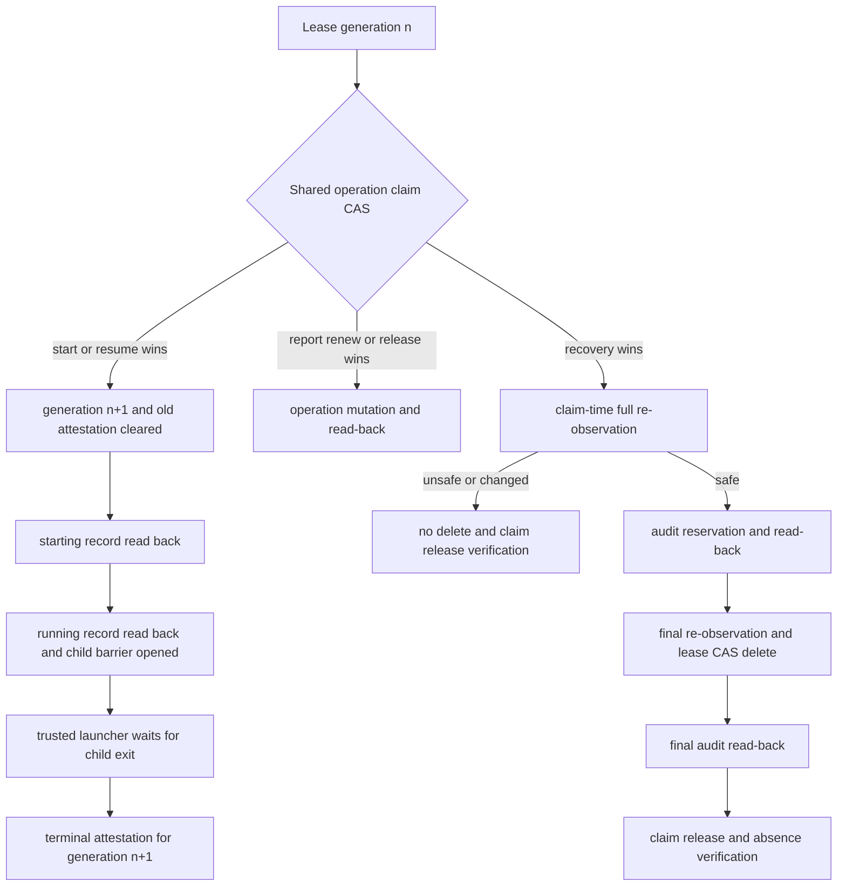

# DESIGN: Orphaned active writer lease recovery

- Issue: `ISSUE-820`
- 対応する SPEC: `SPEC.md`
- 設計入力: strict spec gate を通過した target `94209c971a86400df06632f05ae8a88685d6a58f`

## 目的・範囲・前提

本設計は、credential を失った期限内 writer lease を、実行中・起動中の runtime と未保存成果物を保護したまま回復する。入力は選択中 Coordination Backend の lease/lifecycle、worker report、対象 worktree と remote、明示確認である。出力は監査済み lease 削除または理由付き非0終了であり、成功後だけ新 writer の即時 acquire を許す。

用語は次の意味で固定する。

- lease instance: Issue、segment、holder、branch、物理絶対 worktree、`acquired_at`、`expires_at` の正準 JSON。credential とその verifier、lifecycle は含めない。
- lifecycle generation: 同一 lease instance 上の runtime 起動世代。起動のたび単調増加する。
- runtime identity: trusted launcher が起動ごとに生成し、対象 child process と lifecycle record に渡す UUID。
- operation claim: 同一 Issue/segment の recovery、report publication、start/resume、renew、release を直列化する Backend 正本上の排他 claim。
- terminal attestation: trusted launcher が child の開始から `wait` 終了まで監視し、再起動には次 generation が必要であることを確認した後だけ耐久化する単一の positive terminal proof。

前提は 1 Issue 1 writer、GitHub モードの lease 正本が custom git ref の CAS、ローカルモードの正本が Issue の `state.yaml` と lease file であること。設定項目は追加しない。TTL、#808 の falsification、#818 の root artifact 防止は変更しない。

## 要件 → 設計要素の対応表

| 要件 / AC-ID | 対応する設計要素 | 備考 |
|---|---|---|
| lease 全体と非secret digest | D1 正準 lease record | credential 値・verifierを digest 入力から除外 |
| generation CAS と旧 attestation 無効化 | D2 lifecycle state machine、D4 trusted runtime wrapper | child の実行 barrier を開く前に同一 CAS で実施 |
| 単一 terminal proof | D2、D4 | PID不在・時間・report単独は述語に含めない |
| report の補助証跡化 | D3 claim-bound report publication | generation/runtime/digest不一致は report set 全体を不適合にする |
| 排他的 claim と全操作の競合排除 | D2 Backend claim、D5 recovery transaction | start は claim 解放後も `starting` を先に耐久化 |
| claim 前後の再観測・clean/pushed | D5 recovery transaction | final precondition digest と lease revision の二重 CAS |
| holder+snapshot の明示確認 | D5 CLI | `--confirm-holder` と `--confirm-digest` の完全一致 |
| Backend-native audit | D6 audit ledger | GitHub Issue と local `state.yaml` を相互同期しない |
| 削除後の部分成功 | D5、D6 | final audit/read-back または claim release確認失敗は非0 |
| credential 非利用 | D1 public recovery read model | recovery call graph は credential API と private payloadを呼ばない |
| AC-1 | D2、D4、D5 | 完全な current-generation terminal attestation のみ通す |
| AC-2 | D2 terminal predicate | starting/running/unknown/legacy/stale reportを全て拒否 |
| AC-3 | D5 preservation checks | porcelain clean と `HEAD == remote branch SHA` の両方が必須 |
| AC-4 | D2 operation claim、D5 two-observation CAS | 全 race で最大一操作だけ成立 |
| AC-5 | D5、D6 | 予約→read-back→delete→final→read-back→claim release の固定順 |
| AC-6 | D2 claim release、既存 acquire CAS | 成功後の並行 acquire は既存排他で1件のみ成功 |
| AC-7 | D1、D7 credential canary tests | CLI・Git・Issue・state・report・attestationを走査 |

## 責務・境界

### コンポーネント構成

- D1 `src/lib/lease-lifecycle.ts`: v2 public lease/lifecycle 型、正準 JSON、`leaseInstanceDigest`、`reportSetDigest`、`recoveryPreconditionDigest`、terminal proof の純粋判定を持つ。token を型として受け取らない。
- D2 `src/lib/lease-store.ts`: `readPublicLease`、`compareAndSetLease`、`deleteLease`、`acquireOperationClaim`、`readOperationClaim`、`releaseOperationClaim` の Backend-neutral interface と transaction helper を持つ。claim は `attempt_id/kind/lease_instance_digest/generation/created_at` に束縛する。
- D2-G `src/lib/github-lease.ts`: lease ref の既存 CAS を v2 record へ拡張し、`refs/agent-skill-chain/lease-claims/<issue>-<segment>` の create/delete CAS を実装する。recovery 用 reader は public tree entry/legacy の公開 commit messageだけを読み、private v1 payloadを読まない。
- D2-L `src/lib/local-lease.ts`（新規）: `lease.yaml` v2 と O_EXCL claim file を同一 Issue coordination directoryで管理し、claim 所有下の expected digest/revision 照合と atomic rename を実装する。claim file の自動 stale 削除は行わない。
- D3 `src/commands/report.ts`: report claim を取得し、現 generation/runtime/digest を検査した reportだけを投稿する。GitHub comment または local report fileを同じ Backendから読み戻してから claim を解放する。
- D4 `.agent-skill-chain/scripts/worker-runtime-launch.sh`（新規）: provider commandを直接 childとして起動する trusted launcher。開始 barrier、継続 `wait`、終了後の terminalize を一つの親 processで担う。
- D4 `src/commands/worker.ts`: internal routes `worker lifecycle-begin|started|terminal` を実装する。begin は operation claim下で generation を増やし、旧 attestation を削除して `starting` をCAS保存する。started のCAS成功後だけ launcherが barrierを開く。terminal は child exit後に report/worktree/remoteを再観測して attestationをCAS保存する。
- D4 `.agent-skill-chain/adapters/{claude,codex}.sh`、`.agent-skill-chain/scripts/{worker-launch,worker-launch-verify}.sh`: 同期起動と dispatch 起動を共通 runtime launcherへ通す。Agent-tool dispatch の AI runtime も `bash_direct` の wrapper commandで起動し、外側verifyはreport照合と通常releaseだけを行う。human deferred は監視可能な childを持たないため terminal attestationを生成せず、active recovery対象にならない。
- D5 `src/commands/lease.ts`: 既存 `lease reclaim` を terminal-proof recoveryへ置換する。期限切れだけを根拠にした削除を廃止し、観測、確認、recovery claim、再観測、audit reservation、final CAS、final audit、claim releaseを統括する。
- D6 `src/lib/lease-recovery-audit.ts`（新規）: `reserveRecoveryAttempt`、`appendRecoveryResult` と厳密 read-back を実装する。GitHub は marker付き Issue comment、local は expected state digest と専用短期lockによるCASで `state.yaml.lease_recovery_audit[]` だけへ追記する。
- D7 schemas/tests: `.agent-skill-chain/schemas/{lease,state,worker-report}.schema.yaml` と `src/lib/schema.ts` の型を更新し、unit/integration/実process raceを固定する。

### 依存関係

```text
CLI commands / trusted shell launcher
  → lease-lifecycle（純粋な型・digest・述語）
  → lease-store interface
      → github-lease（git ref CAS）
      → local-lease（claim file + atomic file CAS）
  → lease-recovery-audit
      → GitHub Issue comments または local state.yaml
```

domain は Backend や shell に依存せず、Backend 実装は commands に依存しない。audit は lease storeを変更せず、commands が順序を定めるため循環依存はない。

### 図示要否の判断

- 判断: 要
- 根拠: lifecycle、claim、audit の複数状態遷移と、3つを超える責務境界がある。



## 詳細設計

### D1 正準 lease record と digest

`.agent-skill-chain/schemas/lease.schema.yaml` は legacy v1 と新規 v2 の `oneOf` にする。新規 acquire は必ず v2 を作る。v2 は public fields `issue_id/holder/segment/branch/worktree/acquired_at/expires_at/credential_verifier/lifecycle` を持ち、bearer token は Git common directory の既存 mode `0600` credential fileだけへ保存する。`src/lib/lease-credential.ts` の新規 `createCredentialVerifier` は random public saltとhigh-entropy tokenからversioned SHA-256 verifierを作り、`verifyLeaseCredential` はconstant-time比較する。`credential_verifier` は normal renew/release/start の認証用であり、recovery snapshot/digest/確認/auditには渡さない。

`leaseInstanceDigest` は UTF-8 canonical JSON `{schema_version,issue_id,segment,holder,branch,worktree,acquired_at,expires_at}` の SHA-256 を `sha256:<lowercase hex>` で返す。key順は関数内固定、worktree は symlink解決済み物理絶対パス、日時は canonical ISO8601 とする。renewで `expires_at` が変わる場合は同一CASで lifecycle の runtime bindingも新digestへ更新し、terminal後のrenewは拒否する。

legacy v1 は normal credential操作で release可能であり、holder credential・worktree・branchを正に確認できる start/resume の lifecycle-begin時だけ v2 へCAS移行する。legacy、branch/worktree不明、credential喪失、migration競合は recovery不能で非0とし、推測値で補わない。

### D2 lifecycle と operation claim の原子性

lease lifecycleは `generation`、`runtime_state` (`idle|starting|running|terminal|unproven`)、current `runtime_identity`、optional `terminal_attestation` を持つ。operation claim は leaseとは別の Backend primitiveに置き、lease削除後にも release確認できる。

- GitHub: claim ref の非force createが acquire、`--force-with-lease=<claim-ref>:<sha>` deleteが release。lease更新/削除は既存 lease ref の expected SHA CAS。
- local: claim file の O_EXCL createが acquire、内容とinode相当のnonce一致後の unlinkが release。claim所有中に読み直した lease digest/revisionが expected値と一致する場合だけtemp file+renameする。

start/resume、renew、release、report、recoveryは全て claim取得に失敗したら副作用前に止まる。ここでresumeは`lease resume`成功後のworker再起動を含み、fresh startと同じlifecycle-beginを必ず通る。start transactionは claim下で generationを `n+1`、stateを`starting`、runtime identityを新値、terminal attestationをabsentへ同一 lease CASで更新し、read-back後にclaimを解放する。launcherはclaim不在と`starting` record一致を再確認し、childをbarrier待ちで生成する。`started` CASでstateを`running`にしてread-backした後だけbarrierを開く。したがって recoveryが先にclaimを得るか、startが先に`starting`を耐久化するかの一方だけが成立する。

claim取得後のcrashは安全側で全操作を止める。時刻だけによるclaim回収は設けない。claim修復は本Issueのactive lease自動回復と混ぜず、人間判断に残す。

### D3 report set

`.agent-skill-chain/schemas/worker-report.schema.yaml` に optional backward-compatible fields `lease_instance_digest/lifecycle_generation/runtime_identity/created_at` を加える。v2 runtimeからのreportでは4項目を必須としてcommandが自動注入し、worker入力値を信頼しない。report commandはreport claim、credential verifier、current runtimeの3値一致を確認してからBackendへ書き、同じBackendから完全一致を読み戻す。claim解放失敗は投稿済みでも非0となり、claimが後続 recoveryを止める。

terminalization/recoveryが扱う report set は `acquired_at` 以後の同 Issue/segment marker record全件を `(created_at, backend_record_id, payload_digest)` で安定sortした集合である。該当期間に generation/runtime/lease digestが不明または不一致のrecordが1件でもあればterminal proofは不完全とする。0件は空集合digestとして許容する。report単独、completed、HEAD一致はterminal proofを代替しない。

### D4 trusted terminal attestation

runtime launcherは UUID runtime identity と launcher identityを生成し、credential-authenticated lifecycle-beginを行う。childは開始barrierで停止し、started recordのread-back前にprovider codeを実行できない。親は child PIDを起動時から単一の`wait`まで保持し、PID探索やheartbeatをterminal判定に使わない。childの再起動はwrapperが行わず、再実行にはgeneration CASが必要なため、終了後に同generation/current runtime一致を再確認できたことが non-restart proofになる。

terminal attestationは `lease_instance_digest/generation/runtime_identity/launcher_identity/worker_started_at/monitor_started_at/exited_at/exit_code/non_restart_confirmed_at/branch/worktree/head_sha/remote_sha/report_set_digest/report_record_ids` を同一 lifecycle recordへCAS保存する。保存前に `git status --porcelain` が空、branch一致、fetch後のremote SHA取得を要求する。証明不能ならattestationを作らず `unproven` へ倒す。runtimeのexit code 0やcompleted reportだけでは作らない。

### D5 recovery transaction と失敗セマンティクス

`lease reclaim ISSUE-N segment --confirm-holder <holder> --confirm-digest <sha256:...> [--actor <actor>]` を公開契約とする。`lease status --json` はsecretを含めず確認用holder/digest/generation/runtime stateを表示する。処理順は固定する。

1. public readerで lease snapshot、generation、attestation、report set、worktree/branch/HEAD/remoteを観測し、明示確認を完全一致検査する。
2. snapshot digest+generationに束縛した recovery claimをCAS取得する。
3. 全入力を再観測し、最初の観測と一致、current state=`terminal`、完全attestation一致、generation以上のstarting/runningなし、clean、`HEAD == remote_sha`を確認する。
4. 全入力の canonical precondition digestを固定し、Backend audit reservationを追記して同Backendから読み戻す。
5. claim所有を再確認し、全入力をもう一度読み、precondition digest不変を確認する。expected lease revisionでCAS削除する。
6. final resultを同Backendへ追記してread-backする。
7. expected claim revisionでclaimをreleaseし、不在をread-backする。
8. 6と7が両方成功した場合だけ標準出力へ回復完了を出す。

削除前の失敗はclaim releaseを試みて確認し、lease/worktree/report/attestation/auditを削除しない。削除後にfinal auditまたはclaim release確認が失敗した場合は、`partial_success: lease_deleted; <reasons>` をstderrへ出して非0とし、「回復完了」「再開可能」を出さない。credential fileは回復経路から触らないため残存するが、holder/digestの異なる新leaseには使えない。

### D6 audit record

予約と最終結果は共通 payload `{schema_version,attempt_id,phase,issue_id,segment,actor,holder,lease_instance_digest,lifecycle_generation,reason,recorded_at}` を使う。`phase=reserved` を削除前、`phase=completed` を削除後に同attemptでappendする。GitHub modeは `<!-- agent-skill-chain:lease-recovery-audit -->` comment、local modeは `state.yaml.lease_recovery_audit[]` のみを使う。local appendは短期audit lock取得後にstate全体のexpected digestを再検査してatomic renameし、競合時は上書きせず失敗する。read-backはrecord IDだけでなく全payload digestを比較する。GitHub modeでlocal stateへ、local modeでGitHubへ書くfallbackはない。

### D7 credential isolation

recovery commandは `readPublicLease` interfaceしか受け取らず、`readLeaseCredential`、token環境変数、private v1 tree entryへ到達できない構造にする。public lease、digest、claim、audit、attestation、reportの型にはtoken fieldを定義しない。legacy recovery readerはtokenを含まないcommit messageだけを読み、metadata不足として拒否する。

## 関連ADR

```yaml
related_adrs:
  - id: ADR-0002
    relation: adopts
  - id: ADR-0029
    relation: adopts
```

恒久判断は proposed `docs/adr/ADR-0080-lease-lifecycle-terminal-attestation-recovery.md` に記録する。ADR-0024は新ADRがacceptedになるまでは有効であり、実装はaccepted後に期限だけの回収経路を置換する。

## 障害・ロールバック考慮

- CAS/claim競合、Backend/read-back/network失敗: 削除前なら無変更+claim release確認。状態不明ならclaimを自動破棄しない。
- launcher/start barrier/monitor喪失: runtimeを実行しないかlifecycleを`unproven`に保ち、回復を拒否する。
- dirty、detached、remote不明、unpushed: leaseと成果物を保持して非0。
- report遅延/改変: report claimまたは集合digest不一致でterminalize/recoveryを拒否する。
- post-delete audit/release失敗: 削除を補償的に再作成せず部分成功。古いsnapshotからleaseを復元すると新acquireと二重化するためである。
- ロールバック: 新規 command wiring/runtime wrapperを戻し、v2 readerを残したまま新規lifecycle起動とactive reclaimを停止する。既存v2 leaseはcredential-authenticated releaseのみ許し、v1へdowngradeしない。監査・report・attestationは保存する。
- 影響: lease acquire/renew/release/status、worker launch/dispatch/verify、report publication、GitHub/local state schema。gate review、root cleanup、成果物内容は影響外。

## 完了条件・検証方法・未決事項・対象外

完了条件はAC-1〜AC-7の自動テスト、既存lease/worker/report回帰、`npm run build`、repository verify/lintが成功し、全状態変更が選択Backendだけへ残ること。検証はunit、fake Backend fault injection、bare remoteの実process race、shell child監視integrationを組み合わせる。未決事項はない。

対象外はclaim自体がcrashで孤児化した場合の自動回収、human deferredのterminal proof、TTL変更、複数writer、保存済み成果物・監査証跡の削除、#808/#818の挙動である。
