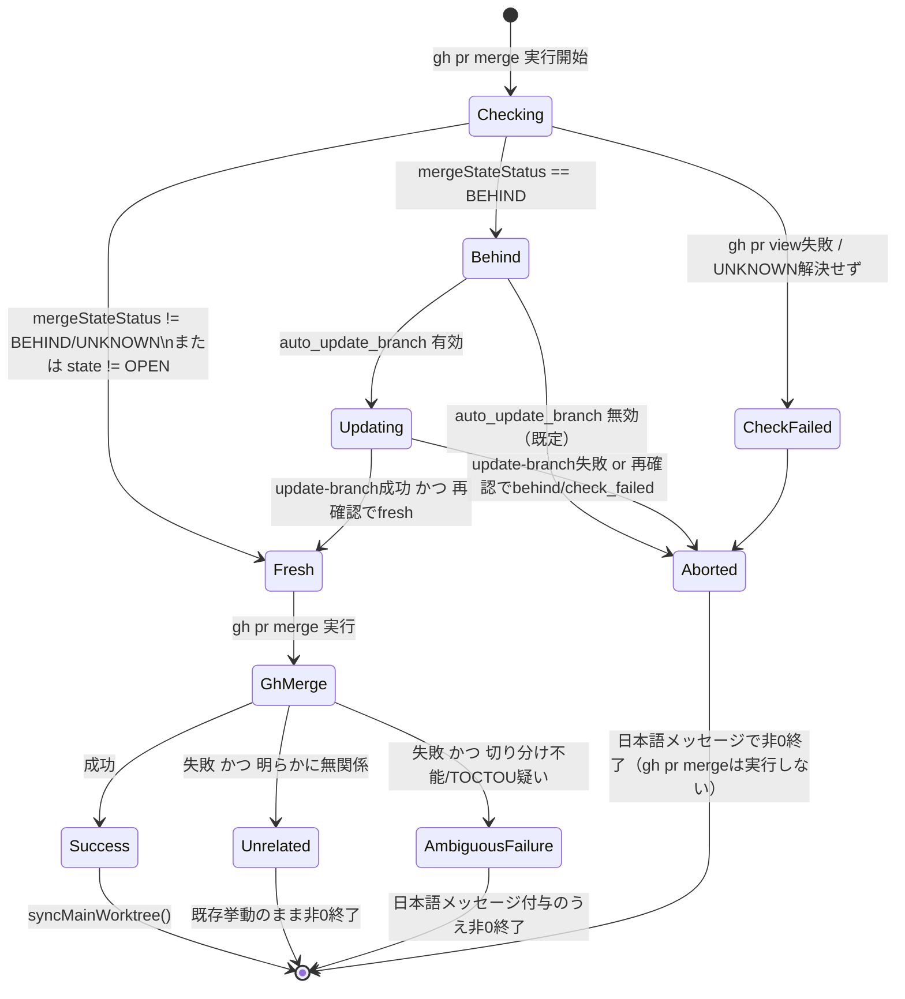

# DESIGN: pr merge が base branch の最新性を保証せず、--admin 常用運用が strict_required_status_checks_policy を事実上バイパスする

- Issue: `ISSUE-493`
- 対応する SPEC: `SPEC.md`

## 要件 → 設計要素の対応表

| 要件 / AC-ID | 対応する設計要素 | 備考 |
|---|---|---|
| 要件1・AC-1 | `PrFreshnessGuard.checkFreshness()`（`gh pr view --json mergeStateStatus,...` による behind 判定） | `mergeStateStatus === 'BEHIND'` を「最新でない」の判定根拠にする |
| 要件2・AC-1 | `merge()` の分岐（既定: 中断） + `config.merge.auto_update_branch`（新設・既定 false） | オプトインしない限り最新化を試みず中断する |
| 要件3・AC-2 | `PrFreshnessGuard.attemptUpdateBranch()`（`gh api -X PUT .../pulls/{n}/update-branch` + 再確認ポーリング） | コンフリクト等で完了できない場合は中断扱い |
| 要件4・AC-3 | `merge()` 内でのチェック呼び出し位置（`gh pr merge` 実行前・引数内容を問わず必ず実行） | `--admin` を含む `args` はチェック処理へ渡さない（チェックは `args` に依存しない） |
| 要件5・AC-4 | `PrFreshnessGuard.checkFreshness()` のエラー境界（`gh pr view` 失敗・`mergeStateStatus` が `UNKNOWN` のまま解決しない場合の扱い） | いずれも「チェック失敗」として中断する |
| 要件6・AC-5 | `merge()` の正常系分岐（behind でない場合は既存の `gh(['pr','merge',...args])` 呼び出し + `syncMainWorktree()` をそのまま実行） | 本Issue対応前と同一コードパスを通す |
| 要件7・AC-6・AC-7 | `MergeFailureClassifier.classify(stderr)`（`pr-freshness.ts` 内の関数） | 既知の「明らかに無関係」な失敗のみ許可 list で除外し、それ以外は安全側で要件7側として扱う |

## 責務・境界

### コンポーネント構成

- `PrFreshnessGuard`（新設 `src/lib/pr-freshness.ts`）: 対象PRのhead/base最新性判定・オプトイン時の最新化試行のみを担う。`gh pr view`／`gh api` 以外の外部呼び出しを持たない。
  - `resolveMergeTarget(args: string[]): string | undefined` — `gh pr merge` の `args` から対象PR（番号／URL／ブランチ）を、`gh pr merge --help` が定義する値取り型オプション（`-b/--body`・`-F/--body-file`・`-t/--subject`・`--match-head-commit`）の次要素を除外したうえで抽出する。見つからない場合は `undefined` を返す（呼び出し元がAC-4扱いにする）。
  - `checkFreshness(root, target): FreshnessResult` — `gh pr view <target> --json number,state,baseRefName,headRefName,mergeStateStatus` を呼ぶ。`state !== 'OPEN'` なら `status: 'not_applicable'`（後続の `gh pr merge` に既存挙動のまま委ねる。AC-6が扱う「明らかに無関係な失敗」入口）。`mergeStateStatus === 'UNKNOWN'` の間は短い間隔（バックオフ付き、上限5回・合計待機を数秒程度に収める）で再問い合わせし、それでも解決しなければ `status: 'check_failed'`。`gh pr view` 自体が非0終了した場合も `status: 'check_failed'`。`mergeStateStatus === 'BEHIND'` なら `status: 'behind'`。それ以外は `status: 'fresh'`。
  - `attemptUpdateBranch(root, prNumber): UpdateResult` — `gh api -X PUT repos/:owner/:repo/pulls/{prNumber}/update-branch` を呼ぶ。非0終了（コンフリクト等）なら即 `status: 'failed'`。成功した場合は `checkFreshness()` を再度呼び、`fresh` になれば `status: 'updated'`、`behind`/`check_failed` のままなら `status: 'failed'`。
  - `classifyMergeFailure(stderr: string): 'unrelated' | 'ambiguous'` — 既知の「最新性と明らかに無関係」なパターン（例: 権限不足・PRが既にマージ済み・既にクローズ済みを示す文言）にのみ一致した場合 `unrelated` を返し、それ以外は安全側で `ambiguous` を返す。
- `pr merge` コマンド（既存 `src/commands/pr.ts` の `merge()`）: `merge.autonomous` 確認・`PrFreshnessGuard` の呼び出し・`gh pr merge` 実行・`MergeFailureClassifier` によるエラーメッセージ補完・`syncMainWorktree()` の呼び出し順序を制御する調整役。各処理自体のロジックは自身に持たない。
- `config`（`.agent-skill-chain/schemas/config.schema.yaml` + `src/lib/config.ts` + `.agent-skill-chain/config/agent-skill-chain.yaml`）: 新設の任意フィールド `merge.auto_update_branch: boolean`（既定=未設定は false 相当、後方互換の任意項目として追加し既存設定ファイルを不正にしない）を保持する。
- GitHub API（外部システム）: `gh pr view --json mergeStateStatus` と `gh api -X PUT .../update-branch`。

### 依存関係

```text
merge()（src/commands/pr.ts） → PrFreshnessGuard.resolveMergeTarget/checkFreshness → gh pr view → GitHub API
merge()                        → PrFreshnessGuard.attemptUpdateBranch（config.merge.auto_update_branch有効時のみ）→ gh api update-branch → GitHub API
merge()                        → gh pr merge（既存、透過）→ GitHub API
merge()                        → MergeFailureClassifier.classifyMergeFailure（gh pr merge失敗時のみ）
merge()                        → syncMainWorktree()（既存、gh pr merge成功時のみ）
```

循環依存は無い（`PrFreshnessGuard` は `merge()` に依存しない一方向）。責務は「最新性判定・最新化」（`PrFreshnessGuard`）と「呼び出し順序の制御・既存の自動化確認/同期」（`merge()`）に分離しており、単一コンポーネントへの責務集中は無い。

### 図示要否の判断

- 判断: `要`
- 根拠: 依存関係が3つ以上（`PrFreshnessGuard`・`gh pr merge`・`MergeFailureClassifier`・`syncMainWorktree`・GitHub API）、かつ `mergeStateStatus` の状態遷移が `UNKNOWN → {fresh|behind|check_failed}` → （オプトイン時）`behind → {updated|failed}` と2つ以上あるため。



## 関連ADR

```yaml
related_adrs:
  - id: ADR-0039
    relation: adopts
```

## 障害・ロールバック考慮

- 想定される失敗モード:
  - `gh pr view` がネットワーク断・権限不足で失敗する（AC-4で中断）。
  - `mergeStateStatus` が `UNKNOWN` のまま解決しない（GitHub側の計算未完了、AC-4で中断）。
  - `auto_update_branch` 有効時に `update-branch` API がコンフリクトで失敗する（AC-2で中断）。
  - チェック通過後、`gh pr merge` 実行までの間に別マージが成立し `gh pr merge` 自体が失敗する（AC-7、TOCTOU）。
  - `classifyMergeFailure` が実際には無関係な失敗を `ambiguous` と誤分類する（安全側であり、余分な日本語メッセージが付くだけで既存の終了コード・`gh` 標準エラー出力自体は変更されないため実害は限定的）。
- ロールバック手順: 本Issue対応はすべて `src/commands/pr.ts`・新設 `src/lib/pr-freshness.ts`・config スキーマの追加項目に閉じる。問題が生じた場合は当該PRの変更を revert すれば `merge()` は本Issue対応前の「引数を透過して `gh pr merge` を呼ぶだけ」の挙動に戻る。`merge.auto_update_branch` は新設の任意項目のため、既存設定ファイルへの影響は無い。
- 影響を受ける既存機能: `agent-skill-chain pr merge` コマンドのみ。`pr create`・`syncMainWorktree()` 自体のロジック・`merge.autonomous` の既存確認処理は変更しない。
