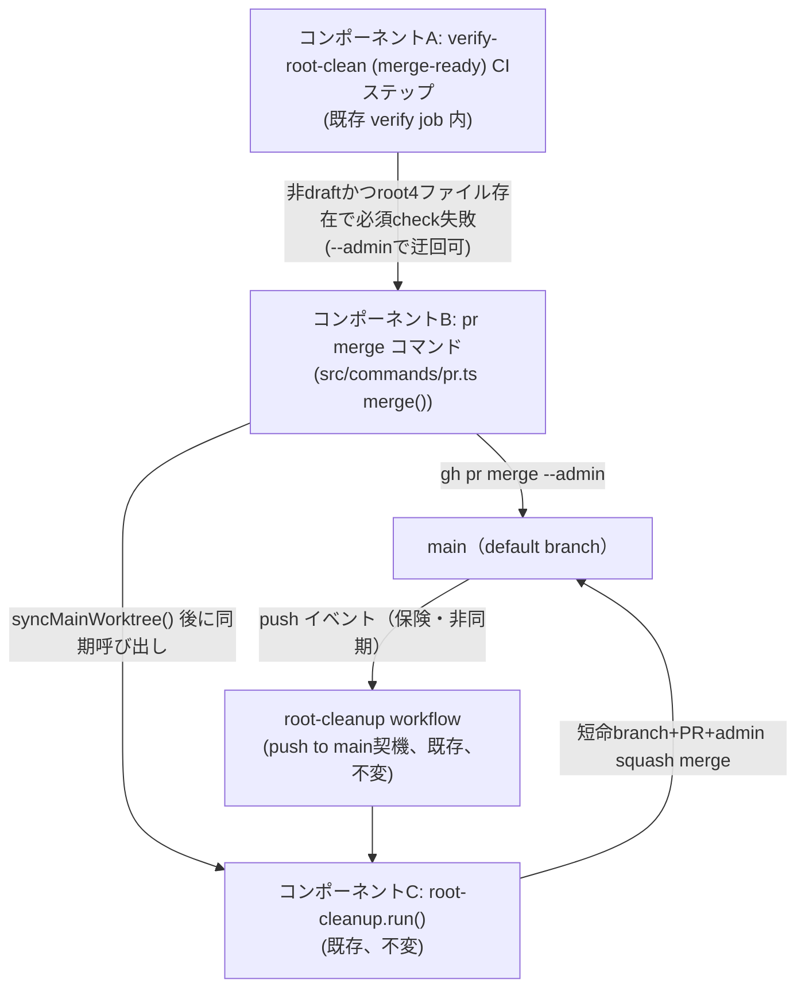
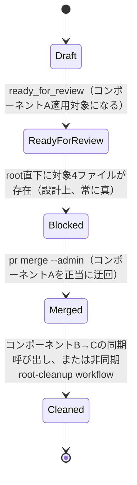

# DESIGN: Issueセグメント成果物のroot直下混入を、事後cleanupだけでなくマージ前に予防するCI gateが無い

- Issue: `ISSUE-590`
- 対応する SPEC: `SPEC.md`

## 要件 → 設計要素の対応表

| 要件 / AC-ID | 対応する設計要素 | 備考 |
|---|---|---|
| `AC-1`（マージ準備完了状態での検査失敗・ブロック） | コンポーネントA: `verify-root-clean (merge-ready)` CIステップ | 既存 `verify root-clean` CLIを新規呼び出し。新規検出ロジックは追加しない |
| `AC-2`（進行中PRを誤検知しない） | コンポーネントA | ステップの `if:` 条件（`draft == false` かつ Issueブランチ）でスコープする |
| `AC-3`（正常完了PRの追加手動操作なしマージ） | コンポーネントB: `pr merge` コマンドの自動クリーンアップ連鎖 | 既存 `root-cleanup run`（コンポーネントC）の `run()` をマージ成功後に同一コマンド内で呼び出す |
| `AC-4`（非破壊） | 設計方針そのもの（`segments.yaml`・AGENTS.md・成果物配置パスへ一切触れない） | 新規追加のみで構成し、既存定義は無変更 |
| `AC-5`（root-cleanup runの回帰なし） | コンポーネントC: 既存 `root-cleanup` 機構（不変） | コード自体は変更せず、呼び出し元をコンポーネントBに1つ追加するのみ |

## 責務・境界

### コンポーネント構成

- `コンポーネントA`（`verify-root-clean (merge-ready)` CIステップ）: `.github/workflows/agent-skill-chain-ci.yml` の既存 `verify` ジョブ（branch protection の必須status check `verify` の一部）に新規ステップを追加する。責務は「PRがdraftでなくIssueブランチ判定に成功した場合に、既存の `.agent-skill-chain/ci/verify-root-clean.sh`（`verify root-clean` CLI）をそのまま実行し、repoRoot直下に対象4ファイルが1件でも存在すれば失敗させる」ことのみ。検出ロジック自体は新規実装しない（既存資産の再利用）。
- `コンポーネントB`（`pr merge` コマンドの自動クリーンアップ連鎖）: `src/commands/pr.ts` の `merge()` を拡張する。責務は「`gh pr merge` 成功・`syncMainWorktree()` 成功後に、main worktree（`repoRoot()`）を基点として既存の `root-cleanup` 機構（コンポーネントC の `run()`）を同一コマンド内で呼び出し、その場でrepoRoot直下の対象4ファイルを検出・削除する」こと。`root-cleanup` の内部ロジック（短命ブランチ作成・`git rm`・PR作成・スコープ検査・admin squash merge）自体には一切手を入れない。
- `コンポーネントC`（既存 `root-cleanup` 機構、`src/commands/root-cleanup.ts` の `run()` + `.github/workflows/agent-skill-chain-root-cleanup.yml`）: 変更しない。push to main を契機とする非同期の事後セーフティネットとして従来どおり独立稼働を継続し、コンポーネントBから追加の呼び出し元として同じ `run()` を直接呼ばれるようになる点のみが変化する。
- `コンポーネントD`（運用文書更新）: `.agent-skill-chain/scripts/pr-merge.sh` のヘッダコメント・`src/commands/pr.ts` の `MERGE_USAGE`・`.agent-skill-chain/standards/GIT_CONVENTIONS.md` に、「validation-gate完了後のPRは、コンポーネントAの必須checkが常に失敗する設計であるため `pr merge` 呼び出し時に `--admin` を明示する必要がある」ことを追記する。

### 依存関係

コンポーネントAは「マージ準備完了状態」を機械的に判定する境界（`pull_request.draft == false`）を持ち、通過可否のみを判断する（削除は行わない）。コンポーネントBは削除実行の唯一の起点であり、コンポーネントCの既存関数を呼び出すだけで削除ロジックを保有しない。コンポーネントCは削除ロジックを唯一保有し、同期呼び出し（コンポーネントBから）・非同期呼び出し（push to mainイベント）の両方から独立に起動されうるが、ロジック自体は単一である（循環依存なし、削除ロジックの重複実装なし）。

```text
コンポーネントA（CI必須check） -- 迂回には --admin が必要 --> コンポーネントB（pr merge コマンド）
コンポーネントB --> GitHub API（gh pr merge --admin）
コンポーネントB --> main worktreeのfast-forward同期（既存 syncMainWorktree()）
コンポーネントB --> コンポーネントC.run()（同期呼び出し、新規追加）
GitHub（push to main イベント） --> コンポーネントC.run()（既存の非同期呼び出し、不変）
```

### 図示要否の判断

- 判断: `要`
- 根拠: 依存関係が4つ以上（コンポーネントA→B、B→GitHub API、B→main同期、B→C、push→C）あり、状態遷移も2つ以上（Draft→Ready for Review、Ready for Review(常時ブロック)→マージ済み、マージ済み→クリーンアップ済み）存在するため、図示必須基準に該当する。





## 関連ADR

```yaml
related_adrs:
  - id: ADR-0007
    relation: references
  - id: ADR-0045
    relation: adopts
```

## 障害・ロールバック考慮

- 想定される失敗モード1: コンポーネントAの新規CIステップが誤ってdraft PRやquickモードIssue（対象4ファイルが元々存在しない）を誤検知でブロックする。`if:` 条件（`skip_checks`・`draft == false`）と既存ロジックの単純再利用（新規検出ロジックを書かない）で発生確率を抑え、AC-2に対応する回帰テストで検知する。
- 想定される失敗モード2: コンポーネントB内の `root-cleanup.run()` 同期呼び出しが失敗（`human_required`、GitHub APIエラー等）する。この場合もPRのマージ自体は既に成功済みであり取り消さない。`pr merge` はマージ成功を報告しつつ、追加の後続確認が必要である旨を非ゼロ終了コードと日本語メッセージで伝える（`syncMainWorktree()` の既存の失敗時メッセージパターンを踏襲）。既存の非同期 `root-cleanup` workflow（push to mainで独立に起動、コンポーネントC不変）が保険として同じ内容を後追いで検出・修復するため、同期呼び出しが失敗してもAC-3・AC-5の実効性は失われない。
- 想定される失敗モード3: `--admin` 権限を持たない主体がGitHub UIから直接マージを試みる。コンポーネントAの必須checkが常時失敗する設計により、このパスは一貫してブロックされる（意図した予防効果、AC-1）。
- ロールバック手順: 本Issueが追加する変更は「(a) `agent-skill-chain-ci.yml` への1ステップ追加」「(b) `src/commands/pr.ts` `merge()` への1呼び出し追加」「(c) 運用文書の追記」のみであり、既存の `root-cleanup.ts`・`verify-root-clean.sh` 自体は無変更。当該コミット・PRをrevertすれば、事後cleanupのみの従来動作へ即座に戻せる。データ移行・スキーマ変更を伴わない。
- 影響を受ける既存機能: `pr merge` コマンドの成功後の挙動（新たに `root-cleanup.run()` を連鎖呼び出しする）と、`agent-skill-chain-ci.yml` の `verify` ジョブ（必須status check、ready-for-review後のPRでは対象4ファイルが存在する限り恒常的に失敗する設計変更）。`root-cleanup run` 単体のCLI・スケジュールされた非同期workflow自体の呼び出し方・出力形式は変更しない。
