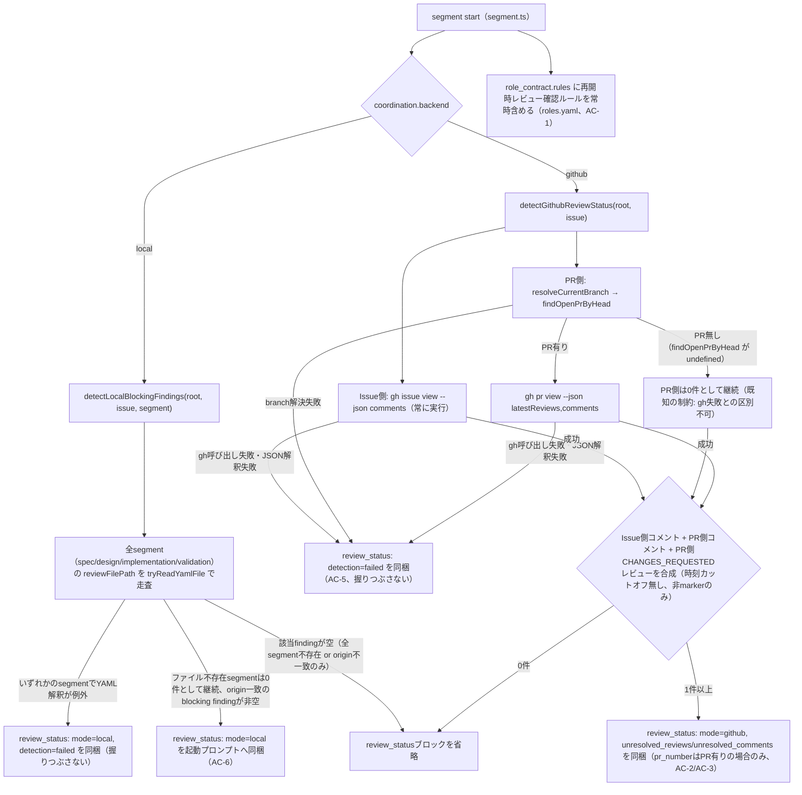

# DESIGN: bugfix: resumeしたsegment workerがPR/Issueのレビューフィードバックを一切参照せず静的completion checklistだけで完了と自己判定する

- Issue: `ISSUE-446`
- 対応する SPEC: `SPEC.md`

## 要件 → 設計要素の対応表

| 要件 / AC-ID | 対応する設計要素 | 備考 |
|---|---|---|
| AC-1（全ワーカーのrole_contractに再開時レビュー確認ルールが常に含まれる） | `.agent-skill-chain/config/roles.yaml` の `role_contracts.{spec_worker,design_worker,implementation_worker,validation_worker}.rules` への静的行追加 | backend・検出成否に関わらず常に含まれる最小対応（SPEC要件1）。既存の `loadRoles`／`toYamlString` 経路をそのまま通るため新規コードは不要。 |
| AC-2（GitHubモード：未対応レビューの検出・同梱） | `src/lib/review-status.ts`（新規）`detectGithubReviewStatus()` の `unresolved_reviews` | `gh pr view <pr> --json latestReviews` はreviewer毎の最新reviewのみを返す（GitHub自身のマージブロック判定と同じ基準）ため、追加の重複排除ロジックを持たない。 |
| AC-3（対象Issue/PRの未対応コメントの検出） | 同モジュール `detectGithubReviewStatus()` の `unresolved_comments` | PRコメント（`gh pr view --json comments`）とIssueコメント（`gh issue view --json comments`）の双方を対象にし、定型marker始まりでないものはすべて「未対応」とみなす（時刻カットオフは行わない。下記「未対応の判定基準」参照、ADR-0026）。Issueコメントの取得はPRの存在・解決に依存しない独立した経路とする（Issueは常にPRより先に存在するため。下記「Issue側／PR側の分離」参照）。 |
| AC-4（誤検出しない） | 同モジュールの判定ロジック自体（`state !== 'CHANGES_REQUESTED'` を除外・`<!-- agent-skill-chain:`定型marker始まりのコメントを除外）＋ `src/commands/segment.ts` 側で空配列時はブロック自体を省略 | 「対応が必要な既存レビューが存在する」という虚偽の通知を作らないためには、該当が無い場合にセクション自体を出力しないのが最も確実（`buildIssueBlock` が採る既存パターンと同じ方針）。marker除外の根拠は「未対応の判定基準」節参照。時刻カットオフを廃止したため「過去に存在したコメントを繰り返し示さない」ことは要求しない（AC-4は「コメントが実際に存在しない場合の誤検出禁止」のみを要求、ADR-0026）。 |
| AC-5（検出失敗時の安全側継続） | 同モジュールが `gh` 呼び出し失敗・JSON解釈失敗を `{ detection: 'failed', reason }` として明示的に返す。`segment start`（`src/commands/segment.ts`）は例外を投げずこの値をそのままプロンプトへ含め、AC-1の静的ルール追加（roles.yaml）とは独立に動作を継続する | 「握りつぶし」＝検出失敗を「未検出（＝レビュー無し）」として扱うことを指す。本設計は失敗自体を検出失敗として明示するため、AC-4の「誤検出しない」とは競合しない（失敗は「無い」ではなく「わからない」として区別する）。ローカルモードのgate report読み込み失敗も同様に `detection: 'failed'` として明示する（下記「未対応の判定基準」参照、ADR-0026）。 |
| AC-6（ローカルモード：gate-report上の未解決blocking findingの検出・同梱） | 同モジュール `detectLocalBlockingFindings()` | `spec`/`design`/`implementation`/`validation` 全segmentのgate report（`reviews/<segment>.yaml`、`src/lib/local-state.ts` の `reviewFilePath()`）を走査し、`gate.blockers` のうち `origin` が起動対象segment（差し戻し先）に対応する値（`spec`→`specification`、他は同名）と一致する `blocking` findingを収集する。AGENTS.mdが定めるorigin基準の差し戻し（他segment起因のblocking findingを差し戻し先が読む）を機械的に成立させるため、同名gate reportのみの走査では不十分（ADR-0026）。 |
| AC-7（実地再現シナリオでの言及付き完了判定） | 上記AC-2/AC-3/AC-5の実装が土台となる。設計要素自体は追加しない（実装・独立検証セグメントでworker-launch.shの実起動を通じて確認するhybrid検証） | SPEC「検証方法見込み: hybrid」のとおり、本ACは自動テストだけでなく実際のworker起動ログの確認を要する。DESIGN/PLANでは対応する自動化可能な設計要素（AC-2/3/5）を確実に満たすことが前提条件になる。`worker-launch.sh` はadapter（`.agent-skill-chain/adapters/{claude,codex,human}.sh`）の `launch_worker()` を呼び出し、`launch_worker()` は起動対象workerへ渡すprompt本文を得るために `_asc_cli segment start <issue_id> <segment>` を呼ぶ（`claude.sh` の `launch_worker()` で確認済み。既存・変更なし）。したがってresumeされたworkerへの`review_status`同梱は、通常の`segment start`呼び出し経路と完全に同一であり、resume専用の別経路は存在しない（design-gate指摘、2026-08-05）。 |

## 責務・境界

### コンポーネント構成

- `roles.yaml`（`.agent-skill-chain/config/roles.yaml`）: 4ワーカー共通の静的ルール文字列を保持するだけの宣言的データ。ロジックを持たない（AC-1）。
- `review-status.ts`（`src/lib/review-status.ts`、新規）: Coordination Backend（GitHub API／ローカルgate-report）から「未解決のレビューフィードバック」を検出し、プロンプトへ埋め込み可能な構造化データへ変換する責務のみを持つ。GitHub呼び出し（`gh`）・ローカルYAML読み込みの2つの入力源を抽象化し、`segment.ts` へは判定済みの結果だけを返す。コメント時刻カットオフを廃止した（ADR-0026）ため、`git` 呼び出し（commit時刻取得）は本モジュールの入力源から完全に除外する——`since` に相当する値は判定にも出力にも用いない。
- `segment.ts`（`src/commands/segment.ts`）: 既存の `buildIssueBlock`（ローカルモードのtitle/request同梱）と同列に、`review-status.ts` の結果をYAML整形して起動プロンプトへ連結するだけのオーケストレーション責務。判定ロジック自体は持ち込まない。
- `gh-open-pr.ts`（`src/lib/gh-open-pr.ts`、既存・変更なし）: 対象ブランチに紐づくOPENなPRを解決する既存関数 `findOpenPrByHead()` をそのまま再利用する。PR解決ロジックの重複実装を避ける。
- `worktree.ts`（`src/lib/worktree.ts`、既存・変更なし）: 現在の作業ブランチ名解決に既存の `resolveCurrentBranch()` をそのまま再利用する。
- `local-state.ts`（`src/lib/local-state.ts`、既存・変更なし）: ローカルモードのgate-reportパス解決に既存の `reviewFilePath()` をそのまま再利用する。

責務集中の確認（反証観点）: GitHub API呼び出し・ローカルYAML読み込み・「未対応」の判定基準（CHANGES_REQUESTED判定／定型marker除外／origin一致フィルタ）はすべて `review-status.ts` 1箇所に閉じ込め、`segment.ts` は「結果を埋め込むかどうか（空なら省略）」というプレゼンテーション層の判断だけを行う。判定基準を変更する際に `segment.ts` を触る必要が無いようにする。

### 未対応の判定基準（設計判断）

SPEC.mdは「未対応のレビュー・コメント」の検出を要求するが、GitHubのコメントAPI自体には「対応済み/未対応」を表すフラグが無いため、機械的に判定可能な基準を本設計で確定する。本節の基準はADR-0025からADR-0026への置き換えを反映した最新版であり、ADR-0025が採用していた「対象ブランチの最新commit時刻より後」というコメント時刻カットオフは廃止した（理由は下記参照）。

- **レビュー（AC-2）**: `gh pr view <pr> --json latestReviews` はreviewer毎に最新の1件だけを返す。GitHubのマージブロック判定自体もこの「reviewer毎の最新state」を基準にしており、同一reviewerが後から `APPROVED` を出せば古い `CHANGES_REQUESTED` は自動的に上書きされる。したがって `latestReviews` の中で `state === 'CHANGES_REQUESTED'` のものだけを「未対応」とみなせば十分であり、追加の重複排除・時系列比較ロジックは不要。
- **コメント（AC-3）**: 単純コメント（Issue/PRいずれも）には状態フラグが無く、時刻カットオフ（「対象ブランチの最新commit時刻より後」）を採用すると、「レビュアがコメント投稿→workerが未対応のまま無関係な別のcommitを実行→再開時にはそのコメントがcutoff以前となり消える」という取りこぼしが発生する（ADR-0025のConsequences節が既知の限界として明示し、implementation-gateが実際に検出。ADR-0026参照）。これは本Issueが解消対象とする「commit済みであることのみを根拠に完了と判定する」失敗モードを検出機構自身が再導入するため、時刻カットオフ自体を廃止する。定型marker（下記）で始まらないコメントは、作成時刻に関わらず常に「未対応」とみなす。コメント判定はcommit時刻を一切参照しないため、`git`呼び出し（`git log -1`等）は本モジュールに一切登場しない（依存関係節参照、design-gate指摘、2026-08-05）。コメントのスレッド解決状態（resolved/unresolved、GraphQL専用）までは扱わない——スコープ外節「PRレビュー本文・コメント本文の要約・翻訳・NLP処理」と同様、機械的に判定可能な最小基準に留める。
- **Issue側／PR側の分離（AC-3関連の設計判断）**: GitHubモードではIssueは常にPRより先に存在する（`SPEC.md`作成→spec segment初回起動の時点でIssueは既に存在するが、Draft PRはspec workerがcheckpointをpushした後にしか作られない）。従来案のように「`resolveCurrentBranch`→`findOpenPrByHead`でPRが見つからなければIssueコメント取得も含め`review_status`全体を省略する」設計では、Draft PR作成前に進行役がIssueへ投稿した修正依頼コメントが一切検出できず、本Issueが解消対象とする失敗モードが残る（design-gate指摘、2026-08-05）。これを避けるため、`detectGithubReviewStatus()` は次の2経路を独立に実行し、結果を合成する。
  1. **Issue側（常に実行）**: `gh issue view <issueNumber> --json comments` を呼び、対象Issueのコメントを取得する。branch解決・PR解決の成否に関わらず必ず実行する。
  2. **PR側（branch解決・PR解決に依存）**: `resolveCurrentBranch()` → `findOpenPrByHead()` が成功した場合のみ、`gh pr view <pr> --json latestReviews,comments` でレビュー・PRコメントを取得する。
  - 合成規則: Issue側・PR側のいずれかが呼び出し失敗（`gh`非ゼロ終了・JSON解釈失敗）またはbranch解決失敗であれば、`detection: 'failed'`（下記「検出失敗（GitHubモード）」参照）として明示する——一方が成功したからといって他方の失敗を握りつぶさない（AC-5）。両方が成功（またはPR側が「PR未作成」）であれば、Issue側コメント・PR側コメント・PR側レビューを合成し、全て空なら`undefined`（AC-4）、1件以上あれば`mode: 'github', detection: 'succeeded'` を返す。PRが未作成の場合、出力の `pr_number` フィールドは省略する（`pr_number?: number` へ変更）。
- **検出失敗（GitHubモード、AC-5関連の設計判断）**: 「Issue側／PR側の分離」で述べた2経路それぞれの失敗の扱いを次のとおり確定する。
  - **branch解決失敗**（`resolveCurrentBranch()` が空文字列・undefined相当を返す。detached HEAD、または対象worktreeがIssueに紐づくbranchへcheckoutされていない異常状態を含む）: 「PR未作成」とは区別し、PR側を明示的な`detection: 'failed'`（理由: 「現在のブランチ名を解決できません」）として扱う。branch解決失敗を「PR未作成」と同一視すると、実際にはPR側に検出すべきレビュー・コメントが存在するかもしれない状態を「無し」として握りつぶすことになり、AC-5に反するため区別する。
  - **`findOpenPrByHead()` が `undefined` を返す場合**（branch解決は成功）: 同関数は「対象branchにOPENなPRが無い」場合と「`gh pr view`呼び出し自体が失敗した」場合の両方を区別せず`undefined`で返す既存実装であり（`src/lib/gh-open-pr.ts`、既存・変更なし）、本設計では変更しない——release bump・root-cleanup run等の既存呼び出し元へ影響する破壊的変更になるため。したがって本設計は、この2ケースを区別できないことを既知の制約として受け入れ、`undefined`を一律「PR未作成」（`prSide`は失敗ではなく空扱い）として扱う。これにより「一時的な`gh`障害が本当は存在するPRのレビューを覆い隠す」可能性は残るが、影響範囲はPR側（レビュー・PRコメント）に限られ、Issue側コメントの検出はこの経路と独立のため引き続き機能する（上記「Issue側／PR側の分離」）。過検出（時刻カットオフ廃止）と同様、実運用で問題化した場合は`findOpenPrByHead`自体の戻り値をエラー区別可能な形へ変更する別Issueで対処する。
  - **Issue側の`gh issue view`呼び出し失敗・JSON解釈失敗**: 明示的に`detection: 'failed'`とする。Issueは`resolveCurrentBranch`やPR解決の成否と無関係に常に存在するため（AGENTS.md I1）、「Issue未作成」に相当する黙認経路は存在しない。
- **定型marker除外（AC-4関連の設計判断）**: 時刻カットオフを廃止したため、workerやgate-review自体がIssue/PRへ投稿する定型コメント（完了報告・review evidence等）を除外する仕組みが唯一の誤検出防止手段になる。`detectGithubReviewStatus()` は、コメント本文が既知の定型marker（`<!-- agent-skill-chain:` で始まる行）で始まる場合、そのコメントを「未対応」の判定対象から除外する。当該prefixの実在は実装コードで確認済みである（`src/lib/review-evidence.ts` がexportする `REVIEW_EVIDENCE_MARKER` の値は `<!-- agent-skill-chain:gate-review-evidence -->`、`src/commands/report.ts` 内定数 `MARKER` の値は `<!-- agent-skill-chain:worker-report -->`。design-gate指摘、2026-08-05）。実装セグメントでは、この2箇所が独立にprefixをハードコードしている重複を避けるため、`review-status.ts` の定型marker判定は `REVIEW_EVIDENCE_MARKER` 等の既存exportを再利用するか、共有定数へ切り出すことを推奨する（PLAN.md変更単位#3参照）。**投稿者（author）による除外は採用しない**——本リポジトリ実測（Issue #441/#445コメント履歴）のとおり、worker報告・gate-review-evidence・進行役による純粋な人間向け修正依頼コメントは全て同一のGitHub actor（`gh` credentialの実行主体）から投稿されており、author単位で除外すると本Issueが解消対象とする「進行役の修正依頼コメントそのもの」まで誤って除外してしまう（design-gate指摘、2026-08-05）。定型marker（機械可読な構造化データの先頭に付与される既存prefix）の有無だけが、自動化由来コメントと人間向け自由文コメントを区別できる唯一の機械的信号である。
- **時刻カットオフ廃止のトレードオフ**: 既に別の手段で実質的に対応済みの過去コメントも、そのPRが存在する限り毎回のresumeで再掲され続ける（過検出）。内容がそのままプロンプトに含まれるため、worker・進行役が既知の対応済みコメントと判断して読み飛ばせることを前提とする。AC-4は「コメントが実際に存在しない場合の誤検出禁止」のみを要求し、「過去に存在したコメントを繰り返し示さない」ことまでは要求しないため、AC-4とは競合しない（ADR-0026）。
- **ローカルモードのgate report走査（AC-6関連の設計判断）**: 起動対象segmentと同名のgate reportのみを読む基準（ADR-0025）では、AGENTS.mdが定めるorigin基準の差し戻し（例: implementationゲートが`origin: specification`のblocking findingを検出し、進行役がspecセグメントへ差し戻すケース）で、差し戻し先のワーカーが他segmentのgate reportに記録されたblocking findingを一切参照できない欠落があった（implementation-gate指摘、2026-08-05）。`detectLocalBlockingFindings()` は `spec`/`design`/`implementation`/`validation` 全segmentのgate reportを走査し、`origin` が起動対象segmentに対応する値（`spec`→`specification`、他は同名）と一致する `blocking` findingのみを収集する（ADR-0026）。
- **ローカルモードのgate report読み込み失敗（AC-5関連の設計判断）**: `detectLocalBlockingFindings()` は各segmentのgate reportを `src/lib/yaml-io.ts` の `tryReadYamlFile()`（既存・変更なし）で読む。`tryReadYamlFile()` は「ファイルが存在しない」場合に例外を投げず `undefined` を返し、「ファイルは存在するがYAMLとして解釈できない（壊れたYAML）」場合は内部の `parse()` が投げる例外をそのまま呼び出し元へ伝播させる（`src/lib/yaml-io.ts` 実装済みの既存挙動）。本設計はこの2ケースを次のとおり区別する。
  - ファイル不存在（`tryReadYamlFile()` が `undefined` を返す）: 当該segmentにgate report自体がまだ無いだけであり、正常系として「そのsegmentからのblocking findingは0件」を意味する。失敗として扱わない（ほとんどのIssueでは4segment中1〜2個のgate reportしか存在しない）。
  - YAML解釈失敗（`tryReadYamlFile()` が例外を投げる）: `detectLocalBlockingFindings()` はsegment単位で `try/catch` し、例外を握りつぶさず失敗理由として記録する。1segmentでも読み込みに失敗すれば、GitHubモードの `detection: 'failed'` と対称に、ローカルモードでも `{ mode: 'local', detection: 'failed', reason }` を返す。ADR-0025時点では「blocker無し」と区別せず `undefined` を返す設計だったが、AGENTS.md I8（安全側ラチェット）に照らし是正する（ADR-0026）。

### 依存関係

```text
.agent-skill-chain/config/roles.yaml（role_contracts.rules、静的データ）
                                                          ↘
src/commands/segment.ts（start）
  ├─ backend === 'local' → src/lib/review-status.ts: detectLocalBlockingFindings()
  │                          → src/lib/local-state.ts: reviewFilePath()
  │                          → src/lib/yaml-io.ts: tryReadYamlFile()
  └─ backend === 'github' → src/lib/review-status.ts: detectGithubReviewStatus()
                              ├─ Issue側（常に実行） → src/lib/exec.ts: gh()（`issue view --json comments`）
                              └─ PR側（branch解決成功時のみ）
                                  → src/lib/worktree.ts: resolveCurrentBranch()
                                  → src/lib/gh-open-pr.ts: findOpenPrByHead()
                                  → src/lib/exec.ts: gh()（`pr view --json latestReviews,comments`）
```

`git`呼び出し（commit時刻取得）は依存に含まれない（コメント時刻カットオフ廃止、ADR-0026）。呼び出し元（`worker-launch.sh` → 各adapter `launch_worker()` → `_asc_cli segment start`）の起動経路は上記「要件 → 設計要素の対応表」AC-7行参照。

### 図示要否の判断

- 判断: `要`
- 根拠: 依存関係が3つ以上ある（`review-status.ts` は `local-state.ts`／`worktree.ts`／`gh-open-pr.ts`／`exec.ts` の4モジュールに依存する）ため、下記に依存関係・分岐フローを図示する。



## 関連ADR

```yaml
related_adrs: []
```

本Issue専用のADRとして、`docs/adr/ADR-0025-worker-resume-review-feedback-detection.md`（初版、レビュー基準・時刻カットオフ・同名gate report限定の各判定基準を確定、design-gate承認済みで一度 `accepted` になったのち本節が反映する内容で `superseded` へ遷移）と、それをsupersedeする `docs/adr/ADR-0026-worker-resume-review-feedback-detection-cross-commit-and-cross-segment.md`（`status: proposed`、コメント時刻カットオフの廃止とローカルモード全segment走査への変更を確定）の2件を作成した。ADR本文の不変原則（accepted後は書き換え不可）により、判定基準の変更はADR-0025の本文修正ではなく新ADR（ADR-0026）の作成で反映する。既存の他Issueの `accepted` ADRで本設計が直接 `adopts` するものは無いため、`related_adrs` は空にする（本文中の自然文言及のみ行う）。

## 障害・ロールバック考慮

- 想定される失敗モード:
  - (a) GitHubモードで対象branchにOPENなPRがまだ無い（例: spec segmentの初回起動時、Draft PR作成前）: PR側（レビュー・PRコメント）は0件として扱うのみで、Issue側コメントの検出は独立して継続する（上記「Issue側／PR側の分離」）。エラーにはせず、Issue側・PR側とも該当が0件なら `review_status` ブロックを省略するだけで従来どおり `segment start` は成功する。`findOpenPrByHead` が「PR無し」と「`gh`呼び出し失敗」を区別しない既知の制約は「検出失敗（GitHubモード）」節参照。
  - (b) `gh` コマンド自体が失敗する（未認証・ネットワーク障害・レートリミット等）: Issue側・PR側のどちらで発生した場合も `detection: 'failed'` として明示し、理由文字列（stderr先頭200文字程度）を含めてプロンプトへ渡す。「レビュー無し」と偽装しない（AC-5）。`segment start` 自体は失敗させない——検出失敗を理由にworker起動全体をブロックすると、GitHub API障害時に全セグメントが進行不能になり、AC-5が要求する「検出失敗時も最小対応が機能し続ける」に反するため。
  - (c) `gh` の出力がJSONとして解釈できない（将来の `gh` CLI仕様変更等）: try/catchで捕捉し(b)と同じ `detection: 'failed'` 経路に合流させる。
  - (d) ローカルモードで `reviews/<segment>.yaml` が存在するが壊れたYAML（手動編集・中断書き込み等）: `tryReadYamlFile` はファイル不存在時のみ例外を投げず `undefined` を返し、壊れたYAMLの場合は内部の`parse()`例外をそのまま伝播させる。`detectLocalBlockingFindings` 内でsegment単位にtry/catchし、`segment start` 自体はクラッシュさせない。読み込みに失敗したsegmentが1つでもあれば、`undefined`（検出不能）ではなく `{ mode: 'local', detection: 'failed', reason }` を返し、GitHubモードと対称に検出失敗を明示する（ADR-0026。AGENTS.md I8 安全側ラチェット＝既定は安全側だが、機能停止そのものは安全側ではないため「握りつぶし」自体は解消する）。ファイル不存在（segmentのgate reportがまだ無い）は失敗ではなく「0件」として扱う（上記「ローカルモードのgate report読み込み失敗」参照）。
  - (e) `latestReviews`／`comments` の件数が多く、プロンプトが際限なく肥大化する: 本Issoのスコープ外（「role_contractへ埋め込む情報量が増えることに伴うトークン量・長大化のトリミング戦略の確定」）。設計時点では件数上限・本文トリミングを導入せず、全件をそのまま埋め込む。肥大化が実運用で問題になった場合は別Issueで対処する。
  - (f) worker自身・gate-review自身がIssue/PRへ投稿した定型コメント（完了報告・review evidence等）が、次回resume時に「未対応の既存コメント」として誤って再検出される: 「未対応の判定基準」節の定型marker除外（`<!-- agent-skill-chain:` 始まりの本文を除外）により対処済み。author単位の除外は、進行役の正当な修正依頼コメントも同一actorから投稿されるため採用しない。
  - (g) GitHubモードで現在のブランチが解決できない（`resolveCurrentBranch` が空・detached HEAD等）: 「PR無し」とは区別し、PR側を明示的に `detection: 'failed'` とする（上記「検出失敗（GitHubモード）」参照）。Issue側コメントの検出はこの失敗と独立に継続する。
- ロールバック手順: 本変更は既存の `role_contract` 出力へ新しいセクション（`review_status:`）を追加するだけで、既存フィールド（`role:`／`issue:`／`rules:` 等）の意味・順序は変更しない。問題が発覚した場合は `roles.yaml` の追加ルール行と `segment.ts` の `review_status` 組み込み呼び出しを削除するだけで従来動作に戻せる（新規ファイル `review-status.ts` は未参照になるだけで副作用を残さない）。
- 影響を受ける既存機能: `buildIssueBlock`（ローカルモードのtitle/request同梱、Issue #183 AC-5）はスコープ外節のとおり変更しない。`gh-open-pr.ts`／`worktree.ts`／`local-state.ts` の既存関数はシグネチャ変更を伴わない再利用のみで、既存呼び出し元（release bump・root-cleanup run等）への影響は無い。
