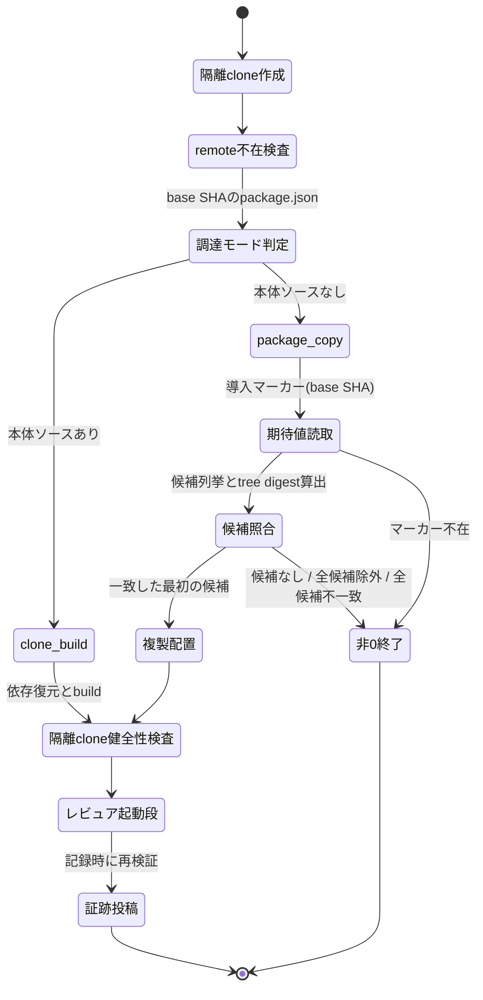

# DESIGN: gate-local-review の信頼 clone が consumer project のビルド成功を前提とし、ローカルゲートレビューを実行できない

- Issue: `ISSUE-759`
- 対応する SPEC: `SPEC.md`

## 目的・対象範囲

本設計は、ローカルゲートレビューの準備段（信頼 clone の作成からレビュア起動スクリプト呼び出し直前まで）が、consumer project 固有のビルド構成・ビルド成否・依存導入成否に依存せずレビュア起動段へ到達する構造を定める。同時に、その到達を「信頼境界を弱めずに」成立させるため、隔離 clone の外から持ち込む実行コードの由来・完全性の検証、当該実行コードが実行時に依存を解決する参照経路の照合、証跡へ記録する launcher digest の算出対象、隔離環境の健全性検査を確定する。

対象は GitHub モードのローカルゲートレビュー経路の実行系（`.agent-skill-chain/scripts/gate-local-review.sh`、`.agent-skill-chain/scripts/cli-resolve.sh`、`src/commands/gate.ts` の証跡投稿・検証、`src/lib/review-evidence.ts` の証跡形式）と、導入マーカーを書き出す `init`・`upgrade`・`uninstall` に閉じる。レビュア本体の判定内容・プロンプト構成・ゲート集約規則・project policy の配布方針は変更しない。

## 前提・用語

本設計で用いる語は SPEC.md の用語表に従う（consumer project、信頼 clone、準備段、レビュア起動段、信頼実行環境、配布集合、調達実行コード）。本設計が追加で用いる語は次の 3 つに限る。

| 用語 | 本設計での意味 |
|---|---|
| 調達段 | 準備段のうち、信頼実行コード一式を隔離 clone 配下へ用意する区間。 |
| 調達モード | 調達段が採る 2 つの経路の区別。`clone_build`（隔離 clone 内の agent-skill-chain 自身のソースから CLI を生成する）と `package_copy`（隔離 clone の外にある配布パッケージの実体を検証して複製する）。 |
| 正準ツリー digest | パッケージ root 配下のファイル集合から、時刻・所有者・配置場所に依存しない規則で算出する単一の digest 値。 |

前提として次を置く。(a) 隔離 clone は protected default branch の base SHA を checkout した状態であり、その内容は審査対象（target SHA の Issue worktree）から独立している。(b) consumer project には配布集合と、`init`/`upgrade` が生成する導入マーカー（`.agent-skill-chain/.installed_version` と本設計が追加する `.agent-skill-chain/.trusted-cli.json`）だけが存在し、agent-skill-chain 本体のソース・ビルド定義は存在しない。(c) 実行には Node.js が必要である（CLI 自体が Node.js 実行系であるため、本設計はこの前提を新たに追加しない）。

## 設計セグメントで確定させた判断

### 判断1: 要件7(b) の期待値の供給元を base SHA のコミット内容へ限定する

要件7(b) は「調達した実体の内容から算出した digest が、審査対象が変更しうる情報源に依存しない期待値と一致する」ことを求めるが、期待値そのものの供給元は SPEC が設計セグメントへ委ねている。本設計は次を確定する。

**期待値の供給元は、隔離 clone に checkout された base SHA のコミット内容に含まれる導入マーカー `.agent-skill-chain/.trusted-cli.json` だけとする。** 読み取りは常に SHA を明示した Git オブジェクト参照（`git show <base_sha>:<path>`）で行い、作業ツリー上のファイルを読まない。

この限定は、要件7(b) が設計セグメントへ委ねた唯一の未確定点（期待値そのものの供給元）を閉じるものであり、以降の本設計の全記述はこの限定を前提とする。期待値側の由来が破れていないことは、準備段の実行結果を信用せずに検査する。すなわち E8 が証跡投稿時に base SHA の導入マーカーを独立に読み直し、launcher token が運んだ値および実行中のパッケージ root から再算出した digest と三者が一致することを確認し、不一致なら証跡を投稿せず非0終了する。

供給元として採らないものを明示する。(i) target SHA 側のファイル、(ii) 隔離 clone の作業ツリーへ準備段自身が書いた一時ファイル、(iii) 調達元パッケージ自身が同梱する自己申告値、(iv) 環境変数・コマンド引数、(v) npm レジストリ等のネットワーク上の情報源。(i)(ii) は審査対象または準備段の実行中に変更されうるため要件7(b) の目的（由来検証）を空洞化する。(iii) は改変された実体が自身の期待値も同時に書き換えられるため検証にならない。(iv) は実行環境から注入でき base SHA に束縛されない。(v) はゲート実行をネットワーク到達性に依存させ、かつ base SHA との対応を持たない。

導入マーカーを配布集合の内側（例: `.agent-skill-chain/config/` 配下）ではなく外側へ置く理由は 2 つある。第一に、期待値は「その consumer が導入時に実際に用いた配布パッケージ」の内容 digest であり、consumer ごとに異なる値を持つ。配布集合は全 consumer へ同一内容が配られる集合であり、consumer 固有の値を持てない。第二に、配布集合に属し隔離 clone から読まれる asset は、要件6 の下限により launcher digest の算出対象へ含めることが要求される。算出対象へ新しい必須要素を加えると、当該要素をまだ含まない base SHA に対する digest 算出が停止し（要件6 が維持を求める全件取得の前提により、これは fail-closed として正しい挙動である）、当該 base SHA を持つ既存 PR の証跡投稿と過去 attempt の再検証が一斉に止まる。導入マーカーを配布集合の外へ置けば、要件6 の上限（配布集合の要素のみ）により算出対象へ含めてはならないことが一意に定まり、この停止は起きない。期待値の事後検証可能性は、証跡に trusted base SHA と調達実体の digest を併記することで保たれる（設計要素 E8）。

### 判断2: AC-13 は本体経路で充足する

AC-13 の代替充足経路（準備段が調達実行コードを持ち込まない設計）は、配布集合のみを持つ consumer project では CLI 実体が隔離 clone 内に存在し得ず、AC-14（信頼実行コード一式を隔離 clone 配下へ実際に用意してレビュア起動段へ到達する）と同時に成立しない。**本設計はこの代替経路を採らず、AC-13 の本体経路（調達元の正規実体で到達し、1 バイト改変した状態では非0終了する）で充足する。** すなわち consumer project での実行では必ず調達実行コードを持ち込み、その由来と完全性を検証し、証跡へ記録する。

### 判断3: 依存導入と build の扱いを AC-1 と AC-2 の双方に適合させる

AC-1 は準備段の npm 呼び出し記録に `ci --ignore-scripts` と `run build` の**いずれも**含まれないことを求め、AC-2 は `run build` が含まれないことを求める。**本設計は `package_copy` モードにおいて、準備段が依存導入（`npm ci`・`npm install` 等）と build script の実行をいずれも行わない**ことで双方を同時に満たす。依存導入自体は要件1 が禁じるものではないが、行わなければ AC-1 が禁じる 2 種の呼び出しはいずれも記録に現れず、consumer 自身の依存導入の失敗が準備段の成否条件になることもない（AC-9）。

`package_copy` モードで npm を起動するのは、調達候補の所在を問い合わせる `npm root -g` の 1 か所だけである。これは導入でも build でもない読み取りであり、npm 呼び出し記録には AC-1 が禁じる 2 種のいずれとも異なる形で現れる。npm が存在しない環境・当該問い合わせが失敗する環境では、当該候補を候補なしとして次へ進むだけで準備段は停止しない（設計要素 E3）。

**したがって `package_copy` における npm 呼び出し記録の確定した期待値は「`ci --ignore-scripts` と `run build` のいずれも現れないこと」であり、「記録が空であること」ではない。** 記録が空になるのは、候補 (a)（protected base worktree root 直下の依存ディレクトリ）で採用が確定して `npm root -g` へ到達しない実行に限られ、どの候補で採用が確定するかは実行環境によって変わる。AC-1 が要求するのも 2 種の呼び出しが現れないことであり、空であることではない。本設計・PLAN.md・テストの期待値はすべて前者で統一し、記録が空であることを条件に置かない。

### 判断4: 依存の参照先を照合する範囲と手段を確定する

要件7(d) は調達候補の採否条件を 2 つ定める。第一は候補の実体パスが protected base worktree 以外の linked worktree の配下にないこと、第二は当該候補がレビュア起動・prompt 生成・verdict 記録の実行時に読み込む依存モジュールについて、その供給元に置かれた参照経路を全て解決した後の実体パスがいずれも当該 linked worktree の配下にないことである。要件は供給元を「候補パッケージ直下および候補と同じ親の `node_modules`」と定めるが、その解決範囲と照合手段は設計へ委ねられている。本設計は次を確定する。

**照合対象の集合**: 供給元は 2 か所に限る。(1) 候補パッケージ root 直下の依存ディレクトリ。(2) 候補パッケージ root の親ディレクトリが依存ディレクトリである場合の当該親ディレクトリ。この 2 か所それぞれについて、ディレクトリ自身と、その直下の全エントリを照合対象とする。名前が `@` で始まるエントリはスコープ名のディレクトリであり、その直下の各エントリを照合対象とする。(2) に含まれる候補パッケージ自身は第一の条件で照合済みであるため、第二の条件では重ねて数えない。それ以外の除外は設けない。

**解決手段**: 照合対象の各パスについて、途中のディレクトリを含む参照経路（symbolic link）を全て解決した実体パスを求める。解決できない場合（リンク切れ・権限不足・循環）は候補を除外する。解決できない参照先が審査対象の配下でないことを示せないためであり、安全側ラチェット（不変条件 I8）に従う。

**照合手段**: 実体パスが protected base worktree 以外の linked worktree の配下にあるかの判定は、候補の実体パスに用いるものと同一の 1 つの判定とする。判定規則を候補用と依存用の 2 つに分けない。分けると片方だけが更新されて食い違い、食い違いが検出されないためである。

**適用位置**: 2 条件はいずれも候補の採用前、正準ツリー digest の算出より前に判定する。除外した候補には複製も参照経路の付与も行わない。要件7(d) が「候補全体として採用・実行せず、隔離 clone から当該候補または当該依存への参照経路も作らない」ことを求めるためである。

**再帰しない範囲**: 照合するのは上記 2 か所に置かれた参照経路の解決後実体パスに限り、そこから先の依存閉包（解決先のパッケージが更に読み込む依存）を再帰的に解決して照合することはしない。複製先パッケージ root を基点とする実行時の module 解決が最初に到達する依存ディレクトリはこの 2 か所だけであり、審査対象の Issue worktree 配下の実体を依存として解決させる参照経路はこの 2 か所にしか置けないためである。審査対象以外から供給される依存閉包の供給網の完全性は別の脅威モデルであり、Issue #772 が扱う。

**第二の条件が独立に必要な理由**: E5 の正準ツリー digest は走査根からの相対で依存ディレクトリ配下を対象から除く。したがって供給元へ参照経路を追加または差し替える改変は候補の digest を変えず、候補の実体パス照合と digest 照合をいずれも通過する。第二の条件を持たない実装は、この経路で審査対象が用意した実体を実行時依存として読み込ませることができる。

## 要件 → 設計要素の対応表

SPEC.md の全要件・全 AC-ID は、下表の 12 の設計要素へ対応する。

| 要件 / AC-ID | 対応する設計要素 | 備考 |
|---|---|---|
| 要件1（準備段を信頼実行環境の用意に限定） | E1, E2, E3 | consumer project では調達モードが `package_copy` に確定し、依存導入と build script を実行しない（`npm root -g` による所在問い合わせのみ現れうる） |
| 要件2（package.json・lockfile・build script を持たない consumer） | E1, E3 | 判定入力に consumer の Node 構成を用いない |
| 要件3(a)（実行コードと asset が審査対象由来でない） | E3, E6, E8, E10 | 候補の除外規則（実体パスと依存の参照先の 2 条件）・解決の閉鎖・記録時の再検査・asset 解決順序の確定 |
| 要件3(b)（由来が実行時に識別でき証跡値が埋まる） | E4, E5, E7, E8 | 調達元識別子と実体 digest、launcher digest の算出成立 |
| 要件3(c)（隔離環境に remote が1件も存在しない） | E9 | 削除に加えて不在の積極検査 |
| 要件4（用意できない場合は非0終了・フォールバック禁止） | E3, E6 | 前提と是正手段を含む日本語メッセージ |
| 要件5（既存の拒否経路の維持） | E8, E9 | 3 メッセージと検査位置を変更しない |
| 要件6（launcher digest の算出対象の上限と下限） | E7 | 上限と下限に挟まれた範囲を 10 要素の固定列挙へ確定、全件取得の前提維持 |
| 要件7（調達実行コードの由来・完全性・記録・(d) の 2 つのパス条件） | E3, E4, E5, E8 | 期待値供給元の限定と二重検証。(d) が定める 2 条件（候補の実体パスと、依存の供給元に置かれた参照経路を解決した後の実体パス）は採用前に E3 が照合する |
| AC-1 | E1, E3, E11 | 非 Node consumer で npm 呼び出し記録に `ci --ignore-scripts` と `run build` のいずれも現れない |
| AC-2 | E1, E3, E11 | build script の痕跡ファイルが隔離 clone 内に生じない |
| AC-3 | E3, E6, E10, E11 | 起動スクリプトと adapter の解決元が隔離 clone。自リポジトリ形状と consumer 形状の双方で確認する |
| AC-4 | E8, E9, E11 | 既存 3 メッセージの保持 |
| AC-5 | E3, E6, E11 | 供給元不在時の非0終了と、探索した候補の識別子・探索先を全件含む日本語メッセージ |
| AC-6 | E1, E2, E11 | 本リポジトリでの回帰なし |
| AC-7 | E7, E11 | consumer 形状で execution 値が埋まる |
| AC-8 | E7, E11 | project policy 文書の有無で digest が変わらない |
| AC-9 | E1, E3, E11 | consumer の依存導入失敗が準備段を止めない |
| AC-10 | E3, E6, E8, E11 | 外部 2 実体を実行せず隔離 clone 内の実体を実行 |
| AC-11 | E9, E11 | remote 出力が空 |
| AC-12 | E7, E11 | 算出対象要素の欠落で非0終了 |
| AC-13 | E3, E4, E5, E8, E11 | 正規実体で到達、1 バイト改変で非0終了 |
| AC-14 | E1, E3, E4, E6, E11 | 代表 3 構成でレビュア起動段へ到達し証跡を投稿 |
| AC-15 | E10, E11 | prompt 生成が読む asset の解決基点と、解決された各 asset のパスの実行時観測 |
| AC-16 | E3, E11, E12 | 依存の参照先が審査対象の linked worktree 配下を指す候補を採用前に除外する規則と、実行時に解決された依存の実体パスの観測。参照経路を持つ状態と持たない状態の 2 状態で確認する |

## 責務・境界

### コンポーネント構成

- `E1 調達モード判定`（`.agent-skill-chain/scripts/gate-local-review.sh` 内、隔離 clone 作成後の最初の分岐）: 隔離 clone に checkout された base SHA のコミット内容だけを入力として、調達モードを 1 つに確定することだけを責務とする。
  - 判定入力: `git show <base_sha>:package.json` の結果のみ。
  - 判定規則: 当該ファイルが取得でき、JSON として解析でき、`name` が `agent-skill-chain` であり、`bin` に `agent-skill-chain` の入口が定義されている場合に限り `clone_build`。それ以外（ファイル不在・解析失敗・`name` 不一致・`bin` 入口不在）はすべて `package_copy`。
  - 判定入力に consumer の作業ツリー状態・環境変数・`PATH`・`npm` の有無を用いない理由: これらは審査対象または実行環境から変更でき、モードが変われば適用される検証も変わるため、判定自体を base SHA に束縛する必要がある。既定側（`package_copy`）は必ず由来検証を伴う経路であり、判定が誤って既定側へ倒れても検証が省かれることはない。
- `E2 clone_build 経路`（同スクリプト）: 隔離 clone 内で `npm ci --ignore-scripts` と `npm run build` を実行し、隔離 clone 直下に CLI 実体を生成する。現行の処理内容・順序・失敗時の非0終了を変更しない。
  - 本経路が要件1 に反しない根拠: SPEC.md の用語表は consumer project を「agent-skill-chain 本体のソースを持たない配布先リポジトリ」と定義する。本経路は E1 の判定により本体ソースを持つリポジトリでのみ選択され、そこで実行される build は agent-skill-chain 自身の CLI 生成、すなわち要件1 が準備段の目的として認める「信頼実行環境の用意」そのものである。consumer project では E1 が本経路を選択しないため、consumer 固有のビルド処理は起動されず、その成否も前提にならない。
- `E3 package_copy 経路（調達段）`（`.agent-skill-chain/scripts/cli-resolve.sh` の新規公開関数として実装し、`gate-local-review.sh` が隔離 clone 内の同ファイルを読み込んで呼ぶ）: 隔離 clone の外にある配布パッケージの実体を検証し、隔離 clone 配下へ複製して実行可能にすることだけを責務とする。npm による依存導入・build script の実行を一切行わない。
  - 実装位置の理由: 「どの CLI 実体を使うか」の解決は既に同ファイルの責務であり、調達はその解決に検証と複製を加えたものである。責務を同一境界へ置くことで、解決経路の探索順を 2 か所に複製しない。加えて、隔離 clone 内のファイルを読み込んで呼ぶことで、実行される調達コード自体が base SHA のものになる。
  - 隔離 clone 側に当該関数が無い場合（base SHA が本変更より前の状態）: 準備段は呼び出し元側の実装で代替せず、関数を解決できないことを前提として明示して非0終了する。呼び出し元は protected base worktree の作業ツリー版であり base SHA より新しいことがあるため、代替すると証跡の launcher digest が指す base SHA の実装と実際に走った調達コードが食い違う。
  - 手順: (1) 期待値の読み取り（E4）。(2) 調達候補の列挙。(3) 候補ごとの正準ツリー digest 算出（E5）と期待値との照合。(4) 一致した最初の候補の採用。(5) 複製と実行入口の用意。(6) 複製先での digest 再算出による複製完全性の確認。(7) 調達結果（調達モード・調達元識別子・実体 digest）の確定。
  - 調達候補の列挙順: (a) protected base worktree root 直下の `node_modules/agent-skill-chain`、(b) `npm root -g` が返すディレクトリ配下の `agent-skill-chain`（`npm` が存在する場合のみ。存在しない・失敗する場合は候補なしとして次へ進む）、(c) `command -v agent-skill-chain` が解決する実行ファイルの実体パスから辿るパッケージ root。
  - 候補の除外規則（2 条件）: 判断4 に従い、次のいずれかに該当する候補は採用せず、候補全体として除外する。第一に、候補の実体パスが本リポジトリの linked worktree（protected base worktree を除く）の配下にあること。第二に、判断4 が定める照合対象（候補パッケージ root 直下の依存ディレクトリと、親が依存ディレクトリである場合の当該親ディレクトリ、およびそれぞれの直下エントリ）の参照経路を全て解決した実体パスのいずれかが、同じく当該 linked worktree の配下にあること、または解決できないこと。判定はいずれも正準ツリー digest の算出より前に行い、除外した候補には複製も参照経路の付与も行わない。要件3(a) が求める「審査対象由来でないこと」を、内容一致だけでなく、実行コードの所在と、実行時に読み込まれる依存の所在の双方によって担保するためである。第二の条件が digest 照合と独立に必要なのは、E5 の走査が依存ディレクトリ配下を対象から除くため、参照経路を審査対象へ向けた改変が候補の digest を変えないことによる。
  - 採用規則: 候補は「期待値と一致した場合にのみ」採用する。不一致の候補は採用も実行もせず次の候補へ進む。候補の検査は読み取りだけで行い、候補の実行ファイルを起動して健全性を確かめる形は採らない（既存の未設定時の解決経路が `PATH` 上の候補に対して行っている起動確認は、調達段では行わない）。これにより、隔離 clone の外に非正規の実体が置かれていても、それらは実行されない（AC-10）。AC-13(ii) が定める「調達元の実体を 1 バイト改変した状態」は、AC-13(i) で採用された候補の内容を改変した状態を指す。本設計では当該候補は不一致となって採用も実行もされず、他に期待値と一致する候補が無ければ非0終了する（証跡は投稿されない）。他に一致する候補がある実行環境でも、改変された実体が採用・実行されることはない。
  - 失敗時の分岐: 採用候補が確定しない場合の前提を 3 種に分ける。(1) 候補が 1 つも存在しない場合は「信頼実行コードの供給元が実行環境に存在しない」。(2) 候補は存在したが除外規則で全て除外した場合は「調達候補が審査対象の linked worktree に由来する、または審査対象の linked worktree 配下の実体を依存として解決する」。(3) 除外されなかった候補はあったが期待値と一致するものが無い場合は「調達候補の完全性検証に失敗した」。いずれも前提として明示し、是正手段（(1) は配布パッケージの導入、(2) は当該参照経路の除去または審査対象外の実体から依存を解決できる状態への是正、(3) は導入版と導入マーカーの整合回復のための `upgrade` 実行とその結果の default branch への反映）を含む日本語メッセージを標準エラーへ出して非0終了する。いずれの場合もレビュアを起動せず、審査対象の実行コードへフォールバックしない（要件4）。いずれのメッセージにも、列挙した候補の識別子（(a)(b)(c) の別）と実際に探索したパスを全件含める。`npm` 不在等で探索そのものができなかった候補は、その理由を併記する。除外規則で除外した候補については、第一・第二のどちらの条件で除外したか、第二の場合は検査した参照経路と解決後の実体パス（解決できなかった場合はその旨）および該当した linked worktree のパスを併記する。SPEC.md AC-5 が、探索結果を示さず一般的な失敗のみを出力する実装を充足と認めないためである。配布物がローカルの package キャッシュにのみ存在する実行環境は「候補が 1 つも存在しない」側に該当し、この経路で停止する。
  - 複製と実行入口: 採用候補のツリー（`node_modules/` 配下を除く）を実行ビットを保ったまま `<隔離 clone>/node_modules/agent-skill-chain/` へ複製し、`<隔離 clone>/node_modules/.bin/agent-skill-chain` を複製先の入口を起動する実行可能なファイルとして用意する。複製先を選ぶ理由は、既存の CLI 解決が隔離 clone 直下の `node_modules/.bin/agent-skill-chain` を `PATH` 上の実体より先に探索するため、解決順序を変更せずに隔離 clone 内の実体が選ばれる状態を作れることによる。
  - 依存モジュールの扱い: 採用候補の親ディレクトリ配下にある依存モジュール（採用候補自身を除く）を、`<隔離 clone>/node_modules/` から参照できるようにするための symbolic link を作る。採用候補の直下に依存ディレクトリが置かれている導入形態（依存が親へ引き上げられない場合）に備え、複製先の同じ位置にも当該ディレクトリを指す symbolic link を作る。調達段が作る symbolic link は `<隔離 clone>/node_modules/<依存名>` と `<隔離 clone>/node_modules/agent-skill-chain/node_modules` の 2 種に限り、複製先パッケージ root 配下のそれ以外の位置には作らない。前者は複製先パッケージ root の外にあり、後者は複製先パッケージ root からの相対で `node_modules/` 配下にあるため、いずれも E5 の走査範囲の外である。したがって E5 が定める「対象範囲内に symbolic link を見つけた場合は算出を中止する」条件に該当せず、E3 と E5 は同時に成立する。依存モジュールの実体は隔離 clone 配下へ複製しない。これにより、SPEC.md の用語が定める調達実行コード（隔離 clone 配下へ配置した実体）と、本設計が検証・記録する対象が完全に一致する。参照経路を作る対象は、候補の除外規則の第二の条件で照合した集合（判断4 が定める照合対象）の内側に限る。判断4 の照合対象はスコープ名のディレクトリの直下エントリまで含むため、参照経路を作る対象はその部分集合になる。照合していない対象へ参照経路を作らないのは、照合を経ないまま実行時に到達可能な依存が残らないようにするためである。加えて、参照経路を作る直前に同じ照合を再度行い、条件を満たさないものが 1 つでもあれば参照経路を作らず非0終了する。採用の判定と参照経路の付与の間に参照先が差し替えられた場合に安全側へ倒すためである。依存の由来・完全性の積極的な検証（実体の digest 照合等）は行わず、それは Issue #772 の射程であり本設計は現行より弱めない（現行の `clone_build` 経路では依存は lockfile から復元され、その扱いは変更しない）。ただし「依存の参照先が審査対象の linked worktree 配下でないこと」の照合は要件7(d) の一部であり、#772 の射程ではなく本設計の候補の除外規則が担う。
  - 隔離 clone の Git 状態に対する配慮: 調達物を配置する前に、隔離 clone の `.git/info/exclude` へ `/node_modules/` を追加する。consumer が `node_modules/` を無視対象に持たない場合でも、調達物の配置を理由に既存の「隔離した protected base clone が build 後に dirty」検査が発火しないようにするため。除外は調達物の配置先パスに限り、それ以外の差分検知能力は変えない。
- `E4 期待値の供給元（信頼 CLI 導入マーカー）`: consumer project の `.agent-skill-chain/.trusted-cli.json` を、調達実体の期待値の唯一の供給元とする。
  - 内容: スキーマ識別子、パッケージ名とバージョン、正準ツリー digest の 3 項目。
  - 読み取り: 準備段は隔離 clone に対する `git show <base_sha>:<path>`、証跡投稿時の再検証は protected base worktree に対する同一の参照で行う。いずれも作業ツリー上のファイルを読まない。
  - 生成と撤去: `init`・`upgrade` が、自身が実行されているパッケージ root から算出した値で当該ファイルを書き出す（`--dry-run` では書かない）。`uninstall` は `.agent-skill-chain/.installed_version` と同じ扱いで撤去対象へ含める。配布集合の要素ではないため、配布元→展開先の複製一覧には登録せず、既存の所有権記録・stale 判定の対象にもしない。
  - 当該ファイルが base SHA に存在しない場合: 期待値が無い状態で調達を行わず、E3 の失敗経路として非0終了する（`upgrade` 実行と結果の反映を是正手段として案内する）。
- `E5 正準ツリー digest`: 配置場所・導入経路・時刻に依存しない単一値を与えることだけを責務とする。
  - 走査根: 本設計が E5 を適用する走査根は 2 つだけである。(i) 期待値照合時の調達候補のパッケージ root、(ii) 複製完全性の確認時の複製先パッケージ root（`<隔離 clone>/node_modules/agent-skill-chain/`）。隔離 clone の root 自身と `<隔離 clone>/node_modules/` 直下は走査根にしない。
  - 対象: 走査根の配下の通常ファイル。走査根からの相対で `node_modules/` 配下と `.git/` 配下は対象から除く。除外を適用した後の対象範囲内に symbolic link を見つけた場合は算出を中止して非0終了する（リンク先の差し替えで実効内容が変わりうるため、安全側へ倒す）。除外された範囲にある symbolic link はこの中止条件に該当しない。調達候補自身が対象範囲内に symbolic link を含む場合は digest を算出できず、E3 の失敗時の分岐（完全性検証に失敗した側）で停止する。
  - 算出: 各対象ファイルについて「実行ビットの有無・内容の SHA-256・パッケージ root からの相対パス」を 1 行とし、相対パスの昇順で連結した文字列の SHA-256 を値とする。時刻・所有者・inode を入力に含めない。
  - 実装: 準備段（Node.js の1回起動による算出）と CLI（TypeScript）の 2 実装を持つ。両者が同一のツリーに対し同値を返すことを単体テストで固定し、片方だけの変更で乖離しない状態を保つ。
- `E6 隔離 clone 内の CLI 解決の閉鎖`（`.agent-skill-chain/scripts/cli-resolve.sh`）: 信頼実行の文脈では隔離 clone の外にある実体へ解決しないことを責務とする。
  - `ASC_TRUSTED_CLI_ROOT` が設定されている場合、探索対象を当該 root 配下の 2 経路（`bin/agents-md.js`、`node_modules/.bin/agent-skill-chain`）に限定し、`PATH` 上の実体への解決と自動導入フォールバックを行わない。解決できない場合は理由を日本語で出力して非0終了する。
  - `gate-local-review.sh` は `gate-review.sh` と `gate-launch-reviewer.sh` の起動時に `ASC_TRUSTED_CLI_ROOT` へ隔離 clone のパスを与える。
  - 未設定時（consumer の通常運用、CI ラッパー、doctor 等）の解決順序と自動導入の挙動は変更しない。
- `E7 launcher digest の算出対象`（`src/commands/gate.ts` の固定パス集合）: 要件6 の上限と下限の内側で算出対象を 1 つに確定する。
  - 確定した算出対象は次の 10 要素とする。`.agent-skill-chain/scripts/gate-local-review.sh`、`.agent-skill-chain/scripts/gate-launch-reviewer.sh`、`.agent-skill-chain/scripts/gate-review.sh`、`.agent-skill-chain/scripts/cli-resolve.sh`、`.agent-skill-chain/adapters/claude.sh`、`.agent-skill-chain/adapters/codex.sh`、`.agent-skill-chain/adapters/human.sh`、`.agent-skill-chain/config/roles.yaml`、`.agent-skill-chain/schemas/gate-report.schema.yaml`、`.agent-skill-chain/schemas/project-policy.schema.yaml`。この列挙は固定であり、実行環境・実行時の解決結果によって変動しない。
  - 現行からの差分は 2 件の除去と 1 件の追加だけである。除去は `.agent-skill-chain/project/manifest.yaml` と `.agent-skill-chain/project/MODEL_TIER_TABLE.md`（いずれも配布集合の外にあり、要件6 の上限に反する）。追加は `.agent-skill-chain/scripts/cli-resolve.sh`（レビュア起動スクリプトが隔離 clone 内から読み込んで実行する共有実装であり、本設計では調達段の実装も含むため、要件6 の下限が定める実行コードに該当する）。
  - 下限との一致: 要件6 の下限は、(A) 現行列挙から `.agent-skill-chain/project/` 配下 2 件を除いた 9 要素と、(B)「レビュア起動・prompt 生成・verdict 記録を実際に行う実行コードおよびその実行系が隔離 clone から読み込む asset のうち配布集合に属するもの」の和集合である。(A) は上記 10 要素に全件含まれる。(B) の実行コードは `gate-local-review.sh`・`gate-launch-reviewer.sh`・`gate-review.sh`・`cli-resolve.sh`・3 adapter であり、`cli-resolve.sh` 以外は (A) に含まれるため、追加は 1 件で足りる。(B) の asset は、E10 が確定する固定順序の第 1 段（protected base worktree の root）が配布集合の要素を必ず供給するため、配布集合が導入済みの consumer では隔離 clone から読み込まれる asset は存在しない。よって算出対象は下限と過不足なく一致し、同時に上限（配布集合の要素のみ）も満たす。
  - 第 2 段（実行中の CLI のパッケージ root）が asset を供給する状態（consumer の root に当該要素が無い部分導入）でも束縛の空白は生じない。当該内容は `clone_build` では隔離 clone に checkout された base SHA が、`package_copy` では調達実体の正準ツリー digest（E5 が算出し E8 が証跡へ記録する値）が束縛するためである。実行時にどちらの段が供給したかに応じて算出対象を変える設計は採らない。算出対象が実行環境ごとに変わると同一 base SHA に対する digest が一意でなくなり、証跡の事後検証が成立しないためである。
  - 維持: 「算出対象のいずれかを trusted base SHA から取得できない場合は部分集合で算出せず、取得できなかった要素を示す日本語メッセージを出して非0終了する」現行挙動。AC-12 はこの停止を上記 10 要素それぞれについて要求する。
  - 非追加: `.agent-skill-chain/.trusted-cli.json` は配布集合の外にあるため、要件6 の上限により算出対象へ含めない。
- `E8 launcher token の拡張と証跡記録・記録時再検証`（`.agent-skill-chain/scripts/gate-local-review.sh` と `src/commands/gate.ts`、`src/lib/review-evidence.ts`）: 調達の事実を、準備段から証跡までを貫く 1 本の経路で束縛することを責務とする。
  - launcher token（準備段が所有者専用の権限で生成し、slot ごとに 1 回だけ消費される既存の受け渡し経路）へ `trusted_root`（隔離 clone の絶対パス）と `procurement`（調達モード・調達元識別子・実体 digest）を追加する。token payload の digest は証跡へ `launcher_token_digest` として記録済みであり、追加した値も同じ digest に含まれる。新しい受け渡し経路を作らないのはこのためである。
  - 証跡投稿（`gate submit-evidence`）は、既存の検査（Issue worktree からの投稿拒否、recorder HEAD と trusted base SHA の一致、protected base worktree の tracked file が dirty でないこと）に加えて次を行う。(i) token の追加フィールドの形式検査。(ii) 実行中の CLI 実体のパッケージ root が `trusted_root` 配下にあること（`clone_build` では隔離 clone の root 自身がパッケージ root になるため、この判定は root 自身を含む）。(iii) 調達モードを base SHA のコミット内容から独立に再導出し、token の値と一致すること。(iv) 調達モードが `package_copy` の場合、実行中のパッケージ root の正準ツリー digest を再算出し、base SHA の導入マーカーの期待値および token の値と一致すること。いずれか不成立なら証跡を投稿せず非0終了する。
  - 証跡の `execution` へ `procurement`（調達モード・調達元識別子・`package_copy` のときは実体 digest）を記録する。証跡のスキーマ識別子は現行のまま据え置き、当該フィールドを任意フィールドとして追加する。既に投稿済みの証跡を形式不適合にすると、過去 attempt の検証と round 計数が一斉に失敗するためである。存在する場合のみ形式を検査する。
  - 調達元識別子は「何をどこから取得したか」を一意に示す値とし、採用候補の実体パスとパッケージ名・バージョンを組み合わせた文字列とする。`clone_build` の場合は隔離 clone の base SHA を指す値とする。
- `E9 隔離環境の健全性検査`（`.agent-skill-chain/scripts/gate-local-review.sh`）: 隔離 clone が満たすべき状態を、処理の実行ではなく状態の観測によって確定することを責務とする。
  - remote の削除後に `git remote` の出力が空であることを積極的に検査し、空でなければ非0終了する。削除処理の存在ではなく不在という状態を検査対象にするのは、削除が失われた場合に検査が沈黙しないようにするため（AC-11）。
  - 既存の「隔離した protected base clone が build 後に dirty」検査は維持する（E3 の除外設定と併用する）。
  - 既存の 3 拒否経路（recorder HEAD 不一致・Issue worktree からの投稿・protected base worktree の dirty）のメッセージと検査位置は変更しない。
- `E10 prompt 生成が読み込む asset の解決基点`（`src/commands/gate.ts` と共有の asset 解決）: レビュア起動段が読む asset（レビュー観点の template・schema・role contract・project policy 分類）の解決を 1 本の固定順序に確定し、Issue worktree を基点にしないことを責務とする。
  - 固定順序: 第 1 段は、隔離 clone 内から起動された CLI プロセスの作業ディレクトリが指す repository root（ローカルゲートレビュー経路ではこれが protected base worktree の root であり、コアレビュー方針の読み取り基点と同一である）の配下の `.agent-skill-chain/<相対パス>`。存在すればこれを採る。第 2 段は、実行中の CLI のパッケージ root 配下の `.agent-skill-chain/<相対パス>`（`package_copy` では隔離 clone 内の複製先、`clone_build` では隔離 clone の root）。第 1 段で解決できた場合は第 2 段を参照せず、両段で解決できない場合は解決失敗として停止する。「protected base worktree の root か隔離 clone か」は二者択一の設計選択ではなく、この 1 本の順序が実行時に決める結果である。本設計はこの順序を変更しない。
  - どちらの段も Issue worktree を含まない。第 1 段が protected base worktree であることは既存検査（作業ツリー root と repository root の一致、HEAD と trusted base SHA の一致、tracked file が dirty でないこと）が担保し、第 2 段が隔離 clone 配下であることは E6（`ASC_TRUSTED_CLI_ROOT` による CLI 解決の閉鎖）と E8 の記録時再検査（実行中の CLI のパッケージ root が `trusted_root` 配下にあること）が担保する。本設計はこれらの検査を変更しない。
  - レビュア起動スクリプトと adapter は上記の解決を経ず、スクリプト自身の位置から解決されるため、常に隔離 clone 配下の実体が使われる（準備段が隔離 clone 内のレビュア起動スクリプトを起動し、当該スクリプトが自身の位置から adapter ディレクトリを決める）。
  - 観測点: AC-15 が要求する「実行時に解決された各 asset のパス」を実行中に観測できるようにするため、共有の asset 解決が返した絶対パスを 1 行ずつ追記する出力先を、環境変数 `ASC_ASSET_TRACE_FILE` が与えられたときに限り有効にする。未設定時は何も出力せず、解決の順序・結果・失敗時の挙動を変えない。記録するのは本番経路が実際に用いる同一の解決関数が返した値であり、観測のために別経路で解決し直さない。
- `E11 検証`: 上記の振る舞いを固定する自動テスト。既存のローカルレビュー統合テストの stub 構成を、consumer 形状（配布集合と導入マーカーのみを持ち、期待値に一致する stub パッケージを隔離 clone の外に置く）と自リポジトリ形状（`agent-skill-chain` を名乗る `package.json` と build 定義を持つ）の両方へ拡張する。npm は `PATH` 先頭に置く記録用の代替コマンドで模し、実ネットワークへはアクセスしない。consumer 形状では、起動スクリプトと adapter の解決元が隔離 clone 配下であること（AC-3）と、E10 の観測点が記録した各 asset の解決済みパスが Issue worktree 配下でないこと（AC-15 の連言の第 1 項）を、いずれも実行時の値で確認する。consumer 形状ではさらに、依存の供給元に置かれた参照経路が審査対象の linked worktree 配下を指す候補が採用されないこと（AC-16）を、当該参照経路を持たない状態と持つ状態の 2 状態で確認する。詳細な構成と網羅範囲は PLAN.md に置く。
- `E12 実行時依存の解決先の観測点`（`src/lib/` の共有実装）: 実行中の CLI が読み込む依存モジュールについて、参照経路を全て解決した後の実体パスを実行中に観測できるようにすることだけを責務とする。
  - 観測対象: 実行中の CLI が自身のパッケージの依存として宣言し、レビュア起動段の経路で実際に読み込む各依存モジュール。当該依存を実際に読み込むモジュールを基点として、実行時の module 解決が返す解決先を取得し、それを参照経路を全て解決した実体パスへ正規化した値を記録する。別の基点・別の解決規則で解決し直さない（E10 の asset 観測点と同じ作法）。
  - 有効化: 環境変数 `ASC_DEPENDENCY_TRACE_FILE` が与えられたときに限り、当該ファイルへ 1 行ずつ追記する。未設定時は何も出力せず、解決の順序・結果・失敗時の挙動を変えない。追記に失敗しても本番経路の挙動を変えない。観測結果を判定の入力にしない（不変条件 I8: 観測は判定の入力ではない）。
  - 責務外: 観測点は依存の採否を決めない。審査対象由来の依存を排除するのは E3 の候補の除外規則であり、E12 はその結果を実行時の値として外から確認できるようにするだけである。両者を同一の判定へ束ねると、観測が無効な実行では排除も働かないことになるため分離する。
  - 要件6 との関係: 本観測点は CLI 側の実行コードに置き、配布集合の要素（`.agent-skill-chain/` 配下）を追加しない。したがって E7 が確定した launcher digest の算出対象 10 要素は変わらない。本観測点を含む CLI 実体は、`package_copy` では調達実体の正準ツリー digest が、`clone_build` では隔離 clone に checkout された base SHA が束縛する。

### 依存関係

```text
gate-local-review.sh（準備段）
  → 隔離 clone 作成・checkout・remote 削除・remote 不在検査（E9）
  → E1 調達モード判定（入力: base SHA のコミット内容）
      → clone_build: E2（npm ci --ignore-scripts → npm run build）
      → package_copy: E3（cli-resolve.sh の調達関数）→ E4 期待値 → E5 digest
  → launcher token 生成（E8: trusted_root・procurement を含む）
  → gate-review.sh / gate-launch-reviewer.sh（ASC_TRUSTED_CLI_ROOT 付与）
      → cli-resolve.sh（E6: 隔離 clone 配下のみ解決）→ 隔離 clone 内の CLI
          → adapter → レビュア（read-only）
          → gate submit-evidence（E7 launcher digest・E8 再検証と記録・E10 asset 解決基点・E12 依存解決先の観測）
init / upgrade → E4 導入マーカー生成（入力: 自身のパッケージ root、E5 digest）
uninstall → E4 導入マーカー撤去
```

依存は一方向であり循環はない。E5 は E3・E4・E8 から参照されるが、いずれへも逆依存しない。E6 は E3 と同一ファイルに置くが、E3（調達）が E6（解決）を呼ぶ一方向であり、E6 は調達の有無を知らない。E12 は観測だけを行い、E3 の除外規則にも E10 の解決順序にも影響を与えないため、他のどの要素からも依存されない。



### 図示要否の判断

- 判断: `要`
- 根拠: 責務境界となるコンポーネントが 12 あり基準の 3 つ以上に該当する。状態遷移も「調達モード判定 → 2 経路の分岐 → 健全性検査 → レビュア起動段 → 証跡投稿」と、各段からの非0終了への遷移を含めて 2 つ以上ある。本設計の中心は「どの入力でどちらの経路へ分岐し、どこで失敗したら停止するか」であり、この分岐と停止点を図で固定しておくことが、実装時に既定側（検証を伴う経路）が省略される事故を防ぐうえで有効である。

## 関連ADR

```yaml
related_adrs:
  - id: ADR-0068
    relation: references
  - id: ADR-0072
    relation: adopts
```

ADR-0068 は、ゲートのラウンド番号を耐久記録に残るレビュア証跡の反復識別子から導出し、その番号に基づいて反証 finding の blocking 基準の限定と打ち切りを機械化する決定である。本設計は当該決定の内容を変更しないが、要件6 に従って launcher digest の算出対象を変えるため、変更前に投稿済みの証跡は変更後のコードでは検証済みと扱われず、過去 attempt を用いるラウンド計数が利用不能へ倒れる（本ファイルの障害・ロールバック考慮に記載）。ADR-0068 が定めた「導出できない場合は限定と打ち切りだけを止め、差し戻しの反復は維持する」という帰結により、この状態でもゲートの反復自体は成立する。

ADR-0072 は、信頼実行環境の調達方式を 2 つの調達モードへ分けること、調達実体の期待値の供給元を base SHA のコミット内容に含まれる導入マーカーへ限定すること、依存モジュールの実体を隔離 clone 配下へ配置せず参照経路のみを与えることを決定した。本設計はこの決定を採用しており、当該 ADR は既に `accepted` であるため上記の構造化リストへ載せる。ADR とした理由は、「隔離 clone 配下へ置いたのだから由来は保証される」「期待値は調達元パッケージ自身が持てばよい」という一見自然な単純化が将来入りうるためであり、その単純化がいずれも由来検証を空洞化することを判断の記録として残す必要があるためである。

判断4（調達候補の採否を、候補の実体パスと、依存の供給元に置かれた参照経路を解決した後の実体パスの 2 条件で判定すること、およびその解決範囲を供給元 2 か所の直下エントリに限ること）は `docs/adr/ADR-0077-procured-candidate-dependency-reference-scope.md` として `proposed` で記録した。ADR とした理由は、「候補の実体パスさえ審査対象の外にあれば依存も審査対象の外から来る」という一見自然な推論が成り立たず、その反例（依存ディレクトリを走査対象から外す正準ツリー digest の下では、参照経路の差し替えが候補の digest を変えない）を判断の記録として残す必要があるためである。`proposed` の間は上記の構造化リストへ載せない（`accepted` の ADR のみ参照可能とする規約に従う）。

## 障害・ロールバック考慮

- 想定される失敗モード1（調達候補の不在）: consumer の実行環境に配布パッケージの実体が無い。レビュアを起動しないまま非0終了し、導入手段を案内する。証跡は投稿されない。
- 想定される失敗モード2（導入版と導入マーカーの乖離）: CLI をグローバル更新したが `upgrade` を実行していない、あるいは `upgrade` の結果を default branch へ反映していない場合、調達候補の digest が期待値と一致せず非0終了する。是正は `upgrade` の実行と結果の反映である。これは検出漏れではなく意図した fail-closed であり、版の取り違えを実行前に止める。
- 想定される失敗モード3（launcher digest 値の変化）: 要件6 に従い算出対象を変更するため、同一の base SHA に対しても launcher digest の値が変更前後で変わる。変更前に投稿済みの証跡は、変更後のコードで再検証すると digest 不一致となり、当該 attempt は検証済みとして扱われない（過去 attempt を用いる round 計数が `unavailable` へ倒れる）。影響は「過去の証跡の再検証」に限られ、承認済みゲートの判定記録そのものは Issue コメントと PR review 本文に残る。必要な場合は当該 target SHA に対して attempt を再実行する。要件6 が算出対象の変更自体を求めているため、この差異は回避せず明示する。
- 想定される失敗モード4（隔離 clone の dirty 検査の誤発火）: 調達物の配置先を `.git/info/exclude` へ登録しない実装では、`node_modules/` を無視対象に持たない consumer で検査が発火し、正常な実行が止まる。E3 の除外設定がこれを防ぐ。除外範囲は調達物の配置先に限る。
- 想定される失敗モード5（依存の参照先による候補の除外）: 候補の依存の供給元に、審査対象の linked worktree 配下を指す参照経路、または解決できない参照経路（リンク切れ等）がある場合、候補は採用されず非0終了する。これは検出漏れではなく意図した fail-closed であり、審査対象が実行時依存を介して prompt 生成・verdict 記録へ介入する経路を実行前に止める。正当な実行環境でも、依存の供給元にリンク切れのエントリがあれば停止しうるため、診断には検査した参照経路と解決後の実体パス（解決できなかった場合はその旨）を含め、是正対象を特定できるようにする。
- ロールバック手順: 変更は `.agent-skill-chain/scripts/gate-local-review.sh`、`.agent-skill-chain/scripts/cli-resolve.sh`、`src/commands/gate.ts`、`src/lib/review-evidence.ts`、`init`・`upgrade`・`uninstall` の各コマンド、新規の digest 実装、実行時依存の解決先の観測点、およびテストに閉じる。revert すれば従来の挙動（本リポジトリでのみローカルゲートが成立する状態）へ戻る。証跡の `procurement` を任意フィールドとしたため、revert 後も当該フィールドを含む証跡の検証は失敗しない。導入マーカーは consumer 側に残るが、参照者が無くなるだけで他の処理へ影響しない。
- 影響を受ける既存機能: ローカルゲートレビューの全経路（4 ゲート共通）、launcher digest の値、証跡の `execution` の内容、`init`・`upgrade`・`uninstall` が管理するファイル一覧。レビュアの判定内容・プロンプト構成・ゲート集約規則・project policy の配布方針・ローカルモードの経路は変更しない。

## 完了条件・検証方法

- SPEC.md の AC-1 から AC-16 の全てに対応する自動テストが存在し成功する（対応は上表と PLAN.md が示す）。
- 既存の gate-local-review 統合テストが、変更後の期待値（`package_copy` では npm 呼び出し記録に `ci --ignore-scripts` と `run build` のいずれも現れない、`clone_build` では従来の 2 コマンド）へ更新されたうえで成功する。
- 本リポジトリのテストスイート全体が成功し、`verify doc-length`・`verify spec-bdd`・`lint references`・`lint vocab`・`lint secrets`・`lint adr` を含む PR の CI が成功する。
- 準備段の Node.js 実装と CLI の TypeScript 実装が、同一ツリーに対して同値の正準ツリー digest を返すことを単体テストで確認する。

## 未決事項・対象外

- 実行時に解決される依存閉包（調達した CLI が読み込む依存モジュール等）について、その実体の由来・完全性を積極的に検証し証跡へ記録する束縛は Issue #772 の射程であり、本設計では扱わない。本設計は依存モジュールの実体を隔離 clone 配下へ配置しないことで、SPEC.md が定める調達実行コードの範囲と検証対象を一致させ、#772 が扱う範囲を本設計の内側へ取り込まない。ただし、依存の供給元に置かれた参照経路の解決後実体パスが審査対象の linked worktree 配下でないことの照合は要件7(d) が本 Issue へ課す要求であり、本設計は判断4 と E3 の候補の除外規則でこれを扱う。すなわち本項が対象外とするのは依存の由来・完全性の検証であって、審査対象からの分離ではない。
- ローカルの package キャッシュだけが存在し、`node_modules` 配下にも `PATH` 上にも実体が無い実行環境は、SPEC.md AC-5 が「信頼実行コードの供給元が実行環境側に存在しない」状態と定めており、AC-14 の Given には該当しない。本設計はこれを未決事項とせず、E3 の失敗時の分岐（候補が 1 つも存在しない）で扱うことを確定する。すなわち、探索した候補の識別子と探索先を全件含む日本語メッセージを出して非0終了し、レビュアを起動せず証跡も投稿しない。準備段がキャッシュから実体を展開することはしない。キャッシュ構造への依存を準備段へ持ち込まず、期待値照合の対象を「パッケージ root 配下の実体」1 種に保つためである。当該環境でローカルゲートを実行するには、配布パッケージを `node_modules` 配下または `PATH` 上へ導入する。
- 証跡へ記録する調達元識別子は実体の絶対パスを含むため、実行環境のディレクトリ構成が PR 上に現れる。由来の一意な識別に必要であり、資格情報・秘密は含まない。
- ローカルモード（Coordination Backend がローカル）の経路、GitHub Actions 上での自動ゲート検証 workflow の再導入、`.agent-skill-chain/project/` 配下の配布方針の変更は対象外である（SPEC.md のスコープ外に従う）。
