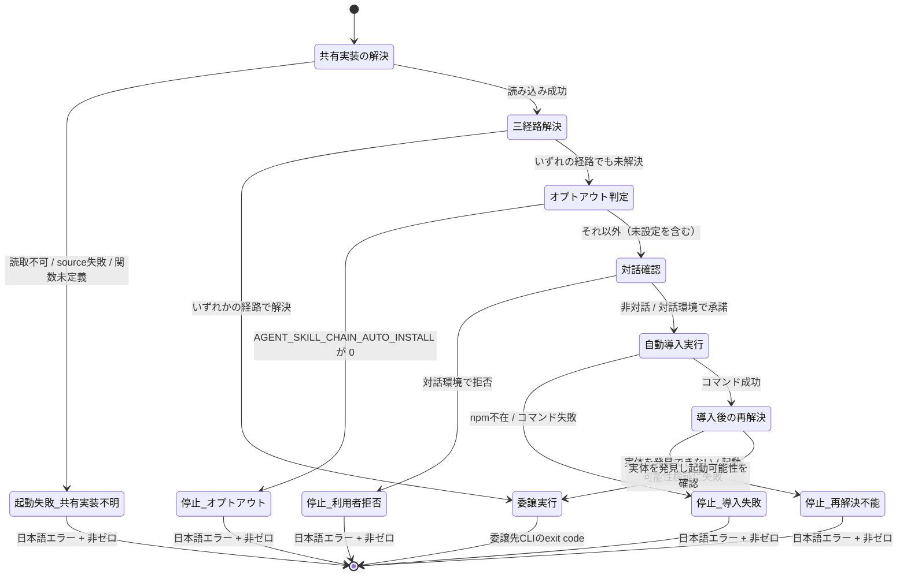

# DESIGN: ローカル実行用 `.agent-skill-chain/` 配下シェルスクリプトがCLI未検出時に自動導入フォールバックを持たない

- Issue: `ISSUE-677`
- 対応する SPEC: `SPEC.md`

## 設計の要約

対象スクリプト集合54本が各自コピーしている3経路解決ブロックを削除し、単一の共有実装 `.agent-skill-chain/scripts/cli-resolve.sh`（bash ライブラリ、`source` して使う）へ集約する。共有実装は「3経路解決 → 失敗時の自動導入フォールバック → 導入後の再解決と起動可能性検証」までを一手に担い、解決結果を配列変数 `ASC_CLI` として呼び出し元へ返す。54本の各ラッパーには、自身の位置から共有実装を解決して読み込む定型前文（全54本で完全に同一のテキスト）と、既存どおりの `exec "${ASC_CLI[@]}" <サブコマンド> "$@"` 1行だけが残る。CIワークフローテンプレートの「Ensure agent-skill-chain CLI」ステップも同じ共有実装を読み込む形へ統一し、リポジトリ内で3経路解決の記述箇所を共有実装1つに限定する。

## 要件 → 設計要素の対応表

設計要素の識別子は本ファイル内で次のとおり定義する（詳細は「責務・境界」）。

- `E1` 共有実装ファイル `.agent-skill-chain/scripts/cli-resolve.sh`
- `E1a` 公開関数 `asc_resolve_cli`（共有実装の唯一の入口）
- `E1b` 内部関数 `_asc_try_resolve`（3経路解決＋採用候補の健全性検査）
- `E1c` 内部関数 `_asc_auto_install`（オプトアウト判定→対話確認→`npm install -g`→再解決→起動可能性検証）
- `E2` ラッパー定型前文（対象スクリプト集合54本に埋め込む共通テキスト）
- `E3` CIワークフローテンプレートの「Ensure agent-skill-chain CLI」ステップ（共有実装への統一）
- `E4` 重複検出テスト（`.agent-skill-chain/` 配下 `*.sh` の走査）
- `E5` 全数実行テストハーネス（54本を1本ずつ実行する共通フィクスチャ）
- `E6` 経路順序テスト／`E7` オプトアウトテスト／`E8` 並行実行テスト
- `E9` 利用者向け記述（共有実装ヘッダコメントと README の自動導入・オプトアウト説明）

| 要件 / AC-ID | 対応する設計要素 | 備考 |
|---|---|---|
| 要件（単一の共有実装からCLI解決ロジックを得る） | `E1`, `E1a`, `E2` | 各ラッパーは `source` で `E1` を読み込み、自ファイル内に判定ロジックを持たない |
| 要件（既存の3経路解決順序を維持する） | `E1b` | 判定順を `bin/agents-md.js` → `node_modules/.bin/agent-skill-chain` → PATH で固定 |
| 要件（共有実装は配布物に含まれ、consumer 展開後も自身の位置基準で解決できる） | `E1`, `E2` | 配置先を `.agent-skill-chain/scripts/` とすることで既存の配布経路にそのまま乗る（設計判断 D1） |
| 要件（共有実装の解決失敗時は日本語エラー＋探索パス＋非ゼロ終了、インライン再実装禁止） | `E2` | 定型前文が読み込み前の可読性検査・`source` 失敗検査・関数定義有無検査の3段で検出する |
| 要件（3経路失敗時にCI同等の自動導入を試行、非対話では無確認） | `E1c` | `npm install -g agent-skill-chain@latest` |
| 要件（対話環境の確認と拒否時の挙動、「確認も導入もせず即失敗」の禁止） | `E1c` | 対話判定は `[[ -t 0 ]]` かつ `[[ -t 2 ]]`。拒否時は理由付き日本語エラーで非ゼロ終了 |
| 要件（`AGENT_SKILL_CHAIN_AUTO_INSTALL` によるオプトアウト、既定は試行） | `E1c`, `E9` | 値 `0` のみオプトアウト（設計判断 D6） |
| 要件（並行自動導入時の2挙動への収束・部分配置の不採用） | `E1b`, `E1c` | 採用候補の健全性検査＋導入後の起動可能性検証（設計判断 D5） |
| 要件（導入成功後の再解決、再解決不能時は理由付き非ゼロ終了） | `E1c` | `npm prefix -g` の bin ディレクトリを含めて再解決する |
| 要件（自動導入失敗時は原因を含む日本語エラーで非ゼロ終了） | `E1c` | `npm` 不在・コマンド失敗の双方を同一分岐で扱う |
| 要件（既存の呼び出しインターフェースの後方互換） | `E2` | 変更は前文のみ。`exec "${ASC_CLI[@]}" <サブコマンド> "$@"` の形と引数透過は不変 |
| 要件（CIワークフロー側との重複を解消、しない場合は理由をコメント明記） | `E3` | 統一する（設計判断 D7） |
| 要件（`package.json` への devDependency 自動追加は対象外） | — | 本設計では扱わない（SPEC のスコープ外に一致） |
| `AC-1`（重複排除） | `E1`, `E2`, `E4` | 検出条件を機械判定可能な形で確定（設計判断 D8） |
| `AC-2`（3経路失敗時に自動導入が試行される） | `E1c`, `E5` | `npm` スタブによる隔離環境で検証 |
| `AC-3`（自動導入が完遂しない場合の日本語エラー） | `E1c` | (a) コマンド失敗 (b) 対話拒否 の2経路を同一の終了形へ収束 |
| `AC-4`（正常系呼び出しインターフェースの後方互換） | `E2`, `E5` | 54本全数をスタブCLIで実行し引数列とexit codeを比較 |
| `AC-5`（CIワークフロー側との重複の扱い） | `E3` | 統一により重複を解消 |
| `AC-6`（consumer 展開状態での起動） | `E1`, `E2`, `E5` | 展開物の複製に対し54本全数を実行 |
| `AC-7`（導入成功後の再解決） | `E1c` | 再解決不能時は理由付き非ゼロ終了 |
| `AC-8`（共有実装を解決できない場合の挙動） | `E2`, `E5` | 欠落・部分展開・権限不足・構文エラーの4状態を検証 |
| `AC-9`（3経路の判定順序） | `E1b`, `E6` | 3経路それぞれに識別可能なスタブを置いて順序を実測 |
| `AC-10`（オプトアウト） | `E1c`, `E7` | 未設定時に自動導入が試行されることも併せて確認 |
| `AC-11`（並行実行時の収束） | `E1b`, `E1c`, `E8` | 部分配置状態を採用しないことを検証 |

## 責務・境界

### コンポーネント構成

- `E1` `.agent-skill-chain/scripts/cli-resolve.sh`: CLI実体の解決と自動導入フォールバックに関する判断を一手に引き受ける唯一の場所。自身の位置（`BASH_SOURCE[0]`）から2階層上をリポジトリルートとして算出し、呼び出し元のカレントディレクトリに依存しない。副作用は「`npm install -g` の実行」「`ASC_CLI` 配列変数への代入」「標準エラー出力へのメッセージ出力」に限る。標準出力へは何も書かない（ラッパーの正常系標準出力を汚さないため。自動導入コマンド自身の標準出力も標準エラー出力へ迂回させる）。委譲先CLIサブコマンドの決定・実行は行わない（それはラッパーの責務）。
  - `E1a` `asc_resolve_cli`: 共有実装が外部へ公開する唯一の関数。`_asc_try_resolve` を試み、成功なら 0 を返す。失敗した場合のみ `_asc_auto_install` へ進み、その結果をそのまま返す。戻り値 0 のとき、かつそのときに限り `ASC_CLI` が有効な argv 前置配列として設定されている。
  - `E1b` `_asc_try_resolve`: 3経路を固定順で判定し、最初に成立した経路の argv を `ASC_CLI` へ設定する。第3経路（PATH上の実体）についてのみ、採用前に「実体が存在し、実行可能で、サイズが0でない」ことを検査する（設計判断 D5）。いずれも成立しなければ非ゼロを返す（メッセージは出さない。文言の決定は `E1a`／`E1c` 側の責務）。
  - `E1c` `_asc_auto_install`: オプトアウト判定 → 対話確認 → `npm` 可用性判定 → `npm install -g agent-skill-chain@latest` 実行 → 再解決 → 起動可能性検証、の順に進む単方向の手続き。どの段で止まっても、必ず「原因を含む日本語メッセージを標準エラー出力へ出し、非ゼロを返す」形で終わる。無言終了と 0 での終了は構造上起こらない。
- `E2` ラッパー定型前文（対象スクリプト集合54本）: 自身の位置から共有実装のパスを算出し、読み込み可能性を検査し、`source` し、公開関数の定義有無を検査し、`asc_resolve_cli` を呼ぶ。ここで生じうる失敗はすべて「共有実装を解決できない」ことに帰着するため、この前文だけが当該失敗のメッセージを持つ。前文は3経路解決に関する判定を一切含まない（インライン再実装の禁止）。ラッパーに残る可変部分は末尾の `exec "${ASC_CLI[@]}" <サブコマンド> "$@"` の1行のみで、前文のテキストは54本すべてで文字単位に同一である（設計判断 D3）。
  - 例外的な組み込み形として、`.agent-skill-chain/adapters/claude.sh`・`.agent-skill-chain/adapters/human.sh` の2本は他スクリプトから `source` されるアダプタであり、内部に `_asc_cli` 関数を持つ。この2本では既存の関数境界を保ったまま、関数本体を共有実装の呼び出しへ置き換える（`asc_resolve_cli` を呼び、`"${ASC_CLI[@]}" "$@"` を実行し、解決失敗時は `exit` ではなく `return` で非ゼロを返す）。共有実装の読み込み自体はファイル冒頭の定型前文で行う。
- `E3` CIワークフローテンプレートの「Ensure agent-skill-chain CLI」ステップ: 3経路のインライン判定を廃し、共有実装を `source` して `asc_resolve_cli` を呼ぶ形へ置き換える。ステップの目的（後続ステップが依存するCLIを事前に用意する）と観測可能な結果（CLIが3経路のいずれかで解決可能な状態でステップが成功する／解決も導入もできなければ非ゼロで失敗する）は変わらない。配布元テンプレートと本リポジトリの `.github/` の双方を同一内容で更新する。もう一方のワークフローテンプレート（root-cleanup 用）にはCLI解決・自動導入の記述が存在しないため、変更対象に含めない。
- `E4`〜`E8` テスト群: 受入条件の機械的検証。実装セグメントの成果物として `test/` 配下に追加する。
- `E9` 利用者向け記述: 共有実装のヘッダコメント（自動導入の既定挙動・オプトアウト・対話確認の有無）と README の導入手順への追記。新しい観測可能な副作用（グローバル領域への `npm install -g`）を利用者が事前に知り、無効化できる状態にする。

### 共有実装の公開契約

共有実装は次の契約のみを外部へ公開する。契約外の内部関数・内部変数は下線始まりの名前とし、呼び出し元から使わない。

- 入力: 環境変数 `AGENT_SKILL_CHAIN_AUTO_INSTALL`（値 `0` のときのみ自動導入を行わない）、標準入力・標準エラー出力が端末に接続されているか、`npm` の可用性、3経路それぞれの実体の有無。
- 出力: 戻り値 0（解決成功。`ASC_CLI` 配列が有効）／非ゼロ（解決失敗。標準エラー出力へ原因を含む日本語メッセージ済み）。
- 変数 `ASC_CLI`: CLI実体を起動する argv の前置部分。第1経路では2要素（`node` と `bin/agents-md.js` の絶対パス）、第2・第3経路では1要素。呼び出し元は `exec "${ASC_CLI[@]}" <サブコマンド> "$@"` の形でのみ使う。
- 冪等性: 同一シェル内で複数回呼んでよい。2回目以降も同じ判定を行う（結果のキャッシュは持たない。キャッシュを持つと同一プロセス内で環境が変わった場合に古い結果を返すため）。

### ラッパー定型前文の契約

前文が検査するのは次の3点であり、いずれか1つでも成立しなければ「共有実装を解決できない」として、探索したパスを含む日本語メッセージを標準エラー出力へ出し、非ゼロ終了する。

1. 算出した共有実装パスが読み取り可能であること（欠落・部分展開の一部・読み取り権限不足を検出する）。
2. `source` が成功すること（構文エラーによる読み込み失敗を検出する。`set -e` に依存せず、`source` の戻り値を明示的に分岐する）。
3. 読み込み後に公開関数 `asc_resolve_cli` が定義されていること（ファイルが途中で切り詰められている等、`source` が成功しても内容が不完全な場合を検出する）。

### 依存関係

```text
ラッパー（対象スクリプト集合54本）
  → 共有実装 cli-resolve.sh
      → 3経路の実体（bin/agents-md.js ／ node_modules/.bin/agent-skill-chain ／ PATH上の agent-skill-chain）
      → npm（自動導入フォールバック時のみ）
  → 解決されたCLI実体（exec による委譲）

CIワークフローの Ensure ステップ
  → 共有実装 cli-resolve.sh（ラッパーと同一の依存先）
```

共有実装はラッパーを一切参照しない（逆依存が無く、循環依存は生じない）。共有実装が新たに獲得する外部依存は `npm` のみで、これは自動導入フォールバック分岐でのみ使用し、不在時は想定内の失敗として扱う。

### 状態遷移



終端は「委譲実行」と5種の「停止（日本語エラー＋非ゼロ）」のみであり、無言終了・メッセージ無しの exit code 0 での終了に到達する経路は存在しない。

### 図示要否の判断

- 判断: `要`
- 根拠: 依存関係が3つ以上ある（ラッパー→共有実装、共有実装→3経路の実体、共有実装→`npm`、CIワークフロー→共有実装）。状態遷移も2つ以上ある（共有実装の解決 → 3経路解決 → オプトアウト判定 → 対話確認 → 自動導入 → 導入後の再解決 → 委譲実行、および5種の停止状態）。責務境界も3つ以上ある（ラッパー定型前文、共有実装の公開関数、共有実装の内部2関数、CIワークフローステップ）。上記いずれの基準にも該当するため、状態遷移図を必須とし記載した。

## 設計判断（SPEC 未決事項の確定）

### D1: 共有実装の配置先を `.agent-skill-chain/scripts/cli-resolve.sh` とする

`.agent-skill-chain/` 直下に新しいディレクトリ（`lib/` 等）を設ける案と比較して採用する。理由は配布経路の変更を一切要さないこと。`scripts/` は既に「配布・展開対象の名前空間」および「npm パッケージ同梱対象」の双方に登録済みで、ディレクトリ単位で複製される。新規ディレクトリを設けると、パッケージ同梱設定・名前空間一覧・導入時の所有権記録・アンインストール対象・アップグレード時の削除候補判定という複数の機構を同時に更新することになり、いずれか1つの漏れが「consumer 展開物に共有実装だけが含まれず54本すべてが起動不能」という本Issue最大の退行を直接引き起こす。`scripts/` 配下には既に、CLIサブコマンドへのラッパーではない補助スクリプトが複数存在するため、ライブラリを置くことは既存の配置慣行から逸脱しない。AC-1 の走査対象（`.agent-skill-chain/` 配下の `*.sh`）に含まれるため、走査結果が0件になる懸念も生じない。

### D2: 読み込み方式は `source`（bash 関数ライブラリ）とし、実行可能スクリプトへの委譲は採らない

解決結果は「`node <path>` のような複数要素の argv 前置」であり、これを子プロセスの標準出力で文字列として返すと、引用・空白を含むパスの復元が呼び出し元の再解析に依存して壊れうる。`source` なら bash 配列としてそのまま受け渡せる。加えて、ラッパー1回の起動につきプロセス生成が1つ増えることを避けられる。アダプタ2本が持つ既存の関数境界（`_asc_cli`）も、関数ライブラリであればそのまま維持できる。

### D3: ラッパー定型前文を54本で完全に同一のテキストにする

対象54本はすべて `.agent-skill-chain/<ディレクトリ>/<名前>.sh` という同一の階層深さにあるため、自身の位置から `.agent-skill-chain/` を求める式（1階層上）と、そこから共有実装を求める式（`scripts/cli-resolve.sh`）はすべてのラッパーで同一になる。したがって「`scripts/` 用に算出した相対パスを他ディレクトリへ機械的に複製すると解決に失敗する」という失敗モードは、前文を文字単位で同一にすることで構造的に排除できる。前文が同一であること自体は、AC-4・AC-6・AC-8 の全数実行に加えて重複検出テストでも機械的に確認できる。前文で `.agent-skill-chain/` の位置を経由するのは、リポジトリルートを各ラッパーが独自に算出しないため（ルート算出は共有実装の責務に一本化する）。

### D4: 共有実装の解決失敗の検知は「読み取り可能性・`source` の成否・公開関数の定義有無」の3段で行う

存在判定のみでは、部分展開・切り詰めによって `source` は成功するのに関数が定義されない状態を見逃す。逆に読み込み結果の完全な検証（チェックサム照合等）は、配布物に digest を同梱する新機構を要し、本Issueの範囲を超える。3段検査は追加の機構を要さず、SPEC が列挙する4状態（欠落・部分展開・読み取り権限不足・構文エラー）をすべて被覆する。メッセージには算出した共有実装の絶対パスを「探索パス」として必ず含める。

### D5: 部分配置状態の検知は「採用前の実体検査（常時）」＋「導入直後の起動可能性検証（自動導入分岐のみ）」の二段構えとし、相互排他は導入しない

グローバル導入の途中結果として現実に観測されるのは、bin エントリのリンクが未作成、またはリンク先が未配置という状態である。したがって第3経路の採用前に「リンクを辿った先の実体が存在し、実行可能で、サイズが0でない」ことを検査すれば、追加のプロセス生成なしにこの状態を排除できる。これは全呼び出しで常時行う。

一方、より強い検証（CLIを実際に起動して正常終了することの確認）は、ラッパー1回の起動につきプロセス生成を1つ増やす。対象54本はCIの各検査ステップから高頻度に呼ばれるため、全呼び出しに常時課すと本Issueと無関係な実行時間の劣化を招く。そこで起動可能性検証は、自動導入を実際に行った直後の1回だけに限定する（実行するのは `--help` で、標準出力・標準エラー出力は破棄し、exit code のみを判定に使う）。並行実行下でも、各プロセスは「自ら導入して検証してから採用する」か「他プロセスが完成させた実体を実体検査のうえ採用する」かのいずれかを通るため、部分配置状態のまま委譲へ進む経路は生じない。

相互排他（ロックファイル等）は導入しない。SPEC が要求するのは2挙動への収束であって直列化ではなく、ロックはロックファイルの後始末・異常終了時の残留・並行プロセス数の上限といった新たな失敗モードを持ち込むため。同一パッケージの `npm install -g` が並行実行された場合、後着側が失敗しても本設計では「導入失敗として日本語エラーで非ゼロ終了」へ収束し、成功しても再解決と起動可能性検証を経てから採用されるため、いずれも定義済みの2挙動の範囲に収まる。

### D6: `AGENT_SKILL_CHAIN_AUTO_INSTALL` は値が厳密に `0` のときのみオプトアウトとする

未設定・空文字列・`false`・`no`・その他の任意の値はすべて「既定（自動導入を試行する）」として扱い、警告もエラーも出さない。`false`・`no` 等を追加でオプトアウトと解釈する案は、利用者が意図していない綴りを黙って有効化する危険（および将来の解釈拡張が挙動を静かに変える危険）があり、未知値をエラーにする案は、無関係な理由で値が入っている環境のラッパー起動を巻き添えで失敗させる。SPEC が必須としているのは `0` の場合の挙動のみであるため、契約を `0` に限定し、それ以外は既定へ倒す。この判断は共有実装のヘッダコメントと README に明記する。

### D7: CIワークフローテンプレートの「Ensure agent-skill-chain CLI」ステップを共有実装へ統一する

本Issueが解消しようとしている構造的原因は「同一ロジックが複数箇所にコピーされているため、片方の修正が他方へ届かない」ことそのものである。ワークフロー側のインライン記述を残すと、共有実装への今後の変更が再びワークフローへ届かない同型の乖離を残すことになる。ワークフローはリポジトリを checkout した状態でこのステップを実行するため、配布物に含まれる共有実装は当該時点で必ず利用可能であり、参照先が存在しない懸念は生じない。ステップは非対話環境で実行されるため、確認プロンプトを経ずに自動導入が試行される既存挙動と一致する。統一により、リポジトリ全体で3経路解決を記述する箇所は共有実装1つだけになる。

### D8: AC-1 の走査手段を「連続する12行の窓に3つの literal が同居するファイル」と確定する

判定に用いる literal は `bin/agents-md.js`、`node_modules/.bin/agent-skill-chain`、`command -v agent-skill-chain` の3つとする。多くのラッパーはヘッダコメントで `bin/agents-md.js` に言及するが、3つすべてが12行以内に同居するのは条件分岐として記述されている場合に限られるため、コメントの巻き込み誤検出は起こらない。コメント行を除外する前処理は行わない（前処理自体が「どこからがコメントか」の解釈を持ち込み、判定を再び実装依存にするため）。条件分岐を関数へ分割した場合も、分割後の各断片が12行の窓に収まる限り検出される。加えて、より粗い不変条件として「literal `node_modules/.bin/agent-skill-chain` を含む `*.sh` がちょうど1件」も同時に検査する。この literal は現状ヘッダコメントに現れないため、単独でも重複の再導入を高い確度で捕捉でき、窓幅の設定に依存しない安全網になる。両検査とも `.agent-skill-chain/` 配下の `*.sh` 全件を対象とし、合格条件は「該当ファイルがちょうど1件、かつそれが共有実装である」こと。

### D9: 全数実行テストの環境初期化を「シナリオごとに1つのフィクスチャ複製、実行ごとに可変状態のみ初期化」とする

AC-4・AC-6・AC-8 は54本の全数実行を要求する。ラッパーはフィクスチャ内のファイルを書き換えないため、シナリオ（後方互換／consumer 展開／共有実装解決不能）ごとにフィクスチャを1回だけ用意し、その中で54本を順に実行してよい。実行ごとに初期化するのは可変状態、すなわちスタブの呼び出し記録ファイルと、各実行へ渡す環境変数（`PATH`・`HOME`・`AGENT_SKILL_CHAIN_AUTO_INSTALL`）だけとする。スタブCLIは argv を記録して exit code 0 を返し、`--help` に対しても exit code 0 を返す（自動導入分岐の起動可能性検証が `--help` を使うため）。各実行の標準入力は端末に接続しない（非対話環境として評価する）。

### D10: 対象本数の判定基準

SPEC は AC-4・AC-6・AC-8 の判定基準に本数 54 を埋め込んでいる。設計セグメントで実数を確認した結果、変更着手前の版で3経路解決のコード片を保持する `.agent-skill-chain/` 配下の `*.sh` は54本（`scripts/` 直下40本、`ci/` 配下12本、`adapters/` 配下2本）であり、SPEC の記載と一致した。テストでは対象集合を走査により動的に列挙したうえで、列挙件数が54であることを併せて表明する（本数が変わる変更が入った際に、テストが黙って対象を減らして通過することを防ぐため）。

### D11: 文書量の上限に関する確認

文書量の上限検査は `AGENTS.md`（150行）と `.agent-skill-chain/templates/` 配下の各テンプレート（各100行）のみを対象としており、Issue 単位の成果物実体（`SPEC.md`・`DESIGN.md`・`PLAN.md`・`VALIDATION.md`）は検査対象に含まれない。したがって本Issueの成果物本文の行数は上限違反にならない。SPEC で下流セグメントの確認事項として残されていた本項は、ここで解消済みとする。

## 関連ADR

```yaml
related_adrs: []
```

本Issueの決定は `docs/adr/ADR-0064-cli-resolution-shared-implementation-and-auto-install-fallback.md`（`status: proposed`、本Issueで新規作成）として記録する。構造化フィールドである `related_adrs:` は `accepted` の ADR のみを参照可能とする規約のため、`proposed` の当該 ADR はここに列挙せず、由来としてのみ本文に示す。本設計が前提とする既存の決定のうち、`accepted` 状態のものは存在しないため列挙は空とする。

## 障害・ロールバック考慮

- 想定される失敗モード:
  - **共有実装の欠陥が54本すべてへ同時に波及する**: 本設計は単一障害点を意図的に作る（それが重複排除の目的そのものである）。緩和は3層で行う。(1) AC-4・AC-6・AC-8 の全数実行テストが54本すべての起動成立を毎回検証する。(2) 本リポジトリ自身のCIが対象54本のうち12本（`ci/` 配下）を実際に実行するため、共有実装の破壊はPR段階で必ず顕在化する。(3) ラッパー定型前文が3段検査を行うため、共有実装が壊れた場合でも「無言終了」ではなく探索パス付きの日本語エラーで停止する。
  - **consumer 展開物に共有実装が含まれない**: 配置先を既存の配布対象ディレクトリ内に限定する（設計判断 D1）ことで、配布設定の変更漏れという原因自体を排除している。加えて AC-6 が展開物の複製に対する全数実行で検証する。
  - **自動導入がグローバル環境を利用者の意図に反して変更する**: 対話環境では確認を挟み、非対話環境ではオプトアウト環境変数で事前に無効化できる。既定が「試行する」である点は、CIとローカルの挙動一致という本Issueの要求に由来する意図的な選択であり、README と共有実装ヘッダコメントで明示する。
  - **並行導入の途中結果を採用する**: 第3経路の実体検査と導入直後の起動可能性検証で防ぐ。ただし「実体は完全に配置済みだが依存パッケージが未配置」といった、ファイル単位の検査では判別できない中間状態が理論上残る。この場合は起動可能性検証（自動導入経路）で捕捉されるが、他プロセスが導入中の実体を第3経路で拾った場合には検出できない。この限界は ADR の Consequences に記録する。
  - **CIワークフローの Ensure ステップが共有実装に依存することによる連鎖**: 共有実装が壊れると当該ステップも失敗する。ただし後続の各検査スクリプトも同じ共有実装に依存するため、依存を増やしたことによる新たな失敗点ではなく、失敗の顕在化がより早い段階へ移るだけである。
- ロールバック手順: 変更は (1) 共有実装ファイルの新規追加、(2) 対象54本の前文置換、(3) CIワークフローテンプレートと `.github/` の同一変更、(4) テスト追加、(5) README 追記、に限られ、いずれも同一PR内に閉じている。既存のCLIサブコマンド・スキーマ・設定項目・ディレクトリ構成規約は変更しないため、問題が判明した場合は当該PRの revert のみで、本Issue適用前の「各ラッパーがインラインで3経路解決し、未解決なら即座に失敗する」挙動へ完全に戻せる。部分的な切り戻し（例: CIワークフローだけを元に戻す）も、他の変更単位と独立に実施できる。
- 影響を受ける既存機能: 対象54本すべての起動経路（ただし正常系の引数透過・標準出力・exit code は不変）、CIワークフローの「Ensure agent-skill-chain CLI」ステップ、および当該ステップの bash 実体をフィクスチャ上で実行している既存の単体テスト（ステップ本文の変更に追随する修正が必要）。CLIサブコマンドの実装（TypeScript 側）には一切変更を加えない。
