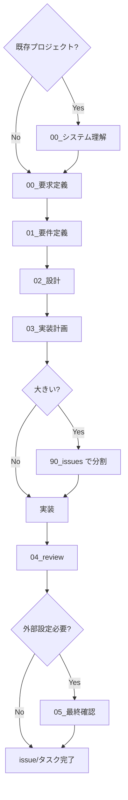

# AGENTS - アジャイル＋ BDD 駆動開発規約

> アジャイル＋ BDD 駆動の段階進行とファイル運用を強制する開発規約

このリポジトリには、LLM エージェント（AI）と人間が協働して開発を進めるためのワークフロー規約とテンプレートが含まれています。

---

## 🚀 プロジェクトにコピペするだけではじめ方（推奨）

**AGENTS-spec をプロジェクトにコピーするだけで、サブエージェント化が正しく機能するようにする手順。**

1. **AGENTS-spec フォルダをプロジェクトにコピーする**  
   プロジェクトルート直下に `AGENTS-spec/` フォルダができる状態にする。

2. **プロジェクトルートに AGENTS.md を 1 つ置く**  
   `AGENTS-spec/COPY_TO_PROJECT_ROOT_AGENTS.md` をプロジェクトルートに **`AGENTS.md`** としてコピーする（リネームしてよい）。

3. **.workflow/ をプロジェクトルートに用意する**  
   issue を開始するときに、`AGENTS-spec/.workflow/templates/` 内のテンプレートを参照して、プロジェクトルートの `.workflow/{YYYYMMDD_HHMMSS_issue_name}/` を作成し、その中に `00_要求定義.md` 等を配置する。初回用に `AGENTS-spec/.workflow/templates/` をプロジェクトの `.workflow/templates/` にコピーして使ってもよい。

4. **workflow.db を使う場合**  
   プロジェクトルートの `.gitignore` に `workflow.db` を追加する（[.agents/ledger/README.md](./.agents/ledger/README.md) 参照）。

以上で、メインは `AGENTS-spec/.agents/boot/CORE.md` と `LOAD_POLICY.md` を読み、`.workflow/` はプロジェクトルートの `.workflow/` を参照してサブエージェント運用が動作する。

### コピペ後の動作確認（最短テスト）

貼り付けた直後、次を確認すればほぼ問題ない。

1. **プロジェクトルート直下に `AGENTS.md` がある**（中身は `COPY_TO_PROJECT_ROOT_AGENTS.md` 由来であること）
2. **`AGENTS-spec/.agents/boot/CORE.md` と `LOAD_POLICY.md` が起点として読まれる設計**になっている（ルートの AGENTS.md から参照されていること）
3. **`.workflow/` をプロジェクトルートに作って issue を切れる**（テンプレは `AGENTS-spec/.workflow/templates/` を参照できること）
4. （任意）workflow.db を使うなら `.gitignore` に `workflow.db` を追加済みであること

### 注意（コピペ運用で壊れやすい点）

- **ルートのファイル名・場所**: 入口は **プロジェクトルート直下の `AGENTS.md` が 1 つ** である想定。無い／別名／別階層だと、想定した入口にならない。
- **`.agents-project/` と `.agents/` の優先関係**: `.agents-project/` を置く場合、**プロジェクト固有ルールだけ**を置く。spec 本体のルールを上書きしない。ここが優先されるため、中身を spec で上書きすると事故る。
- **MCP（ツール接続）**: spec は「使うツールの仕様」まで書くが、**Cursor / Claude Code 側の MCP 接続は spec だけでは自動にならない**。必要なら各環境で接続設定を行う。

---

## 📚 ドキュメント構成

### 主要ドキュメント

- **[`AGENTS.md`](./AGENTS.md)** - 開発規約の完全版（人間向け）

  - ワークフローとフェーズ進行の詳細
  - 実装原則とコーディング規約
  - システム構成とアーキテクチャ詳細

- **`.agents/`** - 実行ルール・ガイドラインを格納するディレクトリ。汎用テンプレートとしてそのまま使う。
- **`.agents-project/`** - プロジェクト固有ルールを置くディレクトリ。ここに置いたルールは `.agents/` より**優先**される。詳細は [`.agents-project/README.md`](./.agents-project/README.md) を参照。
- **[`実行ルール.md`](./.agents/rules/実行ルール.md)** - LLM エージェント向け実行ルール
  - 機械的に守るべきハード制約
  - フェーズ別チェックリスト
  - ドキュメント更新ルール

- **[`CLAUDE.md`](./CLAUDE.md)** - CLAUDE.md の**汎用テンプレート**
  - 各プロジェクトのリポジトリルートにコピーし、プロジェクト概要・ビルドコマンド・重要な規約等を追記して利用する
  - 「agentsに従って」＝ SILENT MODE の定義を含む（応答最大15行・先頭に `🧠 Mode: SILENT MODE`）

### テンプレートファイル

テンプレートファイルは [`.workflow/templates/`](./.workflow/templates/) ディレクトリに配置されています。

- **`00_システム理解.md`** - システム理解書テンプレート（既存プロジェクト導入時のみ使用）
- **`00_要求定義.md`** - 要求定義書テンプレート
- **`01_要件定義.md`** - 要件定義書テンプレート
- **`02_設計.md`** - 設計書テンプレート
- **`03_実装計画.md`** - 実装計画書テンプレート
- **`04_review.md`** - レビュー書テンプレート
- **`05_最終確認チェックリスト.md`** - 最終確認チェックリストテンプレート（コード対応不可項目がある場合のみ使用）
- **`90_issues.md`** - Issue 一覧テンプレート（issue 分割時のみ使用）

### レビューディレクトリ

AGENTS 規約とテンプレート全体のレビュー結果は [`.review/`](./.review/) ディレクトリで時系列管理します。

> **注意**: `.review/`ディレクトリのレビューは、各 issue/タスクのレビュー（`04_review.md`）とは異なります。
>
> - **`.review/`**: AGENTS 規約とテンプレート全体のレビュー
> - **`04_review.md`**: 各 issue/タスクの実装完了後のレビュー

詳細は [`.review/README.md`](./.review/README.md) を参照してください。

---

## 🚀 クイックスタート

### 新しい issue/タスクを開始する場合

1. **ディレクトリを作成**

   ```
   .workflow/{YYYYMMDD_issue_name}/
   ```

   例: `.workflow/20251115_nextjs移行/`

2. **システム理解から開始**（既存プロジェクト導入時のみ）

   - 既存プロジェクトに途中から導入する場合や、他ベンダーが作成したシステムを改修・機能追加する場合は、まず `.workflow/templates/00_システム理解.md` をコピーして `.workflow/00_システム理解.md` を作成
   - システム全体の理解をまとめる

3. **要求定義から開始**

   - `.workflow/templates/00_要求定義.md` をコピー
   - プレースホルダーを実際の値に置き換え
   - 要求を明確化
   - 既存プロジェクトの場合は、`00_システム理解.md` を参照

4. **フェーズを順次進行**
   ```
   00_システム理解（既存プロジェクト時のみ）→ 00_要求定義 → 01_要件定義 → 02_設計 → 03_実装計画 → 実装 → 04_review → 05_最終確認（外部設定が必要な場合のみ）
   ```

### テンプレートの使用方法

1. 対応するテンプレートファイルをコピー
2. プレースホルダー（`{プロジェクト名}`、`{YYYY年MM月DD日}`など）を実際の値に置き換え
3. 各フェーズの必須項目を記入
4. 実装の進行に合わせて常に更新

---

## 📋 ワークフロー概要


```mermaid
flowchart TD
  START{既存プロジェクト?} -->|Yes| SU[00_システム理解]
  START -->|No| R0[00_要求定義]
  SU --> R0
  R0 --> R1[01_要件定義]
  R1 --> R2[02_設計]
  R2 --> R3[03_実装計画]
  R3 --> R4{大きい?}
  R4 -->|Yes| R5[90_issues で分割]
  R4 -->|No| E[実装]
  R5 --> E
  E --> RV[04_review]
  RV --> FC{外部設定必要?}
  FC -->|Yes| FC2[05_最終確認]
  FC -->|No| DONE[issue/タスク完了]
  FC2 --> DONE
```

### フェーズ説明

0. **00\_システム理解** - 既存システムの全体像（既存プロジェクト導入時のみ）
1. **00\_要求定義** - 何のための issue/タスクか（背景・目的・制約）
2. **01\_要件定義** - ユーザーストーリー＋受け入れ基準＋ BDD Feature/Scenario
3. **02\_設計** - アーキテクチャ / DB / API / インターフェース設計
4. **03\_実装計画** - タスク分解・優先度・テスト方針
5. **実装** - BDD ベースの単体テストを先に実装（テストファースト）
6. **04_review** - レビュー結果・指摘・対応履歴
7. **05\_最終確認** - 外部設定の確認（コード対応不可項目がある場合のみ）

---

## ✅ 絶対に守ること（4 つ）

1. **「agentsに従う」＝応答は常に SILENT MODE**（会話への出力は**最大15行**、先頭に `🧠 Mode: SILENT MODE` を付与。詳細は `.workflow/` や `memo/` に書く。ユーザーが「詳細を」「全文を」と明示した場合を除く）
2. **すべての対応は `.workflow/{YYYYMMDD_HHMMSS_issue_name}/00_要求定義.md` から始める**（既存プロジェクト導入時は `.workflow/00_システム理解.md` から）
3. **フェーズを飛ばさない（00_システム理解（既存プロジェクト時のみ）→ 00 → 01 → 02 → 03 → 実装 → 04_review → 05_最終確認（外部設定が必要な場合のみ））**
4. **ドキュメントと実装を常に同期させる（変更したら必ず該当 md を更新）**

---

## 🎯 基本原則

### 常に意識すべき原則

- **KISS**: できるだけシンプルに
- **YAGNI**: 今いらないものは作らない

### 必要に応じて適用する原則

- DRY / SOLID / GRASP / Law of Demeter / CoC / PoLA / TDAE / クリーンアーキテクチャ

詳細は [`AGENTS.md`](./AGENTS.md) の「実装原則」セクションを参照してください。

---

## 📁 ディレクトリ構造

```
.workflow/
├── 00_システム理解.md        # システム理解（既存プロジェクト導入時のみ）
└── {YYYYMMDD_issue_name}/  # issue/タスクディレクトリ（日付プレフィックス付き）
    ├── 00_要求定義.md        # 要求定義（必ず最初に作成）
    ├── 01_要件定義.md        # 要件定義
    ├── 02_設計.md            # 設計
    ├── 03_実装計画.md        # 実装計画
    ├── 04_review.md          # レビュー（実装完了後）
    ├── 05_最終確認チェックリスト.md  # 最終確認チェックリスト（コード対応不可項目がある場合のみ）
    ├── 90_issues.md          # issue一覧（大きなissue/タスクを分割する場合のみ）
    ├── memo/                 # メモ（調査結果、検証結果など）
    │   └── YYYYMMDD_HHMMSS_ファイル名.md
    └── 90_issues/            # 各issueのディレクトリ（issue/タスクを分割する場合のみ）
        └── {nested_issue_name}/
            ├── 00_要求定義.md
            ├── 01_要件定義.md
            ├── 02_設計.md
            ├── 03_実装計画.md
            └── 04_review.md
```

---

## 🤖 LLM エージェント向け

LLM エージェントがこの規約に従って動作する場合は、**[`実行ルール.md`](./.agents/rules/実行ルール.md)** を参照してください。

### エージェントの役割

- 各 issue/タスクに対して、`.workflow/` 配下のドキュメントを使いながら
- システム理解（既存プロジェクト時のみ）→ 要求定義 → 要件定義 → 設計 → 実装計画 → （必要なら issue 分割）→ 実装 → レビュー → 最終確認（外部設定が必要な場合のみ）
- を**飛ばさずに進めるナビゲーター兼ドラフト作成者**

### エージェントが守るべきこと

1. すべての対応は `00_要求定義.md` から開始（既存プロジェクト導入時は `00_システム理解.md` から）
2. フェーズを飛ばさない（システム理解と最終確認チェックリストを含む）
3. ドキュメントと実装の不整合を見つけたら、ドキュメント側の更新案を出す
4. 各 md には「前のステップ」「次のステップ」セクションを含める
5. 各ステップで、対応した md の全文ドラフトまたは差分パッチを出力

### デフォルト動作モード（SILENT MODE）

**重要**: エージェントは **常に SILENT MODE で起動する**。これにより、token 使用量を **1/5〜1/10** に削減できます。

- **SILENT MODE = 通常運転**（デフォルト）
- **通常モード = デバッグ／説明モード**（例外）

**SILENT MODE の特徴**:
- 会話への出力は**最大15行**まで
- 出力の先頭に `🧠 Mode: SILENT MODE` を**必ず**付与する
- 詳細は必ずリポジトリ内のファイルに書く（`.workflow/`、`docs/run/`、`memo/` など）

詳細は [`サイレントモードガイド.md`](./.agents/guide/サイレントモードガイド.md) を参照してください。

---

## 📝 用語定義

- **issue**: チケットや Pull Request と 1:1 で対応することを想定した「大きめの単位」
- **タスク**: issue を分解した実作業単位。`03_実装計画.md`内で洗い出す個別の作業項目
- **プロジェクト**: 複数の issue/タスクをまとめる概念（オプション）

**注意**: issue とタスクは必要に応じて置き換え可能です。規模や管理方法に応じて、適切な粒度で使い分けてください。

---

## 🔗 参考資料

### 主要規約ドキュメント

- [`AGENTS.md`](./AGENTS.md) - 開発規約の完全版
- [`実行ルール.md`](./.agents/rules/実行ルール.md) - LLM エージェント向け実行ルール

### SILENT MODE 関連ドキュメント

- [`サイレントモードガイド.md`](./.agents/guide/サイレントモードガイド.md) - SILENT MODE 運用ガイド（省トークン運用）
- [`初期化プロンプト.md`](./.agents/prompts/初期化プロンプト.md) - 最短初期化プロンプト（Cursor / Claude Code 用）
- [`Issue実行テンプレート.md`](./.agents/prompts/Issue実行テンプレート.md) - Issue 実行テンプレート（1行指示パターン）

### その他の規約ドキュメント

- [`コーディングルール.md`](./.agents/rules/コーディングルール.md) - コーディングルール
- [`ドキュメントルール.md`](./.agents/rules/ドキュメントルール.md) - システム仕様書（docs/）作成・更新ルール
- [`レビュールール.md`](./.agents/rules/レビュールール.md) - レビュー時の徹底的な品質調査ルール
- [`テストガイドライン.md`](./.agents/rules/テストガイドライン.md) - テスト作成ガイドライン
- [`Mermaid図ルール.md`](./.agents/rules/Mermaid図ルール.md) - Mermaid 図作成規約
- [`Storybookルール.md`](./.agents/rules/Storybookルール.md) - Storybook / デザインシステム運用規約
- [`GitHub_PR指摘取得.md`](./.agents/rules/GitHub_PR指摘取得.md) - GitHub PR 指摘取得ルール
- [`GitHub_Copilot対応.md`](./.agents/rules/GitHub_Copilot対応.md) - GitHub Copilot 対応

### ディレクトリ

- [`.workflow/templates/`](./.workflow/templates/) - テンプレートファイル
- [`.review/`](./.review/) - レビューディレクトリ（AGENTS 規約とテンプレート全体のレビュー）

---

## 📅 最終更新

2026 年 2 月 9 日（SILENT MODEをデフォルト動作モードに変更、最短初期化プロンプト追加、Issue実行テンプレート追加、レビュー時自動昇格条件明確化、会話出力上限を15行に統一）
