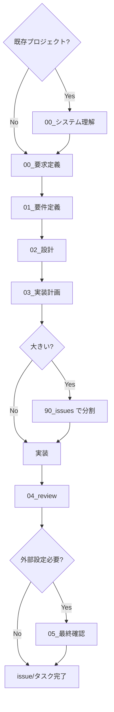

# AGENTS-spec — AI エージェント開発基盤

LLM エージェント（AI）と人間が協働するための**ワークフロー規約・テンプレート・実行基盤差分**をまとめた開発基盤です。アジャイル＋BDD 駆動の段階進行とファイル運用を強制し、Cursor / Claude Code / OpenAI / Gemini を跨いで同じ規約で動かせるようにしています。

---

## これは何か

- **AI エージェント向けの規約とテンプレートのセット**。プロジェクトにコピーして、AI に「agents に従って」と指示すると、ワークフロー（00_要求定義 → 01_要件定義 → 02_設計 → 03_実装計画 → 実装 → 04_review）に沿って動く。
- **実行基盤ごとの差分**は [.agents/platforms/](./.agents/platforms/README.md) に分離しているため、共通仕様を 1 つに保ったまま Cursor / Claude Code / OpenAI / Gemini で使える。
- **単なるプロンプト集ではなく**、boot（絶対制約・読込順）・workers（ロール）・scribe/ledger（ログ）・.workflow/templates まで揃った**開発フレームワーク**。

---

## 何を解決するか

- **「AI に何を守らせるか」がバラける** → CORE と LOAD_POLICY で絶対制約と読む順序を固定。
- **LLM やツールが違うとルールが分裂する** → platforms/ に実行基盤ごとの差分だけを書く Adapter 構成。
- **issue 単位の証跡が残らない** → .workflow テンプレートと 00〜04 の成果物で証跡を残す。Advanced では workflow.db でログ一元化。

---

## 3 分で試す（最小導入手順）

1. **このリポジトリをクローンまたはダウンロード**し、プロジェクトルートに `AGENTS-spec/` がある状態にする。
2. **プロジェクトルートに AGENTS.md を 1 つ置く**  
   `AGENTS-spec/COPY_TO_PROJECT_ROOT_AGENTS.md` の内容をコピーし、プロジェクトルートに **`AGENTS.md`** として保存する。
3. **AI に「agents に従って、この issue の 00_要求定義から進めて」と指示する**  
   AI は AGENTS.md → CORE → LOAD_POLICY を読んでから動く。issue 用フォルダは手動で `.workflow/20260306_120000_my_issue/` のように作り（JST の `YYYYMMDD_HHMMSS_` プレフィックス必須）、中に `00_要求定義.md` を 1 つ置けばよい（中身は [.workflow/templates/00_要求定義.md](./.workflow/templates/00_要求定義.md) をコピーして編集）。

以上で **Minimal** 相当の「規約に従う AI」が動く。テンプレート一式や workers・ログを使う場合は下記 Standard/Advanced または [examples/](./examples/) を参照。

---

## minimal / standard / advanced の違い

| レベル | 含まれるもの | 想定 |
|--------|--------------|------|
| **Minimal** | AGENTS.md、.agents/boot/、.agents/platforms/、delegate_to_sub・[workers/README](./.agents/workers/README.md)（役割一覧のみ参照可） | 最小。AI が規約を読んで委譲の形だけ使う。workers の詳細定義は Standard で利用。 |
| **Standard** | 上記 ＋ workers/、.workflow/templates/、skills/ | 通常の開発フロー。00〜04 とテンプレートで issue を進める。 |
| **Advanced** | 上記 ＋ scribe/、ledger/（workflow.db）、.review/、GitHub/CI テンプレート | ログ一元化・監査・CI まで。 |

実物の構成例: [examples/minimal/](./examples/minimal/)、[examples/standard/](./examples/standard/)、[examples/advanced/](./examples/advanced/)。

---

## 対応プラットフォーム

| 実行基盤 | 対応 | 差分仕様 |
|----------|------|----------|
| **Cursor** | ○ | [.agents/platforms/cursor.md](./.agents/platforms/cursor.md) |
| **Claude Code** | ○ | [.agents/platforms/claude_code.md](./.agents/platforms/claude_code.md) |
| **OpenAI** | ○ | [.agents/platforms/openai.md](./.agents/platforms/openai.md) |
| **Gemini** | ○ | [.agents/platforms/gemini.md](./.agents/platforms/gemini.md) |

共通仕様は [.agents/boot/](./.agents/boot/) に 1 つのみ。各 platform ファイルには**差分だけ**を記載。

---

## 詳細はどこを読むか

| 目的 | 読む順序 |
|------|----------|
| **初めて使う人** | 本 README → [AGENTS.md](./AGENTS.md) → 利用する実行基盤の [.agents/platforms/](./.agents/platforms/README.md) 該当ファイル |
| **内部構造を理解したい人** | 本 README → [.agents/README.md](./.agents/README.md) → [.agents/boot/](./.agents/boot/) |
| **コピペで導入したい人** | [examples/](./examples/) の該当レベル → 本 README の「プロジェクトにコピペするだけではじめ方」 |

**各入口ファイルの責務（何を定義し、何を定義しないか）**:

| ファイル | 責務 | 定義しないもの |
|----------|------|----------------|
| AGENTS.md | プロジェクトルートの最上位入口 | 内部構造の詳細（.agents/README へ） |
| CLAUDE.md | Claude Code 利用者向け入口・セットアップ | 実行時の差分仕様（platforms/claude_code.md へ） |
| .agents/README.md | .agents/ 内部構造の案内 | ルート入口（AGENTS.md へ） |
| .agents/platforms/*.md | 実行基盤ごとの差分仕様のみ | 共通仕様の再記述（boot へ） |
| .agents/boot/CORE.md | 絶対制約 | 判断観点の細則（RULES へ） |
| .agents/RULES.md | 判断観点の要約・横断ルールの案内 | 絶対制約（CORE へ） |
| .agents/capabilities/POLICY.md | 機能有効化・適用条件 | 絶対制約・ワークフロー（CORE/WORKFLOW へ） |

---

## 🚀 プロジェクトにコピペするだけではじめ方（推奨）

**AGENTS-spec をプロジェクトにコピーするだけで、サブエージェント化が正しく機能するようにする手順。**

1. **AGENTS-spec フォルダをプロジェクトにコピーする**  
   プロジェクトルート直下に `AGENTS-spec/` フォルダができる状態にする。

2. **プロジェクトルートに AGENTS.md を 1 つ置く**  
   `AGENTS-spec/COPY_TO_PROJECT_ROOT_AGENTS.md` をプロジェクトルートに **`AGENTS.md`** としてコピーする（リネームしてよい）。

3. **.workflow/ をプロジェクトルートに用意する**  
   issue を開始するときに、`AGENTS-spec/.workflow/templates/` 内のテンプレートを参照して、プロジェクトルートの `.workflow/{YYYYMMDD_HHMMSS_issue_name}/` を作成し、その中に `00_要求定義.md` 等を配置する。初回用に `AGENTS-spec/.workflow/templates/` をプロジェクトの `.workflow/templates/` にコピーして使ってもよい。

4. **workflow.db を使う場合**  
   workflow.db は `.workflow/` 直下に配置する。**AGENTS-spec には `.workflow/.gitignore`（`workflow.db`）が最初から含まれており**、`.workflow/` をコピーすれば無視される。ルートの `.gitignore` に `.workflow/workflow.db` を追加してもよい（[.agents/ledger/README.md](./.agents/ledger/README.md) 参照）。

以上で、メインは `AGENTS-spec/.agents/boot/CORE.md` と `LOAD_POLICY.md` を読み、`.workflow/` はプロジェクトルートの `.workflow/` を参照してサブエージェント運用が動作する。

### コピペ後の動作確認（最短テスト）

貼り付けた直後、次を確認すればほぼ問題ない。

1. **プロジェクトルート直下に `AGENTS.md` がある**（中身は `COPY_TO_PROJECT_ROOT_AGENTS.md` 由来であること）
2. **`AGENTS-spec/.agents/boot/CORE.md` と `LOAD_POLICY.md` が起点として読まれる設計**になっている（ルートの AGENTS.md から参照されていること）
3. **`.workflow/` をプロジェクトルートに作って issue を切れる**（テンプレは `AGENTS-spec/.workflow/templates/` を参照できること）
4. （任意）workflow.db を使うなら `.workflow/` 直下に配置し、workflow.db が Git 管理外であること（`.workflow/.gitignore` をコピーしているか、ルート .gitignore に `.workflow/workflow.db` を追加）

### 注意（コピペ運用で壊れやすい点）

- **ルートのファイル名・場所**: 入口は **プロジェクトルート直下の `AGENTS.md` が 1 つ** である想定。無い／別名／別階層だと、想定した入口にならない。
- **`.agents-project/` と `.agents/` の優先関係**: `.agents-project/` を置く場合、**プロジェクト固有ルールだけ**を置く。spec 本体のルールを上書きしない。ここが優先されるため、中身を spec で上書きすると事故る。
- **MCP（ツール接続）**: spec は「使うツールの仕様」まで書くが、**Cursor / Claude Code 側の MCP 接続は spec だけでは自動にならない**。必要なら各環境で接続設定を行う。

---

## 📚 ドキュメント構成

### 主要ドキュメント

- **[`AGENTS.md`](./AGENTS.md)** - 開発規約の完全版（人間向け）

  - ワークフローとフェーズ進行の詳細
  - 実装原則とコーディング規約
  - システム構成とアーキテクチャ詳細

- **`.agents/`** - 実行ルール・ガイドラインを格納するディレクトリ。汎用テンプレートとしてそのまま使う。
- **`.agents-project/`** - プロジェクト固有ルールを置くディレクトリ。ここに置いたルールは `.agents/` より**優先**される。詳細は [`.agents-project/README.md`](./.agents-project/README.md) を参照。
- **[`.agents/RULES.md`](./.agents/RULES.md)** - 判断観点の要約・横断ルールの案内（絶対制約は [boot/CORE.md](./.agents/boot/CORE.md)、フェーズ定義は [WORKFLOW.md](./.agents/WORKFLOW.md)）
  - ドキュメント・レビュー・テストの要点（詳細は .agents/RULES.md 等で足りる。必要時は .review/ を参照。）

- **[`CLAUDE.md`](./CLAUDE.md)** - CLAUDE.md の**汎用テンプレート**
  - 各プロジェクトのリポジトリルートにコピーし、プロジェクト概要・ビルドコマンド・重要な規約等を追記して利用する
  - 「agentsに従って」＝ SILENT MODE の定義を含む（応答最大15行・先頭に `🧠 Mode: SILENT MODE`）

### テンプレートファイル

テンプレートファイルは [`.workflow/templates/`](./.workflow/templates/) ディレクトリに配置されています。

- **`00_システム理解.md`** - システム理解書テンプレート（既存プロジェクト導入時のみ使用）
- **`00_要求定義.md`** - 要求定義書テンプレート
- **`01_要件定義.md`** - 要件定義書テンプレート
- **`02_設計.md`** - 設計書テンプレート
- **`03_実装計画.md`** - 実装計画書テンプレート
- **`04_review.md`** - レビュー書テンプレート
- **`05_最終確認チェックリスト.md`** - 最終確認チェックリストテンプレート（コード対応不可項目がある場合のみ使用）
- **`90_issues.md`** - Issue 一覧テンプレート（issue 分割時のみ使用）

### レビューディレクトリ

AGENTS 規約とテンプレート全体のレビュー結果は [`.review/`](./.review/) で時系列管理（必要時のみ参照）。

> **注意**: `.review/`ディレクトリのレビューは、各 issue/タスクのレビュー（`04_review.md`）とは異なります。
>
> - **`.review/`**: AGENTS 規約とテンプレート全体のレビュー
> - **`04_review.md`**: 各 issue/タスクの実装完了後のレビュー

詳細は [`.review/README.md`](./.review/README.md) を参照してください。

---

## 🚀 クイックスタート

### 新しい issue/タスクを開始する場合

1. **ディレクトリを作成**

   ```
   .workflow/{YYYYMMDD_HHMMSS_issue_name}/
   ```

   例: `.workflow/20251115_143000_nextjs移行/`（JST の日時プレフィックス必須）

2. **システム理解から開始**（既存プロジェクト導入時のみ）

   - 既存プロジェクトに途中から導入する場合や、他ベンダーが作成したシステムを改修・機能追加する場合は、まず `.workflow/templates/00_システム理解.md` をコピーして `.workflow/00_システム理解.md` を作成
   - システム全体の理解をまとめる

3. **要求定義から開始**

   - `.workflow/templates/00_要求定義.md` をコピー
   - プレースホルダーを実際の値に置き換え
   - 要求を明確化
   - 既存プロジェクトの場合は、`00_システム理解.md` を参照

4. **フェーズを順次進行**
   ```
   00_システム理解（既存プロジェクト時のみ）→ 00_要求定義 → 01_要件定義 → 02_設計 → 03_実装計画 → 実装 → 04_review → 05_最終確認（外部設定が必要な場合のみ）
   ```

### テンプレートの使用方法

1. 対応するテンプレートファイルをコピー
2. プレースホルダー（`{プロジェクト名}`、`{YYYY年MM月DD日}`など）を実際の値に置き換え
3. 各フェーズの必須項目を記入
4. 実装の進行に合わせて常に更新

---

## 📋 ワークフロー概要


```mermaid
flowchart TD
  START{既存プロジェクト?} -->|Yes| SU[00_システム理解]
  START -->|No| R0[00_要求定義]
  SU --> R0
  R0 --> R1[01_要件定義]
  R1 --> R2[02_設計]
  R2 --> R3[03_実装計画]
  R3 --> R4{大きい?}
  R4 -->|Yes| R5[90_issues で分割]
  R4 -->|No| E[実装]
  R5 --> E
  E --> RV[04_review]
  RV --> FC{外部設定必要?}
  FC -->|Yes| FC2[05_最終確認]
  FC -->|No| DONE[issue/タスク完了]
  FC2 --> DONE
```

### フェーズ説明

0. **00\_システム理解** - 既存システムの全体像（既存プロジェクト導入時のみ）
1. **00\_要求定義** - 何のための issue/タスクか（背景・目的・制約）
2. **01\_要件定義** - ユーザーストーリー＋受け入れ基準＋ BDD Feature/Scenario
3. **02\_設計** - アーキテクチャ / DB / API / インターフェース設計
4. **03\_実装計画** - タスク分解・優先度・テスト方針
5. **実装** - BDD ベースの単体テストを先に実装（テストファースト）
6. **04_review** - レビュー結果・指摘・対応履歴
7. **05\_最終確認** - 外部設定の確認（コード対応不可項目がある場合のみ）

---

## ✅ 絶対に守ること（4 つ）

1. **「agentsに従う」＝応答は常に SILENT MODE**（会話への出力は**最大15行**、先頭に `🧠 Mode: SILENT MODE` を付与。詳細は `.workflow/` や `memo/` に書く。ユーザーが「詳細を」「全文を」と明示した場合を除く）
2. **すべての対応は `.workflow/{YYYYMMDD_HHMMSS_issue_name}/00_要求定義.md` から始める**（既存プロジェクト導入時は `.workflow/00_システム理解.md` から）
3. **フェーズを飛ばさない（00_システム理解（既存プロジェクト時のみ）→ 00 → 01 → 02 → 03 → 文書レビュー（必須）→ 実装 → 04_review → 05_最終確認（外部設定が必要な場合のみ））**
4. **ドキュメントと実装を常に同期させる（変更したら必ず該当 md を更新）**

---

## 🎯 基本原則

### 常に意識すべき原則

- **KISS**: できるだけシンプルに
- **YAGNI**: 今いらないものは作らない

### 必要に応じて適用する原則

- DRY / SOLID / GRASP / Law of Demeter / CoC / PoLA / TDAE / クリーンアーキテクチャ

詳細は [`AGENTS.md`](./AGENTS.md) の「実装原則」セクションを参照してください。

---

## 📁 ディレクトリ構造

```
.workflow/
├── 00_システム理解.md        # システム理解（既存プロジェクト導入時のみ）
└── {YYYYMMDD_HHMMSS_issue_name}/  # issue/タスクディレクトリ（日時プレフィックス付き、JST）
    ├── 00_要求定義.md        # 要求定義（必ず最初に作成）
    ├── 01_要件定義.md        # 要件定義
    ├── 02_設計.md            # 設計
    ├── 03_実装計画.md        # 実装計画
    ├── 04_review.md          # レビュー（実装完了後）
    ├── 05_最終確認チェックリスト.md  # 最終確認チェックリスト（コード対応不可項目がある場合のみ）
    ├── 90_issues.md          # issue一覧（大きなissue/タスクを分割する場合のみ）
    ├── memo/                 # メモ（調査結果、検証結果など）
    │   └── YYYYMMDD_HHMMSS_ファイル名.md
    └── 90_issues/            # 各issueのディレクトリ（issue/タスクを分割する場合のみ）
        └── {nested_issue_name}/
            ├── 00_要求定義.md
            ├── 01_要件定義.md
            ├── 02_設計.md
            ├── 03_実装計画.md
            └── 04_review.md
```

---

## 🤖 LLM エージェント向け

LLM エージェントがこの規約に従って動作する場合は、**[`.agents/boot/CORE.md`](./.agents/boot/CORE.md)** と **[`.agents/boot/LOAD_POLICY.md`](./.agents/boot/LOAD_POLICY.md)** を最初に読み、その後 **[`.agents/RULES.md`](./.agents/RULES.md)** で判断観点と横断ルールを確認してください。

### エージェントの役割

- 各 issue/タスクに対して、`.workflow/` 配下のドキュメントを使いながら
- システム理解（既存プロジェクト時のみ）→ 要求定義 → 要件定義 → 設計 → 実装計画 → （必要なら issue 分割）→ 実装 → レビュー → 最終確認（外部設定が必要な場合のみ）
- を**飛ばさずに進めるナビゲーター兼ドラフト作成者**

### エージェントが守るべきこと

1. すべての対応は `00_要求定義.md` から開始（既存プロジェクト導入時は `00_システム理解.md` から）
2. フェーズを飛ばさない（システム理解と最終確認チェックリストを含む）
3. ドキュメントと実装の不整合を見つけたら、ドキュメント側の更新案を出す
4. 各 md には「前のステップ」「次のステップ」セクションを含める
5. 各ステップで、対応した md の全文ドラフトまたは差分パッチを出力

### デフォルト動作モード（SILENT MODE）

**重要**: エージェントは **常に SILENT MODE で起動する**。これにより、token 使用量を **1/5〜1/10** に削減できます。

- **SILENT MODE = 通常運転**（デフォルト）
- **通常モード = デバッグ／説明モード**（例外）

**SILENT MODE の特徴**:
- 会話への出力は**最大15行**まで
- 出力の先頭に `🧠 Mode: SILENT MODE` を**必ず**付与する
- 詳細は必ずリポジトリ内のファイルに書く（`.workflow/`、`docs/run/`、`memo/` など）

詳細は [`.agents/RULES.md`](./.agents/RULES.md) および本 README の「絶対に守ること」を参照してください。

---

## 📝 用語定義

- **issue**: チケットや Pull Request と 1:1 で対応することを想定した「大きめの単位」
- **タスク**: issue を分解した実作業単位。`03_実装計画.md`内で洗い出す個別の作業項目
- **プロジェクト**: 複数の issue/タスクをまとめる概念（オプション）

**注意**: issue とタスクは必要に応じて置き換え可能です。規模や管理方法に応じて、適切な粒度で使い分けてください。

---

## 🔗 参考資料

### 主要規約ドキュメント

- [`.agents/boot/CORE.md`](./.agents/boot/CORE.md) - 絶対制約（AI が最初に読むべき共通仕様）
- [`.agents/boot/LOAD_POLICY.md`](./.agents/boot/LOAD_POLICY.md) - 読込順序とサブエージェント注入ルール
- [`AGENTS.md`](./AGENTS.md) - 開発規約の完全版
- [`.agents/RULES.md`](./.agents/RULES.md) - 判断観点と横断ルールの案内（CORE/LOAD_POLICY を読んだ後に参照）

### SILENT MODE・実行時の参照

- [`.agents/RULES.md`](./.agents/RULES.md) - 実行・確認義務・SILENT MODE の要点。チェックリストと判断観点。

### その他の規約ドキュメント

- [`.agents/RULES.md`](./.agents/RULES.md) - 実行・ドキュメント・テスト・レビュー等のチェックリストと判断観点（コーディング・レビュー・テストガイドライン・Mermaid/Storybook/GitHub 等を含む）

### ディレクトリ

- [`.workflow/templates/`](./.workflow/templates/) - テンプレートファイル
- [`.review/`](./.review/) - レビューディレクトリ（AGENTS 規約とテンプレート全体のレビュー）

---

## 📅 最終更新

2026 年 3 月 7 日（AGENTS-spec 簡素化・責務固定、実行基盤差分の platforms 分離、OSS 向け入口整備、PR#2 指摘対応。内容更新は PR マージまで継続）
