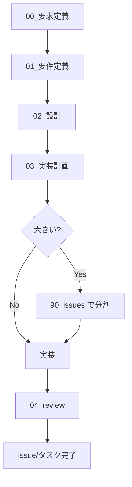

# AGENTS - アジャイル＋ BDD 駆動開発規約

> アジャイル＋ BDD 駆動の段階進行とファイル運用を強制する開発規約

このリポジトリには、LLM エージェント（AI）と人間が協働して開発を進めるためのワークフロー規約とテンプレートが含まれています。

---

## 📚 ドキュメント構成

### 主要ドキュメント

- **[`AGENTS.md`](./AGENTS.md)** - 開発規約の完全版（人間向け）

  - ワークフローとフェーズ進行の詳細
  - 実装原則とコーディング規約
  - システム構成とアーキテクチャ詳細

- **[`AGENTS_AI_PLAYBOOK.md`](./AGENTS_AI_PLAYBOOK.md)** - LLM エージェント向け実行ルール
  - 機械的に守るべきハード制約
  - フェーズ別チェックリスト
  - ドキュメント更新ルール

### テンプレートファイル

テンプレートファイルは [`.workflow/templates/`](./.workflow/templates/) ディレクトリに配置されています。

- **`00_要求定義.md`** - 要求定義書テンプレート
- **`01_要件定義.md`** - 要件定義書テンプレート
- **`02_設計.md`** - 設計書テンプレート
- **`03_実装計画.md`** - 実装計画書テンプレート
- **`04_review.md`** - レビュー書テンプレート
- **`90_issues.md`** - Issue 一覧テンプレート（issue 分割時のみ使用）

### レビューディレクトリ

AGENTS 規約とテンプレート全体のレビュー結果は [`.review/`](./.review/) ディレクトリで時系列管理します。

> **注意**: `.review/`ディレクトリのレビューは、各 issue/タスクのレビュー（`04_review.md`）とは異なります。
>
> - **`.review/`**: AGENTS 規約とテンプレート全体のレビュー
> - **`04_review.md`**: 各 issue/タスクの実装完了後のレビュー

詳細は [`.review/README.md`](./.review/README.md) を参照してください。

---

## 🚀 クイックスタート

### 新しい issue/タスクを開始する場合

1. **ディレクトリを作成**

   ```
   .workflow/{YYYYMMDD_issue_name}/
   ```

   例: `.workflow/20251115_nextjs移行/`

2. **要求定義から開始**

   - `.workflow/templates/00_要求定義.md` をコピー
   - プレースホルダーを実際の値に置き換え
   - 要求を明確化

3. **フェーズを順次進行**
   ```
   00_要求定義 → 01_要件定義 → 02_設計 → 03_実装計画 → 実装 → 04_review
   ```

### テンプレートの使用方法

1. 対応するテンプレートファイルをコピー
2. プレースホルダー（`{プロジェクト名}`、`{YYYY年MM月DD日}`など）を実際の値に置き換え
3. 各フェーズの必須項目を記入
4. 実装の進行に合わせて常に更新

---

## 📋 ワークフロー概要



### フェーズ説明

1. **00\_要求定義** - 何のための issue/タスクか（背景・目的・制約）
2. **01\_要件定義** - ユーザーストーリー＋受け入れ基準＋ BDD Feature/Scenario
3. **02\_設計** - アーキテクチャ / DB / API / インターフェース設計
4. **03\_実装計画** - タスク分解・優先度・テスト方針
5. **実装** - BDD ベースの単体テストを先に実装（テストファースト）
6. **04_review** - レビュー結果・指摘・対応履歴

---

## ✅ 絶対に守ること（3 つ）

1. **すべての対応は `.workflow/{YYYYMMDD_issue_name}/00_要求定義.md` から始める**
2. **フェーズを飛ばさない（00 → 01 → 02 → 03 → 実装 → 04_review）**
3. **ドキュメントと実装を常に同期させる（変更したら必ず該当 md を更新）**

---

## 🎯 基本原則

### 常に意識すべき原則

- **KISS**: できるだけシンプルに
- **YAGNI**: 今いらないものは作らない

### 必要に応じて適用する原則

- DRY / SOLID / GRASP / Law of Demeter / CoC / PoLA / TDAE / クリーンアーキテクチャ

詳細は [`AGENTS.md`](./AGENTS.md) の「実装原則」セクションを参照してください。

---

## 📁 ディレクトリ構造

```
.workflow/
└── {YYYYMMDD_issue_name}/  # issue/タスクディレクトリ（日付プレフィックス付き）
    ├── 00_要求定義.md        # 要求定義（必ず最初に作成）
    ├── 01_要件定義.md        # 要件定義
    ├── 02_設計.md            # 設計
    ├── 03_実装計画.md        # 実装計画
    ├── 04_review.md          # レビュー（実装完了後）
    ├── 90_issues.md          # issue一覧（大きなissue/タスクを分割する場合のみ）
    ├── memo/                 # メモ（調査結果、検証結果など）
    │   └── YYYYMMDD_HHMMSS_ファイル名.md
    └── 90_issues/            # 各issueのディレクトリ（issue/タスクを分割する場合のみ）
        └── {nested_issue_name}/
            ├── 00_要求定義.md
            ├── 01_要件定義.md
            ├── 02_設計.md
            ├── 03_実装計画.md
            └── 04_review.md
```

---

## 🤖 LLM エージェント向け

LLM エージェントがこの規約に従って動作する場合は、**[`AGENTS_AI_PLAYBOOK.md`](./AGENTS_AI_PLAYBOOK.md)** を参照してください。

### エージェントの役割

- 各 issue/タスクに対して、`.workflow/` 配下のドキュメントを使いながら
- 要求定義 → 要件定義 → 設計 → 実装計画 → （必要なら issue 分割）→ 実装 → レビュー
- を**飛ばさずに進めるナビゲーター兼ドラフト作成者**

### エージェントが守るべきこと

1. すべての対応は `00_要求定義.md` から開始
2. フェーズを飛ばさない
3. ドキュメントと実装の不整合を見つけたら、ドキュメント側の更新案を出す
4. 各 md には「前のステップ」「次のステップ」セクションを含める
5. 各ステップで、対応した md の全文ドラフトまたは差分パッチを出力

---

## 📝 用語定義

- **issue**: チケットや Pull Request と 1:1 で対応することを想定した「大きめの単位」
- **タスク**: issue を分解した実作業単位。`03_実装計画.md`内で洗い出す個別の作業項目
- **プロジェクト**: 複数の issue/タスクをまとめる概念（オプション）

**注意**: issue とタスクは必要に応じて置き換え可能です。規模や管理方法に応じて、適切な粒度で使い分けてください。

---

## 🔗 参考資料

- [`AGENTS.md`](./AGENTS.md) - 開発規約の完全版
- [`AGENTS_AI_PLAYBOOK.md`](./AGENTS_AI_PLAYBOOK.md) - LLM エージェント向け実行ルール
- [`.workflow/templates/`](./.workflow/templates/) - テンプレートファイル
- [`.review/`](./.review/) - レビューディレクトリ（AGENTS 規約とテンプレート全体のレビュー）

---

## 📅 最終更新

2025 年 11 月 23 日
