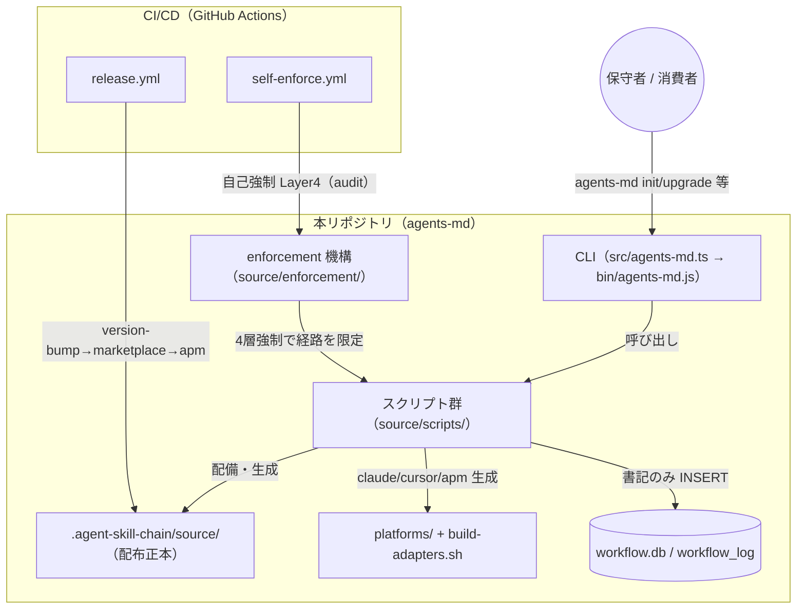

# 3. アーキテクチャ

## 3.1 システム構成図

本リポジトリの 5 構成要素と、配布・自己適用の関係を示す。

### 構成要素の説明

| 要素 | 説明 | 詳細 |
| ---- | ---- | ---- |
| CLI | 採用先ルートを引数に `setup.sh` を呼ぶ薄いラッパ。ロジックを持たない。 | [04 機能設計/CLI](../../04_機能設計/CLI/README.md) |
| スクリプト群 | 配備・生成・証跡記録・リリース補助を担う bash 群。 | [04 機能設計/スクリプト群](../../04_機能設計/スクリプト群/README.md) |
| enforcement 機構 | 4 層（プラットフォーム権限 / Tool hook / Wrapper command / CI audit）で逸脱を防ぐ。 | [04 機能設計/enforcement](../../04_機能設計/enforcement/README.md) |
| 証跡 DB | 書記のみが書き込む `workflow_log` 単一テーブル。 | [03 データ設計](../../03_データ設計/README.md) |
| CI/生成 | リリース自動化・自己強制、マルチプラットフォーム成果物生成。 | [CI](../../04_機能設計/CI_リリースパイプライン/README.md)・[生成](../../04_機能設計/マルチプラットフォーム生成/README.md) |

## 3.2 技術スタック

| 技術 | 用途 | 備考 |
| ---- | ---- | ---- |
| Node.js（>=20） | CLI 実行環境 | `package.json` engines |
| TypeScript（5.x） | CLI ソース（`src/agents-md.ts` → `bin/agents-md.js`） | `tsc` でビルド |
| bash | スクリプト群・enforcement・テスト | `.agent-skill-chain/source/scripts/`・`test/` |
| SQLite（sqlite3） | 証跡 DB（`workflow.db`） | 書記ラッパー経由でのみ書込 |
| GitHub Actions | CI（リリース・自己強制） | `.github/workflows/` |

## 3.3 外部連携

- **npm レジストリ**: `release.yml` が publish する（配布）。
- **各 AI プラットフォーム**: `.claude/`・`.cursor/`・apm 形式へ配備・生成（`setup.sh`・`build-adapters.sh`）。詳細は [マルチプラットフォーム生成](../../04_機能設計/マルチプラットフォーム生成/README.md)。

## 3.4 セキュリティ

- 秘密情報の値は仕様書に記載しない。CI シークレット（`RELEASE_MAIN_PAT` 等）は名称・役割のみ扱う。
- `workflow.db` への書込経路は書記ラッパー 1 本に限定し、任意 SQL・直接 sqlite3 を禁止する（[04 機能設計/enforcement](../../04_機能設計/enforcement/README.md)）。

---

## 参考資料

- [01 プロジェクト概要](../01_プロジェクト概要/README.md)
- [04 ディレクトリ構成](../04_ディレクトリ構成/README.md)
- [03 データ設計](../../03_データ設計/README.md)
- [04 機能設計](../../04_機能設計/README.md)

---

**最終更新**: 2026 年 07 月 13 日
