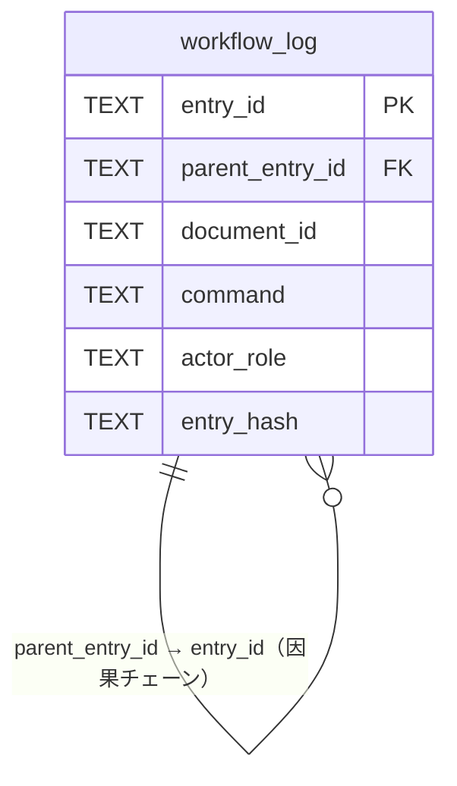

このドキュメントは、本リポジトリの証跡 DB（`workflow.db`）のデータモデルを俯瞰します。
**SQL の実体（CREATE TABLE / 索引）の単一正本は [.agent-skill-chain/source/ledger/schema.sql](../../.agent-skill-chain/source/ledger/schema.sql)**、意味・運用の正本は [.agent-skill-chain/source/ledger/schema.md](../../.agent-skill-chain/source/ledger/schema.md) です。本ドキュメントは複製せず俯瞰＋参照に徹します（DRY・[`DOCS_NOISE_RULES.md` §(iii)](../../.agent-skill-chain/source/DOCS_NOISE_RULES.md)）。

# 3. データ設計

## 3.1 概要

- **DB**: `workflow.db`（SQLite）。既定配置は `.agent-skill-chain/runtime/workflow.db`（消費者ランタイム生成物・非追跡）。
- **実在テーブルは `workflow_log` の 1 つのみ**（＋索引 7 件）。証跡を「チェーンされた実行証跡」として記録し、`parent_entry_id` で因果関係、`entry_hash`/`prev_hash` で改ざん検知の土台を持つ。
- **書込経路**: 書記（scribe）が [write-workflow-log.sh](../../.agent-skill-chain/source/scripts/write-workflow-log.sh) 経由でのみ INSERT する（1 回 1 レコード・UPDATE/DELETE/任意 SQL 禁止）。

## 3.2 ER 相当（単一テーブル）

`workflow_log` は他テーブルとのリレーションを持たない単一テーブルである。`parent_entry_id` は同一テーブル内の `entry_id` を指す自己参照で、command 実行の因果チェーン（requirement-discovery → design-feature → implement-feature → verify-and-close）を辿る。

## 3.3 テーブル一覧

| ID | テーブル名 | 説明 | 主キー |
| -- | ---------- | ---- | ------ |
| T01 | `workflow_log` | command 実行証跡（1 行 = 1 記録）。書記のみが INSERT。 | `entry_id` |

## 3.4 主要カラム（俯瞰）

全カラム定義・CHECK 制約・索引の実体は [schema.sql](../../.agent-skill-chain/source/ledger/schema.sql) を、各カラムの意味・command 別必須カラム規約は [schema.md](../../.agent-skill-chain/source/ledger/schema.md) を正本とする。俯瞰のみ以下に示す。

| カラム | 意味（要約） |
| ------ | ------------ |
| `entry_id` / `parent_entry_id` | レコード一意 ID / 親レコード（因果チェーン） |
| `command` | 実行 command（`requirement-discovery`/`design-feature`/`implement-feature`/`verify-and-close`/`review-docs`/`create-pr-review-issue` のいずれか。CHECK で制約） |
| `actor_role` / `delegated_by_role` | 実行主体（CHECK で `scribe` のみ）/ 委譲元（CHECK で `orchestrator` のみ） |
| `document_id` / `document_path` | 対応成果ドキュメントの UUID / パス（document_id 不変チェック用） |
| `issue_id` / `review_id` | issue / レビュー成果物の UUID |
| `changed_files_json` | 変更ファイルの JSON 配列（`implement-feature` で必須） |
| `summary` / `dod_met` | 実施要約 / DoD 充足（0 または 1） |
| `model_tier` / `tier_rationale` / `tier_exception` | 委譲時の選定モデルティア / 根拠 1 行（`MODEL_TIER_TABLE.md` 該当行の引用）/ fable 例外申告。記録有無を audit.sh #38 が検査（`TEXT NULL`） |
| `prev_hash` / `entry_hash` | 改ざん検知（前レコード hash / 本レコード hash） |

## 3.5 索引

`workflow_log` には索引が 10 件ある（`ts_utc`・`command`・`parent_entry_id`・`document_id`・`issue_id`・`review_id`・`document_path`・`model_tier`・`tier_rationale`・`tier_exception`）。定義の実体は [schema.sql](../../.agent-skill-chain/source/ledger/schema.sql)。

## 3.6 整合性・排他

- **排他制御**: 書記ラッパーが `flock` ＋ WAL モード ＋ SQLITE_BUSY リトライ（最大 5 回・100ms）で同時書込に対応する（正本: [schema.md §排他制御](../../.agent-skill-chain/source/ledger/schema.md)）。
- **document_id 不変**: 同一 `document_path` に既に記録された `document_id` の変更は禁止（ラッパーと audit で検証）。
- **改ざん検知**: `entry_hash` の計算式は [gen-entry-hash.sh](../../.agent-skill-chain/source/scripts/gen-entry-hash.sh) を単一正本とする。

---

## 参考資料

- [.agent-skill-chain/source/ledger/schema.md](../../.agent-skill-chain/source/ledger/schema.md) — データモデルの意味・運用（正本）
- [.agent-skill-chain/source/ledger/schema.sql](../../.agent-skill-chain/source/ledger/schema.sql) — SQL の単一正本
- [04 機能設計/スクリプト群](../04_機能設計/スクリプト群/README.md) — write-workflow-log.sh・export-ndjson.sh
- [99 ID命名規則と管理](../99_ID命名規則と管理/README.md) — テーブル ID（T01）の台帳

---

**最終更新**: 2026 年 07 月 13 日
