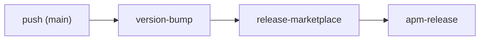

# F04: CI / リリースパイプライン

GitHub Actions による CI。正本は [.github/workflows/release.yml](../../../.github/workflows/release.yml) と [.github/workflows/self-enforce.yml](../../../.github/workflows/self-enforce.yml)。本ドキュメントは俯瞰に留める。

## F04.1 release.yml（リリース自動化）

`main` への push（該当パス）を契機に、以下のジョブを順に実行する。

| ジョブ | 役割 |
| ------ | ---- |
| `version-bump` | version の採番・bump（`[skip ci]` コミット等） |
| `release-marketplace` | マーケットプレイス/npm 向けのリリース（`needs: version-bump`） |
| `apm-release` | apm 形式のリリース（`needs: release-marketplace`） |

- **並行制御**: `concurrency`（group: release, cancel-in-progress: false）で多重リリースを防ぐ。
- **秘密情報**: `RELEASE_MAIN_PAT` 等の CI シークレットを使用する。値は仕様書に記載せず名称・役割のみ扱う。
- 有効化フラグ・トリガーパス等の詳細は [release.yml](../../../.github/workflows/release.yml) を正本とする。

## F04.2 self-enforce.yml（自己強制 = Layer4）

`push` を契機に、本リポジトリ自身へ enforcement を適用する（[enforcement](../enforcement/README.md) の Layer4 に相当）。

- 各種チェックの後、[enforcement/ci/audit.sh](../../../.agent-skill-chain/source/enforcement/ci/audit.sh) を呼ぶ。
- **非ブロッキング運用**: 本リポジトリの issue は `docs/maintainer/workflow/` 配下にあり、audit.sh が前提とする `.workflow` 配置とは異なるため、audit.sh は「呼ぶが失敗させない」（continue-on-error 相当）で運用する。判定ロジックの正本は audit.sh 側にある。

## F04.3 非回帰テストとの関係

CI とは別に、保守者はローカルで `bash test/run-all.sh`（`npm test`）を実行して全テストの非回帰を確認する。テスト runner の詳細は [test/run-all.sh](../../../test/run-all.sh) を正本とする。

---

## 参考資料

- [.github/workflows/release.yml](../../../.github/workflows/release.yml) — リリース CI（正本）
- [.github/workflows/self-enforce.yml](../../../.github/workflows/self-enforce.yml) — 自己強制 CI（正本）
- [04 機能設計/enforcement](../enforcement/README.md) — Layer4 audit の位置づけ
- [04 機能設計/マルチプラットフォーム生成](../マルチプラットフォーム生成/README.md) — apm/claude 生成

---

**最終更新**: 2026 年 07 月 13 日
