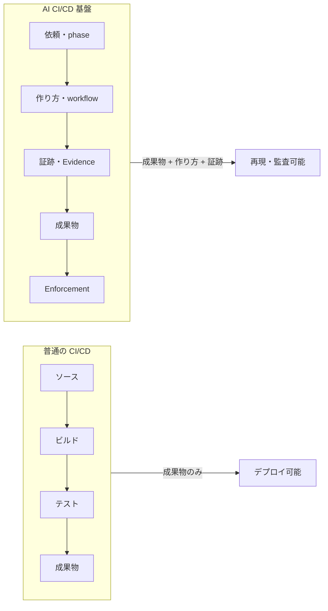
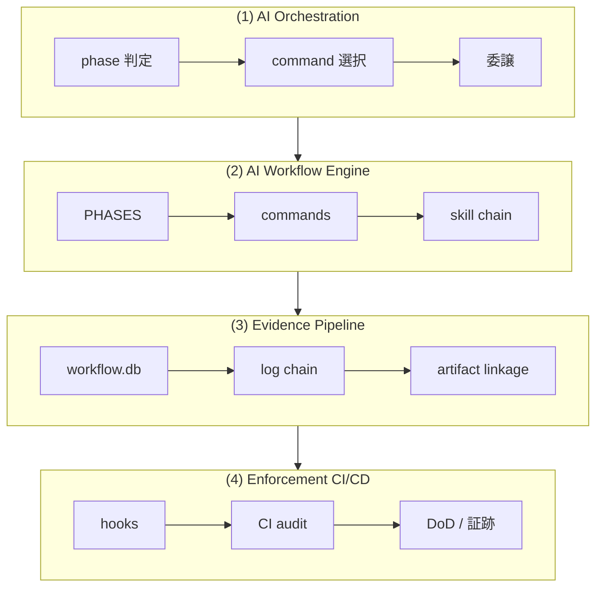
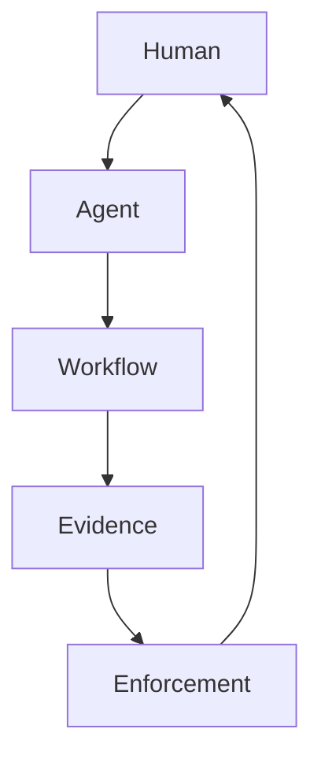
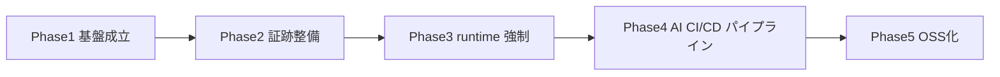
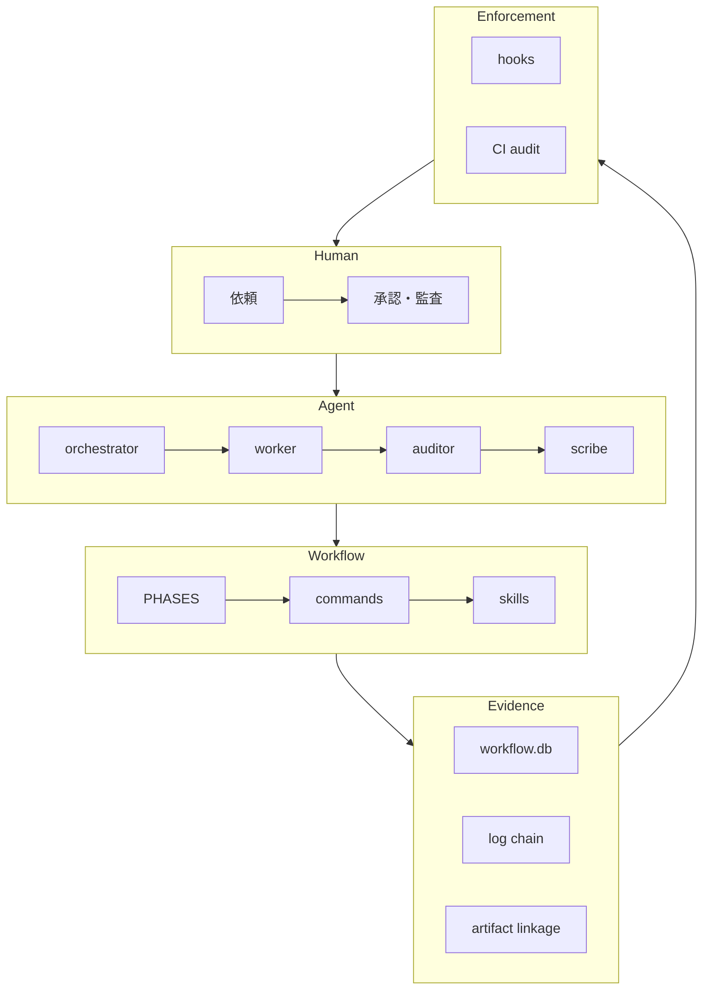

# AI CI/CD 基盤 — ビジョン

本ドキュメントは **「AI CI/CD 基盤」が目指す最終形** を定義する。

従来の CI/CD は **成果物**（ビルド・テスト・デプロイ可能なアウトプット）だけをパイプラインで扱う。AI が関わる SDLC では、**成果物に加え「作り方」と「証跡」** までをパイプラインに載せ、再現性・監査性を担保する必要がある。

## 普通の CI/CD と AI CI/CD の違い

- **普通の CI/CD**: 成果物（アーティファクト）の生成・検証・デプロイが中心。
- **AI CI/CD 基盤**: 成果物に加え、**どの workflow で誰（AI/人）が何をしたか** と **証跡** をパイプラインに載せ、機械的に再現・監査できるようにする。

---

## 一言での最終形

**「AI が関わる SDLC を、機械的に再現可能なパイプラインへ変える仕組み」**

---

## 4つの柱

| 柱 | 役割 |
|----|------|
| **(1) AI Orchestration** | phase 判定・command 選択・委譲のみ。実作業は行わない。 |
| **(2) AI Workflow Engine** | フェーズ・command・skill chain で「作り方」を固定する。 |
| **(3) Evidence Pipeline** | 証跡（workflow.db・ログ・成果物対応）を一貫して記録・検証する。 |
| **(4) Enforcement CI/CD** | 物理強制・契約強制・配備強制・完了強制で逸脱を防ぐ。 |

- **(1) AI Orchestration**: メインエージェントは orchestrator としてのみ動作し、実装・設計・ファイル編集・コマンド実行は行わず、phase に基づく command 選択と run_command による委譲のみを行う。
- **(2) AI Workflow Engine**: PHASES.md・PHASE_COMMAND_MAP・commands/・skills で「いつ何をするか」を定義し、workflow を実行可能な形で固定する。
- **(3) Evidence Pipeline**: 書記（scribe）が workflow.db を正本として証跡を記録し、log chain・artifact linkage・role 証跡で因果と順序を追えるようにする。
- **(4) Enforcement CI/CD**: hooks（PreToolUse/PostToolUse）と CI（audit.sh）で、経路違反・証跡欠落・CONTRACT 違反を検知・ブロックする。

---

## 5層アーキテクチャ

| 層 | 担い手 | 責務 |
|----|--------|------|
| **Human** | ユーザー・運用者 | 依頼・承認・監査判断 |
| **Agent** | orchestrator / worker / auditor / scribe | phase 判定・command 実行・証跡確認・記録 |
| **Workflow** | PHASES / commands / skills | 作り方の定義・実行単位 |
| **Evidence** | workflow.db / 証跡プレフィックス | 記録・再現・監査のためのデータ |
| **Enforcement** | hooks / setup / CI | 強制・逸脱防止・完了条件 |

---

## 最終形でできること

| 観点 | 内容 |
|------|------|
| **再現性** | 同じ phase・command・証跡から同じ流れを再実行できる。 |
| **監査性** | 誰が・いつ・何をしたか、証跡と成果物の対応で追える。 |
| **部分自動化** | 人が依頼し、AI が workflow に沿って実行し、人がレビュー・承認する。 |
| **事故局所化** | 違反は hooks / CI で検知し、差し戻し先が明確。 |

---

## 失敗しやすいポイント 3 つ

| # | ポイント | 説明 |
|---|----------|------|
| 1 | **runtime enforcement 過剰期待** | プラットフォームがツール名・対象パス・ロールをフックに渡さない場合、runtime では案内のみになり、実ブロックは CI が担う。runtime だけで完結すると想定しない。 |
| 2 | **証跡の増やしすぎ** | 証跡を増やすと運用負荷と監査コストが増える。必要最小限（log chain・artifact linkage・role）に留め、META_LAYER の指標（証跡数 ≤ 3 等）を意識する。 |
| 3 | **基盤の重さ** | ルール・文書・command が増えすぎると feature delivery が遅くなる。基盤は「実装事故を防ぐ」「証跡の再現性を上げる」に絞り、膨張を防ぐ。 |

---

## 社内試験運用の到達点

| フェーズ | 内容 |
|----------|------|
| **フェーズ1** | 基盤成立。orchestrator 専念・PHASE_COMMAND_MAP 必須・workflow.db 本則・verify-and-close 必須。 |
| **フェーズ2** | log chain・artifact linkage・role 証跡の整備。証跡の因果・順序が追える状態。 |
| **フェーズ3** | runtime 強制の強化（workflow docs 直接編集禁止・sqlite 直接禁止・orchestrator read-only・wrapper-only）。 |
| **フェーズ4** | AI CI/CD パイプラインと gate。証跡・順序・品質でマージ可否を判定。 |

---

## 全体ロードマップ

| Phase | 内容 |
|-------|------|
| **Phase1: 基盤成立** | orchestrator 専念・command 必須・workflow.db 本則・verify-and-close 必須・hooks/CI の仕様確定。 |
| **Phase2: 証跡整備** | **log chain**（証跡の時系列・因果）、**artifact linkage**（成果物とログの対応）、**role 証跡**（誰が何をしたか）を整備。audit で検証可能にする。 |
| **Phase3: runtime 強制** | **workflow docs 直接編集禁止**（.workflow 配下の手動編集をブロック）、**sqlite 直接禁止**（DB は write-workflow-log 等の wrapper のみ）、**orchestrator read-only**（メインは Write/Edit 不可）、**wrapper-only**（書記はラッパー経由のみ）。プラットフォームがフックを渡す環境で有効。 |
| **Phase4: AI CI/CD パイプラインと gate** | 証跡・順序・品質・CONTRACT 違反を CI で検証し、gate でマージ可否を判定。AI が関わる開発を「パイプライン」として通す。 |
| **Phase5: OSS化** | ドキュメントの汎用化・用語の整理・セットアップ脚本のポータビリティ・ライセンス・外部向け README。完成アーキテクチャ図を公開し、他プロジェクトでも再現可能にする。 |

### 完成アーキテクチャ図（Phase5 時点）

---

## 普通の開発 vs AI 開発

| 観点 | 普通の開発 | AI 開発（本基盤） |
|------|------------|-------------------|
| **成果物** | ソース・ビルド・テスト結果 | 00/01/02/03/04・コード・レビュー |
| **作り方** | 属人・手順書任せ | PHASES・command・skill で固定 |
| **監査** | 成果物の品質・テスト | 成果物 + 作り方 + 証跡（誰が・いつ・何をしたか） |
| **強制** | ビルド/テストの gate | 証跡・CONTRACT・DoD の gate |

AI 開発では **成果物だけでなく「作り方」も監査対象** にし、証跡で再現性と責任の所在を明確にする。

---

## 設計ミス TOP5

| # | 設計ミス | 防ぎ方 |
|---|----------|--------|
| **(1)** | **ルールは増えるのに強制は増えない** | ルール追加時は必ず enforcement（hooks/CI）をセットで考える。enforcement を伴わないルール追加は禁止（META_LAYER）。 |
| **(2)** | **証跡があるだけで安心** | 証跡は「検証可能であること」が目的。CI/audit で実際に検証し、違反で reject する。 |
| **(3)** | **orchestrator 万能化** | orchestrator は command 選択・委譲・結果集約のみ。実作業は worker に委譲。責務を仕様と強制で縛る。 |
| **(4)** | **基盤の自己増殖** | 文書・command・証跡の追加前に「既存に統合できないか」を確認。Feature First。基盤変更も通常 workflow を通す。 |
| **(5)** | **完全強制の追いすぎ** | runtime はプラットフォーム依存。CI で事後検知できる部分は CI に寄せ、runtime 過剰期待をしない。 |

### まとめ表

| 設計ミス | 防ぎ方の要約 |
|----------|----------------|
| ルールだけ増やす | enforcement とセットで追加 |
| 証跡で安心 | CI/audit で検証・reject |
| orchestrator 万能化 | 責務分離・強制で縛る |
| 基盤の自己増殖 | 統合検討・Feature First |
| 完全強制の追いすぎ | runtime/CI の役割分担を現実的に |

**今の基盤で特に気をつける順番**: (1) → (3) → (2) → (4) → (5)。まず「ルールと強制のセット」「orchestrator の責務固定」を徹底し、その上で証跡の検証・基盤の簡素化・runtime 期待のバランスをとる。

---

## 運用原則10か条

| 条 | 原則 | 一言要約 |
|----|------|----------|
| **第一条** | feature delivery 最優先 | 基盤は feature を遅くしない。遅くするなら基盤を簡素化する。 |
| **第二条** | ルールは強制とセット | ルールを増やすなら、hooks/CI で強制する手段を必ず用意する。 |
| **第三条** | 証跡は検証する | 証跡を残すだけでなく、audit で検証し、違反なら reject する。 |
| **第四条** | 文書は統合を優先 | 新規文書追加前に、既存への統合を検討する。 |
| **第五条** | 一時文書は寿命を持つ | 試験運用・レビュー用は終了条件・統合先を明記する。 |
| **第六条** | 基盤変更は最小化 | ルール追加のみ・文書追加のみ・enforcement を伴わないルールは禁止。 |
| **第七条** | 責務境界を守る | RULES / COMMANDS / SKILLS / TEMPLATES の境界を越えて書かない。 |
| **第八条** | 指標で基盤を監視 | 1 issue あたりの command 数・証跡数・参照文書数を目安内に収める。 |
| **第九条** | 基盤変更も通常 workflow を通す | 基盤の変更は requirement → design → implement → verify-and-close を通し、META_LAYER 違反・文書増加・enforcement 整合をチェックする。 |
| **第十条** | 基盤のための開発をしない | AGENTS は開発のための基盤。feature delivery > framework purity。 |

### 実運用で特に効く 3 つ

- **第二条（ルールは強制とセット）**: ルールだけ増やして「言った」で終わらせない。強制とセットにすることで逸脱を防ぐ。
- **第三条（証跡は検証する）**: 証跡を残すことに満足せず、CI/audit で必ず検証し、違反時は reject することで監査性が生きる。
- **第九条（基盤変更も通常 workflow を通す）**: 基盤変更を「特別」にしない。同じフローを通すことで、基盤の品質と一貫性を保つ。

---

## 参照

- [.agents/enforcement/README.md](../.agents/enforcement/README.md) — 強制の配置・失敗条件
- [.agents/enforcement/DESIGN.md](../.agents/enforcement/DESIGN.md) — 強制の4層・逸脱検知
- [META_LAYER.md](../.agents/META_LAYER.md) — 基盤の設計原則・膨張防止
