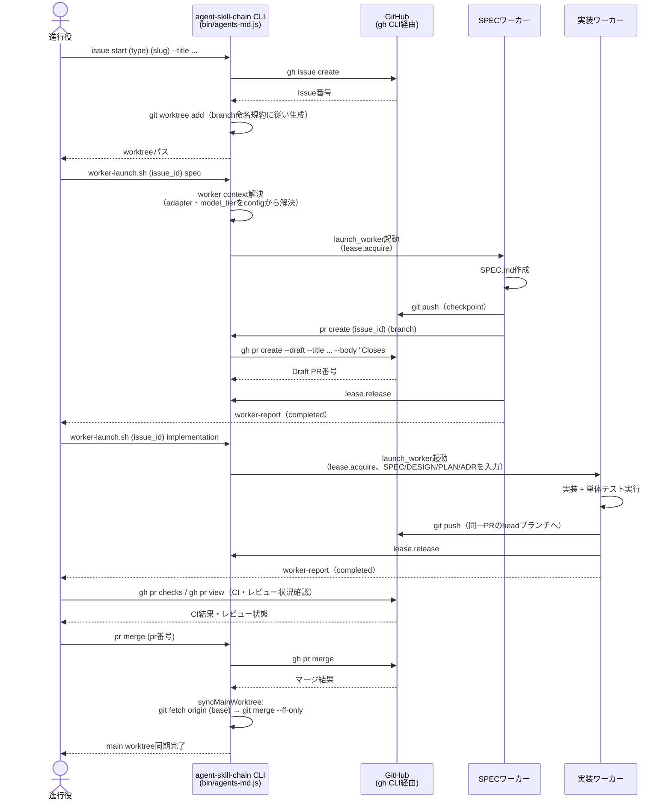
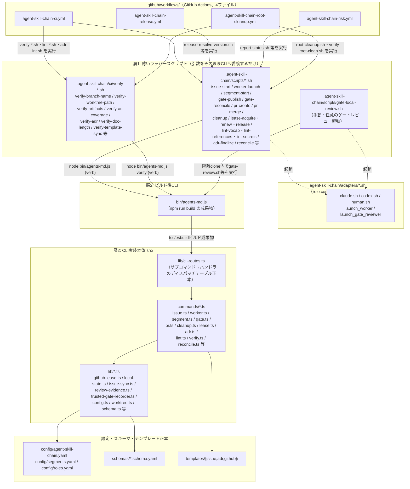
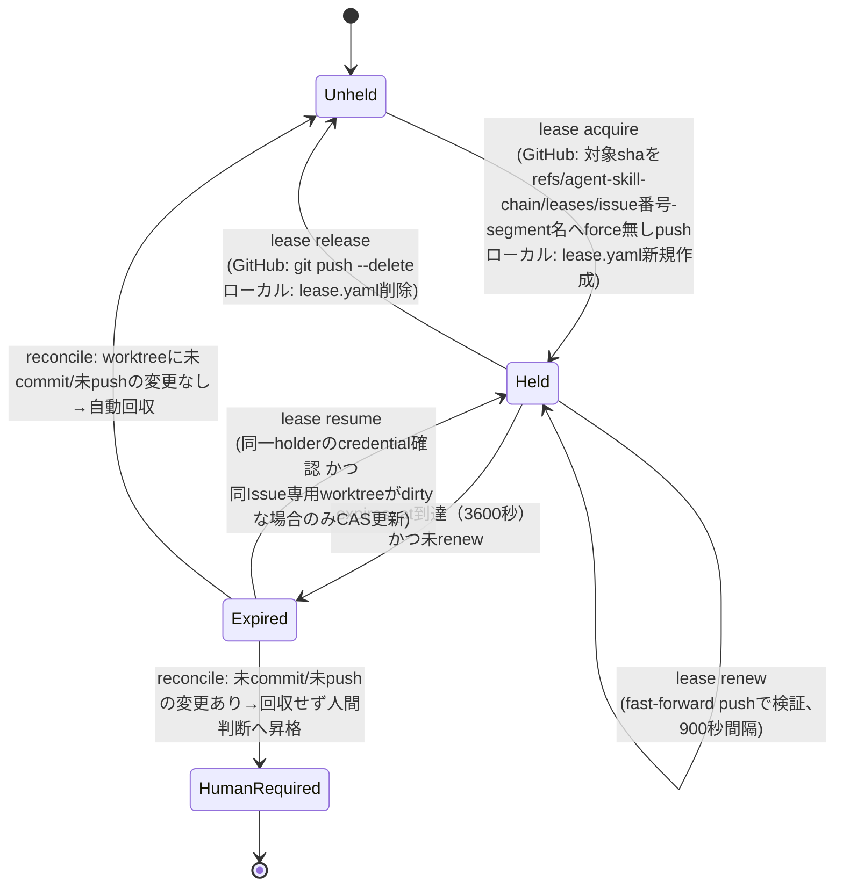
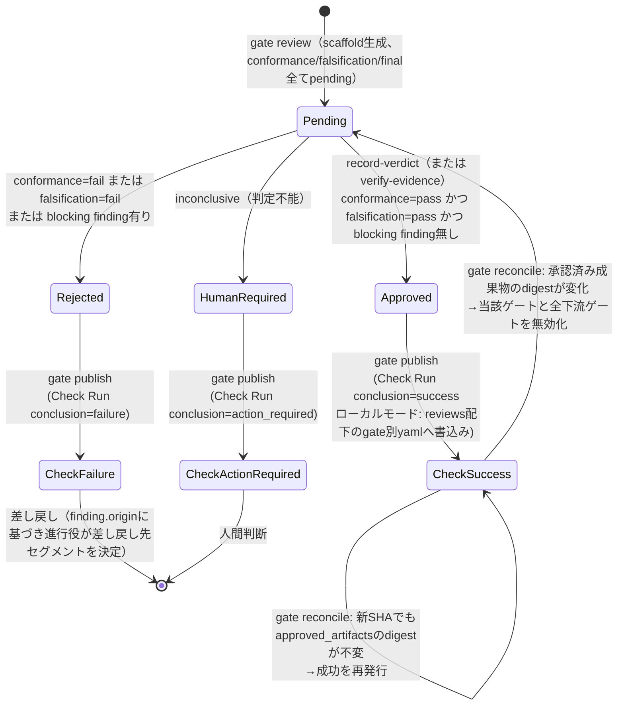
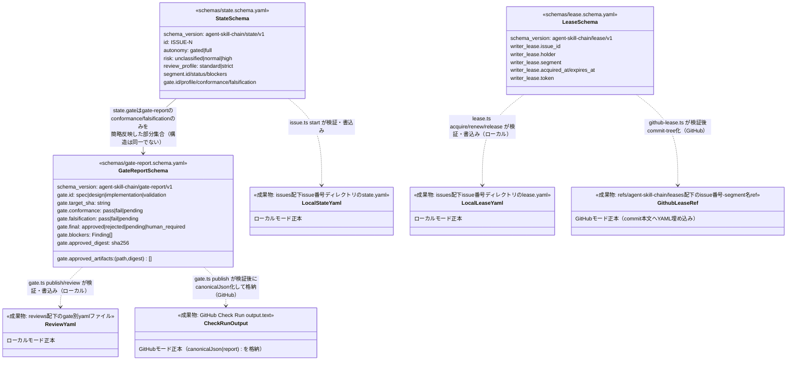

# ARCHITECTURE.md — agent-skill-chain の動作を図で見る

## 目的・対象範囲

本ドキュメントは、agent-skill-chain が実際にどう動くか（Issue作成からworktree・PR・4セグメント・ゲート判定・マージまでの一連の流れ、進行役/ワーカー/レビュアの役割分担、Coordination Backend別の状態遷移）を Mermaid 図で視覚的に示す。思想・不変条件・規約の正本は `AGENTS.md` であり、本ドキュメントはその図解補助資料である。数値・enum・処理フローは本ドキュメント作成時点の実際のコード・設定ファイル（`.agent-skill-chain/config/`、`.agent-skill-chain/scripts/`、`.agent-skill-chain/schemas/`、`src/commands/`、`src/lib/`、`.github/workflows/`、`docs/adr/`）を読んで作成しており、想像で埋めた箇所は無い。

対象読者は、agent-skill-chain を導入・運用する開発者、および進行役・ワーカーとして働くAIエージェントである。CLIコマンドの個々の引数・オプション一覧は対象外（README.md を参照）。プロジェクト固有ポリシー（`.agent-skill-chain/project/`）による拡張は対象外。

## 前提・用語

- **Issue**: GitHub Issue（またはローカルモードのIssue状態ファイル）。作業の集約ルート。
- **worktree**: 1 Issueにつき1つ作成する `git worktree`。パスは `.worktrees/<Issue起票日時(JST)>-<type>-<issue-id>-<slug>/`。
- **進行役（Orchestrator）**: Issue作成・状態遷移・worktree管理・マージのみを行う。成果物branchへのcommitは禁止。writer lease対象外。
- **セグメント作業ワーカー**: spec/design/implementation/validationの4セグメントのいずれかを担当し、自branchへcommit/pushする。1 Issueにつき同時に1つのみ writer lease を保持できる。
- **ゲートレビュア**: read-onlyで成果物を検査し、conformance（立証）・falsification（反証）の2観点でverdictを返す。書込み権限を持たない。
- **writer lease**: 1 Issueにつき同時1つだけ許可される書込み権限の貸与。既定 `ttl_seconds: 3600`、`renewal_interval_seconds: 900`。
- **Coordination Backend**: 調整状態（Issue・状態遷移・ゲート判定結果）の正本の置き場所。`github`（Issue・PR・branch・Check Run）または `local`（`state.yaml`・`reviews/<gate>.yaml`、いずれもGit管理下）のいずれか一方のみ。
- **ゲート（spec/design/implementation/validation gate）**: 各セグメント完了時の判定。`conformance`・`falsification` それぞれ `pass|fail|pending`、総合判定 `final` は `approved|rejected|pending|human_required`。

**現状の重要な前提**: 4ゲート（spec/design/implementation/validation-gate）を強制する GitHub Actions ワークフロー（gate.yml・reconcile.yml・trusted-gate.yml）は運用上の非効率のため削除済みであり、branch protection の必須チェックからも4ゲートは外れている。ゲート判定を行うCLI実装（`src/commands/gate.ts` 等）・スクリプト（`.agent-skill-chain/scripts/gate-*.sh`）・アダプタ・スキーマは削除されておらず、`gate-local-review.sh` 経由の手動・任意のAIレビュー用ツールとして稼働する。本ドキュメントの図はこの現状（ゲート通過は必須ではなく任意）を反映する。

## 1. ワークフロー図

Issue作成からマージ・main worktree同期までの全体フロー。

```mermaid
flowchart TD
    Start([進行役: Issue起票]) --> Worktree["worktree作成<br/>.worktrees/(起票日時JST)-(type)-(issue-id)-(slug)/<br/>branch: (type)/(issue-id)-(slug)"]
    Worktree --> SpecLaunch["進行役: worker-launch.sh でSPECワーカー起動<br/>（writer lease取得）"]
    SpecLaunch --> SpecWork["SPECワーカー: SPEC.md作成<br/>checkpointをcommit + push"]
    SpecWork --> DraftPR["SPECワーカー: Draft PR作成<br/>（Closes #issue-id）"]
    DraftPR --> SpecRelease["writer lease解放<br/>進行役へ完了報告"]

    SpecRelease --> NextSeg{"次セグメント<br/>design → implementation → validation"}
    NextSeg --> ImplCheck{"segment==<br/>implementation?"}
    ImplCheck -- いいえ --> SegLaunch
    ImplCheck -- はい --> ImplGate{"人間確認済みか<br/>（セッション許可 or<br/>human_confirmation.<br/>before_implementation=false）"}
    ImplGate -- いいえ（既定） --> ImplBlocked["segment start拒否<br/>（日本語エラーで停止、<br/>人間へ確認を促す）"]
    ImplBlocked --> NextSeg
    ImplGate -- はい --> SegLaunch["進行役: worker-launch.sh で該当ワーカー起動<br/>（writer lease取得）"]
    SegLaunch --> SegWork["ワーカー: 同一PRのheadブランチへ<br/>commit + push<br/>（design: DESIGN.md/PLAN.md/ADR<br/>implementation: コード+単体テスト<br/>validation: 受入/回帰テスト+VALIDATION.md）"]
    SegWork --> SegRelease["writer lease解放<br/>進行役へ完了報告"]

    SegRelease --> ManualGate{"手動ゲートレビューを<br/>実行するか（任意）"}
    ManualGate -- 実行する --> GateReview["gate-local-review.sh<br/>conformance/falsification判定<br/>→ gate record-verdict<br/>→ gate publish（Check Run + PR review evidence）"]
    GateReview --> MoreSeg{全4セグメント完了?}
    ManualGate -- 実行しない --> MoreSeg
    MoreSeg -- いいえ --> NextSeg
    MoreSeg -- はい --> ReadyForReview["進行役: Draft → Ready for Review"]
    ReadyForReview --> MergeGate{"人間確認済みか<br/>（セッション許可 or<br/>merge.autonomous=true）"}
    MergeGate -- いいえ（既定） --> MergeBlocked["pr merge拒否<br/>（日本語エラーで停止、<br/>人間へ確認を促す）"]
    MergeBlocked --> ReadyForReview
    MergeGate -- はい --> Merge["進行役: pr merge"]
    Merge --> SyncMain["main worktreeを<br/>origin/(default branch)へ<br/>fast-forward同期"]
    SyncMain --> End([完了])
```

補足: 「手動ゲートレビュー」ノードはセグメントごとに任意実行できる（4回まで）。ゲート判定は必須ではないため、実行しないままマージへ進む経路も存在する。ゲートを実行した場合、`gate-reconcile.sh` が以後のpushで承認済み成果物のdigestを照合し、変化があれば当該ゲートと下流ゲートを無効化する（状態遷移図を参照）。

補足: 「人間確認済みか」の2つの判定ノード（実装セグメント着手前・PRマージ前）は、いずれも既定で人間確認を要求する（`ImplGate`・`MergeGate` の「いいえ（既定）」経路）。人間がセッション中にその場で許可した場合はその1回限りの遂行として先へ進んでよく、`.agent-skill-chain/config/agent-skill-chain.yaml` の設定は変更しない。複数Issue・複数PRにわたり確認を省略したい場合のみ、`human_confirmation.before_implementation: false` / `merge.autonomous: true` を明示設定する（README.md §自走・承認ポリシー参照）。

## 2. シーケンス図

代表シナリオ: 進行役がIssueを起票しworktreeを作成、SPECワーカーへ委譲してDraft PRを作成させ、続けて実装ワーカーへ委譲し、最後にCIを確認してマージする一連の流れ。

補足: design/validation セグメントの委譲も implementation と同型（`worker-launch.sh` → lease取得 → 同一PR headブランチへcommit/push → lease解放 → 完了報告）であるため省略した。ゲートレビュー（`gate-local-review.sh`）を実行する場合は、進行役がゲートレビュアを起動し、レビュア（read-only）がverdictを返し、`gate record-verdict` → `gate publish` がtrusted codeとしてCheck Run発行とPR review投稿を行う（ワーカー・レビュア自身は書込み権限を持たない）。

## 3. コンポーネント図

`.agent-skill-chain/` 配下のスクリプト群は CLI 実装本体（`src/`）への薄いラッパーであり、ビルド後の `bin/agents-md.js` を経由して呼び出す二層構造を持つ。

各スクリプトが呼び出す CLI サブコマンドと `src/commands/*.ts` の対応（代表例、いずれも `exec "${CLI[@]}" <サブコマンド>` 形式の薄いラッパー）:

| スクリプト | CLIサブコマンド | 実装 (`src/commands/*.ts`) |
|---|---|---|
| `scripts/issue-start.sh` | `issue start` | `issue.ts` の `start` |
| `scripts/worker-launch.sh` | `worker context`（アダプタ解決） + `adapters/*.sh` の `launch_worker` | `worker.ts` の `context` |
| `scripts/segment-start.sh` | `segment start` | `segment.ts` の `start` |
| `scripts/gate-publish.sh` | `gate publish` | `gate.ts` の `publish` |
| `scripts/gate-reconcile.sh` | `gate reconcile` | `gate.ts` の `reconcile` |
| `scripts/gate-review.sh`（`gate-local-review.sh` から隔離clone内で起動） | `gate review` | `gate.ts` の `review` |
| `scripts/pr-create.sh` | `pr create` | `pr.ts` の `create` |
| `scripts/pr-merge.sh` | `pr merge` | `pr.ts` の `merge` |
| `scripts/cleanup.sh` | `cleanup` | `cleanup.ts` の `run` |
| `scripts/lease-acquire.sh` / `lease-renew.sh` / `lease-release.sh` | `lease acquire` / `lease renew` / `lease release` | `lease.ts` の `acquire` / `renew` / `release` |
| `scripts/adr-finalize.sh` | `adr finalize` | `adr.ts` の `finalize` |
| `scripts/reconcile.sh` | `reconcile`（lease回収） | `reconcile.ts` の `run` |
| `scripts/lint-vocab.sh` / `lint-references.sh` | `lint vocab` / `lint references` | `lint.ts` の `vocab` / `references` |
| `ci/verify-branch-name.sh` / `verify-artifacts.sh` / `verify-ac-coverage.sh` | `verify branch-name` / `verify artifacts` / `verify ac-coverage` | `verify.ts` の各エクスポート |

## 4. 状態遷移図

### 4-1. writer lease のライフサイクル

GitHubモードでは `refs/agent-skill-chain/leases/<issue_number>-<segment>` というgit ref へのforce無しpushによる compare-and-set（`ADR-0002`）で実装される。ローカルモードでは `issues/<number>/.agent-skill-chain/lease.yaml` が正本。既定値は `ttl_seconds: 3600`・`renewal_interval_seconds: 900`（両モード共通、`.agent-skill-chain/config/agent-skill-chain.yaml` の `lease.*`）。

### 4-2. ゲートの状態遷移

`src/commands/gate.ts` に基づく。`final` の導出は「両観点pass かつ blocking finding無し→approved／いずれかfailまたはblocking finding有り→rejected／inconclusive→human_required（判定不能をapprove/rejectへ倒さない安全側ラチェット）」。

## 5. 主要データ構造図（スキーマ間の関係）

`.agent-skill-chain/schemas/` 配下の3スキーマ（`gate-report`・`state`・`lease`）と、それぞれを実際に検証・保存する場所の対応。`src/lib/schema.ts` の `validateAgainstSchema(name, data, root)` がスキーマ名で `.agent-skill-chain/schemas/<name>.schema.yaml` を読み検証する。

補足: GitHubモードの成果物（`SPEC.md`等）内容の正本はGit管理下ファイルであり、`issue_sync.enabled: true`（既定false、`ADR-0021`）を明示したプロジェクトに限り、ゲート通過ごとにIssue/PR本文の固定マーカー区間へ内容を一方向転記する（転記結果をゲート判定の入力として読み戻すことはしない）。

## 未決事項・対象外

- プロジェクト固有ポリシー（`.agent-skill-chain/project/manifest.yaml`）による役割・規約の拡張は対象外。
- `docs/system-spec/`（システム仕様書）は `docs/adr/ADR-0001-docs-system-spec-construction.md` が `status: proposed` の段階であり、実体未構築のため本ドキュメントでは扱わない。
- 各図はコマンド引数・エラーハンドリングの詳細までは描いていない（README.md およびCLIの `-h` 出力を参照）。
