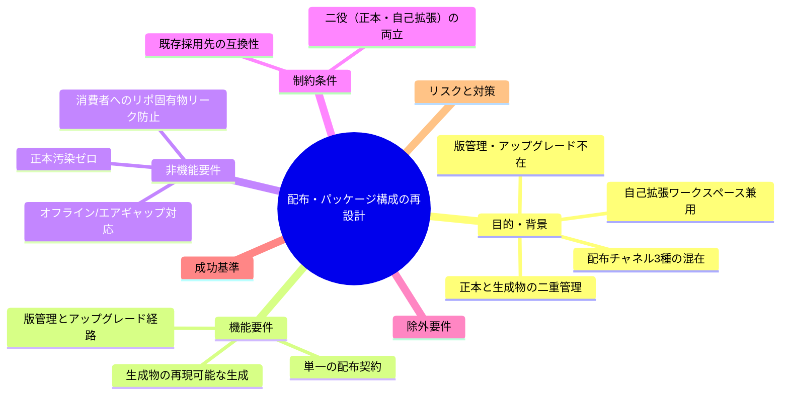
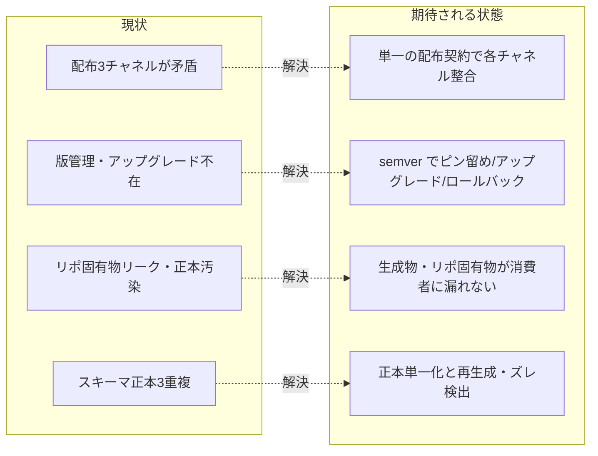

# 要求定義書: 配布とパッケージ構成の再設計

**プロジェクト名**: 配布とパッケージ構成の再設計
**作成日**: 2026 年 06 月 14 日
**最終更新**: 2026 年 06 月 14 日

> **重要**:
>
> - 要求定義書は、プロジェクトの全体像を把握するためのものです。詳細な技術仕様や実装方法は要件定義書以降で記載します。必要最低限の情報に収めることを心掛けてください。
> - **このドキュメントは常に更新**: 要求の変更や追加があった場合は、即座にこのドキュメントを更新してください。
> - **設計の解は決め打ちしない**: 本書では「npm にするか」「マーケットプレイス生成物をコミットするか」等の具体的解決策は確定しない。**満たすべき性質（版管理ができること、生成物が正本を汚さないこと、消費者にリポ固有物が漏れないこと等）**を要求として定義し、解は設計フェーズで選定する。
>
> **用語**: [.agents/CONCEPTS.md §用語規約](../../../../.agents/CONCEPTS.md#用語規約) を参照。

---

## 要求定義の全体像

**注意**: マインドマップは全体像の把握用。詳細は本文・要件定義に記載する。

---

## 1. 目的・背景

### 1.1 目的（必須）

本パッケージの配布・版管理・正本/生成物分離を一貫した契約として再設計する。

### 1.2 背景

本リポジトリは「AI 実行契約・ワークフロー仕様パッケージ」であり、**正本は `.agents/`**、**各ツール向けは `.adapters/` に生成**、**消費者へは `.agents/scripts/setup.sh` で配備**する。同時にこのリポは「**パッケージ正本**」と「**自分自身を自己拡張する開発ワークスペース**」の二役を兼ねている。この二役兼用が、配布・版管理・正本分離の各所で矛盾と欠陥を生んでいる。

- **現状の課題**:
  - **配布チャネルが中途半端に 3 つ混在している**。
    - (a) `setup.sh` による `cp` コピー配備（**版管理なし・アップグレード経路なし**）。
    - (b) Claude Code マーケットプレイス・プラグイン（`.claude-plugin/marketplace.json` が `source: "./.adapters/claude"` を指す。生成物のコミットが前提）。
    - (c) npm（**`package.json` が存在せず未対応**）。
  - **欠陥 1（マーケットプレイス破綻）**: marketplace は `.adapters/claude` を指すが、直近で `/.adapters/` を `.gitignore` したため、新規 clone ではマーケットプレイス配布が壊れる。さらに手書きの土台 `.adapters/claude/.claude-plugin/plugin.json` と `.adapters/README.md` も巻き添えで無視され、`build-plugin-claude.sh:16` が「土台が無い」と失敗する。
  - **欠陥 2（`.cursor/` の gitignore 漏れ）**: setup が生成する `.cursor/` が `.gitignore` に未記載で、生成物がコミットされうる。
  - **欠陥 3（リポ固有物リーク）**: `setup.sh:64-65` が外部採用先へ `.agents-project/` をコピーしてしまい、このリポ固有の自己拡張ルールがリークする。`SETUP.md:31,102` の「setup は `.agents-project` を作らない」と矛盾する。
  - **欠陥 4（スキーマ正本ズレ）**: `workflow.db` のスキーマが `setup.sh` / `write-workflow-log.sh` / `.agents/ledger/schema.md` の 3 箇所に重複し、`document_path` カラムの取り扱いに非対称がある。
  - **欠陥 5（版管理不在）**: `package.json` 不在のため semver・アップグレード・依存ピン留めができない。
  - **二重管理の懸念**: 正本 `.agents/` と生成物 `.adapters/` が両方リポに存在しうるが、生成物をコミットすべきか否かの契約が一貫しておらず、二重管理・正本ズレを誘発する。

- **必要性**:
  - **採用先が新版を安全に取り込めるアップグレード経路**が必要（現状 `cp` のみで版もロールバックもない）。
  - **生成物が正本を汚さない／消費者にリポ固有物（`.agents-project/` 等）が漏れない**という不変条件を、契約として明文化・自動検証する必要がある。
  - **自己拡張を続ける前提**でディレクトリ構成・配布契約が破綻しないことを保証する必要がある。

### 1.3 期待される効果（必須: 1 件以上）

- **効果 1（配布契約の単一化）**: 「どのチャネルで何が配布されるか」が 1 つの正となる契約に集約され、`marketplace.json` の参照先と `.gitignore` の整合が成立し、**新規 clone から各配布チャネルが破綻なく動く（○/× 判定可能）**。
- **効果 2（版管理可能）**: パッケージにバージョンが付与され、採用先が**特定版をピン留め・アップグレード・ロールバックできる（○/× 判定可能）**。
- **効果 3（リーク・汚染ゼロ）**: setup 後の採用先に `.agents-project/` 等のリポ固有物が混入せず、配布物に保守者向け文書（`docs/maintainer/`）・証跡 DB が含まれないことが**検証手順で確認できる（○/× 判定可能）**。
- **効果 4（正本ズレ検出）**: `workflow.db` スキーマ等の正本が単一化され、生成物が正本から再生成可能で、**正本ズレを CI 等で検出できる（○/× 判定可能）**。

**現状と期待される状態の比較**:

---

## 2. 機能要件

### 2.1 既存機能の維持（該当する場合）

- `setup.sh` による配備（Claude / Cursor / CI enforcement・スキル同期・テンプレート配備・証跡 DB 初期化）。
- Claude Code マーケットプレイス・プラグイン配布（`build-plugin-claude.sh` による `.adapters/claude` 生成）。
- 自己拡張ワークフロー（自己 issue を `docs/maintainer/workflow/` に追跡、`.workflow/` は消費者ランタイムとして gitignore）。

### 2.2 新規機能要件

- **単一の配布契約**: 配布チャネルごとに「何を／どこから／どの版で」配るかを定義した一貫契約。
- **生成物の再現可能な生成**: `.adapters/` 等の生成物を正本から決定的に再生成し、正本ズレを検出する仕組み。
- **版管理・アップグレード経路**: semver による版付与と、採用先のピン留め・アップグレード・ロールバック・破壊的変更時の移行手順。
- **リーク／汚染防止ガード**: リポ固有物・保守者向け文書・証跡 DB が配布物・採用先へ漏れないことの自動検証。

---

## 3. 非機能要件

### 3.1 パフォーマンス

- setup・アップグレードは対話なしで非インタラクティブに完了でき、CI でも実行可能であること。

### 3.2 セキュリティ

- 証跡 DB（`workflow.db`）および保守者向け文書は配布物に**絶対に含めない**（`.agents/SETUP.md` の方針を踏襲）。
- 採用先のローカル改変（人間が編集してよい `.agents-project/` 等）を、アップグレードが無断で破壊しないこと。

### 3.3 互換性

- 既存採用先（`cp` ベースで配備済み）が、再設計後の経路へ移行できること。
- 既存の `AGENTS.md` / `.claude` / `.cursor` が存在する／しない両ケースで安全に動くこと。

### 3.4 保守性

- 正本は単一（`workflow.db` スキーマ等を 1 箇所に集約）。生成物は手編集禁止であることが目印で明示されること。
- 自己拡張を続けても、正本・生成物・配布契約の整合が崩れないこと。

---

## 4. 制約条件

### 4.1 技術的制約

- 配布対象は AI 実行契約・ワークフロー仕様（Markdown／スクリプト中心）であり、コンパイル成果物ではない。
- Claude Code マーケットプレイスはプラグイン `source` 配下が clone 時点で実在することを要求する（生成物の扱いに影響）。

### 4.2 既存システムとの互換性

- このリポは「正本」と「自己拡張ワークスペース」を兼ねる二役を維持する。再設計はどちらの役も壊さないこと。
- `.agents-project/` は採用先には配備しない（リポ固有・最優先ルール）。

### 4.3 移行期間・スケジュール

- 既存採用先向けの移行は段階的に行えること（旧 `cp` 経路を即時廃止しない移行窓を許容）。

---

## 5. 除外要件

- 具体的な配布方式の決定（npm 化する／しない、生成物をコミットする／生成オンデマンドにする等）は**本書では確定しない**。設計フェーズで「満たすべき性質」を根拠に選定する。
- `.agents/` 配下の仕様内容（skills・commands・enforcement のロジック）そのものの改訂は対象外。
- 配布チャネルの新規追加（VS Code 拡張等、Claude/Cursor/CI/npm 以外）は対象外。

---

## 6. 成功基準（必須: 1 件以上）

- **SC-1**: 新規 clone した状態から、定義済みの各配布チャネル（少なくとも setup・マーケットプレイス）が**破綻なく成功する**（マーケットプレイス土台欠落・`build-plugin-claude.sh` の失敗が再現しない）。○/×。
- **SC-2**: パッケージにバージョンが付与され、採用先が**特定版のピン留め・アップグレード・ロールバック**を実行できる手順が存在し、実証できる。○/×。
- **SC-3**: setup 実行後の採用先に **`.agents-project/` が存在しない**こと、配布物に `docs/maintainer/`・`workflow.db` が含まれないことを検証手順で確認できる。○/×。
- **SC-4**: setup が生成する `.cursor/`・`.claude/`・`.adapters/` 等の生成物について、コミット可否の方針が一貫し、`.gitignore` と `marketplace.json` 参照先が矛盾しない。○/×。
- **SC-5**: `workflow.db` スキーマの正本が単一化され、`setup.sh` / `write-workflow-log.sh` の定義が正本と一致（`document_path` の非対称が解消）していることを検証できる。○/×。
- **SC-6**: 本書 01 で定義する全ユースケースの受け入れ基準（gherkin シナリオ）が満たされる。○/×。

---

## 7. リスクと対策

### 7.1 技術的リスク

- **リスク**: 生成物（`.adapters/`）をコミットすると二重管理になり、`.gitignore` し過ぎるとマーケットプレイスが壊れる（欠陥 1 の構造的ジレンマ）。
  - **対策**: 「生成物のコミット要否」と「正本ズレ検出」を要件として明文化し、設計フェーズで両立する方式（コミット＋CI 検証、または生成オンデマンド等）を選定する。
- **リスク**: アップグレードが採用先のローカル改変（`.agents-project/` 等）を破壊する。
  - **対策**: 「上書き対象／非対象」を契約化し、人間編集領域を保護する要件を必須とする。

### 7.2 スケジュールリスク

- **リスク**: 既存採用先の移行コストが大きく、再設計が滞留する。
  - **対策**: 旧 `cp` 経路を残す移行窓を設け、段階移行を許容する制約とする。

---

## 8. 参考資料

### プロジェクトドキュメント

- [`01_要件定義.md`](./01_要件定義.md) - 要件定義
- [docs/maintainer/workflow/README.md](../README.md) - 自己拡張ワークフローの位置づけ

### その他の参考資料

- `.agents/scripts/setup.sh`, `.agents/scripts/build-plugin-claude.sh`
- `.claude-plugin/marketplace.json`, `.gitignore`
- `.agents/SETUP.md`, `.agents/ledger/schema.md`, `.agents/scripts/write-workflow-log.sh`

---

## 9. 次のステップ

この要求定義書の承認後、以下を作成します：

- **次**: [`01_要件定義.md`](./01_要件定義.md) - 要件定義フェーズ
