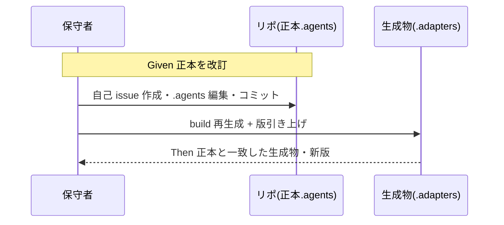
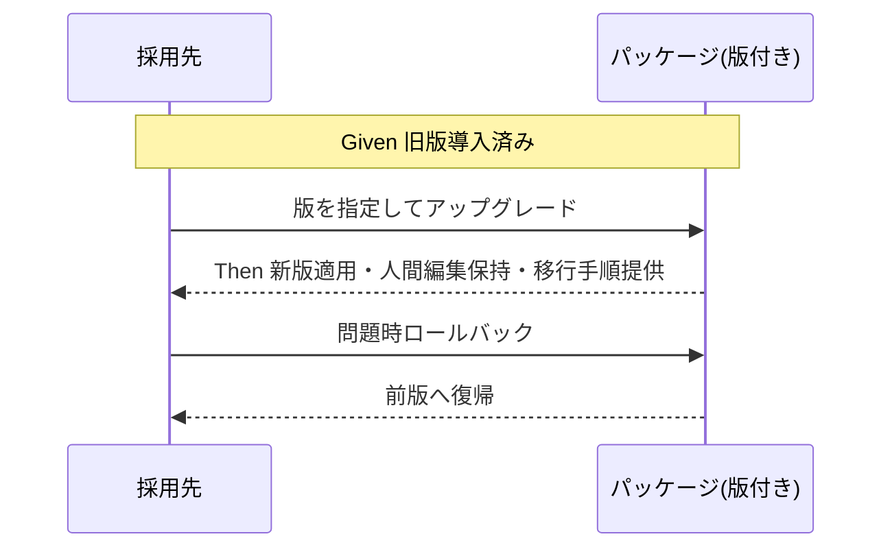

# 要件定義書: 配布とパッケージ構成の再設計

**プロジェクト名**: 配布とパッケージ構成の再設計
**作成日**: 2026 年 06 月 14 日
**最終更新**: 2026 年 06 月 14 日

> **重要**: **このドキュメントは常に更新**。要件の変更や追加があった場合は即座に更新すること。
>
> **本書の方針**: 設計の解（npm 化の是非、生成物のコミット要否等）は決め打ちしない。各ユースケースを **gherkin で網羅**し、各シナリオに **○/× 判定可能な受け入れ基準** を付す。受け入れ基準は「満たすべき性質」として記述し、実装方式に依存しない。
>
> **用語**: [.agents/CONCEPTS.md §用語規約](../../../../.agents/CONCEPTS.md#用語規約) を参照。

---

## 1. 概要

### 1.1 システム概要

本パッケージは AI 実行契約・ワークフロー仕様の配布物である。**正本は `.agents/`**、**各ツール向けは `.adapters/` に生成**、**消費者へは `setup.sh` で配備**する。本リポは「パッケージ正本」と「自己拡張開発ワークスペース」の二役を兼ねる。本要件定義は、配布・版管理・正本/生成物分離・リーク防止に関する**ユースケースの網羅**と**各シナリオの受け入れ基準**を定義する。

### 1.2 用語集

| 用語 | 説明 |
| ---- | ---- |
| 正本（`.agents/`） | 手で編集してよい一次ソース。仕様の唯一の真実。 |
| 生成物（`.adapters/`, `.claude/`, `.cursor/`） | 正本から build/setup で機械生成される派生物。手編集禁止。 |
| 配布チャネル | 消費者に届ける経路。(a) setup.sh コピー、(b) Claude マーケットプレイス、(c) npm（未対応）。 |
| 採用先（消費者） | 本パッケージを導入する外部プロジェクト。 |
| リポ固有物 | `.agents-project/`・`docs/maintainer/`・`workflow.db` 等、配布してはならない本リポ専用物。 |
| 自己拡張 | 本リポ自身で自己 issue を立て `.agents` を改訂する開発（ドッグフーディング）。 |
| ピン留め | 採用先が取り込む版を特定バージョンに固定すること。 |

---

## 2. 機能要件

### 2.1 ユーザーストーリー

#### ストーリー 1: 安全なアップグレード

- **As a** 既存採用先の保守者
- **I want to** 新版を取り込みつつローカル改変を壊さない
- **So that** リスクなく仕様更新を受け取れる

**受け入れ基準**:
- アップグレード後、人間編集領域（`.agents-project/` 等）が保持される。
- 取り込み版が記録され、ロールバック可能である。

#### ストーリー 2: 漏れのない導入

- **As a** 新規採用先の開発者
- **I want to** 自分の構成（Claude のみ/Cursor のみ/両方/CI のみ）に応じて導入する
- **So that** 不要物やリポ固有物を持ち込まずに使い始められる

**受け入れ基準**:
- 導入後に `.agents-project/`・`docs/maintainer/`・`workflow.db` が混入しない。
- 既存の `AGENTS.md`/`.claude`/`.cursor` を不用意に破壊しない。

#### ストーリー 3: 整合した配布

- **As a** パッケージ保守者
- **I want to** 配布チャネルと `.gitignore`・`marketplace.json`・生成物の整合を保つ
- **So that** 新規 clone から全チャネルが破綻なく動く

**受け入れ基準**:
- 新規 clone でマーケットプレイス・setup が成功する。
- 正本と生成物のズレを検出できる。

### 2.2 BDD ユースケース

---

#### ユースケース 1: 自己拡張開発（ドッグフーディング）

このリポで自己 issue を立て `.agents` を編集→テスト→コミット→版を上げ、生成物（`.adapters`）を再生成する。

**シナリオ 1-1: 自己 issue 作成と正本編集**

```gherkin
Feature: 自己拡張開発
  Scenario: 自己 issue を立てて正本を改訂する
    Given 本リポのワークスペースである
    When 自己 issue を docs/maintainer/workflow/ 配下に作成し .agents/ を編集する
    Then 自己 issue は git 追跡対象に入り .workflow/ ランタイムには混入しない
    And 編集対象は正本 .agents/ のみであり生成物は手編集されない
```

**受け入れ基準（○/×）**:
- 自己 issue が `docs/maintainer/workflow/` に作られ、`.workflow/*`（templates 除く）は gitignore のままである。
- 生成物ディレクトリへの手編集差分が混入していない。

**シナリオ 1-2: 生成物の再生成と版の引き上げ**

```gherkin
Feature: 自己拡張開発
  Scenario: 正本変更後に生成物を再生成し版を上げる
    Given .agents/ を改訂しコミット可能な状態である
    When build を実行し .adapters/ を再生成し版番号を引き上げる
    Then .adapters/ は正本から決定的に再生成され正本とズレない
    And 版番号が semver で更新されCHANGELOG 等に反映できる
```

**受け入れ基準（○/×）**:
- 再生成後の生成物が、コミット済み生成物（または検証基準）と一致する（再現性）。
- 版番号が更新され、後続のピン留め対象になりうる。



---

#### ユースケース 2: 新規採用（インストール）

Claude のみ／Cursor のみ／両方／CI のみ。既存 `AGENTS.md`・`.claude`・`.cursor` が有る/無い両ケース。

**シナリオ 2-1: Claude のみへ導入（既存ファイルなし）**

```gherkin
Feature: 新規採用
  Scenario: Claude 構成のクリーンなプロジェクトに導入する
    Given 採用先に .agents も AGENTS.md も無い
    When 導入手順を実行し Claude 向け配備を選ぶ
    Then .agents/ と AGENTS.md と .claude/ が配備される
    And .agents-project/ docs/maintainer/ workflow.db は配備されない
```

**受け入れ基準（○/×）**:
- `.claude/hooks` と `.claude/skills` が生成される。
- `.agents-project/` が採用先に存在しない（欠陥 3 の解消）。

**シナリオ 2-2: Cursor のみへ導入**

```gherkin
Feature: 新規採用
  Scenario: Cursor 構成へ導入する
    Given 採用先が Cursor を使う
    When 導入手順を実行し Cursor 向け配備を選ぶ
    Then .cursor/ が配備され生成物として明示される
    And .cursor/ は採用先で生成物と分かる形（gitignore 方針が定義済み）である
```

**受け入れ基準（○/×）**:
- `.cursor/`・`.cursor/skills` が生成される。
- `.cursor/` の gitignore 方針が定義済みで、本リポ側でも `.cursor/` が無視対象である（欠陥 2 の解消）。

**シナリオ 2-3: Claude + Cursor 両方へ導入**

```gherkin
Feature: 新規採用
  Scenario: Claude と Cursor の両方へ導入する
    Given 採用先が両ツールを使う
    When 導入手順を実行する
    Then .claude/ と .cursor/ の両方が同一正本から同期される
    And 同名 capability が domain__capability で衝突しない
```

**受け入れ基準（○/×）**:
- `.claude/skills` と `.cursor/skills` の両方に `domain__capability` 形式で配備される。
- 同名 capability の衝突が起きない。

**シナリオ 2-4: CI のみ（enforcement）導入**

```gherkin
Feature: 新規採用
  Scenario: CI に enforcement のみ導入する
    Given 採用先は対話 AI を使わず CI でルール強制したい
    When enforcement のみ導入する
    Then enforcement フックが CI から実行可能に配備される
    And 対話ツール固有物に依存せず動作する
```

**受け入れ基準（○/×）**:
- enforcement の実行に必要な最小構成のみが配備される。
- 非インタラクティブに（プロンプトなしで）実行できる。

**シナリオ 2-5: 既存 AGENTS.md / .claude / .cursor が存在する場合**

```gherkin
Feature: 新規採用
  Scenario: 既存ファイルがある採用先に導入する
    Given 採用先に既存の AGENTS.md または .claude/.cursor がある
    When 導入手順を実行する
    Then 既存の AGENTS.md は無断上書きされない
    And 生成物（.claude/hooks 等）の再同期は方針どおり扱われ人間編集の喪失が事前に警告される
```

**受け入れ基準（○/×）**:
- 既存 `AGENTS.md`/`CLAUDE.md` は存在時に上書きされない。
- 生成物の再同期で人間編集が失われる場合、その旨が手順・出力で明示される。

---

#### ユースケース 3: アップグレード

既存採用先が新版を取り込む。ピン留め・ロールバック・破壊的変更時の移行。

**シナリオ 3-1: 通常アップグレード**

```gherkin
Feature: アップグレード
  Scenario: 採用先が新版を取り込む
    Given 採用先が旧版を導入済みである
    When 新版へアップグレードする
    Then 正本・生成物が新版に更新される
    And .agents-project/ 等の人間編集領域は保持される
```

**受け入れ基準（○/×）**:
- アップグレード後、`.agents-project/` の内容が保持される。
- 取り込み版が特定できる（版が記録される）。

**シナリオ 3-2: ピン留めとロールバック**

```gherkin
Feature: アップグレード
  Scenario: 特定版に固定し問題時に戻す
    Given 採用先が版をピン留めしたい
    When 特定版を指定して導入し後に旧版へ戻す
    Then 指定版が決定的に取り込まれる
    And ロールバックで以前の版へ戻せる
```

**受け入れ基準（○/×）**:
- 版指定で同一内容が再現的に取り込まれる。
- ロールバック手順で前版へ戻せる（欠陥 5 の解消）。

**シナリオ 3-3: 破壊的変更時の移行**

```gherkin
Feature: アップグレード
  Scenario: 破壊的変更を含む版へ移行する
    Given 新版に後方非互換な変更（例: スキーマ変更）がある
    When アップグレードを実行する
    Then 破壊的変更が版（major）で識別できる
    And 移行手順（例: workflow.db マイグレーション）が提供され適用できる
```

**受け入れ基準（○/×）**:
- 後方非互換が semver の major で表現される。
- 移行手順が文書化され、`workflow.db` 等のデータ移行が成功する。



---

#### ユースケース 4: マーケットプレイス導入（Claude）

**シナリオ 4-1: 新規 clone からのマーケットプレイス配布**

```gherkin
Feature: マーケットプレイス導入
  Scenario: clone 直後にマーケットプレイスから導入する
    Given リポを新規 clone した直後である
    When marketplace.json の参照先からプラグインを導入する
    Then source が指す生成物の土台が実在し導入が成功する
    And build-plugin-claude.sh の土台欠落エラーが発生しない
```

**受け入れ基準（○/×）**:
- `marketplace.json` の `source` 参照先が clone 時点で解決できる（手書き土台 `.claude-plugin/plugin.json`・`.adapters/README.md` が欠落しない）。
- `.gitignore` と `marketplace.json` 参照先が矛盾しない（欠陥 1 の解消）。

---

#### ユースケース 5: npm 導入（採用する場合）

**シナリオ 5-1: npm 経由での版付き導入**

```gherkin
Feature: npm 導入
  Scenario: npm でパッケージを版指定導入する
    Given npm 配布が提供される（採用される場合）
    When 採用先が版を指定して npm 導入する
    Then パッケージが版付きで取得され依存をピン留めできる
    And 配布物にリポ固有物・証跡 DB・保守者文書が含まれない
```

**受け入れ基準（○/×）**:
- 配布物にバージョン情報が含まれ、ピン留め・アップグレードができる（`package.json` 不在＝欠陥 5 の解消、ただし npm 採用は設計判断）。
- 公開対象から `.agents-project/`・`docs/maintainer/`・`workflow.db`・`.workflow/`（templates 除く）が除外される。

---

#### ユースケース 6: multi-tool 同時運用

Claude + Cursor + CI enforcement を同一採用先で運用する。

**シナリオ 6-1: 3 系統同時運用と正本一元**

```gherkin
Feature: マルチツール運用
  Scenario: Claude/Cursor/CI を同時に運用する
    Given 採用先が3系統すべてを使う
    When 導入・同期を実行する
    Then 3系統すべてが同一正本 .agents/ から派生する
    And いずれかの生成物を手編集しても再同期で正本に整合する
```

**受け入れ基準（○/×）**:
- 3 系統が単一正本から生成される（正本の分裂がない）。
- 再同期で生成物が正本に追従する。

---

#### ユースケース 7: エッジケース

**シナリオ 7-1: モノレポへの導入**

```gherkin
Feature: エッジ
  Scenario: モノレポのサブディレクトリに導入する
    Given パッケージが Git リポジトリ内のサブディレクトリに置かれている
    When 導入手順を実行する
    Then プロジェクトルートが意図どおり解決され配備先を誤らない
```

**受け入れ基準（○/×）**:
- プロジェクトルート解決が明示でき、引数指定で上書きできる。
- 配備先が誤って親リポ全体を汚染しない。

**シナリオ 7-2: オフライン/エアギャップ導入**

```gherkin
Feature: エッジ
  Scenario: ネットワーク不通環境で導入する
    Given 採用先がオフライン/エアギャップである
    When ローカルに取得済みの版から導入する
    Then 外部ネットワークなしで導入が完了する
```

**受け入れ基準（○/×）**:
- 導入手順が外部レジストリアクセスなしで完結する経路を持つ。
- 必要物がすべてローカルで自己完結する。

**シナリオ 7-3: 既存ファイル衝突**

```gherkin
Feature: エッジ
  Scenario: 配備先に同名ファイルが既に存在する
    Given 配備対象と同名のファイル/ディレクトリが既にある
    When 導入手順を実行する
    Then 上書き対象/非対象が方針どおり処理される
    And 人間編集ファイルの無断喪失が起きない
```

**受け入れ基準（○/×）**:
- 上書き対象・非対象が文書（`SETUP.md` 相当）と実装で一致する。
- 非対象（`AGENTS.md`・`.agents-project/`・`workflow.db`）が無断上書きされない。

**シナリオ 7-4: 生成物の正本ズレ検出**

```gherkin
Feature: エッジ
  Scenario: 生成物が正本から外れていないか検証する
    Given 正本と生成物の両方がリポにある（またはオンデマンド生成）
    When 整合検証を実行する
    Then 正本から再生成した結果と差分が無いことを検証できる
    And ズレがあれば検出され失敗する
```

**受け入れ基準（○/×）**:
- 再生成結果と現状生成物の差分が検出可能（CI 等）。
- `workflow.db` スキーマが `setup.sh`/`write-workflow-log.sh`/`schema.md` で一致し、`document_path` の非対称が無い（欠陥 4 の解消）。

**シナリオ 7-5: 消費者へのリポ固有物リーク防止**

```gherkin
Feature: エッジ
  Scenario: 採用先にリポ固有物が漏れていないか検証する
    Given 採用先へ配備が完了している
    When リーク検査を実行する
    Then .agents-project/ docs/maintainer/ workflow.db .workflow/(templates除く) が採用先に存在しない
```

**受け入れ基準（○/×）**:
- 上記リポ固有物が採用先・配布物に存在しないことを検査で確認できる（欠陥 3 の解消）。
- `SETUP.md` の「setup は `.agents-project` を作らない」記述と実装が一致する。

### 2.3 ビジネスルール

- **BR-1**: 正本は `.agents/` のみ。生成物（`.adapters/`/`.claude/`/`.cursor/`）は手編集禁止で、正本から決定的に再生成可能であること。
- **BR-2**: リポ固有物（`.agents-project/`・`docs/maintainer/`・`workflow.db`・`.workflow/` の templates 以外）は配布・配備対象外。
- **BR-3**: 配布チャネル・`.gitignore`・`marketplace.json` 参照先は相互に矛盾しないこと（特に生成物のコミット要否を一貫させる）。
- **BR-4**: アップグレードは人間編集領域を保持し、上書き対象/非対象の方針は文書と実装で一致すること。
- **BR-5**: パッケージは版を持ち、ピン留め・アップグレード・ロールバックが可能であること。
- **BR-6**: 証跡 DB スキーマの正本は単一とし、複製箇所は正本と完全一致すること。

---

## 3. 非機能要件

### 3.1 パフォーマンス要件

- setup・アップグレード・整合検証は非インタラクティブに完了し、CI で実行可能であること。

### 3.2 セキュリティ要件

- 証跡 DB・保守者向け文書・リポ固有物を配布物・採用先に含めないこと。
- アップグレードが人間編集領域を破壊しないこと。

### 3.3 ユーザビリティ要件

- 採用先は構成（Claude/Cursor/両方/CI/npm）に応じた導入手順を選べること。
- 生成物であることが目印で明示され、編集してはならない場所が判別できること。

### 3.4 可用性要件

- オフライン/エアギャップでも導入できる経路を持つこと。
- ロールバックで既知の良好な版へ復帰できること。

---

## 4. 外部インターフェース要件

### 4.1 API 要件

- 配布チャネルのインターフェース（setup スクリプト引数、`marketplace.json` スキーマ、npm メタデータ等）が定義され、版情報を伝達できること。
- 整合検証・リーク検査は終了コードで成否を返し、CI から判定できること。

### 4.2 データ形式要件

- 版番号は semver 形式とすること。
- `workflow.db` スキーマは単一正本（`.agents/ledger/schema.md`）に集約し、他箇所はそれと一致させること。

---

## 5. 制約事項

- 設計の解（npm 化の是非、生成物のコミット要否、ロールバック実装方式）は本書では確定しない。設計フェーズで BR を根拠に選定する。
- 本リポは「正本」と「自己拡張ワークスペース」の二役を維持する。
- 既存採用先向けに段階移行の窓を許容する（旧 `cp` 経路の即時廃止はしない）。

---

## 6. 参考資料

### プロジェクトドキュメント

- [`00_要求定義.md`](./00_要求定義.md) - 要求定義
- [docs/maintainer/workflow/README.md](../README.md)

### その他の参考資料

- `.agents/scripts/setup.sh`, `.agents/scripts/build-plugin-claude.sh`, `.agents/scripts/write-workflow-log.sh`
- `.claude-plugin/marketplace.json`, `.gitignore`, `.agents/SETUP.md`, `.agents/ledger/schema.md`

---

## 7. 前のステップ

- **前**: [`00_要求定義.md`](./00_要求定義.md) - 要求定義フェーズ

---

## 8. 次のステップ

この要件定義書の承認後、以下を作成します：

- **次**: [`02_設計.md`](./02_設計.md) - 設計フェーズ（ここで npm 化の是非・生成物の扱い等の解を選定する）
