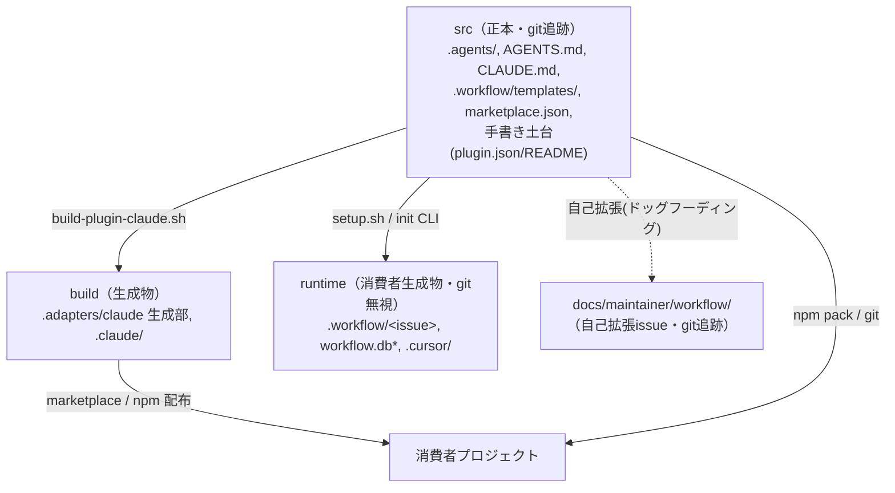
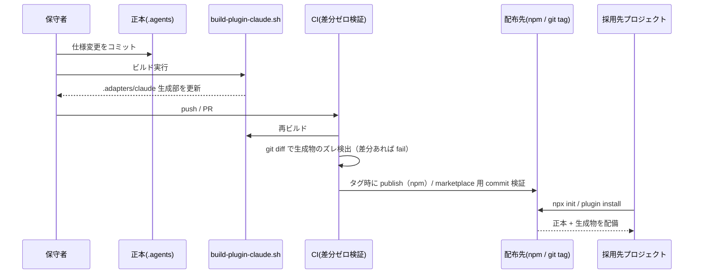

# 設計書: 配布とパッケージ構成の再設計

**プロジェクト名**: 配布とパッケージ構成の再設計（配布・インストール方式の決定と src/build/runtime 分離）
**作成日**: 2026 年 06 月 14 日
**最終更新**: 2026 年 06 月 14 日

> **重要**: **このドキュメントは常に更新**: 設計の変更や追加があった場合は、即座にこのドキュメントを更新してください。ドキュメントは「生きているドキュメント」として扱い、実装内容と常に同期させます。
>
> **用語**: [.agents/CONCEPTS.md §用語規約](../../../../.agents/CONCEPTS.md#用語規約) を参照。
>
> **本ドキュメントの事実/推測の区別**: 「事実」は実ファイル（`.gitignore`・`.agents/scripts/setup.sh`・`.agents/scripts/build-plugin-claude.sh`・`.claude-plugin/marketplace.json`・`.adapters/README.md`・`.agents/SETUP.md`・`.agents/platforms/SKILLS.md`・`.agents/ledger/schema.md`・`.agents/scripts/write-workflow-log.sh`・`.agents-project/自己拡張ワークフロー.md`）から裏取りした内容に【事実】を付す。設計者の判断・将来案には【判断】を付す。

---

## 1. 設計概要

### 1.1 設計方針

本パッケージは「AI 実行契約・ワークフロー仕様の**正本** `.agents/`」と「自己拡張する**開発ワークスペース**」の二役を兼ねる【事実: `.agents-project/自己拡張ワークフロー.md`】。本設計は、**正本（src）／生成物（build）／消費者ランタイム（runtime）の三分類を git の追跡境界として確立**し、その上で**配布チャネルを一本化（推奨: npm 主軸 + Claude marketplace 併設のハイブリッド）**することで、版管理・アップグレード・multi-tool 対応・自己拡張との整合を同時に満たす。

### 1.2 設計原則（本プロジェクトで適用するもの）

- **UNIX哲学**: 配布チャネルごとに別物を作るのではなく、**正本 1 か所 → ビルドで各ツール形へ派生**という既存方針（アダプタ方式【事実: `.adapters/README.md`】）を尊重し、各スクリプトは「1 つのことをうまくやる」状態に整える。
- **単一責務**: 「DB スキーマの正本」「配布対象の定義」「gitignore の追跡境界」をそれぞれ単一の正本に集約する（現状は 3 箇所重複・矛盾している）。
- **明確な境界**: **src / build / runtime** という 3 境界を新設し、git 追跡・コピー対象・配布対象の判断をこの境界に一元化する。
- **AIフレンドリー設計**: 設定の正本を 1 ファイルに寄せ、生成物と手書き正本を物理的に分離して、エージェント・保守者が「どれが正本か」を迷わない構造にする。

---

## 2. アーキテクチャ設計

### 2.1 責務・境界・参照関係

#### 2.1.1 責務一覧

| コンポーネント | 責務（1 文） |
| -------------- | ------------ |
| `.agents/`（正本/src） | ツール非依存の AI 実行契約・skills・commands・enforcement・ledger スキーマの単一正本を保持する。 |
| `setup.sh`（現状）／`init` CLI（案1） | 採用先プロジェクトへ正本を配備し、各ツール向け生成物と workflow.db を初期化する。 |
| `build-plugin-claude.sh`（build） | 正本 `.agents/` から Claude プラグイン生成部（skills/commands/agents/hooks/同梱.agents）を `.adapters/claude/` に生成する【事実】。 |
| `.adapters/claude` 手書き土台 | `plugin.json` と README のみを手書きで保持する（生成部とは別管理が必要）【事実: `build-plugin-claude.sh:16` が plugin.json の存在を前提】。 |
| `.claude-plugin/marketplace.json`（src） | 自己ホスト型 marketplace のエントリ。`source: "./.adapters/claude"` を指す【事実】。 |
| `workflow.db` スキーマ正本 | 証跡テーブル定義の単一正本（現状 3 箇所に重複）。 |
| `docs/maintainer/workflow/` | 自己拡張 issue（保守者の開発記録）を git 追跡で保持する【事実】。 |
| `.workflow/<issue>`・`workflow.db`（runtime） | 消費者ランタイム生成物。git 無視【事実: `.gitignore`】。 |

#### 2.1.2 境界

- **入力**: 正本 `.agents/`・手書き土台・テンプレート群。
- **出力**: 配布物（npm tarball / git でインストールされる plugin / cp 配備物）と、採用先で生成される各ツール設定（`.claude/`・`.cursor/`）。
- **他責務との境界**: 本 issue は **配布方式の決定・src/build/runtime 分類・gitignore 正本・欠陥3,4,5 の是正方針**までを範囲とする。実際のコード変更・npm publish 実務・CI ワークフロー YAML の実装は **03_実装計画.md 以降**の範囲とし、本設計書では行わない【判断】。

#### 2.1.3 参照関係

```
.agents/（正本/src）
  ├─→ build-plugin-claude.sh ─→ .adapters/claude/（build: 生成部）
  │                                   ↑ 手書き土台 plugin.json/README（src）を同居参照
  ├─→ setup.sh / init CLI ─────→ 採用先 .agents/, .claude/, .cursor/, workflow.db（runtime）
  └─→ ledger/schema.md（DBスキーマ正本）─→ setup.sh / write-workflow-log.sh が参照（あるべき姿）

.claude-plugin/marketplace.json（src）─→ ./.adapters/claude（build 生成物を指す）
```

- 循環参照は持たない。現状の問題は「**生成部（build）と手書き土台（src）が `.adapters/claude/` に物理的に混在**し、その親 `.adapters/` を gitignore したため土台まで巻き添えで無視された」こと【事実: §3.3 欠陥2 参照】。本設計でこの参照境界を物理分離する。

### 2.2 システムアーキテクチャ

- **採用パターン**: **正本 → ビルド派生（Single-Source-of-Truth + Adapter Generation）+ 三層 git 境界（src/build/runtime）**。
- **根拠**: 既存のアダプタ方式【事実: `.adapters/README.md`】と自己ホスト marketplace を壊さず、UNIX哲学・単一責務・明確な境界を満たす最小変更で配布の版管理問題を解く【判断】。

#### 2.2.1 CQRS（Command/Query 分離）

本プロジェクトは状態変更/取得を伴う業務システムではないため CQRS は適用しない【判断】。

#### 2.2.2 アーキテクチャ図（本プロジェクトの構成）



### 2.3 コンポーネント構成

**境界・単一責務**: 配布層（どのチャネルで届けるか）／生成層（build-plugin-claude.sh）／配備層（setup / init）／正本層（.agents）を分離する。本設計の中核変更は次の 2 点。

1. **手書き土台を生成物ディレクトリの巻き添えにしない物理分離**（§3.2-B / 欠陥2）。
2. **DB スキーマ正本の一元化**（§4 / 欠陥5）。

### 2.4 データフロー

本プロジェクトはイベント駆動アプリではないため、ドメインイベントは発行しない【判断】。代わりに「**配布フロー**」と「**ビルド差分検証フロー**」をデータフローとして定義する。



---

## 3. 機能設計

### 3.1 機能 1: 配布モデルの決定（比較と推奨）

#### 3.1.1 概要

現状、配布が **3 チャネル混在で中途半端**である【事実】。

- (a) `setup.sh` による **cp 配備**: git clone 後にコピー。版管理（semver）・アップグレード手段なし【事実: `README.md:48-55`, `setup.sh`】。
- (b) **Claude marketplace プラグイン**: `marketplace.json → source "./.adapters/claude"`。生成物を**コミット必須**【事実: `.adapters/README.md`「マーケットプレイス配布では生成物をコミットしておく必要がある」】。
- (c) **npm**: 未対応。`package.json` が存在しない【事実: リポジトリルートに `package.json` 無し】。

#### 3.1.2 配布モデル比較表

評価軸: 版管理/アップグレード/ピン留め・multi-tool 対応(Claude/Cursor/CI)・導入UX・生成物の扱い・実装コスト・自己拡張との相性。

| 軸 | 案1: npm + bin CLI | 案2: Claude marketplace 主軸 | 案3: 現状維持(clone + setup.sh) | ハイブリッド(npm 主軸 + marketplace 併設) |
| --- | --- | --- | --- | --- |
| **版管理/アップグレード/ピン留め** | ◎ semver・lockfile・`npm update`・`@x.y.z` でピン留め | △ git tag/ブランチ依存。ピン留めは tag 運用次第 | × バージョン概念なし。手動再 clone | ◎ npm 側で semver、Claude 利用者は tag |
| **multi-tool(Claude/Cursor/CI)** | ◎ CLI が全ツール分を配備（既存 setup の sync_skills を内包） | △ Claude のみ。Cursor/CI は別途 setup 必要 | ○ setup.sh が Claude+Cursor を配備 | ◎ npm CLI で全ツール、Claude は plugin でも可 |
| **導入UX** | ◎ `npx @scope/agents-md init` 一発 | ○ `/plugin install` だが Claude 内限定 | △ clone してパス指定で setup 実行 | ◎ 主要導線 npx、Claude ユーザーは慣れた plugin |
| **生成物の扱い** | ◎ 公開前に prepublish or CI 生成。リポに生成物を commit 不要にできる | × 生成物を**コミット必須**（リポが生成物で汚れる） | ○ 生成物は採用先でのみ生成 | △ npm は生成不要だが marketplace 用に生成物 commit が残る |
| **実装コスト** | 中（package.json・bin・prepublish・公開設定） | 低〜中（欠陥2 の物理分離 + CI 差分検証） | 最小（現状のまま） | 高（両方を維持） |
| **自己拡張との相性** | ◎ 開発時は repo の `.agents` をそのまま使える。配布は別物 | ○ 自己ホスト marketplace と相性可。ただし生成物 commit が自己拡張ノイズに | ○ 二役は成立するが版管理弱い | ◎ 開発=repo / 配布=npm を明快に分離 |

#### 3.1.3 各案の「正しいインストール手順」

> 以下、`@scope` はスコープ名（未決。§5 参照）。コマンド列は**設計上の到達目標**であり、現状リポでそのまま動くことの保証ではない【判断】。

**案1: npm + bin CLI**

```bash
# 採用先プロジェクトのルートで
npx @scope/agents-md init           # = 現 setup.sh 相当を CLI 内部実装に格上げ
# バージョン固定
npx @scope/agents-md@1.4.0 init
# アップグレード（devDependencies に入れた場合）
npm i -D @scope/agents-md@latest
npx agents-md init --upgrade         # 既存 .agents を退避して再配備
```

- `bin` エントリ（例 `agents-md`）→ CLI が現 setup.sh のロジック（正本コピー・skills 同期・workflow.db 初期化）を内包【判断: setup.sh を CLI 実装へ格上げ】。
- `.adapters` は**ビルド成果物**として `prepublish`（or CI）で生成し、npm tarball には含めるが**リポには commit しない**選択が可能【判断】。

**案2: Claude marketplace 主軸**

```bash
# Claude Code 内
/plugin marketplace add techbeansjp-free/AGENTS.md
/plugin install agents-package@agents-md          # 【事実: .adapters/README.md / marketplace.json と一致】
# ローカル試用
claude --plugin-dir .adapters/claude
# Cursor / CI は別途
bash .agents/scripts/setup.sh                      # Claude 以外のツール配備のため
```

- 前提: 欠陥2 の修正（手書き土台を巻き添えにしない）と、CI での生成物差分ゼロ検証が必須【判断】。

**案3: 現状維持（clone + setup.sh）**

```bash
git clone https://github.com/techbeansjp-free/AGENTS.md agents-package
bash agents-package/.agents/scripts/setup.sh        # 【事実: README.md:48-55】
```

**ハイブリッド（推奨）**: 案1 のコマンドを主導線、案2 のコマンドを Claude ユーザー向け副導線として両方ドキュメント化する。

### 3.2 機能 2: src / build / runtime の三分類と .gitignore 正本

#### 3.2.1 概要（A: 分類表）

| パス | 分類 | git 追跡 | 配布物に含む | 根拠 |
| --- | --- | --- | --- | --- |
| `.agents/` | **src** | 追跡 | 含む | 正本【事実: SETUP.md】 |
| `AGENTS.md` / `CLAUDE.md` | **src** | 追跡 | 含む | ルート契約【事実】 |
| `.workflow/templates/` | **src** | 追跡 | 含む | テンプレ正本【事実: `.gitignore` で templates のみ negation】 |
| `.claude-plugin/marketplace.json` | **src** | 追跡 | 含む（marketplace 利用時） | 自己ホスト marketplace エントリ【事実】 |
| `.adapters/claude/.claude-plugin/plugin.json`・`.adapters/README.md`（**手書き土台**） | **src** | **追跡すべき** | 含む | build-plugin が前提【事実: `build-plugin-claude.sh:16`】。現状 gitignore に巻き込まれている（欠陥2） |
| `.adapters/claude/`（生成部: skills/commands/agents/hooks/同梱.agents/GENERATED.md） | **build** | marketplace 採用時のみ追跡 / それ以外は無視 | 含む（生成して同梱） | 生成物【事実: `.adapters/README.md`】 |
| `.claude/`（hooks/skills） | **build** | 無視 | × | setup 生成【事実: `.gitignore` `/.claude/`】 |
| `.cursor/` | **runtime/build** | 無視（**現状 gitignore 漏れ**） | × | setup 生成（欠陥3）【事実: `setup.sh:120-134`、`.gitignore` に記載なし】 |
| `.workflow/<issue>` | **runtime** | 無視 | × | 消費者ランタイム【事実: `.gitignore` `/.workflow/*`】 |
| `workflow.db` / `-wal` / `-shm` | **runtime** | 無視 | × | 証跡 DB【事実: `.gitignore`、SETUP.md「配布物に含めない」】 |
| `docs/maintainer/workflow/<issue>` | **src(保守記録)** | 追跡 | × | 自己拡張 issue【事実: `自己拡張ワークフロー.md`】 |

#### 3.2.2 手書き土台を生成物の巻き添えにしない方法（B）

現状の欠陥（欠陥2）: `.gitignore` に `/.adapters/` を入れた結果、生成物だけでなく**手書きの `.adapters/README.md` と `.adapters/claude/.claude-plugin/plugin.json`** まで無視され、`build-plugin-claude.sh:16`（plugin.json 存在チェック）が新規 clone 環境で失敗する【事実】。同時に marketplace の `source: "./.adapters/claude"` も解決不能になる【事実】。

**対策候補（採否は §5 で確認、推奨は案 B-2）**:

- **B-1 negation パターン（最小変更）**: `.adapters/` を無視しつつ手書き土台のみ negation で復活させる。
  ```gitignore
  /.adapters/**
  !/.adapters/README.md
  !/.adapters/claude/
  !/.adapters/claude/.claude-plugin/
  !/.adapters/claude/.claude-plugin/plugin.json
  !/.adapters/claude/GENERATED.md   # 目印は手書き扱いにするなら
  ```
  - 長所: ディレクトリ移動が不要。短所: negation の階層指定が壊れやすく、生成部の commit 漏れ・誤 commit を起こしやすい【判断】。

- **B-2 手書き土台を `.adapters/` の外へ出す（推奨）【判断】**: 手書きの plugin.json・README を**正本側**（例 `.agents/platforms/claude/plugin.json`・`.adapters` 専用ソース置き場）に移し、`build-plugin-claude.sh` がビルド時に `.adapters/claude/.claude-plugin/plugin.json` へ**コピー生成**する。これにより `.adapters/` 配下は**全て生成物**となり、`.gitignore` は `/.adapters/` を単純に無視できる。marketplace 主軸を残す場合のみ、リリース時に `.adapters/claude` を commit（または別ブランチ/tag）する。
  - 長所: 「`.adapters/` = 100% 生成物」という単純不変条件が成立し、gitignore も build も単純化。短所: build スクリプトが土台コピーを担う変更が必要。

- **B-3 `.adapters` を完全に CI 生成物にする**: ローカルにもリポにも `.adapters` を置かず、npm prepublish / CI のみで生成。marketplace を使うなら CI が生成物を専用 tag/branch に push。
  - 長所: 正本リポが最もクリーン。短所: marketplace の「同一 repo を自己ホスト」体験【事実: `.adapters/README.md`】と相性が悪く、Claude ローカル試用前にビルドが必須。

> **推奨**: 案1/ハイブリッド採用時は **B-2** を基本とし、marketplace を残すなら**リリース時のみ生成部を commit**（CI で差分ゼロ検証）。marketplace を廃止するなら **B-3**【判断】。

#### 3.2.3 .gitignore 正本案（B-2 採用時）

```gitignore
# macOS
.DS_Store

# === runtime（消費者ランタイム生成物。正本ではない） ===
/.workflow/*
!/.workflow/.gitignore
!/.workflow/templates/
.workflow/workflow.db
.workflow/workflow.db-wal
.workflow/workflow.db-shm

# === build（各ツール向け生成物） ===
/.claude/
/.cursor/            # ← 欠陥3 是正: setup 生成の .cursor を無視
/.adapters/          # B-2 採用で .adapters は 100% 生成物。手書き土台は正本側に移設済み
```

> marketplace を残す（生成部を commit する）運用にする場合のみ、`/.adapters/` の無視を外し、代わりに「生成部は CI 差分検証つきで commit」というルールに切り替える【判断】。この二者択一は §5 の未決事項。

### 3.3 機能 3: 欠陥3,4,5 の是正方針（D）

| 欠陥 | 事実 | 是正方針【判断】 |
| --- | --- | --- |
| **3. `.cursor/` gitignore 漏れ** | `setup.sh:120-134` が `.cursor/` を生成するが `.gitignore` は `/.claude/`・`/.adapters/` のみで `.cursor/` を含まない【事実】 | `.gitignore` に `/.cursor/` を追加（§3.2.3）。 |
| **4. setup.sh が `.agents-project/` をリーク** | `setup.sh:64-66` が `.agents-project/` を採用先へコピー【事実】。一方 `SETUP.md` は「`.agents-project/` は setup では作成しない。プロジェクト側で用意する」と明記し**矛盾**【事実】。`.agents-project/` はリポ固有（自己拡張ルール等）でリークすると採用先を汚す。 | `setup.sh` の `.agents-project/` コピー処理（64-66 行）を**削除**し、SETUP.md の記述に一致させる。代替として「採用先は自前で `.agents-project/` を用意」へ誘導（SETUP.md 既述）。 |
| **5. workflow.db スキーマの 3 箇所重複** | スキーマが (i) `setup.sh` の `init_workflow_db` ヒアドキュメント、(ii) `write-workflow-log.sh:236+`、(iii) `.agents/ledger/schema.md` に重複し正本ズレリスク【事実: 3 箇所で `CREATE TABLE workflow_log` を確認】。write-workflow-log.sh:61 には「ledger/schema.md と同期する」とコメントあり【事実】。 | **正本を `.agents/ledger/schema.md` に一元化**。SQL 本体を 1 ファイル（例 `.agents/ledger/schema.sql`）に切り出し、`setup.sh` と `write-workflow-log.sh` は**それを読み込んで実行**する（インライン SQL を撤去）。当面の最小対応として「schema.md を唯一の編集対象とし、他 2 箇所は schema.md からの転記である旨を明記 + CI で SQL 文字列一致を検証」。**推奨は schema.sql 切り出し**【判断】。 |

---

## 4. データ設計

### 4.1 データモデル（workflow.db 証跡スキーマ — 正本の一元化対象）

本設計でスキーマ自体は**変更しない**。論点は「**どこを正本とするか**」のみ【判断】。現状の正本候補は 3 箇所【事実】。下表は現行 `workflow_log` テーブル（`.agents/ledger/schema.md` 準拠）。

#### テーブル一覧

| テーブル名 | 説明 | 主キー |
| --- | --- | --- |
| `workflow_log` | command 実行のチェーン型証跡（書記のみが追記） | `entry_id` |

#### テーブル詳細: `workflow_log`（抜粋・現行どおり）

| カラム名 | 型 | NULL | 説明 | 備考 |
| --- | --- | --- | --- | --- |
| entry_id | TEXT | NO | 証跡 ID | PK |
| parent_entry_id | TEXT | YES | 親証跡（チェーン） | |
| document_id | TEXT | YES | 紐づくドキュメント ID | |
| ts_utc / created_at | TEXT | NO | タイムスタンプ | |
| actor_role | TEXT | NO | 実行主体 | CHECK = 'scribe' |
| delegated_by_role | TEXT | NO | 委譲元 | CHECK = 'orchestrator' |
| command | TEXT | NO | 実行 command | CHECK in (6 値) |
| issue_id / review_id / issue_path / review_path / document_path | TEXT | YES | 参照 | |
| changed_files_json | TEXT | YES | 変更ファイル（implement で必須） | |
| summary | TEXT | NO | 要約 | length > 5 |
| dod_met | INTEGER | NO | DoD 充足 | 0/1 |
| prev_hash / entry_hash | TEXT | -/NO | 改ざん検知 | |

> **設計上の指示**: 上記スキーマの**唯一の編集対象**を `.agents/ledger/schema.md`（または切り出した `schema.sql`）とし、`setup.sh` / `write-workflow-log.sh` は参照側に徹する。具体的実装は 03_実装計画.md。

### 4.2 データ構造（配布アーティファクトの構成）

- **npm tarball（案1）**: `.agents/`・`AGENTS.md`・`CLAUDE.md`・`.workflow/templates/`・bin・（prepublish で生成した）`.adapters/`。`workflow.db`・`.workflow/<issue>`・`docs/maintainer/` は **`.npmignore` / `files` で除外**【判断】。
- **marketplace（案2）**: `.claude-plugin/marketplace.json` + commit 済み `.adapters/claude` 生成部【事実】。

---

## 5. 推奨案と未決事項（E）

### 5.1 推奨案

**ハイブリッド: npm 主軸（案1）+ Claude marketplace 併設（案2）+ src/build/runtime 三分類 + 手書き土台の外出し（B-2）**【判断】。

- 主導線 `npx @scope/agents-md init`（semver・lockfile・`npm update`）で版管理とアップグレードの欠陥を解消。
- Claude ユーザー向けに marketplace を残す場合は、**B-2 で `.adapters` を 100% 生成物化**し、リリース時のみ生成部を commit（CI 差分ゼロ検証）。残さないなら B-3 + `.adapters` 完全無視で最もクリーン。
- 同時に欠陥3（`.cursor` 無視追加）・欠陥4（`setup.sh` の `.agents-project` コピー削除）・欠陥5（schema 正本一元化）を是正。

### 5.2 ユーザーに確認すべき未決事項

1. **npm スコープ名と公開先**: `@scope` を何にするか。公開範囲は **public（npmjs）/ private / GitHub Packages** のいずれか。
2. **Claude marketplace を残すか**: 残す＝生成物 commit + CI 差分検証（B-2 ハイブリッド）。やめる＝`.adapters` 完全生成物化（B-3）で最小構成。
3. **Cursor / CI を正式サポート対象とするか**: setup は既に `.cursor/` を生成する【事実】が、ドキュメント上の正式サポート（テスト・配備保証）に含めるか。
4. **`.adapters` 手書き土台の移設可否**（B-2）: plugin.json/README を正本側へ移し build がコピー生成する変更を許容するか。
5. **DB スキーマ正本の形式**: `schema.md` 内 SQL を唯一正本にするか、`schema.sql` を切り出して両スクリプトが読み込む方式にするか。
6. **`setup.sh` の CLI 格上げ範囲**: bin CLI を新規実装するか、当面 setup.sh を npm `bin` から呼ぶラッパーに留めるか。

---

## 6. テスト戦略

テスト戦略の**観点の定義**は [RULES.md のテスト戦略必須要件](../../../../.agents/RULES.md#テスト戦略必須要件) を参照。本ドキュメントでは対象ごとの割当のみ記載する。

### 6.1 対象ごとのテスト割り当て

| 対象 | 単体 | 結合/API | E2E | クリティカル観点 | バリデーション観点 | 未達理由/補足 |
| --- | --- | --- | --- | --- | --- | --- |
| `build-plugin-claude.sh`（B-2 後） | × | ○ | × | クリーン clone から build が成功し plugin.json が生成される | 手書き土台が正本側に存在すること | スクリプト E2E |
| `.gitignore` 正本 | × | ○ | × | `.cursor`/runtime/生成物が無視・src は追跡される | `git status` / `git check-ignore` で検証 | |
| `setup.sh`（欠陥4 後） | × | ○ | ○ | 採用先に `.agents-project` がコピーされない | SETUP.md 記述と一致 | |
| workflow.db スキーマ一元化 | ○ | ○ | × | 3 経路（setup/write/schema）で同一スキーマ | SQL 文字列一致を CI 検証 | |
| npm init（案1） | × | ○ | ○ | `npx ... init` で正本配備・workflow.db 初期化 | tarball に runtime/保守物が含まれない | publish 設定後 |

### 6.2 監査・レビューでの確認（証跡）

§6.1 の割当表と 03_実装計画のタスク別テスト観点・BDD が揃っていることを確認する。特に「クリーン clone → build → 差分ゼロ」を CI で検証することを必須とする【判断】。

---

## 7. UI 設計

CLI/設定ファイル中心のため GUI 画面はなし。導入 UX は §3.1.3 のコマンド列で代替する。

---

## 8. セキュリティ設計

### 8.1 認証・認可

該当なし（公開/プライベート配布先の選定は §5.2-1 の運用判断）。

### 8.2 データ保護

`workflow.db`（証跡）は**配布物に含めない**【事実: SETUP.md】。npm/marketplace いずれの配布物にも runtime（`.workflow/<issue>`・DB）と保守物（`docs/maintainer/`）を含めないことを `files`/`.npmignore` で保証する【判断】。

---

## 9. 非機能要件への対応

### 9.1 パフォーマンス

ビルド・配布は人手起動・CI 起動の範囲で十分。性能要件は重要でない【判断】。

### 9.2 可用性

npm レジストリ障害時は git（案3 相当）でのフォールバック導線を残すことで可用性を確保する【判断】。

---

## 10. 参考資料

### プロジェクトドキュメント

- [`00_要求定義.md`](./00_要求定義.md) - 要求定義（存在する場合）
- [`01_要件定義.md`](./01_要件定義.md) - 要件定義（存在する場合）

### その他の参考資料（実ファイル・裏取り元）

- `.gitignore`（追跡境界の現状）
- `.agents/scripts/setup.sh`（配備・DB 初期化・`.agents-project` コピー: 64-66 行、`.cursor` 生成: 120-134 行）
- `.agents/scripts/build-plugin-claude.sh`（生成・16 行の plugin.json 前提）
- `.claude-plugin/marketplace.json`（`source: "./.adapters/claude"`）
- `.adapters/README.md`（アダプタ方式・marketplace 生成物 commit 必須）
- `.agents/SETUP.md`（コピー対象・`.agents-project` を setup で作らない方針）
- `.agents/platforms/SKILLS.md`（multi-tool 配置パス）
- `.agents/ledger/schema.md` / `.agents/scripts/write-workflow-log.sh`（DB スキーマ重複）
- `.agents-project/自己拡張ワークフロー.md`・`docs/maintainer/workflow/README.md`（自己拡張の名前空間分離）

---

## 11. 前のステップ

- **前**: [`01_要件定義.md`](./01_要件定義.md) - 要件定義フェーズ（作成時）

## 12. 次のステップ

- **次**: [`03_実装計画.md`](./03_実装計画.md) - 実装計画フェーズ。本設計の §5.2 未決事項の確定後に、欠陥2-5 是正と配布チャネル実装のタスク分解を行う。
