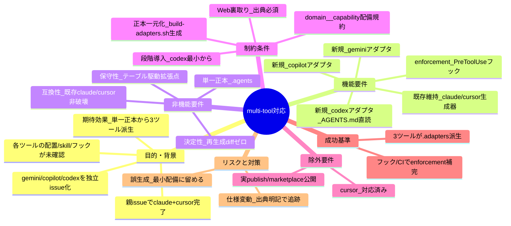
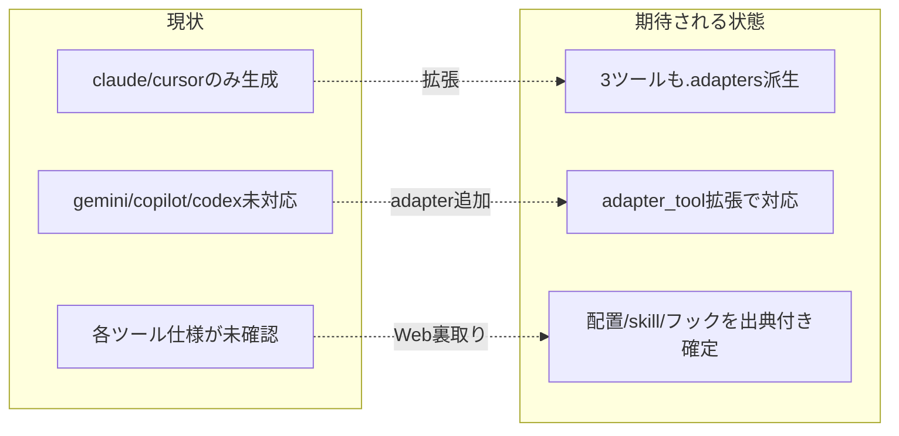

# 要求定義書: multi-tool 対応（gemini / copilot / codex）

**プロジェクト名**: multi-tool 対応（gemini / copilot / codex）
**作成日**: 2026 年 06 月 14 日
**最終更新**: 2026 年 06 月 14 日

> **重要**:
>
> - 要求定義書は、プロジェクトの全体像を把握するためのものです。詳細な技術仕様や実装方法は要件定義書以降で記載します。必要最低限の情報に収めることを心掛けてください。
> - **このドキュメントは常に更新**: 要求の変更や追加があった場合は、即座にこのドキュメントを更新してください。
> - **必須項目**: 「必須」と明記した項目は空欄・抽象語のみで提出しないこと。
>
> **用語**: [.agents/CONCEPTS.md §用語規約](../../../../.agents/CONCEPTS.md#用語規約) を参照。
>
> **事実/判断/要確認の区別**: Web 調査で確証を得た事項は【事実＋出典URL】、本書の設計判断は【判断】、確証が取れない事項は【要確認】で示す。

---

## 要求定義の全体像

**注意**: マインドマップは全体像把握用。主要セクション名程度に留める。

---

## 1. 目的・背景

### 1.1 目的（必須）

正本 `.agents/` から gemini/copilot/codex 向けアダプタを生成し配布可能にする。

### 1.2 背景

- **現状の課題**:
  - 親 issue「配布とパッケージ構成の再設計」で claude+cursor の配布/プラグイン化は完了したが、gemini/copilot/codex の multi-tool 対応は未実装【事実: 親 03_実装計画 §2.4 タスク4「フェーズ3 multi-tool 段階導入」】。
  - `build-adapters.sh` は `SUPPORTED_TOOLS="claude cursor"` のみ対応で、gemini/copilot/codex は「配置パス確認待ちのため未実装」とコメントされている【事実: `.agents/scripts/build-adapters.sh:9,20`】。
  - 各ツールの「設定/指示ファイルの配置パス・skill 相当機構・フック（runtime reject）有無」が親 issue 時点で未確認（【要確認】として残存）【事実: 親 03 §9 未決#3〜#5】。
- **必要性**:
  - 親 issue は「`.adapters/` は 100% 生成物」「単一正本 `.agents/`」という不変条件を確立済みで、`build-adapters.sh` に `SUPPORTED_TOOLS` 追加＋`adapter_<tool>()` 新設という拡張点が用意されている【事実: `build-adapters.sh:19,103-204`】。この拡張点を活かし multi-tool を実体化する必要がある。
  - 各ツールの仕様を裏取りしないまま実装すると、誤った生成物を配るリスクがある【事実: 親 03 §7 リスク】。本 issue の核心は Web 調査による事実確定である。

#### Web 調査で確定した主要事実（各ツールの配置/skill/フック）

| ツール | 指示/コンテキストファイル（配置） | AGENTS.md ネイティブ参照 | skill 相当機構 | フック（runtime reject） |
|--------|-----------------------------------|--------------------------|----------------|--------------------------|
| **gemini**（Gemini CLI） | `GEMINI.md`（階層: `~/.gemini/GEMINI.md` グローバル → プロジェクトroot `./GEMINI.md` → サブディレクトリ）。連結して system prompt 化【事実1】 | **設定で可能**: `settings.json` の `context.fileName` に `["AGENTS.md", ...]` を指定すると AGENTS.md を文脈ファイルとして読む（デフォルトは GEMINI.md）【事実2】 | **カスタムコマンド**: TOML 形式、`.gemini/commands/<name>.toml`（プロジェクト）/ `~/.gemini/commands/`（グローバル）。サブディレクトリで `/git:commit` 形式の名前空間。Agent Skills(SKILL.md) 形式ではない【事実3】 | **あり**: `PreToolUse` フックが Bash/FileEdit 等の前に実行され、exit code 2 で **tool 実行をブロック**可能【事実4】 |
| **copilot**（GitHub Copilot） | `.github/copilot-instructions.md`（リポジトリ全体）＋ `.github/instructions/**/*.instructions.md`（パス別・YAML frontmatter で適用範囲指定）【事実5】 | **ネイティブに読む**: 2025-08 以降、coding agent がリポルート `AGENTS.md`（ネスト可）をネイティブサポート。`copilot-instructions.md`/`.instructions.md`/`CLAUDE.md`/`GEMINI.md` と併存【事実6】 | `.instructions.md`（パス別指示・frontmatter `applyTo`）/ prompt ファイル。Agent Skills(SKILL.md) 形式ではない【事実5】 | **あり**: `preToolUse` フックが tool 実行を **approve/deny** 可能。配置は リポジトリ `.github/hooks/*.json`、個人(CLI)は `~/.copilot/hooks/*.json`。Copilot CLI と cloud agent の双方で対応【事実7】 |
| **codex**（OpenAI Codex CLI） | `AGENTS.md` を**直接読む**（＋`AGENTS.override.md`、フォールバック名 `project_doc_fallback_filenames`）。階層: グローバル `~/.codex/AGENTS.md` → Git root から作業ディレクトリへ各階層 1 ファイルをマージ（近いものが優先）。上限 `project_doc_max_bytes`=32 KiB【事実8】 | **ネイティブに読む**（上記の通りリポルート `AGENTS.md` が正本）【事実8】 | slash commands / prompt をサポート（Agent Skills 形式の skill とは別系）【事実8・要確認: skill 厳密対応は未確証】 | **あり**: `PreToolUse` フックが Bash/`apply_patch`/MCP tool 呼び出しを intercept し、`permissionDecision: "deny"` または exit code 2 で **拒否**可能。配置は `~/.codex/hooks.json` / `config.toml [hooks]`、プロジェクト `<repo>/.codex/hooks.json` / `config.toml`（trust 必要）【事実9】 |

**重要な発見（親 issue の前提の更新）**:

- 親 03 §2.4 は「codex はフック不在ゆえ enforcement は CI 側で補完」「フック非対応ツールは CI（audit）で enforce」を前提としていた【事実: 親 03 §2.4 P2・(共通)】。しかし **Web 調査の結果、gemini / copilot / codex のいずれも `PreToolUse` 相当フックで runtime reject（tool 実行拒否）が可能**であることが判明した【事実4・事実7・事実9】。CI audit による補完は依然「フォールバック／二重化」として有効だが、「フック非対応ゆえ CI のみ」という前提は本 issue では**修正**する。
- **codex は AGENTS.md をネイティブに直読**するため、最小サポート（AGENTS.md 配備のみ）が最も自然【事実8】。これは親方針（codex は AGENTS.md 直読の最小サポートから）と整合する【事実: 親 03 §2.4 P2】。
- gemini は GEMINI.md がデフォルトだが、`context.fileName` 設定で AGENTS.md を読ませられる。本パッケージの正本 `AGENTS.md` を活かす配備が可能【事実2】。

**出典**:

- 【事実1】Provide Context with GEMINI.md Files — https://google-gemini.github.io/gemini-cli/docs/cli/gemini-md.html
- 【事実2】Gemini CLI Configuration（`context.fileName`） — https://github.com/google-gemini/gemini-cli/blob/bb5534b0d8409b86ac14dcd673e5af0ba2d85e98/docs/cli/configuration.md
- 【事実3】Custom Commands（TOML / `.gemini/commands/`） — https://google-gemini.github.io/gemini-cli/docs/cli/custom-commands.html
- 【事実4】Tailor Gemini CLI with hooks（PreToolUse / exit 2 block） — https://developers.googleblog.com/tailor-gemini-cli-to-your-workflow-with-hooks/ ／ https://geminicli.com/docs/hooks/reference/
- 【事実5】Adding repository custom instructions for GitHub Copilot（`.github/copilot-instructions.md`・`.instructions.md`） — https://docs.github.com/copilot/customizing-copilot/adding-custom-instructions-for-github-copilot
- 【事実6】Copilot coding agent now supports AGENTS.md — https://github.blog/changelog/2025-08-28-copilot-coding-agent-now-supports-agents-md-custom-instructions/
- 【事実7】About hooks for GitHub Copilot（`preToolUse` deny・`.github/hooks/*.json`） — https://docs.github.com/en/copilot/concepts/agents/hooks
- 【事実8】Custom instructions with AGENTS.md（Codex・直読・階層・32 KiB） — https://developers.openai.com/codex/guides/agents-md
- 【事実9】Hooks – Codex（`PreToolUse` deny・`.codex/hooks.json`/`config.toml [hooks]`） — https://developers.openai.com/codex/hooks
- AGENTS.md 規格 — https://agents.md/

### 1.3 期待される効果（必須: 1 件以上）

- **効果 1**: 単一正本 `.agents/`（および `AGENTS.md`）から gemini/copilot/codex 向けアダプタが生成され、`.adapters/<tool>/` 配下に派生物が出力されることが○/×で判定できる（`build-adapters.sh <tool>` の出力存在で確認）。
- **効果 2**: 各ツールの enforcement（規約違反の検出・拒否）が、フック（PreToolUse）または CI audit のいずれかで担保される経路が定義される。
- **効果 3**: 各ツールの「配置パス・skill 機構・フック有無」が出典付きで確定し、以後の実装が推測でなく事実に基づける（本書 §1.2 の表）。

**現状と期待される状態の比較**:

---

## 2. 機能要件

### 2.1 既存機能の維持（該当する場合）

- claude / cursor の既存アダプタ生成（`adapter_claude` / `adapter_cursor`）と、その出力（`.adapters/claude/`・`.adapters/cursor/`）を**破壊しない**【事実: `build-adapters.sh:108-204`】。
- 配備ロジックの単一正本（`{domain}__{capability}` 命名、共有ライブラリ `lib/deploy-skills.sh`）を維持する【事実: `build-adapters.sh:27,35-40`、`.agents/platforms/SKILLS.md`】。

### 2.2 新規機能要件

- **codex アダプタ（最小・AGENTS.md 直読）**: `adapter_codex()` を新設し `SUPPORTED_TOOLS` に登録。codex は AGENTS.md をネイティブ直読するため、専用生成物は最小（または無し）とし、`AGENTS.md`（および同梱 `.agents/`）の配備を主とする【事実8】。
- **gemini アダプタ**: `adapter_gemini()` を新設。`GEMINI.md` 配置または `context.fileName` での AGENTS.md 参照、カスタムコマンド（`.gemini/commands/*.toml`）を確認のうえ生成部を追加【事実1・事実2・事実3】。
- **copilot アダプタ**: `adapter_copilot()` を新設。`.github/copilot-instructions.md`（または AGENTS.md ネイティブ参照）と `.instructions.md` を確認のうえ生成部を追加【事実5・事実6】。
- **enforcement 補完**: 各ツールの `PreToolUse` 相当フックで runtime reject を構成し（gemini/copilot/codex すべて対応【事実4・事実7・事実9】）、フックを使わない/使えない経路では CI（audit）で規約違反を検出する二重化を用意する。
- **段階導入**: codex（AGENTS.md 直読・最小）→ gemini → copilot の順で配備対象を段階追加する【判断・親 03 §2.4 順序を踏襲（cursor は対応済みのため対象外）】。

> 詳細な生成物の構造・skill/フックの具体配備は本 issue の後続フェーズ（02_設計・03_実装計画）に委ねる。本書は「何を満たすか」に集中する。

---

## 3. 非機能要件

### 3.1 パフォーマンス

- ビルドは決定的（同一正本から再生成すると差分ゼロ）であること【事実: 親 03 §フェーズ2「再生成 diff ゼロ」、`docs/maintainer/adapters.md` リリースフロー】。

### 3.2 セキュリティ

- フック（PreToolUse）による runtime reject は、ツールの公式仕様（exit code 2 / `permissionDecision: deny`）に従って構成する【事実4・事実7・事実9】。
- 各ツールのフックは trust/配置規約（例: codex はプロジェクト `.codex/` の trust が必要）に従う【事実9】。

### 3.3 互換性

- 既存の claude / cursor 生成を非破壊で維持する（§2.1）。
- 各ツールが `AGENTS.md` 標準（agents.md 規格）をネイティブ参照する範囲を尊重する: codex/copilot は直読、gemini は設定で参照可【事実2・事実6・事実8】。

### 3.4 保守性

- 拡張は `SUPPORTED_TOOLS` 追加＋`adapter_<tool>()` 新設のテーブル駆動に限定し、配備ロジックを二重定義しない【事実: `build-adapters.sh:19,27`】。
- 各ツールの要確認事実は出典 URL を本書に残し、仕様変動を追跡可能にする。

---

## 4. 制約条件

### 4.1 技術的制約

- 正本は `.agents/`（および `AGENTS.md`）の 1 か所。アダプタ生成物（`.adapters/<tool>/`）は 100% 生成物で手編集しない【事実: `docs/maintainer/adapters.md`、`.agents/scripts/build-adapters.sh:6-8`】。
- skill 配備は `{domain}__{capability}` 命名規約に従う【事実: `.agents/platforms/SKILLS.md`、`build-adapters.sh:8`】。ただし gemini/copilot は Agent Skills(SKILL.md) 形式の skill 機構を持たず TOML/`.instructions.md` 形式のため、skill 相当の配備は本 issue の設計で別途定義する【事実3・事実5】。

### 4.2 既存システムとの互換性

- 親 issue の不変条件（「`.adapters/` は 100% 生成物」「DB スキーマ正本単一」）に依存・整合する【事実: 親 03 §2 概要】。

### 4.3 移行期間・スケジュール

- 段階導入（codex 最小 → gemini → copilot）。各ツールは個別フェーズ／個別 issue 化が有力【判断・親 03 §6 補足】。

---

## 5. 除外要件

- **cursor**: 親 issue で対応済みのため本 issue の対象外。
- **claude**: 親 issue で対応済み。
- **実 publish / marketplace 公開**: npm スコープ・レジストリ未確定のため対象外（親 issue 側の未決事項）【事実: 親 03 §9 未決#1】。
- skill 形式の全面統一（Agent Skills 形式への各ツール対応強制）は対象外。各ツールのネイティブ機構（TOML/`.instructions.md`）を尊重する。

---

## 6. 成功基準（必須: 1 件以上）

- **SC-01**: `build-adapters.sh codex`（および gemini/copilot）が成功し、`.adapters/codex/` 等に正本由来の生成物が出力される（○/×: 出力ディレクトリと AGENTS.md/.agents 同梱の存在で判定）。
- **SC-02**: codex 有効化時、AGENTS.md（＋同梱 `.agents/`）が配備され、不要な専用生成物が作られない（最小配備）【事実8】（○/×: 生成物一覧を確認）。
- **SC-03**: gemini/copilot/codex の各 enforcement が、PreToolUse フックまたは CI audit のいずれかで担保される経路が設計に存在する（○/×: 02/03 にフックまたは audit の配備記述があるか）。
- **SC-04**: claude+cursor+codex（最小 3 系統）が同一正本 `.agents/` から派生し、claude/cursor の既存出力が回帰差分なし（○/×: 既存 claude/cursor の再生成 diff ゼロ）。
- **SC-05**: 各ツールの配置/skill/フックが出典付きで本書に記載され、未確証は【要確認】で明示されている（○/×: 本書 §1.2 の表と出典リスト）。

---

## 7. リスクと対策

### 7.1 技術的リスク

- **リスク**: 各ツール（gemini/copilot/codex）の仕様（配置パス・skill 機構・フック挙動）が今後変動し、誤った生成物を配る。
  - **対策**: 本書 §1.2 に出典 URL を残し、確証が取れない項目は【要確認】に留め、未確証間は最小配備に限定する【判断・親 03 §7 対策を踏襲】。
- **リスク**: gemini/copilot は Agent Skills(SKILL.md) 形式の skill 機構を持たず、既存の `deploy_skills`（`{domain}__{capability}`）がそのまま使えない。
  - **対策**: skill 相当の配備（TOML カスタムコマンド／`.instructions.md`）への変換方針を 02_設計 で定義する。本書では「skill 形式は各ツールのネイティブ機構を尊重」と制約化（§4.1・§5）。

### 7.2 スケジュールリスク

- **リスク**: 3 ツール同時実装で影響範囲が広がる。
  - **対策**: 段階導入（codex 最小 → gemini → copilot）とし、各ツールを個別フェーズ／個別 issue 化する【判断・親 03 §6】。

---

## 8. 参考資料

### プロジェクトドキュメント

- 親 issue: [`docs/maintainer/workflow/20260614_124435_配布とパッケージ構成の再設計/`](../20260614_124435_配布とパッケージ構成の再設計/) — 02_設計 §3.1/§5・03_実装計画 §2.4 タスク4・§9 未決#3〜#5。
- [`.agents/scripts/build-adapters.sh`](../../../../.agents/scripts/build-adapters.sh) — `SUPPORTED_TOOLS`・`adapter_<tool>()` 拡張点。
- [`.agents/platforms/SKILLS.md`](../../../../.agents/platforms/SKILLS.md) — プラットフォーム別スキル配置。
- [`docs/maintainer/adapters.md`](../../adapters.md) — アダプタ方式の保守者向け解説。

### その他の参考資料（Web 出典）

- §1.2 出典リスト（事実1〜9・agents.md 規格）を参照。

---

## 9. 次のステップ

この要求定義書の承認後、以下のドキュメントを作成します：

- **次**: [`01_要件定義.md`](./01_要件定義.md) - 要件定義フェーズ
</content>
</invoke>
