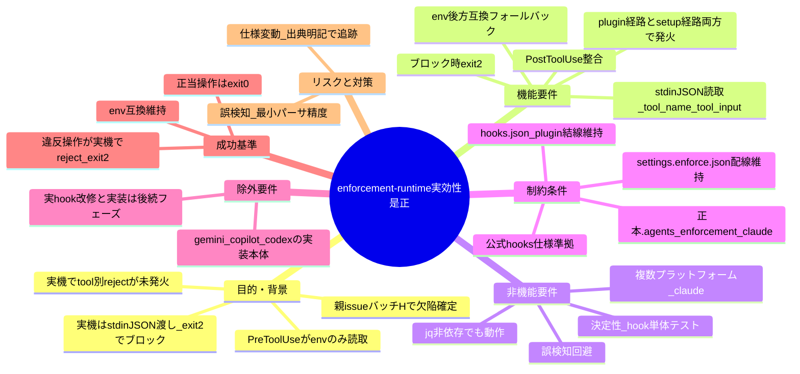
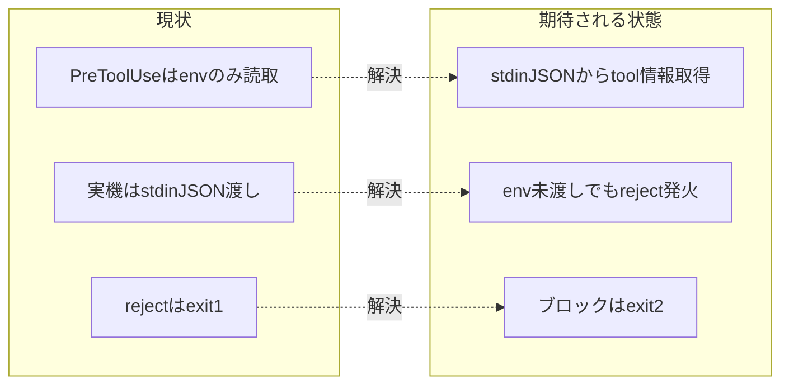

# 要求定義書: enforcement runtime 実効性の是正（PreToolUse/PostToolUse の stdin JSON 対応・exit 2 ブロック）

**プロジェクト名**: enforcement runtime 実効性の是正
**作成日**: 2026 年 06 月 14 日
**最終更新**: 2026 年 06 月 14 日

> **重要**:
>
> - 要求定義書は、プロジェクトの全体像を把握するためのものです。詳細な技術仕様や実装方法は要件定義書以降で記載します。必要最低限の情報に収めることを心掛けてください。
> - **このドキュメントは常に更新**: 要求の変更や追加があった場合は、即座にこのドキュメントを更新してください。ドキュメントは「生きているドキュメント」として扱い、実装内容と常に同期させます。
> - **必須項目**: 以下の「必須」と明記した項目は判定可能な形（目的は1文・成功基準は○/×で判定できる記載等）で記入する。
>
> **事実/判断/要確認の区別**: 実コード確認で確証を得た事項は【existing_code】、公式仕様で確証を得た事項は【external_spec】、本書の設計判断は【判断】、確証が取れない事項は【要確認】で示す。
>
> **用語**: [.agents/CONCEPTS.md §用語規約](../../../../.agents/CONCEPTS.md#用語規約) を参照。

---

## 要求定義の全体像

**注意**:

- マインドマップは全体像把握用であり、詳細は本文各セクションに記載する。

---

## 1. 目的・背景

### 1.1 目的（必須）

enforcement 有効時に規約違反のツール操作が実機の Claude Code で実際に reject されるようにする。

### 1.2 背景

- **現状の課題**:
  - 親 issue（`docs/maintainer/workflow/20260614_124435_配布とパッケージ構成の再設計/`）のフェーズ5で enforcement を opt-in 配線したが、verify-and-close（バッチH、04_review.md §H-6）で **runtime enforcement の実効性欠陥**が判明した。
  - `.agents/enforcement/claude/PreToolUse.sh` はツール情報（ツール名・対象パス・コマンド）を**環境変数のみ**（`CLAUDE_TOOL_NAME:-TOOL_NAME`、`CLAUDE_FILE_PATH:-FILE_PATH`、`CLAUDE_COMMAND:-COMMAND`）から取得し、reject 分岐をすべて `[[ -n "$TOOL" ]]`（L33）・`[[ -n "$CMD" ]]`（L67・L104）で gate している。stdin を一切読まない【existing_code: PreToolUse.sh L14-17, L33, L67, L104】。
  - 実 Claude Code の PreToolUse フックは `tool_name`/`tool_input` を **stdin の JSON** で渡し、`CLAUDE_TOOL_NAME` 等の env は存在しない（実在 env は `CLAUDE_PROJECT_DIR`）。ブロック用の終了コードは **2**（現状の reject は `exit 1`）【external_spec: Claude Code hooks 公式仕様 code.claude.com/docs/en/hooks（親 issue 04_review §H-6 で独立確認済み）】。
  - 配線（`settings.enforce.json` / plugin `hooks.json`）は hook command に `AGENTS_ROOT` と `AGENT_ROLE` のみを export し、`CLAUDE_TOOL_NAME`/`FILE_PATH`/`COMMAND` を渡さない【existing_code: settings.enforce.json、build-adapters.sh の hooks.json 生成】。

- **必要性**:
  - 帰結として、実機では `TOOL`/`CMD` が空のままになり、orchestrator の Write/Edit 拒否・Bash 制限・sqlite3 直接実行禁止・`.workflow` 編集禁止等の**ツール別 runtime reject が発火しない**。実機で効くのは `AGENT_ROLE=orchestrator` の env 供給と常時案内のみで、CI/audit が事後検知の主役となっている。
  - 「物理的に違反経路を塞ぐ」という enforcement の設計意図（CORE §禁止事項・絶対強制）と実機挙動の乖離を解消する必要がある。

### 1.3 期待される効果（必須: 1 件以上）

- **効果 1**: 違反ツール操作（orchestrator の直接 Write/Edit、保護パス書込み、sqlite3 直接実行、複合シェル等）が実機の Claude Code で実際に reject される（exit 2 で blocked になる）（○/×判定: hook 単体テストで違反 JSON 入力時に exit 2 を返す）。
- **効果 2**: 正当なツール操作（許可ツール・write-workflow-log.sh 単独実行等）は引き続き許可される（○/×判定: 正当 JSON 入力時に exit 0 を返す）。
- **効果 3**: 設計意図（runtime reject）と実機挙動が一致し、enforcement の「過信防止注記」を不要化できる（○/×判定: SETUP/README の実効範囲注記を更新できる）。

**現状と期待される状態の比較**:

---

## 2. 機能要件

### 2.1 既存機能の維持（該当する場合）

- 既存の env ベース挙動（`CLAUDE_TOOL_NAME`/`TOOL_NAME` 等が渡された場合の reject）は**後方互換フォールバック**として維持する。
- `AGENT_ROLE=orchestrator` の env 供給と常時案内（CORE/LOAD_POLICY/PHASES 読了・委譲・書記の注意喚起）は維持する。
- 既存の reject 種別（`.workflow` 直接編集禁止、orchestrator allowlist、Bash 制限、複合シェル禁止、write-workflow-log.sh 単独実行のみ、sqlite3 直接実行禁止）の判定内容は維持する。

### 2.2 新規機能要件

- **stdin JSON 読取**: PreToolUse.sh が stdin の JSON から `tool_name`・`tool_input.command`・`tool_input.file_path` 等を取得する（jq があれば jq、無ければ最小パーサ/フォールバック）。
- **exit 2 ブロック**: 違反検出時に公式仕様に従い **exit 2** を返す（現状の exit 1 を是正）。
- **PostToolUse 整合**: PostToolUse.sh も stdin JSON 渡しの実機契約に整合させる（案内主体だが入力契約を揃える）。
- **両経路発火**: plugin 経由（`hooks.json` の `${CLAUDE_PLUGIN_ROOT}` 結線）と setup 経由（`.claude/hooks/` ＋ `settings.enforce.json`）の両方で発火する。

---

## 3. 非機能要件

### 3.1 パフォーマンス

- hook はツール実行のたびに同期的に走るため、stdin 読取・パースは軽量に保つ（jq 1 回または最小 sed/grep フォールバックで完結する）。

### 3.2 セキュリティ

- 違反経路を物理的に塞ぐ（fail-closed が望ましいが、フック自体の異常で全ツールを停止しない fail-safe との両立を設計フェーズで判断する）。
- 保護パス（`.workflow/`）への直接書込み・sqlite3 直接実行・orchestrator の write/edit/shell を確実に拒否する。

### 3.3 互換性

- **jq 非依存でも動く**こと（jq があれば jq、無ければ最小パーサ/フォールバック）。
- 既存の env ベース挙動を**後方互換フォールバック**として残し、env が渡る環境でも従来どおり reject する。
- 複数プラットフォーム（現状 claude）対応。plugin/setup 両経路で同一フックを呼ぶ構成を壊さない。

### 3.4 保守性

- 入力取得（stdin/env）を 1 箇所に集約し、reject 判定ロジックと分離する（責務分離）。
- hook 単体テストを追加し、違反/正当ケースの exit code を決定的に検証できるようにする。

---

## 4. 制約条件

### 4.1 技術的制約

- 正本は `.agents/enforcement/claude/PreToolUse.sh`・`PostToolUse.sh`。setup が `.claude/hooks/` へ配備し、build-adapters.sh が plugin の `hooks.json` を `${CLAUDE_PLUGIN_ROOT}/.agents/enforcement/claude/` 結線で生成する。両経路の参照先を壊さない。
- 公式 hooks 仕様（stdin JSON で `tool_name`/`tool_input`、ブロック exit code 2）に準拠する【external_spec】。
- `AGENT_ROLE` の供給（`settings.enforce.json` の env、plugin hooks.json）は維持する。

### 4.2 既存システムとの互換性

- `settings.enforce.json`（バッチHで新設した配線テンプレート）と plugin `hooks.json` の生成（build-adapters.sh）に整合させる。配線の着脱機構（`bin/agents-md.js` の enforce on/off/status）を壊さない。
- 既存 E2E（`.agents/scripts/test/e2e-install-uninstall.sh` の S1-S7・R1-R7）を壊さない。

### 4.3 移行期間・スケジュール

- 本 issue のスコープは **00/01 のみ**（要求・要件）。実 hook 改修・テストは後続フェーズ（02 設計・03 実装計画・実装）で行う。

---

## 5. 除外要件

- 実 hook（PreToolUse.sh/PostToolUse.sh）の改修・hook 単体テストの実装本体（02/03/実装フェーズのスコープ）。
- gemini/copilot/codex 各ツールの adapter／フック実装本体（multi-tool issue `20260614_173500_multi-tool対応` のスコープ。ただし stdin 対応の方針はそれらにも波及するため相互参照する）。
- enforcement の有効化（opt-in 配線）自体の再設計（親 issue バッチHで完了済み）。

---

## 6. 成功基準（必須: 1 件以上）

- **SC-1**: hook 単体テストで、`echo '<違反JSON>' | PreToolUse.sh`（env 未供給）が **exit 2** を返す（○/×で判定）。
- **SC-2**: hook 単体テストで、`echo '<正当JSON>' | PreToolUse.sh` が **exit 0** を返す（○/×で判定）。
- **SC-3**: env ベース後方互換が維持され、`CLAUDE_TOOL_NAME` 等を env で渡した違反ケースでも reject される（○/×で判定）。
- **SC-4**: jq 非依存環境（jq 不在）でも stdin JSON から tool 情報を取得し、SC-1/SC-2 が成立する（○/×で判定）。
- **SC-5**: AGENT_ROLE 別（orchestrator/worker/scribe）の分岐が stdin 入力で正しく動作する（○/×で判定）。
- **SC-6**: plugin 経由（hooks.json）と setup 経由（settings.enforce.json）の両方でフックが発火する（○/×で判定）。

> 本 issue（00/01）の DoD は「上記成功基準を満たす要件・BDD が 01 に記載されていること」。成功基準の実装・テスト充足は後続フェーズで判定する。

---

## 7. リスクと対策

### 7.1 技術的リスク

- **リスク**: 最小パーサ（jq 非依存フォールバック）の精度不足により、誤検知（正当操作を reject）または取りこぼし（違反操作を許可）が発生する。
  - **対策**: 設計フェーズで JSON 抽出の対象キーを限定（`tool_name`/`tool_input.command`/`tool_input.file_path`）し、フォールバックは保守的に（取得失敗時は従来 env を見る／案内のみ）する方針を 02 で確定。BDD で誤検知・取りこぼしのシナリオを定義する。
- **リスク**: exit 2 化により、フック自体の異常終了が誤って「ブロック」と解釈され全ツールが止まる。
  - **対策**: fail-safe（フック内部エラーは reject 扱いにしない）と fail-closed（規約違反は reject）の境界を 02 で明示する。

### 7.2 スケジュールリスク

- **リスク**: 公式 hooks 仕様の細部（exit code・stdin スキーマ）が将来変動する。
  - **対策**: 仕様参照箇所に出典 URL を明記し、external_spec として追跡可能にする。

---

## 8. 参考資料

### プロジェクトドキュメント

- 親 issue: [`docs/maintainer/workflow/20260614_124435_配布とパッケージ構成の再設計/04_review.md`](../20260614_124435_配布とパッケージ構成の再設計/04_review.md) **§H-6（PreToolUse.sh 実効性の限界）**・§H-9（残課題）
- 配線テンプレート: `.agents/platforms/claude/settings.enforce.json`
- 関連 issue: [`docs/maintainer/workflow/20260614_173500_multi-tool対応/00_要求定義.md`](../20260614_173500_multi-tool対応/00_要求定義.md)（gemini/copilot/codex もフックで reject 可能と判明しており、stdin 対応はそれらにも波及する）

### その他の参考資料

- 実コード: `.agents/enforcement/claude/PreToolUse.sh`・`PostToolUse.sh`
- plugin hooks 生成: `.agents/scripts/build-adapters.sh`（`adapter_claude` の `hooks/hooks.json` 生成部）
- Claude Code hooks 公式仕様（stdin JSON `tool_name`/`tool_input`、ブロック exit code 2）【external_spec】

---

## 9. 次のステップ

この要求定義書の承認後、以下のドキュメントを作成します：

- **次**: [`01_要件定義.md`](./01_要件定義.md) - 要件定義フェーズ
