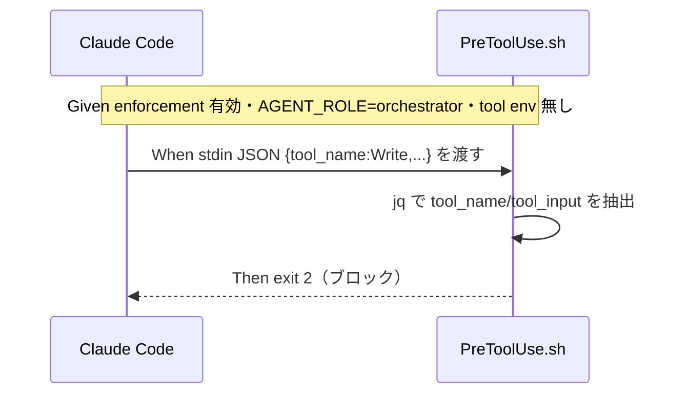

# 要件定義書: enforcement runtime 実効性の是正（PreToolUse/PostToolUse の stdin JSON 対応・exit 2 ブロック）

**プロジェクト名**: enforcement runtime 実効性の是正
**作成日**: 2026 年 06 月 14 日
**最終更新**: 2026 年 06 月 14 日

> **重要**: **このドキュメントは常に更新**: 要件の変更や追加があった場合は、即座にこのドキュメントを更新してください。ドキュメントは「生きているドキュメント」として扱い、実装内容と常に同期させます。
>
> **用語**: [.agents/CONCEPTS.md §用語規約](../../../../.agents/CONCEPTS.md#用語規約) を参照。

---

## 1. 概要

### 1.1 システム概要

enforcement の runtime フック（`.agents/enforcement/claude/PreToolUse.sh`・`PostToolUse.sh`）を、実 Claude Code の公式 hooks 契約に整合させる。具体的には (1) tool 情報を **stdin の JSON** から取得し（jq があれば jq、無ければ最小パーサ/フォールバック）、(2) ブロック時に **exit 2** を返し、(3) 既存の env ベース挙動を**後方互換フォールバック**として残し、(4) plugin 経由・setup 経由の両方で発火する状態を維持する。本 issue のスコープは 00/01（要求・要件）であり、実 hook 改修・テストは後続フェーズで行う。

### 1.2 用語集

| 用語 | 説明 |
| -------- | ------ |
| PreToolUse フック | ツール実行**前**に走る Claude Code フック。違反を reject する。 |
| PostToolUse フック | ツール実行**後**に走るフック。証跡規約を案内する。 |
| stdin JSON | 実 Claude Code がフックに渡す入力。`tool_name`・`tool_input`（`command`/`file_path` 等）を含む JSON を標準入力で渡す【external_spec】。 |
| exit 2（ブロック） | 公式仕様でツール実行をブロックする終了コード【external_spec】。現状は exit 1。 |
| env フォールバック | `CLAUDE_TOOL_NAME`/`TOOL_NAME`/`CLAUDE_FILE_PATH`/`FILE_PATH`/`CLAUDE_COMMAND`/`COMMAND` 経由の従来取得経路【existing_code】。 |
| AGENT_ROLE | orchestrator/worker/scribe の役割。reject 分岐の gate に用いる。 |
| plugin 経路 | plugin の `hooks.json` が `${CLAUDE_PLUGIN_ROOT}/.agents/enforcement/claude/*.sh` を呼ぶ経路。 |
| setup 経路 | `settings.enforce.json` が `${CLAUDE_PROJECT_DIR}/.claude/hooks/*.sh` を呼ぶ経路。 |

---

## 2. 機能要件

### 2.1 ユーザーストーリー

#### ストーリー 1: 違反操作の実機 reject

- **As a** enforcement を有効化（enforce on）したフレームワーク利用者
- **I want to** 規約違反のツール操作が実機の Claude Code で実際にブロックされる
- **So that** CI/audit の事後検知だけに頼らず、違反経路が runtime で物理的に塞がれる

**受け入れ基準**:

- env が渡されない実機環境でも、stdin JSON から tool 情報を取得して reject が発火する。
- ブロック時の終了コードが exit 2 である。

#### ストーリー 2: 正当操作の継続許可（誤検知回避）

- **As a** worker/scribe ロールのサブエージェント
- **I want to** 正当なツール操作（許可ツール・write-workflow-log.sh 単独実行等）が引き続き許可される
- **So that** 誤検知で正規の作業が止まらない

**受け入れ基準**:

- 正当 JSON 入力時に exit 0 を返す。
- jq 非依存環境でも誤検知しない。

#### ストーリー 3: 後方互換の維持

- **As a** 既存の env ベース配線を使う環境の利用者
- **I want to** `CLAUDE_TOOL_NAME` 等を env で渡す従来挙動が維持される
- **So that** 既存配線・既存 E2E を壊さずに移行できる

**受け入れ基準**:

- env で違反情報が渡る場合も従来どおり reject される。
- 既存 E2E（S1-S7・R1-R7）が壊れない。

#### ストーリー 4: 両経路発火

- **As a** plugin 利用者および setup 利用者
- **I want to** plugin 経由（hooks.json）と setup 経由（settings.enforce.json）の両方でフックが発火する
- **So that** 配布形態に依らず enforcement が効く

**受け入れ基準**:

- plugin/setup どちらの結線でも、stdin JSON を受けて reject/許可が同一に動く。

### 2.2 BDD ユースケース

> 凡例: hook 単体テストは「`echo '<JSON>' | AGENT_ROLE=<role> PreToolUse.sh` の終了コード」を検証する。違反=exit 2、正当=exit 0。

#### ユースケース 1: stdin JSON からの tool 情報取得と reject（jq 経路）

stdin の JSON から `tool_name`/`tool_input` を取得し、違反なら exit 2・正当なら exit 0 を返す。

**シナリオ 1-1: orchestrator の直接 Write を stdin 入力でブロック**

```gherkin
Feature: stdin JSON からの reject（jq 経路）
  Scenario: orchestrator の Write が stdin 入力で exit 2 ブロックされる
    Given enforcement が有効で jq が利用可能
    And AGENT_ROLE=orchestrator が env で供給されている
    And CLAUDE_TOOL_NAME 等の tool 情報 env は供給されていない
    When '{"tool_name":"Write","tool_input":{"file_path":"00_要求定義.md"}}' を stdin で PreToolUse.sh に渡す
    Then 終了コードは 2（ブロック）である
    And 標準エラーに orchestrator は file を変更できない旨のメッセージが出る
```

**処理フロー**:



**シナリオ 1-2: 正当な Read は exit 0**

```gherkin
Feature: stdin JSON からの reject（jq 経路）
  Scenario: orchestrator の Read が許可される
    Given enforcement が有効で jq が利用可能
    And AGENT_ROLE=orchestrator が供給されている
    When '{"tool_name":"Read","tool_input":{"file_path":"CORE.md"}}' を stdin で渡す
    Then 終了コードは 0（許可）である
```

#### ユースケース 2: jq 非依存フォールバック

jq が不在でも、最小パーサ/フォールバックで `tool_name`/`tool_input.command`/`tool_input.file_path` を抽出する。

**シナリオ 2-1: jq 不在でも違反を exit 2 でブロック**

```gherkin
Feature: jq 非依存フォールバック
  Scenario: jq 不在環境で sqlite3 直接実行が exit 2 ブロックされる
    Given enforcement が有効で jq が PATH に存在しない
    And AGENT_ROLE=scribe が供給されている
    When '{"tool_name":"Bash","tool_input":{"command":"sqlite3 .workflow/workflow.db \"SELECT 1\""}}' を stdin で渡す
    Then 終了コードは 2（ブロック）である
    And 標準エラーに sqlite3 直接実行禁止のメッセージが出る
```

**シナリオ 2-2: jq 不在でも正当な write-workflow-log.sh 単独実行は exit 0**

```gherkin
Feature: jq 非依存フォールバック
  Scenario: jq 不在で scribe の write-workflow-log.sh 単独実行が許可される
    Given enforcement が有効で jq が PATH に存在しない
    And AGENT_ROLE=scribe が供給されている
    When '{"tool_name":"Bash","tool_input":{"command":".agents/scripts/write-workflow-log.sh ..."}}' を stdin で渡す
    Then 終了コードは 0（許可）である
```

#### ユースケース 3: exit 2 ブロックへの是正

ブロック時の終了コードを公式仕様の 2 に統一する（現状 exit 1 を是正）。

**シナリオ 3-1: 保護パス書込みは exit 2**

```gherkin
Feature: exit 2 ブロック
  Scenario: .workflow 配下への直接 Edit が exit 2 でブロックされる
    Given enforcement が有効
    And AGENT_ROLE=worker が供給されている
    When '{"tool_name":"Edit","tool_input":{"file_path":".workflow/x/00_要求定義.md"}}' を stdin で渡す
    Then 終了コードは 2（ブロック）である
    And 標準エラーに .workflow 直接編集禁止のメッセージが出る
```

**シナリオ 3-2: 複合シェルは exit 2**

```gherkin
Feature: exit 2 ブロック
  Scenario: scribe の複合シェルコマンドが exit 2 でブロックされる
    Given enforcement が有効
    And AGENT_ROLE=scribe が供給されている
    When '{"tool_name":"Bash","tool_input":{"command":"a.sh && b.sh"}}' を stdin で渡す
    Then 終了コードは 2（ブロック）である
    And 標準エラーに複合シェル禁止のメッセージが出る
```

#### ユースケース 4: env 後方互換フォールバック

stdin が空/取得失敗のとき、従来の env（`CLAUDE_TOOL_NAME` 等）を見る。

**シナリオ 4-1: env 経由の違反も従来どおり reject**

```gherkin
Feature: env 後方互換
  Scenario: stdin が無く env に違反情報がある場合に reject される
    Given enforcement が有効
    And AGENT_ROLE=orchestrator が供給されている
    And CLAUDE_TOOL_NAME=Write が env で供給されている
    And stdin が空である
    When PreToolUse.sh を実行する
    Then 終了コードはブロック（exit 2）である
```

**シナリオ 4-2: 既存 E2E 非破壊**

```gherkin
Feature: env 後方互換
  Scenario: 既存 install/uninstall E2E が壊れない
    Given e2e-install-uninstall.sh の S1-S7・R1-R7 が存在する
    When stdin 対応・exit 2 化を施した後に E2E を実行する
    Then 既存シナリオの結果は不変（PASS のまま）である
```

#### ユースケース 5: AGENT_ROLE 別分岐（stdin 入力）

stdin から得た tool 情報と AGENT_ROLE を組み合わせ、role ごとに分岐する。

**シナリオ 5-1: orchestrator は許可ツールのみ exit 0**

```gherkin
Feature: AGENT_ROLE 別分岐
  Scenario: orchestrator の Grep は許可される
    Given enforcement が有効
    And AGENT_ROLE=orchestrator が供給されている
    When '{"tool_name":"Grep","tool_input":{"pattern":"x"}}' を stdin で渡す
    Then 終了コードは 0（許可）である
```

**シナリオ 5-2: worker の Bash（非 scribe）は exit 2**

```gherkin
Feature: AGENT_ROLE 別分岐
  Scenario: scribe 以外の Bash は workflow 記録以外で拒否される
    Given enforcement が有効
    And AGENT_ROLE=worker が供給されている
    When '{"tool_name":"Bash","tool_input":{"command":"ls"}}' を stdin で渡す
    Then 終了コードは 2（ブロック）である
    And 標準エラーに scribe のみ Bash 可の旨が出る
```

**シナリオ 5-3: scribe の write-workflow-log.sh 単独実行は exit 0**

```gherkin
Feature: AGENT_ROLE 別分岐
  Scenario: scribe の write-workflow-log.sh 単独実行は許可される
    Given enforcement が有効
    And AGENT_ROLE=scribe が供給されている
    When '{"tool_name":"Bash","tool_input":{"command":".agents/scripts/write-workflow-log.sh requirement-discovery ..."}}' を stdin で渡す
    Then 終了コードは 0（許可）である
```

#### ユースケース 6: 両経路（plugin / setup）発火

plugin 経由・setup 経由のどちらの結線でも同一フックが stdin を受けて動作する。

**シナリオ 6-1: setup 経路で発火**

```gherkin
Feature: 両経路発火
  Scenario: settings.enforce.json 経由でフックが stdin を受けて動く
    Given enforce on で settings.enforce.json が配線済み
    When 違反 JSON を stdin で .claude/hooks/PreToolUse.sh に渡す
    Then 終了コードは 2（ブロック）である
```

**シナリオ 6-2: plugin 経路で発火**

```gherkin
Feature: 両経路発火
  Scenario: hooks.json 経由でフックが stdin を受けて動く
    Given plugin の hooks.json が ${CLAUDE_PLUGIN_ROOT}/.agents/enforcement/claude/PreToolUse.sh に結線済み
    When 違反 JSON を stdin で渡す
    Then 終了コードは 2（ブロック）である
```

#### ユースケース 7: PostToolUse の整合

PostToolUse.sh も stdin JSON 渡しの実機契約に整合させる（案内主体・破壊しない）。

**シナリオ 7-1: PostToolUse は stdin を受けても案内のみ exit 0**

```gherkin
Feature: PostToolUse 整合
  Scenario: PostToolUse は stdin JSON を受けて証跡規約を案内し exit 0 する
    Given enforcement が有効
    When 任意の tool 実行後 JSON を stdin で PostToolUse.sh に渡す
    Then 終了コードは 0 である
    And 標準エラーに workflow.db 本則・memo プレフィックス規約の案内が出る
```

### 2.3 ビジネスルール

- **BR-1**: ブロック（reject）の終了コードは公式仕様に従い **2** とする【external_spec】。
- **BR-2**: tool 情報の取得は **stdin JSON を第一、env を後方互換フォールバック**の優先順位とする。
- **BR-3**: jq があれば jq、無ければ最小パーサ/フォールバックを用い、**jq 非依存でも動く**こと。
- **BR-4**: tool 情報の取得に失敗した場合は保守的に振る舞う（誤検知で正当操作を止めない。従来 env を見るか案内のみ）。
- **BR-5**: フック自体の内部異常は全ツール停止につながらない fail-safe を保ちつつ、規約違反は fail-closed で reject する（境界は 02 設計で確定）。
- **BR-6**: 正本は `.agents/enforcement/claude/` の 1 か所。plugin/setup 両経路は同一正本を参照する（二重定義しない）。

---

## 3. 非機能要件

### 3.1 パフォーマンス要件

- stdin 読取・JSON 抽出はツール実行ごとに同期的に走るため、jq 1 回または最小 sed/grep フォールバックで完結し、無視できる遅延に収める。

### 3.2 セキュリティ要件

- 保護パス（`.workflow/`）直接書込み・sqlite3 直接実行・orchestrator の write/edit/shell・複合シェルを確実に exit 2 で reject する。
- env で tool 情報が渡らない実機環境でも reject が発火する（実効性の確保が本 issue の主目的）。

### 3.3 ユーザビリティ要件

- reject 時は理由を標準エラーに日本語/英語で明示する（どの規約違反かを利用者が把握できる）。

### 3.4 可用性要件

- フック単体テストで違反/正当ケースの exit code が決定的に再現できる（回帰検知が可能）。

---

## 4. 外部インターフェース要件

### 4.1 API 要件

- **入力（stdin）**: 実 Claude Code が渡す JSON。少なくとも `tool_name`（文字列）・`tool_input`（オブジェクト。`command`/`file_path` 等のキーを含みうる）を含む【external_spec】。
- **入力（env, フォールバック）**: `CLAUDE_TOOL_NAME`/`TOOL_NAME`、`CLAUDE_FILE_PATH`/`FILE_PATH`、`CLAUDE_COMMAND`/`COMMAND`、`AGENT_ROLE`/`CLAUDE_AGENT_ROLE`、`AGENTS_ROOT`【existing_code】。
- **出力（終了コード）**: 違反=2（ブロック）、正当/案内のみ=0。
- **出力（標準エラー）**: 案内メッセージ・reject 理由。

### 4.2 データ形式要件

- JSON 抽出の対象キーは `tool_name`・`tool_input.command`・`tool_input.file_path` に限定する（過剰な汎用パースを避け誤検知を抑制）。

---

## 5. 制約事項

- 本 issue のスコープは **00/01（要求・要件）のみ**。実 hook 改修・hook 単体テスト・E2E 拡張は後続フェーズ（02 設計・03 実装計画・実装）で行う。
- 正本 `.agents/enforcement/claude/PreToolUse.sh`・`PostToolUse.sh` を改修し、setup 配備（`.claude/hooks/`）と build-adapters.sh が生成する plugin `hooks.json` の参照先を壊さない。
- `settings.enforce.json` の env 供給（`AGENT_ROLE`・`AGENTS_ROOT`）と enforce on/off/status 着脱機構（`bin/agents-md.js`）を壊さない。
- multi-tool issue（`20260614_173500_multi-tool対応`）の gemini/copilot/codex も将来フックで reject する方針であり、stdin 対応はそれらにも波及するため、設計フェーズで共通化可能性を検討する（本 issue では claude を対象）。

---

## 6. 参考資料

### プロジェクトドキュメント

- [`00_要求定義.md`](./00_要求定義.md) - 要求定義
- 親 issue: [`../20260614_124435_配布とパッケージ構成の再設計/04_review.md`](../20260614_124435_配布とパッケージ構成の再設計/04_review.md) **§H-6（PreToolUse.sh 実効性の限界）・§H-9**
- 関連 issue: [`../20260614_173500_multi-tool対応/00_要求定義.md`](../20260614_173500_multi-tool対応/00_要求定義.md)（フックによる reject 方針／stdin 対応の波及）

### その他の参考資料

- 実コード: `.agents/enforcement/claude/PreToolUse.sh`（L14-17 env 取得、L33/L67/L104 reject gate、L33-110 各 reject、exit 1）・`PostToolUse.sh`【existing_code】
- 配線: `.agents/platforms/claude/settings.enforce.json`、`.agents/scripts/build-adapters.sh`（plugin hooks.json 生成）
- Claude Code hooks 公式仕様（stdin JSON `tool_name`/`tool_input`、ブロック exit code 2）【external_spec】

---

## 7. 前のステップ

この要件定義書は、以下のドキュメントを基に作成されています：

- **前**: [`00_要求定義.md`](./00_要求定義.md) - 要求定義フェーズ

---

## 8. 次のステップ

この要件定義書の承認後、以下のドキュメントを作成します：

- **次**: [`02_設計.md`](./02_設計.md) - 設計フェーズ
