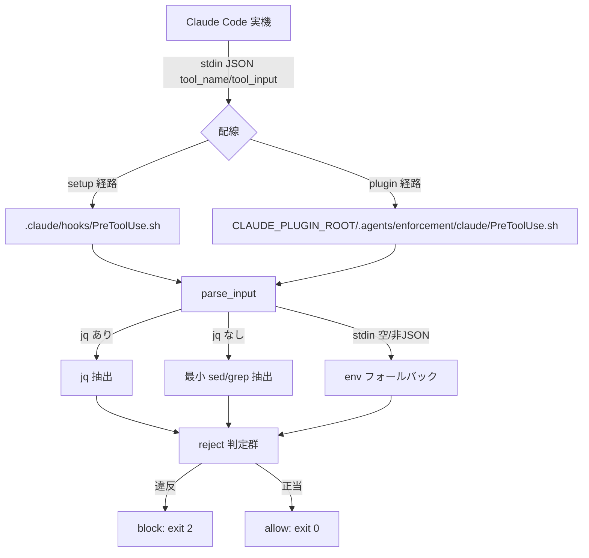
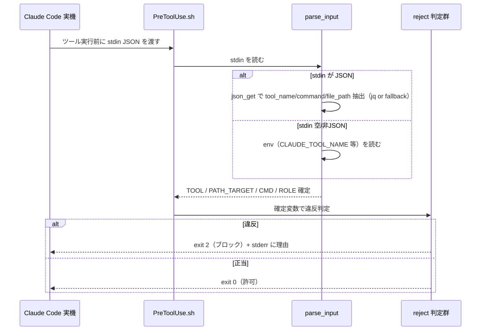
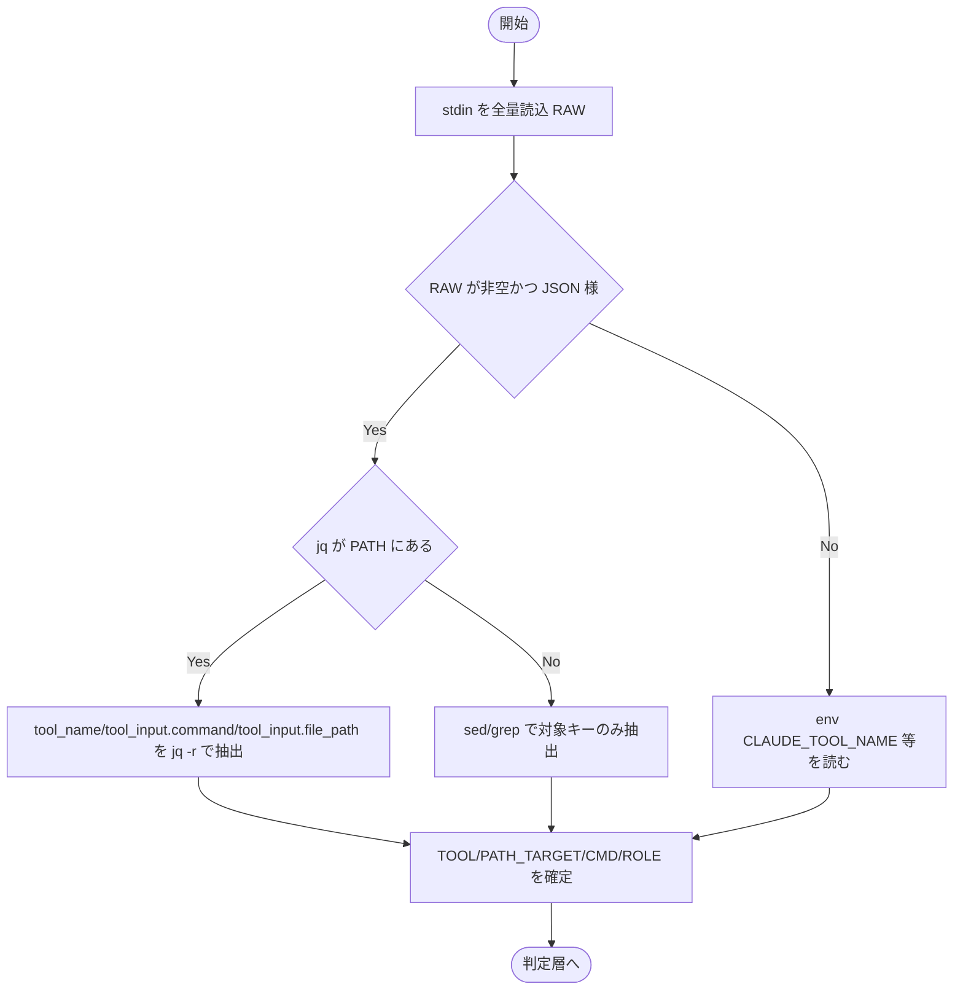

# 設計書: enforcement runtime 実効性の是正（PreToolUse/PostToolUse の stdin JSON 対応・exit 2 ブロック）

**プロジェクト名**: enforcement runtime 実効性の是正
**作成日**: 2026 年 06 月 14 日
**最終更新**: 2026 年 06 月 14 日

> **重要**: **このドキュメントは常に更新**: 設計の変更や追加があった場合は、即座にこのドキュメントを更新してください。ドキュメントは「生きているドキュメント」として扱い、実装内容と常に同期させます。
>
> **事実/判断/外部仕様の区別**: 実コード確認で確証を得た事項は【事実】、Claude Code hooks 公式仕様で確証を得た事項は【external_spec】、本書の設計判断は【判断】で示す。
>
> **用語**: [.agents/CONCEPTS.md §用語規約](../../../../.agents/CONCEPTS.md#用語規約) を参照。

---

## 1. 設計概要

**必須**: 設計方針・原則は [.agents/spec/01\_設計原則.md](../../../../.agents/spec/01_設計原則.md) を参照した上で、本プロジェクトに適用するものを選び記載する。

### 1.1 設計方針

実 Claude Code の公式 hooks 契約（stdin JSON 入力・ブロック exit 2）に整合させるため、PreToolUse.sh / PostToolUse.sh の**入力取得を「stdin JSON → env フォールバック」の単一関数に集約**し、reject 判定ロジックと分離する（責務分離）。reject の終了コードを **exit 2** に統一する。正本は `.agents/enforcement/claude/` の 1 か所のままとし、plugin/setup 両経路はこの正本を参照する（二重定義しない）。【判断】

### 1.2 設計原則（本プロジェクトで適用するもの）

- **UNIX哲学**: hook は「小さく・1 つのことをうまくやる」。入力取得・判定・出力を分離し、jq 1 回または最小 sed/grep フォールバックで完結させる（重い依存を持ち込まない）。
- **単一責務**: 「入力取得（parse_input）」「reject 判定（各 check）」「終了コード規約（block/allow）」を分離し、1 関数 1 責務とする。
- **明確な境界**: hook の境界は「stdin/env → 終了コード（2/0）＋ stderr メッセージ」。配線（settings.enforce.json / hooks.json）は「hook を呼ぶだけ」で、判定ロジックを持たない。
- **AIフレンドリー設計**: 入力取得を 1 関数に集約し、reject ルールを `case`/関数で明示することで、後続の multi-tool（gemini/copilot/codex）への波及時に意図が読み取れるようにする（[01\_設計原則 §AIフレンドリー設計](../../../../.agents/spec/01_設計原則.md#aiフレンドリー設計)）。

> 設計判断の優先順位（[spec/06](../../../../.agents/spec/06_設計判断の優先順位.md)）に従い、**可読性 > 単一責務 > 仕様との整合性**を優先し、入力取得を 1 箇所に集約する判断を採る。【判断】

---

## 2. アーキテクチャ設計

### 2.1 責務・境界・参照関係

[01\_設計原則 §明確な境界・§単一責務](../../../../.agents/spec/01_設計原則.md) に従い、責務・境界・参照関係を明示する。

#### 2.1.1 責務一覧

| コンポーネント | 責務（1 文） |
| -------------- | ------------ |
| `parse_input`（PreToolUse.sh 内・新設関数） | stdin JSON があれば `tool_name`/`tool_input.command`/`tool_input.file_path` を抽出し、無ければ既存 env を後方互換で読んで `TOOL`/`PATH_TARGET`/`CMD` を確定する。 |
| `json_get`（最小パーサ・新設関数） | jq があれば jq、無ければ sed/grep で対象キー（限定）を 1 つ抽出する低レベル関数。 |
| reject 判定群（PreToolUse.sh 内・既存ロジック） | `TOOL`/`PATH_TARGET`/`CMD`/`ROLE` を入力に、規約違反（.workflow 直接編集・orchestrator allowlist・Bash 制限・複合シェル・write-workflow-log.sh 単独実行のみ・sqlite3 直接実行禁止）を判定する。 |
| `block`/`allow`（終了コード規約・新設薄関数） | ブロック時 `exit 2`、許可時 `exit 0` を返す終了コード規約を 1 か所に集約する。 |
| 案内出力（PreToolUse.sh 冒頭・既存） | CORE/LOAD_POLICY/PHASES 読了・委譲・書記の常時案内を stderr に出す（exit には影響しない）。 |
| PostToolUse.sh | stdin JSON を読み捨て（または無視）つつ、証跡規約（workflow.db 本則・memo プレフィックス）を案内し exit 0 する。 |
| settings.enforce.json（setup 経路の配線） | `.claude/hooks/PreToolUse.sh`/`PostToolUse.sh` を呼び、`AGENT_ROLE`・`AGENTS_ROOT` を渡す。stdin は hook 呼び出しに継承される。 |
| hooks.json（plugin 経路の配線・build-adapters.sh 生成） | `${CLAUDE_PLUGIN_ROOT}/.agents/enforcement/claude/*.sh` を呼ぶ。stdin は hook 呼び出しに継承される。 |

#### 2.1.2 境界

- **入力**: (a) stdin の JSON（実機 Claude Code が渡す `tool_name`・`tool_input.{command,file_path,...}`）【external_spec】、(b) env（`CLAUDE_TOOL_NAME`/`TOOL_NAME` 等の後方互換フォールバック・`AGENT_ROLE`・`AGENTS_ROOT`）【事実】。
- **出力**: 終了コード（違反=2、許可/案内のみ=0）と stderr のメッセージ（案内・reject 理由）。
- **他責務との境界**: 本 issue の対象は **claude の PreToolUse.sh / PostToolUse.sh と両経路の配線確認**のみ。gemini/copilot/codex の adapter／フック実装本体は別 issue（`20260614_173500_multi-tool対応`）のスコープ。enforcement の有効化（opt-in 配線）自体の再設計は親 issue 完了済みで対象外。CI/audit（audit.sh）の事後検知ロジックは変更しない（runtime と CI は二層で独立）。

#### 2.1.3 参照関係

- `Claude Code（実機）` → `settings.enforce.json`（setup 経路）→ `.claude/hooks/PreToolUse.sh`（stdin 継承）
- `Claude Code（実機）` → `hooks.json`（plugin 経路）→ `${CLAUDE_PLUGIN_ROOT}/.agents/enforcement/claude/PreToolUse.sh`（stdin 継承）
- `PreToolUse.sh` → `parse_input` → `json_get`（stdin 解析）→ reject 判定群 → `block`/`allow`
- `parse_input` → env（stdin 取得失敗時の後方互換フォールバック）
- 循環参照なし。配線（json/設定）は hook を呼ぶ一方向のみで、判定ロジックを持たない。

### 2.2 システムアーキテクチャ

**必須**: 設計判断は [.agents/spec/](../../../../.agents/spec/)（[00_spec概要.md](../../../../.agents/spec/00_spec概要.md)、[01\_設計原則.md](../../../../.agents/spec/01_設計原則.md)、[06\_設計判断の優先順位.md](../../../../.agents/spec/06_設計判断の優先順位.md)）を参照する。

- **採用パターン**: パイプライン（入力取得 → 判定 → 終了コード規約）を 1 つの shell スクリプト内で段階化する構成。
- **根拠**: spec/06 の優先順位「可読性 > 単一責務 > 仕様整合」に基づき、hook という小さな単位の中で「入力の一本化」を最優先し、判定を後段に集約する。外部依存（jq）に強制依存しないことで互換性（jq 非依存）を満たす。【判断】

#### 2.2.1 CQRS（Command/Query 分離）

本 hook はツール実行の**可否判定（Query 的な検査）**のみを行い、状態を変更しない（副作用は stderr 出力と終了コードのみ）。証跡の状態変更（workflow.db への書込み）は scribe の write-workflow-log.sh が担い、hook は行わない。【判断】

- **Command（状態変更）**: 本 hook には無し（証跡記録は scribe の責務）。
- **Query（状態取得・検査）**: stdin/env から tool 情報を取得し、規約違反かどうかを判定して終了コードを返す。

#### 2.2.2 アーキテクチャ図

### 2.3 コンポーネント構成

**境界・単一責務**: [01\_設計原則 §明確な境界・§単一責務](../../../../.agents/spec/01_設計原則.md) に従う。

- **入力層（parse_input / json_get）**: 唯一 stdin/env を読む層。reject 判定群はこの層が確定した `TOOL`/`PATH_TARGET`/`CMD` のみを参照する（reject 判定群は stdin/env を直接読まない）。
- **判定層（reject 判定群）**: 既存の判定内容（00 §2.1・01 §2.3 BR）を維持。env か stdin かに依存せず、確定済み変数で判定する。
- **終了コード層（block / allow）**: `exit 2`/`exit 0` を 1 か所に集約。判定層は `block "理由"` を呼ぶだけにし、終了コードのマジックナンバーを散在させない。【判断】

### 2.4 データフロー

**イベント駆動**: 本 hook はイベントを発行しない（検査のみ）。ツール実行という「起きうる操作」に対する事前ゲートであり、状態変更イベント（例: WorkflowLogged）は scribe 側が担う。【判断】

---

## 3. 機能設計

### 3.1 機能 1: stdin JSON からの入力取得（parse_input / json_get）

#### 3.1.1 概要

stdin の JSON から tool 情報を取得する。jq があれば jq、無ければ最小 sed/grep フォールバックで対象キーを限定抽出する。stdin が空/非 JSON のときは既存 env を後方互換で読む。

#### 3.1.2 処理フロー

#### 3.1.3 入力・出力

- **入力**: stdin（JSON 文字列、無いこともある）、env（`CLAUDE_TOOL_NAME`/`TOOL_NAME`、`CLAUDE_FILE_PATH`/`FILE_PATH`、`CLAUDE_COMMAND`/`COMMAND`、`AGENT_ROLE`/`CLAUDE_AGENT_ROLE`）。
- **出力**: シェル変数 `TOOL`・`PATH_TARGET`・`CMD`・`ROLE`。
- **抽出対象キー（限定）**: `tool_name`・`tool_input.command`・`tool_input.file_path`（誤検知抑制のため過剰な汎用パースをしない。01 §4.2）。【判断】

#### 3.1.4 エラーハンドリング

- **stdin 読込**: `read`/`cat` がブロックしないよう、配線が stdin を継承する前提で**非ブロッキングに全量読み**、空なら env フォールバックへ。【判断】
- **JSON 判定**: RAW が `{` で始まり `tool_name` を含むかの軽量判定で「JSON 様」とみなす。非 JSON は env フォールバック。
- **最小パーサの取りこぼし**: 抽出に失敗した（キー不在）場合は当該変数を空にする。判定層は空変数を「該当しない」として扱い、**保守的に倒す**（BR-4。違反と確証できないものを reject しない）。ただし `tool_name` が取れていて role が orchestrator の場合の allowlist 判定は、`tool_input` の有無に依存しないため発火する。【判断】

### 3.2 機能 2: ブロック規約の exit 2 統一（block / allow）

#### 3.2.1 概要

reject 時の終了コードを公式仕様の **2** に統一する（現状 exit 1 を是正）。許可時 0。非ブロック警告（案内）は exit に影響させず stderr のみ。

#### 3.2.2 処理フロー

各 reject 分岐は `block "<理由メッセージ>"`（stderr 出力 + `exit 2`）を呼ぶ。全分岐を通過したら最後に `allow`（`exit 0`）。

#### 3.2.3 入力・出力

- **入力**: reject 理由メッセージ（block 時）。
- **出力**: stderr へメッセージ、終了コード 2（block）/ 0（allow）。

#### 3.2.4 エラーハンドリング（fail-safe と fail-closed の境界）【判断・BR-5】

- **fail-safe**: `set +e` を維持し、hook 内部の予期せぬエラー（パーサの実行時エラー等）で**全ツールが止まらない**ようにする。内部エラー時は reject にせず allow（exit 0）に倒す。
- **fail-closed**: 規約違反と**確証できた**場合のみ exit 2 で reject する。
- 両者の境界: 「違反の確証が取れたケース」＝ fail-closed（exit 2）、「入力取得不能・内部エラー」＝ fail-safe（exit 0・案内のみ）。**ブロックしすぎない側に倒す**（00 §3.2・7.1、BR-4）。

### 3.3 機能 3: reject ルールの整理（stdin → tool_name/tool_input マッピング）

既存 reject 分岐を、stdin から得た `tool_name`/`tool_input` で正しく判定できるよう対応付ける。AGENT_ROLE 別の分岐を明確化する。

| # | reject ルール（既存） | 判定に使う値 | 対象 ROLE | 期待結果 |
| --- | --- | --- | --- | --- |
| R1 | `.workflow/` 配下の直接 Write/Edit 禁止 | `tool_name ∈ {Write,Edit}` かつ `tool_input.file_path =~ \.workflow/` | 全 ROLE | exit 2 |
| R2 | orchestrator の allowlist 外ツール禁止（Write/Edit/Delete/Shell/Bash 等） | `tool_name` が allowlist 外 | orchestrator | exit 2 |
| R2' | orchestrator の許可ツール（Read/Grep/Glob/LS/Task 等） | `tool_name` が allowlist 内 | orchestrator | exit 0 |
| R3 | Bash は scribe のみ（非 scribe の Bash 禁止） | `tool_name == Bash` | orchestrator/worker（非 scribe） | exit 2 |
| R4 | scribe の複合シェル禁止（改行・;・&&・\|\|・\|） | `tool_input.command` に複合演算子 | scribe | exit 2 |
| R5 | scribe の Bash は write-workflow-log.sh 単独実行のみ | `tool_input.command` の第1トークン basename | scribe | 単独実行=exit 0 / それ以外=exit 2 |
| R6 | sqlite3 直接実行禁止（全 ROLE） | `tool_input.command =~ sqlite3` | 全 ROLE | exit 2 |

> **ROLE 別分岐の明確化**【判断】:
> - **orchestrator**: 読む・検索・委譲ツール（Read/Grep/Glob/LS/list_dir/Task/mcp_task/ReadLints/fetch_mcp_resource/list_mcp_resources）のみ allow。それ以外（Write/Edit/Delete/StrReplace/Shell/Bash/TodoWrite/EditNotebook/call_mcp_tool/GenerateImage・未知ツール）は block。Bash は専用メッセージで block。
> - **worker**（orchestrator/scribe 以外の既定）: R1（.workflow 直接編集）・R3（Bash は scribe のみ→ block）・R6（sqlite3）が適用。通常の Write/Edit/Read 等は許可（worker は実作業者）。
> - **scribe**: R4（複合シェル禁止）・R5（write-workflow-log.sh 単独実行のみ）・R6（sqlite3 直接禁止）が適用。
> - `ROLE=unknown`（role 未供給）: 既存実装どおり orchestrator allowlist は発火させない（R2 は `ROLE==orchestrator` gate）。R1/R3/R4/R5/R6 のうち role 非依存（R1・R6）と「非 scribe の Bash 禁止（R3）」は発火する。R3 は `ROLE != scribe` 条件のため unknown でも Bash を block する点に注意（既存挙動を維持）。【事実: 現行 L72-75 は `ROLE != scribe` で block】

### 3.4 機能 4: PostToolUse の整合

#### 3.4.1 概要

PostToolUse.sh も stdin JSON 渡しの実機契約に整合させる。案内主体（証跡規約の案内）であり、stdin を読んでも・読まなくても結果に影響しない。常に exit 0。

#### 3.4.2 入力・出力

- **入力**: stdin（任意の JSON。読み捨て可）、`AGENTS_ROOT`。
- **出力**: stderr に証跡規約案内（workflow.db 本則・memo YYYYMMDD_HHMMSS_ プレフィックス）、exit 0。
- **整合点**: `set -e` のままだと stdin 読込やパイプ起因で非 0 終了する懸念があるため、PreToolUse と同様に **fail-safe（`set +e` または読込失敗を握りつぶす）**へ整合させ、案内を出して必ず exit 0 する。【判断】

### 3.5 機能 5: 両経路（plugin / setup）での発火確認と配線調整

#### 3.5.1 概要

setup 経路（settings.enforce.json → `.claude/hooks/*.sh`）と plugin 経路（hooks.json → `${CLAUDE_PLUGIN_ROOT}/.agents/enforcement/claude/*.sh`）の両方で、同一正本フックが stdin JSON を受けて発火することを確認する。

#### 3.5.2 配線の事実と調整方針

- **【事実】** Claude Code の hooks は command を子プロセスとして起動し、**stdin はフック実行に継承される**（実機が hook へ JSON を stdin で渡す）【external_spec】。settings.enforce.json / hooks.json の現行 command は `bash "<path>"` で hook を実行しており、**stdin はそのまま hook の stdin になる**。したがって配線側で stdin を明示的に渡す追加記述は不要。【判断】
- **【事実】** 両配線とも `AGENT_ROLE`・`AGENTS_ROOT` を env で渡す（setup は `AGENT_ROLE="${AGENT_ROLE:-orchestrator}"`、plugin は `AGENTS_ROOT` のみ）。plugin 経路は現状 `AGENT_ROLE` を渡していない【事実: hooks.json L148/L159 は `AGENTS_ROOT` のみ】。
- **配線調整方針**【判断】: hook 側の stdin 対応・exit 2 化が主たる是正であり、配線は原則維持する。ただし plugin 経路の `AGENT_ROLE` 不在は、orchestrator allowlist（R2）を plugin 利用時に発火させたい場合に影響する。**plugin の hooks.json 生成（build-adapters.sh）に `AGENT_ROLE="${AGENT_ROLE:-orchestrator}"` を追加するかは 03 のタスクで判断**（後方互換：未指定時 hook 内 `ROLE=unknown` で R2 が無効化されるのみで、R1/R3/R6 は効く）。本是正のコア（stdin/exit2）とは独立に扱える。

---

## 4. データ設計

### 4.1 データモデル

本機能は永続データを持たない（hook はステートレス）。扱うのは stdin の JSON 構造と env のみ。

#### stdin JSON 構造（実機が渡す入力）【external_spec】

| キー | 型 | 説明 | 抽出対象 |
| ---- | -- | ---- | -------- |
| `tool_name` | string | 実行されようとするツール名（Write/Edit/Bash/Read 等） | ○ |
| `tool_input` | object | ツール引数オブジェクト | （配下を限定抽出） |
| `tool_input.command` | string | Bash 等のコマンド文字列 | ○ |
| `tool_input.file_path` | string | Write/Edit の対象パス | ○ |
| `tool_input.*`（その他） | any | pattern 等 | × （抽出しない） |

### 4.2 データ構造

- 内部状態は shell 変数 `RAW`（stdin 全量）・`TOOL`・`PATH_TARGET`・`CMD`・`ROLE` のみ。テーブル・DB なし。

---

## 5. API 設計

### 5.1 API 一覧（hook の外部契約・関数 I/F）

| インターフェース | 種別 | 説明 |
| ---------------- | ---- | ---- |
| `PreToolUse.sh`（stdin/env → exit code） | hook | ツール実行前の可否判定。違反=2・正当=0。 |
| `PostToolUse.sh`（stdin/env → exit code） | hook | ツール実行後の証跡規約案内。常に 0。 |
| `parse_input`（内部関数） | 関数 | stdin/env を読み `TOOL`/`PATH_TARGET`/`CMD`/`ROLE` を確定。 |
| `json_get <key>`（内部関数） | 関数 | jq or sed/grep で限定キーを 1 つ抽出。 |
| `block <msg>` / `allow`（内部関数） | 関数 | exit 2（理由出力付き）/ exit 0。 |

### 5.2 API 詳細

#### API1: PreToolUse.sh

- **入力**: stdin（JSON、任意）+ env（`AGENT_ROLE`・`AGENTS_ROOT`・後方互換 `CLAUDE_TOOL_NAME` 等）。
- **出力**: 終了コード（2=ブロック / 0=許可・案内のみ）、stderr（案内・reject 理由）。
- **契約違反時の扱い**: 規約違反確証時のみ exit 2。入力取得不能・内部エラーは exit 0（fail-safe）。`.agents` 不在時は案内せず exit 0（既存挙動維持）。

#### API2: PostToolUse.sh

- **入力**: stdin（任意・読み捨て可）+ env（`AGENTS_ROOT`）。
- **出力**: stderr（証跡規約案内）、exit 0。
- **契約違反時の扱い**: 検証はしない（案内のみ）。厳密検証は CI（audit.sh）に委ねる（既存方針維持）。

#### API3: json_get <key>（最小パーサ）

- **入力**: 抽出キー名（`tool_name`/`command`/`file_path` のいずれか）。RAW を参照。
- **出力**: 抽出した文字列（無ければ空）。
- **契約**: jq 優先（`jq -r '.tool_name // empty'`、`tool_input.command`/`tool_input.file_path` は `.tool_input.command // empty` 等）。jq 不在時は sed/grep で `"key"\s*:\s*"値"` を 1 件抽出（保守的・限定キーのみ）。抽出失敗は空文字（誤検知抑制）。

---

## 6. テスト戦略

テスト戦略の**観点の定義**は [RULES.md のテスト戦略必須要件](../../../../.agents/RULES.md#テスト戦略必須要件) を、**BDD 形式の定義**は [TEST_BDD_FORMAT.md](../../../../.agents/TEST_BDD_FORMAT.md) を参照する。本ドキュメントでは**対象ごとのテスト割当**のみ記載する。

### 6.1 対象ごとのテスト割り当て

hook の単体テストは **`echo '<JSON>' | AGENT_ROLE=<role> bash PreToolUse.sh` の終了コード**（違反=2・正当=0）を検証する。テストは **tmp 隔離（`mktemp -d` + `git archive HEAD | tar -x`）** で実施し、本リポの `.agents/`・`.claude/`・`.workflow/`・`workflow.db` を破壊しない（[.agents-project §テストの tmp 隔離](../../../../.agents-project/自己拡張ワークフロー.md)）。

| 対象 | 単体 | 結合/API | E2E | クリティカル観点 | バリデーション観点 | 未達理由/補足 |
| ---- | ---- | -------- | --- | ---------------- | ------------------ | ------------- |
| stdin JSON 入力取得（jq 経路） | ○ | × | × | 違反 JSON で exit 2・正当 JSON で exit 0 | tool_name/file_path/command の抽出 | 結合は両経路 E2E で代替 |
| jq 非依存フォールバック | ○ | × | × | jq を PATH から外して同等動作 | sed/grep 抽出の取りこぼし/誤検知 | jq 不在は `PATH=` 隔離で再現 |
| exit 2 ブロック化 | ○ | × | × | 全 reject 分岐で 2 を返す | exit 1 残存がないこと | grep で `exit 1` 残存も静的確認 |
| env 後方互換フォールバック | ○ | × | ○ | stdin 空+env で従来 reject | env のみ運用を壊さない | 既存 E2E（S1-S7・R1-R7）非破壊 |
| AGENT_ROLE 別分岐 | ○ | × | × | orchestrator/worker/scribe の分岐 | role 未供給（unknown）時の挙動 | 表 R1-R6 を role 別に網羅 |
| 両経路発火（plugin/setup） | × | ○ | ○ | 配線経由で stdin が hook に届く | settings.enforce.json/hooks.json の command 形 | 実機相当は手動/E2E 補完。tmp 隔離で配線生成を検証 |
| PostToolUse 整合 | ○ | × | × | stdin を受けても exit 0・案内出力 | set -e 由来の非 0 終了がないこと | — |

### 6.2 監査・レビューでの確認（証跡）

証跡の確認観点は RULES §テスト戦略必須要件および workflow/PHASES.md の監査観点を参照。本設計書 §6.1 の割当表と 03\_実装計画 §2.x.3／§2.x.4（テスト観点・BDD）が揃っていることを確認する。hook 単体テストは 01 §2.2 のユースケース 1〜7・シナリオと 1:1 対応させる。

---

## 7. UI 設計

該当なし（CLI/hook のため画面なし）。出力は stderr テキストのみで、reject 時は「どの規約違反か」を日本語/英語で明示する（01 §3.3）。

---

## 8. セキュリティ設計

### 8.1 認証・認可

ROLE（orchestrator/worker/scribe）に基づくツール認可を hook で行う。orchestrator は読む・検索・委譲のみ許可（allowlist 方式）。scribe の Bash は write-workflow-log.sh 単独実行のみ許可。

### 8.2 データ保護

保護パス（`.workflow/`）への直接 Write/Edit を exit 2 で拒否する。sqlite3 直接実行を全 ROLE で拒否し、証跡 DB の直接改変経路を塞ぐ。env で tool 情報が渡らない実機でも reject が発火することが本是正の主目的（01 §3.2）。

---

## 9. 非機能要件への対応

### 9.1 パフォーマンス

stdin 読取・JSON 抽出はツール実行ごとに同期実行されるため、jq 1 回または最小 sed/grep 1〜数回で完結させ、無視できる遅延に収める（01 §3.1）。

### 9.2 可用性

fail-safe（hook 内部エラーで全ツールを止めない）を維持しつつ、規約違反は fail-closed で reject する。hook 単体テストで違反/正当ケースの exit code を決定的に再現できるようにし、回帰検知を可能にする（01 §3.4）。

---

## 10. 参考資料

### プロジェクトドキュメント

- [`01_要件定義.md`](./01_要件定義.md) - 要件定義
- [`00_要求定義.md`](./00_要求定義.md) - 要求定義
- 親 issue: [`../20260614_124435_配布とパッケージ構成の再設計/04_review.md`](../20260614_124435_配布とパッケージ構成の再設計/04_review.md) §H-6・§H-9
- 関連 issue: [`../20260614_173500_multi-tool対応/00_要求定義.md`](../20260614_173500_multi-tool対応/00_要求定義.md)（stdin 対応の波及）

### その他の参考資料

- 実コード: `.agents/enforcement/claude/PreToolUse.sh`・`PostToolUse.sh`【事実】
- 配線: `.agents/platforms/claude/settings.enforce.json`、`.agents/scripts/build-adapters.sh`（plugin hooks.json 生成部）【事実】
- Claude Code hooks 公式仕様（stdin JSON `tool_name`/`tool_input`、ブロック exit code 2）【external_spec】

---

## 11. 前のステップ

この設計書は、以下のドキュメントを基に作成されています：

- **前**: [`01_要件定義.md`](./01_要件定義.md) - 要件定義フェーズ

---

## 12. 次のステップ

この設計書の承認後、以下のドキュメントを作成します：

- **次**: [`03_実装計画.md`](./03_実装計画.md) - 実装計画フェーズ
</content>
</invoke>
