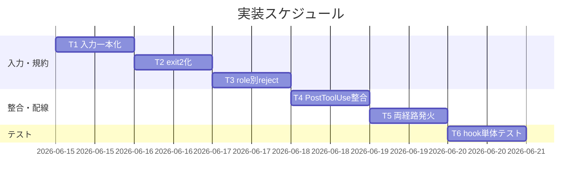

# 実装計画書: enforcement runtime 実効性の是正（PreToolUse/PostToolUse の stdin JSON 対応・exit 2 ブロック）

**プロジェクト名**: enforcement runtime 実効性の是正
**作成日**: 2026 年 06 月 14 日
**最終更新**: 2026 年 06 月 14 日

> **重要**: **このドキュメントは常に更新**: 実装計画の変更、進捗状況の更新、バグの記録などがあった場合は、即座にこのドキュメントを更新してください。ドキュメントは「生きているドキュメント」として扱い、実装内容と常に同期させます。
> **必須項目**: 「必須」と明記した欄は空欄・抽象語のみで提出しないこと。テスト観点・BDD 仕様は具体ケースを 1 件以上記載すること。
>
> **用語**: [.agents/CONCEPTS.md §用語規約](../../../../.agents/CONCEPTS.md#用語規約) を参照。

---

## 1. 実装概要

### 1.1 実装方針（必須）

[02\_設計.md](./02_設計.md) に従い、PreToolUse.sh の**入力取得を 1 関数（parse_input/json_get）に集約**し、reject の終了コードを **exit 2** に統一する。jq 非依存フォールバックを実装し、env を後方互換フォールバックとして残す。PostToolUse.sh を stdin 受領でも exit 0 する fail-safe に整合させ、両経路（plugin/setup）の配線が stdin を継承して発火することを確認する。**本リポを破壊しない tmp 隔離で hook 単体テストを実施する**（実装フェーズで）。

### 1.2 実装順序（必須: 1 件以上）

1. **T1**: 入力取得の一本化（parse_input/json_get・stdin JSON 抽出・jq fallback・env 後方互換）
2. **T2**: ブロック規約の exit 2 化（block/allow・既存 reject 分岐の置換）
3. **T3**: AGENT_ROLE 別 reject ルールの stdin 対応（R1〜R6 の確定変数化）
4. **T4**: PostToolUse の stdin 整合（fail-safe・案内・exit 0）
5. **T5**: 両経路（plugin/setup）発火確認と配線調整判断（hooks.json の AGENT_ROLE 付与是非）
6. **T6**: hook 単体テストの実装（tmp 隔離・jq 有/無・role 別・両経路）



---

## 2. タスク分解

**必須**: 各タスクには **「テスト観点」（2.x.3）** と **「単体テスト仕様（BDD）」（2.x.4）** を必ず記載する。観点の定義は [02\_設計 §6](./02_設計.md) および [RULES のテスト戦略・TEST_BDD_FORMAT](../../../../.agents/TEST_BDD_FORMAT.md) を参照。

### 2.1 タスク 1: 入力取得の一本化（parse_input / json_get）

#### 2.1.1 概要（必須）

PreToolUse.sh が stdin JSON から `tool_name`/`tool_input.command`/`tool_input.file_path` を取得し、stdin 空/非 JSON のとき env を後方互換で読む単一の入力層を実装する。

#### 2.1.2 実装内容（必須: 1 件以上）

- `parse_input` 関数の追加: stdin を全量読み（`RAW="$(cat)"` 等）、JSON 様なら `json_get` で抽出、そうでなければ env を読む。
- `json_get <key>` 関数の追加: jq があれば `jq -r '.tool_name // empty'` 等、無ければ sed/grep で `"key":"値"` を限定抽出（対象は tool_name・tool_input.command・tool_input.file_path）。
- 確定変数 `TOOL`/`PATH_TARGET`/`CMD`/`ROLE` を後段の reject 判定群へ渡す（判定群は stdin/env を直接読まない）。

#### 2.1.3 テスト観点（必須）

**参照**: 観点の定義は [02\_設計 §6](./02_設計.md) および [RULES のテスト戦略・TEST_BDD_FORMAT](../../../../.agents/RULES.md#テスト戦略必須要件) を参照。以下は本タスクの具体ケース。

##### 単体（本タスクの具体ケース・必須 1 件以上）

- jq 経路: `{"tool_name":"Write","tool_input":{"file_path":"00_要求定義.md"}}` を stdin で渡すと `TOOL=Write`・`PATH_TARGET` が抽出される（後段で reject 発火）。
- jq 非依存: `PATH=` で jq を不在化しても同 JSON から同じ抽出ができる。
- env フォールバック: stdin が空で `CLAUDE_TOOL_NAME=Write` のとき `TOOL=Write` になる。

##### 結合/API（本タスクの具体ケース・該当時は必須 1 件以上）

- 該当なし（hook 内関数単位。経路結合は T5 で検証）。

##### E2E/受け入れ（本タスクの具体ケース・未達時は理由記載）

- 既存 E2E（`e2e-install-uninstall.sh` S1-S7・R1-R7）が壊れないこと（T4/T5 と合わせ実装フェーズで実行）。

##### バリデーション（該当する場合の具体ケース）

- 非 JSON stdin（例: `not json`）のとき env フォールバックに倒れ、誤抽出しない。

#### 2.1.4 単体テスト仕様（BDD）（必須）

```gherkin
Feature: stdin JSON からの入力取得（jq 経路 / 01 ユースケース1）
  Scenario: orchestrator の Write を stdin から抽出して reject する（01 シナリオ1-1）
    Given enforcement が有効で AGENT_ROLE=orchestrator、tool env は無し
    When '{"tool_name":"Write","tool_input":{"file_path":"00_要求定義.md"}}' を stdin で PreToolUse.sh に渡す
    Then 終了コードは 2 である
    And 標準エラーに orchestrator は file を変更できない旨が出る
```

**テストコード例（必須: インラインコメントで Given/When/Then を明記）**

```bash
# tests/preToolUse_test.sh — bats 風/素の bash いずれでも可。tmp 隔離で実行。
# ユースケース: PreToolUse.sh が stdin JSON から tool 情報を取得し違反を reject すること。

test_orchestrator_write_blocked_via_stdin() {
  # シナリオ: orchestrator の Write が stdin 入力で exit 2 ブロックされる（01 SC-1 / UC1 シナリオ1-1）
  # Given: AGENT_ROLE=orchestrator、tool env は未供給、隔離した .agents 配下の hook
  local json='{"tool_name":"Write","tool_input":{"file_path":"00_要求定義.md"}}'
  # When: 違反 JSON を stdin で hook に渡す
  echo "$json" | AGENT_ROLE=orchestrator bash "$HOOK" >/dev/null 2>err.txt
  local code=$?
  # Then: 終了コードは 2、stderr に orchestrator の編集禁止メッセージ
  assert_equals 2 "$code"
  grep -q "orchestrator must never modify files" err.txt
}
```

#### 2.1.5 依存関係

- なし（最初に実装する基盤タスク）。

#### 2.1.6 見積もり

- **工数**: 3h / **優先度**: 高

### 2.2 タスク 2: ブロック規約の exit 2 化（block / allow）

#### 2.2.1 概要（必須）

reject 時の終了コードを公式仕様の 2 に統一し（現状 exit 1 を是正）、許可時 0 とする。block/allow 薄関数に集約する。

#### 2.2.2 実装内容（必須: 1 件以上）

- `block <msg>`（stderr 出力 + `exit 2`）・`allow`（`exit 0`）関数の追加。
- 既存 reject 分岐（L37-39, L50-61, L69-100, L107-108 等）の `exit 1` を `block "..."` に置換。
- 末尾を `allow`（exit 0）に統一。`exit 1` 残存がないことを静的確認。

#### 2.2.3 テスト観点（必須）

##### 単体（本タスクの具体ケース・必須 1 件以上）

- 任意の違反ケースで終了コードが 2 になる（exit 1 でない）。
- 正当ケースで終了コードが 0 になる。
- ソースに `exit 1` が残っていない（`grep -n 'exit 1' PreToolUse.sh` が空）。

##### 結合/API（本タスクの具体ケース・該当時は必須 1 件以上）

- 該当なし。

##### E2E/受け入れ（本タスクの具体ケース・未達時は理由記載）

- 実機相当の「ブロック=2」が成立（手動/E2E 補完、T5 と合流）。

##### バリデーション（該当する場合の具体ケース）

- 該当なし。

#### 2.2.4 単体テスト仕様（BDD）（必須）

```gherkin
Feature: exit 2 ブロック（01 ユースケース3）
  Scenario: .workflow 配下への直接 Edit が exit 2 でブロックされる（01 シナリオ3-1）
    Given enforcement が有効で AGENT_ROLE=worker
    When '{"tool_name":"Edit","tool_input":{"file_path":".workflow/x/00_要求定義.md"}}' を stdin で渡す
    Then 終了コードは 2 である
    And 標準エラーに .workflow 直接編集禁止のメッセージが出る
```

**テストコード例（必須: インラインコメントで Given/When/Then を明記）**

```bash
# ユースケース: reject の終了コードが公式仕様の 2 に統一されていること。

test_workflow_edit_exit2() {
  # シナリオ: .workflow 配下 Edit が exit 2（01 SC-1 / UC3 シナリオ3-1）
  # Given: AGENT_ROLE=worker、保護パスを対象とした Edit JSON
  local json='{"tool_name":"Edit","tool_input":{"file_path":".workflow/x/00_要求定義.md"}}'
  # When: 違反 JSON を stdin で渡す
  echo "$json" | AGENT_ROLE=worker bash "$HOOK" >/dev/null 2>err.txt
  local code=$?
  # Then: 終了コードは 2（1 ではない）かつ理由が出る
  assert_equals 2 "$code"
  grep -q "direct edit of .workflow/ is forbidden" err.txt
}
```

#### 2.2.5 依存関係

- T1（入力取得）に続いて実施。

#### 2.2.6 見積もり

- **工数**: 2h / **優先度**: 高

### 2.3 タスク 3: AGENT_ROLE 別 reject ルールの stdin 対応（R1〜R6）

#### 2.3.1 概要（必須）

[02\_設計 §3.3](./02_設計.md) の対応表 R1〜R6 を、確定変数（stdin 由来）で判定するよう整理し、orchestrator/worker/scribe 別の分岐を明確化する。

#### 2.3.2 実装内容（必須: 1 件以上）

- R1（.workflow 直接編集）・R2/R2'（orchestrator allowlist）・R3（非 scribe の Bash 禁止）・R4（複合シェル）・R5（write-workflow-log.sh 単独実行のみ）・R6（sqlite3）の判定を `TOOL`/`PATH_TARGET`/`CMD`/`ROLE` 参照に統一。
- 入力取得不能（変数空）時は保守的に倒す（BR-4: 違反確証なしは reject しない）。

#### 2.3.3 テスト観点（必須）

##### 単体（本タスクの具体ケース・必須 1 件以上）

- orchestrator の `Grep` は exit 0（allowlist 内）。
- orchestrator の `Bash` は exit 2（専用メッセージ）。
- worker の `Bash`（`ls`）は exit 2（scribe のみ可）。
- scribe の `sqlite3 ...` は exit 2。
- scribe の `write-workflow-log.sh ...` 単独実行は exit 0。
- scribe の `a.sh && b.sh`（複合シェル）は exit 2。

##### 結合/API（本タスクの具体ケース・該当時は必須 1 件以上）

- 該当なし。

##### E2E/受け入れ（本タスクの具体ケース・未達時は理由記載）

- role 未供給（unknown）時に R1/R3/R6 が発火し R2 が無効化される（既存挙動維持）。

##### バリデーション（該当する場合の具体ケース）

- write-workflow-log.sh の絶対パス解決（realpath/readlink fallback）後も basename 判定が成立。

#### 2.3.4 単体テスト仕様（BDD）（必須）

```gherkin
Feature: AGENT_ROLE 別分岐（01 ユースケース5）
  Scenario: scribe の write-workflow-log.sh 単独実行は許可される（01 シナリオ5-3）
    Given enforcement が有効で AGENT_ROLE=scribe
    When '{"tool_name":"Bash","tool_input":{"command":".agents/scripts/write-workflow-log.sh requirement-discovery ..."}}' を stdin で渡す
    Then 終了コードは 0 である

  Scenario: scribe 以外の Bash は拒否される（01 シナリオ5-2）
    Given enforcement が有効で AGENT_ROLE=worker
    When '{"tool_name":"Bash","tool_input":{"command":"ls"}}' を stdin で渡す
    Then 終了コードは 2 である
    And 標準エラーに scribe のみ Bash 可の旨が出る
```

**テストコード例（必須: インラインコメントで Given/When/Then を明記）**

```bash
# ユースケース: AGENT_ROLE ごとに tool/コマンドの可否が正しく分岐すること。

test_scribe_writelog_allowed() {
  # シナリオ: scribe の write-workflow-log.sh 単独実行は許可（01 SC-5 / UC5 シナリオ5-3）
  # Given: AGENT_ROLE=scribe、write-workflow-log.sh の単独実行コマンド
  local json='{"tool_name":"Bash","tool_input":{"command":".agents/scripts/write-workflow-log.sh requirement-discovery x"}}'
  # When: 正当 JSON を stdin で渡す
  echo "$json" | AGENT_ROLE=scribe bash "$HOOK" >/dev/null 2>/dev/null
  local code=$?
  # Then: 終了コードは 0（許可）
  assert_equals 0 "$code"
}

test_worker_bash_blocked() {
  # シナリオ: 非 scribe の Bash は exit 2（01 SC-5 / UC5 シナリオ5-2）
  # Given: AGENT_ROLE=worker、任意の ls コマンド
  local json='{"tool_name":"Bash","tool_input":{"command":"ls"}}'
  # When: Bash JSON を stdin で渡す
  echo "$json" | AGENT_ROLE=worker bash "$HOOK" >/dev/null 2>err.txt
  local code=$?
  # Then: 終了コードは 2 かつ scribe のみ Bash 可のメッセージ
  assert_equals 2 "$code"
  grep -q "only scribe may run Bash" err.txt
}
```

#### 2.3.5 依存関係

- T1・T2 に依存。

#### 2.3.6 見積もり

- **工数**: 3h / **優先度**: 高

### 2.4 タスク 4: PostToolUse の stdin 整合

#### 2.4.1 概要（必須）

PostToolUse.sh を stdin JSON 受領でも壊れず案内のみ exit 0 する fail-safe に整合させる。

#### 2.4.2 実装内容（必須: 1 件以上）

- `set -e` 由来の非 0 終了を避ける（`set +e` 化、または stdin 読込の失敗を握りつぶす）。
- 証跡規約案内（workflow.db 本則・memo YYYYMMDD_HHMMSS_ プレフィックス）を維持し、末尾を必ず `exit 0`。

#### 2.4.3 テスト観点（必須）

##### 単体（本タスクの具体ケース・必須 1 件以上）

- 任意の JSON を stdin で渡しても終了コードが 0。
- stderr に証跡規約案内が出る。

##### 結合/API（本タスクの具体ケース・該当時は必須 1 件以上）

- 該当なし。

##### E2E/受け入れ（本タスクの具体ケース・未達時は理由記載）

- 既存 E2E が PostToolUse 起因で失敗しない。

##### バリデーション（該当する場合の具体ケース）

- 空 stdin でも exit 0。

#### 2.4.4 単体テスト仕様（BDD）（必須）

```gherkin
Feature: PostToolUse 整合（01 ユースケース7）
  Scenario: PostToolUse は stdin JSON を受けて案内し exit 0 する（01 シナリオ7-1）
    Given enforcement が有効
    When 任意の tool 実行後 JSON を stdin で PostToolUse.sh に渡す
    Then 終了コードは 0 である
    And 標準エラーに workflow.db 本則・memo プレフィックス規約の案内が出る
```

**テストコード例（必須: インラインコメントで Given/When/Then を明記）**

```bash
# ユースケース: PostToolUse.sh が stdin を受けても案内のみで exit 0 すること。

test_posttooluse_exit0() {
  # シナリオ: stdin JSON を受けて案内し exit 0（01 SC-/UC7 シナリオ7-1）
  # Given: 任意の実行後 JSON
  local json='{"tool_name":"Write","tool_input":{"file_path":"x"}}'
  # When: PostToolUse に stdin で渡す
  echo "$json" | bash "$POST_HOOK" >/dev/null 2>err.txt
  local code=$?
  # Then: 終了コードは 0 かつ証跡規約案内
  assert_equals 0 "$code"
  grep -q "workflow.db is canonical" err.txt
}
```

#### 2.4.5 依存関係

- T1 と同じ入力契約だが独立に実装可。

#### 2.4.6 見積もり

- **工数**: 1h / **優先度**: 中

### 2.5 タスク 5: 両経路（plugin / setup）発火確認と配線調整判断

#### 2.5.1 概要（必須）

setup 経路（settings.enforce.json）と plugin 経路（hooks.json）の両方で、stdin が hook に継承されて発火することを確認し、hooks.json への `AGENT_ROLE` 付与是非を判断する。

#### 2.5.2 実装内容（必須: 1 件以上）

- tmp 隔離（`git archive HEAD | tar -x`）で build-adapters.sh を実行し、生成 hooks.json の command 形（`bash "${CLAUDE_PLUGIN_ROOT}/.agents/enforcement/claude/PreToolUse.sh"`）を確認。
- setup 経路の `.claude/hooks/` 配備（setup 経由）と settings.enforce.json の command 形を確認。
- 判断: plugin の hooks.json 生成に `AGENT_ROLE="${AGENT_ROLE:-orchestrator}"` を追加するか（後方互換: 未指定でも R1/R3/R6 は効く）。追加する場合 build-adapters.sh の heredoc を更新。

#### 2.5.3 テスト観点（必須）

##### 単体（本タスクの具体ケース・必須 1 件以上）

- 生成 hooks.json の PreToolUse command が正本 hook を `bash` で呼ぶ形になっている。

##### 結合/API（本タスクの具体ケース・該当時は必須 1 件以上）

- setup 経路: `echo '<違反JSON>' | bash .claude/hooks/PreToolUse.sh` が exit 2。
- plugin 経路: `echo '<違反JSON>' | bash <plugin>/.agents/enforcement/claude/PreToolUse.sh` が exit 2。

##### E2E/受け入れ（本タスクの具体ケース・未達時は理由記載）

- 実機 Claude Code での発火は手動確認に委ねる（自動 E2E は配線生成と hook 直接呼び出しで近似）。未達理由: 実機フック起動は CI で再現困難なため hook 直接呼び出し＋配線形検証で代替。

##### バリデーション（該当する場合の具体ケース）

- hooks.json が valid JSON（`python3 -m json.tool` 等で検証）。

#### 2.5.4 単体テスト仕様（BDD）（必須）

```gherkin
Feature: 両経路発火（01 ユースケース6）
  Scenario: setup 経路で違反 JSON が exit 2 ブロックされる（01 シナリオ6-1）
    Given enforce on で settings.enforce.json が配線済み（tmp 隔離）
    When 違反 JSON を stdin で .claude/hooks/PreToolUse.sh に渡す
    Then 終了コードは 2 である

  Scenario: plugin 経路で違反 JSON が exit 2 ブロックされる（01 シナリオ6-2）
    Given hooks.json が ${CLAUDE_PLUGIN_ROOT}/.agents/enforcement/claude/PreToolUse.sh に結線済み
    When 違反 JSON を stdin で渡す
    Then 終了コードは 2 である
```

**テストコード例（必須: インラインコメントで Given/When/Then を明記）**

```bash
# ユースケース: plugin/setup どちらの結線でも同一 hook が stdin を受けて reject すること。

test_setup_path_blocks() {
  # シナリオ: setup 経路で違反 JSON が exit 2（01 SC-6 / UC6 シナリオ6-1）
  # Given: tmp 隔離で .claude/hooks/PreToolUse.sh を配備済み
  local json='{"tool_name":"Write","tool_input":{"file_path":"00_要求定義.md"}}'
  # When: 違反 JSON を setup 経路の hook に stdin で渡す
  echo "$json" | AGENT_ROLE=orchestrator bash "$TMP/.claude/hooks/PreToolUse.sh" >/dev/null 2>/dev/null
  local code=$?
  # Then: 終了コードは 2
  assert_equals 2 "$code"
}
```

#### 2.5.5 依存関係

- T1〜T3 完了後（hook の挙動確定後）に確認。

#### 2.5.6 見積もり

- **工数**: 2h / **優先度**: 中

### 2.6 タスク 6: hook 単体テストの実装（tmp 隔離・jq 有/無）

#### 2.6.1 概要（必須）

T1〜T5 の BDD を tmp 隔離の hook 単体テストスクリプトとして実装し、jq 有/無の両系統・role 別・両経路を決定的に検証する。

#### 2.6.2 実装内容（必須: 1 件以上）

- テストスクリプト（例: `.agents/scripts/test/test-pretooluse-hook.sh`）を追加。`mktemp -d` + `git archive HEAD | tar -x` で隔離環境を作り、その中の hook を呼ぶ。
- jq 無し系統は `PATH=`（jq を除いた PATH）で同テストを再実行する。
- 違反ケース=exit 2・正当ケース=exit 0 を role/tool/コマンド別に網羅（01 §2.2 ユースケース 1〜7 と 1:1）。
- テスト終了時に tmp を `rm -rf` で片付ける。本リポの `.agents/`・`.claude/`・`.workflow/`・`workflow.db` を変更しない。

#### 2.6.3 テスト観点（必須）

##### 単体（本タスクの具体ケース・必須 1 件以上）

- 全 BDD ケース（T1〜T5 の Scenario）が PASS する。
- jq 有/無の両系統で同一の合否になる（jq 非依存性の確認）。

##### 結合/API（本タスクの具体ケース・該当時は必須 1 件以上）

- setup/plugin 経路の hook 直接呼び出しが期待 exit code を返す（T5 と共有）。

##### E2E/受け入れ（本タスクの具体ケース・未達時は理由記載）

- 既存 `e2e-install-uninstall.sh` S1-S7・R1-R7 を実行し PASS のまま（非破壊。01 シナリオ4-2）。

##### バリデーション（該当する場合の具体ケース）

- 非 JSON/空 stdin で誤検知（正当操作の reject）がない。

#### 2.6.4 単体テスト仕様（BDD）（必須）

```gherkin
Feature: jq 非依存フォールバック（01 ユースケース2）
  Scenario: jq 不在で sqlite3 直接実行が exit 2 ブロックされる（01 シナリオ2-1）
    Given enforcement が有効で jq が PATH に存在しない
    And AGENT_ROLE=scribe
    When '{"tool_name":"Bash","tool_input":{"command":"sqlite3 .workflow/workflow.db \"SELECT 1\""}}' を stdin で渡す
    Then 終了コードは 2 である
    And 標準エラーに sqlite3 直接実行禁止のメッセージが出る

  Scenario: env 後方互換 — stdin 無し+env 違反で reject（01 シナリオ4-1）
    Given AGENT_ROLE=orchestrator かつ CLAUDE_TOOL_NAME=Write、stdin は空
    When PreToolUse.sh を実行する
    Then 終了コードは 2 である
```

**テストコード例（必須: インラインコメントで Given/When/Then を明記）**

```bash
# ユースケース: jq 非依存環境と env 後方互換で hook が決定的に動くこと（tmp 隔離）。

test_no_jq_sqlite_blocked() {
  # シナリオ: jq 不在で sqlite3 直接実行が exit 2（01 SC-4 / UC2 シナリオ2-1）
  # Given: jq を除いた PATH、AGENT_ROLE=scribe、sqlite3 直叩きコマンド
  local json='{"tool_name":"Bash","tool_input":{"command":"sqlite3 .workflow/workflow.db \"SELECT 1\""}}'
  # When: jq 不在の PATH で違反 JSON を stdin に渡す
  echo "$json" | PATH="$NOJQ_PATH" AGENT_ROLE=scribe bash "$HOOK" >/dev/null 2>err.txt
  local code=$?
  # Then: 終了コードは 2 かつ sqlite3 禁止メッセージ
  assert_equals 2 "$code"
  grep -q "sqlite3 direct execution forbidden" err.txt
}

test_env_backcompat_blocked() {
  # シナリオ: stdin 無し + env 違反で reject（01 SC-3 / UC4 シナリオ4-1）
  # Given: AGENT_ROLE=orchestrator、CLAUDE_TOOL_NAME=Write、stdin は空
  # When: 空 stdin で hook を実行
  echo -n "" | AGENT_ROLE=orchestrator CLAUDE_TOOL_NAME=Write bash "$HOOK" >/dev/null 2>/dev/null
  local code=$?
  # Then: 終了コードは 2（env 後方互換が効く）
  assert_equals 2 "$code"
}
```

#### 2.6.5 依存関係

- T1〜T5 完了後。

#### 2.6.6 見積もり

- **工数**: 4h / **優先度**: 高

---

## テスト観点

- **入力取得**: stdin JSON（jq/最小パーサ）からの `tool_name`/`tool_input.command`/`tool_input.file_path` 抽出と、env 後方互換フォールバックの両系統を検証する（T1・T6）。
- **終了コード規約**: 違反=exit 2・正当=exit 0。ソースに `exit 1` 残存がないこと（T2）。
- **AGENT_ROLE 別 reject**: R1〜R6 を orchestrator/worker/scribe/unknown 別に網羅（T3）。
- **jq 非依存**: jq を除いた PATH で全ケースが同一合否（T6）。
- **両経路発火**: setup/plugin の hook が stdin を継承し同一に動く（T5・T6）。
- **後方互換・非破壊**: 既存 E2E（S1-S7・R1-R7）が PASS のまま（T6）。
- **誤検知回避**: 非 JSON/空 stdin で正当操作を reject しない（保守的フォールバック・T1・T6）。

## 単体テスト

- 対象: `PreToolUse.sh`（入力取得・各 reject 分岐・block/allow）、`PostToolUse.sh`（案内・exit 0）。
- 方式: `echo '<JSON>' | AGENT_ROLE=<role> bash <hook>` の終了コードと stderr メッセージを検証する bash テスト。**tmp 隔離（`mktemp -d` + `git archive HEAD | tar -x`）で本リポ非破壊**に実施し、jq 有/無の両系統を回す。
- BDD 形式: 各テストに `ユースケース:`（テスト群の doc コメント）・`シナリオ:`（各ケース）・本文に `# Given:`/`# When:`/`# Then:` を付与（[TEST_BDD_FORMAT.md](../../../../.agents/TEST_BDD_FORMAT.md)）。

## BDD

- 01 §2.2 のユースケース 1〜7・各シナリオと本計画 §2.x.4 の Gherkin を 1:1 対応させる。
  - UC1（stdin/jq）↔ T1 2.1.4
  - UC2（jq 非依存）↔ T6 2.6.4
  - UC3（exit 2）↔ T2 2.2.4
  - UC4（env 後方互換）↔ T6 2.6.4
  - UC5（ROLE 別分岐）↔ T3 2.3.4
  - UC6（両経路）↔ T5 2.5.4
  - UC7（PostToolUse）↔ T4 2.4.4
- Given/When/Then 形式は [TEST_BDD_FORMAT.md](../../../../.agents/TEST_BDD_FORMAT.md) に従う。

---

## 3. 実装スケジュール

### 3.1 マイルストーン

| マイルストーン | 期日 | 成果物 |
| -------------- | ---- | ------ |
| 入力一本化・exit2 化 | T1-T2 完了 | parse_input/json_get・block/allow を含む PreToolUse.sh |
| role 別 reject・整合 | T3-T4 完了 | R1-R6 の stdin 対応・PostToolUse 整合 |
| 両経路確認・テスト | T5-T6 完了 | 配線確認・hook 単体テストスクリプト（tmp 隔離） |

### 3.2 実装フェーズ

#### フェーズ 1: 入力・規約

- **期間**: T1-T3
- **タスク**: 入力一本化、exit 2 化、role 別 reject

#### フェーズ 2: 整合・配線・テスト

- **期間**: T4-T6
- **タスク**: PostToolUse 整合、両経路発火確認、hook 単体テスト

---

## 4. テスト計画

テスト観点・レベル・BDD 形式の定義は [02\_設計 §6](./02_設計.md) および RULES のテスト戦略・TEST_BDD_FORMAT を参照。本実装計画では各タスクの §2.x.3 に具体ケース、§2.x.4 に BDD 仕様を記載した。

### 4.1 テストの優先順位

- クリティカル: reject の exit 2 化（T2）・jq 非依存（T6）・後方互換 E2E 非破壊（T6）を厚くテスト。
- 影響範囲が広い箇所（入力取得 T1）は回帰テストに必ず含める。

---

## 5. リスク管理

### 5.1 実装リスク

- **リスク**: 最小パーサ（jq 非依存）の取りこぼし/誤検知。
  - **対策**: 抽出対象キーを `tool_name`/`tool_input.command`/`tool_input.file_path` に限定し、取得失敗は空＝保守的に倒す（BR-4）。jq 有/無の両系統テストで担保（T6）。
- **リスク**: exit 2 化により hook 内部エラーが「ブロック」と誤解釈され全ツール停止。
  - **対策**: fail-safe（`set +e`・内部エラーは allow に倒す）と fail-closed（違反確証時のみ exit 2）の境界を保持（02 §3.2.4）。
- **リスク**: reject を「実際に効かせる」ことで、本リポでのドッグフーディング（orchestrator として作業する開発セッション）が想定外にブロックされる。
  - **対策**: 実 hook 改修・有効化は本リポへ即時自己適用せず、tmp 隔離でテストしてから取り込む（.agents-project §tmp 隔離）。enforce on/off 着脱機構で段階導入する。実装フェーズの verify-and-close で影響を確認する。
- **リスク**: stdin の `read`/`cat` が配線次第でブロックする。
  - **対策**: 配線が stdin を継承する前提を T5 で確認し、空 stdin でも即座に env フォールバックへ抜ける実装にする。

---

## 6. 参考資料

### プロジェクトドキュメント

- [`02_設計.md`](./02_設計.md) - 設計
- [`01_要件定義.md`](./01_要件定義.md) - 要件定義
- [`00_要求定義.md`](./00_要求定義.md) - 要求定義

### その他の参考資料

- 実コード: `.agents/enforcement/claude/PreToolUse.sh`・`PostToolUse.sh`
- 配線: `.agents/platforms/claude/settings.enforce.json`、`.agents/scripts/build-adapters.sh`
- テスト隔離: [.agents-project/自己拡張ワークフロー.md](../../../../.agents-project/自己拡張ワークフロー.md) §テストの tmp 隔離
- Claude Code hooks 公式仕様（stdin JSON・exit 2）【external_spec】

---

## 7. 前のステップ

この実装計画書は、以下のドキュメントを基に作成されています：

- **前**: [`02_設計.md`](./02_設計.md) - 設計フェーズ

---

## 8. 次のステップ

この実装計画書の承認後、以下のステップに進みます：

- **プロジェクトが 1 つの issue（タスク）である場合**: 実装フェーズ（implement-feature）に直接進む。本 issue はサブ issue 分割を行わないため 90_issues.md は作成しない。

**用語**: [.agents/CONCEPTS.md §用語規約](../../../../.agents/CONCEPTS.md#用語規約) を参照。
</content>
