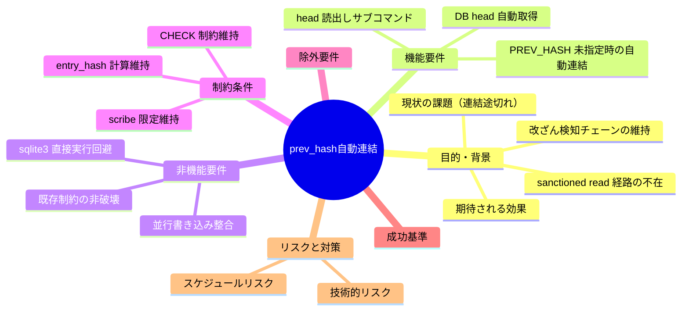
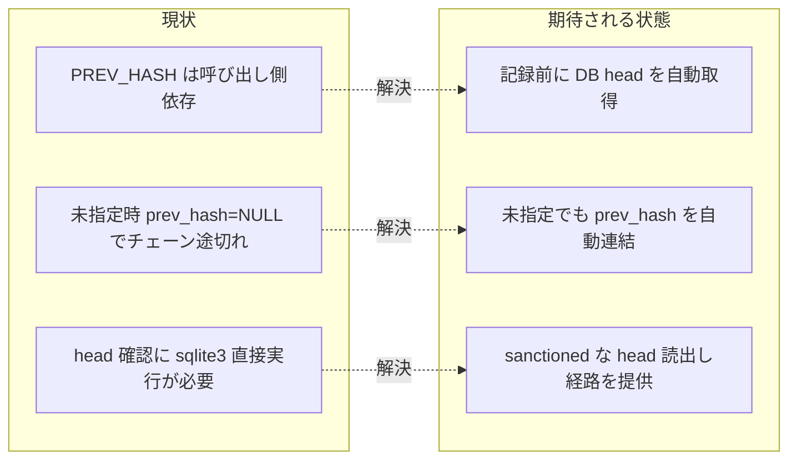

# 要求定義書: 台帳 write-workflow-log の prev_hash 自動連結

**プロジェクト名**: 台帳 write-workflow-log の prev_hash 自動連結（DB head 自動取得）
**作成日**: 2026 年 06 月 14 日
**最終更新**: 2026 年 06 月 14 日

> **重要**:
>
> - 要求定義書は、プロジェクトの全体像を把握するためのものです。詳細な技術仕様や実装方法は要件定義書以降で記載します。必要最低限の情報に収めることを心掛けてください。
> - **このドキュメントは常に更新**: 要求の変更や追加があった場合は、即座にこのドキュメントを更新してください。ドキュメントは「生きているドキュメント」として扱い、実装内容と常に同期させます。
> - **必須項目**: 以下の「必須」と明記した項目は空欄・抽象語のみで提出しないこと。判定可能な形で記入すること。
>
> **用語**: [.agents/CONCEPTS.md §用語規約](../../../.agents/CONCEPTS.md#用語規約) を参照。

---

## 要求定義の全体像

**注意**:

- 本 issue は小規模な保守 issue だが、台帳（workflow.db）の改ざん検知価値に直結するため重要度は高い。
- マインドマップは全体像の把握用。詳細は本文・01 以降に記載する。

---

## 1. 目的・背景

### 1.1 目的（必須）

書記実行時に PREV_HASH 未指定でも DB head を自動連結しチェーンを途切れさせない。

### 1.2 背景

- **現状の課題**:
  - `write-workflow-log.sh` は **PREV_HASH を呼び出し側（環境変数）から受け取るのみ**で、DB の現 head（最新 entry の `entry_hash`）を自動取得しない。実コード根拠: 同スクリプト 143 行 `PREV_HASH="${PREV_HASH:-}"`、INSERT は 351 行 `... NULLIF('$E_PH','') ...` で、PREV_HASH 空時に `prev_hash` が NULL になる。
  - DB head を読む **sanctioned な経路（read 専用サブコマンド等）が存在しない**。一方で運用方針上、書記以外による `sqlite3` 直接実行は避ける（schema.md §運用「書記による書き込み経路の一本化」、CORE §禁止事項）。
  - 帰結: 書記が PREV_HASH を空（NULL）で記録すると **prev_hash チェーンが途切れる**。実際に本セッションの新規 issue 書記 1 件で途切れが発生した（evidence は memo に記録）。チェーンの改ざん検知価値（順序・連鎖性）が損なわれる。

- **必要性**:
  - `entry_hash` による改ざん検知は **prev_hash で前後の entry が連鎖していること**を前提に意味を持つ。連結が任意（呼び出し側依存）では連鎖性が担保されず、検知の前提が崩れる。
  - 書記以外が head 確認のために `sqlite3` を直接叩く運用は経路一本化の方針に反するため、**sanctioned な read 経路**を併せて提供する必要がある。

### 1.3 期待される効果（必須: 1 件以上）

- **効果 1**: 連続 2 回の書記記録で 2 件目の `prev_hash` が 1 件目の `entry_hash` に一致する（○/× で判定可能）。
- **効果 2**: 書記が PREV_HASH を指定しなくてもチェーンが途切れない（連続記録後に NULL の中間 entry が発生しない、で判定可能）。
- **効果 3**: `sqlite3` を直接実行せずに現 head を確認できる sanctioned 経路（例: `--print-head`）が提供され、現 head の `entry_hash` を返す（○/× で判定可能）。

**現状と期待される状態の比較**:

---

## 2. 機能要件

### 2.1 既存機能の維持（該当する場合）

- 書記専用ラッパー（`AGENT_ROLE=scribe` 限定）・INSERT 専用・1 回 1 行・command 許可リスト・UUID 検証・WAL/flock/リトライ・`document_id` 不変チェックは現状どおり維持する。
- PREV_HASH が **明示指定された場合**は従来どおりその値を使う（自動取得で上書きしない）。

### 2.2 新規機能要件

- **DB head 自動取得**: 記録（INSERT）前に DB の現 head（最新 entry の `entry_hash`）を自身で SELECT し、PREV_HASH 未指定時に `prev_hash` として連結する。
- **head 読出しの sanctioned 経路**: 書記以外が `sqlite3` を直接実行せずに head を確認できるサブコマンド/内部関数（例: `write-workflow-log.sh --print-head` 相当）を提供する。

---

## 3. 非機能要件

### 3.1 パフォーマンス

- head 取得は 1 回の SELECT（最新 entry 1 行）に留め、記録 1 回あたりのオーバーヘッドを最小にする。

### 3.2 セキュリティ

- 経路一本化を維持する。head 読出し経路も書記用ラッパー内に閉じ、任意 SQL 実行経路を新設しない（read 専用・固定クエリ）。

### 3.3 互換性

- 既存スキーマ（`workflow_log`）・CHECK 制約・`entry_hash` 計算式（schema.md と同期）を変更しない。旧スキーマ（`entry_id` を持たない DB）では従来挙動を維持する。

### 3.4 保守性

- 「最新 entry の決定方法」を 1 か所に集約し、自動連結と `--print-head` で同一ロジックを共有する。

---

## 4. 制約条件

### 4.1 技術的制約

- `actor_role = 'scribe'` 限定・`delegated_by_role = 'orchestrator'` 限定・command 許可リスト・`dod_met IN (0,1)`・`summary` 6 文字以上などの既存 CHECK 制約を壊さない。
- `entry_hash` の計算入力（schema.md §entry_hash 定義と write-workflow-log.sh の `gen_entry_hash`）を変更しない。

### 4.2 既存システムとの互換性

- DB パス固定（`.workflow/workflow.db`）の方針を維持する。
- 空 DB（head 不在）時は初回 entry として `prev_hash=NULL` で正常動作する。

### 4.3 移行期間・スケジュール

- 本 issue は **00/01（要求・要件）のみ**を成果物とする。実スクリプト改修・テストは後続フェーズ（設計・実装）で行う。

---

## 5. 除外要件

- 実 hook/スクリプトの改修・テストコード作成（後続の design/implement フェーズで実施）。
- 過去に途切れたチェーンの遡及的な再連結・修復（本 issue の対象外。別途検討）。
- `entry_hash` アルゴリズムや prev_hash の検証（audit 側）ロジックの変更。

---

## 6. 成功基準（必須: 1 件以上）

- **SC-01**: 連続 2 回の書記記録（PREV_HASH 未指定）で、2 件目の `prev_hash` が 1 件目の `entry_hash` に一致する。
- **SC-02**: 空 DB に対する初回記録で `prev_hash` が NULL（初回 entry）となり正常終了する。
- **SC-03**: `--print-head`（相当）が現 head の `entry_hash` を返し、空 DB では空（または head 不在を示す出力）を返す。
- **SC-04**: PREV_HASH を明示指定した場合は従来どおりその値が `prev_hash` に記録される（自動取得で上書きされない）。
- **SC-05**: 既存の CHECK 制約・`entry_hash` 計算・scribe 限定が変更されず、回帰がない。

---

## 7. リスクと対策

### 7.1 技術的リスク

- **リスク**: 並行書き込み（別セッションの書記）により、head 取得から INSERT までの間に head が変わり、誤った prev_hash で連結する。
  - **対策**: 既存の flock 排他とロック取得後の head 再取得を組み合わせ、INSERT 直前に head を確定する（要件 (d) で定義）。
- **リスク**: head 自動取得が既存の `entry_hash` 計算へ影響し、ハッシュ整合が崩れる。
  - **対策**: `entry_hash` の計算入力は変更しない。prev_hash は INSERT 値としてのみ扱い、ハッシュ計算式は据え置く（4.1）。

### 7.2 スケジュールリスク

- **リスク**: 小規模 issue だが head 決定ロジックの定義漏れで実装フェーズが膨らむ。
  - **対策**: 「最新 entry の決定方法（順序キー）」を 01 で明確化し、設計フェーズへの引き継ぎを明文化する。

---

## 8. 参考資料

### プロジェクトドキュメント

- `.agents/scripts/write-workflow-log.sh`（PREV_HASH の受け取りと INSERT。143 行・341 行・351 行）
- `.agents/ledger/schema.sql`（`workflow_log` の正本・CHECK 制約）
- `.agents/ledger/schema.md`（`prev_hash`/`entry_hash` の意味・運用方針）
- 親 issue: `docs/maintainer/workflow/20260614_124435_配布とパッケージ構成の再設計/`（04_review 各バッチの書記、enforcement/scribe 運用）

### その他の参考資料

- `.agents/CORE.md` §禁止事項（書記以外の workflow.db 書き込み禁止）
- `.agents-project/自己拡張ワークフロー.md`（issue の作成場所）

---

## 9. 次のステップ

この要求定義書の承認後、以下のドキュメントを作成します：

- **次**: [`01_要件定義.md`](./01_要件定義.md) - 要件定義フェーズ
