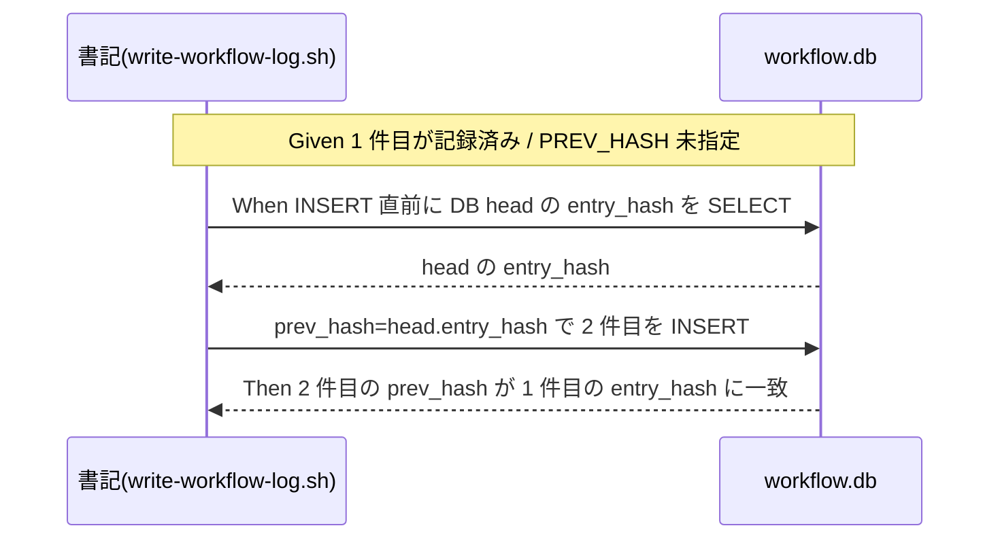

# 要件定義書: 台帳 write-workflow-log の prev_hash 自動連結

**プロジェクト名**: 台帳 write-workflow-log の prev_hash 自動連結（DB head 自動取得）
**作成日**: 2026 年 06 月 14 日
**最終更新**: 2026 年 06 月 14 日

> **重要**: **このドキュメントは常に更新**: 要件の変更や追加があった場合は、即座にこのドキュメントを更新してください。
>
> **用語**: [.agents/CONCEPTS.md §用語規約](../../../.agents/CONCEPTS.md#用語規約) を参照。

---

## 1. 概要

### 1.1 システム概要

`write-workflow-log.sh` は workflow.db への書記専用ラッパーであり、1 回 1 行の INSERT で実行証跡を記録する。各 entry は `prev_hash`（直前 entry の `entry_hash`）と `entry_hash`（自身のハッシュ）を持ち、これらの連鎖で改ざん検知の土台を構成する。本要件は、書記が `prev_hash` を明示しなくても、記録前に **DB の現 head（最新 entry の `entry_hash`）を自動取得して連結**し、チェーンの連鎖性を維持できるようにする。あわせて、書記以外が `sqlite3` を直接実行せず現 head を確認できる **sanctioned な read 経路**を提供する。

### 1.2 用語集

| 用語 | 説明 |
| ---- | ---- |
| DB head | workflow.db の `workflow_log` における最新 entry（チェーン末尾）。その `entry_hash` が次 entry の `prev_hash` になる。 |
| prev_hash | 直前 entry の `entry_hash`。初回 entry（空 DB）では NULL。 |
| entry_hash | 当該 entry の内容から計算するハッシュ（`gen_entry_hash`、schema.md と同期）。 |
| sanctioned 経路 | 書記用ラッパーが提供する正規の read 手段。任意 SQL を許さず固定クエリで head を返す（例: `--print-head`）。 |
| チェーン途切れ | 中間 entry の `prev_hash` が NULL になり、前後の連鎖が切れる状態。 |

---

## 2. 機能要件

### 2.1 ユーザーストーリー

#### ストーリー 1: PREV_HASH 未指定でも連結される

- **As a** 書記（scribe）として記録する運用者
- **I want to** PREV_HASH を明示しなくても直前 entry に自動連結したい
- **So that** 指定漏れでチェーンが途切れず改ざん検知の連鎖性が保たれる

**受け入れ基準**:

- PREV_HASH 未指定時、記録前に DB head の `entry_hash` を SELECT し `prev_hash` に用いる（00 SC-01）。
- PREV_HASH 明示指定時は従来どおり指定値を使う（自動取得で上書きしない。00 SC-04）。

#### ストーリー 2: sqlite3 を直接叩かず head を確認できる

- **As a** head を確認したい運用者・監査
- **I want to** sanctioned なサブコマンドで現 head を取得したい
- **So that** 経路一本化の方針を破らずに head を確認できる

**受け入れ基準**:

- `--print-head`（相当）が現 head の `entry_hash` を返す。空 DB では head 不在を示す（00 SC-03）。
- 任意 SQL を受け付けず、固定 read クエリのみで head を返す。

#### ストーリー 3: 既存の制約・互換を壊さない

- **As a** 台帳の維持責任者
- **I want to** scribe 限定・CHECK・entry_hash 計算を変えずに改修したい
- **So that** 既存の監査・検知が回帰しない

**受け入れ基準**:

- `actor_role='scribe'` 限定・CHECK 制約・`entry_hash` 計算入力を変更しない（00 SC-05）。
- 空 DB の初回は `prev_hash=NULL` で正常終了する（00 SC-02）。
- 旧スキーマ（`entry_id` 無し）DB では従来挙動を維持する。

### 2.2 BDD ユースケース

#### ユースケース 1: prev_hash 自動連結

記録時に呼び出し側が PREV_HASH を指定しない場合、書記が DB head を自動取得して連結する。

**シナリオ 1: 連続 2 件で 2 件目が 1 件目に連結される**

```gherkin
Feature: prev_hash 自動連結
  Scenario: 連続記録で 2 件目の prev_hash が 1 件目の entry_hash に一致する
    Given workflow.db に少なくとも 1 件の entry が記録済みである
    And 書記の呼び出しで PREV_HASH を指定しない
    When 2 件目の記録（INSERT）を実行する
    Then 2 件目の prev_hash が直前 entry（DB head）の entry_hash に一致する
    And チェーンに NULL の中間 entry が生じない
```

**処理フロー**:



**シナリオ 2: 空 DB の初回は prev_hash=NULL**

```gherkin
Feature: prev_hash 自動連結
  Scenario: 空 DB への初回記録は prev_hash が NULL になる
    Given workflow.db に entry が 1 件も無い（head 不在）
    And 書記の呼び出しで PREV_HASH を指定しない
    When 初回の記録（INSERT）を実行する
    Then prev_hash が NULL（初回 entry）として記録される
    And 記録は正常終了する（exit 0）
```

**シナリオ 3: PREV_HASH 明示指定時は上書きしない**

```gherkin
Feature: prev_hash 自動連結
  Scenario: PREV_HASH を明示した場合は自動取得で上書きしない
    Given workflow.db に entry が記録済みである
    And 書記の呼び出しで PREV_HASH に値を明示指定する
    When 記録（INSERT）を実行する
    Then 記録された prev_hash は明示指定した値に一致する
    And DB head の自動取得値で上書きされない
```

#### ユースケース 2: sanctioned な head 読出し

書記以外が sqlite3 を直接実行せずに現 head を確認できる。

**シナリオ 1: --print-head が現 head を返す**

```gherkin
Feature: sanctioned な head 読出し
  Scenario: --print-head が現 head の entry_hash を返す
    Given workflow.db に少なくとも 1 件の entry が記録済みである
    When write-workflow-log.sh を --print-head（相当）で実行する
    Then 現 head（最新 entry）の entry_hash が標準出力に返る
    And sqlite3 を直接実行する必要がない
```

**シナリオ 2: 空 DB では head 不在を示す**

```gherkin
Feature: sanctioned な head 読出し
  Scenario: 空 DB では head 不在を示す出力を返す
    Given workflow.db に entry が 1 件も無い、または DB が未作成である
    When write-workflow-log.sh を --print-head（相当）で実行する
    Then head 不在を示す出力（空文字列）を返す
    And エラーで異常終了しない
```

#### ユースケース 3: 並行書き込みでの head 整合

別セッションの書記と競合しても、記録直前の再取得で誤連結を防ぐ。

**シナリオ 1: ロック取得後に head を再取得して連結**

```gherkin
Feature: 並行書き込みでの head 整合
  Scenario: ロック取得後に head を再取得し正しく連結する
    Given 別セッションの書記が直前に新しい entry を追加し得る
    And 自セッションは PREV_HASH を指定しない
    When 自セッションが排他ロックを取得した後に DB head を再取得して INSERT する
    Then prev_hash は INSERT 時点の真の head（最新 entry）の entry_hash に一致する
    And 直前に追加された entry を飛ばして連結しない
```

### 2.3 ビジネスルール

- head の決定は「最新 entry」を一意に選べる順序キー（例: `created_at`/`ts_utc` の最大、または明示的な順序）で行い、自動連結と `--print-head` で同一ロジックを共有する。順序キーの具体は設計フェーズで確定する。
- prev_hash は INSERT 値としてのみ扱い、`entry_hash` の計算入力には含めない（既存計算式を据え置く）。
- head 自動取得は flock 排他ロック取得後・INSERT 直前に行う。

---

## 3. 非機能要件

### 3.1 パフォーマンス要件

- head 取得は最新 1 行を取る単一 SELECT に限定する。
- 記録 1 回あたりの追加クエリは head 取得の 1 回までとする。

### 3.2 セキュリティ要件

- read 経路は固定クエリのみとし、任意 SQL 実行経路を新設しない。
- 書き込みは引き続き書記ラッパー経由に一本化する（schema.md §運用）。

### 3.3 ユーザビリティ要件

- `--print-head` は引数が不正でも分かりやすいエラー/使用法を返す。
- 既存の位置引数・環境変数の I/F は後方互換を保つ。

### 3.4 可用性要件

- 空 DB・head 不在でも異常終了せず、初回 entry として記録できる。
- SQLITE_BUSY 時は既存のリトライ方針（最大 5 回・100ms）に従う。

---

## 4. 外部インターフェース要件

### 4.1 API 要件

- **記録 I/F（既存・後方互換）**: `AGENT_ROLE=scribe write-workflow-log.sh command summary dod_met ts_utc [issue_path] [changed_files]`。環境変数 `PREV_HASH` は任意。未指定時に自動連結する。
- **head 読出し I/F（新規）**: `write-workflow-log.sh --print-head`（相当）。現 head の `entry_hash` を標準出力に返す。空 DB では空文字列。

### 4.2 データ形式要件

- `prev_hash` / `entry_hash` は既存スキーマの TEXT カラム。`entry_hash` は schema.md 定義の `gen_entry_hash` 計算式に従う（変更しない）。
- head 不在の表現は空文字列とする（NULL 相当）。

---

## 5. 制約事項

- 本 issue の成果物は **00/01 のみ**。実装・テストは後続フェーズ。
- 既存 CHECK 制約（scribe 限定・command 許可リスト・dod_met・summary 長など）と DB パス固定を変更しない。
- 過去に途切れたチェーンの遡及修復は対象外（00 §5）。
- 本タスクの書記 entry は、現状ツールに自動連結が無いため `prev_hash` が途切れ得る。これは本 issue が修正対象とする挙動であり、現状ツールの素の挙動のまま記録する（無理に sqlite3 で連結しない）。memo・報告に明記する。

---

## 6. 参考資料

### プロジェクトドキュメント

- [`00_要求定義.md`](./00_要求定義.md) - 要求定義
- `.agents/scripts/write-workflow-log.sh`（PREV_HASH 受け取り 143 行・INSERT 351 行・entry_hash 計算 `gen_entry_hash` 62-65 行）
- `.agents/ledger/schema.sql` / `.agents/ledger/schema.md`（prev_hash/entry_hash の意味・運用一本化）

### その他の参考資料

- 親 issue: `docs/maintainer/workflow/20260614_124435_配布とパッケージ構成の再設計/`（04_review 各バッチの書記、enforcement/scribe 運用）
- `.agents/CORE.md` §禁止事項（書記以外の DB 書き込み禁止）

---

## 7. 前のステップ

この要件定義書は、以下のドキュメントを基に作成されています：

- **前**: [`00_要求定義.md`](./00_要求定義.md) - 要求定義フェーズ

---

## 8. 次のステップ

この要件定義書の承認後、以下のドキュメントを作成します：

- **次**: [`02_設計.md`](./02_設計.md) - 設計フェーズ
