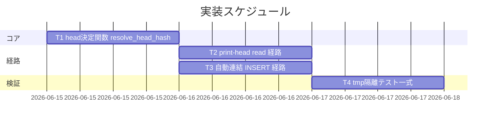

# 実装計画書: 台帳 write-workflow-log の prev_hash 自動連結

**プロジェクト名**: 台帳 write-workflow-log の prev_hash 自動連結（DB head 自動取得）
**作成日**: 2026 年 06 月 14 日
**最終更新**: 2026 年 06 月 14 日

> **重要**: **このドキュメントは常に更新**: 実装計画の変更、進捗状況の更新、バグの記録などがあった場合は、即座にこのドキュメントを更新してください。
> **必須項目**: 「必須」と明記した欄は空欄・抽象語のみで提出しないこと。テスト観点・BDD 仕様は具体ケースを 1 件以上記載すること。
>
> **用語**: [.agents/CONCEPTS.md §用語規約](../../../.agents/CONCEPTS.md#用語規約) を参照。

---

## 1. 実装概要

### 1.1 実装方針（必須）

`.agents/scripts/write-workflow-log.sh` の 1 ファイル内で、head 決定関数 `resolve_head_hash`（`SELECT entry_hash FROM workflow_log ORDER BY rowid DESC LIMIT 1`）を追加し、これを (a) `--print-head` read 経路と (b) PREV_HASH 未指定時の自動連結（flock 取得後・INSERT 直前）で共有する。既存スキーマ・CHECK・`gen_entry_hash`・引数 I/F は変更しない（02 §1.1／§3）。

### 1.2 実装順序（必須: 1 件以上）



1. **T1**: head 決定関数 `resolve_head_hash` の追加（共有 Query）
2. **T2**: `--print-head` read サブコマンドの追加
3. **T3**: PREV_HASH 未指定時の自動連結（INSERT 経路への差し込み）
4. **T4**: tmp 隔離テストの作成・実行（SC-01〜05 検証）

---

## 2. タスク分解

**必須**: 各タスクには「テスト観点」（2.x.3）と「単体テスト仕様（BDD）」（2.x.4）を記載する。観点定義は [02\_設計 §6](./02_設計.md) および [TEST_BDD_FORMAT.md](../../../.agents/TEST_BDD_FORMAT.md) を参照。

### 2.1 タスク 1: head 決定関数 `resolve_head_hash` の追加

#### 2.1.1 概要（必須）

最新 entry（head）を暗黙 rowid で一意決定し、その `entry_hash` を返す共有 Query 関数を追加する。

#### 2.1.2 実装内容（必須: 1 件以上）

- `write-workflow-log.sh` に関数 `resolve_head_hash` を追加。本体は `sqlite3 "$WF_DB" "SELECT entry_hash FROM workflow_log ORDER BY rowid DESC LIMIT 1;"`（固定 read クエリ）。
- DB ファイル未存在・`workflow_log` 不在・旧スキーマ（`entry_id` 無し）のときは空文字列を返す（異常終了しない）。
- head 取得を **1 か所に集約**（02 §2.1 単一責務）。自動連結と `--print-head` がこの関数のみを使う。

#### 2.1.3 テスト観点（必須）

**参照**: 観点定義は [02\_設計 §6](./02_設計.md) および [RULES のテスト戦略](../../../.agents/RULES.md#テスト戦略必須要件)。**テストは tmp 隔離（`mktemp -d` 一時 DB）で実施し、本リポの `.workflow/workflow.db` を使わない。**

##### 単体（本タスクの具体ケース・必須 1 件以上）

- 1 件記録済みの一時 DB で `resolve_head_hash` がその entry の `entry_hash` を返す（正常系）。
- 2 件記録済みのとき、**後から INSERT した方**（rowid 大）の `entry_hash` を返す（順序キー検証）。
- entry 0 件（空 DB・テーブルのみ）で空文字列を返す（境界値・SC-02/03）。

##### 結合/API（本タスクの具体ケース・該当時は必須 1 件以上）

- `ts_utc` を UTC（`...Z`）と JST（`+0900`）混在で 2 件挿入しても、`MAX(ts_utc)` ではなく rowid 順で正しい head を返す（形式混在の回帰防止）。

##### E2E/受け入れ（本タスクの具体ケース・未達時は理由記載）

- 該当なし（関数単体。E2E はスクリプト I/F 経由で T2/T3 のテストがカバー）。

##### バリデーション（該当する場合の具体ケース）

- 該当なし（read 専用・入力なし）。

#### 2.1.4 単体テスト仕様（BDD）（必須）

```gherkin
Feature: head 決定関数 resolve_head_hash
  Scenario: rowid 最大の entry_hash を head として返す
    Given 一時 DB に entry A を INSERT し、その後 entry B を INSERT した
    And entry A は ts_utc が "...Z"（UTC）、entry B は ts_utc が "+0900"（JST）である
    When resolve_head_hash を実行する
    Then 出力は entry B（最後に INSERT した行）の entry_hash である
    And ts_utc の文字列比較には依存しない
```

**テストコード例（bash + sqlite3。Given/When/Then をインラインコメントで明記）**

```bash
#!/usr/bin/env bash
# Given: クリーンな一時 DB を作り、schema を流して entry A→B の順に INSERT
TMP="$(mktemp -d)"; DB="$TMP/workflow.db"
sqlite3 "$DB" < .agents/ledger/schema.sql
# A: ts_utc は UTC 形式 / B: ts_utc は JST 形式（文字列比較だと A>B になり得る組合せ）
insert_entry "$DB" "hashA" "2026-06-14T10:00:00Z"
insert_entry "$DB" "hashB" "2026-06-14T18:00:00+0900"
# When: head 決定関数を呼ぶ（rowid DESC LIMIT 1）
head="$(sqlite3 "$DB" "SELECT entry_hash FROM workflow_log ORDER BY rowid DESC LIMIT 1;")"
# Then: 最後に INSERT した B の entry_hash が返る
[[ "$head" == "hashB" ]] || { echo "FAIL: head=$head"; exit 1; }
rm -rf "$TMP"
```

#### 2.1.5 依存関係

- なし（基盤関数。T2/T3 がこれに依存）。

#### 2.1.6 見積もり

- **工数**: 0.5h ／ **優先度**: 高

### 2.2 タスク 2: `--print-head` read サブコマンドの追加

#### 2.2.1 概要（必須）

書記以外も sqlite3 直接実行なしで head を確認できる read 専用フラグを追加する。

#### 2.2.2 実装内容（必須: 1 件以上）

- 引数解釈の**最初**（`AGENT_ROLE` ガードより前）で `$1 == "--print-head"` を判定し、`resolve_head_hash` の結果を stdout に出して `exit 0`（02 §3.2.4）。
- DB 未作成・空 DB・旧スキーマ時は空文字列・exit 0。
- 固定 read クエリのみ（任意 SQL を受け付けない）。

#### 2.2.3 テスト観点（必須）

**tmp 隔離で実施。**

##### 単体（必須 1 件以上）

- 1 件記録済み一時 DB で `--print-head` が head の `entry_hash` を stdout に返し exit 0（SC-03）。
- 空 DB（テーブルのみ／DB 未作成）で `--print-head` が空文字列・exit 0（SC-03 後半）。

##### 結合/API（該当時は必須 1 件以上）

- `AGENT_ROLE` を scribe 以外（または未設定）にしても `--print-head` が成功する（read 経路は scribe 不要・§3.2.4）。

##### E2E/受け入れ（未達時は理由記載）

- 監査が sqlite3 を直接叩かず head を取得できること（経路一本化の維持）をスクリプト実行で確認。

##### バリデーション（該当する場合）

- 不正な追加引数時に使用法を stderr に出し非ゼロ終了してよい（正規の単独 `--print-head` は exit 0 を維持）。

#### 2.2.4 単体テスト仕様（BDD）（必須）

```gherkin
Feature: sanctioned な head 読出し
  Scenario: --print-head が現 head の entry_hash を返す
    Given 一時 DB に 1 件以上の entry が記録済みである
    When write-workflow-log.sh を --print-head で実行する
    Then 現 head の entry_hash が標準出力に返り、exit 0 である
    And sqlite3 を直接実行する必要がない

  Scenario: 空 DB では head 不在（空文字列）を返す
    Given 一時 DB に entry が 1 件も無い、または DB が未作成である
    When write-workflow-log.sh を --print-head で実行する
    Then 標準出力は空文字列で、exit 0 である
```

**テストコード例（Given/When/Then をインラインコメントで明記）**

```bash
# Given: 1 件記録済みの一時 DB を用意（PROJECT_ROOT を一時ディレクトリに向ける）
TMP="$(mktemp -d)"; mkdir -p "$TMP/.workflow"
sqlite3 "$TMP/.workflow/workflow.db" < .agents/ledger/schema.sql
insert_entry "$TMP/.workflow/workflow.db" "headhash" "2026-06-14T10:00:00Z"
# When: --print-head を実行（書記以外でも可・AGENT_ROLE 未設定）
out="$(PROJECT_ROOT="$TMP" .agents/scripts/write-workflow-log.sh --print-head)"; rc=$?
# Then: head の entry_hash が返り exit 0
[[ "$out" == "headhash" && $rc -eq 0 ]] || { echo "FAIL out=$out rc=$rc"; exit 1; }
rm -rf "$TMP"
```

#### 2.2.5 依存関係

- T1（`resolve_head_hash`）に依存。

#### 2.2.6 見積もり

- **工数**: 0.5h ／ **優先度**: 高

### 2.3 タスク 3: PREV_HASH 未指定時の自動連結（INSERT 経路）

#### 2.3.1 概要（必須）

新スキーマかつ PREV_HASH 未指定のとき、flock 取得後・INSERT 直前に head を取得し `prev_hash` に連結する。

#### 2.3.2 実装内容（必須: 1 件以上）

- 新スキーマ分岐（既存 322 行付近）の **INSERT 直前**で、`PREV_HASH` が空のとき `PREV_HASH="$(resolve_head_hash)"` を実行（02 §3.3.1）。flock 取得後であることを担保（既存 202-205 行の後）。
- 取得結果が空（head 不在）なら従来どおり `NULLIF('$E_PH','')` で `prev_hash=NULL`。
- PREV_HASH 明示指定時は `resolve_head_hash` を呼ばずその値を使う（02 §3.3.2／SC-04）。
- `gen_entry_hash` の入力は変更しない（prev_hash 非含有・SC-05）。

#### 2.3.3 テスト観点（必須）

**tmp 隔離で実施。**

##### 単体（必須 1 件以上）

- PREV_HASH 未指定で連続 2 件記録すると、2 件目の `prev_hash` が 1 件目の `entry_hash` に一致（SC-01）。
- 空 DB に初回記録すると `prev_hash` が NULL・exit 0（SC-02）。
- PREV_HASH を明示指定すると `prev_hash` が指定値（自動取得で上書きされない・SC-04）。

##### 結合/API（該当時は必須 1 件以上）

- 連続 2 件後に `--print-head` が 2 件目の entry_hash を返し、自動連結と head 読出しが同一ロジックで整合する。

##### E2E/受け入れ（未達時は理由記載）

- 連続記録後にチェーンに NULL の中間 entry が生じない（`SELECT COUNT(*) FROM workflow_log WHERE rowid>1 AND prev_hash IS NULL` が 0）。

##### バリデーション（該当する場合）

- 既存 CHECK（summary 6 文字以上・dod_met∈{0,1}・command 許可リスト・scribe 限定）が維持され、回帰しない（SC-05）。

#### 2.3.4 単体テスト仕様（BDD）（必須）

```gherkin
Feature: prev_hash 自動連結
  Scenario: 連続 2 件で 2 件目の prev_hash が 1 件目の entry_hash に一致
    Given 一時 DB に 1 件目を PREV_HASH 未指定で記録済みである
    When 2 件目を PREV_HASH 未指定で記録する
    Then 2 件目の prev_hash が 1 件目の entry_hash に一致する
    And rowid>1 で prev_hash が NULL の中間 entry が存在しない

  Scenario: PREV_HASH を明示した場合は上書きしない
    Given 一時 DB に entry が記録済みである
    When PREV_HASH に固定値を指定して記録する
    Then 記録された prev_hash は指定値であり、head の自動取得値で上書きされない
```

**テストコード例（Given/When/Then をインラインコメントで明記）**

```bash
# Given: クリーン一時環境（PROJECT_ROOT を tmp に）。1 件目を PREV_HASH 未指定で記録
TMP="$(mktemp -d)"
run() { PROJECT_ROOT="$TMP" AGENT_ROLE=scribe DOCUMENT_ID="$1" \
  .agents/scripts/write-workflow-log.sh requirement-discovery "$2" 1 "2026-06-14T10:00:00Z"; }
run "11111111-1111-1111-1111-111111111111" "first entry"
# When: 2 件目も PREV_HASH 未指定で記録
run "22222222-2222-2222-2222-222222222222" "second entry"
DB="$TMP/.workflow/workflow.db"
e1="$(sqlite3 "$DB" "SELECT entry_hash FROM workflow_log ORDER BY rowid ASC LIMIT 1;")"
p2="$(sqlite3 "$DB" "SELECT prev_hash FROM workflow_log ORDER BY rowid DESC LIMIT 1;")"
# Then: 2 件目の prev_hash が 1 件目の entry_hash に一致し、中間 NULL が無い
[[ "$p2" == "$e1" ]] || { echo "FAIL p2=$p2 e1=$e1"; exit 1; }
nulls="$(sqlite3 "$DB" "SELECT COUNT(*) FROM workflow_log WHERE rowid>(SELECT MIN(rowid) FROM workflow_log) AND prev_hash IS NULL;")"
[[ "$nulls" == "0" ]] || { echo "FAIL nulls=$nulls"; exit 1; }
rm -rf "$TMP"
```

#### 2.3.5 依存関係

- T1（`resolve_head_hash`）に依存。

#### 2.3.6 見積もり

- **工数**: 0.5h ／ **優先度**: 高

### 2.4 タスク 4: tmp 隔離テスト一式の作成・実行

#### 2.4.1 概要（必須）

SC-01〜05 を `mktemp -d` 隔離環境で検証するテストスクリプトを用意し、実行・結果記録する。

#### 2.4.2 実装内容（必須: 1 件以上）

- テストスクリプト（例: `.agents/scripts/test/test-write-workflow-log-prevhash.sh` 等、配置は implement 時に確定）で T1〜T3 の BDD ケースを `mktemp -d` 隔離・`git archive HEAD | tar -x` クリーン環境で実行。
- 本リポの `.workflow/workflow.db` を一切使わない・変更しない（[.agents-project/自己拡張ワークフロー.md](../../../.agents-project/自己拡張ワークフロー.md) §テストの tmp 隔離）。
- 全ケース green を確認し、結果を verify-and-close の 04_review に記載する（後続フェーズ）。

#### 2.4.3 テスト観点（必須）

##### 単体（必須 1 件以上）

- 各テストが一時ディレクトリ内で完結し、終了後に `rm -rf` で片付くこと（隔離の自己検証）。

##### 結合/API（該当時は必須 1 件以上）

- SC-01〜05 を網羅し、すべて exit 0 で green。

##### E2E/受け入れ（未達時は理由記載）

- スクリプト I/F（記録 I/F ＋ `--print-head`）経由で 01 の 3 ユースケース全シナリオを実行する。

##### バリデーション（該当する場合）

- テスト実行が本番 DB（`.workflow/workflow.db`）に副作用を与えないこと（実行前後で本番 DB の mtime・行数が不変）。

#### 2.4.4 単体テスト仕様（BDD）（必須）

```gherkin
Feature: tmp 隔離テストハーネス
  Scenario: テストは一時環境で完結し本番 DB を汚さない
    Given mktemp -d で作った一時環境で全ケースを実行する
    When SC-01〜05 のテストを実行する
    Then すべて green（exit 0）である
    And 本リポの .workflow/workflow.db は変更されない
```

**テストコード例（Given/When/Then をインラインコメントで明記）**

```bash
# Given: 本番 DB の現状（行数）を記録
before="$(sqlite3 .workflow/workflow.db 'SELECT COUNT(*) FROM workflow_log;' 2>/dev/null || echo NA)"
# When: tmp 隔離テストを実行
bash .agents/scripts/test/test-write-workflow-log-prevhash.sh
# Then: 本番 DB の行数が不変（副作用なし）
after="$(sqlite3 .workflow/workflow.db 'SELECT COUNT(*) FROM workflow_log;' 2>/dev/null || echo NA)"
[[ "$before" == "$after" ]] || { echo "FAIL: 本番 DB が変化 before=$before after=$after"; exit 1; }
```

#### 2.4.5 依存関係

- T1・T2・T3 に依存。

#### 2.4.6 見積もり

- **工数**: 1h ／ **優先度**: 高

---

## テスト観点

- **head 決定キー（rowid）**: 形式混在 `ts_utc` でも rowid 順で正しい head を返す（T1）。
- **自動連結**: 連続 2 件で連結・中間 NULL なし（SC-01）／空 DB 初回 NULL（SC-02）／明示指定は非上書き（SC-04）（T3）。
- **read 経路**: `--print-head` が head／空を返し exit 0（SC-03）。scribe 不要（T2）。
- **非破壊**: CHECK・`gen_entry_hash`・scribe 限定が回帰しない（SC-05）。
- **隔離**: 全テストは tmp 隔離で本番 DB を汚さない（T4）。

## 単体テスト

- 各タスクの §2.x.4 に BDD 仕様とテストコード例を記載。対象は `resolve_head_hash`（関数）、`--print-head`（read 経路）、自動連結（INSERT 経路）。すべて `mktemp -d` 一時 DB で実施。

## BDD

- 01 の 3 ユースケース（prev_hash 自動連結 / sanctioned head 読出し / 並行 head 整合）の全シナリオを §2.1.4・§2.2.4・§2.3.4・§2.4.4 の Given/When/Then にマップ済み。SC-01〜05 と対応。

---

## 3. 実装スケジュール

### 3.1 マイルストーン

| マイルストーン | 期日 | 成果物 |
| -------------- | ---- | ------ |
| コア関数完成 | T1 完了 | `resolve_head_hash` |
| 両経路完成 | T2/T3 完了 | `--print-head` ＋自動連結 |
| 検証完了 | T4 完了 | tmp 隔離テスト green・04_review 記載 |

### 3.2 実装フェーズ

#### フェーズ 1: コア＋経路＋検証

- **期間**: 1〜2 日（小規模）
- **タスク**: T1 → (T2, T3 並行) → T4

---

## 4. テスト計画

テスト観点・レベル・BDD 形式は [02\_設計 §6](./02_設計.md) および RULES・TEST_BDD_FORMAT を参照。各タスク §2.x.3 に具体ケース、§2.x.4 に BDD 仕様を記載。

### 4.1 テストの優先順位

- SC-01（自動連結）・SC-04（非上書き）・SC-05（非破壊）はクリティカル。厚くテストする。
- 形式混在 `ts_utc` での head 決定（rowid 採用根拠）は回帰テストに必ず含める。

---

## 5. リスク管理

### 5.1 実装リスク

- **リスク**: `--print-head` 分岐を `AGENT_ROLE` ガードより後ろに置くと、書記以外が head を確認できず 00 効果3 を満たせない。
  - **対策**: 引数解釈の最初に `--print-head` を判定（02 §3.2.4）。テスト（T2 結合）で AGENT_ROLE 未設定でも成功することを検証。
- **リスク**: PROJECT_ROOT を tmp に向けてもスクリプトがスキーマ正本（`AGENTS_ROOT/ledger/schema.sql`）を本リポから解決するため、テストが本リポ参照に依存する。
  - **対策**: schema.sql は read のみ・DB 書き込みは tmp 配下。本番 `.workflow/workflow.db` への副作用がないことを T4 §2.4.4 で検証。
- **リスク**: 旧スキーマ DB で自動連結を誤って実行し列不在で失敗する。
  - **対策**: 自動連結・head 取得は新スキーマ（`entry_id` あり）分岐内に限定（02 §3.3.3）。

---

## 6. 参考資料

### プロジェクトドキュメント

- [`02_設計.md`](./02_設計.md) - 設計
- `.agents/scripts/write-workflow-log.sh`、`.agents/ledger/schema.sql`、`.agents/ledger/schema.md`

### その他の参考資料

- [.agents-project/自己拡張ワークフロー.md](../../../.agents-project/自己拡張ワークフロー.md)（テストの tmp 隔離・issue 配置）
- [.agents/TEST_BDD_FORMAT.md](../../../.agents/TEST_BDD_FORMAT.md)（BDD 形式）

---

## 7. 前のステップ

- **前**: [`02_設計.md`](./02_設計.md) - 設計フェーズ

---

## 8. 次のステップ

- 本プロジェクトは 1 つの issue（単一タスク群）であり、サブ issue に分割しない。承認後、実装フェーズ（implement-feature）に直接進む。

**用語**: [.agents/CONCEPTS.md §用語規約](../../../.agents/CONCEPTS.md#用語規約) を参照。
