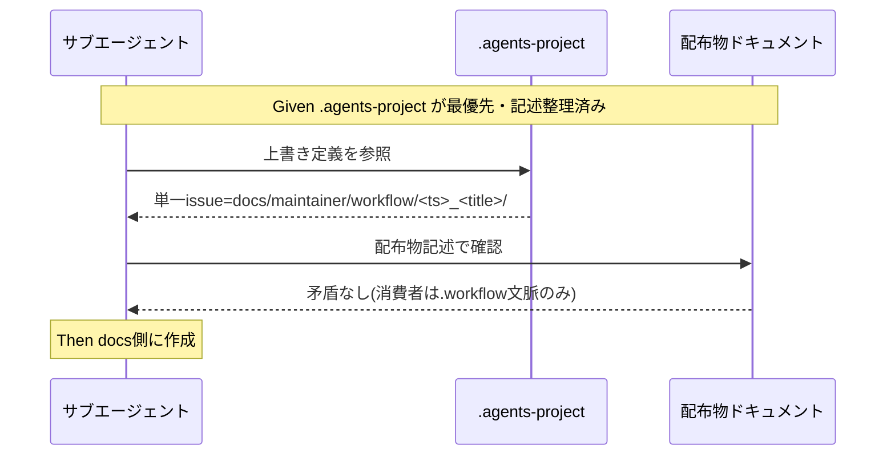

# 要件定義書: issue 配置先の正本統一（.workflow→docs/maintainer/workflow 移行の不整合是正）

**プロジェクト名**: issue 配置先の正本統一（.workflow→docs/maintainer/workflow 移行の不整合是正）  
**作成日**: 2026 年 06 月 14 日  
**最終更新**: 2026 年 06 月 14 日

> **重要**: **このドキュメントは常に更新**: 要件の変更や追加があった場合は、即座にこのドキュメントを更新してください。ドキュメントは「生きているドキュメント」として扱い、実装内容と常に同期させます。
>
> **用語**: [.agents/CONCEPTS.md §用語規約](../../../../.agents/CONCEPTS.md#用語規約) を参照。

---

## 1. 概要

### 1.1 システム概要

本リポジトリは配布パッケージ（正本）と自己拡張する消費者の二役を兼ねる。`.workflow/` は消費者ランタイム生成物（`.gitignore` 対象）、`docs/maintainer/workflow/` は本リポの自己拡張 issue（git 追跡）という名前空間分離が `.agents-project/自己拡張ワークフロー.md` で定義されている。本 issue は、この分離に配布物ドキュメントの記述・memo パス・close 時のリンク補正運用が追従しきれていない不整合（H1 / M2 / H2）を是正し、正本記述を一貫させる。

### 1.2 用語集

| 用語 | 説明 |
| ---- | ---- |
| 配布物 / パッケージ正本 | 消費者へ配る `.agents/`・`AGENTS.md`・`CLAUDE.md`・`.workflow/templates/` 等。git 追跡。 |
| 消費者ランタイム生成物 | 消費者プロジェクトで実行時に生成される `.workflow/<issue>/`・`.workflow/workflow.db*`。`.gitignore` 対象。 |
| 自己拡張 issue | 本リポを保守者が拡張する開発記録。`docs/maintainer/workflow/<timestamp>_<title>/` に置き git 追跡する。 |
| close | 完了したトップレベル issue を `docs/maintainer/workflow/close/<issue>/` へ移動して保存する運用。 |
| H1 / M2 / H2 | 本 issue が扱う不整合（H1=記述の自己矛盾、M2=memo パス上書き欠落、H2=close 後リンク切れ）。 |

---

## 2. 機能要件

### 2.1 ユーザーストーリー

#### ストーリー 1: 作成先記述の自己矛盾の解消（H1）

- **As a** 本リポの保守者／委譲を受けるサブエージェント
- **I want to** 配布物ドキュメントから「自己拡張 issue の作成先＝`docs/maintainer/workflow/`」「消費者ランタイム＝`.workflow/`」が矛盾なく一意に読み取れる状態にしたい
- **So that** issue を誤って `.gitignore` 対象の `.workflow/` に作成し、自己拡張の開発記録を失うことを防げる

**受け入れ基準**:

- `CLAUDE.md`:18-19 の「正は docs/...」と「`.workflow/<timestamp>_<title>/` に作成する」の自己矛盾が解消されている。
- 配布物ドキュメント（`.agents/` 配下・`CLAUDE.md`）に残る `.workflow/{issue}` / `.workflow/<timestamp>` 系の記述が、消費者ランタイムを指す文脈として読めるか、`.agents-project/` の上書き参照に置き換わっているかのいずれかである（本リポの作成先を `.workflow/` と断ずる記述が残っていない）。

#### ストーリー 2: memo パスの正本統一（M2）

- **As a** 自己拡張 issue で作業するサブエージェント
- **I want to** memo（証跡）を issue 本体と同じ `docs/maintainer/workflow/` 名前空間に置きたい
- **So that** issue 本体は git 追跡され memo は `.gitignore` で消える、という記録分裂を防げる

**受け入れ基準**:

- `.agents-project/自己拡張ワークフロー.md` に memo パスの上書き定義が追加され、自己拡張 issue の memo 配置先が `docs/maintainer/workflow/<issue>/memo/`（または同等の git 追跡パス）であることが明記されている。
- 配布物側（`run_command.md`:57・`TEMPLATES.md`:12-13）の `.workflow/{issue}/memo/` は消費者ランタイムの標準として保持され、本リポ自己拡張では `.agents-project/` の上書きが優先される旨が辿れる。

#### ストーリー 3: close 移動時のリンク健全性（H2）

- **As a** close 済み issue を後から参照する保守者／レビュアー
- **I want to** close 配下のドキュメントから `.agents/` 等の必読ファイルへ相対リンクで辿れるようにしたい
- **So that** レビュー・監査時に参照経路が壊れない

**受け入れ基準**:

- `docs/maintainer/workflow/close/<issue>/` 配下の相対リンク（現状 `../../../../` 4 階層上＝74 件）が正しい階層（`../../../../../` 5 階層上）に補正され、未解決リンク 0 件である。
- close 移動時にパス補正を行う運用が `.agents-project/`（上書き定義）に明文化され、以後の close で同じリンク切れが再発しない手順になっている。

### 2.2 BDD ユースケース

#### ユースケース 1: 自己拡張 issue の作成先判定（H1）

サブエージェントが本リポで新規 issue 作成タスクを受領したとき、作成先を一意に決定できること。

**シナリオ 1: 単一 issue の作成先が docs に確定する**

```gherkin
Feature: 作成先記述の正本統一
  Scenario: 本リポで単一issueの作成先を決める
    Given サブエージェントが .agents-project と配布物ドキュメントを読了している
    And 配布物ドキュメントの作成先記述が名前空間分離に沿って整理されている
    When 新規の単一issue作成タスクを受領する
    Then 作成先として docs/maintainer/workflow/<timestamp>_<title>/ を選ぶ
    And .workflow/<timestamp>_<title>/ を本リポの作成先として選ばない
```

**処理フロー**:



**シナリオ 2: 消費者ランタイム記述は壊さない**

```gherkin
Feature: 作成先記述の正本統一
  Scenario: 消費者ランタイムを指す .workflow 記述を保持する
    Given 配布物ドキュメントに消費者ランタイムを指す .workflow/<issue>/ 記述がある
    When H1の是正で作成先記述を整理する
    Then 消費者ランタイム文脈の .workflow 記述は意味を保ったまま残る
    And enforcement/audit が当該記述で FAIL しない
```

#### ユースケース 2: 自己拡張 issue の memo 記録（M2）

自己拡張 issue 作業中に memo を作成するとき、git 追跡される名前空間に置けること。

**シナリオ 1: memo が docs 側に統一される**

```gherkin
Feature: memoパスの正本統一
  Scenario: 自己拡張issueのmemoをgit追跡パスに置く
    Given .agents-project に memoパスの上書き定義がある
    And 自己拡張issueが docs/maintainer/workflow/<issue>/ にある
    When サブエージェントが TZ=Asia/Tokyo date +%Y%m%d_%H%M%S を実行してmemoを作成する
    Then memoは docs/maintainer/workflow/<issue>/memo/ 配下に作成される
    And memoは git 追跡対象となり issue本体と同一名前空間に置かれる
```

**シナリオ 2: 消費者の memo 既定は不変**

```gherkin
Feature: memoパスの正本統一
  Scenario: 消費者ランタイムのmemo既定を維持する
    Given run_command.md と TEMPLATES.md は memo を .workflow/{issue}/memo/ と定義している
    When M2 を是正する
    Then 消費者ランタイムの既定 .workflow/{issue}/memo/ は保持される
    And 本リポ自己拡張では .agents-project の上書きが優先される旨が辿れる
```

#### ユースケース 3: close 移動とリンク補正（H2）

close 済み issue 配下のリンクが解決すること、および close 運用にパス補正手順があること。

**シナリオ 1: close 配下の相対リンクが全件解決する**

```gherkin
Feature: close時のリンク健全性
  Scenario: close配下から .agents へのリンクを解決する
    Given close/<issue>/ 配下に ../../../../ で始まる相対リンクが74件ある
    And close/<issue>/ はリポジトリルートから5階層下にある
    When 不足分を補正して ../../../../../ にする
    Then close配下の相対リンクが全件解決する(未解決0件)
```

**シナリオ 2: close 運用にパス補正手順が組み込まれる**

```gherkin
Feature: close時のリンク健全性
  Scenario: 以後のcloseで同じリンク切れを再発させない
    Given .agents-project の close 上書きにパス補正手順が明文化されている
    When 新たにトップレベルissueを close へ移動する
    Then 移動に伴う相対リンクの階層補正が運用として実施される
    And リンクチェックで未解決0件を確認できる
```

### 2.3 ビジネスルール

- 正本・最優先は `.agents-project/`。同名・同目的の定義は `.agents-project` を採用する。配布物側は重複再定義せず参照でつなぐ。
- 名前空間分離の原則を崩さない: 自己拡張＝`docs/maintainer/workflow/`（git 追跡）、消費者ランタイム＝`.workflow/`（`.gitignore`）。
- memo / issue フォルダのプレフィックスは `TZ=Asia/Tokyo date +%Y%m%d_%H%M%S` または `memo-prefix.sh` の実行結果のみを用いる（推測・固定・未来日時禁止）。

---

## 3. 非機能要件

### 3.1 パフォーマンス要件

- ドキュメント・ルール記述の是正であり、ランタイム性能要件はない。

### 3.2 セキュリティ要件

- 高リスク操作（外部書き込み・大量削除）を伴わない。事前確認の特例対象外。

### 3.3 ユーザビリティ要件

- 是正後の記述は、保守者・サブエージェントが「自己拡張＝docs」「消費者＝.workflow」を迷わず判別できる明確さを持つこと。

### 3.4 可用性要件

- 該当なし（ドキュメント整合性タスク）。

---

## 4. 外部インターフェース要件

### 4.1 API 要件

- 該当なし。委譲 I/F（`run_command.md`）の契約は変更しない。記述整合のみ行う。

### 4.2 データ形式要件

- ドキュメントは既存テンプレート（00〜04）の書式・frontmatter 規約に従う。リンクは相対パスで記述する。

---

## 5. 制約事項

- `.agents-project/自己拡張ワークフロー.md` が最優先（`.agents/`・`CLAUDE.md` より優先）。
- ルート `.gitignore` の名前空間分離前提を壊さない。
- enforcement / audit（`.agents/enforcement/ci/audit.sh` 等）が参照するパス前提と矛盾しない。
- close 配下の正しい相対深さは `../../../../../`（5 階層上）。タスク当初想定の「2 階層不足」は実測で否定され、不足は 1 階層（対象 74 件）。

---

## 6. 参考資料

### プロジェクトドキュメント

- [`00_要求定義.md`](./00_要求定義.md) - 要求定義
- [.agents-project/自己拡張ワークフロー.md](../../../../.agents-project/自己拡張ワークフロー.md) - 名前空間分離・上書き定義の正本

### その他の参考資料

- [CLAUDE.md](../../../../CLAUDE.md):18-19、[.agents/workflow/PHASES.md](../../../../.agents/workflow/PHASES.md):34、[.agents/skills/agent/run_command.md](../../../../.agents/skills/agent/run_command.md):57、[.agents/workflow/TEMPLATES.md](../../../../.agents/workflow/TEMPLATES.md):12-13
- [.agents/spec/06_設計判断の優先順位.md](../../../../.agents/spec/06_設計判断の優先順位.md)

---

## 7. 前のステップ

この要件定義書は、以下のドキュメントを基に作成されています：

- **前**: [`00_要求定義.md`](./00_要求定義.md) - 要求定義フェーズ

---

## 8. 次のステップ

この要件定義書の承認後、以下のドキュメントを作成します：

- **次**: [`02_設計.md`](./02_設計.md) - 設計フェーズ
