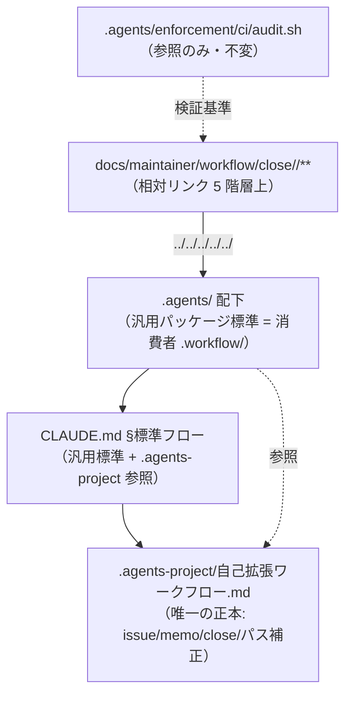
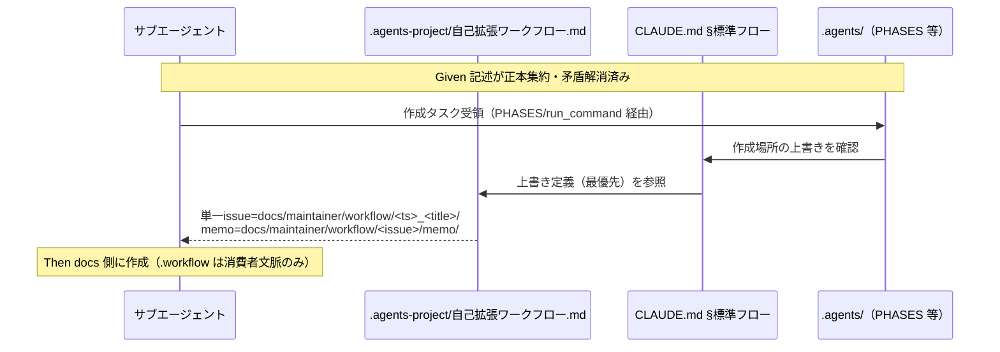

# 設計書: issue 配置先の正本統一（.workflow→docs/maintainer/workflow 移行の不整合是正）

**プロジェクト名**: issue 配置先の正本統一（.workflow→docs/maintainer/workflow 移行の不整合是正）  
**作成日**: 2026 年 06 月 14 日  
**最終更新**: 2026 年 06 月 14 日

> **重要**: **このドキュメントは常に更新**: 設計の変更や追加があった場合は、即座にこのドキュメントを更新してください。ドキュメントは「生きているドキュメント」として扱い、実装内容と常に同期させます。
>
> **用語**: [.agents/CONCEPTS.md §用語規約](../../../../.agents/CONCEPTS.md#用語規約) を参照。

---

## 1. 設計概要

**必須**: 設計方針・原則は [.agents/spec/01\_設計原則.md](../../../../.agents/spec/01_設計原則.md) を先に参照した上で、本プロジェクトに適用するものを選び記載する。

### 1.1 設計方針

ドキュメント／ルール記述の不整合（H1 / M2 / H2）を是正するにあたり、**「正本（source of truth）を 1 か所に定め、他はそれを相互参照する」**という DRY 原則を貫く。本リポ固有の上書き（issue / memo / close 配置・close 時パス補正）の正本は **`.agents-project/自己拡張ワークフロー.md` の 1 ファイル**に集約し、配布物側（`CLAUDE.md`・`.agents/`）には同一定義を重複させず「`.agents-project/` の上書きを最優先で参照する」旨だけを置く（[06\_設計判断の優先順位 §docs と実装の不整合を放置してはならない](../../../../.agents/spec/06_設計判断の優先順位.md)）。

### 1.2 設計原則（本プロジェクトで適用するもの）

- **単一責務**: 本リポ固有の配置上書き定義は `.agents-project/自己拡張ワークフロー.md` のみが持つ。配布物側ファイルは「汎用パッケージ標準（消費者＝`.workflow/`）の記述」と「`.agents-project/` への参照」だけを持ち、固有定義を再記述しない。
- **明確な境界**: 「配布物（パッケージ正本・消費者ランタイム＝`.workflow/`）」と「本リポ自己拡張（＝`docs/maintainer/workflow/`）」の 2 つの名前空間の境界を、記述上で曖昧にしない。同一語 `.workflow/` が指す文脈（消費者ランタイム vs 本リポ作成先）を分離して読めるようにする。
- **AIフレンドリー設計**: サブエージェントが作成先・memo 配置・close 後のリンクを迷わず一意に判定できる明確さを優先する（意図が分かる記述・参照集約）。

---

## 2. アーキテクチャ設計

### 2.1 責務・境界・参照関係

#### 2.1.1 責務一覧（本 issue が触れる「ドキュメント・コンポーネント」）

| コンポーネント | 責務（1 文） |
| -------------- | ------------ |
| `.agents-project/自己拡張ワークフロー.md` | 本リポ固有の上書き（issue 配置・**memo 配置（新規）**・close 配置・**close 時パス補正運用（新規明文化）**）の**唯一の正本**。 |
| `CLAUDE.md`（§issue 作成タスク受領時の標準フロー） | 配布物としての汎用標準（消費者＝`.workflow/`）を示しつつ、本リポでは `.agents-project/` の上書きを最優先参照する旨を矛盾なく記す。 |
| `.agents/workflow/PHASES.md`・`.agents/workflow/TEMPLATES.md`・`.agents/skills/agent/run_command.md`・`.agents/commands/requirement-discovery.md` 等（配布物） | 汎用パッケージ標準（消費者ランタイム＝`.workflow/`）の記述を保持する。本リポ固有の上書きは再定義せず `.agents-project/` を相互参照する。 |
| `docs/maintainer/workflow/close/<issue>/**`（close 済み成果物 00〜04） | close 後も `.agents/` 等への相対リンクが全件解決すること（H2 のリンク補正対象）。 |
| `.agents/enforcement/ci/audit.sh`（参照のみ・**変更しない**） | 既存の監査（特に #29 実装前 04 検知）が、是正後も `.workflow` と `docs/maintainer/workflow` 双方を走査して FAIL しないことの検証基準。 |

#### 2.1.2 境界

- **入力**: 既存の配布物ドキュメント群・`.agents-project/` 上書き定義・close 配下の成果物。
- **出力**: 矛盾のない記述（H1）・memo 上書き定義の追加（M2）・close 配下 74 リンクの補正と close 運用の明文化（H2）。
- **他責務との境界（本 issue の範囲外）**:
  - 消費者ランタイムにおける `.workflow/<issue>/`・`.workflow/workflow.db*` の**生成挙動そのもの**（配布パッケージ仕様）は変更しない。
  - テンプレート（00〜04）の**書式・セクション構成**の改訂、`audit.sh` 等 enforcement スクリプトの**ロジック変更**は範囲外。
  - `.workflow/templates/`（配布物テンプレートの正本パス）の位置・役割は維持し、ここを `docs/...` に書き換えない。

#### 2.1.3 参照関係（依存の向き）

- `CLAUDE.md` → `.agents-project/自己拡張ワークフロー.md`（作成先・memo・close 上書きを参照）
- `.agents/`（PHASES / run_command / requirement-discovery 等）→ `CLAUDE.md §issue 作成タスク受領時の標準フロー` → `.agents-project/`（作成場所の上書きは `.agents-project/` 最優先、の既存連鎖を維持）
- `docs/maintainer/workflow/close/<issue>/**` → `.agents/**`（相対リンク。5 階層上で解決）
- **正本の一方向参照**: 固有上書きの定義は `.agents-project/` のみが持ち、他は参照のみ（循環参照なし）。

### 2.2 システムアーキテクチャ

- **採用パターン**: 単一正本（Single Source of Truth）＋相互参照（cross-reference）。ドキュメント整合タスクのため、コードアーキテクチャパターンではなく「正本集約 + 参照」の構造方針を採る。
- **根拠**: [06\_設計判断の優先順位](../../../../.agents/spec/06_設計判断の優先順位.md)（3. 仕様との整合性・「docs と実装の不整合を放置してはならない」）および [01\_設計原則 §単一責務・§明確な境界](../../../../.agents/spec/01_設計原則.md)。重複再定義を増やさない（00_要求定義 §3.4 保守性）。

#### 2.2.1 名前空間の境界（本 issue で一貫させる対応）

| 文脈 | パス | git | 記述上の扱い |
| ---- | ---- | --- | ------------ |
| 消費者ランタイム生成物 | `.workflow/<issue>/`, `.workflow/{issue}/memo/`, `.workflow/workflow.db*` | `.gitignore` | 配布物側で「汎用標準」として保持（壊さない） |
| 配布物テンプレート正本 | `.workflow/templates/` | 追跡 | 位置・役割を維持 |
| 本リポ自己拡張 issue | `docs/maintainer/workflow/<timestamp>_<title>/` | 追跡 | `.agents-project/` が正本。CLAUDE.md は参照 |
| 本リポ自己拡張 memo（**M2 で追加**） | `docs/maintainer/workflow/<issue>/memo/` | 追跡 | `.agents-project/` に上書き定義を新設 |
| 本リポ close 済み | `docs/maintainer/workflow/close/<issue>/` | 追跡 | リンクは 5 階層上（H2） |

#### 2.2.2 アーキテクチャ図



### 2.3 コンポーネント構成

- **正本レイヤ**: `.agents-project/自己拡張ワークフロー.md`。本 issue で「memo 配置の上書き」節と「close 時パス補正運用」記述を追加し、既存の issue 配置・close 配置上書きと同じ表で一覧化する。
- **参照レイヤ（配布物）**: `CLAUDE.md`・`.agents/` 配下。固有定義を持たず、汎用標準（消費者＝`.workflow/`）＋ `.agents-project/` 参照のみ。
- **成果物レイヤ（close 済み）**: `docs/maintainer/workflow/close/<issue>/**` の 00〜04。相対リンクの階層補正対象。

### 2.4 データフロー（作成先判定の流れ）



---

## 3. 機能設計

### 3.1 機能 1: H1 — 作成先記述の自己矛盾解消

#### 3.1.1 概要

`CLAUDE.md`:18-19 の自己矛盾（18 行目「正は docs/...」⇔ 19 行目「単一 issue は `.workflow/<timestamp>_<title>/` に作成する」）を解消する。配布物の他ファイルに残る `.workflow/<timestamp>` 系の本リポ作成先前提記述も整理する。

#### 3.1.2 是正方針（正本=1 か所、他は相互参照）

- **正本**: 本リポ固有の作成先は `.agents-project/自己拡張ワークフロー.md §issue の作成場所` のみが定義する（既存）。
- **CLAUDE.md:19**: 「単一 issue は `.workflow/<timestamp>_<title>/`」という断定を、**汎用パッケージ標準（消費者ランタイムの既定）**であることが分かる表現に改め、かつ「本リポでは `.agents-project/` の上書き（`docs/maintainer/workflow/<timestamp>_<title>/`）が最優先」と明記して 18 行目と整合させる。18 行目（上書き最優先）と 19 行目（標準）の前後関係を「標準 → 本リポ上書き」の順で矛盾なく読めるようにする。`.agents-project/` 定義の重複転記はしない。
- **PHASES.md:34**: `.workflow/<timestamp>_<title>/` を「汎用標準（消費者ランタイム）」の例として読める文に整理し、作成場所は `.agents-project/` 上書き最優先である旨の既存参照（PHASES.md:33）と矛盾しないよう補強する。本リポ固有定義は再記述しない。
- **requirement-discovery.md:14,22**: Required Inputs / INPUT の `issue（.workflow/{issue}/）` は**汎用パッケージの I/F 記述**として保持してよい（消費者ランタイム文脈）。ただし本リポ自己拡張では `docs/maintainer/workflow/<issue>/` を指す旨が `.agents-project/` から辿れることを前提とする。断定的に「本リポの作成先＝`.workflow/`」と誤読させる箇所がないことを確認する。
- **run_command.md:59（サブ issue の 90_issues）**: `.workflow/{親issue}/` 記述は汎用標準として保持。本リポでは `.agents-project/` のサブ issue 配置上書き（`docs/maintainer/workflow/{parent}/90_issues/...`）が優先される旨の整合を確認。
- **修正対象（H1）**: `CLAUDE.md`:18-19、`.agents/workflow/PHASES.md`:34、`.agents/commands/requirement-discovery.md`:14,22（必要に応じ文脈注記のみ）。**`.workflow/templates/` の記述は触れない。**

#### 3.1.3 入力・出力

- **入力**: 現行の CLAUDE.md / PHASES.md / requirement-discovery.md。
- **出力**: 「本リポの単一・サブ issue 作成先＝`docs/maintainer/workflow/`」が一意に読み取れ、`.workflow/` 記述は消費者ランタイム文脈として残る状態。

#### 3.1.4 エラーハンドリング（誤是正の防止）

- 消費者ランタイムを指す `.workflow/<issue>/` 記述を機械的一括置換しない。各 file:line を精査し、**本リポ作成先を断定する文脈のみ**を是正する（00_要求定義 §7.1）。

### 3.2 機能 2: M2 — memo パスの正本統一

#### 3.2.1 概要

自己拡張 issue の memo を issue 本体と同じ git 追跡名前空間（`docs/maintainer/workflow/<issue>/memo/`）に置く上書き定義を `.agents-project/自己拡張ワークフロー.md` に新設する。

#### 3.2.2 是正方針

- **追加（正本）**: `.agents-project/自己拡張ワークフロー.md` に「memo の作成場所（標準フローの上書き）」節を追加し、既存の issue 配置・close 配置の表と同じ形式で次を明記する。

  | 種別 | 作成場所 |
  | ---- | -------- |
  | 自己拡張 issue の memo | `docs/maintainer/workflow/<issue>/memo/`（`close` 後は `docs/maintainer/workflow/close/<issue>/memo/`） |

  - プレフィックス取得規約（`TZ=Asia/Tokyo date +%Y%m%d_%H%M%S` または `memo-prefix.sh`）は配布物側の正本（run_command.md / TEMPLATES.md）を**相互参照**し、重複再定義しない。
  - git 追跡対象であり issue 本体と同一名前空間に置く旨を記す（既存節の文体に合わせる）。
- **配布物側は保持**: `run_command.md`:57・`TEMPLATES.md`:12-13 の `.workflow/{issue}/memo/` は**消費者ランタイムの既定**として維持する。本リポでは `.agents-project/` の上書きが優先される旨が辿れるよう、必要なら一語の参照注記を添える（定義は再記述しない）。
- **修正対象（M2）**: `.agents-project/自己拡張ワークフロー.md`（節追加）。`run_command.md`:57・`TEMPLATES.md`:12-13 は参照注記の要否を精査（断定的に「本リポも `.workflow/`」と誤読させなければ無改変でも可）。

#### 3.2.3 入力・出力

- **入力**: 現行の `.agents-project/` と memo 既定定義。
- **出力**: 自己拡張 issue の memo 配置先が `docs/maintainer/workflow/<issue>/memo/` に正本化され、上書きの有無で ○/× 判定できる状態。

### 3.3 機能 3: H2 — close 移動時のリンク健全性

#### 3.3.1 概要

`docs/maintainer/workflow/close/<issue>/` 配下の成果物（00〜04）から `.agents/` 等リポジトリルート配下へ向かう相対リンクの階層不足（4 階層上 `../../../../`）を 5 階層上（`../../../../../`）に補正し、close 運用にパス補正手順を明文化する。

#### 3.3.2 深さの根拠（実測）

- `docs/maintainer/workflow/close/<issue>/00.md` からリポジトリルートまでは **5 ディレクトリ**（`<issue>`→`close`→`workflow`→`maintainer`→`docs`）。よって `.agents/...` への正しい相対は **`../../../../../`（5 階層上）**。現行は `../../../../`（4 階層上）で 1 階層不足。
- 非 close（アクティブ）issue `docs/maintainer/workflow/<issue>/00.md` は 4 階層上が正で、現状の 4 階層上記述は正しい（移動前は補正不要）。
- close 配下の **memo 既存ファイルには実リンクの 4 階層上トークンは無い**（実測 0 件）。今後 memo（6 階層下）を close で参照する場合は別深さになるが、本 issue の補正対象は実リンクのみ。

#### 3.3.3 是正方針（対象の厳密化）

- **補正対象は「実際の markdown リンク」**: `](../../../../` で始まるリンクのみ `](../../../../../` に補正する。**実測 74 件**（00〜04 のみ、memo 直下に該当実リンク 0 件）。これは 00_要求定義 / 01_要件定義の「74 件」と一致する。
- **補正しないもの**: バッククォート内・本文中の `../../../../` の**文章上の言及（実測 3 件）**は実リンクではないため改変しない（過去レビューの記録であり、書き換えると証跡の意味が変わる）。具体的には `enforcement-runtime実効性是正/memo/...証跡_00_01.md:53`・`ワークフロールール明文化.../04_review.md:112`・`ワークフロールール明文化.../memo/...実装memo.md:32` の 3 箇所。
- **対象ファイル（19 ファイル・close 5 issue）**:
  - `20260614_124435_配布とパッケージ構成の再設計/`: 00(1),01(1),02(2),03(8),04(2)
  - `20260614_162712_コア取り込み候補調査/`: 00(1),01(1),02(11),03(7),04(6)
  - `20260614_183739_enforcement-runtime実効性是正/`: 00(1),01(1),02(13),03(7),04(2)
  - `20260614_185353_ワークフロールール明文化_close運用とtmpテスト隔離/`: 00(4),04(6)
  - （`20260614_184756_台帳prev_hash自動連結/` は実リンクの 4 階層上が 0 件＝補正対象外。memo 内の `../../../`（3 階層上）は当該 memo の自己参照説明であり対象外）
  - 件数合計 = 74。
- **close 運用の明文化（正本）**: `.agents-project/自己拡張ワークフロー.md §完了 issue の close 移動` に「close へ移動する際、成果物内の `.agents/` 等への相対リンクを 1 階層深くする（`../../../../` → `../../../../../`）」というパス補正手順を追記する。これにより以後の close で同じリンク切れが再発しない。

#### 3.3.4 処理フロー

```mermaid
flowchart TD
    Start([close 配下の 00〜04]) --> Find[実リンク ]( ../../../../ を抽出]
    Find --> Check{markdown リンクか}
    Check -->|リンク| Fix[../../../../../ に補正]
    Check -->|本文・backtick| Keep[改変しない]
    Fix --> Verify[リンク解決を全件検証]
    Keep --> Verify
    Verify --> End([未解決 0 件])
```

#### 3.3.5 入力・出力

- **入力**: close 配下 19 ファイルの相対リンク（4 階層上 74 件）。
- **出力**: 全件 5 階層上に補正され未解決 0 件、かつ close 運用にパス補正手順が明文化された状態。

#### 3.3.6 エラーハンドリング

- 補正後に対象先ファイルの実在を検証（`test -e`）し、解決不能が 1 件でもあれば差し戻す。階層を過剰補正（6 階層上等）しないよう、補正は実リンクの 4→5 階層に限定する。

---

## 4. データ設計

該当なし（ドキュメント・ルール記述の是正タスク。DB スキーマ・テーブル変更なし。`workflow.db` の運用・スキーマは 00_要求定義 §5 除外要件のとおり変更しない）。

---

## 5. API 設計

該当なし。委譲 I/F（`run_command.md`）の契約は変更しない（01_要件定義 §4.1）。記述整合のみ行う。

---

## 6. テスト戦略

テスト戦略の観点定義は [RULES.md のテスト戦略必須要件](../../../../.agents/RULES.md#テスト戦略必須要件)、BDD 形式は [TEST_BDD_FORMAT.md](../../../../.agents/TEST_BDD_FORMAT.md) を参照。本ドキュメントでは対象ごとの割当のみ記載する。本タスクはドキュメント是正のため、検証は **grep ベースの記述検証・相対リンク解決検証・`audit.sh` 実行による回帰確認**で担保する（実行コードの単体テストは該当なし）。

### 6.1 対象ごとのテスト割り当て

| 対象 | 単体 | 結合/検証 | E2E/受け入れ | クリティカル観点 | バリデーション観点 | 未達理由/補足 |
| ---- | ---- | -------- | ----------- | --------------- | ----------------- | ------------- |
| H1 記述矛盾解消（CLAUDE.md / PHASES.md） | × | ○ | ○ | 「本リポ作成先＝docs」を一意に読める／消費者 `.workflow` 文脈は残る | grep で本リポ作成先を `.workflow/` と断定する記述 0 件 | 単体は該当なし（記述） |
| M2 memo 上書き定義追加（.agents-project/） | × | ○ | ○ | memo 上書き定義の存在・docs/ 名前空間指定 | grep で `docs/maintainer/workflow/<issue>/memo/` 記述の存在を確認 | 単体は該当なし |
| H2 リンク補正（close 配下 74 件） | × | ○ | ○ | 全実リンクが 5 階層上で解決（未解決 0 件） | 補正後 `](../../../../[^/]` の残存 0 件、補正先ファイル実在 | 単体は該当なし |
| 回帰: audit.sh | × | ○ | × | 是正で新規 FAIL を生じない（特に #29 実装前 04 検知） | `bash .agents/enforcement/ci/audit.sh` が既存比で FAIL 増なし | スクリプトは不変・実行のみ |

### 6.2 監査・レビューでの確認（証跡）

03_実装計画のタスク別テスト観点・BDD と本 §6.1 割当が対応していることを確認する。検証コマンド（grep / リンク解決ループ / audit.sh）の実行結果を 04_review（実装完了後）に記録する。証跡確認観点は RULES §テスト戦略必須要件・PHASES.md 監査観点に従う。

---

## 7. UI 設計

該当なし（ドキュメント整合性タスク）。

---

## 8. セキュリティ設計

該当なし。外部サービスへの書き込み・大量削除等の高リスク操作を伴わない（01_要件定義 §3.2）。

---

## 9. 非機能要件への対応

### 9.1 パフォーマンス

ランタイム性能要件なし（記述是正）。

### 9.2 保守性

固有上書きの正本を `.agents-project/` の 1 ファイルに集約し、配布物側は参照のみとすることで重複再定義を増やさない（00_要求定義 §3.4）。

---

## 10. 参考資料

### プロジェクトドキュメント

- [`01_要件定義.md`](./01_要件定義.md) - 要件定義
- [`00_要求定義.md`](./00_要求定義.md) - 要求定義
- [.agents-project/自己拡張ワークフロー.md](../../../../.agents-project/自己拡張ワークフロー.md) - 名前空間分離・上書き定義の正本

### その他の参考資料

- [.agents/spec/01\_設計原則.md](../../../../.agents/spec/01_設計原則.md)、[.agents/spec/06\_設計判断の優先順位.md](../../../../.agents/spec/06_設計判断の優先順位.md)
- [.agents/workflow/PHASES.md](../../../../.agents/workflow/PHASES.md)、[.agents/workflow/TEMPLATES.md](../../../../.agents/workflow/TEMPLATES.md)、[.agents/skills/agent/run_command.md](../../../../.agents/skills/agent/run_command.md)、[.agents/commands/requirement-discovery.md](../../../../.agents/commands/requirement-discovery.md)
- [.agents/enforcement/ci/audit.sh](../../../../.agents/enforcement/ci/audit.sh)（#29 実装前 04 検知。参照のみ）

---

## 11. 前のステップ

この設計書は、以下のドキュメントを基に作成されています：

- **前**: [`01_要件定義.md`](./01_要件定義.md) - 要件定義フェーズ

---

## 12. 次のステップ

この設計書の承認後、以下のドキュメントを作成します：

- **次**: [`03_実装計画.md`](./03_実装計画.md) - 実装計画フェーズ
