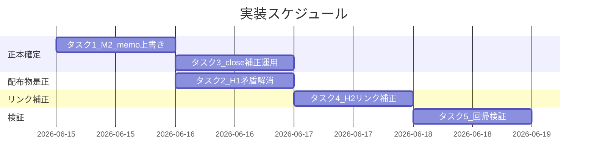

# 実装計画書: issue 配置先の正本統一（.workflow→docs/maintainer/workflow 移行の不整合是正）

**プロジェクト名**: issue 配置先の正本統一（.workflow→docs/maintainer/workflow 移行の不整合是正）  
**作成日**: 2026 年 06 月 14 日  
**最終更新**: 2026 年 06 月 14 日

> **重要**: **このドキュメントは常に更新**: 実装計画の変更、進捗状況の更新、バグの記録などがあった場合は、即座にこのドキュメントを更新してください。
> **必須項目**: 「必須」と明記した欄は空欄・抽象語のみで提出しないこと。テスト観点・BDD 仕様は具体ケースを 1 件以上記載すること。
>
> **用語**: [.agents/CONCEPTS.md §用語規約](../../../../.agents/CONCEPTS.md#用語規約) を参照。

---

## 1. 実装概要

### 1.1 実装方針（必須）

固有上書きの正本を `.agents-project/自己拡張ワークフロー.md` の 1 ファイルに集約し（memo 上書き・close パス補正を追加）、配布物側（CLAUDE.md・.agents/）は矛盾記述の解消と参照注記のみに留める。close 配下の実リンク 74 件を 4→5 階層上に補正し、各タスクは grep / リンク解決 / `audit.sh` で検証する（02_設計の方針と整合）。

### 1.2 実装順序（必須: 1 件以上）

1. **タスク 1**: M2 — `.agents-project/` に memo 上書き定義を追加（正本を先に確定）
2. **タスク 2**: H1 — CLAUDE.md / PHASES.md / requirement-discovery.md の矛盾記述解消（タスク 1 の正本を参照）
3. **タスク 3**: H2(a) — `.agents-project/` に close 時パス補正運用を明文化
4. **タスク 4**: H2(b) — close 配下 74 実リンクを 5 階層上に補正
5. **タスク 5**: 回帰検証 — grep 検証・リンク解決・`audit.sh` 実行（全タスク後）



---

## 2. タスク分解

**必須**: 各タスクには「テスト観点」（2.x.3）と「単体テスト仕様（BDD）」（2.x.4）を必ず記載する。観点定義は 02\_設計 §6 および [TEST_BDD_FORMAT.md](../../../../.agents/TEST_BDD_FORMAT.md) を参照。

### 2.1 タスク 1: M2 — memo パス上書き定義の追加（正本）

#### 2.1.1 概要（必須）

`.agents-project/自己拡張ワークフロー.md` に自己拡張 issue の memo 配置先（`docs/maintainer/workflow/<issue>/memo/`）の上書き定義を新設する。

#### 2.1.2 実装内容（必須: 1 件以上）

- `.agents-project/自己拡張ワークフロー.md` に「memo の作成場所（標準フローの上書き）」節を追加。既存の issue 配置・close 配置の表と同形式で `自己拡張 issue の memo = docs/maintainer/workflow/<issue>/memo/`（close 後は `close/<issue>/memo/`）を記す。
- プレフィックス取得規約（`TZ=Asia/Tokyo date +%Y%m%d_%H%M%S` / `memo-prefix.sh`）は配布物側正本を相互参照し再定義しない。
- 必要に応じ `run_command.md`:57・`TEMPLATES.md`:12-13 に「本リポは `.agents-project/` 上書き優先」の参照注記を 1 文添える（消費者既定 `.workflow/{issue}/memo/` は保持）。

#### 2.1.3 テスト観点（必須）

**参照**: 観点定義は [02\_設計 §6](./02_設計.md) および [RULES のテスト戦略](../../../../.agents/RULES.md#テスト戦略必須要件)。

##### 単体（本タスクの具体ケース・必須 1 件以上）

- 正常系: `grep -n 'docs/maintainer/workflow/<issue>/memo/' .agents-project/自己拡張ワークフロー.md` が 1 件以上ヒットする。
- 正常系: 同ファイルに memo の見出し節（例「memo の作成場所」）が追加されている。
- 異常系: 該当なし（記述追加）。

##### 結合/API（該当時は必須 1 件以上）

- 該当なし（外部 I/F 変更なし）。

##### E2E/受け入れ（未達時は理由記載）

- 受け入れ: M2 解消の ○/× 判定（上書き定義の有無）が `grep` で確認できる（01_要件定義 ストーリー 2 受け入れ基準）。

##### バリデーション（該当する場合の具体ケース）

- 該当なし。

#### 2.1.4 単体テスト仕様（BDD）（必須）

```gherkin
Feature: memoパスの正本統一（M2）
  Scenario: 自己拡張issueのmemo上書き定義が正本に存在する
    Given .agents-project/自己拡張ワークフロー.md を編集対象とする
    When memo の作成場所の上書き節を追加する
    Then grep で docs/maintainer/workflow/<issue>/memo/ がヒットする
    And 消費者既定 .workflow/{issue}/memo/ は配布物側で保持されている
```

```bash
# Given: .agents-project に memo 上書き節を追加済み
# When: 上書き定義を grep する
grep -n 'docs/maintainer/workflow/.*memo' .agents-project/自己拡張ワークフロー.md
# Then: 1 件以上ヒットし、run_command.md:57 の .workflow/{issue}/memo/ は残存する
grep -n '\.workflow/{issue}/memo/' .agents/skills/agent/run_command.md
```

#### 2.1.5 依存関係

- なし（最初に実施。タスク 2 が参照する正本を確定する）。

#### 2.1.6 見積もり

- **工数**: 0.5h ／ **優先度**: 高

### 2.2 タスク 2: H1 — 作成先記述の自己矛盾解消

#### 2.2.1 概要（必須）

`CLAUDE.md`:18-19 の自己矛盾を解消し、`.workflow/` 記述を消費者ランタイム文脈に限定する（本リポ作成先＝`docs/maintainer/workflow/`）。

#### 2.2.2 実装内容（必須: 1 件以上）

- `CLAUDE.md`:19 を、`.workflow/<timestamp>_<title>/` が**汎用パッケージ標準（消費者既定）**であり、本リポでは `.agents-project/` 上書き（`docs/maintainer/workflow/...`）が最優先である旨に改め、:18 と整合させる。固有定義は再記述せず `.agents-project/` を参照。
- `.agents/workflow/PHASES.md`:34 の `.workflow/<timestamp>_<title>/` を汎用標準の例として読める文に整理し、:33 の上書き最優先参照と矛盾させない。
- `.agents/commands/requirement-discovery.md`:14,22 の `issue（.workflow/{issue}/）` は汎用 I/F として保持しつつ、本リポ作成先を `.workflow/` と断定する誤読が生じないことを確認（必要時のみ注記）。
- **`.workflow/templates/` 記述は変更しない**。消費者ランタイム文脈の `.workflow/<issue>/` は意味を保ったまま残す。

#### 2.2.3 テスト観点（必須）

##### 単体（本タスクの具体ケース・必須 1 件以上）

- 正常系: `CLAUDE.md`:18-19 を読んで「本リポ単一/サブ issue 作成先＝`docs/maintainer/workflow/`」が一意に読め、相反する断定が 0 件（目視＋grep）。
- 正常系: `grep -nE '本リポ|本リポジトリ' CLAUDE.md` で本リポ作成先を `.workflow/` と断定する文が残っていない。
- 異常系: 消費者ランタイムを指す `.workflow/<issue>/`（PHASES/run_command 等）が削除・改変されていない（残存を grep で確認）。

##### 結合/API（該当時は必須 1 件以上）

- 該当なし。

##### E2E/受け入れ（未達時は理由記載）

- 受け入れ: H1 解消の ○/× 判定（矛盾記述 0 件）が確認できる（01_要件定義 ストーリー 1 受け入れ基準）。

##### バリデーション（該当する場合の具体ケース）

- 該当なし。

#### 2.2.4 単体テスト仕様（BDD）（必須）

```gherkin
Feature: 作成先記述の正本統一（H1）
  Scenario: CLAUDE.md の自己矛盾が解消される
    Given CLAUDE.md:18 が「正は docs/...」と記す
    When CLAUDE.md:19 を汎用標準＋.agents-project上書き優先の表現に改める
    Then 本リポ作成先を .workflow/ と断定する記述が 0 件になる
    And 消費者ランタイム文脈の .workflow/<issue>/ は保持される
```

```bash
# Given/When: CLAUDE.md を是正済み
# Then: 本リポ作成先を .workflow と断定する記述が無いことを確認（消費者文脈は残る）
grep -n '\.workflow/<timestamp>_<title>/' CLAUDE.md
# 残存させる消費者文脈の確認（誤削除していないこと）
grep -rn '\.workflow/<issue>/' .agents/ | head
```

#### 2.2.5 依存関係

- タスク 1（memo 上書き正本）完了後（参照整合のため）。

#### 2.2.6 見積もり

- **工数**: 1h ／ **優先度**: 高

### 2.3 タスク 3: H2(a) — close 時パス補正運用の明文化

#### 2.3.1 概要（必須）

`.agents-project/自己拡張ワークフロー.md §完了 issue の close 移動` に、close 移動時の相対リンク階層補正手順（`../../../../` → `../../../../../`）を追記し、再発を防ぐ。

#### 2.3.2 実装内容（必須: 1 件以上）

- close 移動運用に「成果物内の `.agents/` 等への相対リンクを 1 階層深くする（4 階層上→5 階層上）」手順と、その理由（`close/<issue>/` はルートから 5 階層下）を明記。
- 検証手順（補正後にリンク解決を全件確認）を運用に含める。

#### 2.3.3 テスト観点（必須）

##### 単体（本タスクの具体ケース・必須 1 件以上）

- 正常系: `grep -nE '\.\./\.\./\.\./\.\./\.\./|5 階層|close 移動' .agents-project/自己拡張ワークフロー.md` で補正手順の記述がヒットする。
- 異常系: 該当なし。

##### 結合/API（該当時は必須 1 件以上）

- 該当なし。

##### E2E/受け入れ（未達時は理由記載）

- 受け入れ: 以後の close でリンク補正が運用として実施される旨が明文化されている（01_要件定義 ストーリー 3 シナリオ 2）。

##### バリデーション

- 該当なし。

#### 2.3.4 単体テスト仕様（BDD）（必須）

```gherkin
Feature: close時のリンク健全性（H2 運用）
  Scenario: close 移動運用にパス補正手順が明文化される
    Given .agents-project に close 移動の上書き節がある
    When パス補正手順（4→5 階層上）を追記する
    Then grep で補正手順の記述が確認できる
```

```bash
# Given/When: close 移動運用に補正手順を追記済み
# Then: 補正手順の記述を確認
grep -nE 'close|階層|\.\./\.\./\.\./\.\./\.\.' .agents-project/自己拡張ワークフロー.md
```

#### 2.3.5 依存関係

- なし（タスク 4 の前提となる運用記述）。

#### 2.3.6 見積もり

- **工数**: 0.5h ／ **優先度**: 中

### 2.4 タスク 4: H2(b) — close 配下 74 実リンクの補正

#### 2.4.1 概要（必須）

`docs/maintainer/workflow/close/<issue>/` の 00〜04 に含まれる実 markdown リンク `](../../../../` を `](../../../../../` に補正する（74 件・19 ファイル・5 issue）。

#### 2.4.2 実装内容（必須: 1 件以上）

- **対象は実リンクのみ**: `](../../../../` で始まるリンクを `](../../../../../` に補正。
- **対象外（改変しない）**: バッククォート内・本文中の `../../../../` の文章上の言及 3 件（`enforcement-runtime実効性是正/memo/...証跡_00_01.md`・`ワークフロールール明文化.../04_review.md:112`・`ワークフロールール明文化.../memo/...実装memo.md:32`）。
- 対象ファイル（件数）: 02_設計 §3.3.3 の表のとおり（124435:14 / 162712:26 / 183739:24 / 185353:10 = 計 74）。
- 補正後、各リンク先ファイルの実在を `test -e` で検証。

#### 2.4.3 テスト観点（必須）

##### 単体（本タスクの具体ケース・必須 1 件以上）

- 正常系: 補正後、`grep -rEon '\]\(\.\./\.\./\.\./\.\./[^/.]' docs/maintainer/workflow/close/` の残存が 0 件（4 階層上の実リンクが消えた）。
- 正常系: 補正後 `](../../../../../` の実リンク件数が 74 件になる。
- 正常系: 補正対象外の文章上 `../../../../` 言及 3 件は改変されず残存する。
- 異常系/境界: 補正先の各リンクが指すファイルが実在する（未解決 0 件）。過剰補正（6 階層上）が発生していない。

##### 結合/API（該当時は必須 1 件以上）

- 該当なし。

##### E2E/受け入れ（未達時は理由記載）

- 受け入れ: close 配下の相対リンクが全件解決し未解決 0 件（01_要件定義 ストーリー 3 シナリオ 1）。

##### バリデーション

- 該当なし。

#### 2.4.4 単体テスト仕様（BDD）（必須）

```gherkin
Feature: close時のリンク健全性（H2 補正）
  Scenario: close配下の実リンクが5階層上で全件解決する
    Given close/<issue>/ 配下に 74 件の ](../../../../ 実リンクがある
    And close/<issue>/ はリポジトリルートから5階層下にある
    When 実リンクを ](../../../../../ に補正する
    Then 4階層上の実リンク残存が0件になる
    And 補正後の各リンク先ファイルが実在する（未解決0件）
    And 文章上の言及3件は改変されない
```

```bash
# Given: 補正前 4 階層上の実リンクは 74 件
grep -rEo '\]\(\.\./\.\./\.\./\.\./' docs/maintainer/workflow/close/ | wc -l   # 74
# When: 実リンクを 5 階層上へ補正（実装フェーズで実施）
# Then: 4 階層上の実リンク残存 0 件、リンク解決を全件検証
grep -rEo '\]\(\.\./\.\./\.\./\.\./[^/.]' docs/maintainer/workflow/close/ | wc -l   # 0
# 解決検証: 各リンクの実在確認ループ
fail=0
grep -rEon '\]\((\.\./){5}[^)]+\)' docs/maintainer/workflow/close/ | while IFS=: read -r f n link; do
  rel=$(printf '%s' "$link" | sed -E 's/^\]\(//; s/\).*$//; s/#.*$//')
  base=$(dirname "$f")
  target=$(realpath -m "$base/$rel")
  [ -e "$target" ] || { echo "UNRESOLVED: $f:$n -> $rel"; fail=1; }
done
# Then: 出力 UNRESOLVED が 0 行なら全件解決
```

#### 2.4.5 依存関係

- タスク 3（補正運用の明文化）と整合。実体補正は運用記述と同時または直後。

#### 2.4.6 見積もり

- **工数**: 1.5h ／ **優先度**: 高

### 2.5 タスク 5: 回帰検証（grep・リンク解決・audit.sh）

#### 2.5.1 概要（必須）

全是正後に、H1/M2/H2 の受け入れ基準を grep・リンク解決で確認し、`audit.sh` を実行して新規 FAIL（特に #29 実装前 04 検知）が生じないことを確認する。

#### 2.5.2 実装内容（必須: 1 件以上）

- H1: 本リポ作成先を `.workflow/` と断定する記述 0 件、消費者文脈 `.workflow/<issue>/` 残存を確認。
- M2: `.agents-project/` の memo 上書き定義の存在を確認。
- H2: 4 階層上実リンク残存 0 件・補正後 74 件・全件解決を確認。
- 回帰: `bash .agents/enforcement/ci/audit.sh` を実行し、是正前後で FAIL 件数が増えないこと（特に #29）を確認。`audit.sh` は `.workflow` と `docs/maintainer/workflow` 双方を走査する（audit.sh:89-90）ため、close 配下の 04_review が「実装前 04」と誤検知されないこと（既に implement/verify ログのある close 済み issue であることが前提）を確認。

#### 2.5.3 テスト観点（必須）

##### 単体（本タスクの具体ケース・必須 1 件以上）

- 正常系: 上記 H1/M2/H2 の各 grep が期待値（断定 0 件／上書き定義 1 件以上／4 階層上実リンク 0 件・5 階層上 74 件）を返す。
- 異常系: `audit.sh` が本是正に起因する新規 FAIL を出さない（特に #29）。

##### 結合/API（該当時は必須 1 件以上）

- 検証: `audit.sh` を実体実行し、終了コードと FAIL 出力を是正前ベースラインと比較。

##### E2E/受け入れ（未達時は理由記載）

- 受け入れ: 00_要求定義 §6 の成功基準（H1/M2/H2 解消・回帰なし）が全て ○。

##### バリデーション

- 該当なし。

#### 2.5.4 単体テスト仕様（BDD）（必須）

```gherkin
Feature: 是正の回帰検証
  Scenario: audit が新規FAILを出さない（#29 実装前04検知）
    Given H1/M2/H2 の是正が完了している
    And close 済み issue は implement/verify ログを持つ
    When bash .agents/enforcement/ci/audit.sh を実行する
    Then 本是正に起因する新規 FAIL が 0 件である
    And #29（実装前04）が close 配下の 04 を誤検知しない
```

```bash
# Given: 是正完了。 When: audit を実行
bash .agents/enforcement/ci/audit.sh; echo "exit=$?"
# Then: 是正前ベースラインと FAIL 件数を比較（増加 0）。#29 関連の FAIL 出力が無いことを確認
```

#### 2.5.5 依存関係

- タスク 1〜4 完了後。

#### 2.5.6 見積もり

- **工数**: 1h ／ **優先度**: 高

---

## テスト観点

本実装計画全体のテスト観点は次の 4 系統に集約する（各タスク §2.x.3 に具体ケースを記載）。(1) **記述矛盾検証（grep）**: 本リポ作成先を `.workflow/` と断定する記述 0 件・消費者文脈の `.workflow/<issue>/` 残存。(2) **正本定義検証（grep）**: `.agents-project/` の memo 上書き・close パス補正手順の存在。(3) **相対リンク解決検証**: close 配下の 4 階層上実リンク残存 0 件、5 階層上 74 件、`realpath -m + test -e` ループで未解決 0 件。(4) **回帰検証（audit.sh 実行）**: 新規 FAIL なし、特に #29（実装前 04 検知）が close 配下 04 を誤検知しない。

---

## 単体テスト

実行コードの単体テストは該当なし（ドキュメント是正）。代替として、各タスクの BDD（§2.x.4）に記載した grep / リンク解決 / audit 実行コマンドを「検証スクリプト的な単体確認」として実行し、結果を実装完了後の 04_review に記録する。

---

## BDD

BDD シナリオは各タスク §2.x.4（M2 memo 上書き・H1 矛盾解消・H2(a) 運用明文化・H2(b) リンク補正・回帰 audit）に記載。Given/When/Then 形式は [TEST_BDD_FORMAT.md](../../../../.agents/TEST_BDD_FORMAT.md) に従う。01_要件定義 §2.2 の BDD ユースケース（UC1=H1・UC2=M2・UC3=H2）と対応する。

---

## 3. 実装スケジュール

### 3.1 マイルストーン

| マイルストーン | 期日 | 成果物 |
| -------------- | ---- | ------ |
| 正本確定（M2＋close 補正運用） | 着手日 | `.agents-project/自己拡張ワークフロー.md` 更新 |
| 配布物是正（H1） | +1 | CLAUDE.md / PHASES.md / requirement-discovery.md |
| リンク補正（H2(b)） | +1 | close 配下 19 ファイル補正 |
| 回帰検証完了 | +1 | grep / リンク解決 / audit 結果（→04_review） |

### 3.2 実装フェーズ

#### フェーズ 1: 正本確定と配布物是正

- **タスク**: 1（M2）→ 3（close 補正運用）→ 2（H1）

#### フェーズ 2: リンク補正と検証

- **タスク**: 4（H2 補正）→ 5（回帰検証）

---

## 4. テスト計画

### 4.1 テストの優先順位

- クリティカル: H2 リンク補正（74 件の全件解決）と audit 回帰（#29 誤検知防止）。
- 影響範囲が広い: 消費者ランタイム文脈 `.workflow/<issue>/` の誤削除防止（回帰に必ず含める）。

---

## 5. リスク管理

### 5.1 実装リスク

- **リスク**: `.workflow/{issue}` の機械的一括置換で消費者ランタイム文脈まで壊す。
  - **対策**: 置換は本リポ作成先を断定する文脈に限定。各 file:line を精査し、消費者文脈は維持・自己拡張文脈は `.agents-project/` 参照で整合（00_要求定義 §7.1）。
- **リスク**: H2 で誤った階層数（6 階層上等）を当て再びリンク切れ。
  - **対策**: 補正は実リンク `](../../../../` の 4→5 階層のみ。補正後 `realpath -m + test -e` で全件解決を検証（02_設計 §3.3.6）。
- **リスク**: 文章上の `../../../../` 言及 3 件まで書き換え、過去レビュー証跡の意味を変える。
  - **対策**: 補正対象を `](` 付き実リンクに限定し、prose 3 件は明示的に対象外とする。

---

## 6. 参考資料

### プロジェクトドキュメント

- [`02_設計.md`](./02_設計.md) - 設計
- [`01_要件定義.md`](./01_要件定義.md) - 要件定義

### その他の参考資料

- [.agents-project/自己拡張ワークフロー.md](../../../../.agents-project/自己拡張ワークフロー.md)
- [.agents/enforcement/ci/audit.sh](../../../../.agents/enforcement/ci/audit.sh)（#29 実装前 04 検知。参照のみ）
- [.agents/TEST_BDD_FORMAT.md](../../../../.agents/TEST_BDD_FORMAT.md)

---

## 7. 前のステップ

この実装計画書は、以下のドキュメントを基に作成されています：

- **前**: [`02_設計.md`](./02_設計.md) - 設計フェーズ

---

## 8. 次のステップ

この実装計画書の承認後：

- **プロジェクトが 1 つの issue である場合**: 実装フェーズ（execution）に直接進む（サブ issue 分割なし＝90_issues.md は作成しない）。

**用語**: [.agents/CONCEPTS.md §用語規約](../../../../.agents/CONCEPTS.md#用語規約) を参照。
