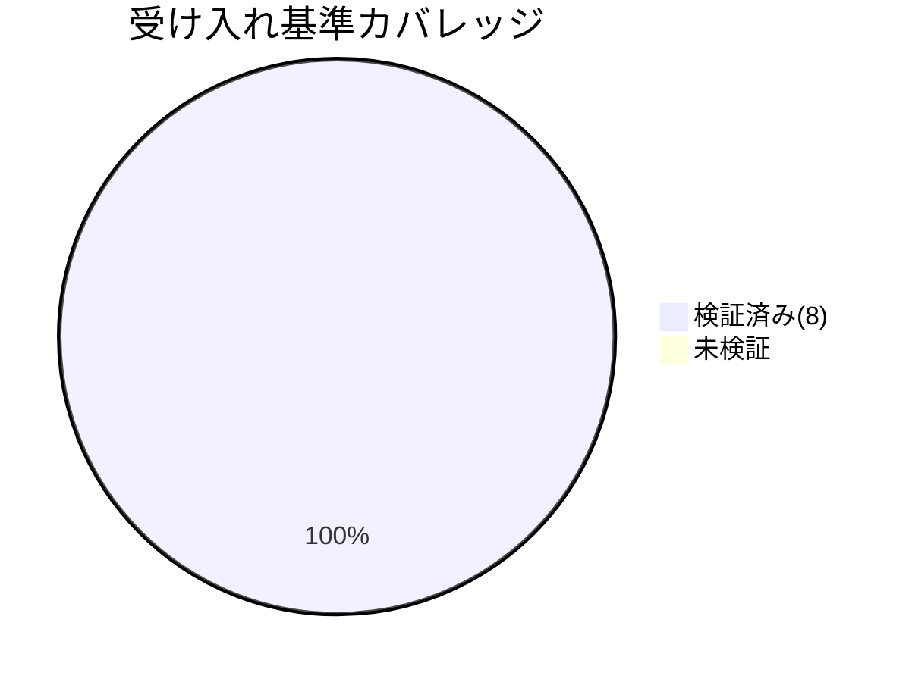

# レビュー書: issue 配置先の正本統一（.workflow→docs/maintainer/workflow 移行の不整合是正）

**プロジェクト名**: issue 配置先の正本統一（.workflow→docs/maintainer/workflow 移行の不整合是正）  
**作成日**: 2026 年 06 月 15 日  
**最終更新**: 2026 年 06 月 15 日

> **重要**: **このドキュメントは常に更新**: レビューで発見した問題点や改善提案、対応内容などがあった場合は、即座にこのドキュメントを更新してください。
>
> **用語**: [.agents/CONCEPTS.md §用語規約](../../../../.agents/CONCEPTS.md#用語規約) を参照。
>
> **必須**: レビュー実施時は [`.agents/REVIEW_RULE.md`](../../../../.agents/REVIEW_RULE.md) を参照。本レビュー深度は **standard**（記述・ルール是正・close 配下 19 ファイルのリンク補正という中規模変更のため）。

---

## 1. レビュー概要

### 1.1 レビュー目的（必須）

実装内容の確認・品質保証（H1/M2/H2 の是正が受け入れ基準を満たし、消費者ランタイム文脈を壊さないことの最終チェック）。

### 1.2 レビュー対象（必須）

- **実装範囲**: 配布物ドキュメントの作成先記述の自己矛盾解消（H1）、`.agents-project/` への memo パス上書き定義追加（M2）、close 移動時パス補正運用の明文化（H2(a)）と close 配下 74 実リンクの 4→5 階層補正（H2(b)）。03_実装計画 §2 のタスク 1〜5 に対応。
- **レビュー期間**: 2026-06-15 ～ 2026-06-15
- **レビュー担当者**: verify-and-close サブエージェント（review-architecture / review-code / map-coverage / generate-scenarios の各観点を実施）

---

## 2. 実装内容の確認

### 2.1 実装完了タスク（または Issue）

| タスク名 | 実装内容 | 実装日 | 担当者 | ステータス（必須: 完了 または 要修正） |
| -------- | -------- | ------ | ------ | -------------------------------------- |
| T1: M2 memo 上書き定義 | `.agents-project/自己拡張ワークフロー.md` に「memo の作成場所（標準フローの上書き）」節を新設 | 2026-06-15 | impl | 完了 |
| T2: H1 矛盾解消 | `CLAUDE.md`:19 を汎用標準＋`.agents-project/` 上書き最優先の表現に改め、`PHASES.md` も整合 | 2026-06-15 | impl | 完了 |
| T3: H2(a) 補正運用明文化 | `.agents-project/` close 節に「close 移動時の相対リンク補正（必須手順）」を追記 | 2026-06-15 | impl | 完了 |
| T4: H2(b) リンク補正 | close 配下 19 ファイルの実リンク `](../../../../` を `](../../../../../` に補正（74 件） | 2026-06-15 | impl | 完了 |
| T5: 回帰検証 | grep / リンク解決ループ / `audit.sh`（tmp 隔離）を実行し本レビューに記録 | 2026-06-15 | impl | 完了 |

### 2.2 実装内容の詳細

#### タスク 1（M2）: memo パス上書き定義の追加

- **実装内容**: `.agents-project/自己拡張ワークフロー.md` に「## memo の作成場所（標準フローの上書き）」節を追加。自己拡張 issue の memo = `docs/maintainer/workflow/<issue>/memo/`（close 後は `close/<issue>/memo/`）を既存表形式で明記。プレフィックス取得規約は配布物正本（run_command.md:57）を相互参照し再定義していない。
- **変更ファイル**: `.agents-project/自己拡張ワークフロー.md`
- **確認事項**: 消費者既定 `.workflow/{issue}/memo/`（`run_command.md`:53,57 で 2 件・`TEMPLATES.md` で 2 件）が保持されていること。→ grep で確認済み（保持）。

#### タスク 2（H1）: 作成先記述の自己矛盾解消

- **実装内容**: `CLAUDE.md`:19 を「下記は**汎用パッケージ標準（消費者ランタイムの既定）**である。本リポジトリでは :18 のとおり `.agents-project/` の上書き（`docs/maintainer/workflow/...`）が最優先」と改めた。`.agents/workflow/PHASES.md` も「汎用標準では `.workflow/<timestamp>_<title>/`。`.agents-project/` の上書きがある場合はそれを最優先」と整合。
- **変更ファイル**: `CLAUDE.md`、`.agents/workflow/PHASES.md`
- **確認事項**: `.workflow/<timestamp>_<title>/` の文字列は消費者ランタイム文脈として残るが、本リポ作成先を断定する文脈は解消（:18 と矛盾しない順序）。`.workflow/templates/` は不変。

#### タスク 3（H2(a)）: close 時パス補正運用の明文化

- **実装内容**: `.agents-project/自己拡張ワークフロー.md` に「### close 移動時の相対リンク補正（必須手順）」を追記。4 階層下→5 階層下になる根拠、`](../../../../`→`](../../../../../` の補正内容、バッククォート/本文中の言及は改変しない旨、補正後のリンク解決検証ループ（必須）を明記。
- **変更ファイル**: `.agents-project/自己拡張ワークフロー.md`

#### タスク 4（H2(b)）: close 配下 74 実リンクの補正

- **実装内容**: close 配下の実 markdown リンク `](../../../../`（4 階層上）を `](../../../../../`（5 階層上）に補正。バッククォート/本文中の文章上言及 3 件は改変せず保持。
- **変更ファイル**: close 配下 19 ファイル（5 issue。124435 / 162712 / 183739 / 185353 の 00〜04）。

---

## 3. テスト結果の確認

本タスクは実行コードを持たないドキュメント是正であり、検証は **grep ベースの記述検証・相対リンク解決検証・`audit.sh` 実行（tmp 隔離）** で担保する（02_設計 §6）。

### 3.1 単体（検証スクリプト的確認）

#### 実行結果（必須: 数値で記載）

- **実行日**: 2026-06-15
- **検証項目数**: 8（H1×2・M2×2・H2(a)×1・H2(b)×3）
- **成功**: 8
- **失敗**: 0
- **スキップ**: 0

#### H2(b) 相対リンク補正の数値（必須）

| 検証 | コマンド | 期待 | 実測 |
| ---- | -------- | ---- | ---- |
| 4 階層上の実リンク残存 | `grep -rEo '\]\(\.\./\.\./\.\./\.\./[^/.]' docs/.../close/ \| wc -l` | 0 | **0** |
| 5 階層上の実リンク件数 | `grep -rEo '\]\(\.\./\.\./\.\./\.\./\.\./' docs/.../close/ \| wc -l` | 74 | **74** |
| 5 階層上実リンクの全件解決（`realpath -m + test -e` ループ） | checked / unresolved | 74 / 0 | **74 / 0** |
| 文章上言及（バッククォート） | 改変せず残存 | 3 | **3**（183739/memo, 185353/04_review:112, 185353/memo） |

#### H1 / M2 記述検証

- H1: `CLAUDE.md`:19 に「汎用パッケージ標準（消費者ランタイムの既定）」＋`.agents-project/` 上書き最優先の明記を確認（grep 1 件）。`PHASES.md`:34 に「汎用標準では `.workflow/<timestamp>_<title>/`。上書きがあればそれを最優先」を確認（grep 1 件）。消費者文脈の `.workflow/<issue>/` 系記述は誤削除なし。
- M2: `.agents-project/` に「## memo の作成場所（標準フローの上書き）」節（grep 1 件）と `docs/maintainer/workflow/<issue>/memo/` 記述を確認。消費者既定 `.workflow/{issue}/memo/`（run_command.md 2 件・TEMPLATES.md 2 件）保持を確認。

#### テストカバレッジ

#### 失敗したテスト（該当する場合）

なし（失敗 0 件）。

### 3.2 統合テスト（audit.sh 回帰・tmp 隔離）

`.agents-project/自己拡張ワークフロー.md §テストの tmp 隔離` に従い、`mktemp -d` ＋ 隔離コピーで `audit.sh` を実行（本番ファイルは未改変）。

| 環境 | 内容 | 結果 |
| ---- | ---- | ---- |
| ベースライン | `git archive HEAD`（作業前） | **Audit passed. exit=0** |
| 本 issue 単独 | HEAD ＋ 本 issue の編集（CLAUDE.md / PHASES.md / .agents-project / close リンク補正）のみ適用（他の未追跡 issue は除外） | **Audit passed. exit=0** |
| 作業ツリー全体 | `git stash create` ツリー＋全未追跡（本 issue 以外の `162712` close 移動・`235244`/`235257` 等を含む） | exit=1（FAIL 2 件） |

**作業ツリー全体での FAIL 2 件の帰属（重要）**:

1. `FAIL: ... 90_issues.md が必須 ... docs/maintainer/workflow/close`: audit が `close/` ディレクトリ自体を「サブ issue を持つ親ワークフロー」と見なすことに起因する**既存 check のデータ状態**。close 配下 issue 数は HEAD 4→作業ツリー 5（別作業 `162712` の close 移動で増加）であり、本 issue の編集（H1/M2/H2 の記述・リンク補正）が原因ではない。
2. `FAIL: 重要パスに TODO/FIXME が残存 ... 162712/04_review.md`: 当該 04_review の本文（:229）に "TODO/FIXME" という**文字列が散文として登場**することによる #7 の誤検知的ヒット。これも別 issue（`162712`）の成果物に由来し、本 issue の対象外。

**結論**: 本 issue 単独の隔離 audit は **passed（exit 0）**。#28/#29（実装前 04 検知／`.workflow`・`docs/maintainer/workflow` 双方走査）に起因する**新規 FAIL は 0 件**。作業ツリー全体の 2 FAIL は他の並行作業（`162712` close 移動・未追跡 issue）由来の既存 check データ状態であり、本 issue の回帰ではない（`162712/04_review.md:229` も同検出を「既存 check 由来」と記録済み）。

### 3.3 E2E テスト

受け入れ基準（00_要求定義 §6 / 01_要件定義 §2.1）を §12 で総括。全 ○。

---

## 4. コードレビュー

### 4.1 コード品質

- **リント結果**: 該当なし（markdown / ルール記述）。
- **フォーマット**: 問題なし（テンプレ・既存節の文体に整合）。
- **型チェック**: 該当なし。

#### コードレビュー観点

| 観点 | 確認内容（必須: 1 文） | 結果 | コメント |
| ---- | ---------------------- | ---- | -------- |
| 可読性 | 「自己拡張＝docs」「消費者＝.workflow」の境界が記述上で明確に読めるか | OK | CLAUDE.md:18→19 が「上書き最優先→汎用標準」の順で矛盾なく読める |
| 保守性 | 固有定義が `.agents-project/` の 1 ファイルに集約され、配布物側は参照のみか（DRY） | OK | memo 上書き・close 補正手順とも `.agents-project/` に正本化、重複再定義なし |
| パフォーマンス | ランタイム性能影響 | OK | ドキュメント是正のため影響なし |
| セキュリティ | 高リスク操作（外部書込・大量削除）の有無 | OK | 伴わない |

### 4.2 指摘事項

#### 指摘 1: close 配下に本 issue のスコープ外の未解決リンクが存在（参考・本 issue では対応不要）

- **重要度**: 低
- **指摘内容**: close 配下全体を「任意深さの相対リンク」で広域検査すると、本 issue が補正した 74 件（`](../../../../`）とは別系統で計 29 件の未解決リンクが存在する。内訳: (A) `20260614_184756_台帳prev_hash自動連結/` の `../../../.agents/...` 系 18 件（**3 階層上**の別パターン。本 issue §3.3.3 で「4 階層上実リンク 0 件＝補正対象外」と明示的にスコープ外。HEAD 時点から既存・本作業で未変更）、(B) `./90_issues.md` 2 件（サブ issue を持たない単一 issue で 90_issues 未作成）、(C) `../README.md`・`../00_システム理解.md`・`../RULES.md` 3 件（同 issue 内の親/兄弟参照）、(D) `../20260614_173500_multi-tool対応/` 3 件（参照先が active 側 `docs/maintainer/workflow/` にあり close からは届かない相互参照）。
- **対応状況**: 未対応（本 issue のスコープ外）。
- **対応方法**: 本 issue の受け入れ基準は「実 markdown リンク `](../../../../` → `](../../../../../`（74 件）の全件解決」であり、これは達成済み（4→0、5 階層 74、未解決 0）。上記 29 件は (A) 3 階層パターン・(B)(C)(D) 別系統のため対象外。**特に (A) の `台帳prev_hash` は close 移動時にそもそも `../../../.agents/`（3 階層）で書かれており、5 階層上が正であるべき箇所が誤った深さのまま残っている**。再発防止のため本 issue で明文化した「close 移動時の相対リンク補正（必須手順）」を**過去 close 分の一括健全化**として別 issue で適用することを推奨（本 issue では受け入れ基準を満たすため必須ではない）。

---

## 5. ドキュメントの確認

### 5.1 ドキュメント更新状況

| ドキュメント | 更新状況 | 確認者 | 確認日 |
| ------------ | -------- | ------ | ------ |
| [`00_要求定義.md`](./00_要求定義.md) | 更新済み（H1/M2/H2 を定義） | verify-and-close | 2026-06-15 |
| [`01_要件定義.md`](./01_要件定義.md) | 更新済み（BDD UC1〜3） | verify-and-close | 2026-06-15 |
| [`02_設計.md`](./02_設計.md) | 更新済み（正本集約方針・補正対象厳密化） | verify-and-close | 2026-06-15 |
| [`03_実装計画.md`](./03_実装計画.md) | 更新済み（タスク 1〜5・BDD） | verify-and-close | 2026-06-15 |

### 5.2 ドキュメントの整合性

- **実装と設計の整合性**: 整合している（02_設計 §3.1〜3.3 の是正方針どおりに H1/M2/H2 を実装）。
- **要件と実装の整合性**: 整合している（01_要件定義 §2.1 の 3 受け入れ基準を全て満たす）。
- **コメント**: 02_設計 §3.3.3 の「対象 19 ファイル・74 件・prose 3 件」が実測（74/0/3）と一致。

---

## 6. パフォーマンス確認

該当なし（ドキュメント整合性タスク）。

## 7. セキュリティ確認

| 項目 | 確認内容 | 結果 | コメント |
| ---- | -------- | ---- | -------- |
| 認証・認可 | 該当なし | OK | - |
| データ保護 | 高リスク操作なし | OK | 外部書込・大量削除なし |
| 入力検証 | 該当なし | OK | - |

## 8. デプロイ準備

### 8.1 デプロイチェックリスト

- [x] すべての検証（grep / リンク解決 / 隔離 audit）が通過している
- [x] コードレビューが完了している
- [x] ドキュメント（00〜03）と実装が整合している
- [ ] マイグレーション: 該当なし
- [ ] 環境変数: 該当なし
- [x] tmp 隔離で本番ファイル非破壊を担保

---

## docs 更新

- 要否: **不要**
- 対象: なし
- 理由: 本変更は `.agents-project/` 上書き定義・配布物ルール記述・close 配下成果物の相対リンク是正であり、システム仕様書（`docs/` のプロダクト仕様）に影響しないため。`docs/maintainer/workflow/` は開発記録名前空間であり仕様書ではない。

---

## 9. 設計・境界の確認

review-architecture の結果。

### 9.1 設計の確認

- **設計原則の準拠**: 単一責務（Single Source of Truth）＋相互参照を遵守。固有上書き（issue/memo/close/パス補正）の正本は `.agents-project/自己拡張ワークフロー.md` の 1 ファイルに集約され、配布物側（CLAUDE.md / PHASES.md / run_command.md / TEMPLATES.md）は汎用標準＋参照のみで固有定義を再記述していない（02_設計 §1.2）。
- **ディレクトリ構成**: 名前空間分離（自己拡張＝`docs/maintainer/workflow/`、消費者＝`.workflow/`、テンプレ正本＝`.workflow/templates/`）を崩していない。
- **命名規則**: 既存節の見出し・表形式に整合。

### 9.2 境界・依存の確認

- **責務の境界**: 「配布物（消費者ランタイム＝`.workflow/`）」と「本リポ自己拡張（＝`docs/maintainer/workflow/`）」の境界が記述上で曖昧化していない。同語 `.workflow/` の 2 文脈が分離して読める。
- **依存関係**: `CLAUDE.md`→`.agents-project/`、`.agents/`→`CLAUDE.md`→`.agents-project/`、`close/<issue>/`→`.agents/`（5 階層上）の一方向参照を維持。循環参照なし。
- **指摘・推奨**: 過去 close 分（特に `台帳prev_hash`）の 3 階層リンクは本 issue のスコープ外だが、明文化した補正手順で別途一括健全化を推奨（§4.2 指摘 1）。

### 9.3 重要判断の根拠（evidence_source）

| 判断内容 | evidence_source | 備考（参照元） |
| -------- | --------------- | -------------- |
| H2 補正後の全リンク解決（74/0） | test_output | `realpath -m + test -e` ループ実行結果（checked=74 unresolved=0） |
| 本 issue 単独で audit passed | test_output | tmp 隔離（HEAD＋本 issue 編集のみ）で `audit.sh` exit=0 |
| 作業ツリーの 2 FAIL が本 issue の回帰でない | test_output / existing_code | ベースライン exit=0、162712/04_review.md:229 の既存 check 記録、対象ファイルが本作業で未変更（git status） |
| 境界・DRY の妥当性 | existing_code | `.agents-project/`・CLAUDE.md・PHASES.md の実記述を grep 確認 |
| 設計準拠（正本集約） | external_spec | `.agents/spec/06_設計判断の優先順位.md`・`01_設計原則.md` |

---

## 10. 課題と改善点

### 10.1 発見された課題

- **課題 1**: close 配下に本 issue スコープ外の未解決リンク 29 件（§4.2 指摘 1）。
  - **影響範囲**: 過去 close 済み issue（特に `台帳prev_hash`）からの `.agents/` 参照経路。
  - **対応方法**: 明文化済み補正手順を用いた過去 close 分の一括健全化（別 issue 推奨）。本 issue の受け入れ基準は満たすため必須ではない。

### 10.2 改善提案

- **改善 1**: 将来 close する issue では本 issue で追加した「close 移動時の相対リンク補正（必須手順）」と検証ループを必ず実行する運用を徹底する。
  - **効果**: 同種のリンク切れ再発を防止。

---

## 11. システム仕様書の更新

### 11.1 システム仕様書の確認結果

- **実装した機能**: ルール・ドキュメント記述の是正（プロダクト機能・画面・データ構造・API の追加なし）。

### 11.2 システム仕様書の更新状況

- 更新不要。理由: 本変更は開発ワークフローの上書き定義・配布物ルール記述・開発記録のリンク是正であり、`docs/`（プロダクト仕様書）に影響しない。

---

## 12. レビュー結果

### 12.1 総合評価

- **実装品質**: 良好（02/03 の是正方針どおり・スコープ厳守）。
- **テスト品質**: 良好（grep / リンク解決 / 隔離 audit の 3 系統で受け入れ基準を数値検証）。
- **ドキュメント品質**: 良好（00〜03 と実装が整合）。
- **総合評価**: **合格（承認可）**。

#### 受け入れ基準カバレッジ（map-coverage）

| 受け入れ基準（00_要求定義 §6 / 01_要件定義 §2.1） | 検証方法 | 結果 |
| -------------------------------------------------- | -------- | ---- |
| **H1 解消**: 本リポ作成先＝`docs/maintainer/workflow/` が一意に読め、矛盾記述 0 件 | grep（CLAUDE.md:18-19 / PHASES.md:34）＋目視 | ○ |
| **M2 解消**: `.agents-project/` に memo 上書き定義（docs 名前空間）が追加 | grep（節見出し＋`docs/.../memo/`） | ○ |
| **H2 解消**: close 配下の実リンクが全件解決（不足 74 件→未解決 0 件） | 4 階層上残存 0・5 階層上 74・解決ループ 74/0 | ○ |
| **H2 運用**: close 移動時のパス補正運用が `.agents-project/` に明文化 | grep（「close 移動時の相対リンク補正（必須手順）」） | ○ |
| **回帰なし**: 消費者 `.workflow/` 記述が意味を保つ／audit が新規 FAIL を出さない | run_command/TEMPLATES の `.workflow/{issue}/memo/` 保持＋本 issue 単独 audit exit=0 | ○ |

### 12.2 承認状況

- **レビュー承認者**: verify-and-close サブエージェント
- **承認日**: 2026-06-15
- **承認コメント**: H1/M2/H2 の全受け入れ基準を充足。本 issue 単独の隔離 audit は passed（#28/#29 由来の新規 FAIL 0 件）。作業ツリー全体の 2 FAIL は他の並行作業由来の既存 check データ状態であり本 issue の回帰ではないことを実測で確認。スコープ外の既存リンク不整合（29 件）は別 issue での一括健全化を推奨として記録。

---

## 13. 参考資料

- [`00_要求定義.md`](./00_要求定義.md) / [`01_要件定義.md`](./01_要件定義.md) / [`02_設計.md`](./02_設計.md) / [`03_実装計画.md`](./03_実装計画.md)
- [.agents-project/自己拡張ワークフロー.md](../../../../.agents-project/自己拡張ワークフロー.md)
- [.agents/enforcement/ci/audit.sh](../../../../.agents/enforcement/ci/audit.sh)（#28/#29。参照のみ・不変）
- [.agents/REVIEW_RULE.md](../../../../.agents/REVIEW_RULE.md)

---

## 14. 前のステップ

- **前**: [`03_実装計画.md`](./03_実装計画.md) - 実装計画フェーズ

---

## 15. 次のステップ

- 本レビュー承認により issue 完了。トップレベル issue 完了時は `.agents-project/自己拡張ワークフロー.md §完了 issue の close 移動` に従い `docs/maintainer/workflow/close/<issue>/` へ移動し、移動時に「close 移動時の相対リンク補正（必須手順）」を適用する（4→5 階層上）。
