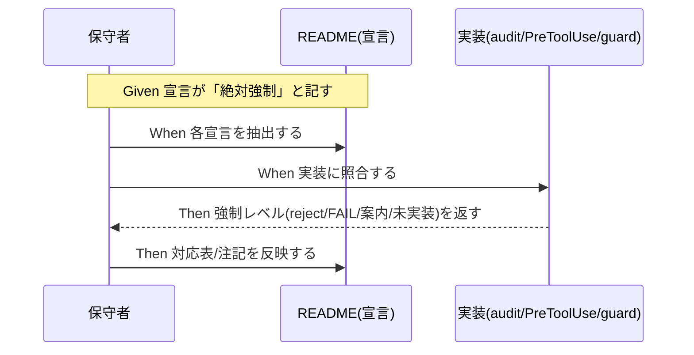

# 要件定義書: enforcement の宣言と実装の乖離是正

**プロジェクト名**: enforcement の宣言と実装の乖離是正
**作成日**: 2026 年 06 月 14 日
**最終更新**: 2026 年 06 月 14 日

> **重要**: **このドキュメントは常に更新**: 要件の変更や追加があった場合は、即座にこのドキュメントを更新してください。ドキュメントは「生きているドキュメント」として扱い、実装内容と常に同期させます。
>
> **用語**: [.agents/CONCEPTS.md §用語規約](../../../../.agents/CONCEPTS.md#用語規約) を参照。

---

## 1. 概要

### 1.1 システム概要

enforcement は強制を 4 層（Layer1 プラットフォーム権限 / Layer2 PreToolUse / Layer3 write-workflow-log ラッパー / Layer4 CI audit）で構成し、README を正本として失敗条件 #1–#29 を定義する。本要件は、README が「絶対強制」「例外なく拒否」「subagent-guard で検出」と宣言する項目と、その実装（`audit.sh` / `PreToolUse.sh` / `subagent-guard.sh`）の強制レベルとの乖離を是正対象とする。是正手段は (A) 文言の実態整合化、(B) 不足する強制の実装、の選択または組合せとする。

### 1.2 用語集

| 用語 | 説明 |
| ---- | ---- |
| 宣言 | README 等の文書が記す強制の約束（例: 「絶対強制」「例外なく拒否」「必ず FAIL」）。 |
| 実装 | 宣言を実現するスクリプト（audit.sh / PreToolUse.sh / subagent-guard.sh）の実際の挙動。 |
| 乖離 | 宣言の強制レベルと実装の強制レベルが一致しない状態。 |
| 強制レベル | runtime reject（その場で拒否）／ CI FAIL（事後に reject）／ 案内のみ（exit 0）／ 未実装 のいずれか。 |
| (A) 正確化 | 達成できない/間接的な強制について、宣言文言を実態に合わせて書き換える方針。 |
| (B) 実装 | 不足する強制を実装し、宣言どおりの強制力を与える方針。 |

---

## 2. 機能要件

### 2.1 ユーザーストーリー

#### ストーリー 1: 宣言と実装の強制レベル対応の可視化

- **As a** enforcement の運用者・保守者
- **I want to** README の各宣言に対応する実装の所在と強制レベルを一意に知りたい
- **So that** 「強制されているはず」という誤解を排し、素通り経路を見落とさない

**受け入れ基準**:

- 「絶対強制」「例外なく拒否」「subagent-guard で検出」と記す各宣言に、実装の所在（ファイル:行）と強制レベル（runtime reject / CI FAIL / 案内のみ / 未実装）が対応づけられている。
- README 内部で「例外なく拒否」と「条件付き exit 0」のような相反表現が併存している箇所が解消されている。

#### ストーリー 2: 乖離ごとの是正方針の確定と一致の証明

- **As a** 保守者
- **I want to** #5・#25・PreToolUse exit・#22–#24 の各乖離に (A)/(B) のいずれを採るか決め、結果として宣言と実装が一致したことを確認したい
- **So that** enforcement の信頼性（宣言どおり効く、または宣言が実態どおり）を回復できる

**受け入れ基準**:

- 4 件すべてに採用方針 (A)/(B) と、解消後の状態（宣言と実装が一致／乖離が文書化されている）が記録されている。
- (B) を採る場合、過剰ブロック（正常運用の誤 FAIL/reject）を起こさない範囲に限定されている。

#### ストーリー 3: subagent-guard のトレーサビリティ回復

- **As a** 保守者
- **I want to** README/SETUP/DESIGN の subagent-guard 参照から実体ファイルへたどれる、または #22–#24 の検出有無が文書と実装で一致する状態にしたい
- **So that** 「subagent-guard で検出する」という記述が実態と矛盾しない

**受け入れ基準**:

- subagent-guard の参照と実体（`.workflow/templates/github/scripts/subagent-guard.sh`）の対応がたどれる、または正本配置が見直されている。
- #22–#24 が subagent-guard で「検出する」と書くなら実装され、検出しないなら文書がその旨に正確化されている。

### 2.2 BDD ユースケース

#### ユースケース 1: 宣言と実装の対応づけ（SC-1 / SC-3）

README の各「絶対強制」宣言に対し、対応する実装と強制レベルを一意化する。

**シナリオ 1: 絶対強制宣言に対応する実装が明示される**

```gherkin
Feature: 宣言と実装の対応づけ
  Scenario: README の絶対強制宣言を実装に対応づける
    Given README が「絶対強制」「例外なく拒否」「subagent-guard で検出」と宣言している
    When 各宣言を audit.sh / PreToolUse.sh / subagent-guard.sh の実装に照合する
    Then 各宣言に実装の所在(ファイル:行)と強制レベルが一意に対応づけられている
    And 実装が存在しない宣言は「未実装」または(A)で正確化されたと明記されている
```

**処理フロー**:



**シナリオ 2: 相反表現の解消**

```gherkin
Feature: 宣言と実装の対応づけ
  Scenario: README 内部の相反表現を解消する
    Given README が同一項目を「例外なく拒否」とも「渡されない場合は案内のみ exit 0」とも記している
    When 強制レベルを条件付き(runtime reject + CI 補完)として正確化する
    Then README に相反表現が残らない
```

#### ユースケース 2: #25（メイン直接作業）の乖離是正

`check_25_main_did_real_work` は変更者を区別できず、ログ 1 件で PASS する。

**シナリオ 1: ログ存在のみで PASS する穴の是正**

```gherkin
Feature: #25 メイン直接作業の検出
  Scenario: 変更者を区別できない判定の限界を是正する
    Given 成果物が変更され workflow_log に該当 command の行が 1 件以上ある
    When 現行 audit.sh の #25 を評価する
    Then 現状は PASS する(変更者が orchestrator か sub か区別しない)
    And 是正後は(B)変更者識別の強化、または(A)「ログ存在による間接検出」と限界を正確化、のいずれかが適用される
```

#### ユースケース 3: PreToolUse exit の乖離是正

`AGENT_ROLE=orchestrator` が渡らない環境では reject されず案内のみ exit 0。

**シナリオ 1: ロール未伝達時の挙動の整合**

```gherkin
Feature: PreToolUse の絶対強制
  Scenario: ロールが渡らない環境での宣言整合
    Given README が orchestrator の Write/Edit/Shell を「例外なく拒否」と宣言している
    And 実機が AGENT_ROLE/stdin JSON を渡さず ROLE=unknown になる
    When PreToolUse.sh を評価する
    Then 現状は案内のみ exit 0 でブロックしない
    And 是正後は宣言が「ロール伝達時に必ず reject、未伝達時は CI で補完」と正確化されている、または(B)ロール伝達が確実化されている
```

#### ユースケース 4: #5（書記実行）の乖離是正

書記の実行は chain 順序ではなく成果物・ログの存在で間接検出される。

**シナリオ 1: 順序未監査の正確化**

```gherkin
Feature: 書記実行の強制
  Scenario: skill chain 順序が監査対象外であることの整合
    Given README が write-workflow-log の実行を強制すると読める
    And audit.sh は 04_review の存在と workflow_log 行の存在で間接検出する
    When skill chain の最終 step として書記が実行されたかを確認する
    Then 現状は順序を監査しない
    And 是正後は「存在ベースの間接検出」と限界が正確化されている、または(B)順序検出が追加されている
```

#### ユースケース 5: #22–#24 と subagent-guard の乖離是正

README は #22–#24 を subagent-guard で検出すると明言するが実装が無い。

**シナリオ 1: 未実装の明言との整合**

```gherkin
Feature: 自立進行・高リスク確認の検出
  Scenario: subagent-guard が #22-#24 を実装していない乖離の是正
    Given README:77/142-143 が #22-#24 を「subagent-guard または runtime で検出」と明言している
    And subagent-guard.sh はログ frontmatter/logs/内部参照の 3 点のみ検査し #22-#24 を実装していない
    When subagent-guard.sh の検査項目を確認する
    Then 是正後は #22-#24 が実装されている、または文書が「現状未実装/runtime 委ね」と正確化されている
    And README/SETUP/DESIGN の参照から実体ファイルへトレーサビリティがある
```

### 2.3 ビジネスルール

- 「絶対強制」と宣言する項目は、(B) 実装で該当環境において必ず reject/FAIL するか、(A) 達成可能な強制レベルに宣言を正確化するかのいずれかで、宣言と実装を一致させること。宣言だけ強く実装が伴わない状態を残さない。
- 是正により正常運用を誤って阻害（過剰ブロック／誤 FAIL）してはならない。違反確証がない場合は reject しない保守的方針を維持する。
- enforcement の正本は `.agents/enforcement/` に一本化する。実装の所在はここから一意にたどれること。
- 既存の後方互換（DB 不採用・非 git ツリー・`docs/maintainer/workflow` 不在）の SKIP 挙動を壊さない。

---

## 3. 非機能要件

### 3.1 パフォーマンス要件

- audit.sh / subagent-guard への追加チェックは既存チェックと同等オーダーの実行時間に収める。

### 3.2 セキュリティ要件

- 是正により orchestrator の成果物直接編集・偽装経路を新たに広げない。
- workflow.db への書き込みは write-workflow-log.sh 経由のみという既存制約を維持する。

### 3.3 ユーザビリティ要件

- 各失敗条件 # に対し「実装の所在」と「強制レベル」が運用者に一目で分かる形（対応表または注記）で示される。

### 3.4 可用性要件

- ロール未伝達環境・DB 不採用環境でも enforcement 全体が落ちず、CI 補完または案内に degrade する（fail-safe を維持）。

---

## 4. 外部インターフェース要件

### 4.1 API 要件

- PreToolUse.sh の入力契約（stdin JSON の tool_name / tool_input.command / tool_input.file_path、env 後方互換、AGENT_ROLE）を変更する場合は、実機 Claude Code の hooks 契約（stdin JSON・block exit 2）との整合を保つ。

### 4.2 データ形式要件

- workflow_log のスキーマ（actor_role / delegated_by_role / parent_entry_id / changed_files_json / document_id / issue_path 等）は既存を前提とし、(B) の検出強化はスキーマ大改修を伴わない範囲とする。

---

## 5. 制約事項

- hooks の物理限界（PreToolUse はツール名・対象パス・コマンド・ロールの範囲でのみ判定可能。`bash -c "..."` 内部は完全検出不能。README:36）を前提とする。完全強制が不能な項目は (A) で正確化する以外に整合手段がない。
- 名前空間分離（`.agents/` 追跡・配布物 / `.workflow/` 無視・ランタイム生成物）を維持する。subagent-guard の配置・参照を見直す場合もこの役割分担と整合させる。
- /clear 境界・別セッション引継ぎ・fresh サブ収束は CI 非強制（人手監査）であり本 issue の機械強制対象外。

---

## 6. 参考資料

### プロジェクトドキュメント

- [`00_要求定義.md`](./00_要求定義.md) - 要求定義
- [.agents/enforcement/README.md](../../../../.agents/enforcement/README.md)
- [.agents/enforcement/ci/audit.sh](../../../../.agents/enforcement/ci/audit.sh)
- [.agents/enforcement/claude/PreToolUse.sh](../../../../.agents/enforcement/claude/PreToolUse.sh)
- [.workflow/templates/github/scripts/subagent-guard.sh](../../../../.workflow/templates/github/scripts/subagent-guard.sh)

### その他の参考資料

- [.agents/spec/01_設計原則.md](../../../../.agents/spec/01_設計原則.md)（docs と実装の不整合を放置しない）
- [.agents-project/自己拡張ワークフロー.md](../../../../.agents-project/自己拡張ワークフロー.md)（名前空間分離）

---

## 7. 前のステップ

この要件定義書は、以下のドキュメントを基に作成されています：

- **前**: [`00_要求定義.md`](./00_要求定義.md) - 要求定義フェーズ

---

## 8. 次のステップ

この要件定義書の承認後、以下のドキュメントを作成します：

- **次**: [`02_設計.md`](./02_設計.md) - 設計フェーズ
