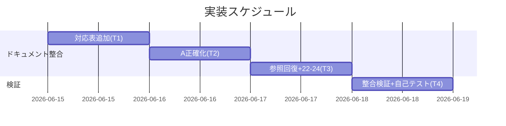
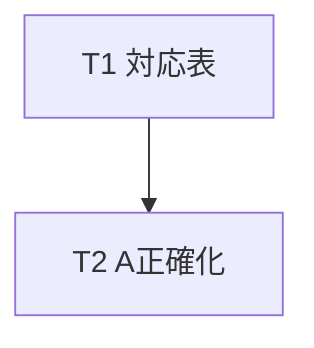
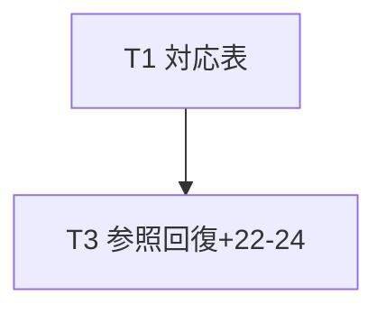
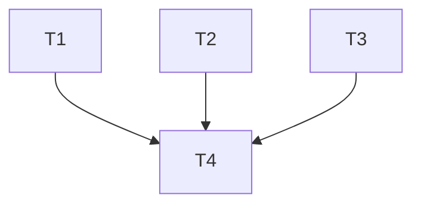

# 実装計画書: enforcement の宣言と実装の乖離是正

**プロジェクト名**: enforcement の宣言と実装の乖離是正
**作成日**: 2026 年 06 月 15 日
**最終更新**: 2026 年 06 月 15 日

> **重要**: **このドキュメントは常に更新**: 実装計画の変更、進捗状況の更新、バグの記録などがあった場合は、即座にこのドキュメントを更新してください。
> **必須項目**: 「必須」と明記した欄は空欄・抽象語のみで提出しないこと。テスト観点・BDD 仕様は具体ケースを 1 件以上記載すること。
>
> **用語**: [.agents/CONCEPTS.md §用語規約](../../../../.agents/CONCEPTS.md#用語規約) を参照。

---

## 1. 実装概要

### 1.1 実装方針（必須）

02 設計の確定割当に従い、(A) 文言の実態整合化（README/DESIGN/SETUP）をベースラインに、(B) subagent-guard の参照回復を実装し、audit.sh / PreToolUse.sh の挙動は変更しない（後方互換を壊さない）。各乖離の解消は「宣言と実装が一致」か「乖離が正確に文書化」のいずれかで証明する。

### 1.2 実装順序（必須: 1 件以上）

1. タスク1: SC-1 対応表の追加（README）— 他タスクの整合基盤
2. タスク2: #5 / #25 / PreToolUse exit の (A) 正確化（README/DESIGN）
3. タスク3: subagent-guard の (B) 参照回復 ＋ #22–#24 (A) 正確化（README/SETUP/DESIGN）
4. タスク4: 整合検証・audit.sh 自己テスト新設・既存テスト回帰



---

## 2. タスク分解

**必須**: 各タスクに「テスト観点」（2.x.3）と「単体テスト仕様（BDD）」（2.x.4）を必ず記載する。

### 2.1 タスク 1: SC-1 対応表の追加（README §失敗条件と差し戻し）

#### 2.1.1 概要（必須）

各失敗条件 # に「実装の所在（ファイル:関数/行）」「強制レベル（runtime reject / CI FAIL / 案内のみ / 未実装）」を一意対応づける対応表を README に追加する（02 §3.5 の確定内容）。

#### 2.1.2 実装内容（必須: 1 件以上）

- README §失敗条件と差し戻し に「失敗条件 → 実装の所在 → 強制レベル」対応表（02 §3.5.2 の表）を新規追加する。
- #22–#24 行は「未実装・runtime/人手監査」と記す（タスク3 と整合）。
- #25 行は「間接検出＋#12/#13 補完／変更者同一性は未識別」と記す（タスク2 と整合）。

#### 2.1.3 テスト観点（必須）

**参照**: 観点定義は [02 §6](./02_設計.md) および [RULES テスト戦略](../../../../.agents/RULES.md#テスト戦略必須要件)。本タスクの具体ケースのみ記載。

##### 単体（本タスクの具体ケース・必須 1 件以上）

- README に対応表セクション見出しが 1 件存在する（grep で見出し検出）。
- 対応表に #5・#25・#22–#24・PreToolUse・subagent-guard の各行が存在する（grep で行検出）。

##### 結合/API（該当時）

- 該当なし（単一ドキュメント編集）。

##### E2E/受け入れ

- SC-1: 「絶対強制/例外なく拒否/subagent-guard で検出」と記す各宣言に強制レベルが一意対応づくこと（対応表で確認）。

##### バリデーション（該当する場合）

- 該当なし。

#### 2.1.4 単体テスト仕様（BDD）（必須）

```gherkin
Feature: SC-1 対応表
  Scenario: README に失敗条件→実装→強制レベル対応表が存在する
    Given README §失敗条件と差し戻し を対象とする
    When 対応表セクションと #5/#25/#22-#24/PreToolUse/subagent-guard 行を grep する
    Then すべての行と強制レベル列が 1 件以上ヒットする
```

```bash
# Given: 編集後の README.md
# When: 対応表の見出しと各乖離行を grep
# Then: 見出し1件・各行が存在しヒット数 >= 1
grep -q '実装の所在' .agents/enforcement/README.md \
  && grep -qE '#22|#23|#24' .agents/enforcement/README.md \
  && echo OK
```

#### 2.1.5 依存関係

- なし（最初に実施）。後続タスク2/3 が本表を更新する。

#### 2.1.6 見積もり

- **工数**: 0.5 時間 / **優先度**: 高

### 2.2 タスク 2: #5 / #25 / PreToolUse exit の (A) 正確化

#### 2.2.1 概要（必須）

#5（書記）・#25（メイン直接作業）・PreToolUse exit の 3 件を、実態に合わせ README/DESIGN の文言を正確化する（02 §3.1–§3.3）。

#### 2.2.2 実装内容（必須: 1 件以上）

- **#5**: README §失敗条件 #5・§矯正するもの の書記記述に「強制レベル＝CI 存在ベース間接検出（chain 順序は未監査）」を明記する。
- **#25**: README:14・187 の「必ず FAIL」を「成果物変更に委譲・証跡が皆無のとき FAIL する間接検出。変更者同一性は未識別。#12/#13・PreToolUse の orchestrator reject で補完」と正確化する。
- **PreToolUse exit（新発見）**: README:13/25/135・DESIGN.md:15 の「exit 1」表記を実装と一致する「exit 2（block）」に統一する。
- **PreToolUse ロール条件**: README:11-13 の「例外なく必ず拒否」を「ロールが渡る環境では必ず exit 2 で拒否、渡らない環境では案内のみ exit 0 とし CI で補完」という条件付き表現に統一し、相反表現（README:25 との併存）を解消する。

#### 2.2.3 テスト観点（必須）

##### 単体（本タスクの具体ケース・必須 1 件以上）

- README/DESIGN の PreToolUse 文脈に「exit 1」が残存しない（grep で 0 件）。
- README に「例外なく必ず exit 2 で拒否する」が条件節（ロール伝達時）なしの単独断定として残らない（条件付き表現になっている）。
- #25 記述に「変更者同一性は未識別」または「間接検出」相当の限界記述が含まれる。

##### 結合/API（該当時）

- 該当なし。

##### E2E/受け入れ

- SC-2 の #5・#25・PreToolUse exit: 各乖離に (A) 採用と解消状態（宣言と実装が一致／乖離が文書化）が記録されている。

##### バリデーション（該当する場合）

- 該当なし。

#### 2.2.4 単体テスト仕様（BDD）（必須）

```gherkin
Feature: PreToolUse exit 表記の整合
  Scenario: README/DESIGN の exit 表記が実装と一致する
    Given PreToolUse.sh は block 時に exit 2 を返す
    When README/DESIGN の PreToolUse 文脈を grep する
    Then "exit 1" が PreToolUse 文脈に残存しない
    And ロール条件付きの "exit 2 で拒否" 表現に統一されている
```

```bash
# Given: 正確化後の README.md / DESIGN.md
# When: PreToolUse 文脈の exit 表記を確認
# Then: PreToolUse 行で "exit 1" が出ないこと
! grep -nE 'PreToolUse.*exit 1|exit 1.*orchestrator' .agents/enforcement/README.md .agents/enforcement/DESIGN.md \
  && echo OK
```

#### 2.2.5 依存関係

- タスク1（対応表）— 本タスクの正確化を対応表の #5/#25/PreToolUse 行に反映する。



#### 2.2.6 見積もり

- **工数**: 1 時間 / **優先度**: 高

### 2.3 タスク 3: subagent-guard 参照回復 (B) ＋ #22–#24 正確化 (A)

#### 2.3.1 概要（必須）

`.agents/`（README/SETUP/DESIGN）から実体 `.workflow/templates/github/scripts/subagent-guard.sh` への参照リンクを追加し（(B) トレーサビリティ回復）、#22–#24 を「未実装・CI 非強制」と正確化する（(A)）（02 §3.4）。

#### 2.3.2 実装内容（必須: 1 件以上）

- README §配置するファイル一覧 または §失敗条件冒頭、SETUP §採用チェック（行 212 付近）、DESIGN §参照 に、実体パス `.workflow/templates/github/scripts/subagent-guard.sh` を明記する。
- subagent-guard.sh が検査する 3 項目（内部参照＝#6 相当／ログ frontmatter／logs/ 廃止）と README 失敗条件の対応を明記する。
- README:142-143 の「#22–#24 は subagent-guard または runtime で検出」を「#22–#24 は subagent-guard では未実装。AI 自律判断・人手監査に委ねる CI 非強制項目（理由: 許可確認の有無・指示文案の有無・高リスク確認の有無は成果物・git 差分・ツールメタデータに痕跡を残さず機械検出不能）」へ正確化する。
- 実体ファイルの移設はしない（名前空間境界維持）。

#### 2.3.3 テスト観点（必須）

##### 単体（本タスクの具体ケース・必須 1 件以上）

- `.agents/`（README/SETUP/DESIGN）から `.workflow/templates/github/scripts/subagent-guard.sh` への参照が grep で 1 件以上ヒットする（現状 0 件 → 1 件以上）。
- 参照先パスが実在する（ファイルが存在）。
- README に「#22–#24」と「未実装」または「CI 非強制」が同一文脈に存在する。

##### 結合/API（該当時）

- 該当なし。

##### E2E/受け入れ

- SC-3: subagent-guard 参照から実体へたどれる／#22–#24 の検出有無が文書と実装で一致する。

##### バリデーション（該当する場合）

- 該当なし。

#### 2.3.4 単体テスト仕様（BDD）（必須）

```gherkin
Feature: subagent-guard トレーサビリティ
  Scenario: 正本から実体パスへ参照できる
    Given README/SETUP/DESIGN は subagent-guard を名前のみ言及していた
    When .agents 配下から実体パス文字列を grep する
    Then .workflow/templates/github/scripts/subagent-guard.sh への参照が 1 件以上ヒットする
    And 参照先ファイルが実在する
```

```bash
# Given: 参照回復後の .agents 配下
# When: 実体パスへの参照を grep
# Then: ヒット >= 1 かつ参照先が実在
grep -rq 'templates/github/scripts/subagent-guard.sh' .agents/ \
  && test -f .workflow/templates/github/scripts/subagent-guard.sh \
  && echo OK
```

#### 2.3.5 依存関係

- タスク1（対応表の #22–#24・subagent-guard 行を本タスクの正確化と整合させる）。



#### 2.3.6 見積もり

- **工数**: 1 時間 / **優先度**: 高

### 2.4 タスク 4: 整合検証・audit.sh 自己テスト新設・既存テスト回帰

#### 2.4.1 概要（必須）

文書整合（grep ベース）を検証し、audit.sh の自己テストを新設し（現状 PreToolUse・write-workflow-log のテストはあるが audit.sh 自己テストは無い）、既存テストの回帰（全 PASS・後方互換維持）を確認する。

#### 2.4.2 実装内容（必須: 1 件以上）

- タスク1–3 の grep 検証（対応表存在／exit 1 残存なし／subagent-guard 参照／#22–#24 正確化）を 04_review の証跡として実行する。
- `.agents/scripts/test/` に audit.sh 自己テスト（`test-audit.sh` 等）を新設する。最低限のケース: (a) DB 不採用環境で audit が落ちず関連 check が SKIP する、(b) 非 git ツリーで git 依存 check（#18/#19/#25/#27/#28）が SKIP する、(c) 正常な最小 issue ツリーで Audit passed。tmp 隔離（mktemp -d）で実行し本リポを破壊しない。
- 既存 `test-pretooluse-hook.sh`（exit 2 を含む 32 ケース）を回帰実行し全 PASS を確認する（PreToolUse の挙動は変更しないため緑のまま）。

#### 2.4.3 テスト観点（必須）

##### 単体（本タスクの具体ケース・必須 1 件以上）

- **audit.sh 自己テストが通る**: 新設 test-audit.sh が PASS する。
- **後方互換（DB 非採用）維持**: workflow.db 不在の tmp ツリーで audit がエラー終了せず、DB 依存 check（#8/#9/#11/#12–#21/#29）が SKIP し Audit passed する。
- **後方互換（非 git ツリー）維持**: `.git` 不在の tmp ツリーで git 依存 check（#18/#19/#25/#27/#28）が SKIP し Audit passed する。

##### 結合/API（該当時）

- 該当なし。

##### E2E/受け入れ

- SC-4: 既存 audit.sh / PreToolUse.sh のテストが全通過し、DB 不採用・非 git ツリーの後方互換挙動が維持されている。

##### バリデーション（該当する場合）

- 該当なし。

#### 2.4.4 単体テスト仕様（BDD）（必須）

```gherkin
Feature: audit.sh 後方互換・自己テスト
  Scenario: DB 不採用・非 git ツリーで audit が SKIP し成功する
    Given workflow.db が存在せず .git も存在しない最小 issue ツリー(tmp 隔離)
    When .agents/enforcement/ci/audit.sh <tmp> を実行する
    Then 終了コードが 0 (Audit passed) であり DB/git 依存 check が SKIP する
```

```bash
# Given: DB なし・git なしの最小ツリーを tmp に作る
tmp="$(mktemp -d)"; mkdir -p "$tmp/.agents/boot" "$tmp/.agents/workflow" "$tmp/.workflow"
: > "$tmp/.agents/boot/CORE.md"; : > "$tmp/.agents/boot/LOAD_POLICY.md"
: > "$tmp/.agents/workflow/PHASES.md"; : > "$tmp/.agents/workflow/TEMPLATES.md"
# When: audit を実行（DB/git 依存は SKIP されるはず）
# Then: exit 0
bash .agents/enforcement/ci/audit.sh "$tmp" && echo OK
rm -rf "$tmp"
```

#### 2.4.5 依存関係

- タスク1–3 完了後（文書整合の対象が確定してから検証）。



#### 2.4.6 見積もり

- **工数**: 1.5 時間 / **優先度**: 高

---

## テスト観点

- **文書整合（grep）**: 対応表セクションの存在、PreToolUse 文脈に「exit 1」が残存しない、条件付き「exit 2 で拒否」への統一、`.agents/` から subagent-guard 実体パスへの参照 1 件以上、#22–#24＝未実装/CI 非強制の明記。
- **挙動不変・後方互換（SC-4）**: 既存 test-pretooluse-hook.sh が全 PASS（exit 2 含む）。新設 audit.sh 自己テストが通る。DB 不採用・非 git ツリーで関連 check が SKIP し Audit passed する。
- **過剰ブロック防止**: audit.sh / subagent-guard.sh / PreToolUse.sh の判定ロジックを変更しないため、正常運用の誤 FAIL/reject を増やさない（01 §ビジネスルール・7.1 リスク）。

---

## 単体テスト

- 各タスクの §2.x.4 BDD に従う。文書系（T1–T3）は grep アサーション、スクリプト系（T4）は audit.sh 自己テスト＋既存 PreToolUse テスト回帰で担保する。すべて tmp 隔離（`.agents-project/自己拡張ワークフロー.md` §テストの tmp 隔離）で実行し本リポを破壊しない。

---

## BDD

- §2.1.4 / §2.2.4 / §2.3.4 / §2.4.4 に Given/When/Then を記載済み。01 §2.2 の BDD ユースケース（UC1–UC5）と対応: UC1→T1（対応表・SC-1/SC-3）、UC2→T2（#25）、UC3→T2（PreToolUse exit）、UC4→T2（#5）、UC5→T3（#22–#24・subagent-guard）。SC-4（後方互換・全テスト通過）→T4。

---

## 3. 実装スケジュール

### 3.1 マイルストーン

| マイルストーン | 期日 | 成果物 |
| -------------- | ---- | ------ |
| 文書整合完了 | T1–T3 完了時 | 対応表・正確化された README/DESIGN/SETUP |
| 検証完了 | T4 完了時 | audit 自己テスト・回帰結果（04_review に記載） |

### 3.2 実装フェーズ

#### フェーズ 1: ドキュメント整合（A＋B 参照回復）

- **タスク**: T1, T2, T3

#### フェーズ 2: 検証

- **タスク**: T4

---

## 4. テスト計画

### 4.1 テストの優先順位

- 後方互換（DB 非採用・非 git ツリーの SKIP）は回帰必須。
- 既存 PreToolUse テスト（exit 2 含む）は変更しないため全 PASS を確認（回帰）。

---

## 5. リスク管理

### 5.1 実装リスク

- **リスク**: 文言正確化で「強制が弱まった」と誤読される。
  - **対策**: 対応表に「runtime reject(条件付き)＋CI 補完」と二段構えを明示し、強制が消えたのではなく観測面の限界であることを示す。
- **リスク**: subagent-guard 参照追加が名前空間境界（配布物 vs ランタイムテンプレ）を崩す。
  - **対策**: 実体は移設せず参照リンクのみ追加（02 §2.1.3）。`.workflow/templates/` は git 追跡される配布テンプレであり、`.agents/` からの参照は名前空間役割分担と矛盾しない。
- **リスク**: audit 自己テスト新設で既存挙動を変えてしまう。
  - **対策**: audit.sh 本体は変更せず、テストのみ追加。tmp 隔離で本リポ非破壊。

---

## 6. 参考資料

### プロジェクトドキュメント

- [`02_設計.md`](./02_設計.md) - 設計
- [`01_要件定義.md`](./01_要件定義.md) - 要件定義

### その他の参考資料

- [.agents/enforcement/README.md](../../../../.agents/enforcement/README.md)、[DESIGN.md](../../../../.agents/enforcement/DESIGN.md)、[ci/audit.sh](../../../../.agents/enforcement/ci/audit.sh)、[claude/PreToolUse.sh](../../../../.agents/enforcement/claude/PreToolUse.sh)
- [.workflow/templates/github/scripts/subagent-guard.sh](../../../../.workflow/templates/github/scripts/subagent-guard.sh)
- [.agents/scripts/test/test-pretooluse-hook.sh](../../../../.agents/scripts/test/test-pretooluse-hook.sh)

---

## 7. 前のステップ

この実装計画書は、以下のドキュメントを基に作成されています：

- **前**: [`02_設計.md`](./02_設計.md) - 設計フェーズ

---

## 8. 次のステップ

この実装計画書の承認後、以下のいずれかのステップに進みます：

- **プロジェクトが 1 つの issue である場合**: 実装フェーズ（execution）に直接進む。

**用語**: [.agents/CONCEPTS.md §用語規約](../../../../.agents/CONCEPTS.md#用語規約) を参照。
