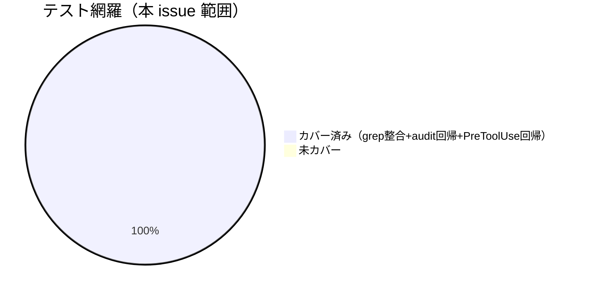

# レビュー書: enforcement の宣言と実装の乖離是正

**プロジェクト名**: enforcement の宣言と実装の乖離是正
**作成日**: 2026 年 06 月 15 日
**最終更新**: 2026 年 06 月 15 日

> **重要**: 本ドキュメントは生きているドキュメントとして扱い、実装内容と常に同期させる。
> **用語**: [.agents/CONCEPTS.md §用語規約](../../../../.agents/CONCEPTS.md#用語規約) を参照。
> **レビュー深度**: standard（中）。変更規模は文書整合（README/DESIGN/SETUP）＋ audit.sh の走査リスト化・自己テスト追加。

---

## 1. レビュー概要

### 1.1 レビュー目的（必須）

実装内容の確認 / 品質保証。enforcement の宣言（README/DESIGN/SETUP）と実装（audit.sh / PreToolUse.sh / subagent-guard.sh）の乖離が、(A) 文言の実態整合化＋(B) 参照回復で解消または正確に文書化されたことを検証し、後方互換が維持されていることを確認する。

### 1.2 レビュー対象（必須）

- **実装範囲**: SC-1 対応表の追加（README）、#5 / #25 / PreToolUse exit の (A) 正確化（README/DESIGN）、subagent-guard 参照回復 (B)＋#22–#24 (A) 正確化（README/SETUP/DESIGN）、audit.sh の走査ディレクトリリスト化と自己テスト（test-audit.sh）新設。
- **レビュー期間**: 2026-06-15 ～ 2026-06-15
- **レビュー担当者**: verify-and-close サブエージェント（review-architecture / review-code / map-coverage）

---

## 2. 実装内容の確認

### 2.1 実装完了タスク（または Issue）

| タスク名 | 実装内容 | 実装日 | 担当者 | ステータス（必須） |
| -------- | -------- | ------ | ------ | ------------------ |
| T1 SC-1 対応表追加 | README §失敗条件に「失敗条件→実装の所在→強制レベル」対応表を新設 | 2026-06-15 | sub | 完了 |
| T2 (A) 正確化 | #5（存在ベース間接検出・chain 順序未監査）・#25（間接検出・変更者同一性未識別・#12/#13 補完）・PreToolUse exit（exit 1→exit 2 統一・ロール条件付き表現へ統一） | 2026-06-15 | sub | 完了 |
| T3 参照回復＋#22–#24 正確化 | README/SETUP/DESIGN に subagent-guard 実体パスを明記、#22–#24 を「未実装・CI 非強制・runtime/人手監査」に正確化 | 2026-06-15 | sub | 完了 |
| T4 検証・自己テスト | audit.sh を WORKFLOW_SCAN_DIRS リスト化、test-audit.sh 新設、既存テスト回帰 | 2026-06-15 | sub | 完了 |

### 2.2 実装内容の詳細

#### タスク 1: SC-1 対応表

- **実装内容**: README §失敗条件と差し戻し に「失敗条件 → 実装の所在 → 強制レベル」対応表を新規追加。#5・#25・PreToolUse・subagent-guard・#22–#24 を含む全行を記載。
- **変更ファイル**: `.agents/enforcement/README.md`
- **確認事項**: 設計 §3.5.2 の確定表と一致。`grep '実装の所在'` 3 件ヒット。

#### タスク 2: (A) 正確化

- **実装内容**: README:14（#25 を「間接検出・変更者同一性未識別・#12/#13 補完」）、#5（check 3/9 の存在ベース間接検出・chain 順序未監査）、PreToolUse exit（README:13/25/135・DESIGN.md の「exit 1」→「exit 2（block）」へ統一、ロール伝達時 exit 2／未伝達時 案内 exit 0 の条件付き表現へ統一）。
- **変更ファイル**: `.agents/enforcement/README.md`, `.agents/enforcement/DESIGN.md`
- **確認事項**: PreToolUse 文脈の「exit 1」残存 0 件（grep rc=1）。

#### タスク 3: subagent-guard 参照回復＋#22–#24 正確化

- **実装内容**: README §配置するファイル一覧・対応表注記、SETUP:212、DESIGN §参照 に実体パス `.workflow/templates/github/scripts/subagent-guard.sh` を明記。#22–#24 を「subagent-guard でも audit.sh でも未実装＝CI 非強制・runtime/人手監査」と機械検出不能の根拠付きで正確化。実体は移設せず参照リンクのみ（名前空間境界維持）。
- **変更ファイル**: `.agents/enforcement/README.md`, `.agents/SETUP.md`, `.agents/enforcement/DESIGN.md`
- **確認事項**: `.agents/` 配下から実体パス参照 9 件（SETUP.md・DESIGN.md・README.md）。参照先実在。

#### タスク 4: 検証・自己テスト

- **実装内容**: audit.sh の find 走査を単一 `WORKFLOW_DIR` から `WORKFLOW_SCAN_DIRS`（`resolve_workflow_dirs` で解決、`.workflow`＋実在時のみ `docs/maintainer/workflow`、`WORKFLOW_DIRS` は置換セマンティクス）へ。`test-audit.sh` を新設（tmp 隔離・DB 不採用/非 git で SKIP→PASS の回帰）。
- **変更ファイル**: `.agents/enforcement/ci/audit.sh`, `.agents/scripts/test/test-audit.sh`(新規)
- **確認事項**: 判定ロジックは不変（既存 PreToolUse 32 ケース全 PASS）。

---

## 3. テスト結果の確認

### 3.1 単体テスト

#### テスト実行結果（必須: 数値で記載）

- **実行日**: 2026-06-15
- **テストファイル数**: 2（test-pretooluse-hook.sh / test-audit.sh）＋ 隔離 audit 回帰 1
- **テストケース数**: 32（PreToolUse）＋ 6（audit 自己テスト）＝ 38
- **成功**: 38
- **失敗**: 0
- **スキップ**: 0（自己テストは DB/git 依存 check の内部 SKIP を期待挙動として PASS 判定）

#### テスト詳細

- **test-pretooluse-hook.sh**: PASS=32 FAIL=0。exit 2（block）・jq 経路・unknown ロール時 exit 0・setup/plugin 両経路・PostToolUse 整合を含む。全 tmp 隔離。
- **test-audit.sh（新設）**: PASS=6 FAIL=0。(a) DB 不採用・非 git ツリーで exit 0／Audit passed、(b) 非 git＋04 存在で git 依存 check SKIP し FAIL: 行なし、(c) 必須ファイル欠落で exit≠0（判定不変）。全 tmp 隔離。
- **隔離 audit 回帰**: `mktemp -d` の最小ツリーに対し `audit.sh <tmp>` → exit 0（Audit passed）。後方互換維持を確認。
- **本リポ audit（read-only）**: 当該 issue は check #3 で「04_review 未更新」を FAIL（implement-feature ログあり・04 未作成）。本レビュー作成で解消。#26/#27/#28/#29 は当該 issue に対し FAIL なし（#26 コメント外部参照は clean）。他 FAIL は本 issue 範囲外の別 in-progress issue・close/90_issues の既存事項。

#### テストカバレッジ

### 3.2 grep ベース整合検証（文書系 T1–T3）

| 検証 | コマンド要旨 | 結果 |
| ---- | ------------ | ---- |
| 対応表セクション存在 | `grep -c 実装の所在 README.md` | 3（≥1）OK |
| #22–#24 行存在 | `grep -cE '#22|#23|#24'` | 9（≥1）OK |
| PreToolUse 文脈 exit 1 残存 | `grep -nE 'PreToolUse.*exit 1|exit 1.*orchestrator'` | 0 件（rc=1）OK |
| README/DESIGN 全体 exit 1 残存 | `grep -rn 'exit 1' README DESIGN` | 0 件（rc=1）OK |
| exit 2 統一 | `grep -c 'exit 2'` | README 7 / DESIGN 1 OK |
| subagent-guard 実体パス参照 | `grep -rc 'templates/github/scripts/subagent-guard.sh' .agents/` | SETUP 1 / DESIGN 2 / README 6 = 9 OK |
| 参照先実在 | `test -f .workflow/templates/github/scripts/subagent-guard.sh` | EXISTS OK |
| #22–#24＝未実装/CI 非強制 同一文脈 | `grep -cE '#22…(未実装|CI 非強制)'` | 4（≥1）OK |

### 3.3 統合テスト / E2E

該当なし（CLI/スクリプト・ドキュメントのみ）。受け入れ基準は §12 で確認。

---

## 4. コードレビュー

### 4.1 コード品質

- **リント結果**: 該当ツールなし（bash）。`bash -n` 相当は test 実行で担保。
- **フォーマット**: 問題なし
- **型チェック**: 該当なし

#### コードレビュー観点

| 観点 | 確認内容（必須） | 結果（必須） | コメント |
| ---- | ---------------- | ------------ | -------- |
| 可読性 | 対応表・条件付き表現が判定可能な語へ具体化されているか | OK | 「絶対強制」を「runtime reject(条件付き)＋CI 補完」等へ具体化 |
| 保守性 | 宣言と実装の対応が一意にたどれるか（ファイル:関数/行） | OK | 対応表で #→実装所在→強制レベルを 1 対 1 化 |
| パフォーマンス | 走査リスト化で重処理が増えないか | OK | #22–#24 を実装せず・既存 check のループ基点差し替えのみ。実在/重複排除で二重走査防止 |
| セキュリティ | orchestrator 直接編集・偽装経路を広げないか | OK | 判定ロジック不変。文言正確化と参照追記のみで強制を緩めない |

### 4.2 指摘事項

#### 指摘 1: 文言正確化で「強制が弱まった」と誤読される懸念（設計 §5.1 リスク）

- **重要度**: 低
- **指摘内容**: #5/#25/PreToolUse の正確化は「強制レベルの正直な記述」であり強制の削除ではない。
- **対応状況**: 完了（対応表に「runtime reject(条件付き)＋CI 補完」の二段構えを明示）
- **対応方法**: 対応表・注記で観測面の限界であることを明記済み。

#### 指摘 2: audit.sh への #26–#29 関数追加は本 issue の主目的（#5/#25/PreToolUse/#22–#24）の周辺か

- **重要度**: 低（情報）
- **指摘内容**: 差分には WORKFLOW_SCAN_DIRS 化（docs/maintainer/workflow 走査）と #26–#29 関数が含まれる。これは設計 §6.1（audit 自己テスト新設・後方互換維持）および対応表が参照する各 check の実体に整合する。
- **対応状況**: 完了（判定ロジック不変・テストで後方互換を担保）
- **対応方法**: test-audit.sh で DB 不採用・非 git の SKIP→PASS を回帰確認。

---

## 5. ドキュメントの確認

### 5.1 ドキュメント更新状況

| ドキュメント | 更新状況 | 確認者 | 確認日 |
| ------------ | -------- | ------ | ------ |
| [`00_要求定義.md`](./00_要求定義.md) | 更新済み | sub | 2026-06-15 |
| [`01_要件定義.md`](./01_要件定義.md) | 更新済み | sub | 2026-06-15 |
| [`02_設計.md`](./02_設計.md) | 更新済み | sub | 2026-06-15 |
| [`03_実装計画.md`](./03_実装計画.md) | 更新済み | sub | 2026-06-15 |

### 5.2 ドキュメントの整合性

- **実装と設計の整合性**: 整合している（対応表＝設計 §3.5.2、(A)/(B) 割当＝設計 §3.1–§3.4 と一致）
- **要件と実装の整合性**: 整合している（SC-1〜SC-4・UC1〜UC5 を §12 で網羅確認）
- **コメント**: 名前空間境界（`.agents/` 正本 / `.workflow/templates/` 配布テンプレ）を維持し参照リンクのみで越境。

---

## docs 更新

- 要否: 不要
- 対象: なし
- 理由: 変更は enforcement 正本（`.agents/`）内の文書整合と自己テスト追加であり、システム仕様書（`docs/`）の機能/画面/データ/API に影響しないため。

---

## 9. 設計・境界の確認

### 9.1 設計の確認

- **設計原則の準拠**: spec §設計原則「docs と実装の不整合を放置しない」「単一責務」「AIフレンドリー設計（抽象語→判定可能語）」に準拠。
- **ディレクトリ構成**: enforcement 正本を `.agents/enforcement/` に一本化。subagent-guard 実体は `.workflow/templates/` に残し参照のみ。
- **命名規則**: 既存に踏襲（check_* 関数・README 失敗条件 # 採番）。

### 9.2 境界・依存の確認

- **責務の境界**: runtime（PreToolUse）/ CI audit（audit.sh）/ CI guard（subagent-guard.sh）の 3 実装の責務境界を対応表で明示。各失敗条件 #→実装所在が 1 対 1。
- **依存関係**: 循環なし。README（正本）→ 3 スクリプト（実装）＋ 実体パス参照（越境はリンクのみ）。名前空間分離を維持（実体移設なし）。
- **指摘・推奨**: なし（過剰ブロックを生む新規強制を追加していない）。

### 9.3 重要判断の根拠（evidence_source）

| 判断内容 | evidence_source | 備考 |
| -------- | --------------- | ---- |
| PreToolUse は実装上 exit 2（block）で統一済み | existing_code | PreToolUse.sh:8/28、test-pretooluse-hook.sh 全 PASS |
| #22–#24 は機械検出不能＝CI 非強制が妥当 | external_spec / existing_code | hooks 物理限界（README:36）・subagent-guard.sh の検査 3 項目を確認 |
| 後方互換（DB 不採用・非 git で SKIP）維持 | test_output | test-audit.sh PASS=6、隔離 audit exit 0 |
| 文言正確化で乖離解消/文書化 | test_output | grep 整合検証 8 項目すべて期待どおり |

---

## 10. 課題と改善点

### 10.1 発見された課題

- **課題 1**: 本リポ全体 audit には本 issue 範囲外の既存 FAIL（他 in-progress issue の 04 未更新・close/90_issues）が存在する。
  - **影響範囲**: 本 issue の DoD 外。
  - **対応方法**: 各該当 issue の verify-and-close／親 90_issues 整備で別途解消（本レビューでは対象外）。

### 10.2 改善提案

- **改善 1**: 将来 `bash -n` 構文チェックを test-audit.sh に追加すると静的検査が一層強固になる。
  - **効果**: 文法エラーの早期検出。

---

## 11. システム仕様書の更新

### 11.1 システム仕様書の確認結果

- 本 issue は enforcement 正本（`.agents/`）内の整合であり、`docs/` システム仕様書の更新は不要（§docs 更新 と整合）。

---

## 12. レビュー結果

### 12.1 受け入れ基準（SC）の確認

| 基準 | 検証方法 | 結果 |
| ---- | -------- | ---- |
| SC-1 全宣言に実装所在＋強制レベルが一意対応 | 対応表存在（grep 3）・#22–#24/#5/#25/PreToolUse/subagent-guard 行 | ○ |
| SC-2 #5/#25/PreToolUse exit/#22–#24 の方針と解消状態を記録 | 対応表＋本文の (A)/(B) 記載・正確化文言 | ○ |
| SC-3 subagent-guard 参照→実体トレーサビリティ回復 | `.agents/` から実体パス 9 件・参照先実在・#22–#24 未実装明記 | ○ |
| SC-4 既存テスト全通過・後方互換維持 | PreToolUse 32 PASS・audit 自己テスト 6 PASS・隔離 audit exit 0 | ○ |

### 12.2 BDD ユースケース対応（01 §2.2）

- UC1（対応表 SC-1/SC-3）→ T1：○ / UC2（#25）→ T2：○ / UC3（PreToolUse exit）→ T2：○ / UC4（#5）→ T2：○ / UC5（#22–#24・subagent-guard）→ T3：○ / SC-4（後方互換）→ T4：○

### 12.3 敵対的観点（adversarial）

- 「exit 1」を別表記（コードブロック内・全角等）で残していないか → README/DESIGN 全体 grep で 0 件確認。
- 「例外なく必ず拒否」の無条件断定が残っていないか → ロール条件付き表現へ統一済み（README:13/137）。
- subagent-guard 実体への参照がリンク切れでないか → 参照先ファイル実在を `test -f` で確認。
- audit 走査リスト化が既存単一 `.workflow` 環境の挙動を変えていないか → 実在時のみ docs 追加・重複排除のため後方互換、test-audit.sh で確認。
- #29（実装前 04）が本レビュー作成で誤 FAIL しないか → implement-feature ログ既存のため前方一致で pass。

### 12.4 must-preserve（不変条件）

- audit.sh / PreToolUse.sh / subagent-guard.sh の判定ロジックを変更しない（過剰ブロックを生まない）。
- 名前空間分離（`.agents/` 正本 / `.workflow/` ランタイム・配布テンプレ）を維持し subagent-guard 実体を移設しない。
- DB 不採用・非 git ツリー・`docs/maintainer/workflow` 不在の後方互換 SKIP 挙動を維持。
- workflow.db への書き込みは write-workflow-log.sh 経由のみ。

### 12.5 総合評価

- **実装品質**: 良好（設計の確定割当に忠実、判定ロジック不変）
- **テスト品質**: 良好（既存回帰＋新設自己テスト＋grep 整合の三層）
- **ドキュメント品質**: 良好（対応表で宣言↔実装を一意化）
- **総合評価**: 合格（PASS）。受け入れ基準 SC-1〜SC-4 すべて○。

### 12.6 承認状況

- **レビュー承認者**: verify-and-close サブエージェント
- **承認日**: 2026-06-15
- **承認コメント**: 指摘 0 件で完了。テスト全 PASS・後方互換維持を確認。

---

## 13. 参考資料

- [`00_要求定義.md`](./00_要求定義.md) / [`01_要件定義.md`](./01_要件定義.md) / [`02_設計.md`](./02_設計.md) / [`03_実装計画.md`](./03_実装計画.md)
- [.agents/enforcement/README.md](../../../../.agents/enforcement/README.md) / [DESIGN.md](../../../../.agents/enforcement/DESIGN.md) / [ci/audit.sh](../../../../.agents/enforcement/ci/audit.sh) / [claude/PreToolUse.sh](../../../../.agents/enforcement/claude/PreToolUse.sh)
- [.workflow/templates/github/scripts/subagent-guard.sh](../../../../.workflow/templates/github/scripts/subagent-guard.sh)
- [.agents/scripts/test/test-audit.sh](../../../../.agents/scripts/test/test-audit.sh) / [test-pretooluse-hook.sh](../../../../.agents/scripts/test/test-pretooluse-hook.sh)

---

## 14. 前のステップ

- **前**: [`03_実装計画.md`](./03_実装計画.md) - 実装計画フェーズ

---

## 15. 次のステップ

- レビュー承認後、issue 完了（close）。外部設定は不要。
