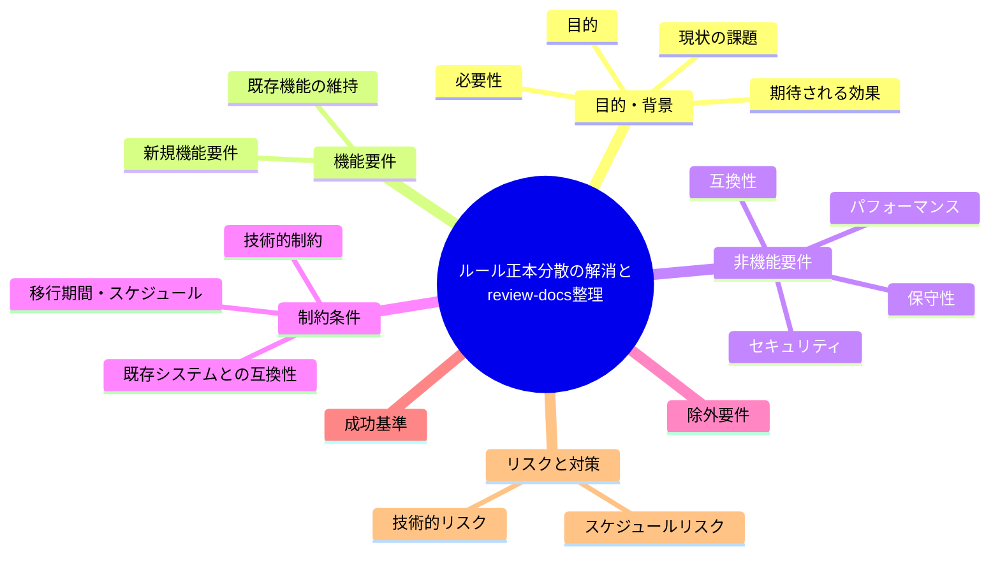
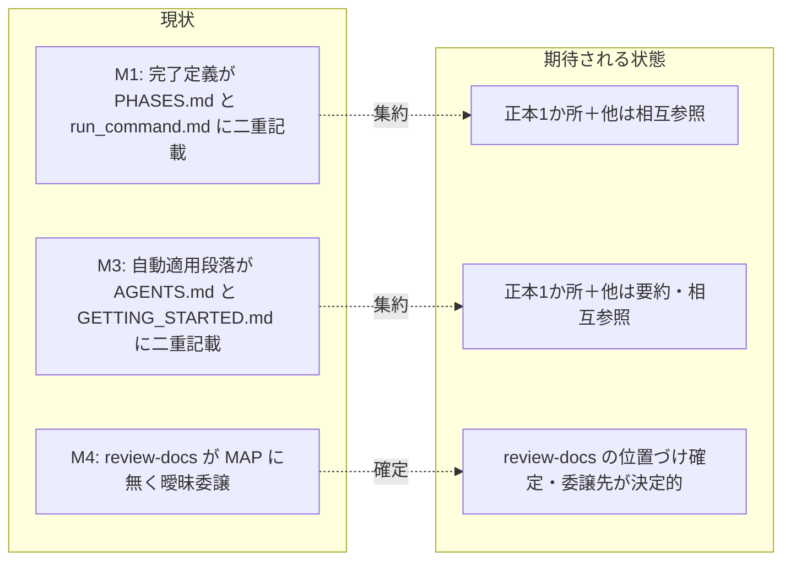

# 要求定義書: ルール正本分散の解消と review-docs の位置づけ整理

**プロジェクト名**: ルール正本分散の解消と review-docs の位置づけ整理
**作成日**: 2026 年 06 月 14 日
**最終更新**: 2026 年 06 月 14 日

> **重要**:
>
> - 要求定義書は、プロジェクトの全体像を把握するためのものです。詳細な技術仕様や実装方法は要件定義書以降で記載します。必要最低限の情報に収めることを心掛けてください。
> - **このドキュメントは常に更新**: 要求の変更や追加があった場合は、即座にこのドキュメントを更新してください。ドキュメントは「生きているドキュメント」として扱い、実装内容と常に同期させます。
> - **必須項目**: 以下の「必須」と明記した項目は空欄・抽象語のみで提出しないこと。判定可能な形（目的は1文・成功基準は○/×で判定できる記載等）で記入すること。
>
> **用語**: [.agents/CONCEPTS.md §用語規約](../../../../.agents/CONCEPTS.md#用語規約) を参照。

---

## 要求定義の全体像

**注意**:

- マインドマップは全体像を把握するためのものです。主要なセクション名程度に留め、詳細は記載しないでください。

---

## 1. 目的・背景

### 1.1 目的（必須）

ルール本文の重複を排し、正本を1か所に集約して相互参照化する（M1・M3・M4）。

### 1.2 背景

本リポジトリの `.agents/` 仕様群は「1ファイル1責務・重複禁止・正本1か所」を設計原則（[.agents/spec/01_設計原則.md §単一責務](../../../../.agents/spec/01_設計原則.md)、[.agents/META_LAYER.md §責務境界](../../../../.agents/META_LAYER.md)）として掲げているが、ルール本文が複数ファイルに重複し、正本が曖昧な箇所が残っている。調査で以下を実ファイルにて確認した。

- **現状の課題**:
  - **M1（正本分散）**: 「実装前ドキュメントレビュー『完了』の定義 — (1) memo 作成 (2) 指摘がなくなるまでの修正反復 (3) 書記（write-workflow-log）委譲」が **2 か所に本文重複**している。
    - [.agents/workflow/PHASES.md:63](../../../../.agents/workflow/PHASES.md)（「ドキュメントレビュー『完了』の定義」）
    - [.agents/skills/agent/run_command.md:54](../../../../.agents/skills/agent/run_command.md)（「ドキュメントレビュー『完了』の定義（必須）」）
    - いずれも (1)(2)(3) を同等の本文として定義しており、片方を更新すると不整合が生じる。
  - **M3（重複）**: 「**通常依頼でも agents を自動適用する。**」段落（解釈＝agents workflow／進行役＝orchestrator／sub-agent・skills・commands を自動選択／出力は IO_CONTRACT・RULES に従う）が **2 か所に本文重複**している。
    - [AGENTS.md:14](../../../../AGENTS.md)（冒頭の入口宣言）
    - [.agents/GETTING_STARTED.md:3](../../../../.agents/GETTING_STARTED.md)（使い方 1 ページの先頭）
  - **M4（位置づけ不明）**: command として [.agents/commands/review-docs.md](../../../../.agents/commands/review-docs.md) が**実在する**が、phase→command の単一正本である [.agents/workflow/PHASE_COMMAND_MAP.md](../../../../.agents/workflow/PHASE_COMMAND_MAP.md) の対応表に **review-docs の行が無い**。同表は「本表が phase → command の唯一の経路である。本表にない command の起動は禁止。」と明記しており（PHASE_COMMAND_MAP.md:37）、review-docs は「実在するが起動経路が無い／禁止対象」という矛盾状態にある。さらに [.agents/commands/create-pr-review-issue.md:31](../../../../.agents/commands/create-pr-review-issue.md) は「**commands/review-docs または skills/review を参照して**監査・レビューに依頼する」と**曖昧委譲**しており、どちらを呼ぶか（どの review skill か）が決定的でない。
  - **L1（要再確認 → 判定済み）**: 別調査が「skill パスの `/`↔`__` 不整合」「agent skill の README 欠落」を問題として指摘したが、本リポの正本 `.agents/skills/` を実確認した結果、**大半は誤認**と判定した（詳細は §5・§7 リスク欄）。実害となり得る点は「agent skill ディレクトリに README.md が無い」のみだが、`.agents/skills/agent/SKILL.md` は存在し、e2e テスト（[.agents/scripts/test/e2e-install-uninstall.sh:469](../../../../.agents/scripts/test/e2e-install-uninstall.sh)）も `agent/SKILL.md` の存在を契約として検証している。よって**実害なし**。本 issue では受け入れ基準に含めず、誤認である旨を記録するに留める。

- **必要性**:
  - 重複本文は片側更新による不整合（仕様の二枚舌）を生む。enforcement やレビューの判断根拠が分裂し、AI の誤操作・判断揺れの温床となる（META_LAYER §基盤膨張防止）。
  - review-docs の位置づけが未確定なまま運用されると、「禁止 command を起動する」「曖昧委譲でどの skill を呼ぶか毎回判断が割れる」状態が固定化する。

### 1.3 期待される効果（必須: 1 件以上）

- **効果 1**: M1・M3 の重複本文が各 1 か所の正本に集約され、他箇所は相互参照（リンク）のみになる（重複本文を grep して正本以外に本文が残らないことで○/×判定可能）。
- **効果 2**: review-docs が「正規 command か補助 command か」明確に定義され、PHASE_COMMAND_MAP.md と PHASES.md の表に反映される（表に review-docs 行が存在し、create-pr-review-issue.md の曖昧委譲が解消されることで○/×判定可能）。
- **効果 3**: create-pr-review-issue.md の監査ステップで「どの review skill / command を呼ぶか」が決定的に1つに定まる（「または」表記が消えることで○/×判定可能）。

**現状と期待される状態の比較**:

---

## 2. 機能要件

### 2.1 既存機能の維持（該当する場合）

- 実装前ドキュメントレビューの運用（memo 記録＋修正反復＋書記委譲）の**意味・効力は変えない**。本 issue は本文の重複解消と参照化のみを行い、ルールの内容は据え置く。
- 「通常依頼でも agents を自動適用」の方針・自立進行ルールの**効力は変えない**。
- enforcement 失敗条件（#22・#23・#29 等）が参照する完了定義の**意味は変えない**。

### 2.2 新規機能要件

- **M1**: 「ドキュメントレビュー『完了』の定義 (1)(2)(3)」の**正本を 1 か所に定め**、他箇所は本文を削除して正本への相互参照（リンク）に置き換える。
- **M3**: 「通常依頼でも agents を自動適用」段落の**正本を 1 か所に定め**、他箇所は重複本文を削除し相互参照（または最小限の要約＋リンク）に置き換える。
- **M4**:
  - review-docs を「正規 command」か「補助 command（特定 command から呼ばれる内部手順）」かに**確定**する。
  - 確定結果を [PHASE_COMMAND_MAP.md](../../../../.agents/workflow/PHASE_COMMAND_MAP.md) と [PHASES.md](../../../../.agents/workflow/PHASES.md) の記述に反映する（正規ならば表に行を追加、補助ならば「表に載せない理由」を明記して禁止条項との矛盾を解消）。
  - [create-pr-review-issue.md:31](../../../../.agents/commands/create-pr-review-issue.md) の「review-docs **または** skills/review」を、**どちらか 1 つに決定**して曖昧さを除去する（呼ぶ review skill / command を 1 つに固定）。

---

## 3. 非機能要件

### 3.1 パフォーマンス

- 該当なし（ドキュメント仕様の整理であり実行性能に影響しない）。

### 3.2 セキュリティ

- 該当なし。

### 3.3 互換性

- enforcement（audit.sh）の失敗条件番号（#22・#23・#29 等）が参照する定義の意味を変えないこと。参照リンクの追加・本文の移動により監査結果が変わってはならない。
- 配布アダプタ（`.adapters/claude/`・`.adapters/cursor/`）にも同一の本文重複が存在するため、正本側を修正した後にアダプタが再生成・同期されることを前提とする（アダプタは生成物であり、手編集ではなく正本からの再生成で追従する）。

### 3.4 保守性

- 修正後、対象の重複本文が正本以外に残らないこと（grep で検証可能）。
- 1ファイル1責務・正本1か所（[.agents/spec/01_設計原則.md](../../../../.agents/spec/01_設計原則.md)・[.agents/META_LAYER.md §責務境界](../../../../.agents/META_LAYER.md)）への適合を回復する。

---

## 4. 制約条件

### 4.1 技術的制約

- META_LAYER の基盤膨張防止ルールに従い、**新規 .md を増やさない**（既存ファイルの本文削除＋相互参照化で対応する）。本 issue 自体が「文書追加ではなく重複削除」である。
- PHASE_COMMAND_MAP.md は「phase → command の単一の正本」であり、review-docs の扱いは本ファイルと PHASES.md の双方で矛盾なく定義すること。
- 正本の選定基準は spec の責務分担に従う:
  - 完了定義（M1）の正本候補は、レビュー成果物の配置ルールを定める [PHASES.md §レビュー成果物の配置ルール](../../../../.agents/workflow/PHASES.md) が有力（run_command.md は「委譲の I/F」が責務であり、レビュー運用ルールの本文は持つべきでない）。最終決定は設計フェーズで行う。
  - 自動適用段落（M3）の正本候補は、入口宣言である [AGENTS.md](../../../../.agents/../AGENTS.md) が有力（GETTING_STARTED.md は「手順の要約のみ」を責務とし、正本は他に置くと自ら宣言している）。最終決定は設計フェーズで行う。

### 4.2 既存システムとの互換性

- 既存の enforcement 監査・各 command の skill chain の挙動を変えないこと（参照先が変わっても解決可能なリンクであること）。

### 4.3 移行期間・スケジュール

- 単一 issue。フェーズ分割は行わず、設計→実装計画→実装→レビューの通常フローで完結させる。

---

## 5. 除外要件

- **L1（skill パス `/`↔`__` 不整合・agent README 欠落）への対応は本 issue の対象外**とする。調査の結果、`.agents/skills/` 配下の全 leaf skill は `{domain}/{capability}/` の実パスを持ち、README.md・SKILL.md の双方が存在する。`__` 区切りはインストール先 `.claude/skills/` に適用されるハーネスの skill 命名規約に由来する表示名であり、正本パスの不整合ではない。`agent` skill のみ README.md を持たないが SKILL.md は存在し、e2e テストも `agent/SKILL.md` を契約として検証しているため実害はない。したがって本 issue では受け入れ基準に含めず、誤認である旨の記録に留める（§7 リスク欄および §1.2 L1）。
- ルール内容そのものの変更（完了定義の手順変更・自動適用方針の変更など）。本 issue は重複解消と位置づけ確定のみ。

---

## 6. 成功基準（必須: 1 件以上）

- **SC-1（M1）**: 「ドキュメントレビュー『完了』の定義 (1)(2)(3)」の本文が**正本 1 か所のみ**に存在し、もう一方は相互参照（リンク）に置き換わっている（両ファイルを確認して本文重複が無いことで○/×判定）。
- **SC-2（M3）**: 「通常依頼でも agents を自動適用」段落の本文が**正本 1 か所のみ**に存在し、もう一方は重複本文を持たない（要約＋リンク可）（両ファイルを確認して本文重複が無いことで○/×判定）。
- **SC-3（M4-a）**: review-docs が正規/補助のいずれかに確定し、PHASE_COMMAND_MAP.md・PHASES.md の記述が矛盾なく整合している（「本表にない command の起動は禁止」と review-docs の実在が矛盾しない状態）。
- **SC-4（M4-b）**: create-pr-review-issue.md:31 の「review-docs または skills/review」が、呼ぶ対象 1 つに確定している（「または」の曖昧表記が解消）。
- **SC-5**: 新規 .md を追加していない（重複削除＋相互参照のみ）。
- **SC-6**: enforcement 監査（audit）が通り、参照リンクがすべて解決可能である。
- **SC-7（L1 記録）**: L1 の判定結果（誤認である旨と根拠）が本 00 に記録されている。

---

## 7. リスクと対策

### 7.1 技術的リスク

- **リスク**: 重複本文を片方だけ削除し、相互参照リンクを張り忘れて「定義が消える」ことになる。
  - **対策**: 削除前に正本を確定し、削除側には必ず正本へのリンク（§見出しアンカー付き）を残す。レビューフェーズで grep により「本文消失」と「重複残存」の両方を確認する。
- **リスク**: 配布アダプタ（`.adapters/`）に重複本文が残り、再生成前に不整合が露見する。
  - **対策**: アダプタは生成物。正本修正後に再生成/同期する設計とし、手編集しない（互換性 §3.3）。
- **リスク**: L1 を「問題」と誤って受け入れ基準に取り込み、不要な README 追加で META_LAYER の膨張防止に反する。
  - **対策**: L1 は除外要件として明記済み（§5）。`.agents/skills/agent/SKILL.md` の存在と e2e テストの契約により実害なしと確定。

### 7.2 スケジュールリスク

- **リスク**: M4 の「正規/補助」判断が設計フェーズで割れて手戻りする。
  - **対策**: 00 で正本候補と判断基準（spec の責務分担）を提示済み。設計フェーズで 1 つに確定させる。

---

## 8. 参考資料

### プロジェクトドキュメント

- [.agents/workflow/PHASES.md](../../../../.agents/workflow/PHASES.md) §レビュー成果物の配置ルール（M1 正本候補）
- [.agents/skills/agent/run_command.md](../../../../.agents/skills/agent/run_command.md) §実装前のドキュメントレビュー（M1 重複側）
- [AGENTS.md](../../../../AGENTS.md)（M3 正本候補）
- [.agents/GETTING_STARTED.md](../../../../.agents/GETTING_STARTED.md)（M3 重複側）
- [.agents/commands/review-docs.md](../../../../.agents/commands/review-docs.md)（M4 対象）
- [.agents/workflow/PHASE_COMMAND_MAP.md](../../../../.agents/workflow/PHASE_COMMAND_MAP.md)（M4: 表の正本）
- [.agents/commands/create-pr-review-issue.md](../../../../.agents/commands/create-pr-review-issue.md)（M4: 曖昧委譲箇所）

### その他の参考資料

- [.agents/spec/01_設計原則.md](../../../../.agents/spec/01_設計原則.md)（単一責務・1ファイル1責務）
- [.agents/META_LAYER.md](../../../../.agents/META_LAYER.md)（基盤膨張防止・責務境界・文書追加ルール）

---

## 9. 次のステップ

この要求定義書の承認後、以下のドキュメントを作成します：

- **次**: [`01_要件定義.md`](./01_要件定義.md) - 要件定義フェーズ
