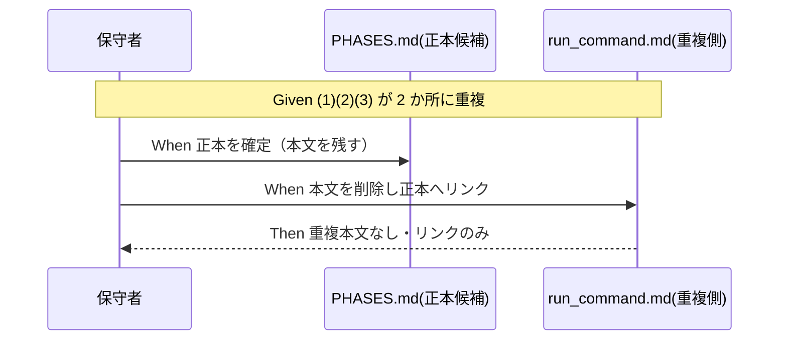
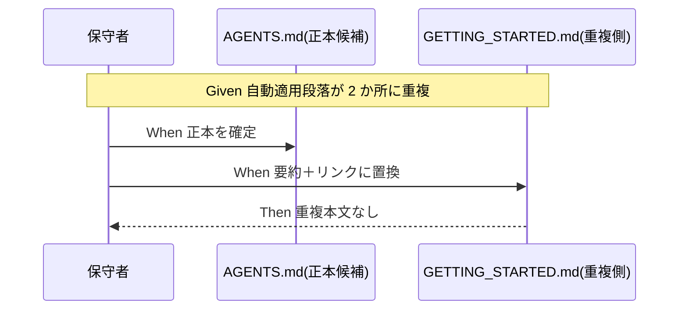
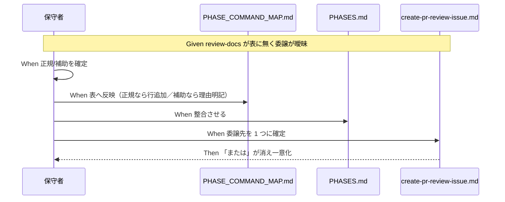

# 要件定義書: ルール正本分散の解消と review-docs の位置づけ整理

**プロジェクト名**: ルール正本分散の解消と review-docs の位置づけ整理
**作成日**: 2026 年 06 月 14 日
**最終更新**: 2026 年 06 月 14 日

> **重要**: **このドキュメントは常に更新**: 要件の変更や追加があった場合は、即座にこのドキュメントを更新してください。ドキュメントは「生きているドキュメント」として扱い、実装内容と常に同期させます。
>
> **用語**: [.agents/CONCEPTS.md §用語規約](../../../../.agents/CONCEPTS.md#用語規約) を参照。

---

## 1. 概要

### 1.1 システム概要

本リポジトリの `.agents/` 仕様群について、「1ファイル1責務・重複禁止・正本1か所」の原則を回復する。具体的には (M1) 実装前ドキュメントレビュー完了定義、(M3) 通常依頼の自動適用段落、の重複本文を各 1 か所の正本に集約して他を相互参照化し、(M4) review-docs command の位置づけを確定して phase→command 表・曖昧委譲を整合させる。L1（skill パス／README 欠落）は誤認のため対象外（00 §5 で記録済み）。

### 1.2 用語集

| 用語 | 説明 |
| -------- | ------ |
| 正本（source of truth） | あるルール本文を定義する唯一の箇所。他箇所は本文を持たず相互参照（リンク）のみ。 |
| 相互参照化 | 重複本文を削除し、正本への §見出しアンカー付きリンクに置き換えること。 |
| M1 | 「ドキュメントレビュー『完了』の定義 (1)memo (2)修正反復 (3)書記委譲」が PHASES.md:63 と run_command.md:54 に重複している問題。 |
| M3 | 「通常依頼でも agents を自動適用」段落が AGENTS.md:14 と GETTING_STARTED.md:3 に重複している問題。 |
| M4 | review-docs command が PHASE_COMMAND_MAP に無く、create-pr-review-issue.md:31 から曖昧委譲されている位置づけ不明の問題。 |
| L1 | 「skill パス `/`↔`__` 不整合・agent README 欠落」の指摘。調査の結果、誤認と判定（00 §5）。 |
| 正規 command / 補助手順 | 正規 command は PHASE_COMMAND_MAP の表に載り phase から直接選択される。補助手順は他 command から内部的に呼ばれ、表には載せない（載せない理由を明記）。 |

---

## 2. 機能要件

### 2.1 ユーザーストーリー

#### ストーリー 1: 重複した完了定義の正本化（M1）

- **As a** AGENTS 仕様の保守者
- **I want to** ドキュメントレビュー完了定義 (1)(2)(3) を正本 1 か所に集約し、もう一方を相互参照にしたい
- **So that** 片側更新による定義の不整合（仕様の二枚舌）を防げる

**受け入れ基準**:

- (1)(2)(3) の本文が PHASES.md か run_command.md の**一方のみ**に存在する。
- もう一方は本文を持たず、正本への §見出しアンカー付きリンクのみを持つ。
- 完了定義の**意味・効力は変わっていない**（手順 (1)(2)(3) はそのまま）。

#### ストーリー 2: 自動適用段落の正本化（M3）

- **As a** AGENTS 仕様の保守者
- **I want to** 「通常依頼でも agents を自動適用」段落を正本 1 か所に集約したい
- **So that** 入口宣言と使い方ページの間で記述がずれない

**受け入れ基準**:

- 当該段落の本文が AGENTS.md か GETTING_STARTED.md の**一方のみ**に存在する。
- もう一方は重複本文を持たず、最小限の要約＋正本へのリンクに置き換わっている。
- 自立進行ルール・自動適用方針の**効力は変わっていない**。

#### ストーリー 3: review-docs の位置づけ確定（M4）

- **As a** メインエージェント（orchestrator）／保守者
- **I want to** review-docs が正規 command か補助手順かを知り、表と委譲先が決定的である状態にしたい
- **So that** 「本表にない command の起動は禁止」と review-docs の実在が矛盾せず、create-pr-review-issue.md の監査委譲先が一意に定まる

**受け入れ基準**:

- review-docs が「正規 command」または「補助手順」のいずれかに明記されている。
- PHASE_COMMAND_MAP.md と PHASES.md が矛盾なく整合している（正規なら表に行を追加、補助なら表に載せない理由を明記）。
- create-pr-review-issue.md:31 の「review-docs **または** skills/review」が、呼ぶ対象 1 つに確定し「または」が消えている。

#### ストーリー 4: L1 の判定記録（誤認の明文化）

- **As a** 保守者
- **I want to** L1（skill パス／README 欠落）が誤認である根拠を記録したい
- **So that** 将来の調査で同じ誤指摘により不要な README 追加（META_LAYER 膨張）を招かない

**受け入れ基準**:

- 00_要求定義.md に L1 が誤認である旨と根拠（実パス構造・SKILL.md 存在・e2e テスト契約）が記録されている。
- L1 は受け入れ基準（実装対象）に含めない（除外要件に明記）。

### 2.2 BDD ユースケース

#### ユースケース 1: M1 完了定義の正本化

実装前ドキュメントレビュー完了定義の重複を解消し、正本以外を相互参照にする。

**シナリオ 1: 正本のみに本文が残る**

```gherkin
Feature: M1 完了定義の正本化
  Scenario: 重複本文を正本へ集約する
    Given PHASES.md:63 と run_command.md:54 に (1)(2)(3) の本文が重複している
    When 正本を 1 ファイルに確定し、もう一方の本文を削除して正本へのリンクに置き換える
    Then (1)(2)(3) の本文は正本 1 か所のみに存在する
    And もう一方は正本への §見出しアンカー付きリンクのみを持つ
    And 完了定義の手順 (1)(2)(3) の意味は変わっていない
```

**処理フロー**:



**シナリオ 2: 重複が残っていないことを検証する**

```gherkin
Feature: M1 完了定義の正本化
  Scenario: grep で重複残存を検出しない
    Given 正本化の修正が完了している
    When 完了定義の特徴的な文言を全 .agents 配下で grep する
    Then 本文ヒットは正本 1 か所のみで、重複本文ヒットが無い
```

#### ユースケース 2: M3 自動適用段落の正本化

「通常依頼でも agents を自動適用」段落の重複を解消する。

**シナリオ 1: 段落の正本化**

```gherkin
Feature: M3 自動適用段落の正本化
  Scenario: 自動適用段落を正本へ集約する
    Given AGENTS.md:14 と GETTING_STARTED.md:3 に自動適用段落が重複している
    When 正本を 1 ファイルに確定し、もう一方を要約＋リンクに置き換える
    Then 段落本文は正本 1 か所のみに存在する
    And もう一方は重複本文を持たず正本へリンクする
    And 自立進行ルール・自動適用方針の効力は変わっていない
```

**処理フロー**:



#### ユースケース 3: M4 review-docs の位置づけ確定と委譲先の一意化

review-docs を正規/補助に確定し、表と曖昧委譲を整合させる。

**シナリオ 1: 位置づけ確定と表の整合**

```gherkin
Feature: M4 review-docs の位置づけ確定
  Scenario: review-docs を正規/補助に確定し表へ反映する
    Given review-docs.md は実在するが PHASE_COMMAND_MAP に行が無く、表は「本表にない command の起動は禁止」と定める
    When review-docs を正規 command か補助手順かに確定する
    Then PHASE_COMMAND_MAP.md と PHASES.md が矛盾なく整合する
    And review-docs の実在と「禁止」条項が矛盾しない状態になる
```

**シナリオ 2: 曖昧委譲の解消**

```gherkin
Feature: M4 review-docs の位置づけ確定
  Scenario: create-pr-review-issue の監査委譲先を一意化する
    Given create-pr-review-issue.md:31 が「review-docs または skills/review を参照」と曖昧委譲している
    When 呼ぶ対象を 1 つに確定して記述を更新する
    Then 「または」の曖昧表記が消え、委譲先が決定的になる
```

**処理フロー**:



#### ユースケース 4: L1 判定の記録

**シナリオ 1: 誤認の根拠を記録する**

```gherkin
Feature: L1 判定の記録
  Scenario: L1 を誤認として記録し対象外とする
    Given 別調査が skill パス不整合・agent README 欠落を問題視している
    When .agents/skills/ の実パス・SKILL.md 存在・e2e テスト契約を確認する
    Then L1 は誤認と判定され 00 にその根拠が記録される
    And L1 は実装対象（受け入れ基準）に含めない
```

### 2.3 ビジネスルール

- **BR-1**: 新規 .md を増やさない（META_LAYER 基盤膨張防止）。本 issue は重複本文の削除＋相互参照化のみ。
- **BR-2**: 重複本文の削除側には必ず正本への解決可能なリンク（§見出しアンカー付き）を残す。本文消失を作らない。
- **BR-3**: ルール内容の意味・効力は変更しない（重複解消と位置づけ確定のみ）。
- **BR-4**: 配布アダプタ（`.adapters/`）は生成物であり手編集しない。正本修正後に再生成/同期で追従させる。
- **BR-5**: 正本の選定は spec の責務分担に従う（完了定義 → レビュー運用ルールを持つ PHASES.md が候補、自動適用段落 → 入口宣言の AGENTS.md が候補。最終決定は設計フェーズ）。

---

## 3. 非機能要件

### 3.1 パフォーマンス要件

- 該当なし（ドキュメント仕様整理であり実行性能に影響しない）。

### 3.2 セキュリティ要件

- 該当なし。

### 3.3 ユーザビリティ要件

- 相互参照リンクは §見出しアンカーを含み、参照先の該当節へ直接到達できること。

### 3.4 可用性要件

- enforcement 監査（audit）が修正後も成功すること。失敗条件 #22・#23・#29 等が参照する完了定義の意味が保持され、監査結果が変わらないこと。

---

## 4. 外部インターフェース要件

### 4.1 API 要件

- 該当なし（プログラム API は無い）。phase→command の対応表（PHASE_COMMAND_MAP.md）を「契約」とみなし、review-docs の扱いを表と整合させることが本要件に相当する。

### 4.2 データ形式要件

- Markdown。frontmatter の document_id / issue_id 規約に従う（00 は issue_id を保持）。
- 相互参照は相対パス＋ §見出しアンカー形式とする。

---

## 5. 制約事項

- META_LAYER の責務境界（RULES / COMMANDS / SKILLS / TEMPLATES）を越えて本文を書かない。完了定義の本文は「レビュー運用ルール」を責務とするファイルに置き、「委譲の I/F」を責務とする run_command.md には置かない方向で設計する。
- PHASE_COMMAND_MAP.md は phase→command の単一正本。review-docs の扱いは本ファイルと PHASES.md で矛盾なく定義する。
- 単一 issue。設計→実装計画→実装→レビューの通常フローで完結させる。
- L1 は対象外（00 §5・本書 §2.1 ストーリー 4・§2.2 ユースケース 4 で記録のみ）。

---

## 6. 参考資料

### プロジェクトドキュメント

- [`00_要求定義.md`](./00_要求定義.md) - 要求定義

### その他の参考資料

- [.agents/workflow/PHASES.md](../../../../.agents/workflow/PHASES.md)（M1 正本候補・レビュー成果物の配置ルール）
- [.agents/skills/agent/run_command.md](../../../../.agents/skills/agent/run_command.md)（M1 重複側）
- [AGENTS.md](../../../../AGENTS.md)（M3 正本候補）
- [.agents/GETTING_STARTED.md](../../../../.agents/GETTING_STARTED.md)（M3 重複側）
- [.agents/commands/review-docs.md](../../../../.agents/commands/review-docs.md) / [.agents/workflow/PHASE_COMMAND_MAP.md](../../../../.agents/workflow/PHASE_COMMAND_MAP.md) / [.agents/commands/create-pr-review-issue.md](../../../../.agents/commands/create-pr-review-issue.md)（M4）
- [.agents/spec/01_設計原則.md](../../../../.agents/spec/01_設計原則.md) / [.agents/META_LAYER.md](../../../../.agents/META_LAYER.md)

---

## 7. 前のステップ

この要件定義書は、以下のドキュメントを基に作成されています：

- **前**: [`00_要求定義.md`](./00_要求定義.md) - 要求定義フェーズ

---

## 8. 次のステップ

この要件定義書の承認後、以下のドキュメントを作成します：

- **次**: [`02_設計.md`](./02_設計.md) - 設計フェーズ
