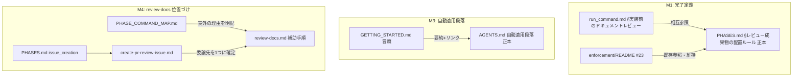
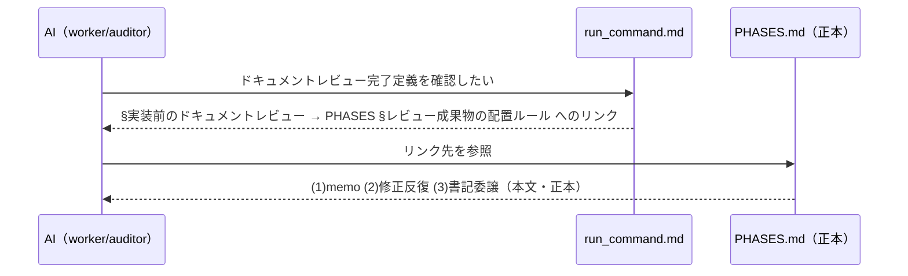
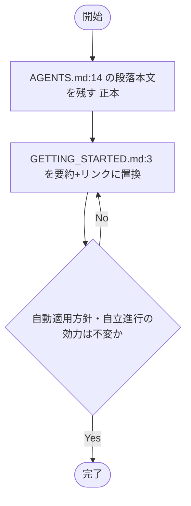
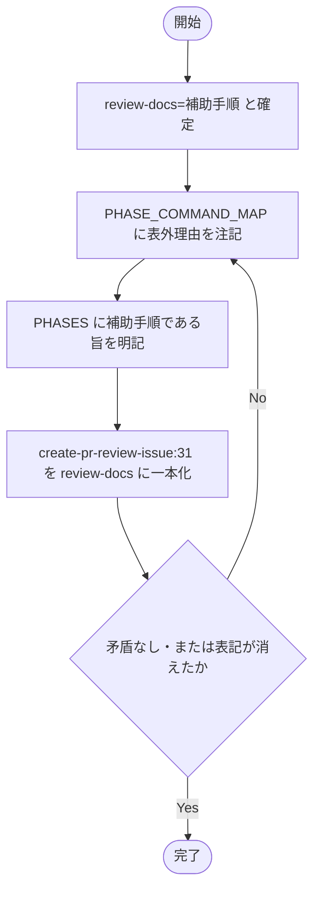

# 設計書: ルール正本分散の解消と review-docs の位置づけ整理

**プロジェクト名**: ルール正本分散の解消と review-docs の位置づけ整理
**作成日**: 2026 年 06 月 14 日
**最終更新**: 2026 年 06 月 14 日

> **重要**: **このドキュメントは常に更新**: 設計の変更や追加があった場合は、即座にこのドキュメントを更新してください。ドキュメントは「生きているドキュメント」として扱い、実装内容と常に同期させます。
>
> **用語**: [.agents/CONCEPTS.md §用語規約](../../../../.agents/CONCEPTS.md#用語規約) を参照。

---

## 1. 設計概要

**必須**: 設計方針・原則は [.agents/spec/01\_設計原則.md](../../../../.agents/spec/01_設計原則.md) を先に参照した上で記載する。

### 1.1 設計方針

「1 ファイル 1 責務・重複禁止・正本 1 か所」を回復するため、重複本文を各 1 か所の正本に集約し、他箇所は本文を削除して §見出しアンカー付きの相互参照に置き換える。新規 .md は追加せず、既存ファイルの本文削除＋参照化のみで構成する。

### 1.2 設計原則（本プロジェクトで適用するもの）

- **単一責務**: 各仕様ファイルは [META_LAYER §責務境界](../../../../.agents/META_LAYER.md)（RULES / COMMANDS / SKILLS / TEMPLATES）に基づき 1 責務のみを持つ。完了定義（レビュー運用ルール）は「レビュー成果物の配置」を責務とするファイルに置き、「委譲の I/F」を責務とするファイルには置かない。
- **AI フレンドリー設計**: 正本を 1 か所に集約することで、AI が参照すべき定義の所在を一意化し、片側更新による判断揺れ（仕様の二枚舌）を排除する。[01\_設計原則 §AI フレンドリー設計](../../../../.agents/spec/01_設計原則.md#aiフレンドリー設計)（明確な責務）に適合。
- **UNIX 哲学**: 「シンプルに保つ」— ルール本文を増やさず、重複削除のみで境界を整える（[META_LAYER §基盤膨張防止](../../../../.agents/META_LAYER.md) Rule 3 最小変更）。

---

## 2. アーキテクチャ設計

### 2.1 責務・境界・参照関係

#### 2.1.1 責務一覧

本 issue が触れる仕様ファイルの「正本としての責務」を 1 文ずつ定義する。各ルール本文は **1 ファイルのみが本文を持ち、他はリンク**とする。

| コンポーネント（ファイル） | 責務（1 文） | 本 issue での役割 |
| --- | --- | --- |
| `.agents/workflow/PHASES.md` | フェーズ順・成果物・DoD・レビュー成果物の配置ルールを定める | **M1 完了定義の正本**（§レビュー成果物の配置ルール）。M4 で review-docs の位置づけを反映 |
| `.agents/skills/agent/run_command.md` | command を起動するときの共通委譲 I/F を定める | M1 完了定義は本文を持たず PHASES へ相互参照（重複側） |
| `.agents/enforcement/README.md` | 失敗条件と差し戻しを定める | M1 完了定義は既に参照のみ（#23）。本 issue で変更しない（参照維持を確認するだけ） |
| `AGENTS.md` | 入口案内（orchestrator 宣言・自動適用・自立進行ルール）を定める | **M3 自動適用段落の正本** |
| `.agents/GETTING_STARTED.md` | 使い方 1 ページ（手順の要約のみ） | M3 自動適用段落は要約＋リンクに置換（重複側）。本ファイルは自ら「手順の要約のみ」と宣言済み |
| `.agents/commands/review-docs.md` | 実装前ドキュメントレビューの手順を定める command 定義 | **M4 で「補助手順（特定 command から呼ばれる）」と確定** |
| `.agents/workflow/PHASE_COMMAND_MAP.md` | phase → command の単一正本（表）を定める | M4: review-docs を表に載せない理由を明記し「禁止」条項との矛盾を解消 |
| `.agents/commands/create-pr-review-issue.md` | PR 指摘対応 issue 起票 command の定義 | M4: 監査委譲先の曖昧表記（review-docs または skills/review）を review-docs 1 つに確定 |

#### 2.1.2 境界

- **入力**: 上記 8 ファイルの現行本文（重複本文・曖昧委譲・表の欠落）。
- **出力**: 重複本文が正本 1 か所に集約され、他は相互参照化された同 8 ファイル。新規ファイルは作らない。
- **他責務との境界**:
  - **本 issue の範囲外**: ルール内容そのものの変更（完了定義の手順 (1)(2)(3) の意味、自動適用方針、自立進行ルールの効力）。本 issue は重複削除と位置づけ確定のみ。
  - **本 issue の範囲外**: 配布アダプタ `.adapters/claude/`・`.adapters/cursor/` の手編集。これらは**生成物**であり、正本修正後の再生成/同期で追従する（[01\_要件定義 BR-4](./01_要件定義.md)）。本 issue では正本のみを編集する。
  - **本 issue の範囲外**: L1（skill パス `/`↔`__`・agent README 欠落）。誤認として 00 §5 に記録済み。

#### 2.1.3 参照関係

ルール本文の「正本 → 参照元」の向き（呼び出し元＝参照する側 → 呼び出し先＝本文を持つ正本）を 1 行ずつ示す。循環は持たない。

- `run_command.md` §実装前のドキュメントレビュー → `PHASES.md` §レビュー成果物の配置ルール（M1。本文を持たずリンク）
- `enforcement/README.md` #23 → `PHASES.md` §レビュー成果物の配置ルール および `run_command.md` §実装前のドキュメントレビュー（既存。維持）
- `GETTING_STARTED.md` 冒頭 → `AGENTS.md` 自動適用段落（M3。要約＋リンク）
- `PHASE_COMMAND_MAP.md` → `review-docs.md`（M4。表外である理由の説明としてリンク）
- `PHASES.md` §issue_creation → `create-pr-review-issue.md` → `review-docs.md`（M4。補助手順としての呼び出し経路）
- `create-pr-review-issue.md` §PROCESS step2 → `review-docs.md`（M4。委譲先を 1 つに確定）

**循環の不在**: M1 は run_command → PHASES の一方向。M3 は GETTING_STARTED → AGENTS の一方向。M4 は MAP/PHASES/create-pr-review-issue → review-docs の一方向。相互に本文を参照し合う循環は生じない。

### 2.2 システムアーキテクチャ

**必須**: 設計判断は [.agents/spec/](../../../../.agents/spec/)（[00_spec概要.md](../../../../.agents/spec/00_spec概要.md)、[01\_設計原則.md](../../../../.agents/spec/01_設計原則.md)、[06\_設計判断の優先順位.md](../../../../.agents/spec/06_設計判断の優先順位.md)）を先に参照すること。

- **採用パターン**: 単一責務 + 参照集約（Single Source of Truth）。各ルール本文を 1 ファイルに集約し、他は相互参照のみとする。
- **根拠**: [01\_設計原則 §単一責務](../../../../.agents/spec/01_設計原則.md)・[META_LAYER §責務境界・§基盤膨張防止](../../../../.agents/META_LAYER.md)。本文の重複を排し、責務を持つファイルにのみ本文を置くことで、片側更新による不整合を構造的に防ぐ。

#### 2.2.1 CQRS（Command/Query 分離）

該当なし（ドキュメント仕様の整理であり、状態変更/取得の分離は対象外）。

#### 2.2.2 アーキテクチャ図（本プロジェクトの構成で記載）



### 2.3 コンポーネント構成

[META_LAYER §責務境界](../../../../.agents/META_LAYER.md) の 4 層に沿って整理する。

- **RULES 層**（破ってはいけない原則）: 完了定義の本文 → **PHASES.md**（レビュー運用ルールを責務とする）。自動適用段落の本文 → **AGENTS.md**（入口宣言を責務とする）。
- **COMMANDS 層**（作業単位）: `review-docs.md`（補助手順 command）、`create-pr-review-issue.md`、`PHASE_COMMAND_MAP.md`。review-docs は「phase から直接選択される正規 command」ではなく「他 command（create-pr-review-issue）・ユーザーのドキュメントレビュー依頼から呼ばれる補助手順」と位置づける。
- **SKILLS 層**（実行方法）: `run_command.md`（委譲 I/F）。レビュー運用ルール本文は持たず PHASES を参照する。
- 境界違反の禁止（[META_LAYER §責務境界](../../../../.agents/META_LAYER.md)「skill に rule を書く」禁止）に従い、run_command.md（SKILLS 層）にレビュー運用ルール（RULES 相当の完了定義本文）を置かない方向で集約する。

#### M4 の確定（review-docs = 補助手順）

review-docs を**補助手順**と確定する根拠と整合方針:

- **根拠**: PHASE_COMMAND_MAP.md は「phase → command の単一正本」であり、各行は **phase（要求・要件・設計・実装計画・実装・レビュー・issue_creation）から決定的に選ばれる command** を表す。review-docs は特定 phase に対応しない（実装前ドキュメントレビューはどの phase でも起こりうる横断的手順であり、`create-pr-review-issue` の監査 step や、ユーザーの「ドキュメントレビューして」依頼から呼ばれる）。よって phase 行を持たず、表に載せるのは不適切。
- **「本表にない command の起動は禁止」との整合**: 同条項を「**phase からの選択経路**に関する禁止（phase 判定後に表外 command を勝手に選ぶな）」と明確化し、review-docs は「**別 command の内部 step・ドキュメントレビュー依頼から呼ばれる補助手順**」であって phase→command 選択の対象ではない旨を PHASE_COMMAND_MAP.md に注記する。これにより「review-docs が実在するが起動経路が無い／禁止対象」という矛盾を解消する。
- **PHASES.md との整合**: PHASES.md にも review-docs が「実装前ドキュメントレビューの補助手順 command であり、phase→command 表には載せない（補助手順のため）」旨を 1 か所明記し、PHASE_COMMAND_MAP.md と矛盾しない記述にする。
- **create-pr-review-issue.md:31 の確定**: 「review-docs **または** skills/review」を **review-docs** に一本化する。理由: review-docs は「実装前ドキュメントレビューの memo＋修正反復＋書記委譲」を DoD として既に定義済みであり、create-pr-review-issue の監査 step（00 のドキュメントレビュー）が要求する手順と一致する。skills/review は実装後レビュー（04_review）寄りの capability であり、実装前 00 レビューには review-docs が適切。

### 2.4 データフロー

該当なし（イベント発行は無い）。ルール参照の解決フロー（AI が完了定義を確認する経路）を以下に示す。



---

## 3. 機能設計

### 3.1 機能 1: M1 完了定義の正本化

#### 3.1.1 概要

「ドキュメントレビュー『完了』の定義 (1)memo 作成 (2)修正反復 (3)書記委譲」の本文を **PHASES.md §レビュー成果物の配置ルール** に集約し、run_command.md:54 は本文を削除して PHASES への §見出しアンカー付きリンクに置き換える。

#### 3.1.2 処理フロー

```mermaid
flowchart TD
    Start([開始]) --> Check[正本=PHASES.md を確定]
    Check --> Keep[PHASES の (1)(2)(3) 本文を残す]
    Keep --> Replace[run_command.md:54 の本文を削除しリンク化]
    Replace --> Verify{grep で本文ヒットが正本1か所のみか}
    Verify -->|Yes| End([完了])
    Verify -->|No| Replace
```

#### 3.1.3 入力・出力

- **入力**: PHASES.md:63 と run_command.md:54 の (1)(2)(3) 本文（重複）。
- **出力**: PHASES.md に本文 1 か所、run_command.md は「完了の定義は PHASES §レビュー成果物の配置ルール を参照」とリンクのみ。enforcement/README #23 の参照は維持。

#### 3.1.4 エラーハンドリング

- 本文消失防止: run_command.md 側の置換テキストには必ず PHASES への解決可能リンク（§見出しアンカー）を残す。リンク切れは §6 テストで検証。

### 3.2 機能 2: M3 自動適用段落の正本化

#### 3.2.1 概要

「通常依頼でも agents を自動適用する。」段落（解釈＝agents workflow／進行役＝orchestrator／自動選択＝sub-agent・skills・commands／出力＝IO_CONTRACT・RULES）の本文を **AGENTS.md:14** に集約し、GETTING_STARTED.md:3 は最小限の要約＋AGENTS.md へのリンクに置き換える。

#### 3.2.2 処理フロー



#### 3.2.3 入力・出力

- **入力**: AGENTS.md:14 と GETTING_STARTED.md:3 の自動適用段落（重複）。
- **出力**: AGENTS.md に本文、GETTING_STARTED.md は要約 1 文＋「正本は AGENTS.md 冒頭を参照」リンク。GETTING_STARTED.md は既に「入口の固定は AGENTS.md 冒頭を参照」と書いており、本文の重複部分のみ削る。

#### 3.2.4 エラーハンドリング

- 効力不変の保証: 要約は方針名（agents workflow / orchestrator / 自動選択 / IO_CONTRACT・RULES）を残し、詳細本文のみ削除。enforcement #23 等が参照する自立進行ルール本文は AGENTS.md に残存させる。

### 3.3 機能 3: M4 review-docs の位置づけ確定と委譲先一意化

#### 3.3.1 概要

review-docs を**補助手順**と確定し、PHASE_COMMAND_MAP.md に「表に載せない理由」を注記、PHASES.md を整合させ、create-pr-review-issue.md:31 の曖昧委譲を review-docs 1 つに確定する。

#### 3.3.2 処理フロー



#### 3.3.3 入力・出力

- **入力**: PHASE_COMMAND_MAP.md（review-docs 行なし＋禁止条項）、PHASES.md、create-pr-review-issue.md:31（「review-docs または skills/review」）。
- **出力**: 3 ファイルが矛盾なく整合。create-pr-review-issue.md:31 から「または」が消え review-docs に確定。

#### 3.3.4 エラーハンドリング

- 矛盾の再発防止: PHASE_COMMAND_MAP.md と PHASES.md の双方に同じ確定（補助手順）を矛盾なく記載。どちらか一方のみ更新して片側矛盾を残さない。

### 3.4 機能 4: L1 判定の記録（実装対象外・確認のみ）

00 §5 に L1 が誤認である旨と根拠が記録済みであることを確認する。本 issue で新規実装はしない（受け入れ基準外）。

---

## 4. データ設計

該当なし（DB・データモデルは持たない。frontmatter の document_id / issue_id 規約のみに従う）。00 は issue_id を保持し、02/03 は document_id を新規付与して以後不変とする。

---

## 5. API 設計

プログラム API は無い。本 issue における「契約」は **phase → command の対応表（PHASE_COMMAND_MAP.md）** であり、review-docs の扱いを表と整合させることがこれに相当する（[01\_要件定義 §4.1](./01_要件定義.md)）。

| 契約（インターフェース） | 入力 | 出力 | 責務 |
| --- | --- | --- | --- |
| PHASE_COMMAND_MAP の phase→command | phase 名 | 起動する command | phase からの決定的 command 選択。review-docs は phase 行を持たない補助手順として表外明記 |
| create-pr-review-issue PROCESS step2 の委譲先 | 00 のドキュメントレビュー依頼 | review-docs への委譲 | 監査委譲先を review-docs 1 つに固定（曖昧さ排除） |

---

## 6. テスト戦略

テスト戦略の観点定義は [RULES.md のテスト戦略必須要件](../../../../.agents/RULES.md#テスト戦略必須要件) を、BDD 形式は [TEST_BDD_FORMAT.md](../../../../.agents/TEST_BDD_FORMAT.md) を参照する。本ドキュメントでは対象ごとのテスト割当のみ記載する。

### 6.1 対象ごとのテスト割り当て

ドキュメント仕様の整理であり、実行コードのテストは無い。検証は **grep による本文重複検出**・**リンク解決確認**・**enforcement 監査 (audit.sh)** で行う。

| 対象 | 単体 | 結合/API | E2E | クリティカル観点 | バリデーション観点 | 未達理由/補足 |
| --- | --- | --- | --- | --- | --- | --- |
| M1 完了定義の正本化 | × | × | ○ | 特徴文言の grep ヒットが正本 1 か所のみ | run_command 側リンクが PHASES の §へ解決する | 実行コード無し。検証は grep＋リンク確認 |
| M3 自動適用段落の正本化 | × | × | ○ | 段落本文の grep ヒットが AGENTS 1 か所のみ | GETTING_STARTED の要約＋リンクが解決する | 同上 |
| M4 review-docs 位置づけ・委譲一意化 | × | × | ○ | MAP/PHASES に矛盾が無い・review-docs 表外理由が明記 | create-pr-review-issue:31 に「または」が無く review-docs のみ | 同上 |
| enforcement 監査整合 | × | × | ○ | audit.sh が PASS（重複検出含む運用上の確認） | document_id 紐付け・04 関連の既存チェックを壊さない | bash audit.sh をクリーン環境で実行 |

### 6.2 監査・レビューでの確認（証跡）

証跡の確認観点は RULES §テスト戦略必須要件および workflow/PHASES.md の監査観点を参照。本設計書 §6.1 の割当表と 03_実装計画のタスク別テスト観点・BDD が揃っていることを確認する。enforcement 監査（audit）が通り、相互参照リンクが解決することをレビューフェーズで確認する。

---

## 7. UI 設計

該当なし（UI は持たない）。

---

## 8. セキュリティ設計

該当なし（[01\_要件定義 §3.2](./01_要件定義.md)）。

---

## 9. 非機能要件への対応

### 9.1 パフォーマンス

該当なし（ドキュメント整理であり実行性能に影響しない）。

### 9.2 可用性

enforcement 監査（audit.sh）が修正後も PASS し、失敗条件 #22・#23・#29 等が参照する完了定義の意味が保持され、監査結果が変わらないこと。配布アダプタは生成物であり、正本修正後の再生成/同期で追従する（手編集しない）。

---

## 10. 参考資料

### プロジェクトドキュメント

- [`01_要件定義.md`](./01_要件定義.md) - 要件定義
- [`00_要求定義.md`](./00_要求定義.md) - 要求定義

### その他の参考資料

- [.agents/workflow/PHASES.md](../../../../.agents/workflow/PHASES.md) §レビュー成果物の配置ルール（M1 正本）
- [.agents/skills/agent/run_command.md](../../../../.agents/skills/agent/run_command.md)（M1 重複側）
- [AGENTS.md](../../../../AGENTS.md)（M3 正本）/ [.agents/GETTING_STARTED.md](../../../../.agents/GETTING_STARTED.md)（M3 重複側）
- [.agents/commands/review-docs.md](../../../../.agents/commands/review-docs.md) / [.agents/workflow/PHASE_COMMAND_MAP.md](../../../../.agents/workflow/PHASE_COMMAND_MAP.md) / [.agents/commands/create-pr-review-issue.md](../../../../.agents/commands/create-pr-review-issue.md)（M4）
- [.agents/spec/01_設計原則.md](../../../../.agents/spec/01_設計原則.md) / [.agents/META_LAYER.md](../../../../.agents/META_LAYER.md)
- [.agents/enforcement/ci/audit.sh](../../../../.agents/enforcement/ci/audit.sh)（監査）

---

## 11. 前のステップ

この設計書は、以下のドキュメントを基に作成されています：

- **前**: [`01_要件定義.md`](./01_要件定義.md) - 要件定義フェーズ

---

## 12. 次のステップ

この設計書の承認後、以下のドキュメントを作成します：

- **次**: [`03_実装計画.md`](./03_実装計画.md) - 実装計画フェーズ
</content>
</invoke>
