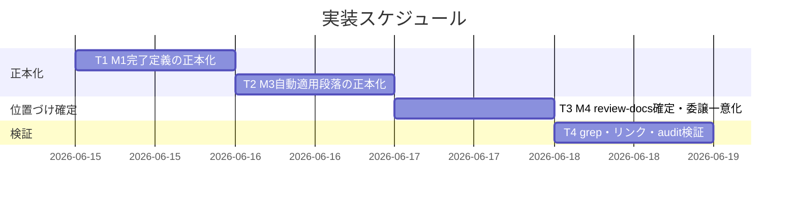
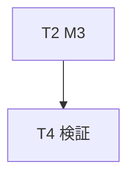
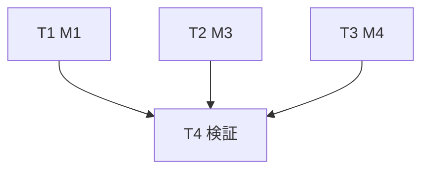

# 実装計画書: ルール正本分散の解消と review-docs の位置づけ整理

**プロジェクト名**: ルール正本分散の解消と review-docs の位置づけ整理
**作成日**: 2026 年 06 月 14 日
**最終更新**: 2026 年 06 月 14 日

> **重要**: **このドキュメントは常に更新**: 実装計画の変更、進捗状況の更新、バグの記録などがあった場合は、即座にこのドキュメントを更新してください。ドキュメントは「生きているドキュメント」として扱い、実装内容と常に同期させます。
> **必須項目**: 「必須」と明記した欄は空欄・抽象語のみで提出しないこと。テスト観点・BDD 仕様は具体ケースを 1 件以上記載すること。
>
> **用語**: [.agents/CONCEPTS.md §用語規約](../../../../.agents/CONCEPTS.md#用語規約) を参照。

---

## 1. 実装概要

### 1.1 実装方針（必須）

[02\_設計](./02_設計.md) の「単一責務 + 参照集約（Single Source of Truth）」に従い、重複本文を各 1 か所の正本に集約し、他箇所を §見出しアンカー付き相互参照に置き換える。新規 .md は追加せず、既存ファイルの本文削除＋参照化のみで実装する。配布アダプタ（`.adapters/`）は本 issue では編集せず、正本修正後の再生成/同期に委ねる。

### 1.2 実装順序（必須: 1 件以上）

M1 → M3 → M4 → 検証（grep・リンク・audit）の順。各 M は独立だが、検証タスク（T4）は M1〜M3・M4 すべての完了に依存する。



---

## 2. タスク分解

**必須**: 各タスクには「テスト観点」（2.x.3）と「単体テスト仕様（BDD）」（2.x.4）を必ず記載する。観点の定義は [02\_設計 §6](./02_設計.md) および [RULES のテスト戦略・TEST_BDD_FORMAT](../../../../.agents/RULES.md#テスト戦略必須要件) を参照。

### 2.1 タスク 1: M1 完了定義の正本化

#### 2.1.1 概要（必須）

ドキュメントレビュー「完了」の定義 (1)(2)(3) を PHASES.md §レビュー成果物の配置ルールに集約し、run_command.md:54 を相互参照に置き換える。

#### 2.1.2 実装内容（必須: 1 件以上）

- `.agents/workflow/PHASES.md:63` の (1)memo (2)修正反復 (3)書記委譲の本文を**正本として残す**（変更しない、または表現を最小調整して「ここが正本」と分かる形にする）。
- `.agents/skills/agent/run_command.md:54` の「ドキュメントレビュー『完了』の定義（必須）」本文を削除し、「完了の定義は [PHASES.md §レビュー成果物の配置ルール](../../workflow/PHASES.md#レビュー成果物の配置ルール) を参照」の §見出しアンカー付きリンクに置換する。
- `.agents/enforcement/README.md` #23 は既に参照のみのため変更しない（参照が解決することを確認）。

#### 2.1.3 テスト観点（必須）

**参照**: 観点の定義は [02\_設計 §6](./02_設計.md) および [RULES のテスト戦略・TEST_BDD_FORMAT](../../../../.agents/RULES.md#テスト戦略必須要件) を参照。以下には本タスクの具体ケースのみ記載する。

##### 単体（本タスクの具体ケース・必須 1 件以上）

- 完了定義の特徴文言（例: 「memo 作成」「修正反復」「書記委譲」の (1)(2)(3) セット）を `.agents/` 全体で grep し、**本文ヒットが PHASES.md の 1 か所のみ**であること。
- run_command.md:54 に当該定義の**本文が残っていない**こと（リンクのみ）。

##### 結合/API（本タスクの具体ケース・該当時は必須 1 件以上）

- 該当なし（プログラム結合は無い）。

##### E2E/受け入れ（本タスクの具体ケース・未達時は理由記載）

- run_command.md に置いたリンクの参照先（PHASES §レビュー成果物の配置ルール）が**実在し解決する**こと（相互参照リンクが解決する）。

##### バリデーション（該当する場合の具体ケース）

- 該当なし。

#### 2.1.4 単体テスト仕様（BDD）（必須）

```gherkin
Feature: M1 完了定義の正本化
  Scenario: 重複本文が正本1か所のみに残る
    Given PHASES.md:63 と run_command.md:54 に (1)(2)(3) の本文が重複している
    When run_command.md:54 の本文を削除し PHASES への §アンカー付きリンクに置換する
    Then 完了定義の本文ヒットは PHASES.md の1か所のみになる
    And run_command.md は本文を持たず解決可能なリンクのみを持つ
    And 完了定義の手順 (1)(2)(3) の意味は変わっていない
```

**テストコード例（必須: インラインコメントで Given/When/Then を明記）**

```bash
# Given: 完了定義の特徴文言が .agents 配下に存在する
# When: run_command.md:54 の本文をリンク化した後に grep する
hits=$(grep -rln "ドキュメントレビュー「完了」の定義" .agents/workflow .agents/skills)
# Then: 本文ヒットは PHASES.md の1か所のみ（run_command.md は本文ヒットしない＝リンクのみ）
echo "$hits" | grep -q "PHASES.md" && ! ( echo "$hits" | grep -q "run_command.md" )
```

#### 2.1.5 依存関係

- なし（先頭タスク）。


#### 2.1.6 見積もり

- **工数**: 0.5h
- **優先度**: 高

### 2.2 タスク 2: M3 自動適用段落の正本化

#### 2.2.1 概要（必須）

「通常依頼でも agents を自動適用する。」段落を AGENTS.md:14 に集約し、GETTING_STARTED.md:3 を要約＋リンクに置き換える。

#### 2.2.2 実装内容（必須: 1 件以上）

- `AGENTS.md:14` の自動適用段落（解釈／進行役／自動選択／出力）を**正本として残す**。
- `.agents/GETTING_STARTED.md:3` の重複本文を、方針名のみの最小要約 1 文＋「正本は AGENTS.md 冒頭を参照」リンクに置換する（既存の「入口の固定は AGENTS.md 冒頭を参照」を活かす）。
- 自立進行ルール本文（AGENTS.md §自立進行ルール）は正本として AGENTS.md に維持する。

#### 2.2.3 テスト観点（必須）

**参照**: 観点の定義は [02\_設計 §6](./02_設計.md) および [RULES のテスト戦略・TEST_BDD_FORMAT](../../../../.agents/RULES.md#テスト戦略必須要件) を参照。以下には本タスクの具体ケースのみ記載する。

##### 単体（本タスクの具体ケース・必須 1 件以上）

- 「解釈＝agents workflow／進行役＝orchestrator／自動選択／出力＝IO_CONTRACT・RULES」の**段落本文ヒットが AGENTS.md の 1 か所のみ**であること（GETTING_STARTED.md は要約のみで本文重複しない）。

##### 結合/API（本タスクの具体ケース・該当時は必須 1 件以上）

- 該当なし。

##### E2E/受け入れ（本タスクの具体ケース・未達時は理由記載）

- GETTING_STARTED.md に置いた「AGENTS.md 冒頭を参照」リンクが**解決する**こと（相互参照リンクが解決する）。

##### バリデーション（該当する場合の具体ケース）

- 該当なし。

#### 2.2.4 単体テスト仕様（BDD）（必須）

```gherkin
Feature: M3 自動適用段落の正本化
  Scenario: 段落本文が正本1か所のみに残る
    Given AGENTS.md:14 と GETTING_STARTED.md:3 に自動適用段落が重複している
    When GETTING_STARTED.md:3 を要約＋AGENTS.md へのリンクに置換する
    Then 段落本文は AGENTS.md の1か所のみに存在する
    And GETTING_STARTED.md は重複本文を持たず正本へリンクする
    And 自立進行ルール・自動適用方針の効力は変わっていない
```

**テストコード例（必須: インラインコメントで Given/When/Then を明記）**

```bash
# Given: 自動適用段落の本文が存在する
# When: GETTING_STARTED.md を要約＋リンク化した後に行頭の段落本文を grep する
# Then: 段落本文（4観点を列挙した本文）ヒットは AGENTS.md のみ
count=$(grep -rl "全依頼を .*agents workflow.* で解釈" .agents AGENTS.md | wc -l)
[ "$count" -eq 1 ]
```

#### 2.2.5 依存関係

- なし（T1 と独立）。



#### 2.2.6 見積もり

- **工数**: 0.5h
- **優先度**: 高

### 2.3 タスク 3: M4 review-docs の位置づけ確定と委譲先一意化

#### 2.3.1 概要（必須）

review-docs を補助手順と確定し、PHASE_COMMAND_MAP.md・PHASES.md を整合させ、create-pr-review-issue.md:31 の委譲先を review-docs 1 つに確定する。

#### 2.3.2 実装内容（必須: 1 件以上）

- `.agents/workflow/PHASE_COMMAND_MAP.md` に「review-docs は phase→command 表に載せない補助手順であり、create-pr-review-issue の内部 step・ユーザーのドキュメントレビュー依頼から呼ばれる。『本表にない command の起動は禁止』は phase からの選択経路に関する禁止であり、補助手順の呼び出しは対象外」旨の注記を追加し、矛盾を解消する。
- `.agents/workflow/PHASES.md` に review-docs が「実装前ドキュメントレビューの補助手順 command（phase→command 表には載せない）」である旨を 1 か所明記し、PHASE_COMMAND_MAP.md と矛盾しない記述にする。
- `.agents/commands/create-pr-review-issue.md:31` の「commands/review-docs **または** skills/review を参照して」を「commands/review-docs を参照して」に確定し、「または」を削除する。

#### 2.3.3 テスト観点（必須）

**参照**: 観点の定義は [02\_設計 §6](./02_設計.md) および [RULES のテスト戦略・TEST_BDD_FORMAT](../../../../.agents/RULES.md#テスト戦略必須要件) を参照。以下には本タスクの具体ケースのみ記載する。

##### 単体（本タスクの具体ケース・必須 1 件以上）

- create-pr-review-issue.md:31 に「review-docs または skills/review」の**曖昧表記が存在しない**こと（「または」が消えている）。
- PHASE_COMMAND_MAP.md に review-docs を「補助手順・表外」とする注記が**存在する**こと。
- PHASES.md と PHASE_COMMAND_MAP.md の review-docs 記述が**矛盾しない**（両方とも「補助手順・表に載せない」で一致）こと。

##### 結合/API（本タスクの具体ケース・該当時は必須 1 件以上）

- phase→command 契約: 「レビュー」phase は verify-and-close、「issue_creation」は create-pr-review-issue のまま不変で、review-docs はどの phase 行にも追加されていないこと（契約の整合）。

##### E2E/受け入れ（本タスクの具体ケース・未達時は理由記載）

- 「本表にない command の起動は禁止」条項と review-docs の実在が矛盾しない状態であること（注記により説明されている）。

##### バリデーション（該当する場合の具体ケース）

- 該当なし。

#### 2.3.4 単体テスト仕様（BDD）（必須）

```gherkin
Feature: M4 review-docs の位置づけ確定
  Scenario: 補助手順への確定と委譲先の一意化
    Given review-docs.md は実在するが PHASE_COMMAND_MAP に行が無く、create-pr-review-issue:31 が曖昧委譲している
    When review-docs を補助手順と確定し表外理由を注記し、create-pr-review-issue:31 を review-docs に一本化する
    Then PHASE_COMMAND_MAP.md と PHASES.md が矛盾なく整合する
    And create-pr-review-issue:31 から「または」が消え review-docs のみになる
```

**テストコード例（必須: インラインコメントで Given/When/Then を明記）**

```bash
# Given: 曖昧委譲が存在する
# When: create-pr-review-issue.md を一本化した後に grep する
# Then: 「review-docs または skills/review」表記が消えている（0 ヒット）
! grep -qE "review-docs\s*(または|or)\s*skills/review" .agents/commands/create-pr-review-issue.md
# Then: PHASE_COMMAND_MAP に review-docs の表外注記が存在する
grep -q "review-docs" .agents/workflow/PHASE_COMMAND_MAP.md
```

#### 2.3.5 依存関係

- なし（T1・T2 と独立）。


#### 2.3.6 見積もり

- **工数**: 1h
- **優先度**: 高

### 2.4 タスク 4: 検証（grep 重複検出・リンク解決・enforcement 監査）

#### 2.4.1 概要（必須）

M1〜M4 の修正後、本文重複が残らないこと・相互参照リンクが解決すること・enforcement 監査が通ることを検証する。

#### 2.4.2 実装内容（必須: 1 件以上）

- M1/M3 の重複本文を grep し、本文ヒットが正本 1 か所のみであることを確認する（SC-1・SC-2）。
- 追加・変更した相互参照リンク（run_command→PHASES、GETTING_STARTED→AGENTS、PHASE_COMMAND_MAP→review-docs、create-pr-review-issue→review-docs）の参照先が実在し §見出しが解決することを確認する。
- 新規 .md を追加していないこと（git status で新規 .md が `docs/maintainer/workflow/{本 issue}/` 以外に無いこと）を確認する（SC-5）。
- クリーンな隔離環境（mktemp -d ＋ git archive HEAD）で `bash .agents/enforcement/ci/audit.sh` を実行し PASS すること（SC-6）。本リポ本体・workflow.db を破壊しない（.agents-project §テストの tmp 隔離）。

#### 2.4.3 テスト観点（必須）

**参照**: 観点の定義は [02\_設計 §6](./02_設計.md) および [RULES のテスト戦略・TEST_BDD_FORMAT](../../../../.agents/RULES.md#テスト戦略必須要件) を参照。以下には本タスクの具体ケースのみ記載する。

##### 単体（本タスクの具体ケース・必須 1 件以上）

- M1・M3 の重複文言 grep で本文ヒットが各々正本 1 か所のみ。
- 変更後の全相互参照リンクの参照先ファイル・§見出しが実在する。

##### 結合/API（本タスクの具体ケース・該当時は必須 1 件以上）

- 該当なし。

##### E2E/受け入れ（本タスクの具体ケース・未達時は理由記載）

- **enforcement 監査（重複検出含む）が通る**: 隔離環境で audit.sh が exit 0（PASS）。
- **相互参照リンクが解決する**: 変更したリンクの参照先（ファイル＋§アンカー）が解決する。

##### バリデーション（該当する場合の具体ケース）

- 新規 .md が本 issue ディレクトリ外に作られていないこと（重複削除＋相互参照のみ）。

#### 2.4.4 単体テスト仕様（BDD）（必須）

```gherkin
Feature: 検証（重複・リンク・監査）
  Scenario: 重複が残らず監査が通る
    Given M1〜M4 の修正が完了している
    When grep による重複検出・リンク解決確認・隔離環境での audit.sh を実行する
    Then 重複本文は各正本1か所のみ
    And すべての相互参照リンクが解決する
    And audit.sh が exit 0 で PASS する
    And 新規 .md は本 issue ディレクトリ外に追加されていない
```

**テストコード例（必須: インラインコメントで Given/When/Then を明記）**

```bash
# Given: 修正済みの作業ツリーをクリーン隔離環境に展開する
tmp=$(mktemp -d); git archive HEAD | tar -x -C "$tmp"  # 本リポ本体・workflow.db を破壊しない
# When: 隔離環境で enforcement 監査を実行する
( cd "$tmp" && bash .agents/enforcement/ci/audit.sh . )
# Then: audit が PASS（exit 0）する。終了後に rm -rf "$tmp" で片付ける
rc=$?; rm -rf "$tmp"; [ "$rc" -eq 0 ]
```

#### 2.4.5 依存関係

- T1・T2・T3 すべてに依存。



#### 2.4.6 見積もり

- **工数**: 1h
- **優先度**: 高

---

## テスト観点

本実装計画全体のテスト観点の要約。実行コードは無く、検証は次の 3 系統で行う（各タスク §2.x.3 に具体ケースを記載）。

- **重複検出（grep）**: M1・M3 の特徴文言を `.agents`／`AGENTS.md` で grep し、本文ヒットが正本 1 か所のみであること（SC-1・SC-2）。M4 は「review-docs または skills/review」が 0 ヒットであること（SC-4）。
- **相互参照リンクの解決**: 変更・追加したリンク（run_command→PHASES、GETTING_STARTED→AGENTS、PHASE_COMMAND_MAP→review-docs、create-pr-review-issue→review-docs）の参照先ファイル・§見出しが実在し解決すること。
- **enforcement 監査（重複検出含む）が通る**: 隔離環境（mktemp -d ＋ git archive HEAD）で `bash .agents/enforcement/ci/audit.sh` が exit 0（PASS）であること（SC-6）。新規 .md を追加していないこと（SC-5）。

---

## 単体テスト

単体に相当する検証は grep による「本文ヒット箇所数 = 正本 1 か所」の確認と、リンク参照先の実在確認。各タスク §2.x.4 に BDD 仕様を記載。実行コードのユニットテストは対象外（ドキュメント仕様整理のため）。

---

## BDD

各タスク §2.x.4 の Given/When/Then を一覧とする。形式は [TEST_BDD_FORMAT.md](../../../../.agents/TEST_BDD_FORMAT.md) に従う。

- M1: 重複本文が正本 1 か所のみに残る（2.1.4）。
- M3: 段落本文が正本 1 か所のみに残る（2.2.4）。
- M4: 補助手順への確定と委譲先の一意化（2.3.4）。
- 検証: 重複が残らず監査が通る（2.4.4）。

01_要件定義の BDD（ユースケース 1〜4）との対応:

| 01 ユースケース | 対応タスク・BDD |
| --- | --- |
| UC1 M1 完了定義の正本化（本文集約・grep 検証） | T1（2.1.4）・T4（2.4.4 grep） |
| UC2 M3 自動適用段落の正本化 | T2（2.2.4）・T4（2.4.4 grep） |
| UC3 M4 review-docs 位置づけ確定・委譲一意化 | T3（2.3.4） |
| UC4 L1 判定の記録（誤認・対象外） | 実装対象外。02 §3.4 / 00 §5 で確認のみ |

---

## 3. 実装スケジュール

### 3.1 マイルストーン

| マイルストーン | 期日 | 成果物 |
| --- | --- | --- |
| M1・M3 正本化完了 | T1・T2 完了時 | PHASES/run_command、AGENTS/GETTING_STARTED の修正 |
| M4 確定完了 | T3 完了時 | PHASE_COMMAND_MAP/PHASES/create-pr-review-issue の修正 |
| 検証完了 | T4 完了時 | grep・リンク・audit PASS の証跡 |

### 3.2 実装フェーズ

#### フェーズ 1: 正本化と確定

- **期間**: T1〜T3
- **タスク**: T1（M1）、T2（M3）、T3（M4）

#### フェーズ 2: 検証

- **期間**: T4
- **タスク**: grep 重複検出・リンク解決・隔離環境での audit 実行

---

## 4. テスト計画

テスト観点・レベル・BDD 形式の定義は [02\_設計 §6](./02_設計.md) および [RULES のテスト戦略・TEST_BDD_FORMAT](../../../../.agents/RULES.md#テスト戦略必須要件) を参照。各タスク §2.x.3 にタスクごとの具体ケース、§2.x.4 に BDD 仕様を記載。

### 4.1 テストの優先順位

- クリティカル: M1・M3 の本文消失防止（リンク張り忘れ＝定義消失を作らない）。レビューフェーズで grep により「本文消失」と「重複残存」の両方を確認する。
- 影響範囲: enforcement 監査が修正後も PASS すること（失敗条件 #22・#23・#29 が参照する完了定義の意味を変えない）。

---

## 5. リスク管理

### 5.1 実装リスク

- **リスク**: 重複本文を片方だけ削除しリンクを張り忘れ「定義が消える」。
  - **対策**: 削除前に正本を確定し、削除側に必ず §見出しアンカー付きリンクを残す。T4 の grep で本文消失・重複残存の両方を確認する。
- **リスク**: 配布アダプタ（`.adapters/`）に重複本文が残る。
  - **対策**: アダプタは生成物。本 issue では編集せず、正本修正後の再生成/同期で追従する（02 §9.2・01 BR-4）。
- **リスク**: 隔離せずに本リポへ audit を実行し、workflow.db 等の本番ファイルを汚染する。
  - **対策**: [.agents-project §テストの tmp 隔離](../../../../.agents-project/自己拡張ワークフロー.md) に従い mktemp -d ＋ git archive で隔離環境を作り、終了後に rm -rf する。

---

## 6. 参考資料

### プロジェクトドキュメント

- [`02_設計.md`](./02_設計.md) - 設計
- [`01_要件定義.md`](./01_要件定義.md) - 要件定義
- [`00_要求定義.md`](./00_要求定義.md) - 要求定義

### その他の参考資料

- [.agents/workflow/PHASES.md](../../../../.agents/workflow/PHASES.md) / [.agents/skills/agent/run_command.md](../../../../.agents/skills/agent/run_command.md)（M1）
- [AGENTS.md](../../../../AGENTS.md) / [.agents/GETTING_STARTED.md](../../../../.agents/GETTING_STARTED.md)（M3）
- [.agents/workflow/PHASE_COMMAND_MAP.md](../../../../.agents/workflow/PHASE_COMMAND_MAP.md) / [.agents/commands/review-docs.md](../../../../.agents/commands/review-docs.md) / [.agents/commands/create-pr-review-issue.md](../../../../.agents/commands/create-pr-review-issue.md)（M4）
- [.agents/enforcement/ci/audit.sh](../../../../.agents/enforcement/ci/audit.sh)（監査）/ [.agents/META_LAYER.md](../../../../.agents/META_LAYER.md)

---

## 7. 前のステップ

この実装計画書は、以下のドキュメントを基に作成されています：

- **前**: [`02_設計.md`](./02_設計.md) - 設計フェーズ

---

## 8. 次のステップ

この実装計画書の承認後、以下のいずれかのステップに進みます：

- **プロジェクトが 1 つの issue（またはタスク）である場合**: 実装フェーズ（execution）に直接進む（本 issue は単一 issue。サブ issue 分割なし＝90_issues.md は作成しない）。

**用語**: [.agents/CONCEPTS.md §用語規約](../../../../.agents/CONCEPTS.md#用語規約) を参照。
</content>
