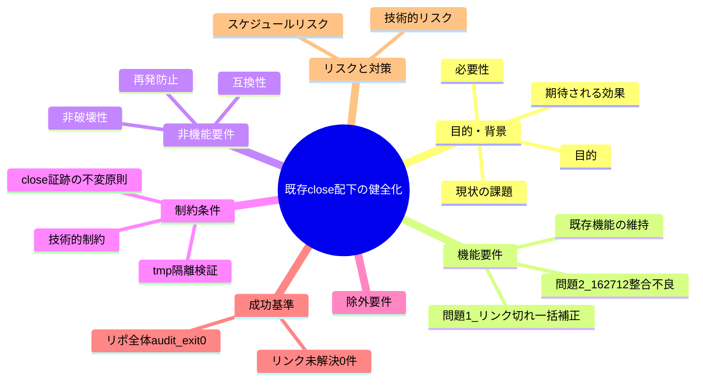
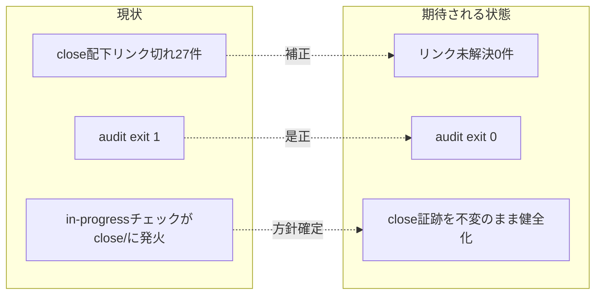

# 要求定義書: 既存 close 配下の健全化（リンク切れ一括補正＋162712 整合不良）

**プロジェクト名**: 既存 close 配下の健全化  
**作成日**: 2026 年 06 月 15 日  
**最終更新**: 2026 年 06 月 15 日

> **重要**:
>
> - 要求定義書は、プロジェクトの全体像を把握するためのものです。詳細な技術仕様や実装方法は要件定義書以降で記載します。必要最低限の情報に収めることを心掛けてください。
> - **このドキュメントは常に更新**: 要求の変更や追加があった場合は、即座にこのドキュメントを更新してください。
> - **必須項目**: 「必須」と明記した項目は空欄・抽象語のみで提出しないこと。
>
> **用語**: [.agents/CONCEPTS.md §用語規約](../../../../.agents/CONCEPTS.md#用語規約) を参照。

---

## 要求定義の全体像

**注意**:

- マインドマップは全体像把握用。詳細はセクション本文に記す。

---

## 1. 目的・背景

### 1.1 目的（必須）

close 配下のリンク切れと 162712 整合不良を解消し、リポ全体 audit を exit 0 に戻す。

### 1.2 背景

- **現状の課題**:
  - **問題1: close 配下に別系統のリンク切れが残存（実測 27 件）**。直近完了 issue「issue 配置先の正本統一」は close 移動時の `](../../../../`（4 階層）→ `](../../../../../`（5 階層）74 件のみを補正し、それ以外のパターンはスコープ外として残った。今回 `realpath -m` で close 配下全体の相対リンクを実測したところ、未解決 **27 件**（後述 §2.2 で内訳）が残っていることを確認した。
  - **問題2: `close/20260614_162712_コア取り込み候補調査/` を含む close 配下の構造により、リポ全体 audit が exit 1**。実測では FAIL/ERROR の主因は (i) `#2b` 90_issues 不在 FAIL が **`docs/maintainer/workflow/close` ディレクトリ自体**に対して発火、(ii) `#7` TODO/FIXME 残存 FAIL が 162712 の 04_review.md・memo に対して発火、(iii) `#17`/`#20` の workflow.db 由来 ERROR が close 配下完了 issue 群に対して発火、である。
- **必要性**:
  - 別系統リンク切れ（problem1）は読者がドキュメント間を辿れず、保守記録の価値を毀損する。
  - audit exit 1 は CI/self-enforce の健全性指標を恒常的に赤にし、「正常 = 緑」の前提を壊す。新規の本物の違反が埋もれる。
  - **CORE/PHASES の「close 後も証跡（04_review・workflow.db ログ）はそのまま残す・書き換え/削除しない」原則（PHASES.md:78）と、audit が close/ 配下へ in-progress 用チェック（TODO 検出・90_issues 要求等）を適用する挙動が衝突している**。この衝突を方針として解消しないと、同種の不整合が close のたびに再発する。

### 1.3 期待される効果（必須: 1 件以上）

- **効果 1**: close 配下の相対リンク未解決が **0 件**になる（`realpath -m` 実測で○/×判定可能）。
- **効果 2**: リポジトリ全体 `bash .agents/enforcement/ci/audit.sh .` が **exit 0（PASS）** を返す（○/×判定可能）。
- **効果 3**: close 移動後の証跡を書き換えずに済む方針が確立し、同種不整合の再発が防止される。

**現状と期待される状態の比較**:

---

## 2. 機能要件

### 2.1 既存機能の維持（該当する場合）

- close 配下の成果物（00〜04・memo）の**本文・証跡内容は維持**する。実リンクの深さ補正以外で本文を改変しない。
- audit の既存チェック（#1〜#29）が in-progress（`.workflow/` および close 以外の `docs/maintainer/workflow/`）に対して持つ判定能力は維持する。close/ へのチェック適用方針のみを論点とする。

### 2.2 新規機能要件（問題ごと）

#### 問題1: close 配下の別系統リンク切れ一括補正（実測 27 件）

`grep -rEon '\]\((\.\./)+[^)]+\)' docs/maintainer/workflow/close/` ＋ `realpath -m` による実測結果（file:line 付き）。**前回補正（4→5 階層 74 件）の対象外として残った別パターン**である。

- **(P1-a) 3 階層 `../../../` → 5 階層が必要（20 件）**: すべて `close/20260614_184756_台帳prev_hash自動連結/` 配下の `.agents/` `.agents-project/` `.agents/spec/` 向けリンク。close 移動でルート方向が 2 階層深くなったが `../../../` のまま残存。
  - `02_設計.md`: 9 件（:15 CONCEPTS, :21 spec/01, :68 spec/ ・spec/00・spec/01・spec/06, :305 RULES・TEST_BDD_FORMAT, :307 .agents-project）
  - `03_実装計画.md`: 7 件（:14 CONCEPTS, :48 TEST_BDD_FORMAT, :64 RULES, :280/:404 .agents-project, :405 TEST_BDD_FORMAT, :419 CONCEPTS）
  - `04_review.md`: 2 件（:13 CONCEPTS, :15 REVIEW_RULE）
  - `00_要求定義.md`: 1 件（:18 CONCEPTS）
  - `01_要件定義.md`: 1 件（:13 CONCEPTS）
- **(P1-b) 1 階層 `../` → 2 階層が必要（5 件）**: close 移動で兄弟 issue/README への相対参照が 1 階層深くなった。
  - `close/20260614_124435_配布とパッケージ構成の再設計/00_要求定義.md:212`・`01_要件定義.md:462` → `../README.md`（`docs/maintainer/workflow/README.md` 実在）
  - `close/20260614_183739_enforcement-runtime実効性是正/00_要求定義.md:218`・`01_要件定義.md:351`・`02_設計.md:361` → `../20260614_173500_multi-tool対応/00_要求定義.md`（対象は `docs/maintainer/workflow/20260614_173500_multi-tool対応/` に実在＝close 外。close からは `../../` が必要）
- **(P1-c) どの深さでも解決しない＝元から壊れている可能性（2 件）**: 補正対象とすべきか設計で判定する。
  - `close/20260614_162712_コア取り込み候補調査/00_要求定義.md:280` → `../00_システム理解.md`（テンプレ由来の雛形リンク。対象ファイルがリポ内に存在しない）
  - `close/20260614_162712_コア取り込み候補調査/memo/20260614_222618_第1波実装grep検証証跡.md:29` → `../RULES.md`（memo から見た相対先にファイルが無い）

#### 問題2: 162712 を含む close 配下の整合不良（audit exit 1 の主因）

実測により、当初想定（「162712 が 90_issues 欠落のサブ issue 親」「04_review に TODO/FIXME が未解消で残存」）は次のとおり**精緻化**された。確定は設計フェーズで行う。

- **(P2-a) 90_issues FAIL は 162712 ではなく `docs/maintainer/workflow/close` 自体に発火**: `#2b` は「直下サブディレクトリに 00〜04 を持つものがあれば親 issue とみなし 90_issues.md を要求」する。close/ は完了 issue を束ねる**コンテナ**であり、各完了 issue が 00〜04 を持つため、close/ が「サブ issue を持つ親」と誤認される。**162712 自身はサブ issue を持たない**（配下は memo のみ）。
- **(P2-b) TODO/FIXME FAIL は本物の未完了作業ではなく『TODO/FIXME という語の言及』**: 162712 の `04_review.md:229`・`memo/20260614_181118_*.md:17`・`memo/20260614_224452_*.md:61` の 3 箇所はいずれも、audit チェック自体（#7）や回帰検証結果を説明する**証跡本文中で語として現れている**。実作業の積み残しではない。
- **(P2-c) audit exit 1 には #17（verify-and-close parent）・#20（document_id 未リンク）の workflow.db 由来 ERROR も寄与**: close 配下完了 issue の document_id が現行 workflow.db に存在しない等。これらも exit 1 に寄与するため、「リポ全体 audit exit 0」を成功基準にする以上、**スコープに含めるか除外するかを設計で確定**する。

### 2.3 解決方針の二択（設計で確定。00/01 では比較と推奨のみ）

CORE/PHASES（PHASES.md:78）は「close 後も証跡（04_review・workflow.db ログ）はそのまま残す。書き換え・削除しない」と規定する。これを踏まえ、問題2 の解決には次の二択がありうる。

- **(a) 不足成果物を正しく補完する**: 90_issues.md を追加し、TODO を正規に解消する。
  - 難点: 90_issues は「サブ issue を束ねる親」用であり、162712 はサブ issue を持たない／FAIL の実体は close/ コンテナ。コンテナに 90_issues を置くのは意味的に不正。TODO の「解消」は証跡本文の改変＝**PHASES.md:78 の不変原則に正面衝突**。
- **(b) audit が close/ 配下に in-progress 用チェックを適用しないようにする**: `#2b`（90_issues 要求）・`#7`（TODO/FIXME 検出）等の in-progress 前提チェックを、`close/` 配下では適用除外（あるいは close/ をコンテナとして 90_issues 要求から除外）する。`#29`（実装前 04）は既に `*/close/*` 除外済みで前例がある。
  - 利点: close 証跡を**一切書き換えずに**整合を回復でき、不変原則と矛盾しない。再発も恒久的に防止できる。

> **推奨（暫定）**: **(b)**。理由は (1) close 証跡の不変原則（PHASES.md:78）と矛盾しない、(2) FAIL の実体が「完了 issue を in-progress として誤判定」という監査側のスコープ問題である、(3) `#29` に close 除外の確立した前例がある、こと。(a) は証跡改変を伴い原則違反のため非推奨。**ただし #17/#20 の DB 由来 ERROR（P2-c）の扱いは別軸**であり、設計で (b) の適用範囲（どのチェック番号を close/ 除外にするか）と合わせて確定する。問題1（リンク補正）は方針 a/b と独立に**実リンクのみ補正**で進める。

---

## 3. 非機能要件

### 3.1 パフォーマンス

- audit 1 回の実行時間を有意に悪化させない（チェック追加ではなくスコープ調整が中心のため影響軽微）。

### 3.2 セキュリティ

- 外部アクセス・秘匿情報の扱いなし。該当なし。

### 3.3 互換性

- audit を採用する**汎用消費者（close/ を持たない `.workflow` のみ）**の挙動を変えないこと。close/ 除外は close/ が実在する場合のみ作用し、後方互換を保つ。

### 3.4 保守性

- 補正・除外の根拠（PHASES.md:78、#29 の前例）をコメント/ドキュメントで辿れること。close 移動手順（自己拡張ワークフロー.md §close 移動時の相対リンク補正）と齟齬を生まないこと。

---

## 4. 制約条件

### 4.1 技術的制約

- **close 証跡の不変原則（最優先制約）**: close 配下の 04_review・workflow.db ログ・memo 本文は書き換え・削除しない（PHASES.md:78）。問題1 の補正は**実 markdown リンクの相対深さのみ**を対象とし、バッククォート内・文章中の `../` 言及は改変しない（自己拡張ワークフロー.md §close 移動時の相対リンク補正と同一原則）。
- **検証は tmp 隔離**: `mktemp -d` ＋ `git archive HEAD | tar -x` でクリーン展開した環境で audit を実行し、本リポの `.agents/` `.workflow/` `workflow.db` 等を破壊しない（自己拡張ワークフロー.md §テストの tmp 隔離）。

### 4.2 既存システムとの互換性

- audit の既存チェック番号・判定ロジックは可能な限り温存し、close/ に対するスコープ調整に限定する（方針 b 採用時）。

### 4.3 移行期間・スケジュール

- 単一 issue として完結。段階移行は不要。

---

## 5. 除外要件

- workflow.db のスキーマ変更・再生成。#20/#17 ERROR への対応で DB を作り替えることはしない（証跡不変原則）。スコープ確定は設計で行うが、原則 DB は触らない。
- audit チェックの新規追加（本 issue はスコープ調整と既存リンク補正が主目的）。
- `.workflow/`（消費者ランタイム生成物）配下の健全化（本 issue は close 配下の自己拡張記録が対象）。

---

## 6. 成功基準（必須: 1 件以上）

- **(SC-1)** `grep -rEon '\]\((\.\./)+[^)]+\)' docs/maintainer/workflow/close/` ＋ `realpath -m` 実測で、**close 配下の相対リンク未解決が 0 件**。
- **(SC-2)** tmp 隔離環境で `bash .agents/enforcement/ci/audit.sh .` が **exit 0** を返す。
- **(SC-3)** close 配下の 04_review・workflow.db ログ・memo の**証跡本文が改変されていない**（リンク深さの実補正と、方針確定に伴う audit/ルール側の変更のみ）。
- **(SC-4)** 汎用消費者（`.workflow` のみ・close 不在）で audit 挙動が従来と同一（後方互換）であることを tmp 隔離で確認。

---

## 7. リスクと対策

### 7.1 技術的リスク

- **リスク**: 問題1 (P1-c) の 2 件が「元から壊れたリンク」で、補正すると本来の参照意図を曲げる恐れ。
  - **対策**: 設計で「実在する妥当な補正先があるもののみ補正」「存在しない雛形リンク（00_システム理解 等）は証跡不変原則に基づき補正対象外＝SC-1 のカウント対象から外す根拠を明示」のいずれかを確定。SC-1 の「未解決 0」の定義を設計で厳密化する。
- **リスク**: 方針 (b) で close/ 除外を広げすぎ、close 配下の本物の問題を見逃す。
  - **対策**: 除外は in-progress 前提チェック（#2b・#7 等）に限定。link 健全性は別途 SC-1 で担保する。

### 7.2 スケジュールリスク

- **リスク**: #20/#17 の DB 由来 ERROR を exit 0 の阻害要因として後追いで発見し手戻り。
  - **対策**: 本 00 で P2-c として明示済み。設計フェーズ冒頭で audit 全 FAIL/ERROR を tmp で再実測し、exit 0 に必要な全要因をスコープ確定の最初に固定する。

---

## 8. 参考資料

### プロジェクトドキュメント

- [.agents-project/自己拡張ワークフロー.md](../../../../.agents-project/自己拡張ワークフロー.md) — close 移動時の相対リンク補正手順・tmp 隔離
- [.agents/workflow/PHASES.md](../../../../.agents/workflow/PHASES.md) — 完了 issue の close 移動・証跡不変原則（:78）
- [.agents/enforcement/ci/audit.sh](../../../../.agents/enforcement/ci/audit.sh) — #2b/#7/#17/#20/#29 の判定ロジック
- [.agents/enforcement/README.md](../../../../.agents/enforcement/README.md) — 失敗条件と差し戻し

### その他の参考資料

- 直近完了 issue「issue 配置先の正本統一」（4→5 階層 74 件補正。本 issue は別系統 27 件が対象）

---

## 9. 次のステップ

この要求定義書の承認後、以下のドキュメントを作成します：

- **次**: [`01_要件定義.md`](./01_要件定義.md) - 要件定義フェーズ
