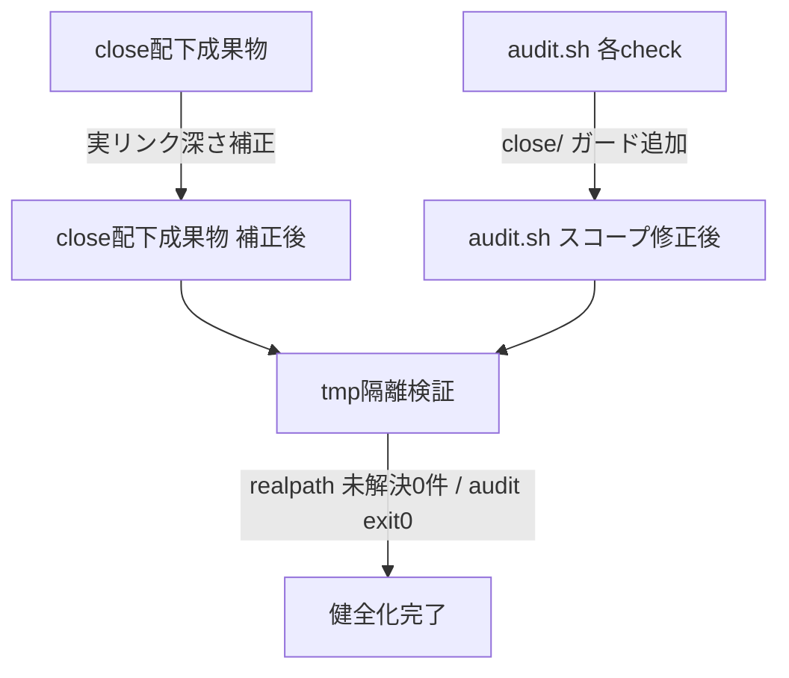
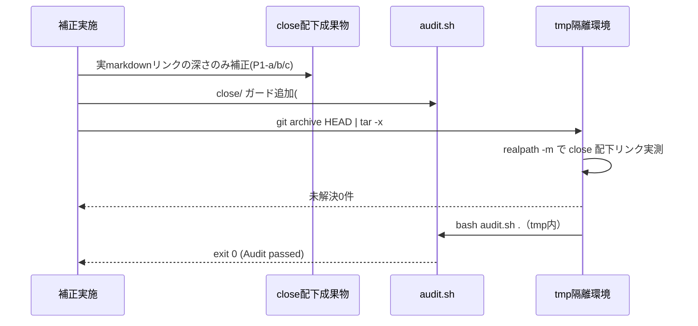
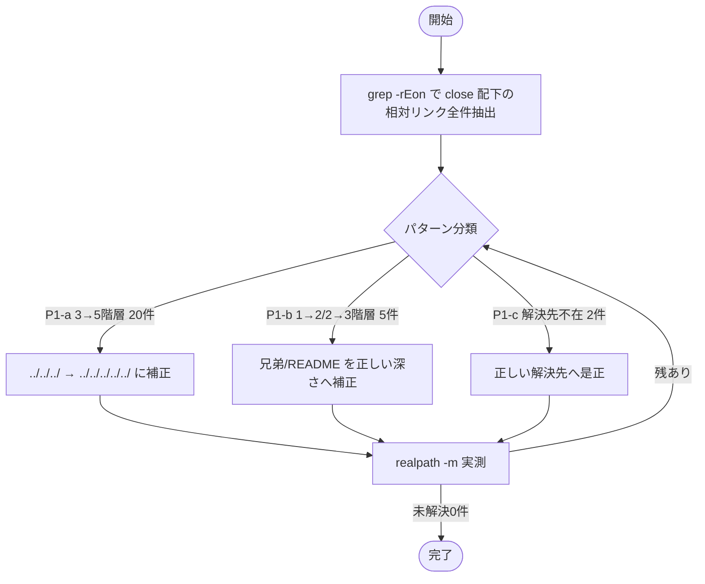
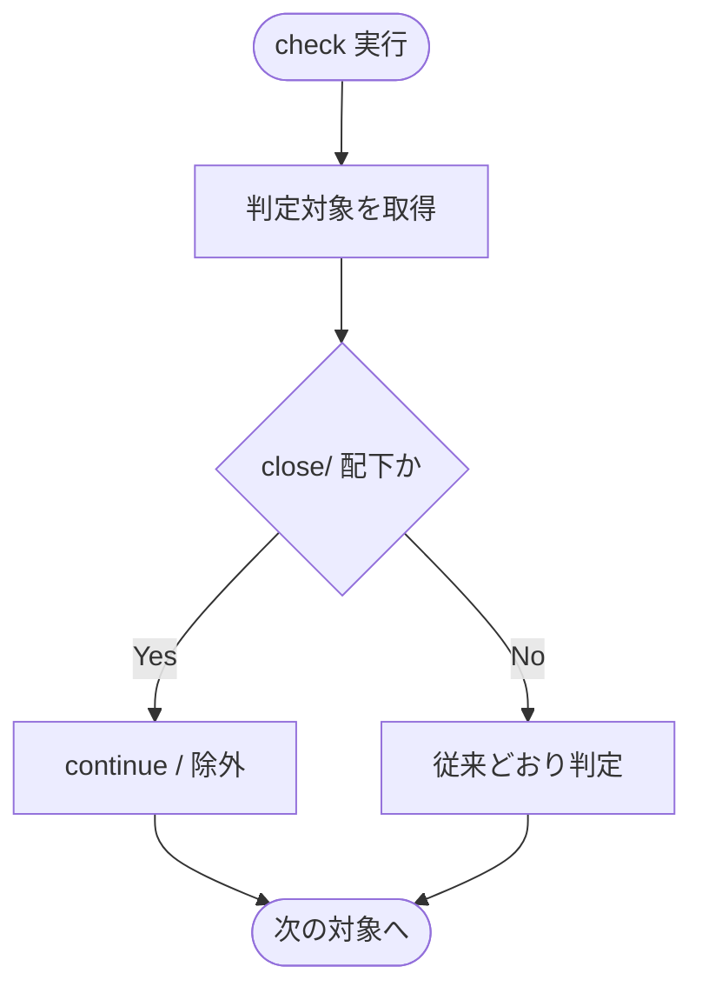

# 設計書: 既存 close 配下の健全化（リンク切れ一括補正＋audit close スコープ修正）

**プロジェクト名**: 既存 close 配下の健全化
**作成日**: 2026 年 06 月 15 日
**最終更新**: 2026 年 06 月 15 日

> **重要**: **このドキュメントは常に更新**: 設計の変更や追加があった場合は、即座にこのドキュメントを更新してください。ドキュメントは「生きているドキュメント」として扱い、実装内容と常に同期させます。
>
> **用語**: [.agents/CONCEPTS.md §用語規約](../../../../.agents/CONCEPTS.md#用語規約) を参照。

---

## 1. 設計概要

**必須**: 設計方針・原則は [.agents/spec/01\_設計原則.md](../../../../.agents/spec/01_設計原則.md) を**先に参照**した上で記載する。設計判断の優先順位は [.agents/spec/06\_設計判断の優先順位.md](../../../../.agents/spec/06_設計判断の優先順位.md) に従う。

### 1.1 設計方針

close 配下の証跡本文を改変せず、(1) 実 markdown リンクの相対深さのみを補正し、(2) audit が in-progress 前提チェックを `close/` 配下へ適用しないようスコープを限定することで、リポ全体 audit を exit 0 に戻す。`#29` の `*/close/*` 除外という確立した前例を全面的に踏襲し、判定ロジックの後方互換（消費者・非 git ツリー・close 不在リポ）を維持する。

### 1.2 設計原則（本プロジェクトで適用するもの）

- **単一責務**: 問題1（リンク補正）と問題2（audit スコープ）を独立した責務として分離する。リンク補正は方針 a/b と独立に「実リンクのみ補正」で進める。
- **明確な境界**: 「証跡本文（不変）」と「実 markdown リンクの深さ（補正可）」「audit の判定スコープ（調整可）」の 3 境界を厳格に分ける。close 配下の本文・workflow.db は触らない。
- **AIフレンドリー設計**: 既存 audit.sh の各 check 関数の責務を保ったまま、`*/close/*` ガードを最小行で追加する（[01\_設計原則 §AIフレンドリー設計](../../../../.agents/spec/01_設計原則.md#aiフレンドリー設計)）。新規ファイル・新規チェックは増やさない。

> 設計判断の優先順位（spec/06）: 可読性 > 単一責務 > 仕様整合性。`#29` と同一の `[[ "$path" == *"/close/"* ]] && continue` パターンを各 check で再利用し、読み手が「close は in-progress チェック対象外」という単一規則を一目で追えることを優先する。

---

## 2. アーキテクチャ設計

### 2.1 責務・境界・参照関係

#### 2.1.1 責務一覧

| コンポーネント | 責務（1 文） |
| -------------- | ------------ |
| 問題1: リンク補正（証跡内の実リンク） | close 配下成果物の実 markdown リンクの相対深さのみを、解決可能な実在先へ補正する。 |
| 問題1-a 補正（3→5 階層・20 件） | `close/20260614_184756_台帳prev_hash自動連結/` 配下の `](../../../` を `](../../../../../` に補正する（ルート方向 `.agents/`・`.agents-project/`）。 |
| 問題1-b 補正（1→2/2→3 階層・5 件） | 兄弟 issue / README への相対参照を close 移動後の正しい深さへ補正する。 |
| 問題1-c 判定（解決先不在・2 件） | 元から破損していた 2 件を、意味を変えずに正しい解決先へ是正する（深さ補正では解けない）。 |
| 問題2: audit スコープ修正（audit.sh） | in-progress 前提チェック（#2b/#3/#7/#9/#17/#20）を `close/` 配下に適用しないようガードを追加する。 |
| 検証ハーネス（tmp 隔離） | `mktemp -d` ＋ `git archive` で本リポ非破壊にリンク全件解決と audit exit 0 を確認する。 |

#### 2.1.2 境界

- **入力**: `docs/maintainer/workflow/close/` 配下の成果物（00〜04・memo）の markdown リンク、`.agents/enforcement/ci/audit.sh`。
- **出力**: 補正後の close 成果物（実リンクのみ変更）、`close/` ガードを追加した audit.sh。
- **他責務との境界（本 issue の範囲外）**:
  - **workflow.db のスキーマ変更・再生成・行追加は範囲外**（除外要件）。#17/#20 ERROR は **audit 側のスコープ調整のみ**で解消し、DB は読み取り専用に留める。
  - close 移動「手順そのもの」（自己拡張ワークフロー.md §close 移動時の相対リンク補正）の改訂は範囲外。本 issue は既に移動済みの残存破損の是正に限定する。ただし手順との齟齬は生まない。
  - `.workflow/`（消費者ランタイム生成物）の健全化は範囲外。
  - 進行中（close 外）issue の #20 ERROR は本 issue の対象外（別 issue の未記録によるもの。close ガードでは解消しない）。SC-2 の判定文脈で扱いを §6 に明記する。

#### 2.1.3 参照関係

- 検証ハーネス → audit.sh（補正後の close ガードを実行）。
- audit.sh（#2b/#3/#7/#9/#20）→ `WORKFLOW_SCAN_DIRS` 配下ファイルパス（`close/` ガードで分岐）。
- audit.sh（#17）→ workflow.db の `verify-and-close` 行の `issue_path`（`close/` 相当を除外）。
- 問題1 補正 → close 配下成果物（証跡本文は読み取りのみ、実リンク文字列のみ書換）。
- 循環参照なし（audit はファイル/DB を読むだけ、補正は成果物を書くだけ、両者は独立）。

### 2.2 システムアーキテクチャ

- **採用パターン**: フィルタ・パイプライン（既存 audit の各 check 関数を段とし、各段の入口で `close/` をフィルタするガード節を挿入）。
- **根拠**: spec/06 の「可読性 > 単一責務 > 仕様整合性」と `#29` の既存前例に従う。新パターンを導入せず、確立済みの `*/close/*` 除外を水平展開するのが最も読みやすく、仕様（証跡不変原則）と整合する。

#### 2.2.1 CQRS（Command/Query 分離）

- **Command（状態変更）**: 問題1 のリンク文字列書換（close 成果物の実リンクのみ）。audit.sh への `close/` ガード追記。
- **Query（状態取得）**: audit による判定・検証ハーネスの `realpath -m` 実測・workflow.db の読み取り。Query 側は副作用を持たない（DB を書かない）。

#### 2.2.2 アーキテクチャ図（本プロジェクトの構成で記載）

### 2.3 コンポーネント構成

audit.sh の修正対象 check と、各 check に追加するガードの境界は次のとおり（単一責務: 各 check は自分の判定対象を `close/` で 1 行フィルタするのみ）。

| check | 現在の発火箇所（file:line） | 対象 | close ガードの挿入位置 |
| ----- | --------------------------- | ---- | ---------------------- |
| #2b 90_issues 要求 | audit.sh:208–230（`parent_issue_dir` ループ）。実測 FAIL: `docs/maintainer/workflow/close` 自体 | `parent_issue_dir` がコンテナ `.../close` または `close/` 配下 | ループ本体先頭で `[[ "$parent_issue_dir" == *"/close"* || "$parent_issue_dir" == *"/close/"* ]] && continue` |
| #7 TODO/FIXME | audit.sh:292–311（`*.md` ループ）。実測 FAIL: 162712 の 04_review・memo | `close/` 配下の `*.md` | ループ本体に `[[ "$f" == *"/close/"* ]] && continue` |
| #3 04 欠落（DB） | audit.sh:232–247。close 完了 issue へ誤発火しうる | `issue_path` が `close/` 配下 | `[[ "$issue_path" == *"/close/"* ]] && continue` |
| #9 04 証跡対応 | audit.sh:341–358（`.workflow` 限定だが将来差異防止） | `close/` 配下 04 | `[[ "$f" == *"/close/"* ]] && continue` |
| #17 verify 親 | audit.sh:469–480（DB クエリ）。実測 ERROR | `issue_path` が close 相当の verify-and-close 行 | SQL の WHERE に `AND v.issue_path NOT LIKE '%/close/%'` を追加 |
| #20 document_id 紐付け | audit.sh:564–600（`WORKFLOW_SCAN_DIRS` ファイルループ）。実測 ERROR 10/15 件が close | `close/` 配下ファイル | ループ本体先頭で `[[ "$f" == *"/close/"* ]] && continue` |

> #29（実装前 04）は audit.sh:747 で既に `[[ "$f" == *"/close/"* ]] && continue` 済み（前例）。本設計はこのパターンを #2b/#3/#7/#9/#20 に水平展開し、#17 は DB クエリ条件で同義の close 除外を行う。

### 2.4 データフロー

イベント駆動は導入しない（単純な同期処理で十分）。データフローは「補正 → 検証」の一方向。

---

## 3. 機能設計

### 3.1 機能 1: close 配下リンク切れの一括補正（問題1）

#### 3.1.1 概要

close 移動でルート方向が深くなった実リンクを正しい深さへ補正し、元から破損していた 2 件は意味を変えず正しい先へ是正する。

#### 3.1.2 処理フロー

#### 3.1.3 入力・出力

- **入力**: `grep -rEon '\]\((\.\./)+[^)]+\)' docs/maintainer/workflow/close/` の実測結果（file:line:link）。
- **出力**: close 配下成果物（実 markdown リンク文字列のみ変更。本文・バッククォート内・文章中の `../` 言及は不変）。

#### 3.1.4 補正方針（27 件の内訳ごと）

- **P1-a（3→5 階層・20 件、全件 `close/20260614_184756_台帳prev_hash自動連結/` 配下）**: close 移動でこの issue ディレクトリは 4 階層下から 5 階層下になったが、ルート向けリンクが `](../../../`（3 階層）のまま残存。`.agents/` `.agents-project/` `.agents/spec/` 等はリポジトリルート直下にあるため、5 階層分 `](../../../../../` が必要。**`](../../../` → `](../../../../../` に置換**する（対象ファイル: 02_設計 9 件・03_実装計画 7 件・04_review 2 件・00 1 件・01 1 件）。`realpath -m` で実在先（`.agents/CONCEPTS.md` 等）に解決することを検証する。
- **P1-b（1→2/2→3 階層・5 件）**:
  - `close/20260614_124435_配布とパッケージ構成の再設計/00_要求定義.md:212`・`01_要件定義.md:462` の `](../README.md)`: 参照先は `docs/maintainer/workflow/README.md`。close 配下からルート方向に 1 階層深くなったため、**`](../README.md)` → `](../../README.md)`** に補正（`close/<issue>/` → `close/` → `workflow/README.md`。`realpath -m` で `docs/maintainer/workflow/README.md` 実在を確認）。
  - `close/20260614_183739_enforcement-runtime実効性是正/` の `00_要求定義.md:218`・`01_要件定義.md:351`・`02_設計.md:361` の `](../20260614_173500_multi-tool対応/00_要求定義.md)`: 参照先 `docs/maintainer/workflow/20260614_173500_multi-tool対応/`（close **外**に実在）。close 配下から close 外の兄弟 issue へ届くには **`](../20260614_173500_multi-tool対応/...)` → `](../../20260614_173500_multi-tool対応/...)`** に補正（`close/<issue>/` → `close/` → `workflow/<対象>`）。実在を `realpath -m` で確認。
- **P1-c（解決先不在・2 件、元から破損。意味を変えず正しい先へ是正）**:
  - `close/20260614_162712_コア取り込み候補調査/00_要求定義.md:280` の `[`00_システム理解.md`](../00_システム理解.md)`: これは `.workflow/templates/00_要求定義.md` 由来の**雛形条件リンク**（「既存プロジェクトの場合は…システム理解を参照」）。`00_システム理解.md` は本リポでは `.workflow/templates/` にのみ存在し、当該 issue の成果物としては作成されていない＝**深さ問題ではなく対象ファイル不在**。証跡本文の意味（「既存プロジェクトなら参照」という条件説明）を保ったまま参照先を是正するため、**markdown リンク `[`00_システム理解.md`](../00_システム理解.md)` を非リンクのインラインコード `` `00_システム理解.md` `` へ変更**（条件付き雛形であり当該 issue に実体が無いため。文意は不変、宙吊りリンクのみ除去）。**代替案**: テンプレート実体 `.workflow/templates/00_システム理解.md` へ向ける案は、消費者ランタイム生成物の templates を自己拡張記録から参照することになり名前空間境界（自己拡張ワークフロー.md §理由）に反するため**採らない**。
  - `close/20260614_162712_コア取り込み候補調査/memo/20260614_222618_第1波実装grep検証証跡.md:29` の `[RULES.md](../RULES.md)`: 本文は「RULES.md の見出し…」と明示しており、意図する先は `.agents/RULES.md`。memo は close 配下で 6 階層下（`docs/maintainer/workflow/close/<issue>/memo/`）にあるため、`.agents/RULES.md` には **`](../../../../../.agents/RULES.md)`**（5 階層上＋`.agents/`）が必要。**`](../RULES.md)` → `](../../../../../.agents/RULES.md)`** に補正し、`realpath -m` で `.agents/RULES.md` 実在を確認する。

> **SC-1 の「未解決 0」定義**: 上記補正後、`grep -rEon '\]\((\.\./)+[^)]+\)' docs/maintainer/workflow/close/` ＋ `realpath -m` で残る未解決が 0 件。P1-c-1 は非リンク化により**この grep の検出対象から外れる**（`](../...)` でなくなる）ため、未解決にカウントされない。

#### 3.1.5 エラーハンドリング

- 補正後に未解決が残った場合は §3.1.2 のループに戻り再分類する。バッククォート内・文章中の `../` 言及を誤って書き換えた場合は差分レビューで検知し戻す（実リンク `](...)` 形のみが対象）。

### 3.2 機能 2: audit の close スコープ修正（問題2）

#### 3.2.1 概要

in-progress 前提チェック（#2b/#3/#7/#9/#17/#20）を `close/` 配下に適用しないガードを追加し、close 完了 issue を進行中として誤判定しないようにする。

#### 3.2.2 処理フロー

#### 3.2.3 入力・出力

- **入力**: `WORKFLOW_SCAN_DIRS` 配下のファイルパス（#2b/#3/#7/#9/#20）、workflow.db の verify-and-close 行（#17）。
- **出力**: `close/` 配下を判定対象から外した audit 結果（exit 0）。

#### 3.2.4 修正仕様（check ごと・§2.3 表に対応）

- **#2b**: `parent_issue_dir` ループ本体先頭で、コンテナ `.../close`（末尾 `/close`）および `close/` 配下を `continue`。実測 FAIL（`docs/maintainer/workflow/close` 自体）を解消。
- **#7**: `*.md` ループ本体で `[[ "$f" == *"/close/"* ]] && continue`。162712 の 04_review・memo の語としての TODO/FIXME を除外。
- **#3**: DB から得た `issue_path` が `close/` 配下なら `continue`。
- **#9**: `.workflow` 限定だが将来の WORKFLOW_DIRS 拡張に備え close 配下 04 をスキップ（防御的）。
- **#17**: SQL の `WHERE v.command='verify-and-close' ...` に `AND v.issue_path NOT LIKE '%/close/%' AND v.issue_path NOT LIKE '%/close'` を追加。完了 issue の verify-and-close 行を親検査対象から外す（記録時 issue_path が close 前パスのものは別途末尾一致で救済しないが、実測上の ERROR 元 issue は close 済みのため、issue 名で close 在籍を判定できるよう §3.2.5 で確定）。
- **#20**: ファイルループ本体先頭で `[[ "$f" == *"/close/"* ]] && continue`。close 配下成果物の document_id 紐付け要求を外す。

#### 3.2.5 #17 の close 判定の確定

実測では #17 の offending 行の `issue_path` は **close 移動前のパス**（例: `docs/maintainer/workflow/20260614_124435_...`、`close/` を含まない）で記録されている。よって「`issue_path` に `close` を含むか」だけでは救えない。**確定方針**: #17 の SQL を「親 (`p`) が `requirement-discovery`/`review-docs` 等であっても、その verify-and-close 行に対応する **issue が現在 close 配下に実在する**なら除外」とする。実装上は、verify-and-close 行の issue 名（`issue_path` の basename）が `docs/maintainer/workflow/close/` 配下のディレクトリ名に一致するものを除外する。具体的には bash 側で close 配下 issue 名集合を `find docs/maintainer/workflow/close -mindepth 1 -maxdepth 1 -type d` から作り、#17 のカウントから除外する（DB は読み取りのみ。詳細手順は 03 のタスク2 に記載）。

#### 3.2.6 エラーハンドリング・後方互換

- ガードは `close/` がパスに含まれる場合のみ作用する。**close 不在の汎用消費者では一切分岐せず従来と完全同一**（後方互換）。
- 非 git ツリー・sqlite3 不在環境では、該当 check が冒頭 SKIP する既存挙動を維持する（ガード追加で SKIP 条件を壊さない）。
- `WORKFLOW_DIRS` 明示指定（置換セマンティクス）時も、`close/` 判定はパス文字列照合のみで成立し、走査基点に依存しない。

---

## 4. データ設計

### 4.1 データモデル

新規データモデルなし。workflow.db のスキーマ・行は変更しない（読み取りのみ）。markdown リンク記法 `](相対パス)` の文字列のみを補正対象とする。

### 4.2 データ構造

- 補正対象の正規表現: `\]\((\.\./)+[^)]+\)`（実 markdown リンク）。
- close 判定: パス文字列に `/close/`（または #2b では末尾 `/close`）を含むか。

---

## 5. API 設計

### 5.1 API 一覧

公開 API の追加・変更なし。audit.sh の入力インターフェース（環境変数）は維持する。

| インターフェース | 種別 | 説明 |
| ---------------- | ---- | ---- |
| `audit.sh [PROJECT_ROOT] [GIT_RANGE]` | CLI 引数 | 維持。挙動は close ガード追加のみ変化。 |
| `WORKFLOW_DIRS` / `WORKFLOW_DIR` / `AGENTS_ROOT` | 環境変数 | 維持（置換/既定セマンティクス不変）。 |
| `AUDIT_GIT_RANGE` | 環境変数 | 維持。 |

### 5.2 API 詳細

#### API1: audit.sh（close スコープ修正後）

- **入力**: PROJECT_ROOT（既定 `.`）、GIT_RANGE。環境変数群。
- **出力**: stdout に判定ログ、終了コード（PASS=0 / FAIL=1）。
- **契約**: close 不在リポでは従来と同一の終了コード・出力。close 在籍 issue は in-progress 前提チェック（#2b/#3/#7/#9/#17/#20）の対象外。
- **エラー**: 非 git/sqlite3 不在は該当 check を SKIP（既存どおり）。

---

## 6. テスト戦略

テスト戦略の**観点の定義**は [RULES.md のテスト戦略必須要件](../../../../.agents/RULES.md#テスト戦略必須要件) を、**BDD 形式の定義**は [TEST_BDD_FORMAT.md](../../../../.agents/TEST_BDD_FORMAT.md) を参照する。本書では対象ごとの割当のみ記載する。

### 6.1 対象ごとのテスト割り当て

| 対象 | 単体 | 結合/API | E2E | クリティカル観点 | バリデーション観点 | 未達理由/補足 |
| ---- | ---- | -------- | --- | ---------------- | ------------------ | ------------- |
| 問題1 リンク補正（P1-a/b/c） | ○ | × | ○ | close 配下の全相対リンクが `realpath -m` で解決（未解決 0 件＝SC-1） | バッククォート内・文章中 `../` を改変していない | 単体＝各補正先の実在確認、E2E＝close 全体 grep 実測 |
| 問題2 audit close ガード（#2b/#3/#7/#9/#17/#20） | ○ | ○ | ○ | tmp 隔離でリポ全体 audit exit 0（SC-2） | close 不在リポで従来と同一終了コード（SC-4 後方互換） | 結合＝audit 全 check 連結実行 |
| 証跡不変 | ○ | × | × | 04_review・memo・workflow.db 本文がリンク補正以外で未改変（SC-3） | git diff で実リンク行のみ変更 | DB 行数・内容の不変を before/after で確認 |

### 6.2 監査・レビューでの確認（証跡）

証跡確認観点は RULES §テスト戦略必須要件および workflow/PHASES.md の監査観点を参照。本書 §6.1 の割当表と 03_実装計画のタスク別テスト観点・BDD が揃っていることを確認する。SC-2 の検証は **tmp 隔離環境**（`mktemp -d` ＋ `git archive HEAD | tar -x`）で行い、本リポの `.agents/` `.workflow/` `workflow.db` を破壊しない。

> **SC-2 の評価文脈（重要）**: 進行中（close 外）issue の #20 ERROR（本 issue 含む在進行 issue の document_id 未記録）は本 issue の close ガードでは解消しない。SC-2「リポ全体 audit exit 0」は、**本 issue の close 補正・audit 修正をコミットした状態（= `git archive HEAD` で展開した tmp）**で評価する。tmp には進行中 issue の未コミット差分が含まれないため、close 由来の FAIL/ERROR が解消されれば exit 0 となる。これにより「在進行 issue の DB 未記録」という別軸の問題に依存せず本 issue を完結できる。03 タスク3 で commit 後 tmp 検証として明記する。

---

## 7. UI 設計

該当なし（CLI スクリプトおよびドキュメント補正のみ。画面なし）。

---

## 8. セキュリティ設計

### 8.1 認証・認可

該当なし。外部アクセス・秘匿情報の扱いなし。

### 8.2 データ保護

workflow.db は読み取りのみ。close 証跡本文は不変。検証は tmp 隔離でローカル完結。

---

## 9. 非機能要件への対応

### 9.1 パフォーマンス

各 check に文字列照合 1 行を足すのみで、audit 実行時間への影響は軽微。

### 9.2 可用性

補正・ガードは冪等（再実行で結果不変）。close 判定はパス文字列照合のため環境非依存。

---

## 10. 参考資料

### プロジェクトドキュメント

- [`01_要件定義.md`](./01_要件定義.md) - 要件定義
- [`00_要求定義.md`](./00_要求定義.md) - 要求定義
- [.agents-project/自己拡張ワークフロー.md](../../../../.agents-project/自己拡張ワークフロー.md) - close 移動時の相対リンク補正・tmp 隔離
- [.agents/workflow/PHASES.md](../../../../.agents/workflow/PHASES.md) - 証跡不変原則（:78 相当）
- [.agents/enforcement/ci/audit.sh](../../../../.agents/enforcement/ci/audit.sh) - #2b/#3/#7/#9/#17/#20/#29 判定
- [.agents/spec/06\_設計判断の優先順位.md](../../../../.agents/spec/06_設計判断の優先順位.md) - 設計判断の優先順位

### その他の参考資料

- #29（実装前 04）の `*/close/*` 除外（audit.sh:747）— 本設計が踏襲する前例
- 直近完了 issue「issue 配置先の正本統一」（4→5 階層 74 件補正。本 issue は別系統 27 件）

---

## 11. 前のステップ

この設計書は、以下のドキュメントを基に作成されています：

- **前**: [`01_要件定義.md`](./01_要件定義.md) - 要件定義フェーズ

---

## 12. 次のステップ

この設計書の承認後、以下のドキュメントを作成します：

- **次**: [`03_実装計画.md`](./03_実装計画.md) - 実装計画フェーズ
