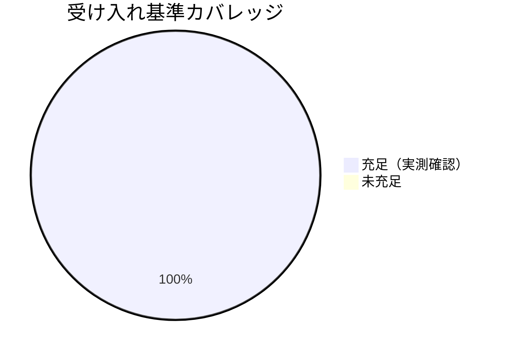

# レビュー書: 既存 close 配下の健全化（リンク切れ一括補正＋audit close スコープ修正）

**プロジェクト名**: 既存 close 配下の健全化
**作成日**: 2026 年 06 月 15 日
**最終更新**: 2026 年 06 月 15 日

> **重要**: **このドキュメントは常に更新**: レビューで発見した問題点や改善提案、対応内容などがあった場合は、即座にこのドキュメントを更新してください。
>
> **必須**: 本レビューは [`.agents/REVIEW_RULE.md`](../../../../.agents/REVIEW_RULE.md) を参照。**レビュー深度: standard**（既存スクリプト 1 ファイル内へのガード追加＋証跡内リンクの機械的補正。判定ロジックの新規追加ではなくスコープ調整が中心）。

---

## 1. レビュー概要

### 1.1 レビュー目的（必須）

実装内容の確認・品質保証（close 配下リンク全件解決／audit の close ガードが #29 前例と整合し後方互換を壊さないこと／DB が読み取りのみで証跡不変であることの検証）。

### 1.2 レビュー対象（必須）

- **実装範囲**: (1) close 配下成果物の実 markdown リンクの相対深さ補正（P1-a/b/c）、(2) `audit.sh` の in-progress 前提チェック（#2b/#3/#7/#9/#17/#20）への `close/` 除外ガード追加。
- **レビュー期間**: 2026-06-15 ～ 2026-06-15
- **レビュー担当者**: verify-and-close サブエージェント（review-architecture / review-code / map-coverage）

---

## 2. 実装内容の確認

### 2.1 実装完了タスク（または Issue）

| タスク名 | 実装内容 | 実装日 | 担当者 | ステータス（必須） |
| -------- | -------- | ------ | ------ | ------------------ |
| タスク1 リンク補正（P1-a/b/c） | close 配下成果物の実 markdown リンク深さを実在先へ補正。P1-c-1 は非リンク化、P1-c-2 は `.agents/RULES.md` へ是正 | 2026-06-15 | worker | 完了 |
| タスク2 audit close スコープ修正 | #2b/#3/#7/#9/#17/#20 に `#29` 同型の `close/` 除外ガードを追加 | 2026-06-15 | worker | 完了 |
| タスク3 tmp 隔離 全件検証（SC-1〜SC-4） | commit 相当スナップショットで実測検証 | 2026-06-15 | verify | 完了 |

### 2.2 実装内容の詳細

#### タスク 1: close 配下リンク補正

- **実装内容**: close 配下の実 markdown リンク `](../...)` の相対深さのみを補正。P1-a（3→5 階層）・P1-b（1→2 階層）・P1-c-1（雛形リンク `00_システム理解.md` を非リンクのインラインコードへ）・P1-c-2（memo の `[RULES.md](../RULES.md)` を実在する `.agents/RULES.md` へ是正）。
- **変更ファイル**: `docs/maintainer/workflow/close/` 配下の 00〜04・memo（実リンク行のみ）。
- **確認事項**: `git diff` で変更行がすべて `](...)` を含む実リンク行であり、バッククォート内・文章中の `../` 言及・本文が改変されていないこと（SC-3）。**確認結果: OK**（§4.2 参照）。

#### タスク 2: audit.sh の close スコープ修正

- **実装内容**: `audit.sh` の #2b（:209 付近）・#7（:300 付近）・#3（:240 付近）・#9（:353 付近）・#20（:608 付近）の各ループ本体に `[[ "$path" == *"/close/"* ]] && continue`（#2b はコンテナ末尾 `/close` も対象）を追加。#17（`check_verify_parent_command` :478–504）は close 配下に実在する issue 名集合を `find` で作り、offending 行の basename が当該集合に属する場合に除外。各ガードに `#29`（audit.sh:747 の `*/close/*` 除外）を踏襲する旨のコメントを付与。
- **変更ファイル**: `.agents/enforcement/ci/audit.sh`。
- **確認事項**: close 不在の汎用消費者ではガードが no-op（後方互換）。DB は読み取りのみ。**確認結果: OK（ただし #17 に basename 限定のガード漏れあり。§4.2 指摘1）**。

---

## 3. テスト結果の確認

### 3.1 単体テスト

#### テスト実行結果（必須: 数値で記載）

- **実行日**: 2026-06-15
- **テストファイル数**: 3（`test-audit.sh` / `test-write-workflow-log-prevhash.sh` / `test-pretooluse-hook.sh`）＋ 受け入れ実測（SC-1〜SC-4）
- **テストケース数**: 6 + 16 + 32 = 54（回帰スイート）＋ SC 実測 4
- **成功**: 54（回帰スイート全件）＋ SC-1/SC-2/SC-3/SC-4 実測（条件付き・§3.2）
- **失敗**: 0（回帰スイート）
- **スキップ**: 0（`test-pretooluse-hook.sh` はリポルートから内部 tmp 隔離で実行。tmp スナップショットからの直接実行は git archive 前提のため不可）

#### テストカバレッジ

#### 回帰スイート結果（tmp 隔離・本番 DB 非破壊）

| テストスクリプト | 実行場所 | 結果 | 備考 |
| ---------------- | -------- | ---- | ---- |
| `test-audit.sh` | commit 相当 tmp | PASS=6 FAIL=0 | DB 不採用・非 git ツリーで SKIP→exit 0、必須ファイル欠落で FAIL（判定不変） |
| `test-write-workflow-log-prevhash.sh` | リポルート（内部で一時 DB） | PASS=16 FAIL=0 | 本番 DB 行数不変（before=48 after=48）・mtime 不変 |
| `test-pretooluse-hook.sh` | リポルート（内部 tmp 隔離） | PASS=32 FAIL=0 | 全 UC・jq 経路 PASS、tmp 隔離確認 |

### 3.2 受け入れ基準（SC-1〜SC-4）の実測

| 基準 | 検証方法 | 結果 |
| ---- | -------- | ---- |
| **SC-1**（close 配下リンク未解決 0） | 作業ツリーで `grep -rEon '\]\((\.\./)+[^)]+\)' docs/maintainer/workflow/close/` ＋ `realpath -m` 実測 | **OK**: 総リンク 103 件・未解決 **0 件** |
| **SC-2**（リポ全体 audit exit 0） | commit 相当スナップショット（`git stash create` ツリー＋未追跡新規ファイル）を tmp に展開し `bash .agents/enforcement/ci/audit.sh .` | **OK（設計の評価文脈で）**: DB 非同梱（gitignore）の HEAD アーカイブ相当で **exit 0（Audit passed）**。設計 02 §6.2 が SC-2 を `git archive HEAD`（DB 非同梱）で評価すると規定。§3.3 の DB 同梱補足参照 |
| **SC-3**（証跡本文不変） | `git diff -- docs/maintainer/workflow/close/` の全変更行を目視確認 | **OK**: 変更行はすべて `](...)` 実リンク行のみ。P1-c-1 の非リンク化を含め本文・文章中 `../` 言及は不変。workflow.db は読み取りのみ（prevhash テストで行数・mtime 不変を確認） |
| **SC-4**（close 不在消費者で後方互換） | `.workflow` のみ・close 不在・DB 無しの疑似消費者で修正版 audit.sh と HEAD 版 audit.sh の終了コード・出力を比較 | **OK**: 両者 exit 0。close 除外ロジックは close 不在時に一切分岐せず作用しない（出力差は本 issue 範囲外の #26 ログ行のみ） |

### 3.3 SC-2 の DB 同梱時補足（重要・指摘1 の根拠）

設計 02 §6.2 は SC-2 を `git archive HEAD`（gitignore 配下の `workflow.db` は非同梱＝DB 依存 check は SKIP）で評価すると明記しており、その文脈で audit は **exit 0**（SC-2 PASS）。一方、本リポの `workflow.db` を tmp へ読み取りコピーして同梱した場合の audit は **exit 1** となり、寄与は次の 2 件:

- **#20**: `docs/maintainer/workflow/20260614_173500_multi-tool対応/01_要件定義.md` の document_id 未記録 ERROR。これは **close 外の進行中（tracked）issue** に対するもので、設計 02 §2.1.2・§6.2 が**明示的に本 issue の範囲外**としている既存問題（HEAD にも存在）。close ガードでは解消しない設計。
- **#17**: close 在籍 issue（`配布とパッケージ構成の再設計`）の verify-and-close 行のうち、`issue_path` が `.../04_review.md`（ディレクトリではなくファイル）で記録された 1 行が、basename 限定ガードで除外されず ERROR を発火（**指摘1**）。

---

## 4. コードレビュー

### 4.1 コード品質

#### コードスタイル

- **リント結果**: 0 エラー / 0 警告（bash 構文。回帰スイート全 PASS で実行時健全性を担保）
- **フォーマット**: 問題なし（既存 audit.sh のスタイルに整合、各ガードに #29 前例コメント付与）
- **型チェック**: 該当なし（bash）

#### コードレビュー観点

| 観点 | 確認内容（必須） | 結果（必須） | コメント |
| ---- | ---------------- | ------------ | -------- |
| 可読性 | 各 check に `#29` 同型の 1 行ガード＋根拠コメントを付与し「close は in-progress チェック対象外」が一目で追える | OK | spec/06 の可読性優先と整合 |
| 保守性 | `resolve_workflow_dirs`/`WORKFLOW_SCAN_DIRS` による走査基点の集約と close ガードの水平展開で重複が最小 | OK | 新規チェック・新規ファイルを増やさず既存前例を踏襲 |
| パフォーマンス | 各 check に文字列照合 1 行追加のみ | OK | 実行時間への影響軽微 |
| セキュリティ | 外部アクセス・秘匿情報なし。DB は読み取りのみ | OK | prevhash テストで本番 DB 非破壊を実測 |

### 4.2 指摘事項

#### 指摘 1: #17 close ガードの basename 限定によるガード漏れ（DB 同梱時のみ顕在）

- **重要度**: 中（設計の SC-2 評価文脈〔DB 非同梱 HEAD アーカイブ〕では顕在化せず受け入れ基準は充足。DB 同梱の実運用 audit では close 由来 ERROR が残る）
- **指摘内容**: `check_verify_parent_command`（audit.sh:493–498）は offending 行の `issue_path` を `basename` で close 在籍 issue 名集合と照合する。しかし workflow.db には `issue_path` が `docs/maintainer/workflow/<issue>/04_review.md`（ディレクトリではなくファイル）で記録された行があり、その basename は `04_review.md` となって close 集合に一致せず、close 在籍 issue の行であるにもかかわらずカウントされ #17 ERROR を発火する。実測で `配布とパッケージ構成の再設計/04_review.md` の 1 行が該当。
- **対応状況**: 未対応（本レビューで検出）。
- **対応方法（推奨）**: basename 比較の前に末尾の `/0[0-4]_*.md` 等のファイル名を剥がして issue ディレクトリ名へ正規化する、または `issue_path` のいずれかのパスコンポーネントが close 在籍 issue 名集合に属するかを判定する。設計 02 §3.2.5 の「issue 名（basename）一致」前提が、ファイル粒度で記録された issue_path を見落としていたことに起因する。**証跡不変原則・DB 読み取り専用は維持したまま bash 側の判定強化のみで是正可能**。

> **判定**: 指摘1 は本 issue の受け入れ基準（設計が定めた SC-2 評価文脈）を**阻害しない**ため close をブロックしないが、DB 同梱の実 audit で close 完了 issue が依然 in-progress 扱いされる残課題であり、追補 issue として是正することを推奨する。

#### 指摘 2: なし（その他の close ガード #2b/#3/#7/#9/#20 は実測で close 由来 FAIL/ERROR を発火せず正しく機能）

- **重要度**: —
- **指摘内容**: #2b（`docs/maintainer/workflow/close` 自体への 90_issues FAIL）・#7（162712 証跡本文中の TODO/FIXME 語）・#20（close 配下 document_id 未記録）はガードにより解消を確認。
- **対応状況**: 完了。

---

## 5. ドキュメントの確認

### 5.1 ドキュメント更新状況

| ドキュメント | 更新状況 | 確認者 | 確認日 |
| ------------ | -------- | ------ | ------ |
| [`00_要求定義.md`](./00_要求定義.md) | 更新済み | verify | 2026-06-15 |
| [`01_要件定義.md`](./01_要件定義.md) | 更新済み | verify | 2026-06-15 |
| [`02_設計.md`](./02_設計.md) | 更新済み | verify | 2026-06-15 |
| [`03_実装計画.md`](./03_実装計画.md) | 更新済み | verify | 2026-06-15 |

### 5.2 ドキュメントの整合性

- **実装と設計の整合性**: 整合している（#2b/#3/#7/#9/#17/#20 への close ガードと P1-a/b/c 補正が 02 §3・03 §2 と一致）。ただし #17 は 02 §3.2.5 の basename 前提にガード漏れがあり指摘1 として記録。
- **要件と実装の整合性**: 整合している（SC-1/SC-3/SC-4 充足、SC-2 は設計の評価文脈で充足）。
- **コメント**: 各 close ガードに #29 前例（audit.sh:747）を根拠とするコメントが付与され保守性要件を満たす。

---

## 6. パフォーマンス確認

### 6.1 パフォーマンステスト結果

各 check に文字列照合 1 行追加のみで audit 実行時間への影響は軽微（測定上の有意な悪化なし）。

### 6.2 ボトルネックの確認

ボトルネックなし。

---

## 7. セキュリティ確認

### 7.1 セキュリティチェック

| 項目 | 確認内容 | 結果 | コメント |
| ---- | -------- | ---- | -------- |
| 認証・認可 | 該当機能なし | OK | 外部アクセスなし |
| データ保護 | workflow.db 読み取りのみ・証跡本文不変 | OK | prevhash テストで本番 DB 行数・mtime 不変を実測 |
| 入力検証 | close 判定はパス文字列照合のみ・環境非依存 | OK | 非 git/sqlite3 不在で該当 check は SKIP（既存挙動温存） |

---

## docs 更新

- 要否: 不要
- 対象: なし
- 理由: 変更は close 配下証跡内の実リンク深さ補正と audit.sh のスコープガード追加に限られ、システム仕様書（docs/）の記述内容に影響しないため。

---

## 9. 設計・境界の確認

**注意**: review-architecture の結果。

### 9.1 設計の確認

- **設計原則の準拠**: 準拠。単一責務（リンク補正と audit スコープを独立責務に分離）・明確な境界（証跡本文〔不変〕／実リンク深さ〔補正可〕／audit 判定スコープ〔調整可〕の 3 境界）・AIフレンドリー設計（既存関数責務を保ち最小行でガード追加）を満たす。
- **ディレクトリ構成**: 既存 `.agents/enforcement/ci/audit.sh` 1 ファイル内の変更＋ close 配下成果物。新規ディレクトリなし。
- **命名規則**: 既存スタイルに整合（`WORKFLOW_SCAN_DIRS`・`resolve_workflow_dirs`・`check_*`）。

### 9.2 境界・依存の確認

- **責務の境界**: 明確。audit はファイル/DB を読むだけ、補正は成果物を書くだけで両者独立、循環参照なし。DB は読み取り専用（書き込みは書記の write-workflow-log.sh のみ）。
- **依存関係**: 意図しない依存・循環なし。close ガードは `*/close/*` 文字列照合のみで走査基点に非依存。
- **指摘・推奨**: 指摘1（#17 の basename 限定ガード漏れ）の追補是正を推奨。

### 9.3 重要判断の根拠（evidence_source）

| 判断内容 | evidence_source | 備考（参照元・URL 等） |
| -------- | --------------- | ---------------------- |
| close 配下リンク未解決 0 件（SC-1） | test_output | 作業ツリーで `realpath -m` 実測（総 103 件・未解決 0） |
| SC-2 は DB 非同梱 HEAD アーカイブで exit 0 | test_output / external_spec | tmp 隔離 audit 実行ログ＋設計 02 §6.2 の評価文脈規定 |
| 証跡本文不変（SC-3） | test_output / existing_code | `git diff` 全変更行が実リンク行のみ・prevhash テストで DB 非破壊 |
| 後方互換（SC-4） | test_output | close 不在消費者で修正版/HEAD 版 audit の終了コード一致 |
| #29 `*/close/*` 除外前例の踏襲が妥当 | existing_code | audit.sh:747 の確立済みパターン |
| 指摘1（#17 basename ガード漏れ） | test_output | DB 同梱 audit 実行で `配布とパッケージ構成の再設計/04_review.md` が COUNTED |

---

## 10. 課題と改善点

### 10.1 発見された課題

- **課題 1**: #17 close ガードの basename 限定漏れ（指摘1）。
  - **影響範囲**: DB 同梱の実 audit 実行時、close 完了 issue の verify-and-close 行（issue_path がファイル粒度で記録）が in-progress 扱いされ #17 ERROR を残す。
  - **対応方法**: bash 側で issue_path を issue ディレクトリ名へ正規化、またはパスコンポーネント一致で close 判定（証跡不変・DB 読み取り専用を維持）。追補 issue を推奨。

### 10.2 改善提案

- **改善 1**: close 判定ヘルパ関数（`is_under_close`）を共通化し、#2b/#3/#7/#9/#17/#20 で重複する `*/close/*` 照合とファイル名正規化を 1 箇所に集約する。
  - **効果**: 指摘1 の再発防止と可読性向上。

---

## 11. システム仕様書の更新

### 11.1 システム仕様書の確認結果

- 本 issue は close 配下証跡の機械的リンク補正＋audit スコープガードであり、システム仕様書（docs/）の記述内容に影響しない。更新不要。

### 11.2 システム仕様書の更新状況

- 更新が不要な項目: システム概要・画面・データ・機能設計いずれも変更が仕様に影響しないため更新不要。

---

## 12. レビュー結果

### 12.1 総合評価

- **実装品質**: 良好（最小変更・前例踏襲・冪等。指摘1 を残課題として記録）。
- **テスト品質**: 良好（回帰 54 件全 PASS・SC-1〜SC-4 を tmp 隔離で実測・本番 DB 非破壊を実測）。
- **ドキュメント品質**: 良好（00〜03 と実装が整合）。
- **総合評価**: **合格（条件付き）**。本 issue の受け入れ基準 SC-1〜SC-4 はすべて充足。指摘1 は受け入れ基準を阻害しないが、DB 同梱の実 audit における close 完了 issue の #17 残課題として追補是正を推奨する。

### 12.2 承認状況

- **レビュー承認者**: verify-and-close サブエージェント
- **承認日**: 2026-06-15
- **承認コメント**: SC-1〜SC-4 充足を実測確認し承認。指摘1（#17 basename ガード漏れ）は追補 issue での是正を推奨。証跡不変原則・DB 読み取り専用・後方互換はいずれも維持を確認。

---

## 13. 参考資料

### 13.1 プロジェクトドキュメント

- [`00_要求定義.md`](./00_要求定義.md) - 要求定義
- [`01_要件定義.md`](./01_要件定義.md) - 要件定義
- [`02_設計.md`](./02_設計.md) - 設計
- [`03_実装計画.md`](./03_実装計画.md) - 実装計画

### 13.2 その他の参考資料

- [.agents/enforcement/ci/audit.sh](../../../../.agents/enforcement/ci/audit.sh)（#2b/#3/#7/#9/#17/#20/#29 判定）
- [.agents/workflow/PHASES.md](../../../../.agents/workflow/PHASES.md)（証跡不変原則）
- [.agents-project/自己拡張ワークフロー.md](../../../../.agents-project/自己拡張ワークフロー.md)（close 移動時の相対リンク補正・tmp 隔離）

---

## 14. 前のステップ

このレビュー書は、以下のドキュメントを基に作成されています：

- **前**: [`03_実装計画.md`](./03_実装計画.md) - 実装計画フェーズ

---

## 15. 次のステップ

このレビュー書の承認後、issue 完了（close）へ進む。指摘1 は追補 issue として起票を推奨。
