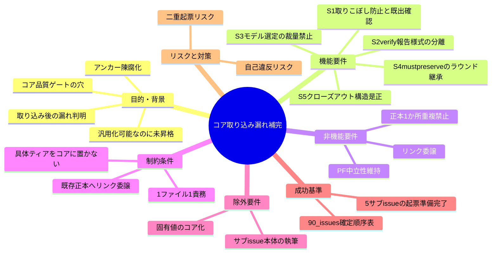
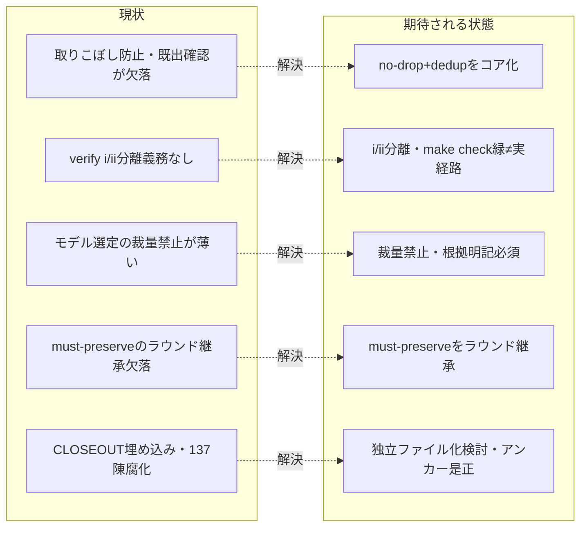

# 要求定義書: コア取り込み漏れ補完

**プロジェクト名**: コア取り込み漏れ補完
**作成日**: 2026 年 06 月 15 日
**最終更新**: 2026 年 06 月 15 日

> **重要**:
>
> - 要求定義書は、プロジェクトの全体像を把握するためのものです。詳細な技術仕様や実装方法は要件定義書以降で記載します。必要最低限の情報に収めることを心掛けてください。
> - **このドキュメントは常に更新**: 要求の変更や追加があった場合は、即座にこのドキュメントを更新してください。ドキュメントは「生きているドキュメント」として扱い、実装内容と常に同期させます。
> - **必須項目**: 以下の「必須」と明記した項目は空欄・抽象語のみ（例: 「{説明}」のまま）で提出しないこと。判定可能な形（目的は1文・成功基準は○/×で判定できる記載等）で記入すること。
>
> **用語**: [.agents/CONCEPTS.md §用語規約](../../../../.agents/CONCEPTS.md#用語規約) を参照。

---

## 要求定義の全体像

**注意**:

- 上記の「プロジェクト名」は例です。実際のプロジェクト名に置き換えてください。
- マインドマップは全体像を把握するためのものです。主要なセクション名程度に留め、詳細は記載しないでください。

---

## 1. 目的・背景

### 1.1 目的（必須）

コアへ昇格しきれていない汎用原則 5 件の補完を束ねる親 issue を確定する。

### 1.2 背景

- **現状の課題**:
  - system-graph プロジェクトの 4 つの固有ポリシー（MODEL_SELECTION / REVIEW_DUAL_LENS / IMPLEMENTATION_CLOSEOUT / ISSUE_CREATION_CONTEXT）を「汎用原則はコア（`.agents/`）／具体値は `.agents-project/`」方針で本リポのコアへ取り込んだが、**汎用化可能なのにコアへ昇格しきれていない原則**が複数判明した。
  - 元ポリシーとコアの対応は確認済み: MODEL_SELECTION_POLICY → `.agents/MODEL_SELECTION.md`、REVIEW_DUAL_LENS_POLICY → `.agents/REVIEW_DUAL_LENS.md`、IMPLEMENTATION_CLOSEOUT_POLICY → `.agents/commands/implement-feature.md §クローズアウト`、ISSUE_CREATION_CONTEXT_POLICY → 同 `§issue 起票時のコンテキスト効率`。
  - しかし、それぞれに「汎用原理として昇格すべき要素」が漏れており、コアの品質ゲート・プロセス契約に穴が残っている（特に「フォローアップの取りこぼし防止」「起票前の既出確認（二重起票防止）」が完全欠落）。
  - 加えて、各所が引用する「CORE.md:137」アンカーが陳腐化している（実際の 137 行は close ディレクトリの話。PF 中立性＝`.agents-project` 最優先は CORE.md:128-131）。

- **必要性**:
  - 漏れている汎用原則を 1 つの正本（本親 issue）に構造化して固定し、後続のサブ issue が迷わず一意に起票できるようにする必要がある。
  - 各漏れの根拠（コア該当箇所の grep 確認結果）を省略せず残し、束ねる確定起票順序（90_issues.md）を明記する必要がある。

#### 1.2.x 漏れ（サブ issue 化対象）の根拠

- **S1 🔴 取りこぼし防止＋既出確認のコア昇格**: 「フォローアップは必ず追跡可能 issue に落とす（取りこぼし 0）／起票前に先祖・兄弟・子孫を走査し既出なら新規起票せず紐付ける（二重起票防止）」がコアに完全欠落。`取りこぼし/既出確認/重複起票/先祖/兄弟/子孫` は `.agents/` で 0 ヒット。最重要。
- **S2 🟠 verify 報告様式の分離と実経路誤導防止**: コアは verify(ii) 実経路検証は持つが、(i) 仕様反映と (ii) を「別項目として分離記載」する義務、「make check 緑を実経路検証の代替にしない」誤導防止が欠落。
- **S3 🟡 モデル選定の裁量禁止と形骸化防止**: `.agents/MODEL_SELECTION.md §2` は「ティア明示」止まり。「裁量での上振れ（迷ったら上位）も下振れも禁止／根拠（対応表の該当行）明記必須＝エスケープハッチ形骸化防止」が薄い。類似の汎用原理が `.agents/COVERAGE_AND_EXCEPTIONS.md` に部分存在するため集約も検討。
- **S4 🟡 二観点 must-preserve のラウンド継承**: コア fresh サブ分割は「却下済み指摘＋理由の継承」のみ。元 REVIEW_DUAL_LENS §3 の「must-preserve リストも各ラウンド継承して退行検知」が欠落。
- **S5 ⚪ 構造是正**: CLOSEOUT/ISSUE_CREATION が `implement-feature.md` 内に埋め込まれ非対称（独立コアファイル化の検討）。加えて各所が引用する「CORE.md:137」アンカーが陳腐化（実際の 137 行は close ディレクトリの話、PF 中立性＝`.agents-project` 最優先は CORE.md:128-131）。

### 1.3 期待される効果（必須: 1 件以上）

- **効果 1**: 5 件の漏れすべてについて、漏れている汎用原則・コアの該当正本・昇格方針が判定可能な形で文書化され、後続のサブ issue が一意に起票できる（○/×: 5 件すべてが 90_issues.md に確定起票順序とともに登録され、各々の漏れ内容が 00 に記載されているか）。
- **効果 2**: 最重要 S1（取りこぼし 0・先祖兄弟子孫 dedup）の欠落が明示され、コア化対象として確定する（○/×: S1 が 🔴 として 90_issues.md の起票順 1 に記載されているか）。
- **効果 3**: 陳腐化した「CORE.md:137」アンカー是正が S5 のスコープとして確定し、PF 中立性の正しい参照先（CORE.md:128-131）が明記される（○/×: S5 にアンカー是正が含まれ、正しい行範囲が 00 に記載されているか）。

**現状と期待される状態の比較**（必要に応じて）:

---

## 2. 機能要件

### 2.1 既存機能の維持（該当する場合）

- 既に取り込み済みのコア正本（`.agents/MODEL_SELECTION.md`、`.agents/REVIEW_DUAL_LENS.md`、`.agents/commands/implement-feature.md §クローズアウト`・`§issue 起票時のコンテキスト効率`）を維持する。
- コアのマルチプラットフォーム（PF）中立性、1 ファイル 1 責務・重複禁止、既存正本へのリンク委譲を維持する。

### 2.2 新規機能要件

本親 issue は**フレームのみ**を確定し、各漏れの補完は 5 件のサブ issue に分割する。本 issue（親）が作成するのは **00_要求定義.md と 90_issues.md（確定起票順序表）のみ**であり、サブ issue の中身（02 設計以降・実装）は作らない。サブ issue の 00/01 起票・書記は後続の別サブが担い、その進捗は 90_issues.md のステータス欄を正本として反映する（本 00 はステータス値の正本ではない）。

- **S1 🔴 取りこぼし防止と既出確認のコア昇格**: no-drop（フォローアップは必ず追跡可能 issue に落とす）＋先祖・兄弟・子孫を走査して dedup（既出なら新規起票せず紐付け）をコア化。最重要。
- **S2 🟠 verify 報告様式の分離と実経路誤導防止**: (i) 仕様反映と (ii) 実経路検証を別項目として分離記載する義務、「make check 緑 ≠ 実経路検証」の誤導防止を明文化。
- **S3 🟡 モデル選定の裁量禁止と形骸化防止**: 裁量での上振れ・下振れ禁止、根拠（対応表の該当行）明記必須を強化。`.agents/COVERAGE_AND_EXCEPTIONS.md` の類似汎用原理との集約も検討。
- **S4 🟡 二観点 must-preserve のラウンド継承**: must-preserve リストを各ラウンドへ継承して退行検知することを明文化。
- **S5 ⚪ クローズアウトと issue 起票の構造是正**: CLOSEOUT/ISSUE_CREATION の独立コアファイル化を検討。陳腐化した「CORE.md:137」アンカーを是正（PF 中立性＝`.agents-project` 最優先は CORE.md:128-131）。

  **依存関係（S5 → S1・S3 の配置判断）**: S5 の「独立コアファイル化するか／`implement-feature.md` 内に残すか」の判断は、S1（no-drop＋既出確認 dedup の昇格先）と S3（モデル選定の裁量禁止の集約先＝`MODEL_SELECTION.md` か `COVERAGE_AND_EXCEPTIONS.md` か独立ファイルか）の**配置先決定に影響する**。したがって S5 の構造方針（独立ファイル化の可否・新設ファイルの責務境界）は S1・S3 が実差分を適用する前に**先に確定**しておく必要がある。起票順は依存度の低い順（S1→S5）だが、**コアへの実適用フェーズでは S5 の構造決定を S1・S3 の配置に先行させる**ことを各サブ issue へ引き継ぐ。

### 2.3 サブ issue の作成範囲（本 issue の境界）

- 本 issue が作成するのは**親 issue の 00_要求定義.md と 90_issues.md のみ**。
- サブ issue 本体（`90_issues/{ディレクトリ名}/` 配下の 00〜03 等）は後続の別サブが作成する。本 issue（親）が直接作成するのは 90_issues.md への確定起票順序表の登録までであり、サブ issue の起票状態（未起票／起票済 等）は 90_issues.md のステータス欄で追跡する。

---

## 3. 非機能要件

### 3.1 パフォーマンス

- 本 issue はフレーム確定のみであり、コンテキスト効率を悪化させない。サブ分割により後続の起票が肥大化しない設計とする。

### 3.2 セキュリティ

- 高リスク操作は伴わない。コア正本への実際の編集は各サブ issue 側で行い、本 issue ではフレーム文書のみを作成する。

### 3.3 互換性

- コアの PF 中立性を壊さない。具体ティア表・モデル名・固有値はコアに置かない方針を各サブ issue に引き継ぐ。

### 3.4 保守性

- 補完内容は「コア汎用の抽象ルール（`.agents/`）」と「`.agents-project/` 固有の具体値」に必ず分離する。
- 既存正本へはリンク委譲し、定義を 2 か所に重複させない（1 ファイル 1 責務）。

---

## 4. 制約条件

### 4.1 技術的制約

- **PF 中立**: 具体ティア表・モデル名・固有値はコアに置かない。
- **1 ファイル 1 責務・重複禁止**: 既存正本へはリンク委譲する。
- 「CORE.md:137」のような行番号アンカーは陳腐化しやすい。S5 ではアンカー是正を含め、正しい参照（PF 中立性＝CORE.md:128-131）を明記する。

### 4.2 既存システムとの互換性

- 既に取り込み済みのコア正本（MODEL_SELECTION.md / REVIEW_DUAL_LENS.md / implement-feature.md §クローズアウト・§issue 起票時のコンテキスト効率）を破壊せず、欠落分の追記・是正にとどめる方針を各サブ issue に引き継ぐ。
- 関連背景として close 済み issue `docs/maintainer/workflow/close/20260614_162712_コア取り込み候補調査/` を参照してよい（あちらは取り込み調査、本件は取り込み後の漏れ補完であり別物）。

### 4.3 移行期間・スケジュール

- 起票順序は 90_issues.md の確定順序表（S1 → S2 → S3 → S4 → S5）に従う。S1（🔴 最重要）を先頭とする。

---

## 5. 除外要件

- **サブ issue 本体の執筆**（`90_issues/{ディレクトリ名}/` 配下の 00〜03 等）。本 issue は親フレーム（00 と 90_issues.md）のみを作成する。
- **コア正本への実際の編集**（S1〜S5 の具体的な差分適用）。各サブ issue で扱う。
- **`.agents-project/` 固有の具体値のコア化**（具体ティア表・モデル名等）。
- **01_要件定義.md の作成**。親はフレームのみとし、要件は各サブ issue 側で扱う。

---

## 6. 成功基準（必須: 1 件以上）

- 5 件の漏れ（S1〜S5）すべてが 90_issues.md に確定起票順序（順・ディレクトリ名・issue_id・優先度・ステータス）とともに登録されている（○/×）。
- 各漏れについて、漏れている汎用原則・コアの該当正本・優先度（🔴/🟠/🟡/⚪）が 00 に記載されている（○/×）。
- 最重要 S1（no-drop＋先祖兄弟子孫 dedup）が起票順 1・優先 🔴 として登録されている（○/×）。
- S5 に「CORE.md:137 アンカー是正」と正しい参照（CORE.md:128-131）が含まれている（○/×）。
- 親 issue は 00_要求定義.md（テンプレート全セクション準拠・マインドマップ含む）と 90_issues.md のみを作成し、01_要件定義.md を作らない（○/×）。

---

## 7. リスクと対策

### 7.1 技術的リスク

- **リスク**: 各サブ issue が S1〜S5 の補完をコアへ適用する際、PF 中立性や正本 1 か所原則に自己違反する。
  - **対策**: 本 00 と 90_issues.md で「具体値はコアに置かない・既存正本へリンク委譲・1 ファイル 1 責務」を制約として明記し、各サブ issue に引き継ぐ。
- **リスク**: 行番号アンカー（CORE.md:137）の是正が不十分で、再び陳腐化する。
  - **対策**: S5 でアンカー是正を独立スコープとし、正しい参照範囲（CORE.md:128-131）を 00 に明記する。

### 7.2 スケジュールリスク

- **リスク**: 起票順が曖昧だとサブ issue が重複・前後し、依存（S5 の構造是正が他に影響）が崩れる。
  - **対策**: 90_issues.md の確定起票順序表（S1 → S5）を正本とし、各サブはこの順序に従って起票する。起票状態は 90_issues.md のステータス欄で一元管理する。なお**コア実適用フェーズの順序は起票順と異なり**、S5 の構造決定（独立ファイル化の可否・責務境界）を S1・S3 の配置に先行させる（§2.2 S5 の依存関係を参照）。

---

## 8. 参考資料

### プロジェクトドキュメント

- 既存プロジェクトの場合は、`00_システム理解.md` - システム理解を参照

### その他の参考資料

- 取り込み済みコア正本: `.agents/MODEL_SELECTION.md`、`.agents/REVIEW_DUAL_LENS.md`、`.agents/commands/implement-feature.md`（§クローズアウト・§issue 起票時のコンテキスト効率）、`.agents/COVERAGE_AND_EXCEPTIONS.md`
- PF 中立性・優先順位の正本: `.agents/boot/CORE.md`（128-131 行）
- 関連背景（別物・取り込み調査側）: `docs/maintainer/workflow/close/20260614_162712_コア取り込み候補調査/`
- 設計原則: `.agents/spec/00_spec概要.md`、`.agents/spec/01_設計原則.md`、`.agents/spec/06_設計判断の優先順位.md`

---

## 9. 次のステップ

この要求定義書の承認後、以下のドキュメントを作成します：

- **次**: [`90_issues.md`](./90_issues.md) - サブ issue 確定起票順序表（5 件）。起票状態は 90_issues.md のステータス欄を正本とする。各サブ issue 本体は後続の別サブが `90_issues/{ディレクトリ名}/` に作成する。
