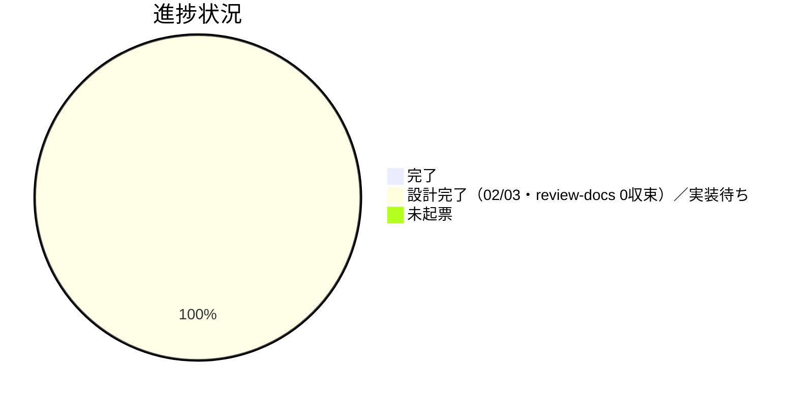

# Issue 一覧: コア取り込み漏れ補完

**プロジェクト名**: コア取り込み漏れ補完
**作成日**: 2026 年 06 月 15 日
**最終更新**: 2026 年 06 月 15 日（90_issues.md 状態更新: 全 5 サブ issue が 02/03 design-feature＋review-docs 0 収束・書記済で設計完了／実装待ちを反映）

> **重要**: **このドキュメントは常に更新**: issue（またはタスク）の進捗状況、ステータス、優先度などの変更があった場合は、即座にこのドキュメントを更新してください。ドキュメントは「生きているドキュメント」として扱い、実装内容と常に同期させます。
>
> **用語**: [.agents/CONCEPTS.md §用語規約](../../../../.agents/CONCEPTS.md#用語規約) を参照。

---

## 確定起票順序表

下表は本親 issue が確定した**サブ issue の起票順序**である。各サブ issue 本体（`90_issues/{ディレクトリ名}/` 配下の 00〜03 等）は後続の別サブが作成する。**5 サブ issue は全て `00_要求定義.md` + `01_要件定義.md` + `02_設計.md` + `03_実装計画.md` を作成し、02/03 の review-docs（二観点）で指摘 0 に収束、書記（workflow.db dod_met=1）記録済み。** 状態は「設計完了（02/03・review-docs 0収束・書記済）／実装待ち」へ更新済み。

> **設計フェーズ完了（全 5 サブ 02/03 review-docs 0 収束）。次フェーズ = implement-feature**: 各サブ issue の **02_設計.md・03_実装計画.md が作成され、review-docs（二観点）が指摘 0 に収束**し、書記（workflow.db dod_met=1）済みである。設計フェーズの issue-persist 境界に**到達した**。
>
> **実装順の注記**: コア新設ファイル `.agents/CLOSEOUT.md`・`.agents/CONTEXT_EFFICIENCY.md` を **S5（クローズアウトとissue起票の構造是正）が新設**し、**S1**（CLOSEOUT.md 取りこぼし 0／既出確認節）・**S2**（CLOSEOUT.md verify 節）・**S4**（REVIEW_DUAL_LENS.md §6＋CLOSEOUT.md fresh サブ分割節）が加法編集、**S3 は独立**（MODEL_SELECTION.md 節追記）。共有 CLOSEOUT.md は**加法・節単位で衝突回避**、CLOSEOUT.md 未存在時は暫定 implement-feature.md→移送の条件分岐あり。**推奨実装順: S5 → S1 → S2 → S4 → S3**（S5 が基盤、S3 は任意順）。

| 順 | サブ issue ディレクトリ名 | issue_id | 概要 | 優先度 | ステータス | リンク |
|----|---------------------------|----------|------|--------|------------|--------|
| 1 | 取りこぼし防止と既出確認のコア昇格 | de775cbb-02e9-4b22-88bd-16b8fb15b8dc | no-drop＋先祖兄弟子孫 dedup をコア化（取りこぼし 0・二重起票防止） | 🔴 高 | 設計完了（02/03・review-docs 0収束・書記済）／実装待ち | [詳細](./90_issues/取りこぼし防止と既出確認のコア昇格/00_要求定義.md) |
| 2 | verify報告様式の分離と実経路誤導防止 | f2b47cb6-4c0a-4833-9a26-30c7bbf98d26 | (i) 仕様反映と (ii) 実経路検証の分離記載義務・make check 緑 ≠ 実経路 | 🟠 中 | 設計完了（02/03・review-docs 0収束・書記済）／実装待ち | [詳細](./90_issues/verify報告様式の分離と実経路誤導防止/00_要求定義.md) |
| 3 | モデル選定の裁量禁止と形骸化防止 | de10a1af-500f-4161-b899-8ee79980902e | 裁量での上振れ・下振れ禁止・根拠（対応表の該当行）明記必須 | 🟡 中 | 設計完了（02/03・review-docs 0収束・書記済）／実装待ち | [詳細](./90_issues/モデル選定の裁量禁止と形骸化防止/00_要求定義.md) |
| 4 | 二観点mustpreserveのラウンド継承 | ec64c606-7007-417a-a59e-3d221c81b8fb | must-preserve のラウンド継承を明文化し退行検知 | 🟡 中 | 設計完了（02/03・review-docs 0収束・書記済）／実装待ち | [詳細](./90_issues/二観点mustpreserveのラウンド継承/00_要求定義.md) |
| 5 | クローズアウトとissue起票の構造是正 | 10b7821c-d49d-427c-b39c-03339eef1c76 | 独立コアファイル化検討・CORE.md:137 アンカー是正（正＝CORE.md:128-131） | ⚪ 低 | 設計完了（02/03・review-docs 0収束・書記済）／実装待ち | [詳細](./90_issues/クローズアウトとissue起票の構造是正/00_要求定義.md) |

**Issue 詳細は各 issue ディレクトリ（`90_issues/{ディレクトリ名}/`）を参照すること。** 本ファイルは一覧・進捗・依存関係の index とする（サブ issue 本体は 00/01/02/03 作成済・review-docs 0 収束・書記済、実装待ち）。

---

## 進捗状況

### 全体進捗

- **完了**: 0 / 5
- **設計完了（02/03・review-docs 0収束・書記済）／実装待ち**: 5
- **未着手（未起票）**: 0

### 優先度別進捗

- **高優先度（🔴）**: 0 / 1
- **中優先度（🟠/🟡）**: 0 / 3
- **低優先度（⚪）**: 0 / 1

---

## 参考資料

### プロジェクトドキュメント

このプロジェクトの全体ドキュメント：

- [`00_要求定義.md`](./00_要求定義.md) - 要求定義（本親 issue。01_要件定義.md は親では作成しない）

### その他の参考資料

- 取り込み済みコア正本: `.agents/MODEL_SELECTION.md`、`.agents/REVIEW_DUAL_LENS.md`、`.agents/commands/implement-feature.md`（§クローズアウト・§issue 起票時のコンテキスト効率）、`.agents/COVERAGE_AND_EXCEPTIONS.md`
- PF 中立性・優先順位の正本: `.agents/boot/CORE.md`（128-131 行）
- 関連背景（別物・取り込み調査側）: `docs/maintainer/workflow/close/20260614_162712_コア取り込み候補調査/`
