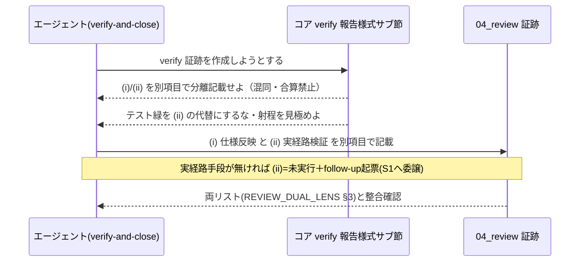

# 設計書: verify 報告様式の分離と実経路誤導防止

**プロジェクト名**: verify 報告様式の分離と実経路誤導防止
**作成日**: 2026 年 06 月 15 日
**最終更新**: 2026 年 06 月 15 日

> **重要**: **このドキュメントは常に更新**: 設計の変更や追加があった場合は、即座にこのドキュメントを更新してください。ドキュメントは「生きているドキュメント」として扱い、実装内容と常に同期させます。
>
> **用語**: [.agents/CONCEPTS.md §用語規約](../../../../../../.agents/CONCEPTS.md#用語規約) を参照。

---

## 参照元

- 本サブ [`00_要求定義.md`](./00_要求定義.md)（issue_id: **f2b47cb6-4c0a-4833-9a26-30c7bbf98d26**）・[`01_要件定義.md`](./01_要件定義.md)
- 親 issue: `docs/maintainer/workflow/20260615_055806_コア取り込み漏れ補完/`（issue_id: **434c7b86-4222-45e7-a0ef-1ae455f15313**）、親 [`90_issues.md`](../../90_issues.md)（本サブは順 2・🟠）
- コア該当正本: [`implement-feature.md §クローズアウト・§verify-実経路検証`](../../../../../../.agents/commands/implement-feature.md)、[`verify-and-close.md §クローズアウト`](../../../../../../.agents/commands/verify-and-close.md)、[`REVIEW_DUAL_LENS.md §3 証跡要求`](../../../../../../.agents/REVIEW_DUAL_LENS.md)
- 兄弟 S5（構造是正）: 独立コア `.agents/CLOSEOUT.md` 新設予定。本 S2 の昇格先は **CLOSEOUT.md の verify 節**を基本とする（後述 §1.3 帰属確定・順序依存）。

---

## 1. 設計概要

**必須**: 設計方針・原則は [.agents/spec/01\_設計原則.md](../../../../../../.agents/spec/01_設計原則.md) を**先に参照**した上で、本プロジェクトに**適用するものを選び**記載する。

### 1.1 設計方針

verify 証跡の報告様式に関する 2 つの欠落原理――**(i)/(ii) の分離記載義務**と**緑≠実経路の誤導防止**――を、コア（`.agents/`）に**加法的・節単位**で昇格する。既存の verify(ii)・`REVIEW_DUAL_LENS.md §3` の定義は**再記述せず**、欠落要素だけを追記し、既存正本へはリンクで委譲する（1 ファイル 1 責務・正本 1 か所）。

### 1.2 設計原則（本プロジェクトで適用するもの）

- **単一責務**: 「verify 報告様式の規範（分離記載・誤導防止）」を 1 節に集約し、実経路検証そのものの定義・no-drop/follow-up の定義とは責務を分ける（後 2 者はリンク委譲）。
- **明確な境界**: コア（PF 中立の抽象原則）と `.agents-project/`（具体運用）の境界を保つ。as-built の向き明示など system-graph 固有色はコアに持ち込まない。
- **AIフレンドリー設計**: 既存節への小さな加筆＋リンクで、消費者ランタイムのエージェントが一意に解釈できる判定可能な記述にする。新規ファイルや深い階層を増やさない。

> 採用しない原則: CQRS / イベント駆動（状態遷移を伴わないドキュメント規範のため非該当）。

### 1.3 昇格先（帰属）の確定 ―― S5 との順序依存

**確定**: 本 S2 が昇格する 2 原理の正本は、独立コア **`.agents/CLOSEOUT.md` の verify 節**（S5 で新設予定。`implement-feature.md §verify-実経路検証` の抽象形が移行する先）とする。

ただし **S5（構造是正）が未実装で `.agents/CLOSEOUT.md` がまだ存在しない**（grep 確認済み・本設計時点）。S1/S2/S4/S5 は CLOSEOUT.md を共有しうるため、本 S2 は次の**条件付き帰属（forward-reference）**で設計する。

- **既定（S5 着地後）**: 正本は `.agents/CLOSEOUT.md` の verify 節。本 S2 は当該節に **§verify 報告様式（分離記載・誤導防止）** サブ節を**加法的に追加**する。
- **暫定（S5 未着地で本 S2 を先行実装する場合）**: 正本は現行の `.agents/commands/implement-feature.md §verify-実経路検証` とし、同節直後に同等のサブ節を加法追加する。S5 着地時に S5 が verify 節を CLOSEOUT.md へ移送する際、本 S2 のサブ節も**一体で移送**する（移送は S5 の責務・本 S2 はリンクの追従のみ）。
- **どちらの場合も**、`REVIEW_DUAL_LENS.md §3 証跡要求`（両リスト）と `verify-and-close.md §クローズアウト` からは**リンクで参照**し、定義は 1 か所に保つ。

> 実装フェーズ（03）の着手時に CLOSEOUT.md の存在を**再確認**し、存在すれば「既定」、無ければ「暫定」を採る（03 §2.1.2 で分岐を明記）。本 S2 は S5 の昇格を前提とせず独立して成立する。

---

## 2. アーキテクチャ設計

### 2.1 責務・境界・参照関係

#### 2.1.1 責務一覧

| コンポーネント | 責務（1 文） |
| -------------- | ------------ |
| **CLOSEOUT.md §verify（または暫定: implement-feature.md §verify-実経路検証）の新サブ節「verify 報告様式（分離記載・誤導防止）」** | verify 証跡で (i) 仕様反映と (ii) 実経路検証を**別項目として分離記載する義務**と、**テスト緑 ≠ 実経路（射程の見極め）**の誤導防止を、PF 中立の抽象原則として規定する正本。 |
| **既存 verify(ii) 実経路検証（リンク参照先）** | 「変更が実経路で動くことを検証する」という (ii) 自体の定義の正本。本サブ節は再定義せず参照する。 |
| **REVIEW_DUAL_LENS.md §3 証跡要求（リンク参照先）** | 敵対的観点リスト・must-preserve リストの両立要求の正本。射程の見極め（実経路 vs モック代用）は敵対的観点と整合する旨を相互リンクする。 |
| **no-drop/follow-up 起票（S1 で昇格予定・リンク参照先）** | (ii)=未実行 時の follow-up 起票の定義の正本（順 1・S1）。本サブ節は重複定義せず参照のみ（S1 未昇格時は forward-reference）。 |
| **verify-and-close.md §クローズアウト（リンク参照先）** | クローズアウトの欠落工程確認の入口。verify-実経路検証の行から本サブ節の様式へリンク追従する。 |

#### 2.1.2 境界

- **入力**: 01 の 3 ストーリー（(i)/(ii) 分離義務・緑≠実経路の誤導防止・重複なしリンク整合）と must-preserve（既存 verify(ii)・REVIEW_DUAL_LENS 両リスト・PF 中立・1 ファイル 1 責務・正本 1 か所）。
- **出力**: コア 1 ファイル（CLOSEOUT.md または暫定 implement-feature.md）への**加法的サブ節 1 つ**＋関連箇所（REVIEW_DUAL_LENS §3／verify-and-close §クローズアウト）からの**リンク追記**。
- **他責務との境界（本 S2 の範囲外）**:
  - **(ii) 実経路検証そのものの定義の改変**は範囲外（既存正本のまま。本サブ節は様式のみ追加）。
  - **as-built 仕様同期の向き明示**は範囲外（system-graph 固有・コア除外。(i) は「仕様反映の有無を分離記載」の汎用形に留める）。
  - **no-drop/follow-up 起票の原理定義**は範囲外（S1 の正本へ委譲）。
  - **CLOSEOUT.md の新設・verify 節の移送**は S5 の責務（本 S2 は加法サブ節と移送追従のみ）。
  - **親 90_issues.md の編集**は範囲外（別サブが一括更新）。

#### 2.1.3 参照関係

依存の向き（呼び出し元 → 呼び出し先）。循環なし。

- `verify-and-close.md §クローズアウト` → `implement-feature.md §クローズアウト（欠落工程の補完）`（**既存リンク**: verify-and-close.md:88「工程の抽象形の正本」）→ その配下の `§verify-実経路検証`（暫定。既定では移送後の `CLOSEOUT.md §verify`）→ **新サブ節「verify 報告様式」**
  - 補足: verify-and-close.md:96 の verify-実経路検証 行は現状 `REVIEW_DUAL_LENS.md §3` のみへリンクしており、新サブ節へは§クローズアウト正本（:88）経由で追従する。**verify-and-close.md から実経路検証サブ節への直接リンクは新設しない**（重複リンク・他サブ節衝突回避）。T3 の「追従できる」検証は、:88 の正本リンク → 正本ファイルの §verify-実経路検証 → 新サブ節 という到達性で判定する。
- 新サブ節「verify 報告様式」 → `REVIEW_DUAL_LENS.md §3 証跡要求`（両リスト整合）
- 新サブ節「verify 報告様式」 → 既存 verify(ii) 定義（(ii) の語の正本）
- 新サブ節「verify 報告様式」 → S1 no-drop/follow-up 起票（(ii)=未実行 時の follow-up。S1 着地まで forward-reference）
- `REVIEW_DUAL_LENS.md §5 参照` → 新サブ節（射程の見極め＝敵対的観点と整合する旨の相互リンク・任意の片方向で可）

```mermaid
flowchart TD
    VAC[verify-and-close.md §クローズアウト] -->|既存リンク :88 正本| CORE[implement-feature.md §クローズアウト 正本]
    CORE --> VII[§verify-実経路検証 / 既定は移送後 CLOSEOUT.md §verify]
    VII --> NEW[新サブ節: verify 報告様式 分離記載・誤導防止]
    NEW -->|両リスト整合| RDL[REVIEW_DUAL_LENS.md §3 証跡要求]
    NEW -->|(ii) の語の正本| VIIDEF[既存 verify(ii) 定義]
    NEW -.->|(ii)=未実行 の follow-up・S1 着地まで forward-ref| S1[S1 no-drop/follow-up 起票]
    RDL -.->|射程=敵対的観点と整合| NEW
```

### 2.2 システムアーキテクチャ

**必須**: 設計判断は [.agents/spec/](../../../../../../.agents/spec/)（[00_spec概要.md](../../../../../../.agents/spec/00_spec概要.md)、[01\_設計原則.md](../../../../../../.agents/spec/01_設計原則.md)、[06\_設計判断の優先順位.md](../../../../../../.agents/spec/06_設計判断の優先順位.md)）を**先に**参照すること。

- **採用パターン**: 既存ドキュメント階層への**加法的拡張（節単位・直交追加）**。新規ファイル・新規骨格は導入しない（`REVIEW_DUAL_LENS.md:7` の「既存骨格を改変しない直交追加」と同方針）。
- **根拠**: spec/06 の優先順位（可読性 > 単一責務 > 仕様整合）に従い、定義の二重化を避け正本 1 か所を守るため、リンク委譲を最優先する。共有ファイル（CLOSEOUT.md）での S1/S4/S5 との衝突を避けるため、**独立した 1 サブ節**として加法追加し、既存行・他サブの節を改変しない。

#### 2.2.1 CQRS

該当なし（状態遷移を持たないドキュメント規範のため）。

#### 2.2.2 アーキテクチャ図（本プロジェクトの構成）

```mermaid
flowchart TD
    CORE[コア .agents/] --> CO[CLOSEOUT.md §verify / 暫定 implement-feature]
    CO --> SUB[+ サブ節: verify 報告様式 分離記載・誤導防止 ＝本S2の成果]
    SUB --> LINKS[既存正本へリンク委譲: verify(ii) / REVIEW_DUAL_LENS §3 / S1 follow-up]
    PROJ[.agents-project/ 固有運用] -.->|具体運用は拡張側| SUB
```

### 2.3 コンポーネント構成

成果は実質 1 コンポーネント（新サブ節）。境界・単一責務に従い、サブ節は「**様式の規範のみ**」を持ち、(ii) の定義・両リスト・follow-up 原理は持たずリンクで委譲する。サブ節の構成要素（執筆内容の骨子）:

1. **(i)/(ii) 分離記載義務**: verify 証跡では「(i) 仕様反映（不要／反映済み）」と「(ii) 実経路検証（実行済み／未実行／該当なし）」を**別項目として分離記載**し、混同・合算しない（一方の達成を他方の達成と読み替えない）。(i) は「仕様反映の有無を分離記載」の汎用形に留め、as-built の向き明示は含めない。
2. **緑 ≠ 実経路の誤導防止**: テスト緑（make check 等の単体・モック代用）を (ii) の代替として報告しない。検証手段の**射程（実経路 vs モック代用）を見極めて** (ii) の達成可否を判定する。実 I/O が主題で実経路検証手段が無い場合は **(ii)=未実行** とし follow-up を起票（定義は S1 へ委譲）。
3. **リンク委譲節**: 上記が依拠する正本（verify(ii) 定義／`REVIEW_DUAL_LENS.md §3`／S1 follow-up）への参照。

### 2.4 データフロー

イベント駆動は非該当。verify 証跡作成時のエージェントの判断フロー（規範の適用）を示す。



---

## 3. 機能設計

### 3.1 機能 1: (i)/(ii) 分離記載義務のコア明文化

#### 3.1.1 概要

verify 証跡で (i) 仕様反映と (ii) 実経路検証を別項目として分離記載する義務を、コアの新サブ節に明文化する。

#### 3.1.2 処理フロー（執筆 → 検証）

```mermaid
flowchart TD
    Start([着手]) --> Chk{CLOSEOUT.md 存在?}
    Chk -->|あり| T1[CLOSEOUT.md §verify に加法サブ節追加]
    Chk -->|なし| T2[implement-feature §verify-実経路検証 直後に加法サブ節追加]
    T1 --> Body[分離記載義務を記述・(i)は汎用形に限定]
    T2 --> Body
    Body --> Link[verify(ii)/REVIEW_DUAL_LENS §3 へリンク委譲]
    Link --> Verify{重複0・両リスト整合 確認}
    Verify -->|OK| End([完了])
    Verify -->|NG| Body
```

#### 3.1.3 入力・出力

- **入力**: 01 ストーリー 1 の受け入れ基準。
- **出力**: 新サブ節内の「(i)/(ii) 分離記載義務」記述（混同・合算禁止・(i) は汎用形）。

#### 3.1.4 エラーハンドリング（自己違反の防止）

- 既存 verify(ii) 定義や REVIEW_DUAL_LENS §3 と**同一定義を重複**させた場合は正本 1 か所違反 → リンク委譲に差し替える。
- (i) に as-built 向き明示を混入させた場合は PF 中立違反 → 汎用形「仕様反映の有無を分離記載」に削る。

### 3.2 機能 2: 緑 ≠ 実経路の誤導防止のコア明文化

#### 3.2.1 概要

テスト緑を (ii) の代替にしないこと・検証手段の射程の見極めを新サブ節に明文化する。

#### 3.2.2 入力・出力

- **入力**: 01 ストーリー 2 の受け入れ基準。
- **出力**: 「緑≠実経路」「射程の見極め（実経路 vs モック代用）」「実 I/O 主題で手段無→(ii)=未実行＋follow-up（S1 委譲）」の記述。

#### 3.2.3 エラーハンドリング

- follow-up 起票の**手順・要件**を本サブ節で定義してしまった場合は S1 重複 → S1 へのリンク参照のみに削る（S1 未着地時は forward-reference の注記を残す）。
- 「make check が緑なら (ii) も済み」と読める表現は誤導 → 明示的に否定する記述に直す。

---

## 4. データ設計

該当なし（DB・データモデルを持たない。verify 証跡の記載形式は (i)・(ii) を別項目で持つことのみを規範化し、具体フォーマット雛形の新設は本 S2 では行わない＝既存 04_review/REVIEW_DUAL_LENS の様式に従う）。

---

## 5. API 設計

該当なし（プロセス契約・ドキュメント変更であり API は伴わない）。コアの「インターフェース」に相当するのは新サブ節の**見出し・記述文**であり、その契約は §2.3 のサブ節構成要素 1–3 に定義済み。

---

## 6. テスト戦略

テスト戦略の**観点の定義**は [RULES.md のテスト戦略必須要件](../../../../../../.agents/RULES.md#テスト戦略必須要件) を、**BDD 形式の定義**は [TEST_BDD_FORMAT.md](../../../../../../.agents/TEST_BDD_FORMAT.md) を参照する。本成果は**ドキュメント（コア規範）**のため、テストは**コア文面に対する静的検証（grep ベースの存在・非重複チェック）**で構成する。

### 6.1 対象ごとのテスト割り当て

| 対象 | 単体 | 結合/API | E2E | クリティカル観点 | バリデーション観点 | 未達理由/補足 |
| ---- | ---- | -------- | --- | ---------------- | ------------------ | ------------- |
| 新サブ節「verify 報告様式」 | ○ | × | × | (i)/(ii)分離記載義務・緑≠実経路 がコアに明文化されている／(i)/(ii)定義が 2 か所に重複していない | (i) に as-built 向き明示が混入していない（PF 中立）・follow-up 定義を重複させていない | 結合/E2E はコード非対象のため該当なし。検証は静的（grep/リンク解決）で行う |
| リンク整合（verify(ii)/REVIEW_DUAL_LENS §3/S1） | ○ | × | × | 新サブ節から各正本へのリンクが実在解決する | 相対リンク階層（コアファイル間）が正しい | 同上 |

### 6.2 監査・レビューでの確認（証跡）

§6.1 の割当と 03 §2.x.3 のタスク別テスト観点・BDD が揃っていることを確認する。**機械検証可能**（REVIEW_DUAL_LENS §3 の両リスト存在チェックと同様、本サブ節の必須フレーズ存在・非重複は grep で構造チェックできる）。

---

## 7. UI 設計

該当なし。

---

## 8. セキュリティ設計

該当なし（高リスク操作を伴わない。コア文面の加筆のみ）。

---

## 9. 非機能要件への対応

### 9.1 パフォーマンス（コンテキスト）

追記は抽象原則の最小集合（サブ節 1 つ＋リンク）に留め、verify 工程の手数・コンテキストを肥大化させない（01 §3.1）。

### 9.2 可用性（後方互換・共有ファイル衝突回避）

- 既存の verify(ii)・REVIEW_DUAL_LENS の正本を破壊しない（must-preserve）。
- **共有ファイル CLOSEOUT.md（S1/S4/S5 も触れうる）への配慮**: 本 S2 は**加法的・節単位**でのみ編集し、既存行・他サブが追加する節を改変しない。追加位置は verify 節内の末尾サブ節とし、他サブの追加箇所（commit/no-drop 等）と重ならないようにする。S5 による verify 節の移送には本サブ節も一体追従する（移送は S5 の責務）。

---

## 10. 参考資料

### プロジェクトドキュメント

- [`00_要求定義.md`](./00_要求定義.md)・[`01_要件定義.md`](./01_要件定義.md)
- 親 [`90_issues.md`](../../90_issues.md)

### その他の参考資料

- コア該当正本: [`implement-feature.md §クローズアウト・§verify-実経路検証`](../../../../../../.agents/commands/implement-feature.md)、[`verify-and-close.md §クローズアウト`](../../../../../../.agents/commands/verify-and-close.md)、[`REVIEW_DUAL_LENS.md §3 証跡要求`](../../../../../../.agents/REVIEW_DUAL_LENS.md)
- 設計原則: [`spec/01_設計原則.md`](../../../../../../.agents/spec/01_設計原則.md)、[`spec/06_設計判断の優先順位.md`](../../../../../../.agents/spec/06_設計判断の優先順位.md)
- プロジェクト固有: [`.agents-project/自己拡張ワークフロー.md`](../../../../../../.agents-project/自己拡張ワークフロー.md)

---

## 11. 前のステップ

- **前**: [`01_要件定義.md`](./01_要件定義.md) - 要件定義フェーズ

---

## 12. 次のステップ

- **次**: [`03_実装計画.md`](./03_実装計画.md) - 実装計画フェーズ
