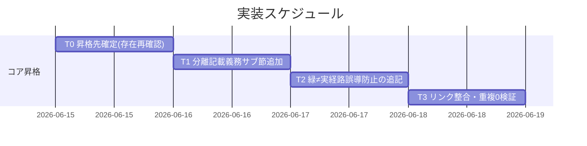

# 実装計画書: verify 報告様式の分離と実経路誤導防止

**プロジェクト名**: verify 報告様式の分離と実経路誤導防止
**作成日**: 2026 年 06 月 15 日
**最終更新**: 2026 年 06 月 15 日

> **重要**: **このドキュメントは常に更新**: 実装計画の変更、進捗状況の更新、バグの記録などがあった場合は、即座にこのドキュメントを更新してください。ドキュメントは「生きているドキュメント」として扱い、実装内容と常に同期させます。
> **必須項目**: 「必須」と明記した欄は空欄・抽象語のみで提出しないこと。テスト観点・BDD 仕様は具体ケースを 1 件以上記載すること。
>
> **用語**: [.agents/CONCEPTS.md §用語規約](../../../../../../.agents/CONCEPTS.md#用語規約) を参照。

---

## 参照元

- 本サブ [`02_設計.md`](./02_設計.md)（document_id: 9540a94c-a34e-4bb3-963e-22278abc373e）・[`01_要件定義.md`](./01_要件定義.md)・[`00_要求定義.md`](./00_要求定義.md)
- 順序依存: S5（CLOSEOUT.md 新設）・S1（no-drop/follow-up 起票）。詳細は 02 §1.3。

---

## 1. 実装概要

### 1.1 実装方針（必須）

コア 1 ファイルに **verify 報告様式の新サブ節を加法的に 1 つ追加**し、(i)/(ii) 分離記載義務と緑≠実経路の誤導防止を明文化する。既存定義（verify(ii)・`REVIEW_DUAL_LENS.md §3`・S1 follow-up）は再記述せずリンク委譲する。02 §1.3 の分岐（CLOSEOUT.md 既定／implement-feature 暫定）に従い、共有ファイル衝突を避けて加法的にのみ編集する。

### 1.2 実装順序（必須: 1 件以上）



優先順位: T0（高）→ T1（高）→ T2（高）→ T3（高）。T1・T2 は同一サブ節への追記のため一体実装し、T3 で静的検証する。

---

## 2. タスク分解

**必須**: 各タスクに「テスト観点」（2.x.3）と「単体テスト仕様（BDD）」（2.x.4）を記載する。テスト観点の定義は **02\_設計 §6** および **RULES のテスト戦略・[TEST_BDD_FORMAT.md](../../../../../../.agents/TEST_BDD_FORMAT.md)** を参照する。

> **`$SECTION` の定義（テストスニペット共通）**: 以下の BDD シェルでの `$SECTION` は、**T0 で確定した昇格先ファイルから新サブ節の本文範囲だけを切り出したテキスト**（例: `awk` 等で当該見出し〜次見出し直前を抽出した一時ファイル）を指す。**昇格先ファイル全体ではない**。これにより、`as-built` 非出現等の「新サブ節に限定した」検査が暫定（implement-feature 全体）/既定（CLOSEOUT 全体）いずれの昇格先でも、新サブ節以外の記述に影響されずに判定できる。一方、T3（2.4.4）の重複ゼロ検査は意図的に `.agents/` 全体を対象（定義が複数ファイルに重複していないことの確認）とする。

### 2.1 タスク 0: 昇格先の確定（CLOSEOUT.md 存在の再確認）

#### 2.1.1 概要（必須）

実装着手時に `.agents/CLOSEOUT.md` の存在を再確認し、02 §1.3 の「既定（CLOSEOUT.md §verify）」か「暫定（implement-feature §verify-実経路検証 直後）」かを一意に確定する。

#### 2.1.2 実装内容（必須: 1 件以上）

- `test -f .agents/CLOSEOUT.md` で存在判定し、昇格先ファイル・追加位置（verify 節末尾サブ節）を確定する。
- 確定結果を memo に記録（`.agents-project/自己拡張ワークフロー.md` の memo 配置規約に従う）。

#### 2.1.3 テスト観点（必須）

**参照**: 観点の定義は [02\_設計 §6](./02_設計.md) および [RULES のテスト戦略・TEST_BDD_FORMAT](../../../../../../.agents/RULES.md#テスト戦略必須要件) を参照。

##### 単体（本タスクの具体ケース・必須 1 件以上）

- CLOSEOUT.md が存在するとき昇格先＝CLOSEOUT.md §verify に確定する。
- CLOSEOUT.md が存在しないとき昇格先＝implement-feature.md §verify-実経路検証 直後に確定する。

##### 結合/API / E2E / バリデーション

- 該当なし。

#### 2.1.4 単体テスト仕様（BDD）（必須）

```gherkin
Feature: 昇格先の確定
  Scenario: CLOSEOUT.md の有無で昇格先を一意化する
    Given 実装着手時点の .agents/ を確認する
    When .agents/CLOSEOUT.md の存在を判定する
    Then 存在すれば CLOSEOUT.md §verify、無ければ implement-feature §verify-実経路検証 直後 に昇格先が確定する
```

```bash
# Given: 実装着手時点のリポジトリ
# When: CLOSEOUT.md の存在を判定する
test -f .agents/CLOSEOUT.md && echo "既定: CLOSEOUT.md §verify" || echo "暫定: implement-feature §verify-実経路検証 直後"
# Then: いずれか一方の昇格先が出力される
```

#### 2.1.5 依存関係

- なし（最初のタスク）。

#### 2.1.6 見積もり

- **工数**: 15 分 / **優先度**: 高

### 2.2 タスク 1: (i)/(ii) 分離記載義務サブ節の追加

#### 2.2.1 概要（必須）

T0 で確定したコアファイルに、新サブ節「verify 報告様式（分離記載・誤導防止）」を**加法的**に追加し、(i)/(ii) を別項目として分離記載する義務を明文化する。

#### 2.2.2 実装内容（必須: 1 件以上）

- 新サブ節見出しを追加し、本文に「verify 証跡では (i) 仕様反映（不要／反映済み）と (ii) 実経路検証（実行済み／未実行／該当なし）を**別項目として分離記載**し、混同・合算しない（一方の達成を他方の達成と読み替えない）」を記述。
- (i) は「仕様反映の有無を分離記載」の**汎用形**に限定し、as-built の向き明示を**含めない**ことを明記。
- (ii) の定義自体は既存 verify(ii) 正本へリンク委譲（再定義しない）。
- 既存行・他サブが追加する節を改変しない（加法のみ）。

#### 2.2.3 テスト観点（必須）

##### 単体（本タスクの具体ケース・必須 1 件以上）

- 昇格先サブ節に「別項目」「分離記載」「混同・合算しない」相当のフレーズが存在する（grep ヒット）。
- (i) の記述に as-built 向き明示が**含まれない**（PF 中立。`as-built` 等の固有語が新サブ節に出現しない）。

##### 結合/API / E2E

- 該当なし。

##### バリデーション

- (ii) の定義文を新サブ節に**再記述していない**（既存 verify(ii) 正本へのリンクのみ）。

#### 2.2.4 単体テスト仕様（BDD）（必須）

```gherkin
Feature: (i)/(ii) 分離記載義務のコア明文化
  Scenario: 別項目で分離記載する義務が記載されている
    Given 昇格先サブ節を作成した
    When コア文面を静的検査する
    Then (i) 仕様反映 と (ii) 実経路検証 を別項目として分離記載し混同・合算しない旨が記載されている
    And (i) は汎用形に留まり as-built 向き明示を含まない
```

```bash
# Given: 昇格先ファイル（T0 で確定。例として SECTION に格納）
# When: 分離記載義務のフレーズと PF 中立を静的検査する
grep -Eq '別項目|分離記載' "$SECTION" && grep -Eq '混同|合算' "$SECTION" \
  && ! grep -q 'as-built' "$SECTION" \
  && echo PASS || echo FAIL
# Then: 分離記載義務が在り、as-built 向き明示が混入していなければ PASS
```

#### 2.2.5 依存関係

- タスク 0（昇格先確定）に依存。

#### 2.2.6 見積もり

- **工数**: 30 分 / **優先度**: 高

### 2.3 タスク 2: 緑 ≠ 実経路の誤導防止の追記

#### 2.3.1 概要（必須）

同一サブ節に、テスト緑を (ii) の代替にしないこと・検証手段の射程の見極め・(ii)=未実行 時の follow-up（S1 委譲）を追記する。

#### 2.3.2 実装内容（必須: 1 件以上）

- 「テスト緑（make check 等の単体・モック代用）を (ii) 実経路検証の代替として報告しない」を記述。
- 「検証手段の**射程（実経路 vs モック代用）を見極めて** (ii) の達成可否を判定する」を記述。
- 「実 I/O が主題で実経路検証手段が無い場合は **(ii)=未実行** とし follow-up を起票する」を記述し、follow-up の**定義は S1（no-drop/follow-up 起票）へリンク委譲**（S1 未着地時は forward-reference 注記）。
- `REVIEW_DUAL_LENS.md §3 証跡要求`（両リスト）へのリンクを置き、射程の見極めが敵対的観点と整合する旨を明記。

#### 2.3.3 テスト観点（必須）

##### 単体（本タスクの具体ケース・必須 1 件以上）

- 「make check」相当の緑を (ii) の代替にしない誤導防止フレーズが存在する。
- 「射程」「実経路 vs モック代用」相当の見極めフレーズが存在する。
- (ii)=未実行 時の follow-up が記述され、その定義が S1 へのリンク委譲になっている（follow-up の手順を本サブ節で再定義していない）。

##### 結合/API / E2E

- 該当なし。

##### バリデーション

- follow-up 起票の手順・要件を本サブ節で重複定義していない（S1 リンクのみ）。

#### 2.3.4 単体テスト仕様（BDD）（必須）

```gherkin
Feature: 緑≠実経路の誤導防止のコア明文化
  Scenario: テスト緑を実経路検証の代替にしない旨が記載されている
    Given 昇格先サブ節に誤導防止を追記した
    When コア文面を静的検査する
    Then make check 等のテスト緑を (ii) の代替にしない旨と射程の見極めが記載されている
    And (ii)=未実行 時の follow-up は S1 へリンク委譲され重複定義されていない
```

```bash
# Given: 昇格先ファイル $SECTION
# When: 誤導防止と射程・follow-up 委譲を静的検査する
grep -Eq 'make check|テスト緑|緑' "$SECTION" && grep -Eq '代替' "$SECTION" \
  && grep -Eq '射程|モック代用|実経路' "$SECTION" \
  && grep -Eq 'follow-up|未実行' "$SECTION" \
  && echo PASS || echo FAIL
# Then: 誤導防止・射程・follow-up(委譲) が揃えば PASS
```

#### 2.3.5 依存関係

- タスク 1（同一サブ節の先行追加）に依存。

#### 2.3.6 見積もり

- **工数**: 30 分 / **優先度**: 高

### 2.4 タスク 3: リンク整合・重複ゼロの検証

#### 2.4.1 概要（必須）

新サブ節からの各リンク（verify(ii)／`REVIEW_DUAL_LENS.md §3`／S1 follow-up／verify-and-close 追従）が実在解決し、(i)/(ii) 定義が 2 か所に重複していないことを検証する。

#### 2.4.2 実装内容（必須: 1 件以上）

- 新サブ節内の相対リンクの実在解決を確認（コアファイル間の階層が正しい）。
- `verify-and-close.md §クローズアウト` から新サブ節への**到達性**を確認（直接リンクは新設しない＝02 §2.1.3 補足）。判定経路は verify-and-close.md:88 の「工程の抽象形の正本」リンク → 正本ファイル（implement-feature.md または移送後 CLOSEOUT.md）の §verify-実経路検証 → 配下の新サブ節、の 3 ホップが解決すること。verify-and-close.md へ verify-実経路検証サブ節への直接リンクを追加して**いない**ことも併せて確認（重複リンク非発生）。
- 「分離記載」「別項目」「make check 緑」「誤導」相当の同一定義が**コア内 2 か所**に重複していないことを grep で確認。
- S1 未着地の場合、follow-up リンクが forward-reference 注記付きで残っていることを確認。

#### 2.4.3 テスト観点（必須）

##### 単体（本タスクの具体ケース・必須 1 件以上）

- 新サブ節の全リンクが未解決 0 件（`realpath -m` で実在確認）。
- (i)/(ii) 分離記載義務・緑≠実経路の定義が 1 か所のみ（重複 0）。

##### 結合/API / E2E

- 該当なし。

##### バリデーション

- 親 90_issues.md を編集していない（git diff に当該ファイルが含まれない）。

#### 2.4.4 単体テスト仕様（BDD）（必須）

```gherkin
Feature: リンク整合と重複ゼロ
  Scenario: 新サブ節のリンクが解決し定義が重複しない
    Given 新サブ節とリンクを追記した
    When リンク解決と定義重複を静的検査する
    Then 全リンクが実在解決し、(i)/(ii)分離・緑≠実経路の定義は 1 か所のみである
```

```bash
# Given: 編集後の .agents/（昇格先 $SECTION を含む）
# When: 重複定義件数を数える（定義本体は 1 か所のみであるべき）
n=$(grep -rEl '別項目として.*分離記載|分離記載.*別項目' .agents/ | wc -l)
# Then: 定義本体は 1 ファイルのみ（重複 0）
[ "$n" -le 1 ] && echo "PASS(no-dup)" || echo "FAIL(dup=$n)"
```

#### 2.4.5 依存関係

- タスク 1・2 に依存。

#### 2.4.6 見積もり

- **工数**: 20 分 / **優先度**: 高

---

## テスト観点

- **分離記載義務がコアに明文化**（T1）: 「(i)/(ii) を別項目として分離記載・混同合算しない」がコア新サブ節に存在し、(i) は汎用形で as-built を含まない。
- **緑≠実経路がコアに明文化**（T2）: 「テスト緑を (ii) の代替にしない・射程の見極め・(ii)=未実行 時 follow-up（S1 委譲）」がコアに存在。
- **重複ゼロ・リンク整合**（T3）: (i)/(ii) 定義・緑≠実経路の定義が 1 か所のみで、新サブ節からの全リンクが実在解決。
- **must-preserve 不破壊**: 既存 verify(ii)・`REVIEW_DUAL_LENS.md §3` の両リストを破壊しない／PF 中立／親 90_issues.md 非編集。

> 上記は 01 の受け入れ基準（ストーリー 1〜3 ＋ビジネスルール）に 1:1 対応する。検証は全て**静的（grep・リンク解決）**で機械可能。

---

## 単体テスト

コードを持たないため、単体テストは**コア文面に対する静的検証**（grep による必須フレーズ存在チェック・非重複チェック・リンク実在解決）で構成する。各タスク §2.x.4 の BDD シェルスニペットがそのまま検証手順となる。

---

## BDD

- T0: 昇格先の確定（CLOSEOUT.md 有無）
- T1: (i)/(ii) 分離記載義務のコア明文化（別項目・混同禁止・(i) 汎用形）
- T2: 緑≠実経路の誤導防止（代替禁止・射程見極め・follow-up は S1 委譲）
- T3: リンク整合と重複ゼロ

Given/When/Then 形式は [TEST_BDD_FORMAT.md](../../../../../../.agents/TEST_BDD_FORMAT.md) に従う。

---

## 3. 実装スケジュール

### 3.1 マイルストーン

| マイルストーン | 期日 | 成果物 |
| -------------- | ---- | ------ |
| 昇格先確定 | T0 完了時 | 昇格先ファイル・追加位置の確定 memo |
| コア明文化 | T2 完了時 | 新サブ節（分離記載義務＋誤導防止）追記済みコア |
| 検証完了 | T3 完了時 | リンク未解決 0・重複 0 の検証ログ |

### 3.2 実装フェーズ

#### フェーズ 1: コア昇格

- **期間**: 1〜2 セッション
- **タスク**: T0 → T1 → T2 → T3

---

## 4. テスト計画

テスト観点・レベル・BDD 形式の定義は **02\_設計 §6** および **RULES のテスト戦略・TEST_BDD_FORMAT** を参照。本実装計画では各タスク §2.x.3 に具体ケース、§2.x.4 に BDD を記載済み。

### 4.1 テストの優先順位

- クリティカル: 分離記載義務・緑≠実経路がコアに存在すること（T1・T2）と重複ゼロ（T3）を最優先で検証する。
- 回帰: 既存 verify(ii)・REVIEW_DUAL_LENS §3 の文面を破壊していないこと（T3 の差分確認に含める）。

---

## 5. リスク管理

### 5.1 実装リスク

- **リスク**: 共有ファイル CLOSEOUT.md（S1/S4/S5 も編集）への追加で他サブの節と衝突する。
  - **対策**: verify 節内の末尾サブ節として**加法のみ**で追加し、既存行・他サブ追加箇所を改変しない（02 §9.2）。
- **リスク**: S5 未着地で暫定実装した後、S5 の verify 節移送で本サブ節が取り残される。
  - **対策**: 移送は S5 の責務とし、本サブ節を verify 節と一体で移送・リンク追従する旨を 02 §1.3 に明記。本 S2 単独でも成立。
- **リスク**: follow-up や (ii) 定義を本サブ節で再記述し正本 1 か所違反になる。
  - **対策**: T3 の重複ゼロ検証（grep）で検出し、リンク委譲へ差し替える。
- **リスク**: (i) に as-built 向き明示を混入し PF 中立を壊す。
  - **対策**: T2.3.3 で `as-built` 非出現を静的検査する。

---

## 6. 参考資料

### プロジェクトドキュメント

- [`02_設計.md`](./02_設計.md) - 設計
- [`01_要件定義.md`](./01_要件定義.md)・[`00_要求定義.md`](./00_要求定義.md)

### その他の参考資料

- コア該当正本: [`implement-feature.md §クローズアウト・§verify-実経路検証`](../../../../../../.agents/commands/implement-feature.md)、[`verify-and-close.md §クローズアウト`](../../../../../../.agents/commands/verify-and-close.md)、[`REVIEW_DUAL_LENS.md §3 証跡要求`](../../../../../../.agents/REVIEW_DUAL_LENS.md)
- プロジェクト固有: [`.agents-project/自己拡張ワークフロー.md`](../../../../../../.agents-project/自己拡張ワークフロー.md)

---

## 7. 前のステップ

- **前**: [`02_設計.md`](./02_設計.md) - 設計フェーズ

---

## 8. 次のステップ

- 本サブ issue は単一タスク群（コア 1 サブ節の昇格）であり、実装フェーズ（execution）へ直接進む。親 90_issues.md は本サブでは編集しない（別サブが一括更新）。

**用語**: [.agents/CONCEPTS.md §用語規約](../../../../../../.agents/CONCEPTS.md#用語規約) を参照。
