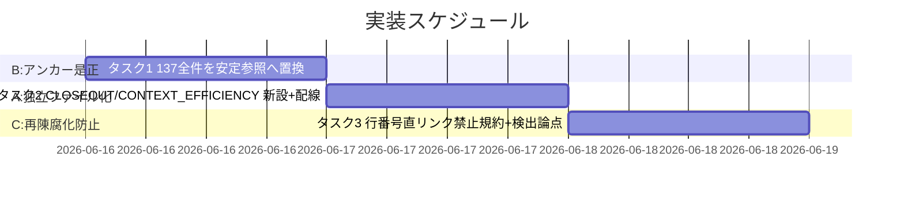
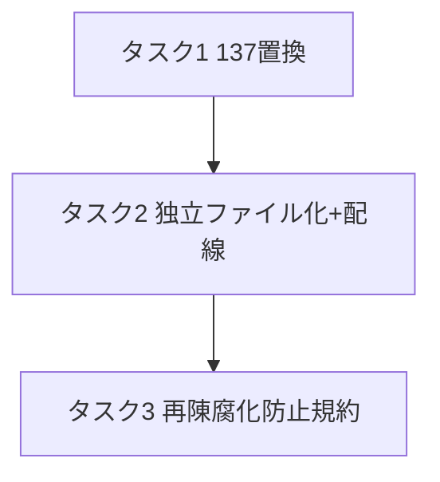

# 実装計画書: クローズアウトと issue 起票の構造是正

**プロジェクト名**: クローズアウトと issue 起票の構造是正（親「コア取り込み漏れ補完」S5）
**作成日**: 2026 年 06 月 15 日
**最終更新**: 2026 年 06 月 15 日

> **重要**: **このドキュメントは常に更新**: 実装計画の変更、進捗状況の更新、バグの記録などがあった場合は、即座にこのドキュメントを更新してください。ドキュメントは「生きているドキュメント」として扱い、実装内容と常に同期させます。
> **必須項目**: 「必須」と明記した欄は空欄・抽象語のみで提出しないこと。テスト観点・BDD 仕様は具体ケースを 1 件以上記載すること。
>
> **用語**: [.agents/CONCEPTS.md §用語規約](../../../../../../.agents/CONCEPTS.md#用語規約) を参照。

---

## 1. 実装概要

### 1.1 実装方針（必須）

[02_設計.md](./02_設計.md) の確定判断に従い、(B) `CORE.md:137` 全件の安定参照置換 → (A) CLOSEOUT/ISSUE_CREATION の独立コアファイル化と配線付け替え → (C) 再陳腐化防止規約の追記、の順で実装する。**各タスクは規約の意味・振る舞い・enforcement 判定条件を変えない（must-preserve）構造是正であり、検証は grep／リンク解決スクリプトと査読で行う。** 実装はすべて実装フェーズ（implement-feature 委譲）で行い、本 03 は計画まで。

> **依存・順序の注記**: 兄弟サブ（S1〜S4）の補完が固まった後に本 S5 を適用するのが安全（02 §2.1.2 範囲外・01 §2.4 依存）。S5 は「内容（規約の意味）」を増やさず、**S1〜S4 が加えた本文をそのまま新ファイルへ運ぶ加法保存的な構造是正**であるため、原則 **兄弟サブ（S1〜S4）→ S5** の順とする。具体的な競合点は以下。
>
> - **S4 ↔ S5**: S4 は `REVIEW_DUAL_LENS.md` を更新するため、本件タスク 1（REVIEW_DUAL_LENS.md:7 の §境界置換）・タスク 2（REVIEW_DUAL_LENS.md:44 の CLOSEOUT.md 付け替え）と競合しうる。**編集順は S4 → S5。**
> - **S2 ↔ S5**: S2（verify 報告様式の分離）は `implement-feature.md §verify-実経路検証`（94-96 行付近）と `verify-and-close.md` を編集する。これは S5 が CLOSEOUT.md へ**移設する領域そのもの**である。**編集順は S2 → S5** とし、S5 の移設は S2 が追記した (i)/(ii) 分離記載義務の本文を**取りこぼさず CLOSEOUT.md へ運ぶ**こと（移設は加法保存）。仮に順序が逆転した場合、S2 は implement-feature.md ではなく CLOSEOUT.md を編集対象に切り替える。
> - **加法保存の前提**: S5 は CLOSEOUT.md の**骨格を新設**し、S1（no-drop/dedup）・S2（verify (i)/(ii) 分離）・S4（must-preserve ラウンド継承）が当該領域に加えた本文は、S5 移設時に**加法的に保存**される（S5 は規約の意味を増減させない）。S5 が先行した場合、これら兄弟サブは新設後の CLOSEOUT.md / CONTEXT_EFFICIENCY.md（または S1 が選ぶ ISSUE_HYGIENE.md）を編集対象とする。

### 1.2 実装順序（必須: 1 件以上）



優先順位: タスク 1（B・最小リスク・先行）→ タスク 2（A・配線波及あり）→ タスク 3（C・規約）。

---

## 2. タスク分解

**必須**: 各タスクに「テスト観点」（2.x.3）と「単体テスト仕様（BDD）」（2.x.4）を記載する。観点定義は [02_設計 §6](./02_設計.md) および [RULES テスト戦略・TEST_BDD_FORMAT](../../../../../../.agents/RULES.md#テスト戦略必須要件) を参照。

### 2.1 タスク 1: （B）CORE.md:137 引用 7 箇所の安定参照置換

#### 2.1.1 概要（必須）

`CORE.md:137` 行番号直リンク 7 箇所（5 ファイル）を、02 §2.2.3 置換表どおり §ルールの優先順位／§境界の節見出しアンカーへ意味不変で置換する。

#### 2.1.2 実装内容（必須: 1 件以上）

- `MODEL_SELECTION.md:7`: `（PF 中立性・CORE.md:137）` → `（PF 中立性・CORE.md §ルールの優先順位）`（意味 (a)）。
- `REVIEW_DUAL_LENS.md:7`: `（CORE.md:137）` → `（CORE.md §境界）`（意味 (b)）。
- `CODE_COMMENT_RULES.md:7`: `（CORE.md:137）` → `（CORE.md §境界）`。
- `CODE_COMMENT_RULES.md:13`: `正本1か所（CORE.md:137）の原則` → `正本1か所（CORE.md §境界）の原則`。
- `CODE_COMMENT_RULES.md:60`: `- CORE.md:137（正本1か所・重複禁止）` → `- CORE.md §境界（正本1か所・重複禁止）`。
- `verify-and-close.md:88`: `（CORE.md:137）` → `（CORE.md §境界）`。
- `implement-feature.md:74`: `（CORE.md:137）` → `（CORE.md §境界）`。

#### 2.1.3 テスト観点（必須）

**参照**: 観点定義は [02_設計 §6](./02_設計.md)。以下は本タスクの具体ケース。

##### 単体（本タスクの具体ケース・必須 1 件以上）

- 正常系: 置換後 `grep -rEn 'CORE\.md:[0-9]+' .agents/` の結果が **0 件**であること。
- 正常系: `grep -rn 'CORE.md §ルールの優先順位' .agents/MODEL_SELECTION.md` が 1 件、`grep -rno 'CORE.md §境界' .agents/ | wc -l` が **6 件**であること（出現総数。`-rc` は per-file 件数を出すため総数判定には `-rno | wc -l` を用いる）。
- 境界: CORE.md 内に `## ルールの優先順位` と `## 境界` の見出しが実在し、アンカーが解決すること。

##### 結合/API（本タスクの具体ケース・該当時は必須 1 件以上）

- 該当なし（外部 API なし）。

##### E2E/受け入れ（本タスクの具体ケース・未達時は理由記載）

- 受け入れ: 01 ストーリー 2 の受け入れ基準（7 箇所全件列挙・各々の正しい安定参照先割当・行番号直リンク廃止・137 が誤紐付かない）を満たす。

##### バリデーション（該当する場合の具体ケース）

- 各引用文の規約上の意味（PF 中立性／正本 1 か所）が置換後も保持されている（査読）。

#### 2.1.4 単体テスト仕様（BDD）（必須）

```gherkin
Feature: CORE.md:137 行番号直リンクの全件是正
  Scenario: 行番号直リンクが0件になる
    Given .agents/ 配下に CORE.md:137 引用が 7 箇所（5 ファイル）存在する
    When 02 §2.2.3 置換表どおり §ルールの優先順位 / §境界 へ置換する
    Then grep -rEn 'CORE\.md:[0-9]+' .agents/ の結果が 0 件になる
    And 各引用の意味（PF 中立性 / 正本1か所）は保持される
```

**テストコード例（検証スクリプト・bash）**

```bash
# Given: 是正後の .agents/ ツリー
# When: 行番号直リンクを検索する
n=$(grep -rEn 'CORE\.md:[0-9]+' .agents/ | wc -l)
# Then: 0 件であること（非0なら FAIL）
[ "$n" -eq 0 ] || { echo "FAIL: 行番号直リンクが $n 件残存"; exit 1; }
# Then: PF 中立性引用は §ルールの優先順位を指す
grep -q 'CORE.md §ルールの優先順位' .agents/MODEL_SELECTION.md || { echo "FAIL: MODEL_SELECTION 置換漏れ"; exit 1; }
echo "PASS"
```

#### 2.1.5 依存関係

- S4（REVIEW_DUAL_LENS.md 更新）完了後に REVIEW_DUAL_LENS.md:7 を置換（編集競合回避）。

#### 2.1.6 見積もり

- **工数**: 0.5 時間 / **優先度**: 高（先行・最小リスク）

### 2.2 タスク 2: （A）CLOSEOUT.md / CONTEXT_EFFICIENCY.md の新設と配線付け替え

#### 2.2.1 概要（必須）

implement-feature.md の §クローズアウト・§issue 起票時のコンテキスト効率の本文を新独立コアファイルへ意味不変で移設し、参照を付け替える。

#### 2.2.2 実装内容（必須: 1 件以上）

- `.agents/CLOSEOUT.md` 新設（frontmatter に document_id 付与）。implement-feature.md §クローズアウトの本文（commit／別セッション引継ぎ／clear 境界／fresh サブ分割／verify-実経路検証）を意味不変で移設。**サブ見出し `### verify-実経路検証` を保持**し、被リンクのサブアンカー `#verify-実経路検証` を CLOSEOUT.md 内で解決可能にする。具体値は `.agents-project/` 委譲を明記（PF 中立性保持）。
- **移設に伴う内部 back-reference の追従**: 現 `implement-feature.md:96` の `REVIEW_DUAL_LENS.md#3-証跡要求` 参照は CLOSEOUT.md へ移動する。CLOSEOUT.md は `.agents/` 直下のため相対リンクを `REVIEW_DUAL_LENS.md#3-証跡要求`（同階層）へ補正し、解決可能を確認する。
- `.agents/CONTEXT_EFFICIENCY.md` 新設（document_id 付与）。implement-feature.md §issue 起票時のコンテキスト効率（ISSUE_CREATION）の本文を意味不変で移設。
- `implement-feature.md`: 当該 2 節を、新ファイルへのリンク委譲（索引のみ）に置換。原則本文は重複させない。
- `verify-and-close.md:88`: 抽象形正本リンクを `implement-feature.md §クローズアウト` から `CLOSEOUT.md` へ付け替え（タスク 1 で §境界アンカー化済みの表現を維持）。
- `MODEL_SELECTION.md:38`: `implement-feature.md#クローズアウト欠落工程の補完` を指す §5 参照を CLOSEOUT.md のセクションアンカー（`CLOSEOUT.md` 等）へ付け替え。
- `REVIEW_DUAL_LENS.md:44`: `implement-feature.md#verify-実経路検証` を指す §5 参照を CLOSEOUT.md の**サブアンカー** `CLOSEOUT.md#verify-実経路検証` へ付け替え（セクションアンカーではない点に注意）。
- `LOAD_POLICY.md` トリガー表: 「クローズアウト実施時 → CLOSEOUT.md」「大規模 issue 起票時 → CONTEXT_EFFICIENCY.md」の 2 行追加。
- `CLAUDE.md` の ISSUE_CREATION 参照リンク（implement-feature.md §issue 起票時のコンテキスト効率を指す箇所）を `CONTEXT_EFFICIENCY.md` へ付け替え。

#### 2.2.3 テスト観点（必須）

##### 単体（本タスクの具体ケース・必須 1 件以上）

- 正常系: `.agents/CLOSEOUT.md`・`.agents/CONTEXT_EFFICIENCY.md` が存在し、document_id を持つ。
- 正常系: implement-feature.md 内に §クローズアウト・§issue 起票時のコンテキスト効率の**本文が残存しない**（リンク委譲のみ）。
- 正常系: 旧リンク `implement-feature.md#クローズアウト` を指す参照が `verify-and-close.md` から消え `CLOSEOUT.md` を指す。
- 正常系: `CLOSEOUT.md` 内に `### verify-実経路検証` 見出しが存在し、`REVIEW_DUAL_LENS.md:44` の付け替え後リンク `CLOSEOUT.md#verify-実経路検証` が解決する（サブアンカー追従の検証）。
- 正常系: 移設後の `CLOSEOUT.md` 内 back-reference `REVIEW_DUAL_LENS.md#3-証跡要求` が同階層相対で解決する。
- 正常系: `grep -rn '#クローズアウト\|#verify-実経路検証\|#issue-起票' .agents/ CLAUDE.md` の結果に `implement-feature.md` を指す参照が残存しない（全付け替え完了）。
- 境界: 未解決リンク検証（自己拡張ワークフロー §close 移動の検証スクリプト相当）が 0 件。

##### 結合/API

- 該当なし。

##### E2E/受け入れ

- 受け入れ: 01 ストーリー 1 の受け入れ基準（独立化／現状維持両案のメリデメ・1 ファイル 1 責務／PF 中立整合・フェーズ帰属論点・前例一貫性）が 02 に整理され、その判断に沿って実装されている。

##### バリデーション

- 移設前後で各節の規約上の意味が不変（査読・diff の意味確認）。

#### 2.2.4 単体テスト仕様（BDD）（必須）

```gherkin
Feature: CLOSEOUT/ISSUE_CREATION の独立コアファイル化
  Scenario: 原則本文が新ファイルへ移り command はリンク委譲になる
    Given CLOSEOUT/ISSUE_CREATION は implement-feature.md 内の節
    When CLOSEOUT.md / CONTEXT_EFFICIENCY.md を新設し本文を移設しリンク委譲に置換する
    Then 2 新ファイルが存在し原則本文を1か所だけ持つ
    And implement-feature.md / verify-and-close.md は新ファイルへリンク委譲する
    And 未解決リンクが 0 件で規約の意味は不変である
```

**テストコード例（検証スクリプト・bash）**

```bash
# Given: 是正後の .agents/ ツリー
# When: 新ファイルとリンク健全性を確認する
test -f .agents/CLOSEOUT.md && test -f .agents/CONTEXT_EFFICIENCY.md || { echo "FAIL: 新ファイル欠落"; exit 1; }
# Then: 旧 command 間正本参照が残っていない（verify-and-close が implement-feature の節を正本参照しない）
grep -q 'CLOSEOUT.md' .agents/commands/verify-and-close.md || { echo "FAIL: 付け替え漏れ"; exit 1; }
# Then: LOAD_POLICY にトリガー行が追加されている
grep -q 'CLOSEOUT.md' .agents/boot/LOAD_POLICY.md && grep -q 'CONTEXT_EFFICIENCY.md' .agents/boot/LOAD_POLICY.md || { echo "FAIL: トリガー配線漏れ"; exit 1; }
echo "PASS"
```

#### 2.2.5 依存関係

- タスク 1 完了後（implement-feature.md:74・verify-and-close.md:88 の §境界アンカー化を踏まえて付け替える）。
- 兄弟サブ **S2（§verify-実経路検証 追記）・S4（§fresh サブ分割 領域追記）完了後**（移設は加法保存。1.1 注記の編集順 S2/S4 → S5）。



#### 2.2.6 見積もり

- **工数**: 1.5 時間 / **優先度**: 中（配線波及あり）

### 2.3 タスク 3: （C）行番号直リンク禁止規約の追記と enforcement 検出の論点化

#### 2.3.1 概要（必須）

将来の再陳腐化を防ぐため、ドキュメント間参照で行番号直リンクを禁止し節見出しアンカーを用いる規約を DOCS_RULES.md に 1 件追記し、enforcement 検出は論点として記録する。

#### 2.3.2 実装内容（必須: 1 件以上）

- `DOCS_RULES.md` に 1 行追記: 「コア／command／spec のドキュメント間参照では `<file>.md:NNN` の行番号直リンクを新規使用しない。原則・規約を指すときは `§<節名>` または `#<見出しアンカー>` の安定参照を用いる。」（CODE_COMMENT_RULES.md はコードコメントが責務のためここには置かない＝02 §2.2.3 の責務割当に従う）。
- enforcement 検出の論点記録: `grep -rEn '\b[A-Za-z_]+\.md:[0-9]+' .agents/` 相当の audit 追加を**別 issue 候補**として 03 に明記（本 S5 では検出実装まで踏み込まない）。

#### 2.3.3 テスト観点（必須）

##### 単体（本タスクの具体ケース・必須 1 件以上）

- 正常系: `grep -n '行番号直リンク' .agents/DOCS_RULES.md` が 1 件以上ヒットする。
- 正常系: 規約追記が既存 DOCS_RULES の責務（ドキュメント規約）と整合し、CODE_COMMENT_RULES.md には重複追記しない。

##### 結合/API

- 該当なし。

##### E2E/受け入れ

- 受け入れ: 01 のリスク対策（再陳腐化防止＝行番号直リンク廃止方針の要件化）が規約として実体化している。

##### バリデーション

- 該当なし。

#### 2.3.4 単体テスト仕様（BDD）（必須）

```gherkin
Feature: 行番号直リンク禁止規約の追記
  Scenario: DOCS_RULES に再陳腐化防止規約が入る
    Given 137 引用是正後、行番号直リンクの再発を防ぎたい
    When DOCS_RULES.md に行番号直リンク禁止＋節アンカー使用の規約を1件追記する
    Then DOCS_RULES.md に当該規約が存在し、enforcement 検出は別 issue 論点として記録される
```

**テストコード例（検証スクリプト・bash）**

```bash
# Given: 是正後の DOCS_RULES.md
# When: 規約の存在を確認する
# Then: 行番号直リンク禁止規約が1件以上ある
grep -q '行番号直リンク' .agents/DOCS_RULES.md || { echo "FAIL: 規約未追記"; exit 1; }
echo "PASS"
```

#### 2.3.5 依存関係

- タスク 1・2 完了後（是正の実体を踏まえて規約化する）。

#### 2.3.6 見積もり

- **工数**: 0.5 時間 / **優先度**: 低

---

## テスト観点

本実装計画全体のテスト観点の要約: (1) `grep -rEn 'CORE\.md:[0-9]+' .agents/` が 0 件（B）、(2) 新ファイル 2 つの存在＋ implement-feature.md の本文非残存＋未解決リンク 0 件（A）、(3) DOCS_RULES.md の禁止規約 1 件（C）、(4) 全タスク共通で規約の意味・振る舞い・enforcement 判定条件が不変（査読・REVIEW_DUAL_LENS 二観点）。各タスクの §2.x.3 に具体ケースを記載済み。

---

## 単体テスト

文書構造是正のため、単体テストは検証スクリプト（grep／test -f／リンク解決チェック）と査読で代替する。各タスク §2.x.4 の BDD 検証スクリプトを実装フェーズで実行し、結果を 04_review に記載する（テスト再実行義務）。

---

## BDD

各タスク §2.x.4 の Gherkin シナリオ（137 置換 0 件・独立ファイル化＋リンク委譲・行番号直リンク禁止規約）を正本とする。Given/When/Then は TEST_BDD_FORMAT に従う。01 のストーリー 1（配置判断材料）・ストーリー 2（137 全件是正）・ストーリー 3（意味不変）と本 03 のタスク 2／タスク 1／全タスク共通バリデーションがそれぞれ対応する。

---

## 3. 実装スケジュール

### 3.1 マイルストーン

| マイルストーン | 期日 | 成果物 |
| -------------- | ---- | ------ |
| B 完了 | 2026-06-16 | 137 引用 0 件 |
| A 完了 | 2026-06-17 | CLOSEOUT.md / CONTEXT_EFFICIENCY.md ＋配線 |
| C 完了 | 2026-06-18 | DOCS_RULES 規約追記＋論点記録 |

### 3.2 実装フェーズ

#### フェーズ 1: アンカー是正（B）

- **期間**: 0.5d / **タスク**: タスク 1

#### フェーズ 2: 独立ファイル化（A）

- **期間**: 1.5d / **タスク**: タスク 2

#### フェーズ 3: 再陳腐化防止（C）

- **期間**: 0.5d / **タスク**: タスク 3

---

## 4. テスト計画

テスト観点・レベル・BDD 定義は 02_設計 §6 および RULES テスト戦略・TEST_BDD_FORMAT を参照。各タスク §2.x.3 にタスクごとの具体ケース、§2.x.4 に BDD 仕様を記載済み。

### 4.1 テストの優先順位

- (B) の grep 0 件は機械検証可で最優先。
- (A) の未解決リンク 0 件・本文非残存は回帰の起点になりやすく必ず検証に含める。

---

## 5. リスク管理

### 5.1 実装リスク

- **リスク**: 独立ファイル化で原則本文の移設時に文言が変質し、規約の意味が変わる（must-preserve 違反）。
  - **対策**: 移設は文言を維持し diff の意味を査読。REVIEW_DUAL_LENS 二観点で must-preserve リストを作成。
- **リスク**: 配線付け替え漏れ（旧 `implement-feature.md#クローズアウト` 参照が残る）。
  - **対策**: タスク 2 の検証スクリプトで旧リンク残存 0 件・未解決リンク 0 件を機械検証。
- **リスク**: S4 と REVIEW_DUAL_LENS.md:7 の編集競合。
  - **対策**: 編集順を S4 → S5 とする（1.1 注記）。
- **リスク**: 再陳腐化防止規約を CODE_COMMENT_RULES.md に置くと責務逸脱。
  - **対策**: DOCS_RULES.md に置く（02 §2.2.3 の責務割当）。

---

## 6. 参考資料

### プロジェクトドキュメント

- [`02_設計.md`](./02_設計.md) - 設計
- [`01_要件定義.md`](./01_要件定義.md) - 要件定義

### その他の参考資料

- 是正対象・正しい参照先・配線対象は 02_設計 §10 を参照。

---

## 7. 前のステップ

- **前**: [`02_設計.md`](./02_設計.md) - 設計フェーズ

---

## 8. 次のステップ

- **本サブ issue は単一の構造是正タスク群**であり、これ以上のサブ分割は行わない。承認後、実装フェーズ（implement-feature 委譲）でタスク 1→2→3 を実施する。

**用語**: [.agents/CONCEPTS.md §用語規約](../../../../../../.agents/CONCEPTS.md#用語規約) を参照。
