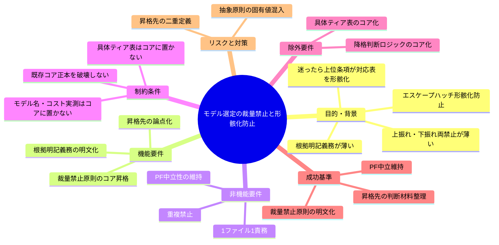
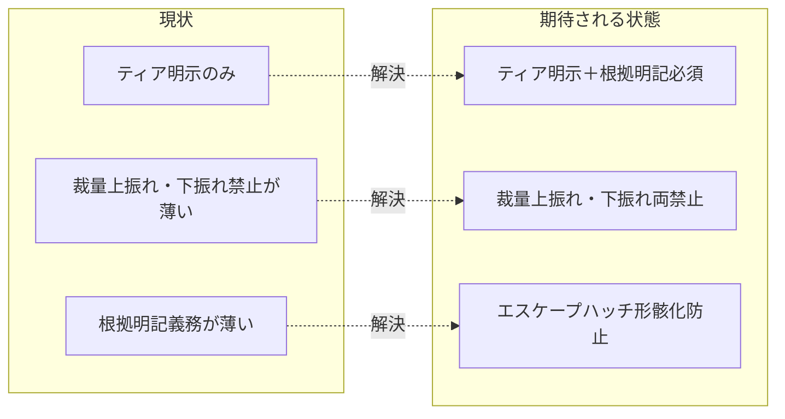

# 要求定義書: モデル選定の裁量禁止と形骸化防止

**プロジェクト名**: モデル選定の裁量禁止と形骸化防止
**作成日**: 2026 年 06 月 15 日
**最終更新**: 2026 年 06 月 15 日

> **重要**:
>
> - 要求定義書は、プロジェクトの全体像を把握するためのものです。詳細な技術仕様や実装方法は要件定義書以降で記載します。必要最低限の情報に収めることを心掛けてください。
> - **このドキュメントは常に更新**: 要求の変更や追加があった場合は、即座にこのドキュメントを更新してください。ドキュメントは「生きているドキュメント」として扱い、実装内容と常に同期させます。
> - **必須項目**: 以下の「必須」と明記した項目は空欄・抽象語のみ（例: 「{説明}」のまま）で提出しないこと。判定可能な形（目的は1文・成功基準は○/×で判定できる記載等）で記入すること。
>
> **用語**: [.agents/CONCEPTS.md §用語規約](../../../../../../.agents/CONCEPTS.md#用語規約) を参照。

---

## 要求定義の全体像

**注意**:

- マインドマップは全体像把握用であり、主要セクション名に留める。

---

## 1. 目的・背景

### 1.1 目的（必須）

モデルティア選定の裁量上振れ・下振れ禁止と根拠明記必須をコアへ昇格する。

### 1.2 背景

- **現状の課題**:
  - 元ポリシー `MODEL_SELECTION_POLICY.md` 4節の実測では、旧運用の「迷ったら上位」裁量条項が**サブの 9 割超を最上位ティアへ流し、ティア対応表を形骸化**させた。エスケープハッチ（例外条項）が常用化して骨抜きになる典型パターンである。
  - その再発防止として、元ポリシーは **裁量での上振れ（迷ったら上位）を廃止**し、**裁量での下振れも禁止**、委譲パケットに **ティア＋根拠（対応表の該当行）を 1 行明記**を必須化し、下振れは **計測データ＋ユーザー承認＋対応表更新を経てのみ**許可した。
  - コアの現状（`.agents/MODEL_SELECTION.md §2`）は「選定ティアを委譲パケットに**明示**する」止まりで、(a)「根拠（対応表の該当行）の明記」、(b)「裁量での上振れ・下振れの両禁止」、(c)「エスケープハッチ形骸化防止」という統治原則が薄い。
  - 類似の汎用原理（例外条項が形骸化する／裁量を絞る／除外には台帳と根拠を要求する）が `.agents/COVERAGE_AND_EXCEPTIONS.md`（例外の二重化・禁止する回避パターン）に**部分的に存在**する。昇格先をどこに置くかが論点として残っている。

- **必要性**:
  - ティア明示だけでは「常に最上位を明示する」運用が成立し、コスト最適化と対応表が再び形骸化するため、裁量を絞り根拠を要求する統治原則の明文化が必要。
  - 同種の「例外の形骸化防止」原理が複数ファイルに分散すると 1 ファイル 1 責務・重複禁止に反するため、昇格先の整理が必要。

### 1.3 期待される効果（必須: 1 件以上）

- **効果 1**: コアに「ティア選定は裁量で上振れ・下振れしない／根拠を明記する」原則が明文化され、エスケープハッチ形骸化防止が○/×で確認できる。
- **効果 2**: 昇格先（`MODEL_SELECTION.md` 内か `COVERAGE_AND_EXCEPTIONS.md` の汎用原則への集約か）の論点と判断材料が要件に整理され、設計フェーズで決定可能になる。
- **効果 3**: 抽象統治原則のみが昇格され、具体ティア表・モデル名がコアに混入しないこと（PF 中立維持）が○/×で確認できる。

**現状と期待される状態の比較**:

---

## 2. 機能要件

### 2.1 既存機能の維持（該当する場合）

- `.agents/MODEL_SELECTION.md` の既存原則（適用条件・ティア明記義務・品質ゲート最上位固定・未収束エスカレーション・対象外環境の明記）を維持する。
- `.agents/COVERAGE_AND_EXCEPTIONS.md` の既存の例外管理（二重化・禁止する回避パターン・認定基準・台帳）を維持する。

### 2.2 新規機能要件

- **裁量禁止原則の昇格**: 「ティア選定は裁量で上振れ（迷ったら上位）も下振れもしない。根拠（対応表の該当行）を委譲パケットに明記する」という抽象統治原則をコアに明文化する。
- **エスケープハッチ形骸化防止の明文化**: 例外（下振れ・上位エスカレーション等）が常用化して対応表を骨抜きにしないよう、裁量を絞り根拠と手続き（計測データ・承認・対応表更新）を要求する原則をコアに置く。
- **昇格先の論点化**: 昇格先を `MODEL_SELECTION.md` に置くか `COVERAGE_AND_EXCEPTIONS.md` の汎用原則として集約するかを論点として要件に整理する（最終決定は設計フェーズ）。

---

## 3. 非機能要件

### 3.1 パフォーマンス

- 文書追記のみであり実行時パフォーマンス影響はない。

### 3.2 セキュリティ

- 該当なし。

### 3.3 互換性

- マルチ PF 中立性を壊さない。ティア選択概念が無い対象外環境では本原則は発火しない（`MODEL_SELECTION.md §1` の対象外環境規定と整合させる）。

### 3.4 保守性

- 1 ファイル 1 責務・重複禁止。同種の汎用原理を二重定義せず、昇格先を一本化し相互参照で結ぶ。

---

## 4. 制約条件

### 4.1 技術的制約

- 具体ティア対応表・モデル名・コスト実測・降格（下振れ）判断ロジックは**コアに置かない**。これらは `.agents-project/` に委譲する（PF 中立性・CORE のルール優先順位）。
- 本 issue が昇格するのは「裁量を絞り根拠を明記させる／例外の形骸化を防ぐ」抽象統治原則のみ。

### 4.2 既存システムとの互換性

- 既存コア正本（`.agents/MODEL_SELECTION.md`・`.agents/COVERAGE_AND_EXCEPTIONS.md`）を破壊せず、欠落分の追記・是正にとどめる。

### 4.3 移行期間・スケジュール

- 親 issue「コア取り込み漏れ補完」の S3 として実施。先行サブ（取りこぼし防止）と独立に進められる。

---

## 5. 除外要件

- 具体ティア対応表・モデル名・コスト実測値のコア化。
- 下振れ（降格）の具体的な計測閾値・承認フロー・対応表更新手順の定義（`.agents-project/` 側の責務）。
- `MODEL_SELECTION.md` の既存節（品質ゲート最上位・未収束エスカレーション等）の再設計。

---

## 6. 成功基準（必須: 1 件以上）

- コアに「ティア選定は裁量で上振れ・下振れしない。根拠（対応表の該当行）を明記する」原則が明文化されている（○/× 判定可能）。
- エスケープハッチ形骸化防止（例外が常用化して対応表を骨抜きにしない統治）の意図がコアに明記されている。
- 昇格先（`MODEL_SELECTION.md` か `COVERAGE_AND_EXCEPTIONS.md` への集約か）の論点と判断材料が 01 要件に整理されている。
- 具体ティア表・モデル名がコアに混入していない（PF 中立維持、○/× 判定可能）。

---

## 7. リスクと対策

### 7.1 技術的リスク

- **リスク**: 昇格先を誤ると同種の汎用原理（例外形骸化防止）が `MODEL_SELECTION.md` と `COVERAGE_AND_EXCEPTIONS.md` に二重定義され、1 ファイル 1 責務・重複禁止に反する。
  - **対策**: 昇格先を要件で論点化し、設計フェーズで一本化を決定。採用しない側は相互参照で結ぶ。

### 7.2 スケジュールリスク

- **リスク**: 具体ティア・降格判断まで踏み込むと PF 中立性を壊し範囲が膨張する。
  - **対策**: 抽象統治原則のみに範囲を固定し、具体値は `.agents-project/` 委譲を明記する。

---

## 8. 既出確認（重複起票防止）

- close 済み `docs/maintainer/workflow/close/20260614_162712_コア取り込み候補調査/` は取り込み**候補の調査**であり、本サブ（裁量禁止原則のコア昇格）とは目的が別物で重複しない。
- 親の兄弟サブ（S1 取りこぼし防止と既出確認のコア昇格 / S2 verify 報告様式の分離と実経路誤導防止 / S4 二観点 must-preserve のラウンド継承 / S5 クローズアウトと issue 起票の構造是正）と主題は重複しない。本サブ固有の主題は「モデルティア選定の裁量上振れ・下振れ両禁止と根拠明記必須＝エスケープハッチ形骸化防止」である。

---

## 9. 参考資料

### プロジェクトドキュメント

- 親 issue: [`../../00_要求定義.md`](../../00_要求定義.md)（issue_id: 434c7b86-4222-45e7-a0ef-1ae455f15313）
- コア正本: [`.agents/MODEL_SELECTION.md`](../../../../../../.agents/MODEL_SELECTION.md)、[`.agents/COVERAGE_AND_EXCEPTIONS.md`](../../../../../../.agents/COVERAGE_AND_EXCEPTIONS.md)

### その他の参考資料

- 元ポリシー `MODEL_SELECTION_POLICY.md` 4節（system-graph プロジェクト由来。本リポには現存せず、親 00 の背景記載を一次参照とする）。

---

## 10. 次のステップ

この要求定義書の承認後、以下のドキュメントを作成します：

- **次**: [`01_要件定義.md`](./01_要件定義.md) - 要件定義フェーズ
