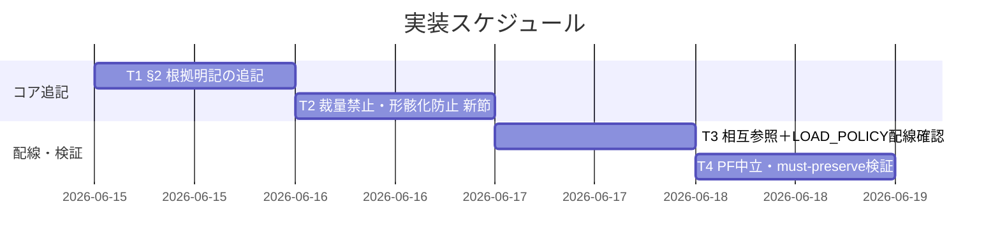

# 実装計画書: モデル選定の裁量禁止と形骸化防止

**プロジェクト名**: モデル選定の裁量禁止と形骸化防止（親「コア取り込み漏れ補完」S3）
**作成日**: 2026 年 06 月 15 日
**最終更新**: 2026 年 06 月 15 日

> **重要**: **このドキュメントは常に更新**: 実装計画の変更、進捗状況の更新、バグの記録などがあった場合は、即座にこのドキュメントを更新してください。ドキュメントは「生きているドキュメント」として扱い、実装内容と常に同期させます。
> **必須項目**: 「必須」と明記した欄は空欄・抽象語のみで提出しないこと。テスト観点・BDD 仕様は具体ケースを 1 件以上記載すること。
>
> **用語**: [.agents/CONCEPTS.md §用語規約](../../../../../../.agents/CONCEPTS.md#用語規約) を参照。

---

## 1. 実装概要

### 1.1 実装方針（必須）

[02_設計.md](./02_設計.md) に従い、既存独立コア `.agents/MODEL_SELECTION.md` の既存節（§1・§3・§4・§5・§境界）を壊さず、(T1) §2 へ根拠 1 行明記の追記、(T2) §4 と §5 の間に「裁量の禁止と形骸化防止」新節を挿入＋§境界に下振れ手続きの委譲を追補、(T3) `COVERAGE_AND_EXCEPTIONS.md §1.1` への相互参照と LOAD_POLICY 配線確認、(T4) PF 中立性・must-preserve の機械＋査読検証を行う。具体ティア表・モデル名・降格閾値はコアに置かず `.agents-project/` 委譲を明示する。

### 1.2 実装順序（必須: 1 件以上）



優先順位: T1（高）→ T2（高）→ T3（中）→ T4（高・ゲート）。T1〜T3 は同一ファイル編集のため逐次。T4 は全タスク後の検証ゲート。

---

## 2. タスク分解

**用語**: [.agents/CONCEPTS.md §用語規約](../../../../../../.agents/CONCEPTS.md#用語規約) を参照。

**必須**: 各タスクには **「テスト観点」（2.x.3）** と **「単体テスト仕様（BDD）」（2.x.4）** を必ず記載する。観点の定義は **02_設計 §6** および **RULES のテスト戦略・[TEST_BDD_FORMAT.md](../../../../../../.agents/TEST_BDD_FORMAT.md)** を参照し、本書では**タスクごとの具体ケース**のみ記載する。

> **検証手段の前提**: 本件はコア文書の追記であり、実行コードは伴わない。「単体テスト」は **grep / リンク解決チェック / diff / 査読**で代替する（02 §6 と一致）。

### 2.1 タスク T1: §2 ティア明記義務へ根拠 1 行明記を追記

#### 2.1.1 概要（必須）

`.agents/MODEL_SELECTION.md §2` に「ティア＋根拠（対応表の該当行）を 1 行明記、根拠なきティア指定不可、具体対応表は `.agents-project/` 参照」を追記する。

#### 2.1.2 実装内容（必須: 1 件以上）

- §2 本文に根拠 1 行明記義務の文を追加（既存「ティアを委譲パケットに明示」を残したまま拡張）。
- 具体対応表の中身はコアに書かず `.agents-project/` 委譲である旨を明記。
- frontmatter `document_id`（既存 `f2d7a163-...`）は変更しない。

#### 2.1.3 テスト観点（必須）

**参照**: 観点定義は [02_設計 §6](./02_設計.md) および [RULES のテスト戦略・TEST_BDD_FORMAT](../../../../../../.agents/RULES.md#テスト戦略必須要件) を参照。以下は本タスクの具体ケースのみ。

##### 単体（本タスクの具体ケース・必須 1 件以上）

- 正常系: `grep -nE '根拠.*該当行|根拠.*1 ?行' .agents/MODEL_SELECTION.md` が §2 領域でヒットする（根拠明記義務が明文化）。
- 正常系: §2 に「根拠なき（の無い）ティア指定は不可」相当の禁止文が存在する。
- 異常系（PF 中立違反検知）: §2 に具体ティア名・モデル名（例: `opus`/`sonnet`/`haiku`/`claude-*` 等の固有名）が混入していない（混入 0 件）。

##### 結合/API（本タスクの具体ケース・該当時は必須 1 件以上）

- 該当なし（単一ファイル文書追記）。

##### E2E/受け入れ（本タスクの具体ケース・未達時は理由記載）

- 受け入れ: 01 ストーリー 3 受け入れ基準「§2 のティア明記義務に根拠 1 行明記が加わる／具体対応表はコア非掲載」を査読で確認。

##### バリデーション（該当する場合の具体ケース）

- frontmatter `document_id` が編集前後で不変（`git diff` で frontmatter 無変更）。

#### 2.1.4 単体テスト仕様（BDD）（必須）

```gherkin
Feature: §2 ティア明記義務への根拠明記追記
  Scenario: 根拠1行明記が明文化される
    Given MODEL_SELECTION.md §2 に「ティアを委譲パケットに明示」がある
    When §2 へ根拠（対応表の該当行）の1行明記義務を追記する
    Then §2 に「ティア＋根拠を1行明記・根拠なきティア指定は不可」が記載される
    And 具体対応表の行内容はコアに無く .agents-project 参照と明記される
```

**テストコード例（bash・grep ベース。Given/When/Then をインラインコメントで明記）**

```bash
# Given: §2 への追記が完了した MODEL_SELECTION.md
f=.agents/MODEL_SELECTION.md
# When: §2 領域から根拠明記義務とPF中立性を検査する
grep -nE '根拠（対応表の該当行）|根拠を 1 行|根拠の無い' "$f"   # Then: 根拠明記・不可文がヒット（>0）
grep -niE '\bopus\b|\bsonnet\b|\bhaiku\b|claude-[0-9]' "$f" && echo "NG:固有モデル名混入" || echo "OK:PF中立"  # Then: 固有モデル名は無い
```

#### 2.1.5 依存関係

- なし（先頭タスク）。後続 T2 は同一ファイルを編集するため T1 完了後に着手。

#### 2.1.6 見積もり

- **工数**: 0.5h
- **優先度**: 高

### 2.2 タスク T2: 「裁量の禁止と形骸化防止」新節の追加＋§境界追補

#### 2.2.1 概要（必須）

`MODEL_SELECTION.md` の §4 と §5 の間に新節を挿入し、裁量上振れ禁止・裁量下振れ禁止（手続き条件付き）・エスケープハッチ形骸化防止の 3 原則を抽象形で記載。§3 と矛盾せず §4 を再設計せず、§境界に下振れ手続きの委譲を追補する。

#### 2.2.2 実装内容（必須: 1 件以上）

- 新節「## 裁量の禁止と形骸化防止」を §4 の後・§5（参照）の前に挿入。**番号なし見出しとし、既存 §5 を「§5 参照」のまま据え置く（§6 等へ繰り下げない）＝`#5-参照` アンカー保全。インバウンド `REVIEW_DUAL_LENS.md:45`（02 §2.2.2(b)・§2.3）。**
- 3 原則を記載: (1) 裁量上振れ禁止（迷ったら上位の廃止／対応表該当行で選び根拠明記）、(2) 裁量下振れ禁止＋「計測データ＋ユーザー承認＋対応表更新を経てのみ許可」、(3) エスケープハッチ形骸化防止（裁量上振れ・下振れ・上位エスカレーション常用化が対応表を骨抜きにしない）。
- (2) に「§3 品質ゲート最上位固定と矛盾しない」旨の参照を 1 文。
- (3) に「§4 未収束エスカレーションは条件発火の非裁量手続きであり、裁量上位常用化と区別する。§4 は再設計しない」旨を 1 文。
- §汎用/固有境界に「下振れの計測閾値・承認フロー・対応表更新手順は `.agents-project/`」を追補。
- 新節は §1 対象外環境規定に従う（発火条件は §1 を参照、新規規定を作らない）。

#### 2.2.3 テスト観点（必須）

**参照**: 観点定義は [02_設計 §6](./02_設計.md) を参照。以下は本タスクの具体ケースのみ。

##### 単体（本タスクの具体ケース・必須 1 件以上）

- 正常系: 新節見出し（例: `## 裁量の禁止と形骸化防止`）が §4 と §5 の間に存在する（出現順 §4 → 新節 → §5）。
- 正常系: 「迷ったら上位」の**禁止**文（廃止）が存在し、上振れを誘発する肯定文が**無い**。
- 正常系: 下振れ許可条件「計測データ／ユーザー承認／対応表更新」の 3 語がすべて新節に存在する。
- 正常系: 「形骸化」「エスケープハッチ」または同義の常用化防止文が存在する。
- 異常系（非破壊検知）: §3・§4 の本文が編集前後で不変（diff で §3/§4 範囲に差分なし）。
- 異常系（PF 中立）: 下振れの具体閾値（数値）・承認フロー手順・モデル固有名が新節に混入していない。
- 異常系（アンカー保全）: 既存 `## 5 参照` 見出しが編集前後で不変（`grep -n '^## 5 参照' .agents/MODEL_SELECTION.md` がヒット＝繰り下げ無し。`#5-参照` アンカー破断 0 件）。

##### 結合/API（本タスクの具体ケース・該当時は必須 1 件以上）

- 該当なし。

##### E2E/受け入れ（本タスクの具体ケース・未達時は理由記載）

- 受け入れ: 01 ストーリー 1・2 受け入れ基準（裁量上振れ禁止の明文化／下振れ禁止と手続き／§3 と矛盾しない）を査読で確認。
- 受け入れ: 01 BDD シナリオ 1・3・4 の Then が新節文言で満たされることを査読で確認。

##### バリデーション（該当する場合の具体ケース）

- 新節内で `.agents-project/` への委譲表現が下振れ具体手順に対して存在する。

#### 2.2.4 単体テスト仕様（BDD）（必須）

```gherkin
Feature: 裁量の禁止と形骸化防止 新節
  Scenario: 上振れ・下振れ両禁止と手続き・形骸化防止が明文化される
    Given MODEL_SELECTION.md に §4 未収束エスカレーションと §5 参照がある
    When §4 と §5 の間に「裁量の禁止と形骸化防止」新節を挿入する
    Then 裁量上振れ（迷ったら上位）の禁止が記載される
    And 裁量下振れの禁止と「計測データ＋ユーザー承認＋対応表更新を経てのみ許可」が記載される
    And エスケープハッチ形骸化防止が記載される
    And §3 品質ゲート最上位固定と矛盾せず §4 は再設計されない
```

**テストコード例（bash。Given/When/Then インラインコメント）**

```bash
# Given: 新節追加後の MODEL_SELECTION.md
f=.agents/MODEL_SELECTION.md
# When: 新節の3原則と非破壊を検査する
grep -nE '裁量.*上振れ|迷ったら上位' "$f"                          # Then: 上振れ禁止文がヒット
grep -nE '計測データ' "$f" && grep -nE '承認' "$f" && grep -nE '対応表更新|対応表.*更新' "$f"  # Then: 下振れ手続き3条件
grep -nE '形骸化|エスケープハッチ' "$f"                            # Then: 形骸化防止文がヒット
# Then: §3・§4 が不変（編集前後の該当範囲 diff が空）
git diff -- "$f" | grep -E '^\+' | grep -E '品質ゲート最上位|未収束エスカレーション' && echo "NG:既存節改変" || echo "OK:§3/§4 非破壊"
```

#### 2.2.5 依存関係

- T1 完了後（同一ファイル編集の衝突回避）。

#### 2.2.6 見積もり

- **工数**: 1h
- **優先度**: 高

### 2.3 タスク T3: COVERAGE_AND_EXCEPTIONS 相互参照と LOAD_POLICY 配線確認

#### 2.3.1 概要（必須）

新節から `COVERAGE_AND_EXCEPTIONS.md §1.1 禁止する回避パターン` への相互参照リンク（本文非複製・節アンカー表記）を 1 本張り、LOAD_POLICY の既存トリガー配線で足りることを確認する。

#### 2.3.2 実装内容（必須: 1 件以上）

- 新節 (3) に `COVERAGE_AND_EXCEPTIONS.md §1.1` への相対リンクを追加（行番号直リンクは使わず §名アンカー表記）。
- 逆向き参照（COVERAGE → モデル選定）は**新設しない**（責務純度／02 §2.2.3）。
- `LOAD_POLICY.md` トリガー「サブ委譲のモデル選定時 → MODEL_SELECTION.md」の既存行を確認。MODEL_SELECTION.md 内追記のため**新規トリガー行は追加しない**（不足時のみ追加）。

#### 2.3.3 テスト観点（必須）

##### 単体（本タスクの具体ケース・必須 1 件以上）

- 正常系: 新節に `COVERAGE_AND_EXCEPTIONS.md`（§1.1）へのリンクが 1 件存在し、解決可能（リンク先ファイル実在）。
- 正常系: リンクが行番号直リンク（`...md:NNN`）でなく節アンカー表記である。
- 正常系: 形骸化防止の**原型定義本文**が `MODEL_SELECTION.md` に複製されていない（参照のみ）。
- 正常系: `grep -n 'MODEL_SELECTION' .agents/boot/LOAD_POLICY.md` が「サブ委譲のモデル選定時」行をヒットする（配線済）。
- 異常系: `COVERAGE_AND_EXCEPTIONS.md` 本文に本件起因の差分が無い（被参照のみ／diff 空）。

##### 結合/API（本タスクの具体ケース・該当時は必須 1 件以上）

- リンク解決の結合確認: 相互参照のリンク先（`COVERAGE_AND_EXCEPTIONS.md` の §1.1 見出し）が実在し、未解決 0 件。
- インバウンドアンカー回帰: `REVIEW_DUAL_LENS.md:45` の `MODEL_SELECTION.md#5-参照` が解決可能なまま（`## 5 参照` 見出し存置）であることを確認（新節挿入で破断していない）。

##### E2E/受け入れ（本タスクの具体ケース・未達時は理由記載）

- 受け入れ: 00 §3.4・07.1（1 ファイル 1 責務・重複禁止・二重定義回避）が相互参照方式で満たされることを査読で確認。

##### バリデーション（該当する場合の具体ケース）

- LOAD_POLICY 配線が「追加不要」の見立てどおりか、追加要否を判定し結果を記録。

#### 2.3.4 単体テスト仕様（BDD）（必須）

```gherkin
Feature: 相互参照とLOAD_POLICY配線
  Scenario: 本文を複製せず相互参照で非重複を担保する
    Given 新節にエスケープハッチ形骸化防止が記載されている
    When COVERAGE_AND_EXCEPTIONS.md §1.1 への相互参照リンクを張る
    Then 形骸化防止の原型定義本文は複製されずリンクで委ねられる
    And リンクは節アンカー表記で解決可能である
    And LOAD_POLICY のモデル選定トリガーは既存行で配線済みである
```

**テストコード例（bash。Given/When/Then インラインコメント）**

```bash
# Given: 相互参照追加後の状態
f=.agents/MODEL_SELECTION.md
# When: リンクと配線を検査する
grep -nE 'COVERAGE_AND_EXCEPTIONS\.md' "$f"                       # Then: COVERAGE への参照リンクが存在
grep -nE 'COVERAGE_AND_EXCEPTIONS\.md:[0-9]+' "$f" && echo "NG:行番号直リンク" || echo "OK:節アンカー"  # Then: 行番号直リンクでない
grep -n 'モデル選定時' .agents/boot/LOAD_POLICY.md               # Then: 既存トリガー行がヒット
# Then: 相互参照先が実在（未解決0件）
test -f .agents/COVERAGE_AND_EXCEPTIONS.md && echo "OK:link target exists"
```

#### 2.3.5 依存関係

- T2 完了後（新節が存在してからリンクを張る）。

#### 2.3.6 見積もり

- **工数**: 0.5h
- **優先度**: 中

### 2.4 タスク T4: PF 中立性・must-preserve の検証ゲート

#### 2.4.1 概要（必須）

全タスク後に、PF 中立性（具体ティア表・モデル名・コスト実測・降格閾値がコア非混入）と must-preserve（§3/§4 非破壊・COVERAGE 非重複・`.agents-project/` 委譲）を機械＋査読で検証し、残骸タグ 0 件を確認する。

#### 2.4.2 実装内容（必須: 1 件以上）

- PF 中立性 grep（固有モデル名・具体閾値・対応表行内容の非混入）を実行。
- §3/§4 非破壊の diff 確認。
- §5 アンカー保全の確認（`## 5 参照` 見出し存置／`REVIEW_DUAL_LENS.md:45` の `#5-参照` インバウンド未破断）。
- COVERAGE_AND_EXCEPTIONS.md 本文無変更の確認。
- 残骸タグ（`</content>`・`<content>`・未閉じコードフェンス等）0 件確認。
- 01 受け入れ基準・BDD と新節文言の対応表（受け入れマトリクス）を査読で突合。

#### 2.4.3 テスト観点（必須）

##### 単体（本タスクの具体ケース・必須 1 件以上）

- 正常系: `grep -niE '\bopus\b|\bsonnet\b|\bhaiku\b|claude-[0-9]|fail-under|<=|>=|[0-9]+%' .agents/MODEL_SELECTION.md` で具体値・固有名が新規混入 0 件（既存正当箇所を除き、新節・§2 追記に対して）。
- 正常系: 残骸タグ `grep -nE '</?content>|^```$' …` 想定外ヒット 0 件。
- 異常系: §3「品質ゲート最上位固定」・§4「未収束エスカレーション」の本文に差分がない。

##### 結合/API（本タスクの具体ケース・該当時は必須 1 件以上）

- 該当なし。

##### E2E/受け入れ（本タスクの具体ケース・未達時は理由記載）

- 受け入れ: 01 の全受け入れ基準（ストーリー 1〜4）と BDD シナリオ 1〜5 が満たされることを受け入れマトリクスで確認。01 ストーリー 4（昇格先決定）は本 02 §2.2.1 で案 A 確定済みであることを確認。

##### バリデーション（該当する場合の具体ケース）

- 03 の各タスク BDD（grep 期待値）と 02 §6.1 割当表の対応が漏れなく揃っていること。

#### 2.4.4 単体テスト仕様（BDD）（必須）

```gherkin
Feature: PF中立性・must-preserve 検証ゲート
  Scenario: 具体値混入と既存節破壊を検知して阻止する
    Given §2 追記と新節追加が完了している
    When PF中立性grepと§3/§4 diffと残骸タグ検査を実行する
    Then 具体ティア表・モデル名・降格閾値がコアに混入していない
    And §3 品質ゲート最上位・§4 未収束エスカレーションの本文は不変である
    And §5 参照の見出し番号は不変で #5-参照 インバウンドアンカーが破断していない
    And 残骸タグは0件である
```

**テストコード例（bash。Given/When/Then インラインコメント）**

```bash
# Given: 全タスク完了後の MODEL_SELECTION.md
f=.agents/MODEL_SELECTION.md
# When: PF中立・残骸・非破壊を一括検査する
grep -niE '\bopus\b|\bsonnet\b|\bhaiku\b|claude-[0-9]|fail-under' "$f" && echo "NG:具体値混入" || echo "OK:PF中立"  # Then: 固有名・具体値0件
grep -nE '</?content>' "$f" && echo "NG:残骸タグ" || echo "OK:残骸0"   # Then: 残骸タグ0件
# Then: §3/§4 が編集で改変されていない（追加行に既存節の改変が混じらない）
git diff -- "$f" | grep -E '^-' | grep -E '品質ゲート|未収束エスカレーション' && echo "NG:既存節削除改変" || echo "OK:§3/§4 非破壊"
```

#### 2.4.5 依存関係

- T1・T2・T3 完了後（最終検証ゲート）。

#### 2.4.6 見積もり

- **工数**: 0.5h
- **優先度**: 高（ゲート）

---

## テスト観点

本実装計画全体のテスト観点の要約（具体ケースは各タスク §2.x.3）:

- **明文化**（裁量上振れ・下振れ禁止／根拠 1 行明記／形骸化防止がコアに記載）— T1・T2 で grep＋査読。
- **PF 中立**（具体ティア表・モデル名・コスト実測・降格閾値がコアに混入しない）— T1・T2・T4 で grep。
- **非重複**（COVERAGE_AND_EXCEPTIONS §1.1 を本文複製でなく相互参照）— T3 でリンク解決＋査読。
- **非破壊**（§3 品質ゲート最上位・§4 未収束エスカレーション不変／**§5 アンカー保全＝`#5-参照` 未破断**）— T2・T4 で diff、T3・T4 でインバウンドアンカー回帰。
- **配線**（LOAD_POLICY モデル選定トリガー既存行で充足）— T3 で grep。
- **昇格先確定**（案 A＝MODEL_SELECTION.md 追記が S5 §2.2.2 と一致）— 02 §2.2.1 で確定済、T4 で受け入れ確認。

監査で本セクションの存在と各タスク §2.x.3 の具体ケースが検査される。

---

## 単体テスト

文書追記のため実行コードの単体テストは無く、**grep / リンク解決 / git diff / 査読**で代替する（各タスク §2.x.4 の bash テストコード例を参照）。クリティカル観点は「明文化」「PF 中立」「非破壊」。

---

## BDD

各タスク §2.x.4 の Gherkin を一覧として束ねる。Given/When/Then 形式は [TEST_BDD_FORMAT.md](../../../../../../.agents/TEST_BDD_FORMAT.md) に従う。

- T1: §2 ティア明記義務への根拠明記追記（根拠 1 行明記の明文化）。
- T2: 裁量の禁止と形骸化防止 新節（上振れ・下振れ両禁止・手続き・形骸化防止）。
- T3: 相互参照と LOAD_POLICY 配線（本文非複製・節アンカー・配線済）。
- T4: PF 中立性・must-preserve 検証ゲート（具体値混入・既存節破壊の検知阻止）。

**01 受け入れ基準 → 03 タスクの対応**:

| 01 ストーリー / BDD | 対応タスク |
|---------------------|-----------|
| ストーリー 1（裁量上振れ禁止）/ シナリオ 1 | T2 |
| ストーリー 2（裁量下振れ禁止と手続き）/ シナリオ 3 | T2 |
| ストーリー 3（根拠明記必須）/ シナリオ 2 | T1 |
| ストーリー 4（昇格先決定）/ シナリオ 5 | 02 §2.2.1（確定）・T4（受け入れ確認） |
| シナリオ 4（対象外環境で不発火） | T2（§1 適用条件参照）・T4 |
| 非重複（00 §3.4・07.1） | T3 |
| §3/§4 非破壊・§5 アンカー保全（must-preserve） | T2・T3・T4 |
| PF 中立（具体値非混入） | T1・T2・T4 |

---

## 3. 実装スケジュール

### 3.1 マイルストーン

| マイルストーン | 期日 | 成果物 |
| -------------- | ---- | ------ |
| M1: §2 拡張＋新節追加 | 1 日目 | T1・T2 反映済み `MODEL_SELECTION.md` |
| M2: 配線・検証完了 | 2 日目 | T3 相互参照・配線確認、T4 検証ログ |

### 3.2 実装フェーズ

#### フェーズ 1: コア追記

- **期間**: 1 日目
- **タスク**: T1（§2 根拠明記）・T2（裁量禁止・形骸化防止 新節＋§境界追補）

#### フェーズ 2: 配線・検証

- **期間**: 2 日目
- **タスク**: T3（相互参照＋LOAD_POLICY 配線確認）・T4（PF 中立・must-preserve 検証ゲート）

---

## 4. テスト計画

テスト観点・レベル・BDD 形式の定義は **02_設計 §6** および **RULES のテスト戦略・TEST_BDD_FORMAT** を参照。本計画では各タスク §2.x.3 にタスクごとの具体ケース、§2.x.4 に BDD 仕様を記載した。

### 4.1 テストの優先順位

- クリティカル: PF 中立性・§3/§4 非破壊（品質ゲート相当。T4 ゲートで必ず検証）。
- 影響範囲: `MODEL_SELECTION.md` 単一ファイル＋ `LOAD_POLICY.md`／`COVERAGE_AND_EXCEPTIONS.md` の参照健全性（リンク解決を回帰確認に含める）。

---

## 5. リスク管理

### 5.1 実装リスク

- **リスク**: 新節がコスト最適化の具体閾値・モデル名まで踏み込み PF 中立性を壊す。
  - **対策**: 抽象形に固定し、下振れの計測閾値・承認フローは `.agents-project/` 委譲と明記。T1・T4 の grep ゲートで具体値混入 0 件を機械検証。
- **リスク**: COVERAGE_AND_EXCEPTIONS §1.1 と形骸化防止が二重定義になる。
  - **対策**: 原型定義は COVERAGE 側に委ね、`MODEL_SELECTION.md` はモデル文脈への適用＋相互参照のみ（本文非複製）。T3 で複製有無を確認。
- **リスク**: §4 未収束エスカレーションと「裁量上位常用化禁止」が衝突して見える。
  - **対策**: 新節に「§4＝条件発火の非裁量手続き、本節＝裁量常用化の禁止」と峻別文を置く。§4 本文は不変（T2・T4 diff）。

---

## 6. 参考資料

### プロジェクトドキュメント

- [`02_設計.md`](./02_設計.md) - 設計
- [`01_要件定義.md`](./01_要件定義.md) - 要件定義
- [`00_要求定義.md`](./00_要求定義.md) - 要求定義

### その他の参考資料

- 編集対象: [.agents/MODEL_SELECTION.md](../../../../../../.agents/MODEL_SELECTION.md)（§2 拡張・新節挿入・§境界追補）
- 相互参照先（非編集）: [.agents/COVERAGE_AND_EXCEPTIONS.md](../../../../../../.agents/COVERAGE_AND_EXCEPTIONS.md) §1.1
- 配線確認: [.agents/boot/LOAD_POLICY.md](../../../../../../.agents/boot/LOAD_POLICY.md)
- 上位確定: [`../クローズアウトとissue起票の構造是正/02_設計.md`](../クローズアウトとissue起票の構造是正/02_設計.md) §2.2.2

---

## 7. 前のステップ

この実装計画書は、以下のドキュメントを基に作成されています：

- **前**: [`02_設計.md`](./02_設計.md) - 設計フェーズ

---

## 8. 次のステップ

この実装計画書の承認後、以下のいずれかのステップに進みます：

- **本サブ issue は 1 つの実装単位である**: 実装フェーズ（execution）に直接進む（さらなるサブ分割はしない）。

**用語**: [.agents/CONCEPTS.md §用語規約](../../../../../../.agents/CONCEPTS.md#用語規約) を参照。
