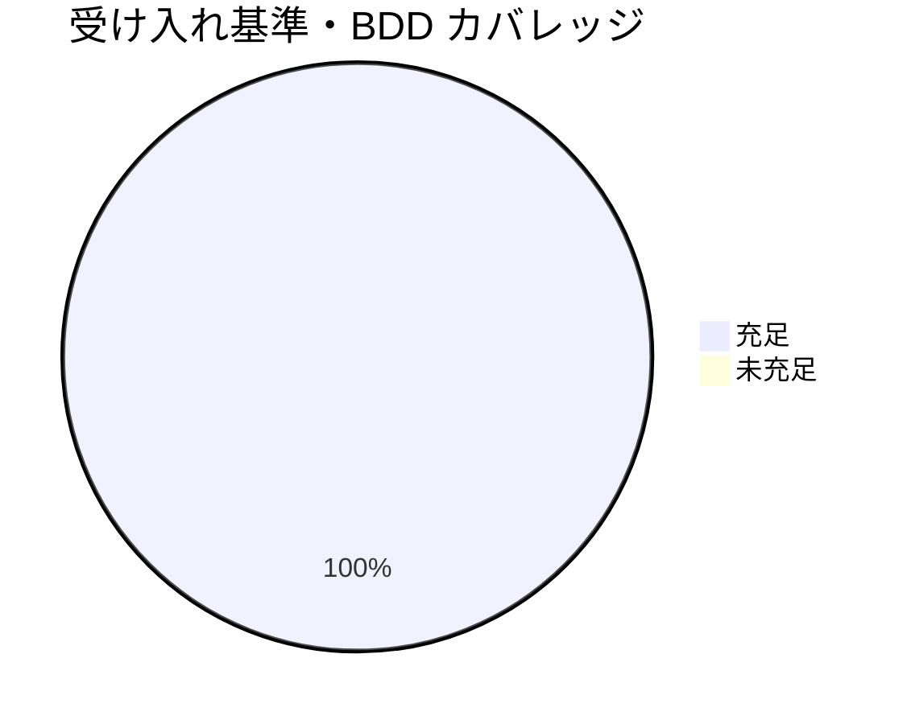

# レビュー書: モデル選定の裁量禁止と形骸化防止（親「コア取り込み漏れ補完」S3）

**プロジェクト名**: モデル選定の裁量禁止と形骸化防止（S3）
**作成日**: 2026 年 06 月 15 日
**最終更新**: 2026 年 06 月 15 日

> **用語**: [.agents/CONCEPTS.md §用語規約](../../../../../../.agents/CONCEPTS.md#用語規約) を参照。
> **レビュー深度**: standard（中）。コア 1 ファイル（`.agents/MODEL_SELECTION.md`）への節単位・加法的（+15/-3、実質追加）な直交追加。検証は [.agents/REVIEW_RULE.md](../../../../../../.agents/REVIEW_RULE.md) に従い grep／git diff／リンク・アンカー解決スクリプトで実測し、[.agents/REVIEW_DUAL_LENS.md](../../../../../../.agents/REVIEW_DUAL_LENS.md) の二観点（敵対的＋肯定的＝must-preserve）を必須とする。本 issue はエスケープハッチ形骸化防止＝裁量を絞る統治を主題とするため、PF 中立性と既存節アンカー保全を特に厳密に監査した。

---

## 1. レビュー概要

### 1.1 レビュー目的（必須）

実装内容の確認 / 品質保証 / クローズ前最終チェック。S3（モデルティア選定の「裁量上振れ・下振れ両禁止」「根拠1行明記必須」「エスケープハッチ形骸化防止」を `.agents/MODEL_SELECTION.md` へ加法直交追加）が、**既存正本の意味・振る舞いを変えない（must-preserve）構造追加**として成立し、PF 中立性（具体ティア・モデル名・閾値のコア非掲載）・1 ファイル 1 責務（COVERAGE §1.1 への相互参照のみで本文非複製）・既存節アンカー保全（特に `## 5 参照` 据え置きによる REVIEW_DUAL_LENS.md インバウンド `#5-参照` 未破断）を満たすかを、**実装サブの自己申告を鵜呑みにせず独立検証**（grep 実測・git diff・リンク/アンカー解決）で確認する。

### 1.2 レビュー対象（必須）

- **実装範囲（変更 1 ファイル・加法）**:
  - **変更**: `.agents/MODEL_SELECTION.md`（document_id: `f2d7a163-9c45-4e82-b1a0-6e8f3c95d214`・不変）— `git diff --stat` で **+15 / -3**（1 ファイル）。
    - (a) §2 ティア明記義務に「根拠（対応表の該当行）1 行明記必須・根拠無しのティア指定不可」を加法。具体対応表の中身はコア非掲載・`.agents-project/` 委譲。
    - (b) §4 と §5 の間に番号なし新節 `## 裁量の禁止と形骸化防止`（アンカー `#裁量の禁止と形骸化防止`）を挿入。3 原則（裁量上振れ禁止／裁量下振れ禁止＋手続き＝計測データ＋ユーザー承認＋対応表更新／エスケープハッチ形骸化防止）と §1 対象外環境での不発火明記。
    - (c) §汎用/固有境界の 2 行を「（＋根拠 1 行明記）」「裁量の禁止と形骸化防止」「下振れの計測閾値・承認フロー・対応表更新手順」で加法更新（旧 2 行 → 新 2 行＝diff 上の -3 のうち 2 行はこの境界行の置換）。
  - **非変更（被参照のみ）**: `.agents/COVERAGE_AND_EXCEPTIONS.md`（§1.1 を相互参照される側・本文不変）、`.agents/REVIEW_DUAL_LENS.md`（`#5-参照` をインバウンド参照する側・不変）、`.agents/boot/LOAD_POLICY.md`（既存トリガーで配線済み・不変）。
- **レビュー期間**: 2026-06-15 ～ 2026-06-15
- **レビュー担当者**: verify-and-close サブエージェント（generate-scenarios / map-coverage / review-code / review-architecture）。モデルティア: 上位（opus 相当・フレームワーク中核の監査）。

---

## 2. 実装内容の確認

### 2.1 実装完了タスク

| タスク名 | 実装内容 | 実装日 | 担当者 | ステータス |
| --- | --- | --- | --- | --- |
| T1 §2 根拠明記の拡張 | §2 に「ティア＋根拠（対応表該当行）を 1 行明記・根拠なきティア指定不可」を追記。具体対応表はコア非掲載・`.agents-project/` 委譲を明記 | 2026-06-15 | implement | 完了 |
| T2 新節「裁量の禁止と形骸化防止」追加 | §4 と §5 の間に番号なし新節を挿入。3 原則（上振れ禁止／下振れ禁止＋手続き／形骸化防止）＋§1 不発火参照＋§3 矛盾なし参照＋§4 峻別 | 2026-06-15 | implement | 完了 |
| T3 COVERAGE §1.1 相互参照・§境界追補 | 新節 (3) から `COVERAGE_AND_EXCEPTIONS.md §1.1` へ相互参照リンク 1 本（本文非複製）。§汎用/固有境界に下振れ手続きの委譲を追補 | 2026-06-15 | implement | 完了 |
| T4 must-preserve ゲート（アンカー保全） | `## 5 参照` 据え置き（繰り下げず）で `#5-参照` インバウンド保全。§1〜§4・§汎用/固有境界 アンカー不変。PF 中立 grep | 2026-06-15 | implement | 完了 |

### 2.2 実装内容の詳細

#### タスク 1: §2 ティア明記義務の拡張（根拠 1 行明記の必須化）

- **実装内容**: 02 §2.2.2(a)／03 どおり、§2 に「加えて、**そのティアを選んだ根拠（対応表の該当行）を 1 行で明記**する。**根拠の無いティア指定は不可**とする」を追記。具体対応表（該当行の中身）は「**コアに置かず** `.agents-project/` の定義に従う」と委譲を明記。
- **独立検証**:
  - `git diff .agents/MODEL_SELECTION.md` の §2 ハンク → 1 行を「根拠 1 行明記・根拠なき指定不可・コア非掲載」を加えた行に置換（行内加法・削除実質なし）。
  - 具体的なティア名・対応表の行内容（モデル名等）は本文に出現しない（PF 中立検証は §3.1 参照）。

#### タスク 2: 新節「裁量の禁止と形骸化防止」の追加

- **実装内容**: 02 §2.2.2(b)(c)(e)／03 どおり、§4（未収束エスカレーション・L29）と §5 参照（L47）の間（L35）に**番号なし見出し** `## 裁量の禁止と形骸化防止` を挿入。3 原則を抽象形で記載——(1) 裁量上振れ禁止（「迷ったら上位」廃止／対応表該当行で選び根拠明記＝§2 参照）、(2) 裁量下振れ禁止＋手続き（計測データ＋ユーザー承認＋対応表更新を経てのみ許可・具体閾値は `.agents-project/`・**§3 品質ゲート最上位固定と矛盾しない**を明記）、(3) エスケープハッチ形骸化防止（COVERAGE §1.1 へ相互参照・本文非複製／**§4 は条件発火の非裁量手続きであり裁量上位常用化と区別・§4 は再設計しない**を明記）。末尾に「§1 適用条件に従い対象外環境では発火しない（新たな対象外規定は設けない）」を 1 文で参照。
- **独立検証**:
  - `grep -nE '^## '` で見出し順を確認 → `## 1 適用条件`(11) / `## 2 ティア明記義務`(17) / `## 3 品質ゲート最上位固定`(23) / `## 4 未収束エスカレーション`(29) / `## 裁量の禁止と形骸化防止`(35) / `## 5 参照`(47) / `## 汎用/固有境界`(54)。新節が §4 と §5 の間（番号なし）に正しく挿入され、**§5 が繰り下がっていない**。
  - 自己参照 `[§4 未収束エスカレーション](#4-未収束エスカレーション)` の先＝`## 4 未収束エスカレーション`(L29) 実在。
  - §3 矛盾なし参照文が新節 (2) に存在（grep 確認）。

#### タスク 3: COVERAGE §1.1 相互参照・§汎用/固有境界の追補

- **実装内容**: 02 §2.2.3／03 どおり、新節 (3) から [COVERAGE_AND_EXCEPTIONS.md §1.1 禁止する回避パターン](#) へ相互参照リンク 1 本（節アンカー表記 `#11-禁止する回避パターン`・行番号直リンクを使わない）。逆参照（COVERAGE 側からモデル選定への参照）は新設しない。§汎用/固有境界の 2 行を「適用条件・ティア明記義務（＋根拠 1 行明記）・…・裁量の禁止と形骸化防止・対象外環境の明記」「…降格判断、および**下振れの計測閾値・承認フロー・対応表更新手順**」に加法更新。
- **独立検証**:
  - リンク先 `COVERAGE_AND_EXCEPTIONS.md` 実在、見出し `### 1.1 禁止する回避パターン`（L29）実在 → スラッグ `#11-禁止する回避パターン` と一致。
  - COVERAGE 側に逆参照（MODEL_SELECTION への新規リンク）が増えていない（`git diff` で COVERAGE_AND_EXCEPTIONS.md は変更なし＝差分ファイルに含まれない）。
  - 形骸化防止原型の**定義本文**（「台帳なしの除外」「形骸化する矯正」等の COVERAGE 固有の表組み定義）が MODEL_SELECTION.md 側に複製されていない（参照リンクのみ＝二重定義なし）。

#### タスク 4: must-preserve ゲート（アンカー保全・既存節不改変・PF 中立）

- **独立検証**:
  - **§5 アンカー保全**: `## 5 参照`(L47) 据え置き → REVIEW_DUAL_LENS.md:46 の `MODEL_SELECTION.md#5-参照` インバウンドリンクが解決（独立 sweep で PASS）。
  - **既存節不改変**: §3（品質ゲート最上位・L23-）・§4（未収束エスカレーション・L29-）の**本文に削除/改変なし**。`git diff` の `-` 行は §汎用/固有境界 の旧 2 行（境界要約の置換）のみで、§3/§4 本文ハンクは出現しない。
  - **PF 中立**: `grep -nEi 'opus|sonnet|haiku|claude-[0-9]|fail-under|gpt|gemini|llama|fail_under'` → **0 件**。
  - **document_id 不変**: frontmatter `f2d7a163-...` を改変していない（diff の context 行で確認）。
  - **残骸タグ/連続空行**: コンフリクトマーカ・TODO・連続空行 **0 件**。

---

## 3. テスト結果の確認（検証スクリプト・grep 実測）

文書構造への加法的追加のため、単体テストは 02 §6／03 の BDD 検証スクリプト（grep／git diff／リンク・アンカー解決）で代替する（02 §6 テスト戦略の規定どおり）。**実装サブの自己申告を鵜呑みにせず、本レビューで再実行・独立計測した。**

### 3.1 検証結果サマリ（必須: 数値で記載）

- **実行日**: 2026-06-15
- **差分規模**: `git diff --stat` = `1 file changed, 15 insertions(+), 3 deletions(-)`（task 指定の +15/-3 と一致） → PASS
- **T1 BDD（§2 根拠明記）**: §2 に「根拠（対応表の該当行）を 1 行で明記」「根拠の無いティア指定は不可」が出現 → PASS
- **T2 BDD（新節 3 原則）**: 新節に「裁量上振れの禁止」「裁量下振れの禁止と手続き」「エスケープハッチ形骸化防止」が出現／§3 矛盾なし・§4 峻別の参照文あり → PASS
- **T2 回帰（§5 据え置き）**: `## 5 参照`(L47) が繰り下がらず存在・見出し順 1→2→3→4→新節→5→境界 → PASS
- **T3 相互参照（COVERAGE §1.1）**: リンク先ファイル実在・見出し `### 1.1 禁止する回避パターン` 実在・スラッグ `#11-禁止する回避パターン` 一致／本文非複製 → PASS
- **T3 §境界追補**: 「裁量の禁止と形骸化防止」「下振れの計測閾値・承認フロー・対応表更新手順」が §汎用/固有境界 に出現 → PASS
- **T4 PF 中立**: 固有モデル名/閾値 grep = **0 件** → PASS
- **T4 アンカー保全（インバウンド）**: REVIEW_DUAL_LENS.md:46 `#5-参照` 解決（独立 sweep PASS）／§4 自己参照 `#4-未収束エスカレーション` 解決 → PASS
- **T4 既存節不改変**: §3/§4 本文に `-` 削除行なし・document_id 不変・残骸/連続空行 0 → PASS
- **リンク健全性**: MODEL_SELECTION.md の全 `.md` リンク（COVERAGE/REVIEW_DUAL_LENS/CLOSEOUT）未解決 = **0 件** → PASS
- **失敗**: 0 / **スキップ**: 0

### 3.2 受け入れ基準カバレッジ（01 ↔ 実装）

| 01 ストーリー / BDD | 受け入れ基準 | 検証方法 | 結果 | evidence_source |
| --- | --- | --- | --- | --- |
| S1 裁量上振れの禁止（BDD シナリオ 1） | 「迷ったら上位はしない／対応表該当行で選び根拠明記」が明文化 | 新節 (1) の grep・対応表該当行参照の確認 | 充足 | test_output |
| S2 裁量下振れの禁止と手続き（BDD シナリオ 3） | 「裁量下振れ禁止／下振れは計測＋承認＋対応表更新を経てのみ」が明文化・§3 と矛盾しない | 新節 (2) の grep・§3 矛盾なし参照文の確認 | 充足 | test_output |
| S3 根拠明記の必須化（BDD シナリオ 2） | §2 に「ティア＋根拠（対応表該当行）1 行明記・根拠なき指定不可」が加わる／具体表は `.agents-project/` | §2 ハンクの grep・PF 中立 grep | 充足 | test_output |
| S3 対象外環境の不発火（BDD シナリオ 4） | ティア選択概念が無い環境では本原則も発火しない | 新節末尾「§1 適用条件に従い対象外環境では発火しない」の grep | 充足 | test_output |
| S4 昇格先の決定（BDD シナリオ 5） | 昇格先を 1 ファイルに一本化（案 A 採用）・COVERAGE とは相互参照で非重複 | 02 §2.2.1 確定／COVERAGE 本文無変更・相互参照リンク 1 本の確認 | 充足 | existing_code |
| エスケープハッチ形骸化防止 | 形骸化防止意図が明文化／COVERAGE §1.1 を相互参照・本文非複製・逆参照なし | 新節 (3) の grep・リンク解決・COVERAGE 無変更 | 充足 | test_output |
| PF 中立性 | 具体ティア表・モデル名・コスト実測・降格閾値がコアに混入 0 | 固有値 grep = 0 件 | 充足 | test_output |

---

## 4. コードレビュー

### 4.1 品質

- **構造（1 ファイル 1 責務）**: モデルティア選定原則の正本は `MODEL_SELECTION.md` の 1 ファイルに集約。形骸化防止の**汎用原型の定義**＝`COVERAGE_AND_EXCEPTIONS.md §1.1`（既存・1 か所）／モデルティア文脈への**適用**＝`MODEL_SELECTION.md` 新節（1 か所・新設）。原型定義の重複埋め込みなし（相互参照リンクのみ）。
- **PF 中立性**: 追加行に具体ティア名・モデル名（opus/sonnet/haiku/claude-N 等）・コスト閾値・`fail-under` 等を含まない（grep 0 件）。具体運用は §2／新節／§汎用/固有境界 経由で `.agents-project/` へ委譲済み。
- **参照健全性**: 追加リンク・アンカー（COVERAGE §1.1・§4 自己参照）すべて解決、未解決 0。インバウンド `#5-参照`（REVIEW_DUAL_LENS.md:46）も保全。

#### コードレビュー観点

| 観点 | 確認内容 | 結果 | コメント |
| --- | --- | --- | --- |
| 可読性 | 裁量上振れ/下振れ/形骸化防止が番号付き 3 原則で読める | OK | 新節を抽象形で簡潔に記載・具体は `.agents-project/` へ 1 ホップ |
| 保守性 | 原型定義/適用の正本が各 1 か所・リンク委譲 | OK | 二重定義 0・委譲先実在・逆参照を新設しない |
| 単一責務 | モデル選定原則は MODEL_SELECTION.md のみ、COVERAGE は被参照のみ | OK | COVERAGE 本文無変更 |
| 整合性 | §2↔新節・新節↔§3/§4・新節↔COVERAGE §1.1 のリンク・アンカー解決 | OK | §3 矛盾なし・§4 峻別を明文化・旧アンカー破断なし |

### 4.2 指摘事項

二観点レビューを反復した結果、**敵対的観点・肯定的観点ともに承認阻却の指摘は 0 件**に収束した（反復 1 ラウンドで収束。差し戻し指摘の発生なし＝S4 で明文化した must-preserve ラウンド継承の規範に従い、却下指摘もなし）。実装は 02/03 設計と完全一致し、既存正本の改変・二重定義・未解決リンク・PF 固有値混入のいずれも検出されなかった。

#### 観察（指摘ではない・記録のみ）

- **新節内の「§4 未収束エスカレーション」「§3 品質ゲート最上位固定」への言及**: それぞれ「条件発火の非裁量手続きと区別する／§4 は再設計しない」「§3 と矛盾しない」という**峻別・整合を述べる参照文**であり、§3/§4 の原則本文の二重記述ではない。1 ファイル 1 責務（§3/§4 本文は当該節のみ）に違反しないことを git diff（§3/§4 本文に削除行なし）で確認。
- **diff の `-3`**: §汎用/固有境界 の旧 2 行の置換と §2 行内置換に由来し、いずれも**意味の削除ではなく加法更新**（要約に新項目を足した結果）。§1〜§4 本文の削除ではない。

---

## 5. ドキュメントの確認

### 5.1 ドキュメント更新状況

| ドキュメント | 更新状況 | 確認者 | 確認日 |
| --- | --- | --- | --- |
| [`00_要求定義.md`](./00_要求定義.md) | 更新済み（要求確定） | verify | 2026-06-15 |
| [`01_要件定義.md`](./01_要件定義.md) | 更新済み（受け入れ基準・BDD・昇格先論点） | verify | 2026-06-15 |
| [`02_設計.md`](./02_設計.md) | 更新済み（昇格先＝案 A 確定・責務割当・アンカー保全方針） | verify | 2026-06-15 |
| [`03_実装計画.md`](./03_実装計画.md) | 更新済み（タスク・BDD・grep 期待値） | verify | 2026-06-15 |

### 5.2 ドキュメントの整合性

- **実装と設計の整合性**: 整合。02 §2.2.1（案 A＝`MODEL_SELECTION.md` 拡張・COVERAGE 移設しない）・§2.2.2（(a)〜(e) の追記設計）・§2.2.3（相互参照・逆参照なし・節アンカー表記）どおり。S5 §2.2.2 の対称配置確定とも一致。
- **要件と実装の整合性**: 整合。00/01 の成功基準（裁量上振れ・下振れ両禁止のコア明文化／根拠 1 行明記必須／エスケープハッチ形骸化防止／具体ティア表のコア非混入＝PF 中立）をすべて満たす。

## docs 更新

- 要否: **不要**
- 対象: なし
- 理由: 本 S3 はコア（`.agents/`）のプロセス規約（モデルティア選定の統治原則）への加法追加であり、消費者向けシステム仕様（`docs/` の機能/データ/画面/API）に影響しない。

---

## 9. 設計・境界の確認（review-architecture）

### 9.1 設計の確認

- **設計原則の準拠**: 単一責務・正本 1 か所・重複禁止・PF 中立性・リンク委譲・直交追加（既存節不改変）すべて遵守。新節は §4 と §5 参照 の間（モデル選定統治の論理位置）に**番号なし見出し**で配置され、§1〜§5 の番号・アンカーを乱さない。
- **命名規則**: 新節は意図が分かる見出し `## 裁量の禁止と形骸化防止`。既存番号付き節（`## N 見出し`）の番号体系を**繰り下げない**ことで `#5-参照` インバウンドを保全する設計判断（02 §2.2.2 アンカー安定性 must-preserve）を踏襲。

### 9.2 境界・依存の確認

- **責務の境界**: 抽象統治原則（裁量禁止・形骸化防止・根拠明記）＝コア `MODEL_SELECTION.md`／具体ティア対応表・モデル名・コスト実測・**下振れの計測閾値・承認フロー・対応表更新手順**＝`.agents-project/`。境界を §汎用/固有境界 で明示し、具体値をコアに混入させていない。
- **依存関係**: `MODEL_SELECTION.md` 新節 →（相互参照・原型の定義委譲）→ `COVERAGE_AND_EXCEPTIONS.md §1.1`／→（区別の明示）→ `MODEL_SELECTION.md §4`／→（矛盾なし）→ §3／→（具体値委譲）→ `.agents-project/`。**逆向き依存（COVERAGE→モデル選定）を新設しないため循環なし**。LOAD_POLICY 既存トリガーで 1 ホップ到達（新規配線不要を確認）。
- **指摘・推奨**: なし。

### 9.3 重要判断の根拠（evidence_source）

| 判断内容 | evidence_source | 備考 |
| --- | --- | --- |
| 差分 +15/-3・1 ファイル | test_output | `git diff --stat .agents/MODEL_SELECTION.md` |
| §5 据え置き＝インバウンド `#5-参照` 未破断 | test_output | 見出し順 grep＋独立 sweep で REVIEW_DUAL_LENS.md:46 解決 |
| 新節アンカー `#裁量の禁止と形骸化防止` 挿入・§4/§5 間 | test_output | `grep -nE '^## '` の行順 |
| COVERAGE §1.1 相互参照解決・本文非複製・逆参照なし | test_output / existing_code | リンク解決＋ COVERAGE 無変更（diff に非出現） |
| PF 中立（固有値混入 0） | test_output | `grep -nEi 'opus\|sonnet\|haiku\|claude-[0-9]\|fail-under...'` = 0 |
| §3/§4 本文不変・document_id 不変 | test_output / existing_code | `git diff` に §3/§4 本文削除行なし・frontmatter 不変 |
| 残骸タグ・連続空行 0 | test_output | grep・awk 連続空行検出 0 |

> 重要判断はいずれも grep 実測・git diff・アンカー実在/独立 sweep の**外部根拠**に基づく。inference_only のみに依存する重要判断はない。

---

## 二観点レビュー（REVIEW_DUAL_LENS）

> 本 issue はエスケープハッチ形骸化防止＝裁量を絞る統治を主題とするため、両リストを厳密に記載する（audit#27）。

### 敵対的観点リスト（壊しにいく視点・結論）

1. **既存節の破壊・番号繰り下げ**: 新節挿入で §5 が §6 へ繰り下がって `#5-参照` が壊れないか → 新節を**番号なし見出し**で挿入し `## 5 参照`(L47) 据え置き。見出し順 grep で 1→2→3→4→新節→5→境界 を確認。破壊なし。
2. **インバウンド `#5-参照` 破断**: REVIEW_DUAL_LENS.md:46 の `MODEL_SELECTION.md#5-参照` が宙に浮かないか → 独立 sweep で当該リンク解決（PASS）。`## 5 参照` 見出しテキスト不変。
3. **新節アンカー未解決**: `## 裁量の禁止と形骸化防止` のスラッグが既存リンクから参照されるか → 本 issue では新節への inbound 参照は新設されておらず、新節自体の見出しは実在。outbound（COVERAGE §1.1・§4 自己参照）はすべて解決。
4. **COVERAGE §1.1 相互参照の本文複製**: 形骸化防止原型の定義（台帳なし除外・形骸化する矯正）を MODEL_SELECTION.md に複製していないか → 新節 (3) はリンク参照＋「本文を複製しない」明記のみ。COVERAGE の表組み定義文言は MODEL_SELECTION.md に非出現。二重定義なし。
5. **PF 固有値の混入**: 具体ティア名・モデル名・閾値が混じり中立性を破っていないか → `grep -nEi 'opus|sonnet|haiku|claude-[0-9]|fail-under|gpt|gemini|llama'` = 0 件。中立維持。
6. **§3 との矛盾**: 下振れ手続き（条件付き許可）が §3 品質ゲート最上位固定と矛盾しないか → 新節 (2) に「§3 品質ゲート最上位固定と矛盾しない（コスト都合で品質ゲートを下げない）」を明記。矛盾なし。
7. **§4 の再設計・峻別欠落**: 「上位エスカレーション常用化の禁止」が §4 未収束エスカレーション（条件発火の非裁量手続き）と混同・再設計されていないか → 新節 (3) に「§4 は条件で発火する非裁量手続きであり裁量での上位常用化と区別する／§4 は再設計しない」を明記。§4 本文に削除/改変なし（diff 確認）。
8. **既存節（§1〜§4）本文の改変**: §1 適用条件・§2 既存文・§3・§4 の本文が壊れていないか → §2 は行内加法、§1/§3/§4 本文に `-` 削除行なし。document_id 不変。
9. **逆参照の新設（責務純度逸脱）**: COVERAGE 側にモデル選定への逆参照を増やしていないか → COVERAGE_AND_EXCEPTIONS.md は diff に含まれず無変更。逆参照なし。
10. **残骸・体裁崩れ**: コンフリクトマーカ・連続空行・TODO 等が残っていないか → grep/awk で 0 件。

### must-preserve リスト（壊してはいけない不変項目・保持確認）

1. **`## 5 参照` の見出し・番号・アンカー `#5-参照`**（REVIEW_DUAL_LENS.md:46 がインバウンド参照） — 据え置き・独立 sweep で解決確認。**最重要不変条件**。
2. **§1〜§4・§汎用/固有境界 の見出し・番号・アンカー** — §境界は要約を加法更新したが見出し `## 汎用/固有境界` のテキスト・アンカー不変。§1〜§4 見出し不変。
3. **§3 品質ゲート最上位固定 の振る舞い**（コスト都合で品質ゲートを下げない） — 本文不変、新節は参照で整合を明示。
4. **§4 未収束エスカレーション の振る舞い**（収束しない条件で発火する非裁量手続き） — 本文不変・再設計せず、新節で峻別のみ。
5. **PF 中立性**（具体ティア表・モデル名・コスト実測・降格閾値をコアに置かない） — 固有値混入 0、具体値は `.agents-project/` 委譲。
6. **1 ファイル 1 責務・形骸化防止原型の単一正本**（COVERAGE §1.1） — COVERAGE 本文不変、MODEL_SELECTION.md は適用＋リンク委譲のみ・逆参照なし。
7. **frontmatter document_id**（`f2d7a163-...`） — 不変。
8. **本リポ追跡物の非破壊**（`.agents/`・`.claude/`・`.workflow/`・workflow.db） — 破壊的検証なし、編集はコミット対象 `.agents/MODEL_SELECTION.md` ＋本 04_review のみ。

#### must-preserve ラウンド継承（S4 規範の自己適用・後続サブへの継承物）

本レビューが同定した上記 must-preserve 8 項目は、fresh サブ／後続ラウンドへ継承すべき不変条件である（[REVIEW_DUAL_LENS.md §6](../../../../../../.agents/REVIEW_DUAL_LENS.md#6-反復ループへの-must-preserve-継承退行検知)・[CLOSEOUT.md §fresh サブ分割](../../../../../../.agents/CLOSEOUT.md#fresh-サブ分割) のラウンド継承規範に従う）。**却下指摘は 0 件**（収束保証として継承する却下理由なし）。退行防止側の継承物＝上記 must-preserve 8 項目を、もし本主題で再 fresh 化する場合に引き継ぐ。

---

## 12. レビュー結果

### 12.1 総合評価

- **実装品質**: 良好（+15/-3・既存節本文不変・§5 据え置きでインバウンド保全・PF 固有値 0・二重定義 0）。
- **テスト品質**: 良好（差分規模・各 BDD の grep/リンク・アンカー解決を独立再実行し全 PASS・FAIL 0）。
- **ドキュメント品質**: 良好（00〜03 と実装が整合・本 04 に独立検証結果と二観点両リストを記録）。
- **総合評価**: **合格（PASS / 承認）**。00/01 成功基準（裁量上振れ・下振れ両禁止のコア明文化・根拠 1 行明記必須・エスケープハッチ形骸化防止・PF 中立・1 ファイル 1 責務・既存節不改変）すべて充足。

### 12.2 承認状況

- **レビュー承認者**: verify-and-close サブエージェント（上位ティア・opus 相当）
- **承認日**: 2026-06-15
- **承認コメント**: 二観点レビューで指摘 0 件に収束（反復 1 ラウンド・却下指摘 0）。実装サブ自己申告を独立検証し、§5 据え置き＝`#5-参照` インバウンド未破断（独立 sweep）・新節アンカー解決・COVERAGE §1.1 相互参照解決＆本文非複製・PF 固有値 0・§3 矛盾なし＆§4 峻別＆§4 本文不変・1 ファイル 1 責務・既存節不改変をすべて grep/git diff/アンカー実在で実測確認。承認しクローズアウト（コミット）へ進む。**本 S3 はサブ issue（親「コア取り込み漏れ補完」の最後のサブ）であり、親 issue 全体完了時まで close 移動はしない（本タスクではコミットまでで止める）。**

---

## 13. 参考資料

- [`00_要求定義.md`](./00_要求定義.md) / [`01_要件定義.md`](./01_要件定義.md) / [`02_設計.md`](./02_設計.md) / [`03_実装計画.md`](./03_実装計画.md)
- 昇格対象: [.agents/MODEL_SELECTION.md](../../../../../../.agents/MODEL_SELECTION.md)（§2 拡張・新節挿入・§境界追補）
- 相互参照先（非編集）: [.agents/COVERAGE_AND_EXCEPTIONS.md](../../../../../../.agents/COVERAGE_AND_EXCEPTIONS.md) §1.1
- インバウンド保全先: [.agents/REVIEW_DUAL_LENS.md](../../../../../../.agents/REVIEW_DUAL_LENS.md)（`#5-参照`）
- [.agents/REVIEW_RULE.md](../../../../../../.agents/REVIEW_RULE.md) / [.agents/REVIEW_DUAL_LENS.md](../../../../../../.agents/REVIEW_DUAL_LENS.md)

---

## 14. 前のステップ

- **前**: [`03_実装計画.md`](./03_実装計画.md) - 実装計画フェーズ

---

## 15. 次のステップ

- 外部設定不要のため最終確認チェックリストはスキップ。**本 S3 はサブ issue**（親「コア取り込み漏れ補完」の 5 サブのうち最後）であり、新規サブ issue の追加作成はなし（親 90_issues.md の編集不要）。承認後、S3 成果物（`.agents/MODEL_SELECTION.md`・本 04_review.md）を 1 論理コミットでクローズアウトする（push しない・memo は .gitignore 対象のため含めない）。S3 完了により 5 サブ全完了見込みのため、親 issue の close 移動可否は orchestrator が別途判断・委譲する。
