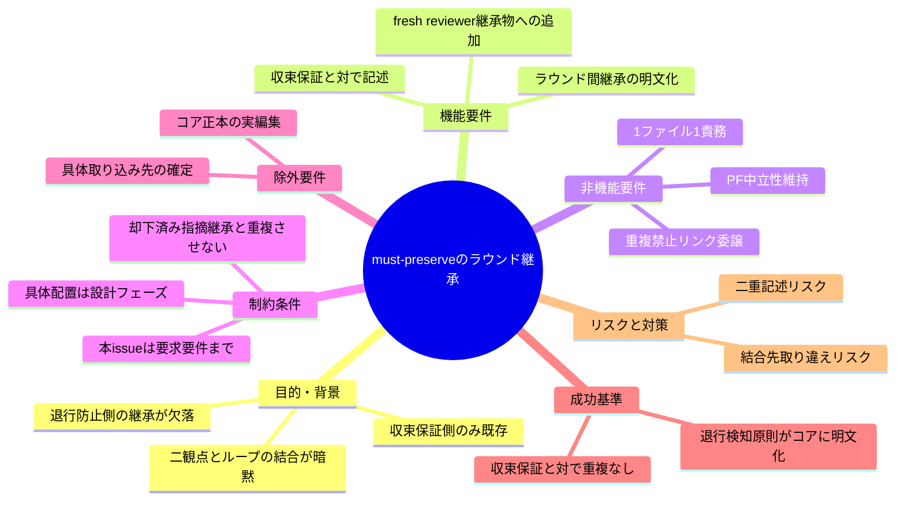
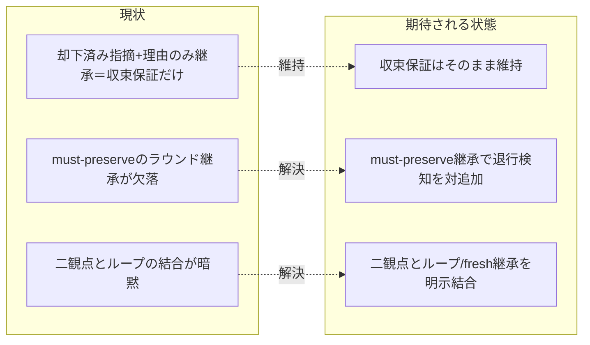

# 要求定義書: 二観点 must-preserve のラウンド継承

**プロジェクト名**: 二観点 must-preserve のラウンド継承
**作成日**: 2026 年 06 月 15 日
**最終更新**: 2026 年 06 月 15 日

> **重要**:
>
> - 要求定義書は、プロジェクトの全体像を把握するためのものです。詳細な技術仕様や実装方法は要件定義書以降で記載します。必要最低限の情報に収めることを心掛けてください。
> - **このドキュメントは常に更新**: 要求の変更や追加があった場合は、即座にこのドキュメントを更新してください。ドキュメントは「生きているドキュメント」として扱い、実装内容と常に同期させます。
> - **必須項目**: 以下の「必須」と明記した項目は空欄・抽象語のみ（例: 「{説明}」のまま）で提出しないこと。判定可能な形（目的は1文・成功基準は○/×で判定できる記載等）で記入すること。
>
> **用語**: [.agents/CONCEPTS.md §用語規約](../../../../../../.agents/CONCEPTS.md#用語規約) を参照。

---

## 要求定義の全体像

**注意**:

- 上記の「プロジェクト名」は例です。実際のプロジェクト名に置き換えてください。
- マインドマップは全体像を把握するためのものです。主要なセクション名程度に留め、詳細は記載しないでください。

---

## 1. 目的・背景

### 1.1 目的（必須）

must-preserve リストを各レビュー・ラウンドへ継承して退行を検知する原則をコアへ昇格する。

### 1.2 背景

- **現状の課題**:
  - 元ポリシー `REVIEW_DUAL_LENS_POLICY.md` 3 節・`IMPLEMENTATION_CLOSEOUT_POLICY.md` 8.2 節では、レビューは指摘 0 まで反復し、各ラウンドで **must-preserve（肯定的観点の産物＝壊してはならない不変条件）を継承**して、修正が不変条件を壊していないか毎ラウンド確認（退行検知）することを定めていた。fresh reviewer 構成時は **open 指摘＋却下済み指摘＋理由＋must-preserve リスト**を必ず継承し、収束保証と退行防止を両立させていた。
  - **コアの現状**: `.agents/commands/implement-feature.md`（§fresh サブ分割）は「**却下済みの指摘とその理由**を後続サブへ継承」と記載し、**収束保証（蒸し返し・無限反復の防止）のみ**を扱う。**must-preserve リストのラウンド継承（退行防止側）が欠落**している。
  - `.agents/REVIEW_DUAL_LENS.md` は二観点（敵対的＋肯定的）と両リスト（敵対的観点リスト・must-preserve リスト）の証跡要求は持つが、**「ラウンド間の継承」を明示していない**。§4 で「指摘 0 まで反復」のループ概念は RULES の実行モードを流用すると述べるのみで、ループと must-preserve の結合が暗黙のまま。
  - 結果として、収束保証（却下済み指摘＋理由の継承）は持つが、その対である退行防止（must-preserve のラウンド継承）が片側欠落しており、二観点導入の目的（退行・churn 防止）が反復レビューの過程で担保されない穴がある。

- **必要性**:
  - 二観点レビューが本来狙う「退行・churn 防止」を、単発レビューだけでなく**反復ループと fresh reviewer 構成をまたいでも**担保するため、must-preserve のラウンド継承をコアに明文化する必要がある。
  - 既存の収束保証（却下済み指摘＋理由継承）と**対**になる退行防止側を欠かさず置くことで、コアの品質ゲートの非対称な穴を塞ぐ必要がある。

#### 1.2.x 既出確認の結論

- close 済み `docs/maintainer/workflow/close/20260614_162712_コア取り込み候補調査/` は system-graph 固有ポリシーのコア取り込み**候補調査**であり、REVIEW_DUAL_LENS.md 等を生み出した元 issue（source）である。本 issue は同調査が取り込みきれなかった「must-preserve のラウンド継承（退行防止側）」の補完であり、調査自体の蒸し返しではない（別物）。
- 兄弟サブ（S1 取りこぼし防止＋既出確認 / S2 verify 報告様式の分離 / S3 モデル選定の裁量禁止 / S5 構造是正・アンカー是正）といずれも主題が重複しないことを確認した。本 issue（S4）は二観点 must-preserve のラウンド継承に限定する。

### 1.3 期待される効果（必須: 1 件以上）

- **効果 1**: コアに「must-preserve リストを各ラウンド／fresh reviewer に継承して退行を検知する」原則が明文化される（○/×: `.agents/` 内で must-preserve のラウンド継承を定める記述が 1 か所に存在するか）。
- **効果 2**: 既存の収束保証（却下済み指摘＋理由継承）と**対**で記述され、重複なくリンク整合する（○/×: 収束保証と退行防止が一対として読め、同一内容の二重記述が無いか）。
- **効果 3**: 二観点（REVIEW_DUAL_LENS）と反復ループ・fresh サブ分割（implement-feature）の結合が暗黙でなくなる（○/×: 二観点の must-preserve とループ／fresh 継承の関係が明示リンクで結ばれているか）。

**現状と期待される状態の比較**（必要に応じて）:

---

## 2. 機能要件

### 2.1 既存機能の維持（該当する場合）

- 既存の収束保証（fresh サブ分割で**却下済みの指摘とその理由**を後続サブへ継承し、蒸し返し・無限反復を防ぐ）を**そのまま維持**する。本 issue はこれを置換・改変しない。
- `.agents/REVIEW_DUAL_LENS.md` の二観点（敵対的＋肯定的）必須化・両リスト証跡要求を維持する。

### 2.2 新規機能要件

- **must-preserve のラウンド継承の明文化**: レビューを指摘 0 まで反復する過程で、must-preserve（不変条件）リストを**各ラウンドへ継承**し、修正が不変条件を壊していないか（退行）を毎ラウンド確認する原則をコアに明記する。
- **fresh reviewer 継承物への追加**: fresh サブ／fresh reviewer 構成時に継承する物に **must-preserve リスト**を加える（既存の「却下済み指摘＋理由」と**対**で、収束保証と退行防止を両立させる）。
- **結合の明示**: 二観点の must-preserve（REVIEW_DUAL_LENS）と反復ループ・fresh サブ分割（implement-feature）の結合を、重複なくリンクで結ぶ。

### 2.3 サブ issue の境界（本 issue の範囲）

- 本 issue は**要求・要件まで**（00／01）を作成する。02 設計以降（具体的な取り込み先＝REVIEW_DUAL_LENS.md への結合節追加か implement-feature.md §fresh サブ分割への継承物追加か、両者の整合）は設計フェーズで決定する。
- コア正本（`.agents/`）への実際の編集は本 issue では行わない。

---

## 3. 非機能要件

### 3.1 パフォーマンス

- 本 issue は要求・要件のみで、ランタイムのパフォーマンスに影響しない。コンテキスト効率を悪化させない最小記述とする。

### 3.2 セキュリティ

- 高リスク操作は伴わない。

### 3.3 互換性

- コアのマルチプラットフォーム（PF）中立性を維持する。具体ティア・固有値はコアに置かない。

### 3.4 保守性

- 1 ファイル 1 責務・重複禁止を守る。退行防止（must-preserve 継承）と収束保証（却下済み指摘＋理由継承）を**対**で記述し、同一内容を二重定義しない。既存正本へはリンクで委譲する。

---

## 4. 制約条件

### 4.1 技術的制約

- 収束保証（却下済み指摘＋理由の継承）は既存で持つため**重複させない**。退行防止（must-preserve 継承）を対として追加する形に限定する。
- PF 中立性を保ち、具体ティア・CI コマンド・固有値はコアに置かない（`.agents-project/` に委ねる）。

### 4.2 既存システムとの互換性

- `.agents/REVIEW_DUAL_LENS.md` の既存節（§1〜§5・汎用/固有境界）を改変・破壊せず、ループとの結合は直交追加とする（CORE.md の直交追加原則に整合）。
- `.agents/commands/implement-feature.md §fresh サブ分割` の既存記述（収束保証）を維持したまま継承物に must-preserve を加える。

### 4.3 移行期間・スケジュール

- 本 issue は親 issue「コア取り込み漏れ補完」配下の S4。要求・要件のみを成果物とし、設計以降は後続フェーズで扱う。

---

## 5. 除外要件

- コア正本（`.agents/REVIEW_DUAL_LENS.md`・`.agents/commands/implement-feature.md`）への実際の編集（設計・実装フェーズで扱う）。
- 具体的な取り込み先ファイルの最終確定（設計フェーズで決定）。
- 二観点そのものの再定義や収束保証の再記述（既存正本を維持し重複させない）。

---

## 6. 成功基準（必須: 1 件以上）

- コアに「must-preserve リストを各ラウンド／fresh reviewer に継承して退行を検知する」原則が明文化される（○/×で判定可能）。
- 既存の収束保証（却下済み指摘＋理由継承）と**対**で記述され、重複なくリンク整合している（○/×で判定可能）。
- 01_要件定義.md にユーザーストーリー・受け入れ基準・BDD シナリオが記載され、参照元（親 issue パス・親 issue_id）が明記されている（○/×で判定可能）。

---

## 7. リスクと対策

### 7.1 技術的リスク

- **リスク**: 収束保証（却下済み指摘＋理由）と退行防止（must-preserve）を二重記述してしまい、1 ファイル 1 責務・重複禁止に違反する。
  - **対策**: 両者を「収束保証／退行防止」の一対として整理し、既存記述を維持・参照しつつ欠落側のみ追加する。設計フェーズで取り込み先を 1 か所に確定する。

### 7.2 スケジュールリスク

- **リスク**: 結合先（REVIEW_DUAL_LENS 側か implement-feature 側か）の取り違えで、後続設計が手戻りする。
  - **対策**: 本 issue では取り込み先を確定せず候補（両ファイルの整合）として明記し、設計フェーズで判断する旨を境界として固定する。

---

## 8. 参考資料

### プロジェクトドキュメント

- 親 issue: [`docs/maintainer/workflow/20260615_055806_コア取り込み漏れ補完/00_要求定義.md`](../../00_要求定義.md)（issue_id: 434c7b86-4222-45e7-a0ef-1ae455f15313）
- [`.agents/REVIEW_DUAL_LENS.md`](../../../../../../.agents/REVIEW_DUAL_LENS.md) - 二観点・両リスト証跡要求の正本
- [`.agents/commands/implement-feature.md`](../../../../../../.agents/commands/implement-feature.md) - §fresh サブ分割（収束保証）・§クローズアウト

### その他の参考資料

- [`.agents/spec/01_設計原則.md`](../../../../../../.agents/spec/01_設計原則.md)・[`.agents/spec/06_設計判断の優先順位.md`](../../../../../../.agents/spec/06_設計判断の優先順位.md)

---

## 9. 次のステップ

この要求定義書の承認後、以下のドキュメントを作成します：

- **次**: [`01_要件定義.md`](./01_要件定義.md) - 要件定義フェーズ
