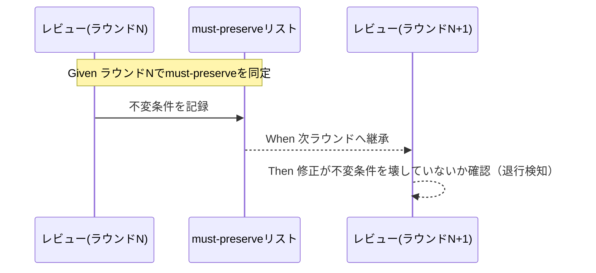

# 要件定義書: 二観点 must-preserve のラウンド継承

**プロジェクト名**: 二観点 must-preserve のラウンド継承
**作成日**: 2026 年 06 月 15 日
**最終更新**: 2026 年 06 月 15 日

> **重要**: **このドキュメントは常に更新**: 要件の変更や追加があった場合は、即座にこのドキュメントを更新してください。ドキュメントは「生きているドキュメント」として扱い、実装内容と常に同期させます。
>
> **用語**: [.agents/CONCEPTS.md §用語規約](../../../../../../.agents/CONCEPTS.md#用語規約) を参照。

---

## 参照元

- **親 issue**: `docs/maintainer/workflow/20260615_055806_コア取り込み漏れ補完/`（issue_id: `434c7b86-4222-45e7-a0ef-1ae455f15313`）
- **本サブ issue**（S4）: `docs/maintainer/workflow/20260615_055806_コア取り込み漏れ補完/90_issues/二観点mustpreserveのラウンド継承/`（issue_id: `ec64c606-7007-417a-a59e-3d221c81b8fb`）
- **コア該当正本**: [`.agents/REVIEW_DUAL_LENS.md`](../../../../../../.agents/REVIEW_DUAL_LENS.md)、[`.agents/commands/implement-feature.md §fresh サブ分割`](../../../../../../.agents/commands/implement-feature.md)
- **既出確認の結論**: close 済み `docs/maintainer/workflow/close/20260614_162712_コア取り込み候補調査/` は取り込み候補調査（本 issue の source）で別物。兄弟サブ（S1 取りこぼし防止＋既出確認 / S2 verify 報告様式分離 / S3 モデル選定裁量禁止 / S5 構造是正）と主題重複なしを確認のうえ起票した。

---

## 1. 概要

### 1.1 システム概要

二観点レビュー（敵対的＋肯定的）の肯定的観点が生む **must-preserve リスト（壊してはならない不変条件）** を、指摘 0 まで反復するレビュー・ラウンドおよび fresh reviewer／fresh サブ分割をまたいで**継承**し、各ラウンドで退行（不変条件の破壊）を検知する原則をコアへ昇格する。既存の収束保証（却下済み指摘＋理由の継承）と**対**で、欠落している退行防止側のみを追加する。

### 1.2 用語集

| 用語 | 説明 |
| ---- | ---- |
| must-preserve リスト | 肯定的観点が同定する「壊してはならない不変条件」（契約・後方互換・既存テストの前提・利用者が依存する振る舞い）の一覧。[REVIEW_DUAL_LENS.md §2.2/§3](../../../../../../.agents/REVIEW_DUAL_LENS.md) の産物。 |
| ラウンド継承 | レビューを指摘 0 まで反復する各ラウンドへ must-preserve リストを引き継ぎ、修正が不変条件を壊していないか毎回確認すること。 |
| 収束保証 | fresh サブ分割で却下済みの指摘とその理由を後続サブへ継承し、蒸し返し・無限反復を防ぐこと（既存。[implement-feature.md §fresh サブ分割](../../../../../../.agents/commands/implement-feature.md)）。 |
| 退行防止 | must-preserve のラウンド継承により、修正が既存の不変条件を壊す退行・churn を検知・抑止すること（本 issue で追加する対の片側）。 |

---

## 2. 機能要件

### 2.1 ユーザーストーリー

#### ストーリー 1: must-preserve をラウンド継承して退行を検知する

- **As a** コアのプロセス契約に従うレビュアー／オーケストレーター
- **I want to** レビューを反復する各ラウンドへ must-preserve リストを継承し、修正が不変条件を壊していないか毎ラウンド確認できるようにしたい
- **So that** 指摘 0 までの反復過程で退行・churn を見逃さず、二観点導入の目的（退行防止）を担保できる

**受け入れ基準**:

- コアに「must-preserve リストを各ラウンドへ継承し退行を検知する」原則が明文化されている。
- 既存の収束保証（却下済み指摘＋理由継承）を改変せず、対として退行防止が追加されている。

#### ストーリー 2: fresh reviewer 構成でも退行防止を引き継ぐ

- **As a** fresh サブ／fresh reviewer を構成するオーケストレーター
- **I want to** 後続サブへ継承する物に must-preserve リストを加えたい（既存の却下済み指摘＋理由に対で）
- **So that** 文脈をリセットしても収束保証と退行防止の両方が維持される

**受け入れ基準**:

- fresh サブ分割の継承物に must-preserve リストが含まれる旨が明記されている。
- 収束保証（却下済み指摘＋理由）と退行防止（must-preserve）が**対**で、重複なく記述されている。

#### ストーリー 3: 二観点と反復ループの結合が明示される

- **As a** REVIEW_DUAL_LENS と implement-feature の両方を読む保守者
- **I want to** 二観点の must-preserve と反復ループ／fresh 継承の結合を明示リンクで把握したい
- **So that** 結合が暗黙のままにならず、1 ファイル 1 責務・重複禁止を保ったまま整合を確認できる

**受け入れ基準**:

- 二観点（REVIEW_DUAL_LENS）と反復ループ・fresh サブ分割（implement-feature）の結合がリンクで結ばれ、同一内容の二重記述が無い。

### 2.2 BDD ユースケース

#### ユースケース 1: 反復レビューでの must-preserve ラウンド継承

レビューを指摘 0 まで反復する過程で must-preserve を継承し退行を検知する。

**シナリオ 1: 各ラウンドへの継承と退行検知**

```gherkin
Feature: must-preserve のラウンド継承
  Scenario: 反復レビューで不変条件の退行を検知する
    Given レビュー第 N ラウンドで must-preserve リスト（不変条件）が同定されている
    When 指摘修正後の第 N+1 ラウンドのレビューを行う
    Then 継承した must-preserve リストに照らして修正が不変条件を壊していないか確認され
    And 退行があれば要修正として検知される
```

**処理フロー**（必要に応じて）:



**シナリオ 2: 収束保証と退行防止の両立（重複なし）**

```gherkin
Feature: 収束保証と退行防止の対
  Scenario: 既存の収束保証を壊さず退行防止を追加する
    Given fresh サブ分割が却下済み指摘とその理由を継承している（収束保証・既存）
    When 退行防止として must-preserve のラウンド継承をコアに追加する
    Then 収束保証の記述は改変されず維持され
    And 退行防止が対として重複なくリンク整合で追加される
```

#### ユースケース 2: fresh reviewer 構成での継承物

fresh サブ／fresh reviewer を構成するときの継承物に must-preserve を加える。

**シナリオ 1: 継承物に must-preserve を含める**

```gherkin
Feature: fresh reviewer 継承物
  Scenario: 文脈リセット後も退行防止を引き継ぐ
    Given fresh サブを構成する
    When 後続サブへ継承する物を組み立てる
    Then 却下済み指摘とその理由（収束保証）に加え must-preserve リスト（退行防止）が継承される
```

### 2.3 ビジネスルール

- 収束保証（却下済み指摘＋理由の継承）は既存で持つため**重複させない**。退行防止（must-preserve 継承）を対として追加する形に限定する。
- 1 ファイル 1 責務・重複禁止を守り、既存正本へはリンクで委譲する。
- PF 中立性を維持し、具体ティア・固有値はコアに置かない。
- 本 issue は要求・要件まで。具体的な取り込み先（REVIEW_DUAL_LENS への結合節か implement-feature §fresh サブ分割への継承物追加か、両者の整合）は設計フェーズで決定する。

---

## 3. 非機能要件

### 3.1 パフォーマンス要件

- 要求・要件のみの成果物であり、ランタイム性能に影響しない。最小記述でコンテキスト効率を悪化させない。

### 3.2 セキュリティ要件

- 高リスク操作を伴わない。

### 3.3 ユーザビリティ要件

- 収束保証と退行防止が一対として読め、保守者が結合を辿れること。

### 3.4 可用性要件

- 該当なし（ドキュメント成果物）。

---

## 4. 外部インターフェース要件

### 4.1 API 要件

- 該当なし。

### 4.2 データ形式要件

- 00／01 はテンプレート（`.workflow/templates/`）の見出し・必須セクションに従う。00 frontmatter に issue_id、01 参照元に親 issue パス・親 issue_id を明記する。

---

## 5. 制約事項

- 収束保証の記述を改変・再記述しない（重複禁止）。
- `.agents/REVIEW_DUAL_LENS.md` の既存節を改変せず直交追加とする。
- コア正本への実編集・取り込み先の最終確定は本 issue の範囲外（設計以降）。

---

## 6. 参考資料

### プロジェクトドキュメント

- [`00_要求定義.md`](./00_要求定義.md) - 要求定義
- 親: [`docs/maintainer/workflow/20260615_055806_コア取り込み漏れ補完/00_要求定義.md`](../../00_要求定義.md)

### その他の参考資料

- [`.agents/REVIEW_DUAL_LENS.md`](../../../../../../.agents/REVIEW_DUAL_LENS.md)
- [`.agents/commands/implement-feature.md`](../../../../../../.agents/commands/implement-feature.md)

---

## 7. 前のステップ

この要件定義書は、以下のドキュメントを基に作成されています：

- **前**: [`00_要求定義.md`](./00_要求定義.md) - 要求定義フェーズ

---

## 8. 次のステップ

この要件定義書の承認後、以下のドキュメントを作成します：

- **次**: [`02_設計.md`](./02_設計.md) - 設計フェーズ
